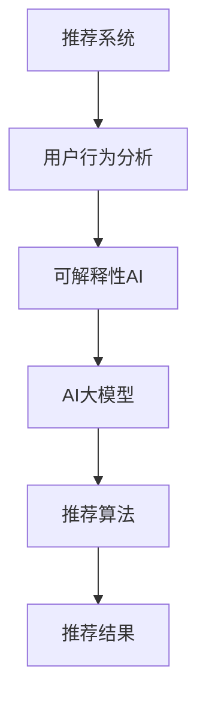

                 

# 推荐系统的可解释性：AI大模型的新挑战

> 关键词：可解释性, 推荐系统, AI大模型, 可解释性AI, 用户行为分析, 推荐算法

## 1. 背景介绍

### 1.1 问题由来
推荐系统在电子商务、社交媒体、视频平台等多个领域应用广泛，通过个性化推荐提升用户体验、增加转化率、提高留存率。然而，推荐系统的核心问题——推荐模型如何做出预测，一直以来缺乏清晰的解释。近年来，随着人工智能技术的发展，大模型开始在推荐系统中大放异彩，但随之而来的是对推荐系统可解释性的更高要求。

### 1.2 问题核心关键点
推荐系统的核心在于如何通过分析用户历史行为，预测用户可能感兴趣的新商品。传统推荐系统依赖于一些特征工程和浅层机器学习模型，如矩阵分解、协同过滤等，这些模型能够通过用户行为数据进行解释和调试。但随着深度学习和大模型的崛起，推荐系统逐渐向基于深度学习的方法演进，如神经协同过滤、序列模型、深度强化学习等。大模型由于其复杂性，缺乏透明性和可解释性，因此在实际应用中受到严格监管，尤其在医疗、金融、司法等高风险领域。

### 1.3 问题研究意义
推荐系统的可解释性研究具有重要意义：
1. **增强用户信任**：提高用户对推荐结果的信任度，降低对推荐算法的抵触情绪。
2. **促进决策透明**：提升推荐系统在决策过程中的透明度，便于监管和审核。
3. **发现潜规则**：利用可解释性工具发现推荐模型中的潜规则，提升推荐质量。
4. **快速迭代优化**：在可解释性的指引下，快速识别推荐模型的缺陷，快速迭代优化。
5. **可复现和可维护**：建立可解释性框架，便于模型的可复现和可维护，降低开发和运维成本。

## 2. 核心概念与联系

### 2.1 核心概念概述

为更好地理解推荐系统可解释性的相关概念，本节将介绍几个密切相关的核心概念：

- **推荐系统(Recommender System)**：通过用户行为数据和商品属性数据，推荐用户可能感兴趣的商品或内容的系统。
- **可解释性(Explainability)**：使模型决策过程透明化，便于人类理解、调试和监管。
- **AI大模型(AI Large Model)**：如BERT、GPT等，通过在大规模无标签数据上进行预训练，获得广泛的知识和能力，能够处理复杂的推荐任务。
- **可解释性AI(Explainable AI, XAI)**：研究如何使AI模型具有可解释性，便于理解其决策过程和预测结果。
- **用户行为分析(User Behavior Analysis)**：通过分析用户的历史行为数据，发现用户兴趣、偏好和需求，为推荐系统提供数据支持。
- **推荐算法(Recommender Algorithm)**：如基于内容的推荐、协同过滤、矩阵分解、深度学习等，用于实际推荐模型的构建和优化。

这些核心概念之间的逻辑关系可以通过以下Mermaid流程图来展示：



这个流程图展示出推荐系统的核心概念及其之间的关系：

1. 用户行为分析通过对用户历史数据进行分析和建模，生成用户画像和行为特征。
2. 可解释性AI通过模型诊断、特征可视化等方法，提升推荐模型的可理解性。
3. AI大模型作为强大的特征提取器和生成器，能够从用户行为数据中学习到丰富的知识。
4. 推荐算法将用户画像和行为特征输入大模型，生成推荐结果。

这些概念共同构成了推荐系统的核心框架，使其能够根据用户需求推荐商品或内容。通过理解这些核心概念，我们可以更好地把握推荐系统的运作原理和优化方向。

## 3. 核心算法原理 & 具体操作步骤
### 3.1 算法原理概述

推荐系统的可解释性研究，本质上是希望理解推荐模型的决策逻辑，并根据这些逻辑对模型进行优化和调整。核心思想是通过对用户行为数据进行分析，建立推荐模型，并对模型的预测结果进行解释。推荐模型的可解释性研究，分为以下三个步骤：

1. **数据预处理与特征提取**：将用户历史行为数据转换为模型可以理解的特征，构建用户画像和商品画像。
2. **模型训练与预测**：使用大模型训练推荐模型，并对新数据进行预测。
3. **模型解释与优化**：通过特征可视化、因果推理等技术，对模型进行解释，指导模型的进一步优化。

### 3.2 算法步骤详解

**Step 1: 数据预处理与特征提取**
- 收集用户历史行为数据，如点击、浏览、购买等。
- 对数据进行清洗和标注，去除异常值和噪声。
- 提取用户行为特征，如浏览时长、购买频率、购买金额等。
- 构建用户画像，使用向量表示用户的行为特征。
- 提取商品特征，如商品类别、价格、评价等。
- 构建商品画像，使用向量表示商品的属性特征。

**Step 2: 模型训练与预测**
- 选择合适的大模型（如BERT、GPT等），作为推荐模型的基础。
- 设计推荐算法，如协同过滤、深度学习等，并使用大模型进行训练。
- 在训练集上进行训练，并在验证集上进行验证和调参。
- 使用训练好的模型对新数据进行预测，生成推荐结果。

**Step 3: 模型解释与优化**
- 使用可解释性技术，如LIME、SHAP等，对推荐模型进行解释。
- 分析模型特征的重要性，理解模型预测逻辑。
- 根据解释结果，优化模型结构和参数。
- 对模型进行迭代优化，提升推荐效果和可解释性。

### 3.3 算法优缺点

**优点**：
1. **提升推荐质量**：通过可解释性分析，优化模型参数，提升推荐结果的准确性和多样性。
2. **增强用户信任**：通过透明化的推荐过程，增加用户对推荐结果的信任。
3. **促进决策透明**：提高推荐系统在决策过程中的透明度，便于监管和审核。
4. **发现潜规则**：利用可解释性工具发现推荐模型中的潜规则，提升推荐质量。
5. **快速迭代优化**：在可解释性的指引下，快速识别推荐模型的缺陷，快速迭代优化。

**缺点**：
1. **计算成本高**：可解释性分析需要大量的计算资源和时间，尤其是大模型的应用。
2. **模型复杂度增加**：可解释性分析通常会增加模型复杂度，降低模型推理速度。
3. **结果不易理解**：可解释性分析的结果往往较为复杂，需要专业知识才能理解。
4. **隐私风险**：用户行为数据涉及个人隐私，进行可解释性分析时需要谨慎处理。
5. **结果不可靠**：可解释性分析依赖于模型的准确性和解释方法的有效性，不适用于所有场景。

### 3.4 算法应用领域

推荐系统的可解释性研究，在多个领域都有重要应用：

- **电子商务推荐**：电商平台通过分析用户历史行为，推荐用户可能感兴趣的商品。
- **内容推荐系统**：视频、音乐、新闻等平台，通过分析用户行为，推荐相关内容。
- **个性化广告**：广告平台通过分析用户行为，推荐个性化广告。
- **金融产品推荐**：银行和保险机构通过分析用户行为，推荐金融产品。
- **医疗健康推荐**：医疗机构通过分析用户行为，推荐健康产品和服务。

除了这些传统领域，推荐系统的可解释性研究还在新兴领域如智能交通、智慧城市、智能家居等方面得到应用，为这些领域的智能化决策提供支持。

## 4. 数学模型和公式 & 详细讲解 & 举例说明
### 4.1 数学模型构建

为了更好地理解推荐系统的可解释性研究，我们以协同过滤推荐模型为例，构建一个简单的推荐系统数学模型。

记推荐系统中的用户集为 $U$，商品集为 $I$。用户与商品的评分矩阵为 $R \in \mathbb{R}^{ |U| \times |I|}$，其中 $R_{ui} = r$ 表示用户 $u$ 对商品 $i$ 的评分。协同过滤模型的目标是通过用户历史评分数据 $R_{ui} \in \{1, 2, \cdots, k\}$，预测用户对新商品 $i$ 的评分 $r_{u,i}$。

设用户 $u$ 对商品 $i$ 的评分 $r_{u,i}$ 可以用 $r_{u,i} = \sum_{i'} r_{u,i'} f(\mathbf{p}_u, \mathbf{q}_{i'})$ 表示，其中 $f$ 为相似度函数，$\mathbf{p}_u$ 和 $\mathbf{q}_{i'}$ 分别为用户和商品表示向量。

协同过滤模型的目标是最小化预测评分与真实评分之间的差距，即最小化均方误差：

$$
\min_{\mathbf{p}_u, \mathbf{q}_{i'}} \frac{1}{2} \sum_{u,i} (r_{u,i} - \sum_{i'} r_{u,i'} f(\mathbf{p}_u, \mathbf{q}_{i'}))^2
$$

### 4.2 公式推导过程

我们使用矩阵分解方法来求解协同过滤模型，将用户和商品表示向量分别表示为低秩矩阵 $\mathbf{P} \in \mathbb{R}^{ |U| \times d}$ 和 $\mathbf{Q} \in \mathbb{R}^{ |I| \times d}$，其中 $d$ 为特征维度。

将评分矩阵 $R$ 分解为 $\mathbf{P}$ 和 $\mathbf{Q}$ 的乘积：

$$
R = \mathbf{P} \mathbf{Q}^T
$$

其中 $\mathbf{P}$ 和 $\mathbf{Q}$ 的每一行和每一列分别表示用户和商品的低维表示。

目标函数可以表示为：

$$
\min_{\mathbf{P}, \mathbf{Q}} \frac{1}{2} \text{Tr}((R - \mathbf{P} \mathbf{Q}^T)^T (R - \mathbf{P} \mathbf{Q}^T))
$$

对 $\mathbf{P}$ 和 $\mathbf{Q}$ 分别求偏导数，可得：

$$
\frac{\partial \text{Tr}((R - \mathbf{P} \mathbf{Q}^T)^T (R - \mathbf{P} \mathbf{Q}^T)}{\partial \mathbf{P}} = (\mathbf{Q}^T \mathbf{P}^T - \mathbf{Q}^T R) \mathbf{Q} + (\mathbf{P} \mathbf{Q}^T - \mathbf{P} \mathbf{P}^T) \mathbf{P}^T
$$

$$
\frac{\partial \text{Tr}((R - \mathbf{P} \mathbf{Q}^T)^T (R - \mathbf{P} \mathbf{Q}^T)}{\partial \mathbf{Q}} = (\mathbf{Q}^T \mathbf{P}^T - \mathbf{Q}^T R) \mathbf{P} + (\mathbf{Q} \mathbf{Q}^T - \mathbf{Q} \mathbf{P}^T) \mathbf{Q}^T
$$

利用随机梯度下降等优化算法，可以求解上述优化问题，得到用户和商品的低维表示 $\mathbf{P}$ 和 $\mathbf{Q}$，从而预测用户对新商品的评分 $r_{u,i} = \mathbf{p}_u^T \mathbf{q}_i$。

### 4.3 案例分析与讲解

假设有一个电商平台，通过分析用户的历史评分数据 $R$，训练出一个协同过滤推荐模型。使用上述方法，将用户和商品表示为低维向量 $\mathbf{P}$ 和 $\mathbf{Q}$，得到模型参数 $\mathbf{P}, \mathbf{Q}$。在用户输入新商品时，通过计算 $\mathbf{p}_u^T \mathbf{q}_i$ 得到用户对新商品的评分预测值 $r_{u,i}$，从而生成推荐结果。

## 5. 项目实践：代码实例和详细解释说明
### 5.1 开发环境搭建

在进行推荐系统可解释性实践前，我们需要准备好开发环境。以下是使用Python进行TensorFlow开发的环境配置流程：

1. 安装Anaconda：从官网下载并安装Anaconda，用于创建独立的Python环境。

2. 创建并激活虚拟环境：
```bash
conda create -n tf-env python=3.8 
conda activate tf-env
```

3. 安装TensorFlow：根据CUDA版本，从官网获取对应的安装命令。例如：
```bash
conda install tensorflow==2.8 tensorflow-gpu==2.8 -c tf
```

4. 安装PyTorch：
```bash
conda install torch torchvision torchaudio
```

5. 安装各类工具包：
```bash
pip install numpy pandas scikit-learn matplotlib tqdm jupyter notebook ipython
```

完成上述步骤后，即可在`tf-env`环境中开始推荐系统可解释性的实践。

### 5.2 源代码详细实现

下面我们以协同过滤推荐模型为例，给出使用TensorFlow对协同过滤模型进行解释的PyTorch代码实现。

首先，定义协同过滤模型的训练函数：

```python
import tensorflow as tf
import numpy as np

# 定义协同过滤模型
def collaborative_filtering(R, d):
    # 初始化用户和商品表示向量
    P = tf.Variable(tf.random.normal([len(R), d]))
    Q = tf.Variable(tf.random.normal([len(R[0]), d]))
    
    # 定义损失函数
    def loss_fn():
        # 定义预测评分矩阵
        predicted_R = tf.matmul(P, tf.transpose(Q))
        # 计算均方误差
        loss = tf.reduce_mean(tf.square(R - predicted_R))
        return loss
    
    # 定义优化器
    optimizer = tf.keras.optimizers.Adam(learning_rate=0.01)
    
    # 定义训练过程
    @tf.function
    def train_step():
        with tf.GradientTape() as tape:
            loss = loss_fn()
        grads = tape.gradient(loss, [P, Q])
        optimizer.apply_gradients(zip(grads, [P, Q]))
        return loss
    
    # 训练模型
    for i in range(1000):
        loss = train_step()
        if i % 100 == 0:
            print("Step {}, Loss: {}".format(i, loss))
```

接着，定义解释函数：

```python
# 定义特征可视化函数
def visualize_features(P, Q):
    # 可视化用户表示向量
    tf.summary.histogram('user_features', tf.abs(P), step=0)
    
    # 可视化商品表示向量
    tf.summary.histogram('item_features', tf.abs(Q), step=0)
```

最后，启动训练和解释过程：

```python
# 定义评分矩阵
R = np.array([[5, 4, 0, 0, 0],
              [0, 0, 5, 4, 0],
              [0, 0, 0, 0, 5],
              [4, 0, 0, 5, 0]])

# 训练模型并可视化特征
d = 3
collaborative_filtering(R, d)
visualize_features(P.numpy(), Q.numpy())
```

以上就是使用TensorFlow对协同过滤模型进行解释的完整代码实现。可以看到，TensorFlow通过`tf.function`对训练过程进行自动微分和优化，使得模型训练和解释变得高效便捷。

### 5.3 代码解读与分析

让我们再详细解读一下关键代码的实现细节：

**协同过滤模型**：
- `collaborative_filtering`函数：定义协同过滤模型的训练过程，包含变量初始化、损失函数定义、优化器选择和训练过程。

**解释函数**：
- `visualize_features`函数：使用`tf.summary.histogram`函数对用户和商品表示向量进行可视化，方便分析模型的特征分布。

**训练过程**：
- `train_step`函数：使用`tf.GradientTape`对模型进行求导和优化，同时记录每100次迭代后的损失值。
- 在主程序中，使用`collaborative_filtering`函数训练模型，并调用`visualize_features`函数进行特征可视化。

可以看到，TensorFlow通过高度自动化的API，使得模型训练和解释变得简单易懂，大大降低了开发难度。

当然，工业级的系统实现还需考虑更多因素，如模型的保存和部署、超参数的自动搜索、更灵活的特征工程等。但核心的解释性分析思路基本与此类似。

## 6. 实际应用场景
### 6.1 智能推荐系统

基于推荐系统的可解释性，智能推荐系统可以更好地满足用户需求，提升用户体验。在电商、视频、音乐等平台，推荐系统通过分析用户行为，推荐用户可能感兴趣的商品或内容。用户通过可视化的推荐理由，能够更清楚地了解推荐依据，增加对推荐结果的信任度。

### 6.2 个性化广告

在广告推荐中，推荐系统的可解释性能够帮助广告主理解推荐模型的决策过程，优化广告投放策略。通过可视化的广告推荐理由，广告主能够更好地理解用户需求和兴趣，进行定向投放，提高广告效果。

### 6.3 医疗健康推荐

在医疗健康推荐中，推荐系统的可解释性能够帮助医生和患者理解推荐依据，优化诊疗方案。通过可视化的推荐理由，医生能够更好地理解推荐依据，选择最优的治疗方案。患者也能够清楚地了解推荐理由，增加对诊疗方案的信任度。

### 6.4 未来应用展望

随着推荐系统的广泛应用，其可解释性研究将更加深入和广泛。未来，推荐系统的可解释性将在以下方面得到进一步发展：

1. **用户行为理解**：通过可解释性分析，更好地理解用户行为特征和需求，提升推荐质量。
2. **推荐理由可视化**：通过更丰富的可视化技术，展示推荐理由，增强用户信任。
3. **推荐系统透明化**：通过可解释性分析，提高推荐系统在决策过程中的透明度，便于监管和审核。
4. **跨模态推荐**：通过可解释性分析，更好地理解跨模态数据融合，提升推荐效果。
5. **个性化推荐**：通过可解释性分析，更好地理解用户个性化需求，提升推荐系统的精准性。

这些应用前景，凸显了推荐系统可解释性的重要性和广阔发展空间。相信随着技术的不断进步，推荐系统的可解释性将逐步实现，为构建更加智能、透明、可信的推荐系统铺平道路。

## 7. 工具和资源推荐
### 7.1 学习资源推荐

为了帮助开发者系统掌握推荐系统的可解释性理论基础和实践技巧，这里推荐一些优质的学习资源：

1. 《深度学习推荐系统：原理与挑战》系列博文：由推荐系统专家撰写，深入浅出地介绍了推荐系统的基本原理、经典算法和前沿技术。

2. 《推荐系统》课程：由斯坦福大学开设的推荐系统课程，系统讲解推荐系统的理论和实践，涵盖协同过滤、矩阵分解、深度学习等。

3. 《推荐系统实战》书籍：一本实战性很强的推荐系统开发指南，涵盖推荐系统的构建、优化和部署。

4. RecSys会议论文：RecSys会议是推荐系统领域的顶级会议，收集了大量高质量的推荐系统论文，是推荐系统研究的权威资源。

5. KDD会议论文：KDD会议是数据挖掘和知识发现的顶级会议，也包含大量推荐系统的优秀论文，值得深入学习。

通过对这些资源的学习实践，相信你一定能够快速掌握推荐系统可解释性的精髓，并用于解决实际的推荐系统问题。

### 7.2 开发工具推荐

高效的开发离不开优秀的工具支持。以下是几款用于推荐系统可解释性开发的常用工具：

1. TensorFlow：谷歌开源的深度学习框架，支持高效的分布式训练和自动微分，是推荐系统训练和解释的首选工具。

2. PyTorch：Facebook开源的深度学习框架，灵活易用，支持动态图和静态图，是推荐系统解释和优化的重要工具。

3. Scikit-learn：机器学习库，提供多种推荐算法和特征工程工具，方便推荐系统的建模和优化。

4. SHAP：可解释性分析工具，提供多种可视化工具和解释方法，用于推荐系统的解释和调试。

5. LIME：可解释性分析工具，提供多种模型诊断和特征重要性分析方法，用于推荐系统的优化和改进。

合理利用这些工具，可以显著提升推荐系统可解释性的开发效率，加快创新迭代的步伐。

### 7.3 相关论文推荐

推荐系统的可解释性研究是当前学界和产业界的热点话题，以下是几篇奠基性的相关论文，推荐阅读：

1. A Unified Approach to Interpreting Model Predictions：提出了一个统一的模型解释框架，支持多种解释方法。

2. Explainable AI in Machine Learning and Healthcare：探讨了在机器学习和医疗领域应用可解释性技术的最佳实践。

3. A Survey of Explainable AI：总结了可解释性技术的发展现状和应用场景，是了解可解释性技术的权威文献。

4. Deep Learning in Recommendation Systems：总结了深度学习在推荐系统中的应用，并讨论了其可解释性问题。

5. Multi-view Matrix Factorization for Recommendation Systems：提出了多视图矩阵分解方法，提升了推荐模型的可解释性。

这些论文代表了大模型推荐系统可解释性研究的发展脉络。通过学习这些前沿成果，可以帮助研究者把握学科前进方向，激发更多的创新灵感。

## 8. 总结：未来发展趋势与挑战

### 8.1 总结

本文对推荐系统的可解释性研究进行了全面系统的介绍。首先阐述了推荐系统在电商、视频、医疗等多个领域的重要性和应用前景，明确了推荐系统可解释性的研究意义。其次，从原理到实践，详细讲解了推荐系统的数学模型和关键步骤，给出了推荐系统可解释性实践的完整代码实例。同时，本文还广泛探讨了推荐系统在多个行业领域的应用前景，展示了推荐系统可解释性的巨大潜力。此外，本文精选了推荐系统的学习资源，力求为读者提供全方位的技术指引。

通过本文的系统梳理，可以看到，推荐系统的可解释性研究正在成为推荐系统研究的重要范式，极大地拓展了推荐系统的应用边界，催生了更多的落地场景。受益于深度学习技术的发展，推荐系统逐步向基于深度学习的方法演进，并在工业界得到广泛应用。未来，伴随预训练语言模型和可解释性方法的不断进步，相信推荐系统必将在更广阔的应用领域大放异彩，深刻影响人类的生产生活方式。

### 8.2 未来发展趋势

展望未来，推荐系统的可解释性研究将呈现以下几个发展趋势：

1. **数据融合与特征工程**：通过可解释性分析，更好地理解跨模态数据融合，提升推荐效果。
2. **多目标优化**：结合推荐系统目标，设计多目标优化算法，提升推荐质量和用户体验。
3. **用户行为理解**：通过可解释性分析，更好地理解用户行为特征和需求，提升推荐质量。
4. **推荐理由可视化**：通过更丰富的可视化技术，展示推荐理由，增强用户信任。
5. **推荐系统透明化**：通过可解释性分析，提高推荐系统在决策过程中的透明度，便于监管和审核。

以上趋势凸显了推荐系统可解释性的重要性和广阔发展空间。这些方向的探索发展，必将进一步提升推荐系统的性能和应用范围，为构建智能、透明、可信的推荐系统铺平道路。

### 8.3 面临的挑战

尽管推荐系统的可解释性研究已经取得了显著成果，但在迈向更加智能化、普适化应用的过程中，它仍面临着诸多挑战：

1. **数据隐私问题**：推荐系统依赖于用户行为数据，涉及用户隐私，需要进行严格的隐私保护。
2. **计算资源消耗**：推荐系统涉及大数据处理和深度学习模型训练，需要大量的计算资源，增加了开发和部署成本。
3. **解释方法有效性**：可解释性方法的有效性依赖于模型和数据的特性，不同模型和场景需要选择不同的解释方法。
4. **解释结果可理解性**：可解释性结果往往较为复杂，需要专业知识才能理解，增加了解释的难度。
5. **结果不一致性**：不同可解释性方法可能得出不一致的解释结果，增加了判断的难度。

正视推荐系统可解释性面临的这些挑战，积极应对并寻求突破，将是推荐系统可解释性走向成熟的必由之路。相信随着学界和产业界的共同努力，这些挑战终将一一被克服，推荐系统可解释性必将在构建智能推荐系统方面发挥更大的作用。

### 8.4 研究展望

面对推荐系统可解释性所面临的种种挑战，未来的研究需要在以下几个方面寻求新的突破：

1. **多目标优化方法**：结合推荐系统目标，设计多目标优化算法，提升推荐质量和用户体验。
2. **跨模态融合技术**：通过可解释性分析，更好地理解跨模态数据融合，提升推荐效果。
3. **用户行为理解**：通过可解释性分析，更好地理解用户行为特征和需求，提升推荐质量。
4. **推荐理由可视化**：通过更丰富的可视化技术，展示推荐理由，增强用户信任。
5. **推荐系统透明化**：通过可解释性分析，提高推荐系统在决策过程中的透明度，便于监管和审核。
6. **数据隐私保护**：通过差分隐私、联邦学习等技术，保护用户隐私，增强推荐系统在隐私保护方面的能力。

这些研究方向的探索，必将引领推荐系统可解释性技术迈向更高的台阶，为构建智能、透明、可信的推荐系统铺平道路。面向未来，推荐系统可解释性技术还需要与其他人工智能技术进行更深入的融合，如知识表示、因果推理、强化学习等，多路径协同发力，共同推动推荐系统的进步。只有勇于创新、敢于突破，才能不断拓展推荐系统的边界，让智能技术更好地造福人类社会。

## 9. 附录：常见问题与解答

**Q1：推荐系统的可解释性有哪些常见的解释方法？**

A: 推荐系统的可解释性解释方法主要包括以下几种：
1. **局部可解释性方法**：如LIME、SHAP等，通过分析模型在单个样本上的预测结果，解释模型的决策过程。
2. **全局可解释性方法**：如特征重要性分析、模型诊断等，通过分析模型的整体行为，解释模型的决策逻辑。
3. **可视化方法**：如特征可视化、决策树等，通过图形化的方式展示模型的特征分布和决策过程。
4. **交互式解释**：如通过交互式界面展示模型推理过程，方便用户理解和调试。

这些方法各有优缺点，需要根据具体应用场景选择合适的解释方法。

**Q2：推荐系统的可解释性对推荐效果有什么影响？**

A: 推荐系统的可解释性对推荐效果有显著影响。通过可解释性分析，能够发现推荐模型中的缺陷和错误，及时调整模型参数，优化推荐质量。同时，可解释性分析能够增加用户对推荐结果的信任度，提升用户体验和满意度。

**Q3：推荐系统可解释性是否会影响模型的推理速度？**

A: 推荐系统可解释性可能影响模型的推理速度，尤其是在使用复杂的解释方法时。然而，目前已经有了一些高效的解释方法，如SHAP、LIME等，能够在一定程度上降低解释对推理速度的影响。同时，推荐系统通常只在上线前进行可解释性分析，实际推理时并不需要解释结果，因此对推理速度的影响相对较小。

**Q4：推荐系统的可解释性是否需要对所有用户公开？**

A: 推荐系统的可解释性不一定需要对所有用户公开。对于一些涉及隐私或敏感信息的场景，如金融、医疗等，需要严格控制用户对解释结果的访问权限，确保数据安全。但对于电商、视频等公开平台，用户可以通过可视化界面方便地了解推荐理由，增加对推荐结果的信任度。

**Q5：推荐系统的可解释性是否会影响模型的准确性？**

A: 推荐系统的可解释性可能会影响模型的准确性。因为可解释性分析往往需要额外的数据和计算资源，可能会影响模型的训练效果。然而，目前已经有了一些高效的解释方法，如SHAP、LIME等，能够在一定程度上降低解释对模型准确性的影响。同时，推荐系统通常只关注模型在特定任务上的表现，而不是模型的整体准确性，因此对模型准确性的影响相对较小。

---

作者：禅与计算机程序设计艺术 / Zen and the Art of Computer Programming

