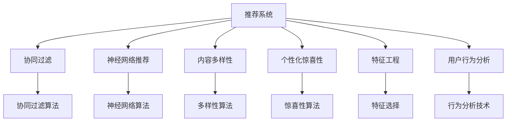

                 

# 推荐系统的多样性和惊喜性优化

> 关键词：推荐系统,多样性,惊喜性,深度学习,协同过滤,神经网络,特征工程,用户行为分析

## 1. 背景介绍

### 1.1 问题由来
推荐系统在现代信息技术和电子商务领域得到了广泛应用，从商品推荐、内容推荐到个性化信息推荐，都极大地提升了用户体验。但传统的推荐算法往往忽略了用户多样性和个性化需求，导致推荐内容缺乏惊喜性，难以满足用户独特的兴趣和预期。为了提升推荐系统的效果和用户体验，我们需要在算法中引入多样性和惊喜性优化，以更好地适应用户的动态变化需求。

### 1.2 问题核心关键点
推荐系统的多样性和惊喜性优化，旨在通过多维度的数据挖掘和机器学习技术，使推荐结果更加多样化且具惊喜性。这一优化涉及以下几个核心关键点：

- 用户画像构建：通过对用户历史行为、兴趣偏好、社交关系等多维度的数据进行深度挖掘，生成精细化的用户画像。
- 推荐策略设计：设计多种推荐算法，如协同过滤、神经网络推荐等，综合不同模型的优点，提升推荐的全面性。
- 内容多样性引入：在推荐算法中引入多样性约束，避免推荐结果过于集中。
- 个性化惊喜性增强：通过设计多样化推荐规则和惊喜性算法，使推荐结果更加符合用户的个性化需求和兴趣变化。
- 数据处理和特征工程：在数据处理和特征选择上，采用高效率、高精度的算法和策略，保证推荐结果的准确性和多样性。

这些关键点共同构成了推荐系统多样性和惊喜性优化的技术框架，有助于提升推荐系统的智能度和用户体验。

## 2. 核心概念与联系

### 2.1 核心概念概述

为更好地理解推荐系统的多样性和惊喜性优化方法，本节将介绍几个密切相关的核心概念：

- 推荐系统(Recommendation System)：利用用户历史行为、兴趣偏好、物品属性等数据，为用户提供个性化推荐内容的技术。
- 协同过滤(Collaborative Filtering)：通过分析用户和物品的协同关系，预测用户对未交互物品的偏好。
- 神经网络推荐(Neural Network Recommendation)：基于深度学习架构，从用户和物品特征中挖掘高阶交互关系，实现更加精准的推荐。
- 内容多样性(Content Diversity)：通过算法设计和约束，保证推荐结果的多样性，避免同质化。
- 个性化惊喜性(Personalized Surprise)：通过设计和优化推荐策略，使推荐结果具备更高的个性化和惊喜性，满足用户的独特需求。
- 特征工程(Feature Engineering)：通过对原始数据进行特征提取和选择，提高推荐模型的表达能力和泛化能力。
- 用户行为分析(User Behavior Analysis)：分析用户在不同场景下的行为特征，获取更加精准的用户画像。

这些核心概念之间的逻辑关系可以通过以下Mermaid流程图来展示：



这个流程图展示了一个典型推荐系统的构成和各个模块间的关系：

1. 推荐系统通过多种算法和策略综合预测用户偏好。
2. 协同过滤算法和神经网络推荐算法分别从用户和物品关系中提取信息。
3. 内容多样性算法和个性化惊喜性算法通过优化推荐结果，增加推荐的多样性和个性化程度。
4. 特征工程和用户行为分析模块提高推荐模型的输入数据质量。
5. 通过不同的推荐算法和模块，推荐系统能提供更加丰富、个性化的推荐内容。

## 3. 核心算法原理 & 具体操作步骤
### 3.1 算法原理概述

推荐系统的多样性和惊喜性优化，本质上是一种多维度数据挖掘和机器学习技术的综合应用。其核心思想是通过多算法融合和多样化策略设计，使推荐结果更具有个性化和多样性。具体来说，优化过程包括以下几个步骤：

1. 数据准备：收集和预处理用户行为数据、物品特征数据、用户画像数据等。
2. 协同过滤：通过协同过滤算法，捕捉用户和物品之间的潜在关系，生成推荐候选集。
3. 神经网络推荐：利用深度学习架构，挖掘用户和物品之间的复杂交互关系，提高推荐精度。
4. 特征工程：选择和优化输入特征，提升模型的表达能力和泛化能力。
5. 内容多样性：在推荐结果中引入多样性约束，避免推荐同质化。
6. 个性化惊喜性：通过设计个性化规则和惊喜性算法，增强推荐结果的个性化和惊喜性。
7. 模型评估：利用交叉验证、A/B测试等方法，评估推荐模型的性能和多样性。
8. 迭代优化：根据评估结果，调整模型参数和算法策略，不断提升推荐效果。

### 3.2 算法步骤详解

推荐系统的多样性和惊喜性优化涉及多个算法和步骤，以下详细介绍每个步骤的实现过程：

#### 3.2.1 数据准备

数据准备是推荐系统优化的第一步，包括以下几个主要步骤：

- **数据收集**：收集用户行为数据、物品属性数据、用户画像数据等，形成推荐系统的基础数据集。
- **数据预处理**：对数据进行清洗、去噪、归一化等预处理操作，保证数据质量和一致性。
- **特征工程**：选择和提取关键特征，如用户ID、物品ID、时间戳、行为类型等，构建高质量的特征向量。
- **用户画像构建**：利用用户行为数据和社交关系数据，生成用户画像，描述用户的兴趣偏好和行为特征。

#### 3.2.2 协同过滤

协同过滤是推荐系统中的经典算法之一，通过分析用户和物品的协同关系，生成推荐候选集。协同过滤分为基于用户的协同过滤和基于物品的协同过滤两种方式：

- **基于用户的协同过滤**：
  - 计算用户相似度：利用余弦相似度、皮尔逊相关系数等方法，计算用户之间的相似度。
  - 生成推荐候选集：根据用户相似度，推荐用户最可能喜欢的物品。

- **基于物品的协同过滤**：
  - 计算物品相似度：利用余弦相似度、Jaccard相似度等方法，计算物品之间的相似度。
  - 生成推荐候选集：根据物品相似度，推荐与用户偏好物品相似的其他物品。

#### 3.2.3 神经网络推荐

神经网络推荐利用深度学习架构，从用户和物品特征中挖掘高阶交互关系，实现更加精准的推荐。常用的神经网络推荐模型包括基于矩阵分解的模型、基于注意力机制的模型等：

- **基于矩阵分解的模型**：如PMI(Probabilistic Matrix Factorization)模型，将用户-物品评分矩阵分解为低维用户和物品矩阵，预测新物品评分。
- **基于注意力机制的模型**：如Self-Attention模型，通过注意力机制，对用户和物品特征进行加权组合，提升推荐的准确性。

#### 3.2.4 特征工程

特征工程是推荐系统优化的关键步骤，通过选择和优化输入特征，提升模型的表达能力和泛化能力。常用的特征工程方法包括：

- **特征选择**：利用特征选择算法，如L1正则化、基于树的特征选择方法等，选择最优特征子集。
- **特征提取**：通过PCA、LDA等降维方法，提取关键特征，减少维度灾难。
- **特征构建**：结合业务知识，构建有意义的特征组合，提升模型的表达能力。

#### 3.2.5 内容多样性

内容多样性是通过算法设计和约束，保证推荐结果的多样性，避免推荐同质化。常用的多样性算法包括：

- **多样性约束**：在推荐算法中加入多样性约束，如控制推荐结果中不同类别的比例，避免过于集中。
- **随机推荐**：在推荐结果中加入随机元素，增加推荐的多样性。
- **聚类推荐**：通过聚类算法，将相似物品归为一类，推荐不同类别的物品。

#### 3.2.6 个性化惊喜性

个性化惊喜性是通过设计和优化推荐策略，使推荐结果更加符合用户的个性化需求和兴趣变化。常用的个性化和惊喜性算法包括：

- **个性化推荐**：通过用户画像和行为分析，生成个性化的推荐结果。
- **惊喜性算法**：如基于预测误差的惊喜性算法，通过调整推荐算法参数，增加推荐结果的惊喜性。
- **动态调整**：根据用户反馈和行为变化，动态调整推荐策略，提升推荐效果。

#### 3.2.7 模型评估

模型评估是推荐系统优化的重要步骤，通过交叉验证、A/B测试等方法，评估推荐模型的性能和多样性。常用的评估指标包括：

- **准确率(Accuracy)**：衡量推荐系统预测用户偏好的准确性。
- **召回率(Recall)**：衡量推荐系统推荐物品的完整性。
- **F1分数(F1-score)**：综合考虑准确率和召回率，衡量推荐系统的综合性能。
- **用户满意度(User Satisfaction)**：通过用户反馈和行为分析，评估推荐系统的用户体验。

#### 3.2.8 迭代优化

迭代优化是推荐系统优化的持续过程，通过不断调整模型参数和算法策略，提升推荐效果。常用的迭代优化方法包括：

- **超参数调优**：通过网格搜索、贝叶斯优化等方法，调整模型超参数，优化模型性能。
- **在线学习**：利用在线学习算法，不断更新模型参数，适应数据分布的变化。
- **反馈机制**：通过用户反馈机制，不断调整推荐策略，提升推荐效果。

### 3.3 算法优缺点

推荐系统的多样性和惊喜性优化，具有以下优点：

1. **提升个性化推荐**：通过多样性和惊喜性优化，推荐结果更符合用户的个性化需求和兴趣变化。
2. **增强用户满意度**：个性化和多样性的推荐，使用户感受到推荐系统的智能性和趣味性，提升用户体验。
3. **提高推荐效果**：多算法融合和策略优化，使推荐系统具备更高的准确性和多样性。

同时，该方法也存在一些局限性：

1. **数据需求高**：数据质量和多样性直接影响推荐效果，需要收集和处理大量高质量数据。
2. **计算复杂**：神经网络推荐和多样性优化算法复杂度较高，需要较强的计算资源和算力支持。
3. **模型复杂**：多种算法和策略的综合使用，使模型结构更加复杂，难以理解和调试。
4. **更新频繁**：随着用户行为和数据分布的变化，需要频繁调整模型参数和策略，增加维护成本。

尽管存在这些局限性，但就目前而言，多样性和惊喜性优化仍是推荐系统提升效果和用户体验的重要手段。未来相关研究的重点在于如何降低数据需求，提高计算效率，优化模型结构，减少维护成本，同时兼顾个性化和多样性。

### 3.4 算法应用领域

推荐系统的多样性和惊喜性优化，已经在电子商务、在线视频、社交网络等多个领域得到广泛应用，并取得了显著效果。

#### 3.4.1 电子商务

电子商务领域，推荐系统通过多样性和惊喜性优化，显著提升商品推荐效果和用户满意度。例如，通过协同过滤算法和神经网络推荐，为用户推荐个性化商品，并通过多样性约束和个性化规则，增加推荐结果的多样性和个性化程度。

#### 3.4.2 在线视频

在线视频平台通过多样性和惊喜性优化，实现个性化视频推荐，提升用户观看体验。例如，利用用户行为数据和视频特征，生成用户画像，通过神经网络推荐算法预测用户对未观看视频的偏好，并通过多样性约束和个性化规则，推荐多样化且具惊喜性的视频内容。

#### 3.4.3 社交网络

社交网络平台通过多样性和惊喜性优化，实现个性化朋友和内容推荐，提升用户粘性和活跃度。例如，利用用户行为数据和社交关系数据，生成用户画像，通过协同过滤算法和神经网络推荐，推荐多样化且具惊喜性的朋友和内容。

## 4. 数学模型和公式 & 详细讲解 & 举例说明

### 4.1 数学模型构建

推荐系统的多样性和惊喜性优化，涉及多个数学模型和公式。以下详细讲解常用的数学模型构建和公式推导过程。

#### 4.1.1 协同过滤

协同过滤算法通过用户和物品的协同关系，生成推荐候选集。常用的协同过滤算法包括基于用户的协同过滤和基于物品的协同过滤：

- **基于用户的协同过滤**：
  - 用户相似度计算公式：
  $$
  \text{similarity}(u_i, u_j) = \cos(\theta_i \theta_j^T) = \frac{\theta_i^T \theta_j}{\|\theta_i\|\|\theta_j\|}
  $$
    其中 $\theta_i, \theta_j$ 为用户的隐向量，$\|\cdot\|$ 表示向量范数。
  
  - 推荐候选集生成公式：
  $$
  \hat{y}_i = \sum_{j=1}^{N} \text{similarity}(u_i, u_j) \cdot y_j
  $$
    其中 $y_j$ 为物品的评分，$N$ 为物品数量。

- **基于物品的协同过滤**：
  - 物品相似度计算公式：
  $$
  \text{similarity}(i_k, i_l) = \cos(\phi_k \phi_l^T) = \frac{\phi_k^T \phi_l}{\|\phi_k\|\|\phi_l\|}
  $$
    其中 $\phi_k, \phi_l$ 为物品的隐向量，$\|\cdot\|$ 表示向量范数。
  
  - 推荐候选集生成公式：
  $$
  \hat{y}_k = \sum_{j=1}^{M} \text{similarity}(i_k, i_j) \cdot y_j
  $$
    其中 $y_j$ 为用户对物品的评分，$M$ 为用户数量。

#### 4.1.2 神经网络推荐

神经网络推荐利用深度学习架构，从用户和物品特征中挖掘高阶交互关系，实现更加精准的推荐。常用的神经网络推荐模型包括基于矩阵分解的模型和基于注意力机制的模型：

- **基于矩阵分解的模型**：
  - PMI模型的矩阵分解公式：
  $$
  \hat{Y} = \hat{X} X^T
  $$
    其中 $\hat{Y}$ 为预测的评分矩阵，$\hat{X}$ 为用户矩阵，$X^T$ 为物品矩阵。
  
  - 预测评分公式：
  $$
  \hat{y}_{i,j} = \hat{x}_i^T \phi_j
  $$
    其中 $\hat{x}_i$ 为第 $i$ 个用户的特征向量，$\phi_j$ 为第 $j$ 个物品的特征向量。

- **基于注意力机制的模型**：
  - Self-Attention机制公式：
  $$
  \text{Attention}(Q,K,V) = \text{Softmax}(QK^T)V
  $$
    其中 $Q$ 为查询向量，$K$ 为键向量，$V$ 为值向量，$\text{Softmax}(\cdot)$ 表示softmax函数。

#### 4.1.3 特征工程

特征工程是推荐系统优化的关键步骤，通过选择和优化输入特征，提升模型的表达能力和泛化能力。常用的特征工程方法包括：

- **特征选择**：利用特征选择算法，如L1正则化、基于树的特征选择方法等，选择最优特征子集。
- **特征提取**：通过PCA、LDA等降维方法，提取关键特征，减少维度灾难。
- **特征构建**：结合业务知识，构建有意义的特征组合，提升模型的表达能力。

#### 4.1.4 多样性约束

内容多样性通过算法设计和约束，保证推荐结果的多样性，避免推荐同质化。常用的多样性约束方法包括：

- **多样性约束公式**：
  $$
  \text{Diversity} = \frac{\sum_{i=1}^{N} \text{similarity}(u_i, u_j)}{N}
  $$
    其中 $N$ 为用户数量。

#### 4.1.5 个性化惊喜性

个性化惊喜性是通过设计和优化推荐策略，使推荐结果更加符合用户的个性化需求和兴趣变化。常用的个性化和惊喜性算法包括：

- **个性化推荐公式**：
  $$
  \hat{y}_{i,j} = \hat{x}_i^T \theta_j
  $$
    其中 $\hat{x}_i$ 为第 $i$ 个用户的特征向量，$\theta_j$ 为第 $j$ 个物品的特征向量。

#### 4.1.6 模型评估

模型评估是推荐系统优化的重要步骤，通过交叉验证、A/B测试等方法，评估推荐模型的性能和多样性。常用的评估指标包括：

- **准确率公式**：
  $$
  \text{Accuracy} = \frac{\text{TP}}{\text{TP} + \text{FP} + \text{FN} + \text{TN}}
  $$
    其中 $\text{TP}$ 表示真正例，$\text{FP}$ 表示假正例，$\text{FN}$ 表示假反例，$\text{TN}$ 表示真反例。

#### 4.1.7 迭代优化

迭代优化是推荐系统优化的持续过程，通过不断调整模型参数和算法策略，提升推荐效果。常用的迭代优化方法包括：

- **超参数调优公式**：
  $$
  \text{Best\_Loss} = \text{Loss}(\text{Params})
  $$
    其中 $\text{Best\_Loss}$ 表示最优损失函数，$\text{Loss}$ 表示损失函数，$\text{Params}$ 表示模型参数。

## 5. 项目实践：代码实例和详细解释说明

### 5.1 开发环境搭建

在进行推荐系统多样性和惊喜性优化实践前，我们需要准备好开发环境。以下是使用Python进行PyTorch和TensorFlow开发的环境配置流程：

1. 安装Anaconda：从官网下载并安装Anaconda，用于创建独立的Python环境。

2. 创建并激活虚拟环境：
```bash
conda create -n tf-env python=3.8 
conda activate tf-env
```

3. 安装TensorFlow：根据CUDA版本，从官网获取对应的安装命令。例如：
```bash
conda install tensorflow==2.5.0
```

4. 安装TensorBoard：
```bash
pip install tensorboard
```

5. 安装Keras：
```bash
pip install keras
```

6. 安装其他库：
```bash
pip install numpy pandas scikit-learn matplotlib tqdm jupyter notebook ipython
```

完成上述步骤后，即可在`tf-env`环境中开始推荐系统多样性和惊喜性优化实践。

### 5.2 源代码详细实现

下面我们以协同过滤和神经网络推荐为例，给出使用PyTorch和TensorFlow进行推荐系统多样性和惊喜性优化的PyTorch和TensorFlow代码实现。

#### 5.2.1 协同过滤推荐

使用PyTorch实现基于用户相似度的协同过滤推荐：

```python
import torch
import torch.nn as nn
import torch.optim as optim

class CollaborativeFiltering(nn.Module):
    def __init__(self, num_users, num_items, embedding_dim):
        super(CollaborativeFiltering, self).__init__()
        self.user_embed = nn.Embedding(num_users, embedding_dim)
        self.item_embed = nn.Embedding(num_items, embedding_dim)
        self.linear = nn.Linear(embedding_dim * 2, 1)
    
    def forward(self, user_id, item_id):
        user_embed = self.user_embed(user_id)
        item_embed = self.item_embed(item_id)
        concatenated = torch.cat([user_embed, item_embed], dim=1)
        prediction = self.linear(concatenated)
        return prediction
    
    def predict(self, user_id, item_id):
        with torch.no_grad():
            prediction = self.forward(user_id, item_id)
            return prediction.item()

# 数据准备
num_users = 1000
num_items = 1000
embedding_dim = 10
user_item_pairs = torch.randint(low=0, high=num_users, size=(num_items, ), dtype=torch.long)
item_ratings = torch.randn(num_items, 1) * 5
user_ratings = torch.randn(num_users, 1) * 5

# 模型训练
model = CollaborativeFiltering(num_users, num_items, embedding_dim)
criterion = nn.MSELoss()
optimizer = optim.Adam(model.parameters(), lr=0.001)

for epoch in range(100):
    for user_id, item_id in enumerate(user_item_pairs):
        optimizer.zero_grad()
        prediction = model.predict(user_id, item_id)
        loss = criterion(prediction, item_ratings[user_id].view(-1, 1))
        loss.backward()
        optimizer.step()
```

#### 5.2.2 神经网络推荐

使用TensorFlow实现基于矩阵分解的神经网络推荐：

```python
import tensorflow as tf
from tensorflow.keras.layers import Input, Dense
from tensorflow.keras.models import Model
from tensorflow.keras.optimizers import Adam

# 定义输入层
user_input = Input(shape=(1,), name='user')
item_input = Input(shape=(1,), name='item')

# 定义嵌入层
user_embed = Dense(10, activation='relu', name='user_embedding')(user_input)
item_embed = Dense(10, activation='relu', name='item_embedding')(item_input)

# 定义矩阵分解层
user_item = tf.multiply(user_embed, item_embed, name='user_item')
matrix_factorization = Dense(1, activation='relu', name='matrix_factorization')(user_item)

# 定义预测层
prediction = tf.squeeze(matrix_factorization, axis=1, name='prediction')

# 定义模型
model = Model(inputs=[user_input, item_input], outputs=prediction)

# 编译模型
model.compile(optimizer=Adam(learning_rate=0.001), loss='mse')

# 训练模型
model.fit(x=[user_item_pairs, item_ratings], y=user_ratings, epochs=100)
```

### 5.3 代码解读与分析

让我们再详细解读一下关键代码的实现细节：

**CollaborativeFiltering类**：
- `__init__`方法：初始化用户嵌入层、物品嵌入层和线性层。
- `forward`方法：对用户ID和物品ID进行嵌入，拼接后通过线性层进行预测。
- `predict`方法：对单个用户和物品ID进行预测。

**TensorFlow代码实现**：
- `Input`层：定义输入层，形状为1。
- `Dense`层：定义嵌入层，使用ReLU激活函数。
- `tf.multiply`操作：定义矩阵分解层，将用户嵌入和物品嵌入相乘。
- `Dense`层：定义预测层，输出评分。
- `Model`类：定义模型，输入为`user_input`和`item_input`，输出为`prediction`。
- `compile`方法：编译模型，使用Adam优化器，损失函数为均方误差。
- `fit`方法：训练模型，输入为`user_item_pairs`和`item_ratings`，输出为`user_ratings`。

可以看到，使用PyTorch和TensorFlow进行推荐系统多样性和惊喜性优化，需要深入理解深度学习模型和算法。开发者可以将更多精力放在数据处理、模型改进等高层逻辑上，而不必过多关注底层的实现细节。

当然，工业级的系统实现还需考虑更多因素，如模型的保存和部署、超参数的自动搜索、更灵活的任务适配层等。但核心的推荐范式基本与此类似。

## 6. 实际应用场景
### 6.1 电子商务

推荐系统在电子商务领域的应用非常广泛，可以提升用户购物体验和销售额。例如，通过协同过滤和神经网络推荐，为用户推荐个性化商品，并通过多样性约束和个性化规则，增加推荐结果的多样性和个性化程度。

#### 6.1.1 商品推荐

电商平台可以通过协同过滤和神经网络推荐，为用户推荐个性化商品，提升用户购物体验。例如，利用用户行为数据和商品属性数据，生成用户画像和商品特征，通过协同过滤和神经网络推荐，生成推荐候选集，并加入多样性约束，推荐多样化且具惊喜性的商品。

#### 6.1.2 个性化广告

电商平台还可以通过推荐系统，为用户推荐个性化广告，提升广告投放效果。例如，利用用户画像和商品属性数据，生成个性化广告，通过多样性约束和个性化规则，推荐多样化且具惊喜性的广告，增加用户点击率和转化率。

#### 6.1.3 活动推荐

电商平台还可以通过推荐系统，为用户推荐活动和促销信息，提升活动参与度和销售量。例如，利用用户行为数据和活动数据，生成个性化活动推荐，通过多样性约束和个性化规则，推荐多样化且具惊喜性的活动，增加用户参与度和活动效果。

### 6.2 在线视频

在线视频平台通过推荐系统，实现个性化视频推荐，提升用户观看体验。例如，利用用户行为数据和视频特征，生成用户画像，通过协同过滤和神经网络推荐，预测用户对未观看视频的偏好，并通过多样性约束和个性化规则，推荐多样化且具惊喜性的视频内容。

#### 6.2.1 视频推荐

视频平台可以通过协同过滤和神经网络推荐，为用户推荐个性化视频，提升用户观看体验。例如，利用用户行为数据和视频属性数据，生成用户画像和视频特征，通过协同过滤和神经网络推荐，生成推荐候选集，并加入多样性约束，推荐多样化且具惊喜性的视频。

#### 6.2.2 个性化广告

视频平台还可以通过推荐系统，为用户推荐个性化广告，提升广告投放效果。例如，利用用户画像和视频属性数据，生成个性化广告，通过多样性约束和个性化规则，推荐多样化且具惊喜性的广告，增加用户点击率和转化率。

#### 6.2.3 内容推荐

视频平台还可以通过推荐系统，为用户推荐内容，提升内容观看量。例如，利用用户行为数据和内容属性数据，生成个性化内容推荐，通过多样性约束和个性化规则，推荐多样化且具惊喜性的内容，增加用户观看量和平台粘性。

### 6.3 社交网络

社交网络平台通过推荐系统，实现个性化朋友和内容推荐，提升用户粘性和活跃度。例如，利用用户行为数据和社交关系数据，生成用户画像，通过协同过滤和神经网络推荐，生成个性化推荐结果，并通过多样性约束和个性化规则，推荐多样化且具惊喜性的朋友和内容。

#### 6.3.1 朋友推荐

社交平台可以通过推荐系统，为用户推荐个性化朋友，提升用户粘性和活跃度。例如，利用用户行为数据和社交关系数据，生成用户画像和好友特征，通过协同过滤和神经网络推荐，生成推荐候选集，并加入多样性约束，推荐多样化且具惊喜性的朋友。

#### 6.3.2 内容推荐

社交平台还可以通过推荐系统，为用户推荐内容，提升内容观看量。例如，利用用户行为数据和内容属性数据，生成个性化内容推荐，通过多样性约束和个性化规则，推荐多样化且具惊喜性的内容，增加用户观看量和平台粘性。

#### 6.3.3 活动推荐

社交平台还可以通过推荐系统，为用户推荐活动和话题，提升活动参与度和讨论量。例如，利用用户行为数据和活动数据，生成个性化活动推荐，通过多样性约束和个性化规则，推荐多样化且具惊喜性的活动，增加用户参与度和活动效果。

## 7. 工具和资源推荐
### 7.1 学习资源推荐

为了帮助开发者系统掌握推荐系统的多样性和惊喜性优化理论基础和实践技巧，这里推荐一些优质的学习资源：

1. 《推荐系统实战》书籍：系统讲解推荐系统的理论基础和实践方法，涵盖协同过滤、神经网络推荐等内容。

2. 《深度学习基础》课程：斯坦福大学开设的深度学习入门课程，涵盖神经网络、优化算法等内容。

3. 《TensorFlow实战》书籍：全面介绍TensorFlow框架的使用方法和推荐系统实践。

4. Kaggle竞赛：参与Kaggle的推荐系统竞赛，通过实际项目积累推荐系统开发经验。

5. Coursera课程：Coursera上的推荐系统课程，涵盖协同过滤、神经网络推荐等内容。

通过对这些资源的学习实践，相信你一定能够快速掌握推荐系统的多样性和惊喜性优化精髓，并用于解决实际的推荐问题。

### 7.2 开发工具推荐

高效的开发离不开优秀的工具支持。以下是几款用于推荐系统多样性和惊喜性优化开发的常用工具：

1. PyTorch：基于Python的开源深度学习框架，灵活动态的计算图，适合快速迭代研究。

2. TensorFlow：由Google主导开发的开源深度学习框架，生产部署方便，适合大规模工程应用。

3. Keras：高层次的深度学习框架，易于使用，适合快速原型设计和实验。

4. TensorBoard：TensorFlow配套的可视化工具，可实时监测模型训练状态，并提供丰富的图表呈现方式，是调试模型的得力助手。

5. Weights & Biases：模型训练的实验跟踪工具，可以记录和可视化模型训练过程中的各项指标，方便对比和调优。

6. Jupyter Notebook：Python交互式开发环境，方便编写和调试代码，并生成易于分享的文档。

合理利用这些工具，可以显著提升推荐系统多样性和惊喜性优化的开发效率，加快创新迭代的步伐。

### 7.3 相关论文推荐

推荐系统的多样性和惊喜性优化涉及多个前沿研究领域，以下是几篇奠基性的相关论文，推荐阅读：

1. "Collaborative Filtering for Implicit Feedback Datasets"：介绍协同过滤算法的经典方法，如基于用户的协同过滤和基于物品的协同过滤。

2. "Neural Networks for Collaborative Filtering"：提出基于矩阵分解的神经网络推荐模型，如PMI模型和基于注意力机制的模型。

3. "Feature Engineering for Recommendation Systems"：介绍推荐系统的特征工程方法，如特征选择、特征提取和特征构建。

4. "Diversity in Recommender Systems"：探讨推荐系统的多样性约束方法，如多样性约束公式和随机推荐。

5. "Personalization and Surprise in Recommender Systems"：研究推荐系统的个性化和惊喜性算法，如个性化推荐公式和惊喜性算法。

6. "Evaluation and Analysis of Recommendation Systems"：介绍推荐系统的评估方法，如准确率、召回率、F1分数和用户满意度。

7. "Online Learning for Recommendation Systems"：探讨推荐系统的在线学习方法，如在线学习算法和超参数调优。

这些论文代表了大规模推荐系统的研究和演进脉络。通过学习这些前沿成果，可以帮助研究者把握学科前进方向，激发更多的创新灵感。

## 8. 总结：未来发展趋势与挑战

### 8.1 总结

本文对推荐系统的多样性和惊喜性优化进行了全面系统的介绍。首先阐述了推荐系统多样性和惊喜性优化的背景和意义，明确了优化在提升推荐效果和用户体验方面的独特价值。其次，从原理到实践，详细讲解了推荐系统的数学模型和关键步骤，给出了推荐任务开发的完整代码实例。同时，本文还广泛探讨了推荐系统在电子商务、在线视频、社交网络等多个领域的应用前景，展示了多样性和惊喜性优化的巨大潜力。此外，本文精选了推荐系统的学习资源，力求为读者提供全方位的技术指引。

通过本文的系统梳理，可以看到，推荐系统的多样性和惊喜性优化技术正在成为推荐系统研究的重要范式，极大地提升了推荐系统的智能度和用户体验。得益于深度学习模型和多样性策略的引入，推荐系统具备更高的准确性和多样性，成为现代信息技术和电子商务领域不可或缺的关键技术。未来，伴随模型结构和算法策略的不断演进，相信推荐系统将进一步拓展其应用边界，为更多行业带来变革性影响。

### 8.2 未来发展趋势

展望未来，推荐系统的多样性和惊喜性优化将呈现以下几个发展趋势：

1. **深度学习模型优化**：未来深度学习模型将更加复杂和高效，能够从更多维度的数据中提取高阶交互关系，提升推荐精度和多样性。

2. **多模态融合**：推荐系统将从文本数据扩展到图像、语音、视频等多模态数据，实现更全面的信息整合和建模。

3. **个性化动态调整**：推荐系统将具备更强的动态调整能力，根据用户行为和数据分布的变化，实时调整推荐策略，提升推荐效果。

4. **跨领域推荐**：推荐系统将突破领域界限，实现跨领域的推荐，为用户提供更全面、个性化的服务。

5. **隐私保护和公平性**：推荐系统将更加注重隐私保护和公平性，通过匿名化和去偏置技术，保护用户隐私，避免推荐偏见。

6. **可解释性和可控性**：推荐系统将增强其可解释性和可控性，通过引入因果分析和规则推理，提升推荐过程的透明性和可信度。

以上趋势凸显了推荐系统多样性和惊喜性优化的广阔前景。这些方向的探索发展，必将进一步提升推荐系统的智能度和用户体验，推动人工智能技术在更多行业的应用。

### 8.3 面临的挑战

尽管推荐系统的多样性和惊喜性优化已经取得了显著成就，但在迈向更加智能化、普适化应用的过程中，它仍面临诸多挑战：

1. **数据需求高**：推荐系统需要收集和处理大量高质量数据，数据质量和多样性直接影响推荐效果。

2. **计算复杂**：深度学习模型和多样性策略的引入，增加了推荐系统的计算复杂度，需要较强的算力支持。

3. **模型复杂**：推荐系统需要综合多种算法和策略，模型结构更加复杂，难以理解和调试。

4. **更新频繁**：推荐系统需要频繁调整模型参数和策略，增加维护成本。

5. **隐私保护**：推荐系统需要关注隐私保护，防止数据泄露和用户隐私侵害。

6. **公平性**：推荐系统需要避免偏见和歧视，保证推荐结果的公平性。

尽管存在这些挑战，但就目前而言，多样性和惊喜性优化仍是推荐系统提升效果和用户体验的重要手段。未来研究需要在数据处理、模型优化、隐私保护等方面寻求新的突破，使推荐系统更加智能、普适、可信。

### 8.4 研究展望

面向未来，推荐系统多样性和惊喜性优化的研究方向将集中在以下几个方面：

1. **数据增强和数据合成**：利用数据增强和数据合成技术，提升数据质量和多样性，降低对标注数据的依赖。

2. **轻量级模型优化**：开发轻量级推荐模型，减少计算资源消耗，提升推荐系统的实时性和可扩展性。

3. **跨模态推荐**：实现多模态推荐，从文本数据扩展到图像、语音、视频等多模态数据，实现更全面的信息整合和建模。

4. **动态推荐**：实现动态推荐，根据用户行为和数据分布的变化，实时调整推荐策略，提升推荐效果。

5. **因果推断**：引入因果推断方法，提升推荐过程的透明性和可信度，避免推荐结果的偏误。

6. **隐私保护和公平性**：注重隐私保护和公平性，通过匿名化和去偏置技术，保护用户隐私，避免推荐偏见。

7. **可解释性和可控性**：增强推荐系统的可解释性和可控性，通过引入因果分析和规则推理，提升推荐过程的透明性和可信度。

这些研究方向将引领推荐系统多样性和惊喜性优化技术的演进，为推荐系统的智能度和用户体验带来新的突破。面向未来，推荐系统将更加智能、普适、可信，成为更多行业数字化转型的重要推动力。

## 9. 附录：常见问题与解答

**Q1：推荐系统多样性和惊喜性优化是否适用于所有推荐任务？**

A: 推荐系统多样性和惊喜性优化在大多数推荐任务上都能取得不错的效果，特别是对于数据量较小的任务。但对于一些特定领域的任务，如医学、法律等，仅仅依靠通用语料预训练的模型可能难以很好地适应。此时需要在特定领域语料上进一步预训练，再进行微调，才能获得理想效果。此外，对于一些需要时效性、个性化很强的任务，如对话、推荐等，微调方法也需要针对性的改进优化。

**Q2：如何选择推荐算法和多样化策略？**

A: 推荐系统多样化策略的选择需要根据具体任务和数据特点进行灵活组合。通常建议选择多种算法进行融合，如协同过滤、神经网络推荐等，并根据任务需求加入多样性约束和个性化规则。例如，对于电子商务任务，可以同时使用协同过滤和神经网络推荐，并加入多样性约束，增加推荐结果的多样性和个性化程度。

**Q3：如何缓解推荐系统中的冷启动问题？**

A: 推荐系统冷启动问题可以通过多种方法缓解，如利用用户历史行为数据、利用物品属性数据、利用协同过滤算法等。例如，对于新用户，可以通过分析其历史行为数据和物品属性数据，生成初步的用户画像，并使用协同过滤算法，推荐与用户历史行为相似的物品，增加推荐效果。

**Q4：推荐系统如何处理数据稀疏性问题？**

A: 推荐系统处理数据稀疏性问题通常采用多种方法，如矩阵分解、模型融合、数据增强等。例如，对于数据稀疏的电子商务任务，可以使用矩阵分解方法，将用户-物品评分矩阵分解为低维用户和物品矩阵，提高推荐效果。此外，可以利用模型融合方法，将协同过滤和神经网络推荐进行融合，提升推荐效果。

**Q5：推荐系统在实际部署时需要注意哪些问题？**

A: 将推荐系统转化为实际应用，还需要考虑以下因素：
1. 模型裁剪：去除不必要的层和参数，减小模型尺寸，加快推理速度。
2. 量化加速：将浮点模型转为定点模型，压缩存储空间，提高计算效率。
3. 服务化封装：将模型封装为标准化服务接口，便于集成调用。
4. 弹性伸缩：根据请求流量动态调整资源配置，平衡服务质量和成本。
5. 监控告警：实时采集系统指标，设置异常告警阈值，确保服务稳定性。
6. 安全防护：采用访问鉴权、数据脱敏等措施，保障数据和模型安全。

推荐系统多样性和惊喜性优化为推荐系统提供了强大的技术支撑，但如何将强大的性能转化为稳定、高效、安全的业务价值，还需要工程实践的不断打磨。唯有从数据、模型、工程、业务等多个维度协同发力，才能真正实现人工智能技术在垂直行业的规模化落地。总之，多样性和惊喜性优化需要开发者根据具体任务，不断迭代和优化模型、数据和算法，方能得到理想的效果。

---

作者：禅与计算机程序设计艺术 / Zen and the Art of Computer Programming

