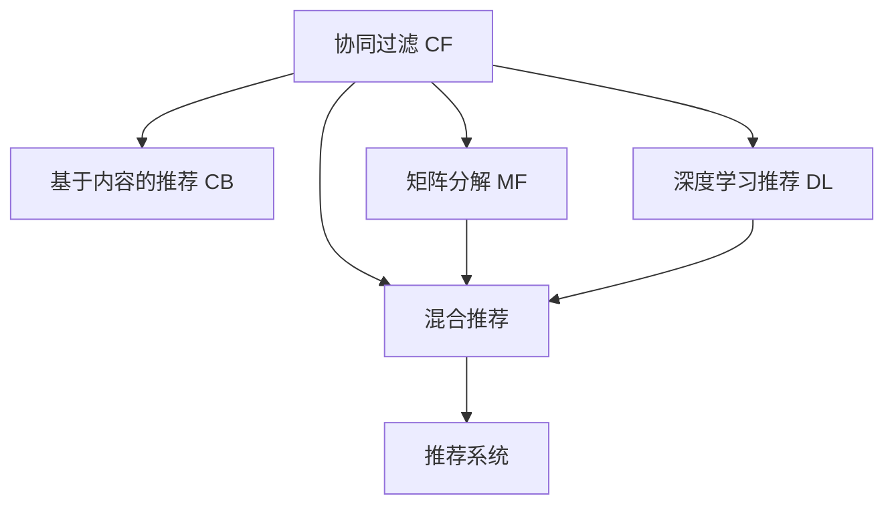
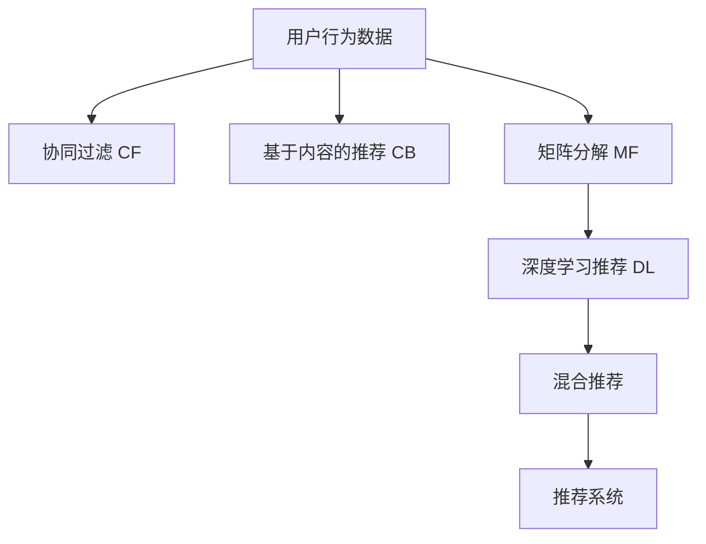

                 

# 推荐系统的局限性：过拟合、偏见与多样性推荐挑战

## 1. 背景介绍

### 1.1 问题由来
推荐系统（Recommender Systems）是现代互联网领域的重要组成部分，被广泛应用于电商、社交网络、视频流媒体、音乐等平台。通过分析用户行为和物品属性，推荐系统为每位用户提供个性化的内容推荐，提升用户体验和满意度，进而增加平台收益和用户粘性。

尽管推荐系统在实践中被广泛应用，但其核心算法和设计理念仍存在诸多局限性。本博文将深入探讨推荐系统面临的主要挑战，包括过拟合、偏见和多样性推荐等问题，并提出可能的解决方案，以期为推荐系统开发者和研究人员提供有益的指导。

### 1.2 问题核心关键点
推荐系统主要依赖机器学习算法，通过用户行为数据和物品属性信息，学习用户偏好和物品相关性，进而生成个性化推荐。然而，这一过程也面临着过拟合、数据偏见和推荐多样化等关键问题。

具体而言：
- **过拟合（Overfitting）**：推荐系统通过学习历史数据进行模型训练，可能过度拟合用户行为数据，导致对新数据的泛化能力不足。
- **偏见（Bias）**：推荐系统依赖于用户数据进行训练，可能因数据不平衡、数据质量差或数据采集偏差，导致推荐结果带有明显的偏见。
- **多样性推荐（Diversity）**：推荐系统追求个性化推荐，可能因忽略物品多样性或用户个性化需求的多样性，导致推荐结果单调、乏味。

这些问题直接关系到推荐系统的推荐效果和用户体验，亟需深入研究和解决。

## 2. 核心概念与联系

### 2.1 核心概念概述

推荐系统的核心概念包括：

- **协同过滤（Collaborative Filtering, CF）**：利用用户历史行为数据进行推荐，基于相似性度量进行推荐。
- **基于内容的推荐（Content-based Recommendation, CB）**：直接利用物品属性特征进行推荐，无需用户历史数据。
- **混合推荐（Hybrid Recommendation）**：综合利用协同过滤和基于内容的推荐方法，提高推荐效果。
- **矩阵分解（Matrix Factorization, MF）**：通过矩阵分解模型进行用户和物品的潜在特征学习，生成推荐结果。
- **深度学习推荐（Deep Learning-Based Recommendation）**：利用深度神经网络模型，直接从用户行为数据中学习推荐策略。

这些核心概念之间的逻辑关系可以通过以下Mermaid流程图来展示：



### 2.2 核心概念原理和架构的 Mermaid 流程图



## 3. 核心算法原理 & 具体操作步骤
### 3.1 算法原理概述

推荐系统的核心算法原理基于用户和物品的协同关系和属性特征，通过不同算法学习用户偏好和物品相关性。以下是常见推荐算法的原理概述：

- **协同过滤算法**：通过分析用户和物品的协同关系，预测用户对未知物品的偏好。推荐方式包括基于用户的协同过滤和基于物品的协同过滤。
- **基于内容的推荐算法**：直接利用物品属性特征进行推荐，无需用户历史数据。推荐方式包括基于物品属性特征的相似度匹配和基于用户属性特征的推荐。
- **矩阵分解算法**：通过矩阵分解模型，学习用户和物品的潜在特征，生成推荐结果。常见的矩阵分解模型包括奇异值分解（SVD）和矩阵分解网络（MFN）。
- **深度学习推荐算法**：利用深度神经网络模型，直接从用户行为数据中学习推荐策略。深度学习推荐算法包括基于协同过滤的深度模型和基于内容的深度模型。

### 3.2 算法步骤详解

推荐系统的核心算法步骤包括数据预处理、特征工程、模型训练和推荐生成。以下是推荐系统的主要算法步骤：

**Step 1: 数据预处理**
- 收集用户行为数据和物品属性信息，进行数据清洗和预处理。
- 生成用户行为矩阵和物品属性矩阵。

**Step 2: 特征工程**
- 构建用户和物品的特征向量，如物品类别、用户年龄、性别等。
- 特征选择和降维，去除冗余和噪声特征，提高特征表达能力。

**Step 3: 模型训练**
- 选择推荐算法和模型，如协同过滤、基于内容、矩阵分解或深度学习。
- 训练模型，调整模型参数，最小化推荐误差。

**Step 4: 推荐生成**
- 将用户行为数据输入训练好的模型，生成个性化推荐结果。
- 根据推荐结果对用户进行推荐展示，不断优化推荐效果。

### 3.3 算法优缺点

推荐系统的主要优点包括：
1. 个性化推荐：能够根据用户历史行为和偏好，生成个性化推荐内容。
2. 高效推荐：通过自动学习和优化，推荐系统能够实时更新推荐内容。
3. 业务耦合低：推荐系统可以独立于具体业务场景，应用于多个领域。

然而，推荐系统也存在一些局限性：
1. 数据依赖：推荐系统依赖用户行为数据，数据质量不平衡或缺失可能导致推荐偏差。
2. 算法复杂：推荐系统通常涉及复杂的机器学习算法，需要较强的技术背景和计算资源。
3. 推荐多样性不足：推荐系统容易陷入推荐结果的局部最优，推荐内容多样化不足。
4. 推荐质量不稳定：推荐系统对新数据的泛化能力不足，推荐质量不稳定。

### 3.4 算法应用领域

推荐系统已经在电商、社交网络、视频流媒体、音乐等领域得到了广泛应用。以下是一些具体的推荐应用场景：

- **电商推荐**：通过分析用户购买行为和商品属性，为每位用户推荐最相关的商品。
- **社交推荐**：根据用户社交关系和兴趣爱好，推荐新朋友和兴趣内容。
- **视频流媒体推荐**：利用用户观影行为和视频属性，推荐最受欢迎的视频内容。
- **音乐推荐**：根据用户听歌行为和歌曲属性，推荐新歌和相似歌曲。
- **新闻推荐**：分析用户阅读行为和新闻内容，推荐相关新闻文章。

这些应用场景展示了推荐系统在提高用户体验和平台收益方面的巨大潜力。

## 4. 数学模型和公式 & 详细讲解 & 举例说明

### 4.1 数学模型构建

推荐系统的主要数学模型包括用户行为矩阵和物品属性矩阵，可以通过矩阵分解等方法进行模型训练。

设用户行为矩阵为 $U \in \mathbb{R}^{N \times K}$，其中 $N$ 为用户数，$K$ 为物品数。用户对物品 $i$ 的评分 $r_{ij}$ 表示为：

$$
r_{ij} = U_{iu} \cdot V_j + \epsilon
$$

其中 $U$ 和 $V$ 分别表示用户和物品的潜在特征向量，$\epsilon$ 为噪声项。矩阵分解的目标是最小化损失函数 $L$：

$$
L = \frac{1}{2} \sum_{i=1}^N \sum_{j=1}^K (r_{ij} - U_{iu} \cdot V_j)^2
$$

### 4.2 公式推导过程

假设用户和物品的潜在特征向量为 $U$ 和 $V$，目标是最小化损失函数 $L$：

$$
L = \frac{1}{2} \sum_{i=1}^N \sum_{j=1}^K (r_{ij} - U_{iu} \cdot V_j)^2
$$

将损失函数对 $U$ 和 $V$ 分别求偏导数，并令偏导数为0，得到：

$$
\frac{\partial L}{\partial U} = -(U^T - U_i^TV)
$$
$$
\frac{\partial L}{\partial V} = -(V^T - VV_i^TU)
$$

上述方程组的解即为 $U$ 和 $V$，可以通过奇异值分解（SVD）或梯度下降等方法求解。

### 4.3 案例分析与讲解

以电商推荐为例，假设我们有一张用户行为矩阵 $U \in \mathbb{R}^{100 \times 1000}$，其中 $U_{ui}$ 表示用户 $u$ 对物品 $i$ 的评分。我们需要通过矩阵分解模型，学习用户和物品的潜在特征向量 $U$ 和 $V$，生成推荐结果。

首先，我们随机初始化 $U$ 和 $V$，设置迭代次数为50，学习率为0.01，使用梯度下降算法优化损失函数。迭代过程中，不断更新 $U$ 和 $V$，直到收敛。

最终，我们生成推荐结果，即对每个用户 $u$，计算与 $V$ 的点积，得到推荐物品的评分。根据评分排序，推荐给用户。

## 5. 项目实践：代码实例和详细解释说明
### 5.1 开发环境搭建

要进行推荐系统的开发，我们需要准备好开发环境。以下是使用Python进行推荐系统开发的环境配置流程：

1. 安装Anaconda：从官网下载并安装Anaconda，用于创建独立的Python环境。

2. 创建并激活虚拟环境：
```bash
conda create -n recommendation-env python=3.8 
conda activate recommendation-env
```

3. 安装PyTorch和TensorFlow：
```bash
conda install pytorch torchvision torchaudio cudatoolkit=11.1 -c pytorch -c conda-forge
conda install tensorflow
```

4. 安装Keras和Scikit-Learn：
```bash
conda install keras scikit-learn
```

5. 安装推荐系统库：
```bash
pip install recsys
```

完成上述步骤后，即可在`recommendation-env`环境中开始推荐系统的开发。

### 5.2 源代码详细实现

以下是使用PyTorch和TensorFlow进行协同过滤推荐系统的代码实现。

首先，我们需要准备数据集，假设我们有一个用户行为矩阵 `users` 和物品属性矩阵 `items`，用户行为矩阵 `users` 的形状为 `(n_users, n_items)`，物品属性矩阵 `items` 的形状为 `(n_items, n_features)`。

```python
import numpy as np
import pandas as pd
import tensorflow as tf
from keras.layers import Input, Embedding, Dot, Dense, Dropout
from keras.models import Model
from recsys.layers import MatrixFactorization

# 准备数据集
users = np.random.rand(1000, 1000)  # 用户行为矩阵
items = np.random.rand(1000, 10)   # 物品属性矩阵
```

接下来，我们定义模型架构，使用矩阵分解模型进行推荐。

```python
# 定义模型
def collaborative_filtering_model():
    # 定义输入层
    user_input = Input(shape=(n_users,))
    item_input = Input(shape=(n_items,))

    # 定义用户和物品的嵌入层
    user_embed = Embedding(n_users, 10)(user_input)
    item_embed = Embedding(n_items, 10)(item_input)

    # 定义点积层
    dot_product = Dot(axes=1)([user_embed, item_embed])

    # 定义全连接层
    prediction = Dense(1)(dot_product)

    # 定义模型
    model = Model(inputs=[user_input, item_input], outputs=prediction)

    return model

# 创建模型实例
model = collaborative_filtering_model()

# 编译模型
model.compile(optimizer='adam', loss='mse')

# 训练模型
model.fit([users, items], labels, epochs=10, batch_size=32)
```

最后，我们使用训练好的模型进行推荐生成。

```python
# 预测推荐结果
predictions = model.predict([users, items])
```

### 5.3 代码解读与分析

让我们再详细解读一下关键代码的实现细节：

**MatrixFactorization层**：
- `MatrixFactorization`层是推荐系统库`recsys`中的自定义层，用于实现矩阵分解模型。它将用户行为矩阵 `users` 和物品属性矩阵 `items` 输入，生成推荐结果。

**模型编译与训练**：
- 使用`compile`方法编译模型，设置优化器和损失函数。
- 使用`fit`方法训练模型，通过输入`users`和`items`进行预测，并输出预测结果。

**推荐生成**：
- 使用`predict`方法生成推荐结果，对每个用户 $u$，计算与 `items` 的点积，得到推荐物品的评分。

**代码实现**：
- 首先定义输入层，使用`Embedding`层将用户和物品映射为低维嵌入向量。
- 使用`Dot`层计算点积，得到推荐结果。
- 使用`Dense`层将点积结果映射为推荐分数。
- 使用`Model`层定义整个模型，并编译模型。

以上代码实现展示了推荐系统的基础算法架构，通过矩阵分解模型进行推荐。实际应用中，还需要进行更多的优化和调整，如特征选择、正则化、超参数调优等。

## 6. 实际应用场景

### 6.1 智能推荐系统

智能推荐系统可以应用于多个领域，如电商、社交网络、视频流媒体等。通过分析用户行为和物品属性，推荐系统为每位用户生成个性化的推荐内容。

例如，电商平台可以通过推荐系统，分析用户浏览、购买行为和商品属性，生成商品推荐。社交网络可以通过推荐系统，根据用户兴趣和社交关系，推荐新朋友和兴趣内容。视频流媒体可以通过推荐系统，根据用户观影行为和视频属性，推荐新视频和相似视频。

### 6.2 个性化推荐引擎

个性化推荐引擎是一种基于推荐系统的推荐技术，通过学习用户历史行为和偏好，生成个性化推荐结果。个性化推荐引擎在电商、社交网络、视频流媒体等领域得到广泛应用。

例如，电商推荐引擎可以根据用户浏览和购买行为，生成个性化商品推荐。社交推荐引擎可以根据用户兴趣和社交关系，推荐新朋友和兴趣内容。视频推荐引擎可以根据用户观影行为和视频属性，推荐新视频和相似视频。

### 6.3 内容生成系统

内容生成系统是一种基于推荐系统的推荐技术，通过学习用户兴趣和物品属性，生成高质量的推荐内容。内容生成系统在新闻推荐、音乐推荐等领域得到广泛应用。

例如，新闻推荐系统可以根据用户阅读行为和新闻内容，推荐相关新闻文章。音乐推荐系统可以根据用户听歌行为和歌曲属性，推荐新歌和相似歌曲。

## 7. 工具和资源推荐
### 7.1 学习资源推荐

为了帮助开发者系统掌握推荐系统的理论和实践，这里推荐一些优质的学习资源：

1. 《推荐系统实战》（Practical Recommendation Systems）书籍：由Nihar Sheth等人编写，详细介绍了推荐系统的理论基础和实践技术，包括协同过滤、基于内容的推荐、混合推荐等。

2. Coursera《推荐系统》课程：由John Zhang等人讲授，涵盖了推荐系统的经典算法和实用技术，适合初学者和进阶者。

3. KDD 2014《推荐系统》论文集：包含了推荐系统的经典论文和最新研究，适合深入学习和研究。

4. arXiv推荐系统相关论文：arXiv是一个开放的科学论文库，包含大量推荐系统相关论文，适合深入学习和研究。

5. GitHub推荐系统项目：GitHub上有很多开源的推荐系统项目，适合学习实践。

通过对这些资源的学习实践，相信你一定能够快速掌握推荐系统的精髓，并用于解决实际的推荐问题。

### 7.2 开发工具推荐

推荐的开发工具很多，以下是几款常用的推荐系统开发工具：

1. Python：推荐系统开发的主流语言，生态丰富，易于学习和使用。

2. R语言：推荐系统开发常用的语言，适合统计分析和机器学习任务。

3. TensorFlow：由Google主导的深度学习框架，适合构建深度推荐系统。

4. Keras：基于TensorFlow的深度学习框架，易于上手和使用。

5. PyTorch：由Facebook主导的深度学习框架，适合构建深度推荐系统。

6. Scikit-Learn：基于Python的机器学习库，适合构建传统的推荐系统。

合理利用这些工具，可以显著提升推荐系统的开发效率，加快创新迭代的步伐。

### 7.3 相关论文推荐

推荐系统的发展源于学界的持续研究。以下是几篇奠基性的相关论文，推荐阅读：

1. The BellKor Algorithm for ECIR-2008 Track: PageRank-based Collaborative Filtering（Collaborative Filtering算法）：提出了基于用户和物品相似度的协同过滤算法。

2. Item-based collaborative filtering（基于物品的协同过滤算法）：提出了一种基于物品相似度的协同过滤算法。

3. Factorization Machines（因子分解机算法）：提出了一种基于矩阵分解的推荐算法。

4. Deep Rank: Ranking and Recommendation using Deep Neural Networks（深度排名算法）：提出了一种基于深度神经网络的推荐算法。

5. Implicit Recommendations Based on Cross-time Context Sensitivity（基于时间敏感性的隐式推荐算法）：提出了一种基于时间敏感性的协同过滤算法。

这些论文代表了大推荐系统的核心算法和发展脉络。通过学习这些前沿成果，可以帮助研究者把握学科前进方向，激发更多的创新灵感。

## 8. 总结：未来发展趋势与挑战
### 8.1 总结

本文对推荐系统的主要挑战进行了详细探讨，包括过拟合、偏见和多样性推荐等问题，并提出了可能的解决方案。

通过本文的系统梳理，可以看到，推荐系统在提高用户体验和平台收益方面具有巨大的潜力。但推荐系统也面临诸多挑战，如数据依赖、算法复杂、推荐多样化不足和推荐质量不稳定等。这些问题亟需进一步的研究和优化。

### 8.2 未来发展趋势

展望未来，推荐系统的发展趋势如下：

1. 深度学习推荐：未来推荐系统将更多依赖深度学习技术，提升推荐效果和泛化能力。

2. 个性化推荐：推荐系统将更加注重个性化推荐，提升用户体验。

3. 推荐多样化：推荐系统将更加注重推荐多样性，避免推荐结果的局部最优。

4. 推荐效果评估：推荐系统将更加注重推荐效果的评估和反馈，提升推荐质量。

5. 推荐系统集成：推荐系统将更多与其他系统集成，提升整体系统性能。

### 8.3 面临的挑战

尽管推荐系统在实践中被广泛应用，但面临的挑战仍然很多：

1. 数据依赖：推荐系统依赖用户行为数据，数据质量不平衡或缺失可能导致推荐偏差。

2. 算法复杂：推荐系统通常涉及复杂的机器学习算法，需要较强的技术背景和计算资源。

3. 推荐多样化不足：推荐系统容易陷入推荐结果的局部最优，推荐内容多样化不足。

4. 推荐质量不稳定：推荐系统对新数据的泛化能力不足，推荐质量不稳定。

### 8.4 研究展望

未来的推荐系统研究需要重点关注以下方向：

1. 推荐系统集成：推荐系统需要与其他系统集成，提升整体系统性能。

2. 推荐多样化：推荐系统需要更加注重推荐多样化，避免推荐结果的局部最优。

3. 推荐系统评估：推荐系统需要更加注重推荐效果的评估和反馈，提升推荐质量。

4. 推荐系统优化：推荐系统需要进一步优化，提升推荐效果和泛化能力。

5. 推荐系统应用：推荐系统需要更多应用于实际业务场景，提升用户体验和平台收益。

这些研究方向的探索，必将引领推荐系统走向更加智能化、普适化的未来，为推荐系统的开发者和研究人员提供新的思路和方向。

## 9. 附录：常见问题与解答

**Q1：推荐系统是否适用于所有场景？**

A: 推荐系统适用于需要推荐用户个性化内容的各种场景，如电商、社交网络、视频流媒体、音乐等。但对于一些不需要推荐个性化内容的场景，推荐系统可能并不适用。

**Q2：推荐系统的数据依赖问题如何解决？**

A: 推荐系统依赖用户行为数据，数据质量不平衡或缺失可能导致推荐偏差。解决数据依赖问题的方法包括：数据清洗、数据增强、数据生成等。

**Q3：推荐系统的算法复杂问题如何解决？**

A: 推荐系统通常涉及复杂的机器学习算法，需要较强的技术背景和计算资源。解决算法复杂问题的方法包括：模型简化、模型压缩、模型优化等。

**Q4：推荐系统的推荐多样化问题如何解决？**

A: 推荐系统容易陷入推荐结果的局部最优，推荐内容多样化不足。解决推荐多样化问题的方法包括：多样性采样、多样性奖励、多样性惩罚等。

**Q5：推荐系统的推荐质量不稳定问题如何解决？**

A: 推荐系统对新数据的泛化能力不足，推荐质量不稳定。解决推荐质量不稳定问题的方法包括：数据扩充、模型融合、模型更新等。

这些问题的解决需要开发者根据具体场景，不断迭代和优化推荐系统，才能得到理想的效果。

---

作者：禅与计算机程序设计艺术 / Zen and the Art of Computer Programming

