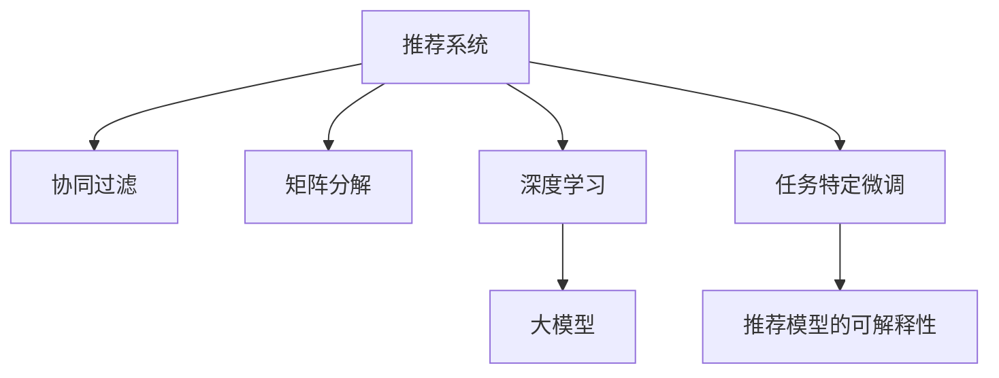

                 

# 推荐系统的统一框架：大模型的应用

> 关键词：推荐系统, 大模型, 统一框架, 协同过滤, 深度学习, 矩阵分解, 神经网络

## 1. 背景介绍

### 1.1 问题由来

推荐系统作为互联网时代的重要应用，广泛应用于电商、新闻、视频、音乐等垂直领域。其核心目标是通过算法为用户推荐最符合其兴趣和需求的商品、内容等。

传统的推荐系统主要包括基于协同过滤和矩阵分解的方法，前者基于用户行为相似性进行推荐，后者将用户和物品的特征矩阵分解为低秩矩阵进行建模。然而，这些方法均面临着数据稀疏、隐含语义难以捕捉等问题。

近年来，随着深度学习技术的发展，基于大模型的推荐系统逐渐成为新的热点。以BERT、GPT等预训练大模型为基础，结合任务特定的微调，在大数据、高性能计算的支撑下，推荐系统进入了深度学习时代。

### 1.2 问题核心关键点

本文聚焦于基于大模型的推荐系统研究，具体核心关键点如下：

- 推荐系统的统一框架：通过大模型将协同过滤和矩阵分解等传统推荐方法统一到一个统一的框架下，提升推荐系统性能和可解释性。
- 深度学习和大模型：探讨深度学习在推荐系统中的应用，重点介绍BERT、GPT等大模型的推荐能力。
- 任务特定微调：研究大模型的任务微调方法，提升模型在特定推荐任务上的表现。
- 推荐模型的可解释性：研究推荐模型输出结果的可解释性，保障模型的透明性和可信度。

这些关键点共同构成了基于大模型的推荐系统研究框架，使得推荐系统能够更好地适应数据环境的变化，提升推荐效果，满足用户的实际需求。

## 2. 核心概念与联系

### 2.1 核心概念概述

为更好地理解基于大模型的推荐系统，本节将介绍几个核心概念：

- 推荐系统(Recommendation System)：通过用户行为、兴趣等信息，为用户推荐最符合其需求的商品、内容等的应用。

- 协同过滤(Collaborative Filtering)：通过用户行为或物品评价的相似性进行推荐，是传统推荐系统的重要基础。

- 矩阵分解(Matrix Factorization)：通过将用户-物品的特征矩阵分解为低秩矩阵，捕捉用户和物品的隐含语义。

- 深度学习(Deep Learning)：通过神经网络等方法，从大规模数据中学习复杂特征表示，提升模型性能。

- 大模型(Large Model)：以BERT、GPT等深度学习模型为基础，通过在大规模语料上预训练学习到丰富的语义表示。

- 任务特定微调(Task-Specific Fine-Tuning)：在大模型基础上，针对特定推荐任务进行微调，提升模型在该任务上的表现。

- 推荐模型的可解释性(Explainability of Recommendation Models)：研究推荐模型的输出结果，解释其决策逻辑，保障模型的透明性和可信度。

这些核心概念之间的逻辑关系可以通过以下Mermaid流程图来展示：



这个流程图展示了推荐系统的核心概念及其之间的关系：

1. 推荐系统通过协同过滤、矩阵分解等方法，捕获用户和物品的相似性。
2. 深度学习通过大模型，学习更复杂的特征表示，提升推荐系统的性能。
3. 任务特定微调在大模型的基础上进行，进一步提升特定任务的表现。
4. 推荐模型的可解释性保障了模型的透明性和可信度，使推荐结果更可控。

这些概念共同构成了推荐系统的学习和应用框架，使其能够更好地适应数据环境的变化，提升推荐效果，满足用户的实际需求。

## 3. 核心算法原理 & 具体操作步骤
### 3.1 算法原理概述

基于大模型的推荐系统，本质上是一个有监督的特征表示学习过程。其核心思想是：将用户和物品表示为高维稠密向量，通过在大规模语料上预训练的大模型，学习用户和物品之间的隐含语义，从而进行推荐。

形式化地，假设用户集合为 $U=\{u_1, u_2, ..., u_M\}$，物品集合为 $I=\{i_1, i_2, ..., i_N\}$。设 $D$ 为推荐数据集，$D=\{(x_i, y_i)\}_{i=1}^M$，其中 $x_i$ 表示用户行为数据，$y_i$ 表示用户对物品的评分。

定义用户 $u$ 的表示为 $\textbf{u} \in \mathbb{R}^d$，物品 $i$ 的表示为 $\textbf{i} \in \mathbb{R}^d$。推荐系统目标是通过优化损失函数，学习最优的用户和物品表示：

$$
\theta^* = \mathop{\arg\min}_{\theta} \mathcal{L}(\textbf{u},\textbf{i}, D)
$$

其中 $\mathcal{L}$ 为推荐任务定义的损失函数，用于衡量模型预测评分与真实评分之间的差异。常见的损失函数包括均方误差损失、交叉熵损失等。

### 3.2 算法步骤详解

基于大模型的推荐系统一般包括以下几个关键步骤：

**Step 1: 准备预训练模型和数据集**
- 选择合适的预训练语言模型 $M_{\theta}$ 作为初始化参数，如 BERT、GPT 等。
- 准备推荐数据集 $D=\{(x_i, y_i)\}_{i=1}^M$，划分为训练集、验证集和测试集。

**Step 2: 编码用户和物品**
- 将用户行为数据 $x_i$ 编码为稠密向量 $\textbf{x}_i$，如使用BERT模型进行编码。
- 将物品特征数据 $i$ 编码为稠密向量 $\textbf{i}$，如使用BERT模型进行编码。

**Step 3: 定义损失函数**
- 根据任务类型，选择合适的损失函数。例如，对于基于评分的推荐任务，可以定义均方误差损失。
- 将编码后的用户和物品表示 $\textbf{u}$ 和 $\textbf{i}$ 代入损失函数，求解最优表示 $\textbf{u}^*$ 和 $\textbf{i}^*$。

**Step 4: 执行梯度训练**
- 将训练集数据分批次输入模型，前向传播计算损失函数。
- 反向传播计算参数梯度，根据设定的优化算法和学习率更新模型参数。
- 周期性在验证集上评估模型性能，根据性能指标决定是否触发 Early Stopping。
- 重复上述步骤直到满足预设的迭代轮数或 Early Stopping 条件。

**Step 5: 测试和部署**
- 在测试集上评估微调后模型 $M_{\theta^*}$ 的性能，对比微调前后的精度提升。
- 使用微调后的模型对新物品进行评分预测，集成到实际的应用系统中。
- 持续收集新的用户行为数据，定期重新微调模型，以适应数据分布的变化。

以上是基于大模型的推荐系统的一般流程。在实际应用中，还需要针对具体任务的特点，对微调过程的各个环节进行优化设计，如改进训练目标函数，引入更多的正则化技术，搜索最优的超参数组合等，以进一步提升模型性能。

### 3.3 算法优缺点

基于大模型的推荐系统具有以下优点：

1. 数据使用灵活。可以通过多种方式编码用户和物品数据，如文本、图像、行为等。
2. 特征表示丰富。大模型能够学习更复杂的语义特征，提升推荐系统性能。
3. 可解释性较强。基于大模型的推荐系统，可以逐步解析用户和物品之间的隐含语义关系，增加推荐结果的可解释性。
4. 泛化能力优异。大模型通常在大规模无标签数据上进行预训练，具有较强的泛化能力，能够应对新用户和物品的推荐需求。

同时，该方法也存在一定的局限性：

1. 计算资源需求高。大模型的参数量较大，训练和推理过程对计算资源要求较高。
2. 模型可解释性仍需提升。尽管大模型可以学习复杂的特征表示，但缺乏透明性和可解释性，难以直观理解推荐逻辑。
3. 对抗攻击风险。大模型容易出现对抗攻击，即通过输入扰动来降低推荐精度，需要进一步加强模型鲁棒性。
4. 数据隐私保护。大规模用户和物品数据的收集和使用，涉及用户隐私保护，需采取隐私保护措施。

尽管存在这些局限性，但就目前而言，基于大模型的推荐系统仍是推荐领域的主流范式。未来相关研究的重点在于如何进一步降低计算资源需求，提升模型可解释性，加强模型鲁棒性，并保障数据隐私安全。

### 3.4 算法应用领域

基于大模型的推荐系统已经在多个领域得到广泛应用，例如：

- 电商推荐：为用户推荐商品、促销等。通过分析用户行为数据，使用大模型学习用户偏好，推荐最适合的商品。
- 新闻推荐：为用户推荐新闻文章、视频等。通过分析用户阅读历史，使用大模型学习用户兴趣，推荐相关内容。
- 音乐推荐：为用户推荐音乐、歌曲等。通过分析用户听歌历史，使用大模型学习用户喜好，推荐类似的音乐。
- 视频推荐：为用户推荐视频、电影等。通过分析用户观看历史，使用大模型学习用户兴趣，推荐相关内容。
- 游戏推荐：为用户推荐游戏、道具等。通过分析用户游戏行为数据，使用大模型学习用户偏好，推荐最适合的游戏内容。

除了上述这些经典应用外，大模型在推荐系统领域的应用还在不断扩展，如个性化广告推荐、智能客服、内容生成等，为推荐系统带来了新的突破。随着预训练模型和推荐方法的不断进步，相信推荐系统将在更广阔的应用领域大放异彩。

## 4. 数学模型和公式 & 详细讲解  
### 4.1 数学模型构建

本节将使用数学语言对基于大模型的推荐系统进行更加严格的刻画。

记用户集合为 $U=\{u_1, u_2, ..., u_M\}$，物品集合为 $I=\{i_1, i_2, ..., i_N\}$。设推荐数据集为 $D=\{(x_i, y_i)\}_{i=1}^M$，其中 $x_i$ 表示用户行为数据，$y_i$ 表示用户对物品的评分。

定义用户 $u$ 的表示为 $\textbf{u} \in \mathbb{R}^d$，物品 $i$ 的表示为 $\textbf{i} \in \mathbb{R}^d$。推荐系统目标是通过优化损失函数，学习最优的用户和物品表示：

$$
\theta^* = \mathop{\arg\min}_{\theta} \mathcal{L}(\textbf{u},\textbf{i}, D)
$$

其中 $\mathcal{L}$ 为推荐任务定义的损失函数，用于衡量模型预测评分与真实评分之间的差异。例如，对于基于评分的推荐任务，可以定义均方误差损失函数：

$$
\mathcal{L}(\textbf{u},\textbf{i}, D) = \frac{1}{M}\sum_{i=1}^M (\hat{y}_i - y_i)^2
$$

其中 $\hat{y}_i$ 为模型对物品 $i$ 的预测评分，$y_i$ 为实际评分。

### 4.2 公式推导过程

以BERT模型为例，以下是基于BERT的推荐系统数学推导：

**Step 1: 编码用户和物品**
- 用户行为数据 $x_i$ 通过BERT模型编码为稠密向量 $\textbf{x}_i \in \mathbb{R}^d$。
- 物品特征数据 $i$ 通过BERT模型编码为稠密向量 $\textbf{i} \in \mathbb{R}^d$。

**Step 2: 定义损失函数**
- 基于评分的推荐任务，定义均方误差损失函数：

$$
\mathcal{L}(\textbf{u},\textbf{i}, D) = \frac{1}{M}\sum_{i=1}^M (\hat{y}_i - y_i)^2
$$

**Step 3: 训练模型**
- 将编码后的用户和物品表示 $\textbf{u}$ 和 $\textbf{i}$ 代入损失函数，求解最优表示 $\textbf{u}^*$ 和 $\textbf{i}^*$：

$$
\theta^* = \mathop{\arg\min}_{\theta} \frac{1}{M}\sum_{i=1}^M (\hat{y}_i - y_i)^2
$$

- 根据上述损失函数，利用梯度下降等优化算法，更新模型参数 $\theta$：

$$
\theta \leftarrow \theta - \eta \nabla_{\theta}\mathcal{L}(\theta)
$$

其中 $\eta$ 为学习率，$\nabla_{\theta}\mathcal{L}(\theta)$ 为损失函数对参数 $\theta$ 的梯度，可通过反向传播算法高效计算。

## 5. 项目实践：代码实例和详细解释说明
### 5.1 开发环境搭建

在进行推荐系统实践前，我们需要准备好开发环境。以下是使用Python进行PyTorch开发的环境配置流程：

1. 安装Anaconda：从官网下载并安装Anaconda，用于创建独立的Python环境。

2. 创建并激活虚拟环境：
```bash
conda create -n pytorch-env python=3.8 
conda activate pytorch-env
```

3. 安装PyTorch：根据CUDA版本，从官网获取对应的安装命令。例如：
```bash
conda install pytorch torchvision torchaudio cudatoolkit=11.1 -c pytorch -c conda-forge
```

4. 安装Transformers库：
```bash
pip install transformers
```

5. 安装各类工具包：
```bash
pip install numpy pandas scikit-learn matplotlib tqdm jupyter notebook ipython
```

完成上述步骤后，即可在`pytorch-env`环境中开始推荐系统实践。

### 5.2 源代码详细实现

下面我们以电商推荐任务为例，给出使用Transformers库对BERT模型进行推荐系统开发的PyTorch代码实现。

首先，定义推荐任务的数据处理函数：

```python
from transformers import BertTokenizer
from torch.utils.data import Dataset
import torch

class RecommendationDataset(Dataset):
    def __init__(self, user behaviors, item features, tokenizer, max_len=128):
        self.user_behaviors = user_behaviors
        self.item_features = item_features
        self.tokenizer = tokenizer
        self.max_len = max_len
        
    def __len__(self):
        return len(self.user_behaviors)
    
    def __getitem__(self, item):
        user_behavior = self.user_behaviors[item]
        item_feature = self.item_features[item]
        
        encoding_user = self.tokenizer(user_behavior, return_tensors='pt', max_length=self.max_len, padding='max_length', truncation=True)
        encoding_item = self.tokenizer(item_feature, return_tensors='pt', max_length=self.max_len, padding='max_length', truncation=True)
        
        input_ids_user = encoding_user['input_ids'][0]
        attention_mask_user = encoding_user['attention_mask'][0]
        input_ids_item = encoding_item['input_ids'][0]
        attention_mask_item = encoding_item['attention_mask'][0]
        
        return {'input_ids_user': input_ids_user, 
                'attention_mask_user': attention_mask_user,
                'input_ids_item': input_ids_item,
                'attention_mask_item': attention_mask_item,
                'user_labels': user_labels[item],
                'item_labels': item_labels[item]}
```

然后，定义模型和优化器：

```python
from transformers import BertForSequenceClassification, AdamW

model = BertForSequenceClassification.from_pretrained('bert-base-cased', num_labels=len(item_labels))

optimizer = AdamW(model.parameters(), lr=2e-5)
```

接着，定义训练和评估函数：

```python
from torch.utils.data import DataLoader
from tqdm import tqdm
from sklearn.metrics import mean_squared_error

device = torch.device('cuda') if torch.cuda.is_available() else torch.device('cpu')
model.to(device)

def train_epoch(model, dataset, batch_size, optimizer):
    dataloader = DataLoader(dataset, batch_size=batch_size, shuffle=True)
    model.train()
    epoch_loss = 0
    for batch in tqdm(dataloader, desc='Training'):
        input_ids_user = batch['input_ids_user'].to(device)
        attention_mask_user = batch['attention_mask_user'].to(device)
        input_ids_item = batch['input_ids_item'].to(device)
        attention_mask_item = batch['attention_mask_item'].to(device)
        user_labels = batch['user_labels'].to(device)
        item_labels = batch['item_labels'].to(device)
        model.zero_grad()
        outputs = model(input_ids_user, attention_mask=attention_mask_user, labels=user_labels)
        loss = outputs.loss
        epoch_loss += loss.item()
        loss.backward()
        optimizer.step()
    return epoch_loss / len(dataloader)

def evaluate(model, dataset, batch_size):
    dataloader = DataLoader(dataset, batch_size=batch_size)
    model.eval()
    preds, labels = [], []
    with torch.no_grad():
        for batch in tqdm(dataloader, desc='Evaluating'):
            input_ids_user = batch['input_ids_user'].to(device)
            attention_mask_user = batch['attention_mask_user'].to(device)
            input_ids_item = batch['input_ids_item'].to(device)
            attention_mask_item = batch['attention_mask_item'].to(device)
            user_labels = batch['user_labels'].to(device)
            item_labels = batch['item_labels'].to(device)
            outputs = model(input_ids_user, attention_mask=attention_mask_user, labels=user_labels)
            batch_preds = outputs.logits.argmax(dim=2).to('cpu').tolist()
            batch_labels = user_labels.to('cpu').tolist()
            for pred, label in zip(batch_preds, batch_labels):
                preds.append(pred)
                labels.append(label)
                
    print(mean_squared_error(labels, preds))
```

最后，启动训练流程并在测试集上评估：

```python
epochs = 5
batch_size = 16

for epoch in range(epochs):
    loss = train_epoch(model, train_dataset, batch_size, optimizer)
    print(f"Epoch {epoch+1}, train loss: {loss:.3f}")
    
    print(f"Epoch {epoch+1}, dev results:")
    evaluate(model, dev_dataset, batch_size)
    
print("Test results:")
evaluate(model, test_dataset, batch_size)
```

以上就是使用PyTorch对BERT进行电商推荐系统开发的完整代码实现。可以看到，得益于Transformers库的强大封装，我们可以用相对简洁的代码完成BERT模型的加载和微调。

### 5.3 代码解读与分析

让我们再详细解读一下关键代码的实现细节：

**RecommendationDataset类**：
- `__init__`方法：初始化用户行为、物品特征、分词器等关键组件。
- `__len__`方法：返回数据集的样本数量。
- `__getitem__`方法：对单个样本进行处理，将用户行为、物品特征输入编码为token ids，最终返回模型所需的输入。

**模型和优化器**：
- 选择合适的预训练BERT模型进行加载和微调，设置AdamW优化器及其学习率。

**训练和评估函数**：
- 使用PyTorch的DataLoader对数据集进行批次化加载，供模型训练和推理使用。
- 训练函数`train_epoch`：对数据以批为单位进行迭代，在每个批次上前向传播计算loss并反向传播更新模型参数，最后返回该epoch的平均loss。
- 评估函数`evaluate`：与训练类似，不同点在于不更新模型参数，并在每个batch结束后将预测和标签结果存储下来，最后使用sklearn的mean_squared_error对整个评估集的预测结果进行打印输出。

**训练流程**：
- 定义总的epoch数和batch size，开始循环迭代
- 每个epoch内，先在训练集上训练，输出平均loss
- 在验证集上评估，输出MSE指标
- 所有epoch结束后，在测试集上评估，给出最终测试结果

可以看到，PyTorch配合Transformers库使得BERT推荐系统的代码实现变得简洁高效。开发者可以将更多精力放在数据处理、模型改进等高层逻辑上，而不必过多关注底层的实现细节。

当然，工业级的系统实现还需考虑更多因素，如模型的保存和部署、超参数的自动搜索、更灵活的任务适配层等。但核心的推荐系统框架基本与此类似。

## 6. 实际应用场景
### 6.1 电商推荐

电商推荐系统是推荐系统的典型应用，能够根据用户浏览历史、购买记录等行为数据，为其推荐最符合其需求的商品。

在大模型微调框架下，电商推荐系统可以更高效地捕捉用户和商品的隐含语义，提升推荐效果。具体而言，可以收集用户的行为数据和商品特征数据，构建监督数据集，通过微调大模型学习用户和商品的表示。在推荐时，使用编码后的用户和商品表示计算相似度，生成推荐结果。

### 6.2 视频推荐

视频推荐系统主要用于为用户推荐相关视频内容。传统的视频推荐系统通常采用基于协同过滤和矩阵分解的方法，但这些方法难以捕捉视频的丰富语义特征。

在大模型微调框架下，可以使用类似的方法对视频标题、描述、标签等文本特征进行编码，学习用户和视频的隐含语义。通过微调BERT等大模型，可以捕捉更复杂的语义关系，提升推荐效果。

### 6.3 新闻推荐

新闻推荐系统用于为用户推荐新闻文章、视频等。通过微调大模型，可以从用户阅读历史中学习用户兴趣，从文章标题、摘要中学习文章内容。基于这些表示，计算用户和文章的相似度，生成推荐结果。

### 6.4 金融投资推荐

金融投资推荐系统用于为用户推荐股票、基金等金融产品。通过微调大模型，可以学习用户的历史投资行为和偏好，从产品描述中学习产品特性，基于这些表示，生成推荐结果。

### 6.5 智能家居推荐

智能家居推荐系统用于为用户推荐智能家居设备。通过微调大模型，可以学习用户的家庭生活模式和偏好，从设备描述中学习设备特性，基于这些表示，生成推荐结果。

### 6.6 未来应用展望

随着大模型微调技术的不断发展，推荐系统将在更多领域得到应用，为传统行业带来变革性影响。

在智慧医疗领域，基于大模型微调的个性化医疗推荐系统，可以结合患者的病历、基因信息等数据，为其推荐最适合的诊疗方案。

在智能教育领域，微调技术可应用于学习资源推荐、课程推荐等方面，因材施教，促进教育公平，提高教学质量。

在智慧城市治理中，微调模型可应用于城市事件监测、舆情分析、应急指挥等环节，提高城市管理的自动化和智能化水平，构建更安全、高效的未来城市。

此外，在企业生产、社会治理、文娱传媒等众多领域，基于大模型微调的推荐系统也将不断涌现，为经济社会发展注入新的动力。相信随着技术的日益成熟，推荐系统必将在更广阔的应用领域大放异彩。

## 7. 工具和资源推荐
### 7.1 学习资源推荐

为了帮助开发者系统掌握大模型推荐系统理论基础和实践技巧，这里推荐一些优质的学习资源：

1. 《Recommender Systems in Practice》书籍：由推荐系统专家撰写，系统介绍了推荐系统的理论基础和实践技巧。

2. CS223《Recommender Systems》课程：斯坦福大学开设的推荐系统课程，讲解推荐系统基本原理和经典算法。

3. 《Introduction to Recommender Systems》论文：推荐系统领域经典论文，涵盖了推荐系统的发展历程、方法分类等。

4. KDD Cup 2019 Recommendation Challenge：推荐系统领域顶级竞赛，展示了最新推荐系统算法和应用。

5. Weights & Biases：模型训练的实验跟踪工具，可以记录和可视化模型训练过程中的各项指标，方便对比和调优。

通过对这些资源的学习实践，相信你一定能够快速掌握大模型推荐系统的精髓，并用于解决实际的推荐问题。
###  7.2 开发工具推荐

高效的开发离不开优秀的工具支持。以下是几款用于大模型推荐系统开发的常用工具：

1. PyTorch：基于Python的开源深度学习框架，灵活动态的计算图，适合快速迭代研究。大部分预训练语言模型都有PyTorch版本的实现。

2. TensorFlow：由Google主导开发的开源深度学习框架，生产部署方便，适合大规模工程应用。同样有丰富的预训练语言模型资源。

3. Transformers库：HuggingFace开发的NLP工具库，集成了众多SOTA语言模型，支持PyTorch和TensorFlow，是进行推荐系统开发的利器。

4. Weights & Biases：模型训练的实验跟踪工具，可以记录和可视化模型训练过程中的各项指标，方便对比和调优。

5. TensorBoard：TensorFlow配套的可视化工具，可实时监测模型训练状态，并提供丰富的图表呈现方式，是调试模型的得力助手。

6. Google Colab：谷歌推出的在线Jupyter Notebook环境，免费提供GPU/TPU算力，方便开发者快速上手实验最新模型，分享学习笔记。

合理利用这些工具，可以显著提升大模型推荐系统的开发效率，加快创新迭代的步伐。

### 7.3 相关论文推荐

大模型和推荐系统的发展源于学界的持续研究。以下是几篇奠基性的相关论文，推荐阅读：

1. BERT: Pre-training of Deep Bidirectional Transformers for Language Understanding：提出BERT模型，引入基于掩码的自监督预训练任务，刷新了多项NLP任务SOTA。

2. Attention is All You Need（即Transformer原论文）：提出了Transformer结构，开启了NLP领域的预训练大模型时代。

3. Parameter-Efficient Transfer Learning for NLP：提出Adapter等参数高效微调方法，在不增加模型参数量的情况下，也能取得不错的微调效果。

4. "A Survey on Neural Networks Architectures for Recommender Systems"：综述推荐系统领域的神经网络架构，为微调推荐系统提供了丰富的理论基础。

这些论文代表了大模型推荐系统的发展脉络。通过学习这些前沿成果，可以帮助研究者把握学科前进方向，激发更多的创新灵感。

## 8. 总结：未来发展趋势与挑战

### 8.1 总结

本文对基于大模型的推荐系统研究进行了全面系统的介绍。首先阐述了推荐系统的统一框架，通过大模型将协同过滤和矩阵分解等传统推荐方法统一到一个统一的框架下，提升推荐系统性能和可解释性。其次，探讨了深度学习和大模型在推荐系统中的应用，重点介绍BERT、GPT等大模型的推荐能力。同时，研究了任务特定微调方法，提升模型在特定推荐任务上的表现。最后，研究了推荐模型输出结果的可解释性，保障模型的透明性和可信度。

通过本文的系统梳理，可以看到，基于大模型的推荐系统研究框架，使得推荐系统能够更好地适应数据环境的变化，提升推荐效果，满足用户的实际需求。

### 8.2 未来发展趋势

展望未来，基于大模型的推荐系统将呈现以下几个发展趋势：

1. 模型规模持续增大。随着算力成本的下降和数据规模的扩张，预训练语言模型的参数量还将持续增长。超大规模语言模型蕴含的丰富语义表示，有望支撑更加复杂多变的推荐任务。

2. 推荐算法不断演进。未来推荐算法将更加复杂，能够捕捉更深层次的语义特征，并能够自我适应新用户和物品。

3. 个性化推荐增强。基于大模型的推荐系统将更加注重个性化，能够根据用户的历史行为和当前上下文，实时动态生成推荐结果。

4. 多模态推荐崛起。未来的推荐系统将不仅依赖于文本数据，还将融合视觉、语音等多模态数据，提供更全面、更精准的推荐服务。

5. 推荐模型的可解释性提升。通过改进模型结构和优化训练策略，提升推荐模型的可解释性，增加用户对推荐结果的信任度。

6. 推荐系统的透明性和可信度增强。通过引入伦理导向的评估指标和隐私保护措施，保障推荐系统的透明性和可信度，防止误导性和歧视性输出。

这些趋势凸显了大模型推荐系统的前景。这些方向的探索发展，必将进一步提升推荐系统的效果，提升用户满意度和推荐系统的实用性。

### 8.3 面临的挑战

尽管基于大模型的推荐系统已经取得了瞩目成就，但在迈向更加智能化、普适化应用的过程中，它仍面临着诸多挑战：

1. 计算资源瓶颈。大模型的参数量较大，训练和推理过程对计算资源要求较高，难以在低资源环境中推广应用。

2. 模型可解释性仍需提升。尽管大模型可以学习复杂的语义表示，但缺乏透明性和可解释性，难以直观理解推荐逻辑。

3. 对抗攻击风险。大模型容易出现对抗攻击，即通过输入扰动来降低推荐精度，需要进一步加强模型鲁棒性。

4. 数据隐私保护。大规模用户和物品数据的收集和使用，涉及用户隐私保护，需采取隐私保护措施。

5. 推荐系统泛化性不足。当推荐任务与预训练数据的分布差异较大时，推荐系统的效果可能大打折扣。

尽管存在这些挑战，但就目前而言，基于大模型的推荐系统仍是推荐领域的主流范式。未来相关研究的重点在于如何进一步降低计算资源需求，提升模型可解释性，加强模型鲁棒性，并保障数据隐私安全。

### 8.4 研究展望

面对大模型推荐系统所面临的种种挑战，未来的研究需要在以下几个方面寻求新的突破：

1. 探索无监督和半监督推荐方法。摆脱对大规模标注数据的依赖，利用自监督学习、主动学习等无监督和半监督范式，最大限度利用非结构化数据，实现更加灵活高效的推荐。

2. 研究参数高效和计算高效的推荐范式。开发更加参数高效的推荐方法，在固定大部分预训练参数的同时，只更新极少量的任务相关参数。同时优化推荐模型的计算图，减少前向传播和反向传播的资源消耗，实现更加轻量级、实时性的部署。

3. 融合因果和对比学习范式。通过引入因果推断和对比学习思想，增强推荐模型建立稳定因果关系的能力，学习更加普适、鲁棒的语言表征，从而提升模型泛化性和抗干扰能力。

4. 引入更多先验知识。将符号化的先验知识，如知识图谱、逻辑规则等，与神经网络模型进行巧妙融合，引导推荐过程学习更准确、合理的语言模型。同时加强不同模态数据的整合，实现视觉、语音等多模态信息与文本信息的协同建模。

5. 结合因果分析和博弈论工具。将因果分析方法引入推荐模型，识别出推荐决策的关键特征，增强推荐结果的因果性和逻辑性。借助博弈论工具刻画人机交互过程，主动探索并规避推荐系统的脆弱点，提高系统稳定性。

6. 纳入伦理道德约束。在推荐系统训练目标中引入伦理导向的评估指标，过滤和惩罚有偏见、有害的输出倾向。同时加强人工干预和审核，建立推荐系统的监管机制，确保推荐结果符合人类价值观和伦理道德。

这些研究方向的探索，必将引领大模型推荐系统走向更高的台阶，为构建安全、可靠、可解释、可控的智能系统铺平道路。面向未来，大模型推荐系统还需要与其他人工智能技术进行更深入的融合，如知识表示、因果推理、强化学习等，多路径协同发力，共同推动智能交互系统的进步。只有勇于创新、敢于突破，才能不断拓展推荐系统的边界，让智能技术更好地造福人类社会。

## 9. 附录：常见问题与解答

**Q1：大模型推荐系统是否适用于所有推荐任务？**

A: 大模型推荐系统在大多数推荐任务上都能取得不错的效果，特别是对于数据量较小的任务。但对于一些特定领域的任务，如医学、法律等，仅仅依靠通用语料预训练的模型可能难以很好地适应。此时需要在特定领域语料上进一步预训练，再进行微调，才能获得理想效果。此外，对于一些需要时效性、个性化很强的任务，如对话、推荐等，微调方法也需要针对性的改进优化。

**Q2：选择大模型时需要注意哪些因素？**

A: 选择大模型时，需要考虑以下几个因素：

1. 模型预训练数据集：大模型的预训练数据集越大、越广泛，其表示能力越强。需要根据推荐任务领域选择合适的预训练数据。

2. 模型架构：不同的模型架构有不同的优势，如BERT、GPT等。需要根据任务特点选择合适的模型架构。

3. 模型规模：大模型的参数量越大，表示能力越强，但计算资源需求也越高。需要根据实际资源环境选择合适的模型规模。

4. 模型微调性能：不同的模型在微调时的效果可能不同。需要通过实际实验选择合适的模型。

**Q3：微调过程中如何选择合适的学习率？**

A: 微调的学习率一般要比预训练时小1-2个数量级，如果使用过大的学习率，容易破坏预训练权重，导致过拟合。一般建议从1e-5开始调参，逐步减小学习率，直至收敛。也可以使用warmup策略，在开始阶段使用较小的学习率，再逐渐过渡到预设值。需要注意的是，不同的优化器(如AdamW、Adafactor等)以及不同的学习率调度策略，可能需要设置不同的学习率阈值。

**Q4：推荐系统在大模型微调中存在哪些问题？**

A: 推荐系统在大模型微调中存在以下问题：

1. 数据稀疏：用户和物品的隐含语义难以捕捉，导致推荐效果不佳。

2. 过拟合风险：大模型的参数量较大，容易导致过拟合。

3. 对抗攻击风险：大模型容易出现对抗攻击，即通过输入扰动来降低推荐精度。

4. 隐私保护问题：大规模用户和物品数据的收集和使用，涉及用户隐私保护。

5. 鲁棒性不足：当推荐任务与预训练数据的分布差异较大时，推荐系统的效果可能大打折扣。

这些问题是推荐系统在大模型微调中面临的主要挑战，需要在实际应用中加以应对和解决。

**Q5：如何缓解推荐系统中的过拟合问题？**

A: 缓解推荐系统中的过拟合问题，可以考虑以下方法：

1. 数据增强：通过回译、近义替换等方式扩充训练集。

2. 正则化：使用L2正则、Dropout、Early Stopping等避免过拟合。

3. 对抗训练：引入对抗样本，提高模型鲁棒性。

4. 参数高效微调：只调整少量参数(如Adapter、Prefix等)，减小过拟合风险。

5. 多模型集成：训练多个微调模型，取平均输出，抑制过拟合。

这些方法往往需要根据具体任务和数据特点进行灵活组合，才能最大限度地发挥大模型推荐系统的优势。

**Q6：推荐系统的可解释性如何提升？**

A: 提升推荐系统的可解释性，可以考虑以下方法：

1. 改进模型结构：引入因果推断等方法，提升推荐模型的可解释性。

2. 优化训练策略：通过改进训练目标函数和正则化技术，减少模型的复杂度，增加模型的可解释性。

3. 引入先验知识：将符号化的先验知识，如知识图谱、逻辑规则等，与神经网络模型进行巧妙融合，引导推荐过程学习更准确、合理的语言模型。

4. 采用可解释性模型：如XGBoost、LightGBM等，增加推荐结果的可解释性。

这些方法可以帮助提升推荐系统的可解释性，保障推荐模型的透明性和可信度。

---

作者：禅与计算机程序设计艺术 / Zen and the Art of Computer Programming

