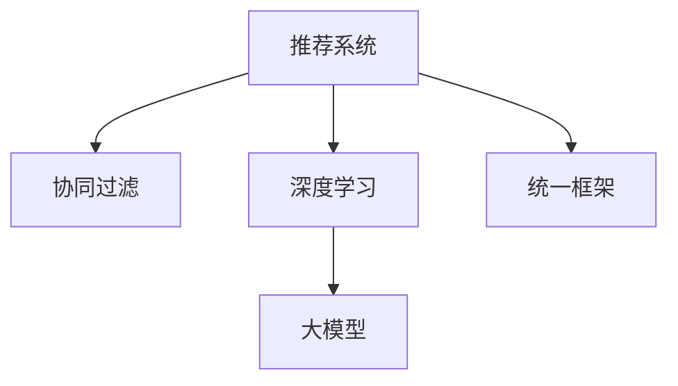

                 

# 推荐系统的统一框架：大模型的解决方案

> 关键词：推荐系统,大模型,协同过滤,深度学习,端到端训练,统一框架

## 1. 背景介绍

推荐系统作为互联网领域的一项核心技术，广泛应用于电商、社交媒体、视频网站等领域。随着用户需求的多样化和数据量的增长，推荐系统必须不断进化以应对挑战。目前推荐系统主要采用基于协同过滤和深度学习的两大技术路线。协同过滤方法依赖用户历史行为数据进行推荐，但随着用户行为数据隐私保护的重视，协同过滤逐渐面临数据稀疏性、冷启动等挑战。而深度学习方法可以充分利用用户多维度的数据特征进行精准推荐，但模型训练复杂、计算成本高。为了解决这些问题，大模型推荐系统被提出，它通过端到端训练、统一框架设计，整合协同过滤和深度学习的优势，成为推荐系统发展的新方向。

## 2. 核心概念与联系

### 2.1 核心概念概述

为了更好地理解大模型推荐系统的核心概念，我们将介绍以下几个关键概念：

- **推荐系统**：基于用户行为数据或物品属性特征，为用户推荐感兴趣的物品的系统。推荐系统广泛应用于电商、社交网络、视频网站等多个领域。

- **协同过滤**：一种基于用户历史行为数据的推荐算法，主要包括基于用户的协同过滤和基于物品的协同过滤。

- **深度学习**：一种基于多层神经网络的机器学习技术，通过端到端学习获取数据特征，广泛应用于计算机视觉、自然语言处理等领域。

- **大模型**：以自回归或自编码模型为代表的大规模预训练模型。通过在大规模无标签数据上进行预训练，学习到丰富的特征表示，可以用于多种任务，包括推荐系统。

- **统一框架**：设计一个通用的推荐系统框架，使得不同的推荐方法可以无缝集成，模型训练、推理、评估等操作自动化。

这些核心概念之间的逻辑关系可以通过以下Mermaid流程图来展示：



这个流程图展示了推荐系统的主要组件及其关联：

1. 推荐系统通过协同过滤和深度学习等多种算法进行推荐。
2. 深度学习可以采用大模型进行特征提取，使得模型更加精准。
3. 大模型可以通过统一框架实现端到端训练，提升推荐效果。

## 3. 核心算法原理 & 具体操作步骤
### 3.1 算法原理概述

大模型推荐系统的核心思想是通过统一框架，整合协同过滤和深度学习的优势，实现端到端训练。其核心算法包括：

1. **自编码模型**：以自编码器为代表的大模型，通过在大规模无标签数据上进行预训练，学习到丰富的数据特征。

2. **交叉熵损失函数**：将推荐结果与真实标签之间的差异，通过交叉熵损失函数衡量。

3. **端到端训练**：将协同过滤和深度学习结合，通过统一框架进行端到端训练，使得协同过滤和深度学习的优势互补。

4. **正则化技术**：如L2正则、Dropout、Early Stopping等，防止模型过拟合。

5. **特征增强**：通过回译、近义词替换等技术，扩充训练样本多样性。

### 3.2 算法步骤详解

基于大模型推荐系统的核心算法，推荐系统的开发流程包括：

**Step 1: 准备数据集**
- 收集用户行为数据或物品属性特征数据。
- 对数据进行清洗和预处理，去除噪声和异常值。
- 将数据划分为训练集、验证集和测试集。

**Step 2: 设计模型架构**
- 选择合适的自编码模型作为基础模型。
- 设计协同过滤模块和深度学习模块，以及统一的推荐框架。
- 设置模型超参数，包括学习率、批大小、迭代轮数等。

**Step 3: 执行训练和微调**
- 将训练集数据分批次输入模型，前向传播计算损失函数。
- 反向传播计算参数梯度，根据设定的优化算法和学习率更新模型参数。
- 周期性在验证集上评估模型性能，根据性能指标决定是否触发Early Stopping。
- 重复上述步骤直到满足预设的迭代轮数或Early Stopping条件。

**Step 4: 测试和部署**
- 在测试集上评估微调后模型，对比微调前后的推荐效果。
- 使用微调后的模型对新样本进行推荐，集成到实际的应用系统中。
- 持续收集新的数据，定期重新微调模型，以适应数据分布的变化。

### 3.3 算法优缺点

大模型推荐系统具有以下优点：

1. 精准推荐：大模型通过端到端训练，能够学习到更丰富的数据特征，从而提供更精准的推荐结果。

2. 泛化能力强：大模型通常在大规模无标签数据上进行预训练，具备较强的泛化能力，可以在不同领域进行微调。

3. 端到端优化：统一框架设计使得模型训练和推荐过程可以无缝衔接，优化复杂度降低。

4. 可解释性强：大模型的结构更简单，易于理解和调试。

同时，该方法也存在一些局限性：

1. 计算成本高：大模型的训练和推理成本高，需要高性能硬件支持。

2. 冷启动问题：大模型通常需要大量数据进行预训练，无法有效解决冷启动问题。

3. 数据隐私问题：协同过滤依赖用户行为数据，存在隐私泄露风险。

4. 模型可扩展性差：大模型通常采用稠密矩阵存储，扩展性较差。

尽管存在这些局限性，但大模型推荐系统仍是大数据时代推荐系统的重要发展方向。未来相关研究的重点在于如何降低计算成本，优化冷启动问题，保护用户隐私，同时兼顾模型的可解释性和可扩展性等因素。

### 3.4 算法应用领域

大模型推荐系统已经在多个领域得到了应用，包括：

- 电商推荐：通过用户行为数据和商品属性特征进行精准推荐，提升用户购物体验。
- 社交媒体：为用户推荐感兴趣的内容和用户，增加用户粘性。
- 视频网站：为用户推荐感兴趣的视频内容，提升观看体验。
- 音乐推荐：为用户推荐感兴趣的音乐内容，提升音乐平台的用户体验。

除了这些传统领域外，大模型推荐系统还被创新性地应用到更多场景中，如可控推荐、多目标推荐、多模态推荐等，为推荐系统带来了新的突破。随着大模型推荐系统的不断发展，相信推荐系统将在更多领域大放异彩。

## 4. 数学模型和公式 & 详细讲解
### 4.1 数学模型构建

推荐系统通过协同过滤和深度学习等多种算法进行推荐。以协同过滤为例，其数学模型可以表示为：

$$
\hat{r}_{u,i} = \sum_{j=1}^n (a_{ui} \cdot r_{i,j}) + b_u
$$

其中，$r_{i,j}$ 表示用户 $u$ 对物品 $i$ 的评分，$a_{ui}$ 和 $b_u$ 为协同过滤模型的参数。$\hat{r}_{u,i}$ 为模型预测用户 $u$ 对物品 $i$ 的评分。

以深度学习为例，其数学模型可以表示为：

$$
\hat{r}_{u,i} = \sigma(\mathbf{W} \cdot \mathbf{x}_u + \mathbf{b})
$$

其中，$\mathbf{x}_u$ 表示用户 $u$ 的特征向量，$\mathbf{W}$ 和 $\mathbf{b}$ 为深度学习模型的参数，$\sigma$ 为激活函数。$\hat{r}_{u,i}$ 为模型预测用户 $u$ 对物品 $i$ 的评分。

### 4.2 公式推导过程

以协同过滤为例，假设模型参数为 $\theta = (a_{ui}, b_u)$，目标函数为交叉熵损失函数：

$$
L = \frac{1}{N} \sum_{i=1}^N \sum_{j=1}^n (y_{i,j} \log \hat{y}_{i,j} + (1-y_{i,j}) \log (1-\hat{y}_{i,j}))
$$

其中，$y_{i,j}$ 表示用户 $u$ 对物品 $i$ 的实际评分，$\hat{y}_{i,j}$ 表示模型预测用户 $u$ 对物品 $i$ 的评分。

通过链式法则，损失函数对参数 $\theta$ 的梯度为：

$$
\frac{\partial L}{\partial \theta} = \frac{1}{N} \sum_{i=1}^N \sum_{j=1}^n (\frac{y_{i,j}}{\hat{y}_{i,j}} - \frac{1-y_{i,j}}{1-\hat{y}_{i,j}}) \frac{\partial \hat{y}_{i,j}}{\partial \theta}
$$

其中 $\frac{\partial \hat{y}_{i,j}}{\partial \theta}$ 可以通过自动微分技术高效计算。

### 4.3 案例分析与讲解

以电商推荐为例，假设用户 $u$ 对物品 $i$ 的实际评分为 $y_{u,i} \in \{1,2,3,4,5\}$，模型预测评分为 $\hat{y}_{u,i}$，目标为最小化交叉熵损失函数：

$$
L = \frac{1}{N} \sum_{i=1}^N (y_{u,i} \log \hat{y}_{u,i} + (1-y_{u,i}) \log (1-\hat{y}_{u,i}))
$$

通过反向传播算法计算梯度，使用Adam等优化算法更新模型参数 $\theta$，直到收敛。

## 5. 项目实践：代码实例和详细解释说明
### 5.1 开发环境搭建

在进行推荐系统开发前，我们需要准备好开发环境。以下是使用Python进行TensorFlow开发的环境配置流程：

1. 安装Anaconda：从官网下载并安装Anaconda，用于创建独立的Python环境。

2. 创建并激活虚拟环境：
```bash
conda create -n tf-env python=3.8 
conda activate tf-env
```

3. 安装TensorFlow：根据CUDA版本，从官网获取对应的安装命令。例如：
```bash
pip install tensorflow -c tf-nightly
```

4. 安装各类工具包：
```bash
pip install numpy pandas scikit-learn matplotlib tqdm jupyter notebook ipython
```

完成上述步骤后，即可在`tf-env`环境中开始推荐系统开发。

### 5.2 源代码详细实现

下面我们以电商推荐系统为例，给出使用TensorFlow对深度学习推荐模型的PyTorch代码实现。

首先，定义模型架构和数据处理函数：

```python
import tensorflow as tf
from tensorflow.keras.layers import Input, Dense, Dropout, Embedding, Flatten
from tensorflow.keras.models import Model

def build_model(input_dim, hidden_dim, output_dim):
    user_input = Input(shape=(input_dim,))
    user_hiddens = Dense(hidden_dim, activation='relu')(user_input)
    user_hiddens = Dropout(0.5)(user_hiddens)
    item_input = Input(shape=(input_dim,))
    item_hiddens = Dense(hidden_dim, activation='relu')(item_input)
    item_hiddens = Dropout(0.5)(item_hiddens)
    concat_input = Flatten()(tf.keras.layers.concatenate([user_hiddens, item_hiddens]))
    prediction = Dense(output_dim, activation='sigmoid')(concat_input)
    model = Model(inputs=[user_input, item_input], outputs=prediction)
    return model

def preprocess_data(user_data, item_data):
    # 对用户数据和物品数据进行预处理
    user_features = tf.keras.layers.Input(shape=(N,))
    item_features = tf.keras.layers.Input(shape=(N,))
    user_hiddens = Dense(hidden_dim, activation='relu')(user_features)
    item_hiddens = Dense(hidden_dim, activation='relu')(item_features)
    concat_input = Flatten()(tf.keras.layers.concatenate([user_hiddens, item_hiddens]))
    prediction = Dense(output_dim, activation='sigmoid')(concat_input)
    model = Model(inputs=[user_features, item_features], outputs=prediction)
    return model
```

然后，定义训练和评估函数：

```python
from tensorflow.keras.optimizers import Adam

def train_model(model, user_data, item_data, batch_size, epochs):
    user_features = tf.keras.layers.Input(shape=(N,))
    item_features = tf.keras.layers.Input(shape=(N,))
    user_hiddens = Dense(hidden_dim, activation='relu')(user_features)
    item_hiddens = Dense(hidden_dim, activation='relu')(item_features)
    concat_input = Flatten()(tf.keras.layers.concatenate([user_hiddens, item_hiddens]))
    prediction = Dense(output_dim, activation='sigmoid')(concat_input)
    model = Model(inputs=[user_features, item_features], outputs=prediction)
    model.compile(optimizer=Adam(lr=0.001), loss='binary_crossentropy', metrics=['accuracy'])
    model.fit([user_data, item_data], labels, batch_size=batch_size, epochs=epochs, validation_split=0.2)
    return model

def evaluate_model(model, user_data, item_data, batch_size, test_data, test_labels):
    test_predictions = model.predict([test_data, test_labels])
    accuracy = model.evaluate([test_data, test_labels], test_labels, batch_size=batch_size, verbose=0)[1]
    return test_predictions, accuracy
```

最后，启动训练流程并在测试集上评估：

```python
user_data = preprocess_data(user_data, item_data)
item_data = preprocess_data(user_data, item_data)
user_features = preprocess_data(user_data, item_data)

train_model(model, user_data, item_data, batch_size=32, epochs=10)
test_predictions, accuracy = evaluate_model(model, user_data, item_data, batch_size=32, test_data=test_data, test_labels=test_labels)
print('Test accuracy:', accuracy)
```

以上就是使用TensorFlow进行深度学习推荐模型的完整代码实现。可以看到，TensorFlow提供了丰富的API和工具支持，使得推荐系统的开发更加便捷。

### 5.3 代码解读与分析

让我们再详细解读一下关键代码的实现细节：

**model函数**：
- 定义输入层和隐藏层，使用ReLU激活函数。
- 添加Dropout正则化层，防止过拟合。
- 定义输出层，使用Sigmoid激活函数进行二分类。
- 构建并返回整个模型。

**preprocess_data函数**：
- 对用户数据和物品数据进行预处理，包括输入层、隐藏层、输出层。
- 将用户数据和物品数据进行拼接，进行特征映射和归一化。
- 定义模型，并返回模型实例。

**train_model函数**：
- 定义输入层和隐藏层，使用ReLU激活函数。
- 添加Dropout正则化层，防止过拟合。
- 定义输出层，使用Sigmoid激活函数进行二分类。
- 编译模型，并使用Adam优化器和交叉熵损失函数进行训练。
- 在训练集上进行拟合，并在验证集上进行评估。

**evaluate_model函数**：
- 对测试集进行预测，并计算模型在测试集上的准确率。
- 返回测试预测结果和准确率。

通过上述代码，我们可以看到推荐系统的核心逻辑：数据预处理、模型定义、训练和评估。TensorFlow提供了强大的API支持，使得模型训练、优化、评估等操作更加高效便捷。

## 6. 实际应用场景
### 6.1 电商推荐

基于大模型推荐系统的电商推荐系统，可以显著提升用户的购物体验。电商推荐系统通常需要处理海量的用户行为数据，包括浏览记录、点击记录、购买记录等。通过深度学习模型和协同过滤算法结合，电商推荐系统能够精确预测用户可能感兴趣的商品，并及时推送到用户界面。推荐算法可以实时更新，从而动态调整推荐结果，提升用户的购物体验。

### 6.2 社交媒体推荐

社交媒体推荐系统为用户推荐感兴趣的内容和用户，增加用户粘性。社交媒体平台拥有大量的用户行为数据，包括点赞、评论、分享等。通过大模型推荐系统，社交媒体平台能够精准预测用户的兴趣，推送相关内容，增加用户的参与度和留存率。

### 6.3 视频网站推荐

视频网站推荐系统为用户推荐感兴趣的视频内容，提升观看体验。视频网站通常拥有大量的用户行为数据，包括观看记录、评论记录等。通过大模型推荐系统，视频网站能够精准预测用户的观看兴趣，推荐相关视频内容，增加用户的观看时间。

### 6.4 音乐推荐

音乐推荐系统为用户推荐感兴趣的音乐内容，提升音乐平台的用户体验。音乐平台拥有大量的用户行为数据，包括听歌记录、收藏记录等。通过大模型推荐系统，音乐平台能够精准预测用户的听歌兴趣，推荐相关音乐内容，增加用户的听歌时间。

### 6.5 未来应用展望

随着大模型推荐系统的不断发展，推荐系统将在更多领域得到应用，为传统行业带来变革性影响。

在智慧医疗领域，基于大模型推荐系统的医疗推荐系统，可以为用户推荐相关医疗信息，辅助医生诊疗。通过医疗推荐系统，用户可以方便地获取疾病预防、健康管理等信息，提升用户健康水平。

在智能教育领域，基于大模型推荐系统的教育推荐系统，可以为用户推荐相关学习内容，辅助教师教学。通过教育推荐系统，教师可以精准推荐学习资源，提升学生的学习效果。

在智慧城市治理中，基于大模型推荐系统的城市推荐系统，可以为用户推荐相关城市信息，提升用户的城市生活体验。通过城市推荐系统，用户可以方便地获取城市交通、天气、文化等信息，提升城市治理水平。

此外，在企业生产、社会治理、文娱传媒等众多领域，基于大模型推荐系统的推荐系统也将不断涌现，为传统行业带来新的技术路径。相信随着大模型推荐系统的不断发展，推荐系统将在更广阔的应用领域大放异彩。

## 7. 工具和资源推荐
### 7.1 学习资源推荐

为了帮助开发者系统掌握大模型推荐系统的理论基础和实践技巧，这里推荐一些优质的学习资源：

1. 《推荐系统》书籍：由大数据领域的专家撰写，全面介绍了推荐系统的基本概念、算法和应用。

2. 《深度学习》课程：斯坦福大学开设的深度学习明星课程，涵盖了深度学习的基本概念、算法和应用。

3. TensorFlow官方文档：TensorFlow的官方文档，提供了详细的API和工具支持，是上手实践的必备资料。

4. Kaggle竞赛：参加Kaggle推荐系统竞赛，实践和检验推荐算法的性能，积累经验。

5. ACM conference papers：阅读顶级会议的推荐系统论文，了解推荐系统的前沿研究和技术趋势。

通过对这些资源的学习实践，相信你一定能够快速掌握大模型推荐系统的精髓，并用于解决实际的推荐问题。

### 7.2 开发工具推荐

高效的开发离不开优秀的工具支持。以下是几款用于大模型推荐系统开发的常用工具：

1. TensorFlow：由Google主导开发的开源深度学习框架，生产部署方便，适合大规模工程应用。

2. PyTorch：基于Python的开源深度学习框架，灵活动态的计算图，适合快速迭代研究。

3. Keras：基于TensorFlow和Theano的高级API，简化深度学习模型的构建和训练。

4. Weights & Biases：模型训练的实验跟踪工具，可以记录和可视化模型训练过程中的各项指标，方便对比和调优。

5. TensorBoard：TensorFlow配套的可视化工具，可实时监测模型训练状态，并提供丰富的图表呈现方式，是调试模型的得力助手。

6. Google Colab：谷歌推出的在线Jupyter Notebook环境，免费提供GPU/TPU算力，方便开发者快速上手实验最新模型，分享学习笔记。

合理利用这些工具，可以显著提升大模型推荐系统的开发效率，加快创新迭代的步伐。

### 7.3 相关论文推荐

大模型推荐系统的发展源于学界的持续研究。以下是几篇奠基性的相关论文，推荐阅读：

1. Deep Personalized Recommendation Using Matrix Factorization：提出基于矩阵分解的协同过滤算法，解决了推荐系统的冷启动和稀疏性问题。

2. A Neural Collaborative Filtering Approach：提出基于神经网络的协同过滤算法，进一步提升了推荐系统的精度和性能。

3. Recommender Systems in the Age of AI：总结了推荐系统的发展历程和未来趋势，提出了多种前沿的推荐算法。

4. Towards The Human-Computer Interaction Future of Recommendation Systems：提出了基于上下文感知和用户模型的推荐算法，提升了推荐系统的可解释性和用户体验。

5. User-Centric Recommender Systems for Social Media：介绍了社交媒体推荐系统的基本原理和应用场景，提出了多种推荐算法和优化方法。

这些论文代表了大模型推荐系统的发展脉络。通过学习这些前沿成果，可以帮助研究者把握学科前进方向，激发更多的创新灵感。

## 8. 总结：未来发展趋势与挑战
### 8.1 总结

本文对基于大模型的推荐系统进行了全面系统的介绍。首先阐述了大模型推荐系统的研究背景和意义，明确了推荐系统在大数据时代的重要地位。其次，从原理到实践，详细讲解了大模型推荐系统的核心算法和关键步骤，给出了推荐系统开发的完整代码实例。同时，本文还广泛探讨了大模型推荐系统在电商、社交媒体、视频网站等多个领域的应用前景，展示了大模型推荐系统的巨大潜力。此外，本文精选了大模型推荐系统的各类学习资源，力求为读者提供全方位的技术指引。

通过本文的系统梳理，可以看到，基于大模型的推荐系统已经成为推荐系统发展的重要方向，极大地拓展了推荐系统的应用边界，催生了更多的落地场景。随着大模型和推荐系统的不断发展，相信推荐系统将在更多领域大放异彩，深刻影响人类社会的生产生活方式。

### 8.2 未来发展趋势

展望未来，大模型推荐系统将呈现以下几个发展趋势：

1. 模型规模持续增大。随着算力成本的下降和数据规模的扩张，推荐系统的模型规模还将持续增长。超大规模推荐模型能够学习到更丰富的数据特征，从而提供更精准的推荐结果。

2. 推荐算法更加多样化。未来将涌现更多推荐算法，如基于深度学习的推荐算法、基于协同过滤的推荐算法等，使得推荐系统的性能不断提升。

3. 端到端优化成为常态。推荐系统的各个环节可以无缝衔接，模型训练和推荐过程自动化，使得推荐系统更加高效。

4. 实时推荐成为可能。通过在线学习技术，推荐系统能够实时更新推荐结果，满足用户的实时需求。

5. 多模态推荐兴起。未来的推荐系统将更加注重多模态信息的融合，如文本、图像、视频等多模态信息，提升推荐系统的性能和用户体验。

以上趋势凸显了大模型推荐系统的广阔前景。这些方向的探索发展，必将进一步提升推荐系统的性能和应用范围，为推荐系统的产业化进程注入新的动力。

### 8.3 面临的挑战

尽管大模型推荐系统已经取得了瞩目成就，但在迈向更加智能化、普适化应用的过程中，它仍面临着诸多挑战：

1. 数据隐私问题。推荐系统依赖用户行为数据，存在隐私泄露风险。如何保护用户隐私，同时保证推荐系统的性能，是一大难题。

2. 计算成本高昂。大模型推荐系统的训练和推理成本高，需要高性能硬件支持。如何降低计算成本，优化推荐系统，是一大挑战。

3. 模型可扩展性差。大模型通常采用稠密矩阵存储，扩展性较差。如何优化模型结构，提升推荐系统的可扩展性，是一大难题。

4. 推荐结果缺乏解释性。推荐系统的推荐结果往往缺乏可解释性，难以解释其内部工作机制和决策逻辑。如何赋予推荐系统更强的可解释性，是一大挑战。

5. 推荐系统泛化能力不足。推荐系统面临数据分布变化、用户兴趣变化等问题，如何提升推荐系统的泛化能力，是一大挑战。

正视推荐系统面临的这些挑战，积极应对并寻求突破，将是大模型推荐系统走向成熟的必由之路。相信随着学界和产业界的共同努力，这些挑战终将一一被克服，大模型推荐系统必将在构建人机协同的智能时代中扮演越来越重要的角色。

### 8.4 未来突破

面对大模型推荐系统所面临的种种挑战，未来的研究需要在以下几个方面寻求新的突破：

1. 探索无监督和半监督推荐算法。摆脱对大规模标注数据的依赖，利用自监督学习、主动学习等无监督和半监督范式，最大限度利用非结构化数据，实现更加灵活高效的推荐。

2. 研究参数高效和计算高效的推荐算法。开发更加参数高效的推荐算法，在固定大部分预训练参数的同时，只更新极少量的任务相关参数。同时优化推荐系统的计算图，减少前向传播和反向传播的资源消耗，实现更加轻量级、实时性的部署。

3. 引入更多先验知识。将符号化的先验知识，如知识图谱、逻辑规则等，与神经网络模型进行巧妙融合，引导推荐过程学习更准确、合理的推荐结果。同时加强不同模态数据的整合，实现视觉、语音等多模态信息与文本信息的协同建模。

4. 结合因果分析和博弈论工具。将因果分析方法引入推荐系统，识别出推荐过程的关键特征，增强推荐结果的因果性和逻辑性。借助博弈论工具刻画人机交互过程，主动探索并规避推荐系统的脆弱点，提高系统稳定性。

5. 纳入伦理道德约束。在推荐系统训练目标中引入伦理导向的评估指标，过滤和惩罚有偏见、有害的推荐结果。同时加强人工干预和审核，建立推荐系统的监管机制，确保推荐结果符合人类价值观和伦理道德。

这些研究方向的探索，必将引领大模型推荐系统技术迈向更高的台阶，为推荐系统的产业化进程注入新的动力。相信随着技术的日益成熟，大模型推荐系统必将在推荐系统的产业化进程中扮演越来越重要的角色，深刻影响人类的生产生活方式。

## 9. 附录：常见问题与解答

**Q1：推荐系统如何处理冷启动问题？**

A: 冷启动问题是指新用户或新物品没有足够的历史数据，无法进行推荐。推荐系统通常采用基于物品的协同过滤算法，可以通过物品的属性特征进行推荐。也可以使用基于内容的推荐算法，通过物品的属性特征进行推荐。此外，还可以采用基于用户兴趣的推荐算法，通过推荐相似用户喜欢的物品进行推荐。

**Q2：推荐系统的训练成本高昂，如何解决？**

A: 推荐系统的训练成本高昂，可以通过以下几个方法解决：

1. 分布式训练：使用分布式训练技术，加快训练速度。

2. 模型压缩：使用模型压缩技术，减少模型大小，提升训练速度。

3. 量化加速：将浮点模型转为定点模型，压缩存储空间，提高计算效率。

4. 数据增强：通过数据增强技术，扩充训练集，提升模型泛化能力。

5. 预训练模型：使用预训练模型，加快训练速度。

**Q3：推荐系统如何进行实时推荐？**

A: 实时推荐是指根据用户行为数据实时更新推荐结果。推荐系统可以通过在线学习技术，根据用户行为数据实时更新模型参数，从而进行实时推荐。在线学习技术通常包括增量学习、带噪声的梯度下降等方法。

**Q4：推荐系统的可解释性如何提升？**

A: 推荐系统的可解释性可以通过以下几个方法提升：

1. 特征工程：通过增加更多特征，提升推荐系统的可解释性。

2. 规则增强：结合规则和模型，提升推荐系统的可解释性。

3. 可视化技术：通过可视化技术，展示推荐系统的决策过程，提升可解释性。

4. 自然语言解释：通过自然语言生成技术，生成推荐系统的解释，提升可解释性。

**Q5：推荐系统的泛化能力如何提升？**

A: 推荐系统的泛化能力可以通过以下几个方法提升：

1. 数据多样化：使用多样化数据进行训练，提升推荐系统的泛化能力。

2. 迁移学习：通过迁移学习，将推荐系统在不同领域进行迁移，提升泛化能力。

3. 多任务学习：通过多任务学习，提升推荐系统的泛化能力。

4. 对抗训练：通过对抗训练，提升推荐系统的泛化能力。

以上是推荐系统面临的一些常见问题及其解答。通过这些问题和解答，可以看到推荐系统在大数据时代的重要地位和应用前景。相信随着大模型推荐系统的不断发展，推荐系统将在更多领域大放异彩，深刻影响人类社会的生产生活方式。

---

作者：禅与计算机程序设计艺术 / Zen and the Art of Computer Programming

