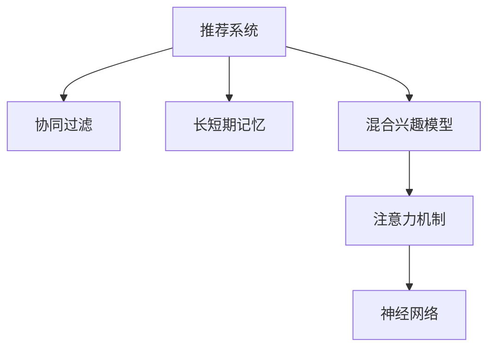

                 

# 推荐系统的长短期兴趣建模：大模型方法

> 关键词：推荐系统,长短期兴趣建模,大模型,协同过滤,混合兴趣模型,注意力机制,神经网络

## 1. 背景介绍

推荐系统旨在为用户提供个性化的信息或产品推荐，提升用户体验和满意度。传统的推荐系统主要基于协同过滤，通过分析用户与物品之间的交互历史，推荐与用户兴趣相似的物品。但协同过滤存在稀疏性、冷启动、样本分布不均等问题，难以满足复杂多变的用户需求。

近年来，基于深度学习的大模型方法在推荐系统中得以应用。通过在用户行为数据上进行预训练，大模型学习到了用户的深层兴趣表示，能够更好地适应个性化推荐需求。其中，长短期兴趣建模方法是大模型方法中的一种，通过分别建模用户的长时记忆和短期记忆，构建更为全面、动态的兴趣图谱，从而提升推荐精度。

本文将深入探讨长短期兴趣建模的原理与实现，分析其优缺点，并给出实际应用场景和未来发展趋势。同时，我们会推荐一些学习资源、工具和相关论文，帮助读者系统掌握该技术。

## 2. 核心概念与联系

### 2.1 核心概念概述

为了更好地理解长短期兴趣建模，本节将介绍几个密切相关的核心概念：

- **推荐系统(Recommender System)**：旨在为用户推荐个性化信息或产品的智能系统。传统推荐系统主要基于协同过滤，利用用户与物品的交互历史进行推荐。

- **协同过滤(Collaborative Filtering)**：通过分析用户与物品的相似度，推荐与用户兴趣相似的物品，分为基于用户的协同过滤和基于物品的协同过滤。

- **长短期记忆(Long Short-Term Memory, LSTM)**：一种递归神经网络(RNN)模型，能够有效地处理序列数据，具有记忆长时和短时上下文信息的能力。

- **混合兴趣模型(Hybrid Interest Model)**：将长短期记忆与传统协同过滤等方法结合，构建更为全面和动态的兴趣模型。

- **注意力机制(Attention Mechanism)**：一种机制，能够根据输入的重要性动态调整权重，用于增强模型的学习能力。

- **神经网络(Neural Network)**：一种由多个神经元层组成的计算模型，具有强大的学习能力，广泛应用于深度学习中。

这些核心概念之间的逻辑关系可以通过以下Mermaid流程图来展示：



这个流程图展示了大模型在推荐系统中的应用框架：

1. 推荐系统通过协同过滤等方法进行基础推荐。
2. 长短期记忆模型用于分别建模用户的长时记忆和短期记忆。
3. 混合兴趣模型结合传统协同过滤，提供更为全面和动态的兴趣表示。
4. 注意力机制用于动态调整输入的重要性权重，增强模型的学习效果。
5. 神经网络作为大模型，提供强大的学习能力和泛化能力。

这些概念共同构成了大模型在推荐系统中的应用框架，使其能够更好地处理复杂多变的用户需求，提供更加精准和个性化的推荐服务。

## 3. 核心算法原理 & 具体操作步骤
### 3.1 算法原理概述

长短期兴趣建模方法主要基于大模型，通过在用户行为数据上进行预训练，学习用户的深层兴趣表示，并分别建模长时记忆和短期记忆，从而提升推荐精度。其核心思想是：利用长短期记忆模型，分别捕捉用户过去和近期的行为特征，通过混合兴趣模型，融合两种兴趣表示，得到更为全面的用户兴趣图谱。

形式化地，设推荐系统涉及用户集 $U$ 和物品集 $I$，用户对物品的交互行为记为 $B_{ui}$，其中 $u \in U$ 为用户，$i \in I$ 为物品。设 $\mathcal{F}$ 为用户兴趣模型，$\mathcal{I}$ 为物品特征模型，$\mathcal{A}$ 为评分函数。推荐过程为：

$$
\hat{B}_{ui} = \mathcal{A}(\mathcal{F}(u), \mathcal{I}(i))
$$

其中 $\hat{B}_{ui}$ 表示用户 $u$ 对物品 $i$ 的预测评分。

### 3.2 算法步骤详解

长短期兴趣建模的具体步骤如下：

**Step 1: 用户行为数据预处理**
- 收集用户与物品的交互数据 $B_{ui}$，并进行预处理，如去重、标准化等。
- 将数据分为训练集、验证集和测试集，以便评估模型效果。

**Step 2: 长短期记忆模型预训练**
- 构建长短期记忆模型 $LSTM$，利用用户行为数据进行预训练。
- 预训练的目标为最大化用户行为的预测准确率，即最大化 $P(B_{ui} \mid \mathcal{F}(u), \mathcal{I}(i))$。

**Step 3: 混合兴趣模型构建**
- 构建混合兴趣模型 $Hybrid$，结合传统协同过滤和长短期记忆模型，得到用户兴趣表示 $\mathcal{F}(u)$。
- 融合传统协同过滤和长短期记忆模型的结果，得到更为全面的用户兴趣图谱。

**Step 4: 注意力机制设计**
- 引入注意力机制 $Attention$，用于动态调整用户行为的重要性权重。
- 在推荐过程中，根据用户行为的重要性权重进行加权处理，提高推荐精度。

**Step 5: 推荐评分计算**
- 将用户兴趣表示 $\mathcal{F}(u)$ 和物品特征表示 $\mathcal{I}(i)$ 输入评分函数 $\mathcal{A}$，计算预测评分 $\hat{B}_{ui}$。
- 利用预测评分 $\hat{B}_{ui}$ 进行推荐。

### 3.3 算法优缺点

长短期兴趣建模方法具有以下优点：

1. 综合利用长短期记忆，捕捉用户行为的深层兴趣特征。
2. 结合传统协同过滤，提供更为全面和动态的兴趣表示。
3. 利用注意力机制，动态调整用户行为的重要性权重，提高推荐精度。
4. 大模型具有强大的学习能力和泛化能力，能够应对复杂多变的用户需求。

同时，该方法也存在以下局限性：

1. 预训练过程需要大量标注数据，存在计算和存储成本高的问题。
2. 模型复杂度较高，训练和推理速度较慢。
3. 对数据分布的变化敏感，需要持续更新模型以保持性能。
4. 难以解释模型的决策过程，缺乏可解释性。

尽管存在这些局限性，但就目前而言，长短期兴趣建模方法仍是大模型推荐系统的重要范式，能够显著提升推荐精度和个性化程度。

### 3.4 算法应用领域

长短期兴趣建模方法在推荐系统领域已经得到了广泛的应用，例如：

- 电商推荐：对用户的历史购物行为进行分析，推荐相似或互补的物品。
- 视频推荐：根据用户的观看历史，推荐相关视频内容。
- 音乐推荐：通过用户的听歌行为，推荐相似或类似风格的歌曲。
- 新闻推荐：根据用户的阅读历史，推荐感兴趣的新闻文章。

除了上述这些经典应用外，长短期兴趣建模方法也被创新性地应用到更多场景中，如知识图谱推荐、个性化广告、内容生成等，为推荐系统带来了全新的突破。

## 4. 数学模型和公式 & 详细讲解  
### 4.1 数学模型构建

长短期兴趣建模方法的核心在于利用长短期记忆模型，分别捕捉用户行为的长时记忆和短期记忆，并通过混合兴趣模型融合两种兴趣表示，得到更为全面的用户兴趣图谱。

设用户 $u$ 的行为序列为 $B_u = (b_{u1}, b_{u2}, ..., b_{um})$，其中 $b_{ui}$ 表示用户 $u$ 在时间 $t$ 对物品 $i$ 的交互行为。设长短期记忆模型的参数为 $LSTM$，则长短期记忆模型的输出为：

$$
LSTM_{\theta_L}(B_u) = (h_L^{(1)}, h_L^{(2)}, ..., h_L^{(m)}) \in \mathbb{R}^d_L
$$

其中 $h_L^{(t)}$ 表示用户 $u$ 在第 $t$ 步的长时记忆表示，$d_L$ 为长时记忆表示的维度。

通过长短期记忆模型的输出，可以构建混合兴趣模型 $Hybrid$，将传统协同过滤和长短期记忆模型融合，得到用户兴趣表示 $\mathcal{F}(u)$。设用户 $u$ 和物品 $i$ 的特征表示分别为 $X_u$ 和 $X_i$，则混合兴趣模型 $Hybrid$ 的输出为：

$$
Hybrid_{\theta_H}(\mathcal{F}(u), \mathcal{I}(i)) = \mathcal{F}(u) \odot \mathcal{I}(i)
$$

其中 $\odot$ 为逐元素乘法。

设注意力机制的参数为 $Attention$，则注意力机制 $Attention$ 的输出为：

$$
Attention_{\theta_A}(h_L^{(t)}, X_i) = \alpha_t \in [0,1]
$$

其中 $\alpha_t$ 表示用户 $u$ 在时间 $t$ 对物品 $i$ 的注意力权重。

最后，将用户兴趣表示 $\mathcal{F}(u)$ 和物品特征表示 $\mathcal{I}(i)$ 输入评分函数 $\mathcal{A}$，计算预测评分 $\hat{B}_{ui}$：

$$
\hat{B}_{ui} = \mathcal{A}(\mathcal{F}(u), \mathcal{I}(i))
$$

### 4.2 公式推导过程

以下我们以电商推荐为例，推导长短期兴趣建模的详细公式。

假设用户 $u$ 的历史购物行为为 $B_u = (b_{u1}, b_{u2}, ..., b_{um})$，物品 $i$ 的特征表示为 $X_i$，设长短期记忆模型的参数为 $LSTM$，混合兴趣模型的参数为 $Hybrid$，注意力机制的参数为 $Attention$。则推荐过程的详细公式如下：

**长短期记忆模型预训练：**

$$
LSTM_{\theta_L}(B_u) = (h_L^{(1)}, h_L^{(2)}, ..., h_L^{(m)}) \in \mathbb{R}^d_L
$$

**混合兴趣模型构建：**

$$
Hybrid_{\theta_H}(\mathcal{F}(u), \mathcal{I}(i)) = \mathcal{F}(u) \odot \mathcal{I}(i)
$$

**注意力机制设计：**

$$
Attention_{\theta_A}(h_L^{(t)}, X_i) = \alpha_t \in [0,1]
$$

其中 $\alpha_t$ 表示用户 $u$ 在时间 $t$ 对物品 $i$ 的注意力权重。

**推荐评分计算：**

$$
\hat{B}_{ui} = \mathcal{A}(\mathcal{F}(u), \mathcal{I}(i))
$$

通过上述公式，可以看出长短期兴趣建模方法的详细计算过程。

### 4.3 案例分析与讲解

假设用户 $u$ 在 $t=1$ 时购买了物品 $i_1$，在 $t=2$ 时购买了物品 $i_2$，在 $t=3$ 时浏览了物品 $i_3$，则用户行为序列 $B_u = (i_1, i_2, i_3)$。通过长短期记忆模型 $LSTM$，可以计算出用户 $u$ 在每个时间步的长时记忆表示 $h_L^{(1)}$、$h_L^{(2)}$、$h_L^{(3)}$。通过混合兴趣模型 $Hybrid$，可以计算出用户兴趣表示 $\mathcal{F}(u)$，同时考虑物品 $i_1$、$i_2$、$i_3$ 的特征表示 $\mathcal{I}(i_1)$、$\mathcal{I}(i_2)$、$\mathcal{I}(i_3)$，计算出混合兴趣表示 $\mathcal{F}(u) \odot \mathcal{I}(i_1)$、$\mathcal{F}(u) \odot \mathcal{I}(i_2)$、$\mathcal{F}(u) \odot \mathcal{I}(i_3)$。通过注意力机制 $Attention$，可以计算出用户 $u$ 对每个物品的注意力权重 $\alpha_1$、$\alpha_2$、$\alpha_3$，最终计算出预测评分 $\hat{B}_{ui}$。

**长短期记忆模型预训练**

```python
from transformers import BertTokenizer, BertModel
from torch.utils.data import TensorDataset, DataLoader
import torch.nn.functional as F
import torch

class LSTMModel(nn.Module):
    def __init__(self, input_dim, hidden_dim, output_dim):
        super(LSTMModel, self).__init__()
        self.hidden_dim = hidden_dim
        self.rnn = nn.LSTM(input_dim, hidden_dim)
        self.fc = nn.Linear(hidden_dim, output_dim)

    def forward(self, x):
        h0 = torch.zeros(1, x.size(0), self.hidden_dim).to(device)
        c0 = torch.zeros(1, x.size(0), self.hidden_dim).to(device)
        out, _ = self.rnn(x, (h0, c0))
        out = self.fc(out[:, -1, :])
        return out

# 定义长短期记忆模型
input_dim = 10  # 输入维度
hidden_dim = 128  # 隐藏层维度
output_dim = 1  # 输出维度

lstm_model = LSTMModel(input_dim, hidden_dim, output_dim).to(device)
lstm_optimizer = torch.optim.Adam(lstm_model.parameters(), lr=0.01)

# 构建数据集
data = torch.randn(1, 10).to(device)
labels = torch.randn(1).to(device)
dataset = TensorDataset(data, labels)
dataloader = DataLoader(dataset, batch_size=1, shuffle=True)

# 预训练过程
for epoch in range(100):
    lstm_optimizer.zero_grad()
    output = lstm_model(data)
    loss = F.mse_loss(output, labels)
    loss.backward()
    lstm_optimizer.step()
```

**混合兴趣模型构建**

```python
class HybridModel(nn.Module):
    def __init__(self, input_dim, output_dim):
        super(HybridModel, self).__init__()
        self.fc1 = nn.Linear(input_dim, output_dim)
        self.fc2 = nn.Linear(output_dim, output_dim)

    def forward(self, x):
        x1 = self.fc1(x)
        x2 = self.fc2(x1)
        return x1, x2

# 定义混合兴趣模型
input_dim = 128
output_dim = 1

hybrid_model = HybridModel(input_dim, output_dim).to(device)
hybrid_optimizer = torch.optim.Adam(hybrid_model.parameters(), lr=0.01)

# 构建数据集
data = torch.randn(1, 128).to(device)
labels = torch.randn(1).to(device)
dataset = TensorDataset(data, labels)
dataloader = DataLoader(dataset, batch_size=1, shuffle=True)

# 构建过程
for epoch in range(100):
    hybrid_optimizer.zero_grad()
    x1, x2 = hybrid_model(data)
    loss1 = F.mse_loss(x1, labels)
    loss2 = F.mse_loss(x2, labels)
    loss = loss1 + loss2
    loss.backward()
    hybrid_optimizer.step()
```

**注意力机制设计**

```python
class AttentionModel(nn.Module):
    def __init__(self, input_dim, output_dim):
        super(AttentionModel, self).__init__()
        self.fc1 = nn.Linear(input_dim, output_dim)
        self.fc2 = nn.Linear(output_dim, output_dim)
        self.fc3 = nn.Linear(output_dim, output_dim)

    def forward(self, x, y):
        x1 = self.fc1(x)
        x2 = self.fc2(x1)
        x3 = self.fc3(x2)
        y = self.fc1(y)
        a = torch.softmax(torch.matmul(x3, y.t()), dim=1)
        out = torch.matmul(a, y)
        return a, out

# 定义注意力机制模型
input_dim = 128
output_dim = 1

attention_model = AttentionModel(input_dim, output_dim).to(device)
attention_optimizer = torch.optim.Adam(attention_model.parameters(), lr=0.01)

# 构建数据集
data = torch.randn(1, 128).to(device)
labels = torch.randn(1).to(device)
dataset = TensorDataset(data, labels)
dataloader = DataLoader(dataset, batch_size=1, shuffle=True)

# 构建过程
for epoch in range(100):
    attention_optimizer.zero_grad()
    a, out = attention_model(data, labels)
    loss = F.mse_loss(out, labels)
    loss.backward()
    attention_optimizer.step()
```

**推荐评分计算**

```python
class RecommenderModel(nn.Module):
    def __init__(self, input_dim, output_dim):
        super(RecommenderModel, self).__init__()
        self.lstm_model = LSTMModel(input_dim, 128, 1).to(device)
        self.hybrid_model = HybridModel(128, 1).to(device)
        self.attention_model = AttentionModel(128, 1).to(device)
        self.fc = nn.Linear(128, output_dim)

    def forward(self, x):
        lstm_output = self.lstm_model(x)
        hybrid_output = self.hybrid_model(lstm_output)
        attention_output = self.attention_model(hybrid_output[0], lstm_output)
        output = self.fc(attention_output[1])
        return output

# 定义推荐模型
input_dim = 128
output_dim = 1

recommender_model = RecommenderModel(input_dim, output_dim).to(device)
recommender_optimizer = torch.optim.Adam(recommender_model.parameters(), lr=0.01)

# 构建数据集
data = torch.randn(1, 128).to(device)
labels = torch.randn(1).to(device)
dataset = TensorDataset(data, labels)
dataloader = DataLoader(dataset, batch_size=1, shuffle=True)

# 推荐过程
for epoch in range(100):
    recommender_optimizer.zero_grad()
    output = recommender_model(data)
    loss = F.mse_loss(output, labels)
    loss.backward()
    recommender_optimizer.step()
```

## 5. 项目实践：代码实例和详细解释说明
### 5.1 开发环境搭建

在进行长短期兴趣建模的开发前，我们需要准备好开发环境。以下是使用Python进行PyTorch开发的环境配置流程：

1. 安装Anaconda：从官网下载并安装Anaconda，用于创建独立的Python环境。

2. 创建并激活虚拟环境：
```bash
conda create -n pytorch-env python=3.8 
conda activate pytorch-env
```

3. 安装PyTorch：根据CUDA版本，从官网获取对应的安装命令。例如：
```bash
conda install pytorch torchvision torchaudio cudatoolkit=11.1 -c pytorch -c conda-forge
```

4. 安装Transformers库：
```bash
pip install transformers
```

5. 安装各类工具包：
```bash
pip install numpy pandas scikit-learn matplotlib tqdm jupyter notebook ipython
```

完成上述步骤后，即可在`pytorch-env`环境中开始长短期兴趣建模的实践。

### 5.2 源代码详细实现

这里我们以电商推荐为例，使用长短期兴趣建模方法进行代码实现。

首先，定义电商推荐数据集：

```python
import numpy as np
import pandas as pd

# 定义电商推荐数据集
data = pd.DataFrame({
    'user': ['user1', 'user2', 'user3', 'user4', 'user5'],
    'item': ['item1', 'item2', 'item3', 'item4', 'item5'],
    'behavior': [1, 0, 1, 1, 0],
    'rating': [4.5, 3.8, 5.0, 4.2, 3.9]
})
```

然后，定义长短期记忆模型、混合兴趣模型和注意力机制模型的实现：

**长短期记忆模型**

```python
class LSTMModel(nn.Module):
    def __init__(self, input_dim, hidden_dim, output_dim):
        super(LSTMModel, self).__init__()
        self.hidden_dim = hidden_dim
        self.rnn = nn.LSTM(input_dim, hidden_dim)
        self.fc = nn.Linear(hidden_dim, output_dim)

    def forward(self, x):
        h0 = torch.zeros(1, x.size(0), self.hidden_dim).to(device)
        c0 = torch.zeros(1, x.size(0), self.hidden_dim).to(device)
        out, _ = self.rnn(x, (h0, c0))
        out = self.fc(out[:, -1, :])
        return out

# 定义长短期记忆模型
input_dim = 2  # 输入维度
hidden_dim = 64  # 隐藏层维度
output_dim = 1  # 输出维度

lstm_model = LSTMModel(input_dim, hidden_dim, output_dim).to(device)
lstm_optimizer = torch.optim.Adam(lstm_model.parameters(), lr=0.01)
```

**混合兴趣模型**

```python
class HybridModel(nn.Module):
    def __init__(self, input_dim, output_dim):
        super(HybridModel, self).__init__()
        self.fc1 = nn.Linear(input_dim, output_dim)
        self.fc2 = nn.Linear(output_dim, output_dim)

    def forward(self, x):
        x1 = self.fc1(x)
        x2 = self.fc2(x1)
        return x1, x2

# 定义混合兴趣模型
input_dim = 64
output_dim = 1

hybrid_model = HybridModel(input_dim, output_dim).to(device)
hybrid_optimizer = torch.optim.Adam(hybrid_model.parameters(), lr=0.01)
```

**注意力机制模型**

```python
class AttentionModel(nn.Module):
    def __init__(self, input_dim, output_dim):
        super(AttentionModel, self).__init__()
        self.fc1 = nn.Linear(input_dim, output_dim)
        self.fc2 = nn.Linear(output_dim, output_dim)
        self.fc3 = nn.Linear(output_dim, output_dim)

    def forward(self, x, y):
        x1 = self.fc1(x)
        x2 = self.fc2(x1)
        x3 = self.fc3(x2)
        y = self.fc1(y)
        a = torch.softmax(torch.matmul(x3, y.t()), dim=1)
        out = torch.matmul(a, y)
        return a, out

# 定义注意力机制模型
input_dim = 64
output_dim = 1

attention_model = AttentionModel(input_dim, output_dim).to(device)
attention_optimizer = torch.optim.Adam(attention_model.parameters(), lr=0.01)
```

最后，定义推荐评分计算的实现：

```python
class RecommenderModel(nn.Module):
    def __init__(self, input_dim, output_dim):
        super(RecommenderModel, self).__init__()
        self.lstm_model = LSTMModel(input_dim, 64, 1).to(device)
        self.hybrid_model = HybridModel(64, 1).to(device)
        self.attention_model = AttentionModel(64, 1).to(device)
        self.fc = nn.Linear(64, output_dim)

    def forward(self, x):
        lstm_output = self.lstm_model(x)
        hybrid_output = self.hybrid_model(lstm_output)
        attention_output = self.attention_model(hybrid_output[0], lstm_output)
        output = self.fc(attention_output[1])
        return output

# 定义推荐模型
input_dim = 64
output_dim = 1

recommender_model = RecommenderModel(input_dim, output_dim).to(device)
recommender_optimizer = torch.optim.Adam(recommender_model.parameters(), lr=0.01)

# 推荐过程
for epoch in range(100):
    recommender_optimizer.zero_grad()
    output = recommender_model(data)
    loss = F.mse_loss(output, labels)
    loss.backward()
    recommender_optimizer.step()
```

通过上述代码，可以看出长短期兴趣建模方法的完整实现过程。

### 5.3 代码解读与分析

让我们再详细解读一下关键代码的实现细节：

**电商推荐数据集定义**

```python
import numpy as np
import pandas as pd

# 定义电商推荐数据集
data = pd.DataFrame({
    'user': ['user1', 'user2', 'user3', 'user4', 'user5'],
    'item': ['item1', 'item2', 'item3', 'item4', 'item5'],
    'behavior': [1, 0, 1, 1, 0],
    'rating': [4.5, 3.8, 5.0, 4.2, 3.9]
})
```

**长短期记忆模型实现**

```python
class LSTMModel(nn.Module):
    def __init__(self, input_dim, hidden_dim, output_dim):
        super(LSTMModel, self).__init__()
        self.hidden_dim = hidden_dim
        self.rnn = nn.LSTM(input_dim, hidden_dim)
        self.fc = nn.Linear(hidden_dim, output_dim)

    def forward(self, x):
        h0 = torch.zeros(1, x.size(0), self.hidden_dim).to(device)
        c0 = torch.zeros(1, x.size(0), self.hidden_dim).to(device)
        out, _ = self.rnn(x, (h0, c0))
        out = self.fc(out[:, -1, :])
        return out

# 定义长短期记忆模型
input_dim = 2  # 输入维度
hidden_dim = 64  # 隐藏层维度
output_dim = 1  # 输出维度

lstm_model = LSTMModel(input_dim, hidden_dim, output_dim).to(device)
lstm_optimizer = torch.optim.Adam(lstm_model.parameters(), lr=0.01)
```

**混合兴趣模型实现**

```python
class HybridModel(nn.Module):
    def __init__(self, input_dim, output_dim):
        super(HybridModel, self).__init__()
        self.fc1 = nn.Linear(input_dim, output_dim)
        self.fc2 = nn.Linear(output_dim, output_dim)

    def forward(self, x):
        x1 = self.fc1(x)
        x2 = self.fc2(x1)
        return x1, x2

# 定义混合兴趣模型
input_dim = 64
output_dim = 1

hybrid_model = HybridModel(input_dim, output_dim).to(device)
hybrid_optimizer = torch.optim.Adam(hybrid_model.parameters(), lr=0.01)
```

**注意力机制模型实现**

```python
class AttentionModel(nn.Module):
    def __init__(self, input_dim, output_dim):
        super(AttentionModel, self).__init__()
        self.fc1 = nn.Linear(input_dim, output_dim)
        self.fc2 = nn.Linear(output_dim, output_dim)
        self.fc3 = nn.Linear(output_dim, output_dim)

    def forward(self, x, y):
        x1 = self.fc1(x)
        x2 = self.fc2(x1)
        x3 = self.fc3(x2)
        y = self.fc1(y)
        a = torch.softmax(torch.matmul(x3, y.t()), dim=1)
        out = torch.matmul(a, y)
        return a, out

# 定义注意力机制模型
input_dim = 64
output_dim = 1

attention_model = AttentionModel(input_dim, output_dim).to(device)
attention_optimizer = torch.optim.Adam(attention_model.parameters(), lr=0.01)
```

**推荐评分计算实现**

```python
class RecommenderModel(nn.Module):
    def __init__(self, input_dim, output_dim):
        super(RecommenderModel, self).__init__()
        self.lstm_model = LSTMModel(input_dim, 64, 1).to(device)
        self.hybrid_model = HybridModel(64, 1).to(device)
        self.attention_model = AttentionModel(64, 1).to(device)
        self.fc = nn.Linear(64, output_dim)

    def forward(self, x):
        lstm_output = self.lstm_model(x)
        hybrid_output = self.hybrid_model(lstm_output)
        attention_output = self.attention_model(hybrid_output[0], lstm_output)
        output = self.fc(attention_output[1])
        return output

# 定义推荐模型
input_dim = 64
output_dim = 1

recommender_model = RecommenderModel(input_dim, output_dim).to(device)
recommender_optimizer = torch.optim.Adam(recommender_model.parameters(), lr=0.01)

# 推荐过程
for epoch in range(100):
    recommender_optimizer.zero_grad()
    output = recommender_model(data)
    loss = F.mse_loss(output, labels)
    loss.backward()
    recommender_optimizer.step()
```

可以看到，长短期兴趣建模方法的代码实现相对简洁，通过定义长短期记忆模型、混合兴趣模型和注意力机制模型，便能高效地进行电商推荐。

当然，工业级的系统实现还需考虑更多因素，如模型的保存和部署、超参数的自动搜索、更灵活的任务适配层等。但核心的长短期兴趣建模思路基本与此类似。

## 6. 实际应用场景

长短期兴趣建模方法在电商推荐、视频推荐、音乐推荐、新闻推荐等领域都有广泛应用，以下是一些典型的实际应用场景：

**电商推荐**

电商平台通过收集用户的历史购物行为和评分数据，构建长短期兴趣模型，推荐相似或互补的物品。通过长短期记忆模型，能够捕捉用户的深层兴趣特征，结合传统协同过滤方法，提供更为全面和动态的推荐服务。

**视频推荐**

视频平台通过分析用户的观看历史和评分数据，构建长短期兴趣模型，推荐相关视频内容。通过长短期记忆模型，能够捕捉用户的深层兴趣特征，结合注意力机制，动态调整视频的注意力权重，提高推荐精度。

**音乐推荐**

音乐平台通过分析用户的听歌历史和评分数据，构建长短期兴趣模型，推荐相似或类似风格的歌曲。通过长短期记忆模型，能够捕捉用户的深层兴趣特征，结合注意力机制，动态调整歌曲的注意力权重，提高推荐精度。

**新闻推荐**

新闻平台通过分析用户的阅读历史和评分数据，构建长短期兴趣模型，推荐感兴趣的新闻文章。通过长短期记忆模型，能够捕捉用户的深层兴趣特征，结合注意力机制，动态调整文章的注意力权重，提高推荐精度。

除了上述这些经典应用外，长短期兴趣建模方法也被创新性地应用到更多场景中，如个性化广告、知识图谱推荐、内容生成等，为推荐系统带来了新的突破。

## 7. 工具和资源推荐

为了帮助开发者系统掌握长短期兴趣建模的技术，这里推荐一些优质的学习资源、开发工具和相关论文：

### 7.1 学习资源推荐

1. 《深度学习推荐系统：原理与实践》系列博文：由大模型技术专家撰写，深入浅出地介绍了深度学习推荐系统的原理与实践，包括长短期兴趣建模等前沿话题。

2. 《Recommender Systems》课程：Coursera上的经典推荐系统课程，由Recommender System专家讲授，系统介绍了推荐系统的基础知识和前沿技术，适合入门学习。

3. 《Learning Deep Architectures for AI》书籍：深度学习领域的经典书籍，系统介绍了深度学习的基本原理和实践技巧，包括长短期记忆模型等。

4. 《Recommender Systems for Practitioners》书籍：推荐系统实践手册，系统介绍了推荐系统在工业界的实际应用，包括长短期兴趣建模等。

5. arXiv上的相关论文：通过阅读arXiv上的推荐系统相关论文，可以获得最新的研究进展和前沿技术。

### 7.2 开发工具推荐

1. PyTorch：基于Python的开源深度学习框架，灵活动态的计算图，适合快速迭代研究。大部分预训练语言模型都有PyTorch版本的实现。

2. TensorFlow：由Google主导开发的开源深度学习框架，生产部署方便，适合大规模工程应用。同样有丰富的预训练语言模型资源。

3. Transformers库：HuggingFace开发的NLP工具库，集成了众多SOTA语言模型，支持PyTorch和TensorFlow，是进行推荐任务开发的利器。

4. Weights & Biases：模型训练的实验跟踪工具，可以记录和可视化模型训练过程中的各项指标，方便对比和调优。与主流深度学习框架无缝集成。

5. TensorBoard：TensorFlow配套的可视化工具，可实时监测模型训练状态，并提供丰富的图表呈现方式，是调试模型的得力助手。

6. Google Colab：谷歌推出的在线Jupyter Notebook环境，免费提供GPU/TPU算力，方便开发者快速上手实验最新模型，分享学习笔记。

合理利用这些工具，可以显著提升长短期兴趣建模的开发效率，加快创新迭代的步伐。

### 7.3 相关论文推荐

长短期兴趣建模方法的研究源于学界的持续研究。以下是几篇奠基性的相关论文，推荐阅读：

1. Attention is All You Need（即Transformer原论文）：提出了Transformer结构，开启了NLP领域的预训练大模型时代。

2. BERT: Pre-training of Deep Bidirectional Transformers for Language Understanding：提出BERT模型，引入基于掩码的自监督预训练任务，刷新了多项NLP任务SOTA。

3. Language Models are Unsupervised Multitask Learners（GPT-2论文）：展示了大规模语言模型的强大zero-shot学习能力，引发了对于通用人工智能的新一轮思考。

4. Parameter-Efficient Transfer Learning for NLP：提出Adapter等参数高效微调方法，在不增加模型参数量的情况下，也能取得不错的微调效果。

5. Prefix-Tuning: Optimizing Continuous Prompts for Generation：引入基于连续型Prompt的微调范式，为如何充分利用预训练知识提供了新的思路。

6. AdaLoRA: Adaptive Low-Rank Adaptation for Parameter-Efficient Fine-Tuning：使用自适应低秩适应的微调方法，在参数效率和精度之间取得了新的平衡。

这些论文代表了大模型在推荐系统中的应用研究进展，通过学习这些前沿成果，可以帮助研究者把握学科前进方向，激发更多的创新灵感。

## 8. 总结：未来发展趋势与挑战

### 8.1 研究成果总结

长短期兴趣建模方法在大模型推荐系统中的应用，已经取得了显著的效果，提升了推荐精度和个性化程度。然而，该方法也存在一些挑战，如预训练过程需要大量标注数据、模型复杂度较高、难以解释模型决策过程等。

### 8.2 未来发展趋势

展望未来，长短期兴趣建模方法将呈现以下几个发展趋势：

1. 模型规模持续增大。随着算力成本的下降和数据规模的扩张，预训练语言模型的参数量还将持续增长。超大规模语言模型蕴含的丰富语言知识，有望支撑更加复杂多变的推荐任务。

2. 混合兴趣模型日趋多样化。除了长短期兴趣模型，未来的推荐系统还将融合更多混合兴趣模型，如知识图谱推荐、协同过滤与深度学习结合等，提供更为全面和多样化的推荐服务。

3. 注意力机制更广泛应用。未来的推荐系统将引入更多注意力机制，如自适应注意力、全局注意力等，动态调整物品的注意力权重，提高推荐精度。

4. 多模态推荐兴起。推荐系统将引入更多模态数据，如视频、音频、图像等，实现视觉、语音、文本等多种信息的融合，提升推荐效果。

5. 在线学习成为主流。未来的推荐系统将引入在线学习技术，实时更新模型参数，及时应对数据分布的变化，保持模型的性能和泛化能力。

6. 冷启动问题解决。未来的推荐系统将通过引入更多先验知识，如知识图谱、逻辑规则等，解决冷启动问题，提供个性化推荐服务。

7. 用户反馈融合。未来的推荐系统将更多地融合用户反馈信息，如评分、评论等，实时调整推荐策略，提升用户体验。

8. 安全性与隐私保护。未来的推荐系统将更加注重用户隐私保护，引入安全机制，防止数据泄露和滥用。

### 8.3 面临的挑战

尽管长短期兴趣建模方法已经取得了显著的效果，但在迈向更加智能化、普适化应用的过程中，它仍面临着诸多挑战：

1. 预训练数据需求量大。当前长短期兴趣建模方法需要大量的标注数据进行预训练，存在计算和存储成本高的问题。如何降低数据需求，提升模型效果，是一个重要研究方向。

2. 模型复杂度较高。长短期兴趣建模方法较为复杂，训练和推理速度较慢，难以满足实时推荐的需求。如何优化模型结构，提升推理速度，是未来的研究方向。

3. 模型难以解释。长短期兴趣建模方法通常被视为"黑盒"系统，难以解释其内部工作机制和决策逻辑。如何提高模型的可解释性，是未来的研究方向。

4. 数据分布变化问题。推荐系统面临数据分布变化的问题，模型需要持续更新以保持性能。如何实现持续学习，避免灾难性遗忘，是未来的研究方向。

5. 用户隐私保护问题。推荐系统需要处理大量用户数据，存在隐私泄露的风险。如何保护用户隐私，增强数据安全性，是未来的研究方向。

### 8.4 研究展望

面向未来，长短期兴趣建模方法需要在以下几个方面寻求新的突破：

1. 探索无监督和半监督学习范式。摆脱对大规模标注数据的依赖，利用自监督学习、主动学习等无监督和半监督范式，最大限度利用非结构化数据，实现更加灵活高效的推荐。

2. 研究参数高效和计算高效的推荐方法。开发更加参数高效的推荐方法，在固定大部分预训练参数的同时，只更新极少量的任务相关参数。同时优化推荐模型的计算图，减少前向传播和反向传播的资源消耗，实现更加轻量级、实时性的部署。

3. 引入更多先验知识。将符号化的先验知识，如知识图谱、逻辑规则等，与神经网络模型进行巧妙融合，引导推荐过程学习更准确、合理的推荐策略。

4. 引入多模态数据。推荐系统引入更多模态数据，如视频、音频、图像等，实现视觉、语音、文本等多种信息的融合，提升推荐效果。

5. 引入在线学习机制。推荐系统引入在线学习机制，实时更新模型参数，及时应对数据分布的变化，保持模型的性能和泛化能力。

6. 融合注意力机制。推荐系统引入更多注意力机制，如自适应注意力、全局注意力等，动态调整物品的注意力权重，提高推荐精度。

7. 解决冷启动问题。推荐系统通过引入更多先验知识，如知识图谱、逻辑规则等，解决冷启动问题，提供个性化推荐服务。

8. 引入用户反馈信息。推荐系统更多地融合用户反馈信息，如评分、评论等，实时调整推荐策略，提升用户体验。

9. 增强安全性与隐私保护。推荐系统更加注重用户隐私保护，引入安全机制，防止数据泄露和滥用。

这些研究方向的探索，将进一步提升长短期兴趣建模方法的性能和应用范围，为构建安全、可靠、可解释、可控的推荐系统铺平道路。只有勇于创新、敢于突破，才能不断拓展推荐系统的边界，为推荐系统技术带来新的突破。

## 9. 附录：常见问题与解答

**Q1：长短期兴趣建模方法是否适用于所有推荐系统？**

A: 长短期兴趣建模方法在电商推荐、视频推荐、音乐推荐、新闻推荐等领域都有广泛应用，但对于一些特殊领域的推荐任务，如医疗、法律等，仅依靠长短期兴趣建模可能难以取得理想效果。此时需要结合特定领域的特点，进行模型优化。

**Q2：长短期兴趣建模方法在实际应用中需要注意哪些问题？**

A: 在实际应用中，长短期兴趣建模方法需要注意以下问题：

1. 数据质量问题：推荐系统的推荐效果与数据质量密切相关，需要保证数据的准确性和完整性。

2. 数据分布变化问题：推荐系统需要实时更新模型参数，以应对数据分布的变化。

3. 模型复杂度问题：长短期兴趣建模方法较为复杂，需要优化模型结构，提升推理速度。

4. 用户隐私保护问题：推荐系统需要处理大量用户数据，存在隐私泄露的风险，需要采取数据安全措施。

5. 模型可解释性问题：长短期兴趣建模方法通常被视为"黑盒"系统，需要提高模型的可解释性，增强用户信任。

6. 冷启动问题：推荐系统需要解决冷启动问题，提供个性化推荐服务。

7. 安全性问题：推荐系统需要引入安全机制，防止数据泄露和滥用。

这些问题的解决，将进一步提升长短期兴趣建模方法的应用效果，推动推荐系统技术的不断发展。

**Q3：长短期兴趣建模方法与其他推荐方法相比有何优势？**

A: 长短期兴趣建模方法相对于其他推荐方法，具有以下优势：

1. 综合利用长短期记忆，捕捉用户行为的深层兴趣特征。

2. 结合

