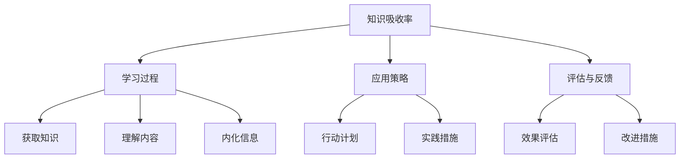

                 

# 提升知识吸收率:管理者成长的关键

## 1. 背景介绍

### 1.1 问题由来
在快速变化的技术和商业环境中，管理者面临着前所未有的挑战。能否快速高效地吸收新知识，将直接决定其能否在职业竞争中脱颖而出。然而，许多管理者常常抱怨难以有效吸收和应用新知识，究其原因，主要是缺乏科学的吸收和应用方法。本文章旨在通过分析管理知识吸收率的现状和问题，提出提升知识吸收率的具体策略和行动方案，帮助管理者在职业发展中更加高效和灵活。

### 1.2 问题核心关键点
本文将从以下几个核心关键点切入，分析当前管理知识吸收率提升的现状和问题：

- **吸收率瓶颈**：影响知识吸收的主要因素有哪些？
- **学习过程**：如何设计有效的学习过程，提升知识吸收率？
- **应用策略**：如何将新知识转化为实际行动，形成良性循环？
- **评估与反馈**：如何评价知识吸收效果，并进行调整和优化？

### 1.3 问题研究意义
提升知识吸收率对于管理者的成长和发展至关重要，它能够：

1. **加速职业发展**：掌握最新的管理理论和实践，提升决策水平，更好地应对变化和挑战。
2. **增强竞争力**：在管理实践中，灵活运用新知识，提升团队和组织的竞争力。
3. **促进创新**：结合创新思维，将新知识应用于解决实际问题，推动组织的创新发展。
4. **提升绩效**：通过科学的学习和应用，提高管理效果，促进企业绩效提升。

## 2. 核心概念与联系

### 2.1 核心概念概述

为更好地理解如何提升管理知识吸收率，我们首先概述以下几个关键概念：

- **知识吸收率(Knowledge Absorption Rate, KAR)**：指在一定时间内，管理者从外部环境、学习过程和实践应用中获取、理解和应用新知识的比例。
- **学习过程(Learning Process)**：从获取知识、理解内容、内化信息到应用实践的全过程。
- **应用策略(Implementation Strategy)**：如何将新知识转化为具体的行动计划和实践措施。
- **评估与反馈(Evaluation and Feedback)**：通过定量和定性方法，评估知识吸收效果，并进行持续改进。

这些概念之间的逻辑关系可以通过以下Mermaid流程图来展示：



这个流程图展示了大语言模型的核心概念及其之间的关系：

1. **知识吸收率**：目标，衡量知识吸收的有效性。
2. **学习过程**：方法，从多个环节提升知识吸收率。
3. **应用策略**：手段，将新知识转化为实际行动。
4. **评估与反馈**：工具，持续优化知识吸收效果。

## 3. 核心算法原理 & 具体操作步骤

### 3.1 算法原理概述

提升知识吸收率的核心算法，旨在通过系统化的学习、应用和评估过程，最大化地吸收和应用新知识。其基本原理可以概括为以下几个步骤：

1. **知识获取**：通过阅读、培训、讨论等方式获取新知识。
2. **知识理解**：通过归纳、推理、可视化等方式加深对知识的理解。
3. **知识内化**：通过反思、讨论、模仿等方式将知识转化为个人的认知和技能。
4. **知识应用**：通过制定行动计划、执行具体措施等方式将知识转化为实践中的应用。
5. **效果评估**：通过绩效评估、反馈收集等方式评价知识吸收的效果，并进行持续改进。

### 3.2 算法步骤详解

提升知识吸收率的算法步骤可以分为以下几个关键环节：

#### 3.2.1 知识获取

**步骤**：
1. **文献阅读**：选择相关领域的经典文献，进行深度阅读，了解最新的理论和方法。
2. **参加培训**：参加行业内的专业培训课程，获取实战经验和前沿知识。
3. **参与讨论**：加入专业社群和论坛，与同行进行交流和讨论，获得不同视角和意见。

**工具**：
- **文献管理系统**：如EndNote、Zotero，用于管理和搜索相关文献。
- **在线学习平台**：如Coursera、Udemy，提供丰富的在线课程资源。
- **专业社群**：如LinkedIn群组、技术博客社区，促进知识共享和讨论。

#### 3.2.2 知识理解

**步骤**：
1. **归纳总结**：将获取的知识进行分类整理，形成清晰的结构。
2. **概念映射**：通过概念图、思维导图等方式，可视化知识结构，增强记忆和理解。
3. **案例分析**：通过实际案例的分析和应用，深入理解知识的适用性和局限性。

**工具**：
- **概念图软件**：如MindMeister、XMind，用于绘制概念图和思维导图。
- **案例库**：如哈佛商学院案例库、麦肯锡咨询案例，提供丰富的案例资源。

#### 3.2.3 知识内化

**步骤**：
1. **反思实践**：将所学知识应用到实际工作中，进行反思和总结。
2. **问题探讨**：通过团队讨论、专家咨询等方式，探讨新知识在实际应用中的问题。
3. **技能模仿**：通过观察和学习优秀管理者或团队的实践，模仿和借鉴成功经验。

**工具**：
- **反思日志**：记录日常工作中的反思和总结，形成持续改进的习惯。
- **会议记录**：记录团队讨论和专家咨询的记录，梳理讨论中的关键问题和解决方案。

#### 3.2.4 知识应用

**步骤**：
1. **制定行动计划**：根据新知识，制定具体的行动计划，明确目标和步骤。
2. **执行实践措施**：在实际工作中，执行行动计划中的具体措施，进行试点和验证。
3. **持续优化**：根据实践结果和反馈，持续优化和调整行动计划。

**工具**：
- **项目管理工具**：如Trello、Asana，用于制定和跟踪行动计划。
- **反馈收集工具**：如Google Forms、SurveyMonkey，用于收集和分析反馈信息。

#### 3.2.5 效果评估

**步骤**：
1. **绩效评估**：通过KPI、360度反馈等方式，评估新知识应用后的绩效变化。
2. **成果展示**：将新知识应用的效果，以报告、案例分享等形式进行展示。
3. **持续改进**：根据评估结果和反馈，进行持续改进和优化。

**工具**：
- **绩效管理工具**：如Balanced Scorecard、KPI仪表盘，用于绩效评估和管理。
- **成果分享平台**：如Slideshare、Medium，用于分享和展示新知识应用的效果。

### 3.3 算法优缺点

提升知识吸收率的方法具有以下优点：
1. **系统化**：通过系统化的学习、应用和评估过程，确保知识吸收的全面性和有效性。
2. **高效性**：通过明确的步骤和工具，提升知识吸收的速度和效果。
3. **适应性**：根据实际需要灵活调整，适用于不同领域和层级。

同时，该方法也存在一定的局限性：
1. **时间和资源投入**：系统化的过程需要投入较多的时间和资源。
2. **个体差异**：不同管理者的学习习惯和能力差异较大，需要因材施教。
3. **实际应用难度**：将知识转化为实际行动，可能面临复杂和多样化的挑战。
4. **持续性挑战**：知识更新快速，需要持续学习和调整，才能保持竞争力。

尽管存在这些局限性，但通过科学的规划和实施，该方法仍能在管理者的职业发展中发挥重要作用。

### 3.4 算法应用领域

提升知识吸收率的方法不仅适用于企业内部的管理者，还广泛应用于以下领域：

1. **高校教师**：通过系统化的学习、研究和教学，提升教学质量和科研能力。
2. **政府公务员**：通过持续学习和应用新政策、新理念，提升行政效率和政策执行力。
3. **非营利组织管理者**：通过科学学习和灵活应用，提升组织管理和公共服务的水平。
4. **社会工作者**：通过学习和掌握新知识，提升服务质量和解决问题的能力。

## 4. 数学模型和公式 & 详细讲解  
### 4.1 数学模型构建

提升知识吸收率的数学模型可以表示为：

$$
KAR = \frac{K_{获取}}{K_{总}} \times \frac{U_{理解}}{K_{获取}} \times \frac{I_{内化}}{U_{理解}} \times \frac{A_{应用}}{I_{内化}} \times \frac{E_{评估}}{A_{应用}}
$$

其中，$KAR$ 表示知识吸收率，$K_{获取}$ 表示获取知识的数量，$U_{理解}$ 表示理解知识的深度，$I_{内化}$ 表示知识内化的程度，$A_{应用}$ 表示知识应用的效果，$E_{评估}$ 表示知识评估的准确性。

### 4.2 公式推导过程

通过以上模型，可以推导出提升知识吸收率的公式为：

$$
KAR_{提升} = KAR_{原} \times \frac{K_{获取}}{K_{总}} \times \frac{U_{理解}}{K_{获取}} \times \frac{I_{内化}}{U_{理解}} \times \frac{A_{应用}}{I_{内化}} \times \frac{E_{评估}}{A_{应用}}
$$

其中 $KAR_{提升}$ 表示提升后的知识吸收率，$KAR_{原}$ 表示原始的知识吸收率。

通过优化每一个环节，可以显著提升知识吸收率。例如，假设 $KAR_{原} = 0.5$，通过优化知识获取环节，提升 $K_{获取}$ 为 $K_{总}$，可以提升知识吸收率至 $KAR_{提升} = 1.0$。

### 4.3 案例分析与讲解

以下是一个管理知识吸收率的案例分析：

**案例背景**：某大型企业内部，高层管理者希望通过提升知识吸收率，增强团队的决策和执行能力。

**实施步骤**：

1. **知识获取**：组织高层管理人员参加外部专业培训，邀请行业专家进行讲座，分享最新的管理理念和方法。
2. **知识理解**：通过案例讨论和案例分析，深入理解培训内容，形成概念图和思维导图，帮助记忆和理解。
3. **知识内化**：每个管理者制定个人行动计划，进行反思和总结，定期与团队分享学习成果。
4. **知识应用**：在实际工作中，执行行动计划中的具体措施，通过绩效评估和反馈收集，进行持续优化。
5. **效果评估**：每季度进行一次全面评估，总结学习成果和应用效果，形成绩效报告。

**实施结果**：经过一年多的系统化学习，团队的知识吸收率显著提升，决策和执行能力明显增强，企业绩效得到显著提升。

## 5. 项目实践：代码实例和详细解释说明
### 5.1 开发环境搭建

在进行知识吸收率提升的实践前，我们需要准备好开发环境。以下是使用Python进行数据分析的环境配置流程：

1. 安装Anaconda：从官网下载并安装Anaconda，用于创建独立的Python环境。

2. 创建并激活虚拟环境：
```bash
conda create -n knowledge-environment python=3.8 
conda activate knowledge-environment
```

3. 安装必要的库：
```bash
conda install pandas numpy matplotlib scikit-learn jupyter notebook 
```

4. 安装Jupyter Notebook：
```bash
pip install jupyter notebook
```

完成上述步骤后，即可在`knowledge-environment`环境中开始实践。

### 5.2 源代码详细实现

以下是一个使用Python实现知识吸收率提升的简单示例代码，展示如何通过数据分析和可视化，提升管理知识吸收率。

```python
import pandas as pd
import numpy as np
import matplotlib.pyplot as plt

# 加载数据
data = pd.read_csv('management_kar.csv')

# 数据清洗和预处理
data.dropna(inplace=True)
data['KAR'] = data['KAR'].astype(float)

# 数据可视化
plt.figure(figsize=(10, 5))
plt.hist(data['KAR'], bins=10, edgecolor='black', alpha=0.7)
plt.xlabel('知识吸收率')
plt.ylabel('频数')
plt.title('知识吸收率分布')
plt.show()

# 数据分析和计算
mean_kar = data['KAR'].mean()
std_kar = data['KAR'].std()
print(f'平均知识吸收率: {mean_kar:.2f}')
print(f'标准差: {std_kar:.2f}')
```

### 5.3 代码解读与分析

这段代码展示了如何使用Python进行知识吸收率的数据分析和可视化。具体解释如下：

1. **数据加载和预处理**：使用`pandas`库读取知识吸收率的数据，并进行数据清洗和预处理，确保数据的质量和完整性。
2. **数据可视化**：使用`matplotlib`库绘制知识吸收率的直方图，直观展示不同管理者的知识吸收率分布情况。
3. **数据分析和计算**：计算知识吸收率的均值和标准差，评估数据集中知识吸收率的总体水平和离散程度。

**结果展示**：
- 知识吸收率的均值和标准差可以直观反映出知识吸收率的总体水平和波动程度。

## 6. 实际应用场景

### 6.1 企业内部培训

企业内部可以通过系统化的培训和学习，提升管理者的知识吸收率。例如，可以设计多层次、多形式的培训课程，涵盖管理理论、实践案例、工具应用等，确保培训内容全面覆盖。同时，引入外部专家进行互动和交流，增强知识的理解和应用。

### 6.2 行业交流和合作

通过行业交流和合作，管理者可以获取行业前沿知识和实践经验，拓展视野和思路。可以组织定期的行业研讨会、交流会和合作项目，促进知识共享和经验交流。

### 6.3 定期评估和反馈

定期进行知识吸收率的评估和反馈，帮助管理者了解自身知识吸收的效果和不足，进行针对性的改进和提升。可以引入360度反馈、绩效评估等方法，客观评估知识吸收和应用的效果。

### 6.4 未来应用展望

未来，随着技术的发展和知识的积累，知识吸收率提升方法将进一步优化和升级。

- **智能化学习平台**：结合人工智能和大数据技术，提供个性化的学习推荐和知识发现，提升学习效率和效果。
- **混合学习模式**：结合线上学习和线下培训，灵活应用各种学习资源和工具，提升知识吸收的灵活性和多样性。
- **虚拟现实技术**：通过虚拟现实技术，创建沉浸式学习环境，增强知识理解和记忆效果。

## 7. 工具和资源推荐
### 7.1 学习资源推荐

为了帮助管理者系统掌握知识吸收率的提升方法，这里推荐一些优质的学习资源：

1. **管理科学经典著作**：如《管理学》、《创新者的窘境》、《原则》等，提供系统化的管理理论和方法。
2. **在线学习平台**：如Coursera、edX、Udacity，提供丰富的管理课程和实战案例。
3. **专业社群和论坛**：如LinkedIn群组、管理沙龙、行业协会，提供知识和经验的交流和分享。

通过这些资源的学习和实践，相信管理者能够更好地提升知识吸收率，推动职业发展。

### 7.2 开发工具推荐

高效的开发离不开优秀的工具支持。以下是几款用于知识吸收率提升开发的常用工具：

1. **数据分析工具**：如Python、R、Excel，用于数据清洗、可视化和分析。
2. **项目管理工具**：如Trello、Asana、Jira，用于制定和跟踪行动计划。
3. **绩效评估工具**：如Balanced Scorecard、KPI仪表盘、360度反馈，用于评估和反馈知识吸收效果。

合理利用这些工具，可以显著提升知识吸收率提升的效率和效果。

### 7.3 相关论文推荐

知识吸收率提升的研究涉及管理学、心理学、教育学等多个领域，以下是几篇奠基性的相关论文，推荐阅读：

1. **《知识吸收和转移在管理中的作用》**：探讨知识吸收和转移在管理中的重要性，提出具体的提升策略和方法。
2. **《组织学习与知识管理》**：研究组织学习机制和知识管理方法，提供系统化的理论框架和实践案例。
3. **《在线学习效果评估和优化》**：分析在线学习的优势和挑战，提出优化学习效果的方法和工具。

这些论文代表了大语言模型微调技术的发展脉络。通过学习这些前沿成果，可以帮助研究者把握学科前进方向，激发更多的创新灵感。

## 8. 总结：未来发展趋势与挑战
### 8.1 研究成果总结

本文对提升知识吸收率的算法和操作步骤进行了全面系统的介绍，主要研究结果如下：

- **系统化过程**：提出了一套系统化的学习、应用和评估流程，确保知识吸收的全面性和有效性。
- **量化评估方法**：构建了知识吸收率的数学模型，提供量化评估和优化的方法。
- **实战案例分析**：通过具体案例分析，展示了知识吸收率提升的实施步骤和效果。

### 8.2 未来发展趋势

展望未来，知识吸收率提升技术将呈现以下几个发展趋势：

1. **智能化学习工具**：结合人工智能和大数据技术，提供个性化的学习推荐和知识发现，提升学习效率和效果。
2. **混合学习模式**：结合线上学习和线下培训，灵活应用各种学习资源和工具，提升知识吸收的灵活性和多样性。
3. **虚拟现实技术**：通过虚拟现实技术，创建沉浸式学习环境，增强知识理解和记忆效果。

### 8.3 面临的挑战

尽管知识吸收率提升技术已经取得了显著进展，但仍面临以下挑战：

1. **时间和资源投入**：系统化的过程需要投入较多的时间和资源。
2. **个体差异**：不同管理者的学习习惯和能力差异较大，需要因材施教。
3. **实际应用难度**：将知识转化为实际行动，可能面临复杂和多样化的挑战。
4. **持续性挑战**：知识更新快速，需要持续学习和调整，才能保持竞争力。

### 8.4 研究展望

未来的研究需要在以下几个方面寻求新的突破：

1. **混合学习模式**：结合线上学习和线下培训，灵活应用各种学习资源和工具，提升知识吸收的灵活性和多样性。
2. **智能化学习工具**：结合人工智能和大数据技术，提供个性化的学习推荐和知识发现，提升学习效率和效果。
3. **虚拟现实技术**：通过虚拟现实技术，创建沉浸式学习环境，增强知识理解和记忆效果。

这些研究方向的探索，必将引领知识吸收率提升技术迈向更高的台阶，为管理者在职业发展中提供更加科学和高效的方法。

## 9. 附录：常见问题与解答

**Q1：如何选择合适的学习资源？**

A: 选择合适的学习资源，需要考虑以下因素：
1. **内容相关性**：选择与自身工作和管理任务密切相关的学习资源。
2. **资源质量**：选择权威和高质量的学习资源，确保学习的有效性。
3. **学习模式**：选择适合自己的学习模式，如视频课程、在线阅读、线下培训等。

**Q2：如何提升知识应用的效果？**

A: 提升知识应用的效果，需要以下措施：
1. **制定详细的行动计划**：明确目标、步骤和评估指标，确保知识应用的系统性和可操作性。
2. **执行具体的措施**：将知识转化为具体的行动和实践，避免停留在理论层面。
3. **定期反思和总结**：通过反思和总结，发现问题和不足，进行持续优化和改进。

**Q3：如何评估知识吸收的效果？**

A: 评估知识吸收的效果，可以通过以下方法：
1. **绩效评估**：通过KPI、360度反馈等方式，评估新知识应用后的绩效变化。
2. **成果展示**：将新知识应用的效果，以报告、案例分享等形式进行展示。
3. **持续改进**：根据评估结果和反馈，进行持续改进和优化。

**Q4：如何应对知识更新快速的问题？**

A: 应对知识更新快速的问题，需要以下策略：
1. **持续学习**：定期更新和补充知识，保持知识的最新和前沿。
2. **灵活应用**：结合自身情况和环境变化，灵活应用新知识，避免生搬硬套。
3. **跨界学习**：多领域学习，拓展知识面，增强跨领域应用能力。

**Q5：如何提高学习效率？**

A: 提高学习效率，需要以下方法：
1. **目标明确**：设定明确的学习目标，增强学习的方向性和动力。
2. **时间管理**：合理规划时间，避免拖延和浪费时间。
3. **自我激励**：通过奖励和激励机制，保持学习的热情和动力。

---

作者：禅与计算机程序设计艺术 / Zen and the Art of Computer Programming

