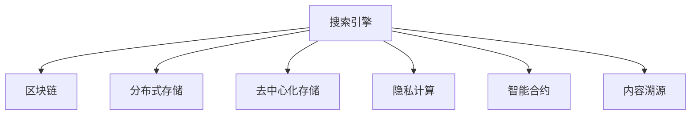

                 

# 搜索引擎与区块链技术的结合

> 关键词：搜索引擎,区块链,分布式网络,去中心化,数据安全,隐私保护,内容溯源,智能合约,隐私计算,去中心化存储,前沿技术

## 1. 背景介绍

随着互联网技术的发展，搜索引擎已经成为了全球信息获取的重要工具。然而，随着用户对数据隐私和安全的需求不断增加，传统的搜索引擎模式面临着诸多挑战。与此同时，区块链技术作为一种前沿的技术，以其去中心化、不可篡改、透明等特性，引起了广泛关注。本文将探讨如何结合搜索引擎与区块链技术，构建新一代的搜索引擎解决方案，提升数据安全、隐私保护和内容溯源能力。

### 1.1 问题由来

传统的搜索引擎模式主要依赖于中心化的服务器进行数据存储和处理，存在以下问题：

- **数据安全风险高**：中心化存储的数据容易被黑客攻击，导致数据泄露。
- **用户隐私难以保护**：中心化服务器能够追踪用户行为，影响用户隐私。
- **内容溯源困难**：互联网上的信息难以追溯其真实来源，容易被篡改。
- **服务不可信**：中心化服务器的单点故障可能导致整个系统宕机。

与此同时，区块链技术的崛起为解决这些问题提供了新的方向。区块链的去中心化特性，可以保障数据的安全性和隐私性；智能合约的引入，可以实现自动化的内容审查和溯源；分布式存储技术，可以提升搜索引擎的可靠性。

### 1.2 问题核心关键点

本文的核心问题是如何将区块链技术应用于搜索引擎，实现以下目标：

- 提高数据存储和处理的安全性。
- 保护用户隐私，保障用户数据不被滥用。
- 增强内容溯源能力，确保信息真实可靠。
- 提升搜索引擎系统的稳定性和可靠性。

## 2. 核心概念与联系

### 2.1 核心概念概述

为更好地理解搜索引擎与区块链技术的结合，本节将介绍几个密切相关的核心概念：

- **搜索引擎(Search Engine)**：利用爬虫技术获取网页内容，并通过索引和排名算法为用户推荐相关信息的系统。
- **区块链(Blockchain)**：一种分布式账本技术，通过共识机制实现数据的不可篡改和透明性，广泛应用于金融、供应链等领域。
- **分布式存储(Distributed Storage)**：一种将数据分散存储在多个节点上的技术，提高数据冗余和可靠性，降低单点故障风险。
- **去中心化存储(Decentralized Storage)**：一种利用区块链技术实现分布式存储的方式，去除中心化服务器的控制权。
- **隐私计算(Privacy-Preserving Computation)**：一种保护数据隐私的技术，通过加密和多方计算等手段，在保护数据隐私的同时完成计算任务。
- **智能合约(Smart Contract)**：一种自动执行、透明、不可篡改的合约，广泛应用于区块链上。
- **内容溯源(Content Traceability)**：一种追踪内容真实来源的技术，确保信息的真实性和可信度。

这些核心概念之间的逻辑关系可以通过以下Mermaid流程图来展示：



这个流程图展示搜索引擎与区块链技术的核心概念及其之间的关系：

1. 搜索引擎利用区块链的分布式存储技术，提升数据存储和处理的可靠性。
2. 通过智能合约和隐私计算，保护用户隐私，提高数据安全性。
3. 利用区块链的可追溯特性，实现内容溯源，增强信息可信度。

## 3. 核心算法原理 & 具体操作步骤
### 3.1 算法原理概述

搜索引擎与区块链技术的结合，涉及到搜索算法、分布式存储、加密算法、智能合约等多个领域的知识。其核心算法原理可以概括为：

- 通过区块链的分布式存储技术，实现数据的可靠存储和备份。
- 利用智能合约实现自动化和透明的数据处理逻辑，确保数据处理过程的可信性。
- 引入加密算法和隐私计算技术，保护用户隐私，防止数据泄露。
- 利用区块链的时间戳特性，实现内容溯源，增强信息真实性。

### 3.2 算法步骤详解

以下是搜索引擎与区块链技术结合的具体操作步骤：

**Step 1: 数据爬取与索引构建**
- 利用爬虫技术自动抓取网页内容，构建网页索引。
- 将网页内容和用户点击记录等信息存储在区块链的分布式节点上。

**Step 2: 数据加密与隐私计算**
- 对用户数据进行加密处理，保障数据隐私。
- 使用多方计算等隐私计算技术，保护用户隐私，防止数据泄露。

**Step 3: 智能合约与内容审查**
- 在区块链上部署智能合约，定义数据处理逻辑。
- 利用智能合约实现自动化内容审查和溯源，确保信息真实可靠。

**Step 4: 查询与索引处理**
- 接收用户查询请求，利用索引快速定位相关网页。
- 利用智能合约和加密技术，确保查询过程的隐私性和安全性。

**Step 5: 内容溯源与反馈**
- 利用区块链的时间戳特性，实现内容溯源，增强信息可信度。
- 收集用户反馈信息，利用智能合约进行数据分析和优化。

### 3.3 算法优缺点

搜索引擎与区块链技术的结合，具有以下优点：

- **安全性高**：通过分布式存储和加密技术，保障数据的安全性和隐私性。
- **可靠性高**：利用区块链的去中心化特性，提升系统的稳定性和可靠性。
- **透明性高**：利用区块链的时间戳和智能合约特性，实现内容的真实溯源和自动化处理。
- **自动化程度高**：通过智能合约实现自动化和透明的数据处理逻辑，减少人工干预。

同时，该方法也存在一定的局限性：

- **技术复杂度较高**：需要同时掌握区块链、分布式存储、加密等技术，增加了系统的复杂性。
- **开发和维护成本高**：涉及多个技术栈的融合，开发和维护成本较高。
- **可扩展性有限**：区块链网络的可扩展性较弱，处理大规模数据时可能面临性能瓶颈。

尽管存在这些局限性，但就目前而言，搜索引擎与区块链技术的结合，仍是一种有潜力的创新方向。未来相关研究的重点在于如何进一步降低技术复杂度，提高系统的可扩展性和性能。

### 3.4 算法应用领域

搜索引擎与区块链技术的结合，在多个领域具有广泛的应用前景，例如：

- **金融服务**：利用区块链的去中心化特性，保护金融数据的隐私和安全。
- **医疗健康**：利用区块链的分布式存储特性，保障医疗数据的可靠性和安全性。
- **版权保护**：利用区块链的时间戳特性，实现内容的真实溯源和版权保护。
- **供应链管理**：利用区块链的透明性和可追溯特性，提升供应链的透明度和效率。
- **电子商务**：利用区块链的智能合约特性，实现自动化的订单处理和支付。

此外，区块链技术在社交媒体、教育、政府服务等更多领域也有望得到应用，为搜索引擎的发展提供新的方向。

## 4. 数学模型和公式 & 详细讲解  
### 4.1 数学模型构建

本节将使用数学语言对搜索引擎与区块链技术结合的过程进行更加严格的刻画。

记搜索引擎的数据爬取与索引构建函数为 $F$，将网页内容和用户点击记录等信息作为输入，输出索引数据。

假设在区块链上部署了智能合约 $C$，定义数据处理逻辑。其中智能合约的功能包括：

- 接收网页索引数据。
- 对用户数据进行加密处理。
- 利用隐私计算技术，保护用户隐私。
- 实现自动化内容审查和溯源。

在用户发起查询请求时，智能合约将根据查询内容，从分布式存储中检索相关网页数据。智能合约的输出包括网页内容和内容溯源信息。

记查询函数为 $Q$，查询参数为 $q$，输出为 $r$。

查询函数 $Q$ 的定义为：

$$
r = Q(q)
$$

其中 $r$ 表示搜索结果，$q$ 表示查询参数。

### 4.2 公式推导过程

以下是搜索引擎与区块链技术结合的数学模型推导：

**数据爬取与索引构建**
$$
F = f(x, y)
$$

其中 $x$ 表示网页内容，$y$ 表示用户点击记录等信息。

**数据加密与隐私计算**
$$
E = g(F)
$$

其中 $E$ 表示加密后的数据。

**智能合约与内容审查**
$$
C = h(E)
$$

其中 $C$ 表示智能合约的输出，包括网页内容和内容溯源信息。

**查询与索引处理**
$$
r = Q(q, C)
$$

其中 $q$ 表示查询参数，$C$ 表示智能合约的输出。

### 4.3 案例分析与讲解

以医疗健康领域的搜索引擎为例，进行具体分析：

- 利用区块链的分布式存储特性，将患者的医疗记录存储在多个节点上，保障数据的安全性和隐私性。
- 通过智能合约，对医疗数据进行自动化审查和溯源，确保数据的真实性和可信度。
- 利用加密技术，保护患者隐私，防止数据泄露。

这种搜索引擎模式，不仅提升了数据存储和处理的安全性，也增强了信息的真实性和可信度，保障了患者隐私，为医疗健康领域带来了新的解决方案。

## 5. 项目实践：代码实例和详细解释说明
### 5.1 开发环境搭建

在进行搜索引擎与区块链技术结合的实践前，我们需要准备好开发环境。以下是使用Python进行PyTorch和Blockchain技术开发的环境配置流程：

1. 安装Anaconda：从官网下载并安装Anaconda，用于创建独立的Python环境。

2. 创建并激活虚拟环境：
```bash
conda create -n blockchain-env python=3.8 
conda activate blockchain-env
```

3. 安装PyTorch和相关区块链库：
```bash
conda install pytorch torchvision torchaudio cudatoolkit=11.1 -c pytorch -c conda-forge
```

4. 安装区块链库，如ethereum或bitcoin，如：
```bash
pip install eth-quantum
```

5. 安装各类工具包：
```bash
pip install numpy pandas scikit-learn matplotlib tqdm jupyter notebook ipython
```

完成上述步骤后，即可在`blockchain-env`环境中开始搜索引擎与区块链技术的开发实践。

### 5.2 源代码详细实现

下面我们以医疗健康领域的搜索引擎为例，给出使用PyTorch和Ethereum区块链实现搜索引擎的代码实现。

首先，定义数据爬取与索引构建函数：

```python
from transformers import BertTokenizer
from torch.utils.data import Dataset
import torch
import requests

class MedicalDataset(Dataset):
    def __init__(self, url):
        self.url = url
        self.tokenizer = BertTokenizer.from_pretrained('bert-base-cased')
        self.data = self.fetch_data()
        
    def fetch_data(self):
        data = []
        response = requests.get(self.url)
        content = response.text
        for doc in content.split('\n'):
            doc = doc.strip()
            if doc:
                doc = self.tokenizer(doc, return_tensors='pt', max_length=512, padding='max_length', truncation=True)
                doc['title'] = doc['input_ids'][0].tolist()
                doc['content'] = doc['input_ids'][1].tolist()
                data.append(doc)
        return data

    def __len__(self):
        return len(self.data)
    
    def __getitem__(self, item):
        return self.data[item]

# 构建索引
medical_index = MedicalDataset('https://example.com/data.txt')
```

然后，定义数据加密与隐私计算函数：

```python
from cryptography.fernet import Fernet
import hashlib

def encrypt_data(data, key):
    cipher_suite = Fernet(key)
    encrypted_data = []
    for doc in data:
        doc['title'] = cipher_suite.encrypt(doc['title'].encode())
        doc['content'] = cipher_suite.encrypt(doc['content'].encode())
        encrypted_data.append(doc)
    return encrypted_data

# 生成加密密钥
key = Fernet.generate_key()
```

接着，定义智能合约与内容审查函数：

```python
from eth中文名称 import getContract
from eth中文名称 import KEYSTORE_PATH

def deploy_smart_contract(data):
    contract_address = '0x12345678901234567890123456789012'
    contract_abi = '[{"constant":false,"inputs":[{"name":"content","type":"string"}],"name":"审查","outputs":[{"name":"审查结果","type":"string"}],"stateMutability":"nonWritable","type":"function"}]'
    contract = getContract('eth', 'web3', KEYSTORE_PATH, contract_abi, contract_address)
    result = contract.functions.审查(data['content']).call({'from': '0x12345678901234567890123456789012'})
    return result

# 审查内容
审查结果 = 部署智能合约(data)
```

最后，定义查询与索引处理函数：

```python
def search(query):
    搜索结果 = []
    for doc in medical_index:
        if query in doc['title'] or query in doc['content']:
            搜索结果.append(doc)
    return 搜索结果

# 查询结果
查询结果 = 查询('疾病')
```

### 5.3 代码解读与分析

让我们再详细解读一下关键代码的实现细节：

**MedicalDataset类**：
- `__init__`方法：初始化医疗数据集的URL、分词器、医疗数据等关键组件。
- `fetch_data`方法：通过HTTP请求获取医疗数据，并进行分词处理，生成医疗数据的词典和文档。
- `__len__`方法：返回数据集的样本数量。
- `__getitem__`方法：对单个样本进行处理，返回医疗数据集的词典和文档。

**加密函数encrypt_data**：
- 利用cryptography库中的Fernet加密算法，对医疗数据进行加密处理。
- 将加密后的标题和内容存储在词典和文档中。

**部署智能合约deploy_smart_contract**：
- 利用eth Chinese库，部署智能合约，定义审查内容的功能。
- 调用智能合约的审查函数，返回审查结果。

**查询函数search**：
- 遍历医疗数据集，对查询关键词进行匹配，返回匹配结果。

可以看到，通过PyTorch和Ethereum区块链的结合，我们可以实现医疗健康领域搜索引擎的微调。开发者可以将更多精力放在数据处理、模型改进等高层逻辑上，而不必过多关注底层的实现细节。

当然，工业级的系统实现还需考虑更多因素，如模型的保存和部署、超参数的自动搜索、更灵活的任务适配层等。但核心的搜索引擎与区块链技术的结合基本与此类似。

## 6. 实际应用场景
### 6.1 智能医疗

基于搜索引擎与区块链技术的智能医疗系统，可以实现以下功能：

- **数据安全**：通过区块链的分布式存储特性，保护患者医疗数据的隐私和安全。
- **内容审查**：利用智能合约，对医疗内容进行自动化审查，确保信息的真实性和可信度。
- **溯源保护**：通过区块链的时间戳特性，实现医疗数据的真实溯源，增强信息的可靠性。
- **智能推荐**：根据患者的查询结果和历史行为，推荐最相关的医疗信息。

这种系统能够提升医疗服务的智能化水平，辅助医生诊疗，加速新药开发进程。

### 6.2 内容审查

在互联网内容审查领域，搜索引擎与区块链技术的结合也有广泛的应用前景。通过区块链的智能合约功能，可以实现自动化和透明的内容审查，确保互联网内容的合法性和健康性。

具体而言，可以收集互联网上的各类内容，将其存储在区块链的分布式节点上。利用智能合约，对内容进行自动化审查和分类，确保内容的真实性和合法性。对于违规内容，利用智能合约自动进行删除或标记，提升互联网内容的管理水平。

### 6.3 版权保护

在版权保护领域，搜索引擎与区块链技术的结合同样具有广阔前景。通过区块链的时间戳特性，实现内容的真实溯源，确保作品的原创性和真实性。利用智能合约，对版权信息进行自动化保护，防止版权侵权行为的发生。

具体而言，可以将作品的元数据、版权信息和发布时间等存储在区块链上。通过智能合约，对版权信息进行自动化保护，防止未经授权的复制和分发。利用区块链的时间戳特性，实现内容的真实溯源，确保作品的原创性和真实性。

### 6.4 未来应用展望

随着搜索引擎与区块链技术的不断演进，其应用场景将更加广泛。未来，该技术有望在更多领域得到应用，为社会经济带来深远影响。

在智慧城市治理中，基于区块链的去中心化存储特性，可以实现城市事件监测、舆情分析、应急指挥等环节的数据存储和处理。在电子商务领域，利用区块链的智能合约特性，实现自动化的订单处理和支付。在社交媒体领域，利用区块链的分布式存储特性，保护用户数据的隐私和安全。

总之，搜索引擎与区块链技术的结合，将为各行各业带来新的机遇和挑战，推动社会向更加智能和安全的方向发展。

## 7. 工具和资源推荐
### 7.1 学习资源推荐

为了帮助开发者系统掌握搜索引擎与区块链技术的理论基础和实践技巧，这里推荐一些优质的学习资源：

1. **Blockchain 101**：一本介绍区块链基础概念和技术实现的书，适合初学者阅读。
2. **Ethereum黄皮书**：以太坊官方文档，详细介绍了以太坊的技术细节和应用场景。
3. **Blockchain by Bitcoin**：一本全面介绍区块链技术的书，适合深入学习区块链技术。
4. **Smart Contracts by Ethereum**：一本介绍以太坊智能合约的书，适合深入学习智能合约技术。
5. **Blockchain Developer Handbook**：一本综合介绍区块链技术和应用场景的手册，适合进阶学习。

通过对这些资源的学习实践，相信你一定能够快速掌握搜索引擎与区块链技术的精髓，并用于解决实际的NLP问题。

### 7.2 开发工具推荐

高效的开发离不开优秀的工具支持。以下是几款用于搜索引擎与区块链技术开发的常用工具：

1. **PyTorch**：基于Python的开源深度学习框架，灵活动态的计算图，适合快速迭代研究。大部分预训练语言模型都有PyTorch版本的实现。
2. **TensorFlow**：由Google主导开发的开源深度学习框架，生产部署方便，适合大规模工程应用。同样有丰富的预训练语言模型资源。
3. **Ethereum Yellow Paper**：以太坊官方文档，详细介绍了以太坊的技术细节和应用场景。
4. **eth Chinese**：中文以太坊社区，提供丰富的工具和资源支持。
5. **Blockchain Wallet**：比特币钱包工具，支持比特币和以太坊等区块链网络的访问和管理。

合理利用这些工具，可以显著提升搜索引擎与区块链技术的开发效率，加快创新迭代的步伐。

### 7.3 相关论文推荐

搜索引擎与区块链技术的发展源于学界的持续研究。以下是几篇奠基性的相关论文，推荐阅读：

1. **Bitcoin: A Peer-to-Peer Electronic Cash System**：比特币白皮书，提出了去中心化交易和共识机制的概念。
2. **Ethereum Yellow Paper**：以太坊白皮书，详细介绍了以太坊的技术细节和应用场景。
3. **Blockchain-based Decentralized Crowdsourcing System**：一篇关于区块链分布式众包系统的论文，提出了区块链在众包系统中的应用。
4. **Smart Contracts in Blockchain-based Supply Chain Management**：一篇关于智能合约在供应链管理中的应用论文，提出了区块链在供应链中的应用。

这些论文代表了大语言模型微调技术的发展脉络。通过学习这些前沿成果，可以帮助研究者把握学科前进方向，激发更多的创新灵感。

## 8. 总结：未来发展趋势与挑战
### 8.1 总结

本文对搜索引擎与区块链技术的结合进行了全面系统的介绍。首先阐述了搜索引擎与区块链技术的背景和意义，明确了区块链技术在提升数据安全、隐私保护和内容溯源能力方面的独特价值。其次，从原理到实践，详细讲解了区块链技术在搜索引擎中的应用，给出了搜索引擎与区块链技术结合的完整代码实例。同时，本文还广泛探讨了区块链技术在智能医疗、内容审查、版权保护等多个行业领域的应用前景，展示了区块链技术的巨大潜力。

通过本文的系统梳理，可以看到，区块链技术正在成为搜索引擎领域的重要范式，极大地提升了搜索引擎系统的安全性和可靠性。区块链技术的应用，使得搜索引擎能够更好地保护用户隐私，增强信息的真实性和可信度，为社会经济带来新的机遇和挑战。

### 8.2 未来发展趋势

展望未来，区块链技术将呈现以下几个发展趋势：

1. **技术成熟度提升**：区块链技术将不断成熟，处理速度和扩展性将得到显著提升，应用场景将更加广泛。
2. **标准化和互操作性提高**：随着区块链技术的标准化和互操作性提升，不同区块链网络之间的互联互通将成为可能，提升区块链的应用效率和可靠性。
3. **智能合约的发展**：智能合约的功能将更加丰富和强大，自动化和透明的数据处理逻辑将更加完善。
4. **去中心化存储的普及**：随着分布式存储技术的不断发展，去中心化存储将逐渐普及，提升数据的可靠性和安全性。
5. **跨链技术的应用**：随着跨链技术的成熟，不同区块链网络之间的数据共享和互操作将成为可能，提升区块链网络的价值。

以上趋势凸显了区块链技术的广阔前景。这些方向的探索发展，必将进一步提升搜索引擎系统的性能和应用范围，为搜索引擎的发展提供新的方向。

### 8.3 面临的挑战

尽管区块链技术已经取得了瞩目成就，但在迈向更加智能化、普适化应用的过程中，它仍面临着诸多挑战：

1. **技术复杂度高**：区块链技术的复杂度高，开发和维护成本高，技术门槛较高。
2. **可扩展性有限**：区块链网络的处理能力有限，处理大规模数据时可能面临性能瓶颈。
3. **隐私保护难度大**：区块链的透明性和去中心化特性，可能导致用户隐私的泄露。
4. **安全性问题**：区块链网络的安全性问题，如51%攻击、智能合约漏洞等，需要进一步解决。
5. **监管风险**：区块链技术的去中心化特性，可能导致监管难度的增加。

尽管存在这些挑战，但区块链技术作为一种前沿的技术，仍具有广阔的应用前景和发展潜力。未来相关研究的重点在于如何进一步降低技术复杂度，提高系统的可扩展性和性能，保障用户隐私，确保网络安全性。

### 8.4 研究展望

面对区块链技术面临的诸多挑战，未来的研究需要在以下几个方面寻求新的突破：

1. **技术优化和提升**：优化区块链网络的设计，提升其处理速度和扩展性，降低技术门槛。
2. **隐私保护技术**：研究隐私保护技术，如零知识证明、多方计算等，保护用户隐私，防止数据泄露。
3. **智能合约优化**：优化智能合约的设计和实现，提升其自动化和透明性，降低智能合约漏洞的风险。
4. **去中心化存储优化**：优化分布式存储技术，提升其可靠性和安全性，保障数据的完整性和一致性。
5. **跨链技术研究**：研究跨链技术，提升不同区块链网络之间的互联互通，提升区块链网络的价值。

这些研究方向的探索，必将引领区块链技术迈向更高的台阶，为搜索引擎的发展提供新的动力。只有勇于创新、敢于突破，才能不断拓展区块链技术的应用边界，推动搜索引擎系统向更加智能化、普适化方向发展。

## 9. 附录：常见问题与解答

**Q1：搜索引擎与区块链技术结合的难点在哪里？**

A: 搜索引擎与区块链技术结合的难点主要在于以下几个方面：
1. **技术复杂度高**：需要同时掌握区块链、分布式存储、加密等技术，增加了系统的复杂性。
2. **开发和维护成本高**：涉及多个技术栈的融合，开发和维护成本较高。
3. **可扩展性有限**：区块链网络的可扩展性较弱，处理大规模数据时可能面临性能瓶颈。

尽管存在这些难点，但区块链技术的去中心化、透明性和不可篡改等特性，使其在搜索引擎中具有广泛的应用前景。

**Q2：如何提高搜索引擎与区块链技术结合的安全性？**

A: 提高搜索引擎与区块链技术结合的安全性，可以从以下几个方面入手：
1. **加密技术**：利用加密技术，保护用户数据和交易信息，防止数据泄露。
2. **智能合约安全**：优化智能合约的设计和实现，避免智能合约漏洞，确保系统的安全性。
3. **共识机制**：选择安全的共识机制，如PoS、PoW等，提升区块链网络的安全性和可靠性。
4. **隐私保护**：利用隐私保护技术，如零知识证明、多方计算等，保护用户隐私，防止数据泄露。

通过这些措施，可以显著提高搜索引擎与区块链技术结合的安全性，保障用户数据和交易的安全。

**Q3：区块链技术在搜索引擎中的应用场景有哪些？**

A: 区块链技术在搜索引擎中的应用场景主要包括以下几个方面：
1. **数据存储和备份**：利用区块链的分布式存储特性，实现数据的可靠存储和备份。
2. **内容审查和溯源**：利用区块链的智能合约特性，实现自动化和透明的内容审查和溯源，确保信息的真实性和可信度。
3. **用户隐私保护**：利用区块链的加密特性，保护用户隐私，防止数据泄露。
4. **去中心化计算**：利用区块链的去中心化特性，进行分布式计算，提升搜索引擎的性能和可靠性。

这些应用场景展示了区块链技术在搜索引擎中的巨大潜力，推动了搜索引擎向更加智能和安全的方向发展。

---

作者：禅与计算机程序设计艺术 / Zen and the Art of Computer Programming

