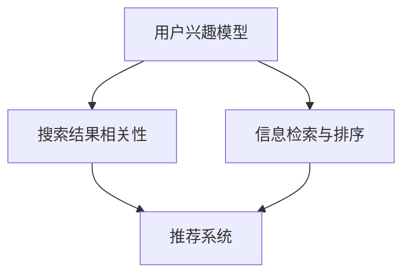

                 

# 搜索引擎的个性化：根据用户兴趣定制结果

## 1. 背景介绍

在互联网时代，搜索引擎已经成为人们获取信息的重要工具。然而，传统的搜索引擎往往采用通用算法，难以满足用户个性化需求。用户需要更精准、更贴合自己兴趣的搜索结果。个性化搜索引擎的目标是，根据用户的搜索历史、浏览记录、地理位置、社交媒体信息等，定制化地推荐相关内容，提升用户体验，增加用户粘性。

## 2. 核心概念与联系

### 2.1 核心概念概述

为了实现个性化搜索，我们需要了解几个核心概念：

- 用户兴趣模型(User Interest Model)：用于刻画用户长期兴趣和短期行为特征的模型，如用户搜索历史、浏览记录、点击行为等。
- 搜索结果相关性(Retrieval Relevance)：衡量搜索结果与用户查询意图的相关性。
- 信息检索与排序(Search Ranking)：信息检索和排序算法，用于从海量数据中筛选最符合用户需求的结果，并按相关性排序。
- 推荐系统(Recommender System)：基于用户兴趣模型，动态生成个性化的搜索结果或相关内容，为用户定制化推荐。

这些核心概念之间的逻辑关系可以通过以下Mermaid流程图来展示：

这个流程图展示了个性化搜索的核心流程：

1. 通过用户兴趣模型刻画用户特征。
2. 利用信息检索与排序算法，从数据库中检索相关文档。
3. 结合用户兴趣模型，生成个性化的推荐结果。

### 2.2 核心概念原理和架构

#### 用户兴趣模型

用户兴趣模型用于刻画用户长期兴趣和短期行为特征。其核心思想是，通过学习用户的交互数据，建立用户与内容之间的关联，从而预测用户对不同内容的兴趣程度。

用户兴趣模型通常包括两个部分：

- 用户特征提取：通过TF-IDF、Word2Vec、BERT等技术，提取用户查询、点击、评分等行为数据中的关键词、短语、语义信息等。
- 内容特征提取：同样使用TF-IDF、Word2Vec、BERT等技术，提取搜索结果中文档的关键词、短语、语义信息等。

用户兴趣模型建立在分布式表示和距离计算的基础之上，一般采用余弦相似度或点积相似度来度量用户和内容的相似性，从而计算用户对内容的兴趣权重。

#### 搜索结果相关性

搜索结果相关性是衡量搜索结果与用户查询意图的相关性，直接影响搜索的精准度。常见的方法包括：

- 基于统计的方法：通过统计用户对不同查询结果的点击率、停留时间等行为指标，来衡量搜索结果的相关性。
- 基于模型的方

