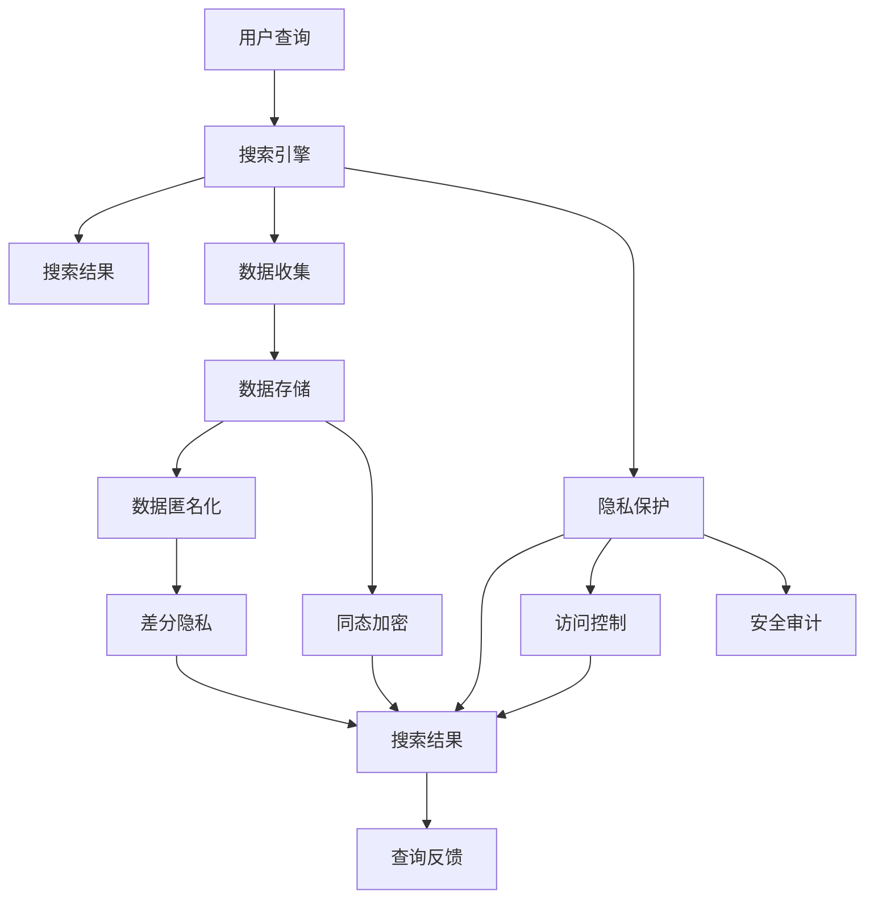

                 

# 搜索引擎的隐私保护功能增强

## 1. 背景介绍

在当今数字化时代，搜索引擎已成为人们获取信息、完成日常任务不可或缺的工具。然而，随着互联网的发展，用户隐私问题也逐渐成为关注的焦点。如何既能提供高效、便捷的服务，又能确保用户隐私安全，成为搜索引擎面临的重要挑战。本文章将详细探讨搜索引擎如何通过技术手段增强隐私保护功能，提升用户体验。

## 2. 核心概念与联系

### 2.1 核心概念概述

- **搜索引擎 (Search Engine)**：一种网站或网络服务，用于帮助用户通过输入关键词搜索所需的信息。

- **隐私保护 (Privacy Protection)**：保护用户的个人信息、数据安全、以及用户浏览习惯不被泄露的措施。

- **数据匿名化 (Data Anonymization)**：将用户的敏感信息移除，以保护用户隐私。

- **差分隐私 (Differential Privacy)**：一种通过在数据分析中加入噪声来保护个体隐私的技术。

- **联邦学习 (Federated Learning)**：分布式机器学习框架，允许模型在不共享数据的情况下进行训练。

- **同态加密 (Homomorphic Encryption)**：一种允许在加密数据上执行计算的加密技术。

- **访问控制 (Access Control)**：通过权限验证等方式，控制用户对资源的访问权限。

这些概念通过搜索引擎的数据处理流程和隐私保护措施相联系，共同构成了一个完整的隐私保护系统。

### 2.2 核心概念原理和架构的 Mermaid 流程图



## 3. 核心算法原理 & 具体操作步骤

### 3.1 算法原理概述

搜索引擎的隐私保护功能增强涉及多个算法和技术手段，主要包括数据匿名化、差分隐私、联邦学习和同态加密。以下是这几种技术的原理概述：

- **数据匿名化**：通过对数据进行泛化、匿名化和扰动等处理，使得单个数据个体无法被识别，从而保护用户隐私。

- **差分隐私**：通过在查询结果中加入随机噪声，确保即使攻击者拥有部分数据，也无法推断出个体信息。

- **联邦学习**：通过分布式网络，在各个节点上进行模型训练，但模型参数不离开本地设备，确保数据不集中存储。

- **同态加密**：允许在加密数据上执行计算，使得计算结果解密后仍然保持原始数据的安全性。

### 3.2 算法步骤详解

#### 3.2.1 数据匿名化

1. **泛化处理**：将具体数据转换为更通用的数据类型，减少信息泄露的风险。

2. **随机扰动**：对数据进行随机扰动，使得攻击者无法通过数据集识别出具体个体。

3. **伪匿名化**：对数据进行伪匿名处理，如去掉部分敏感信息，如姓名、地址等。

#### 3.2.2 差分隐私

1. **添加噪声**：在查询结果中添加随机噪声，使得攻击者无法从单个数据点推断出具体信息。

2. **微调参数**：通过调整噪声的强度和分布，使得隐私保护与查询结果的精度之间达到平衡。

3. **多轮查询**：通过多次查询来获取更准确的统计结果，每次查询结果的误差相互抵消。

#### 3.2.3 联邦学习

1. **数据分割**：将数据分成多个片段，存储在不同节点上。

2. **本地训练**：在每个节点上进行模型训练，不共享原始数据。

3. **模型聚合**：通过聚合各个节点的模型参数，更新全局模型。

#### 3.2.4 同态加密

1. **数据加密**：将数据加密后进行传输和计算。

2. **计算同态**：在加密数据上执行计算，计算结果解密后仍保持数据安全。

3. **结果解密**：将计算结果解密后得到原始结果。

### 3.3 算法优缺点

#### 3.3.1 数据匿名化

**优点**：
- 可以有效保护用户隐私，防止数据泄露。
- 对数据集进行泛化和扰动，使得攻击者难以识别具体个体。

**缺点**：
- 可能会损失部分数据细节，影响查询结果的精度。
- 对数据处理的要求较高，需要设计合理的匿名化策略。

#### 3.3.2 差分隐私

**优点**：
- 确保个体隐私的同时，仍能提供准确的查询结果。
- 通过多次查询获取更准确的统计结果。

**缺点**：
- 引入噪声会导致查询结果的精度下降。
- 需要调整噪声强度，平衡隐私保护和查询结果。

#### 3.3.3 联邦学习

**优点**：
- 无需集中存储数据，减少数据泄露风险。
- 可以在分布式网络中进行高效计算。

**缺点**：
- 模型聚合需要解决网络通信和同步问题。
- 本地计算资源有限，可能影响模型效果。

#### 3.3.4 同态加密

**优点**：
- 确保数据计算过程中不泄露原始数据。
- 可以在不解密的情况下进行计算。

**缺点**：
- 计算开销较大，影响效率。
- 需要设计合理的加密和解密方案。

### 3.4 算法应用领域

- **医疗信息保护**：在医疗数据查询中，保护患者隐私，防止数据泄露。

- **金融信息安全**：在金融数据查询中，保护用户隐私，防止信息滥用。

- **社交网络隐私**：在社交网络搜索中，保护用户个人信息，防止滥用和泄露。

- **智能交通系统**：在智能交通数据查询中，保护个人隐私，防止交通数据滥用。

## 4. 数学模型和公式 & 详细讲解 & 举例说明

### 4.1 数学模型构建

搜索引擎的隐私保护涉及多种数学模型，包括泛化模型、随机扰动模型和差分隐私模型。

#### 4.1.1 泛化模型

泛化模型通过将具体数据转换为更通用的数据类型，减少信息泄露的风险。例如，将具体年龄转换为年龄区间。

**泛化模型示例**：
$$
X_i \rightarrow [A_i, B_i]
$$

其中 $X_i$ 为具体数据，$[A_i, B_i]$ 为泛化后的数据。

#### 4.1.2 随机扰动模型

随机扰动模型通过在数据上添加随机噪声，保护用户隐私。例如，对数据进行加性扰动。

**随机扰动模型示例**：
$$
X_i \rightarrow X_i + \epsilon
$$

其中 $X_i$ 为原始数据，$\epsilon$ 为随机噪声。

#### 4.1.3 差分隐私模型

差分隐私模型通过在查询结果中添加随机噪声，保护用户隐私。例如，使用拉普拉斯机制。

**差分隐私模型示例**：
$$
Y = \frac{1}{\epsilon} \log(\frac{1}{\delta}) + \sum_{i=1}^n \log f(X_i)
$$

其中 $Y$ 为查询结果，$f$ 为查询函数，$\epsilon$ 为隐私保护参数，$\delta$ 为差分隐私失真概率。

### 4.2 公式推导过程

#### 4.2.1 泛化模型推导

泛化模型通过将具体数据转换为更通用的数据类型，减少信息泄露的风险。假设原始数据集为 $X = \{X_1, X_2, ..., X_n\}$，泛化后的数据集为 $Y = \{A_1, A_2, ..., A_n\}$，其中 $A_i$ 为泛化后的数据。泛化模型可以表示为：

$$
Y = \{[A_1, B_1], [A_2, B_2], ..., [A_n, B_n]\}
$$

其中 $B_i$ 为泛化后的数据下界。

#### 4.2.2 随机扰动模型推导

随机扰动模型通过在数据上添加随机噪声，保护用户隐私。假设原始数据集为 $X = \{X_1, X_2, ..., X_n\}$，扰动后的数据集为 $Y = \{X_1 + \epsilon_1, X_2 + \epsilon_2, ..., X_n + \epsilon_n\}$，其中 $\epsilon_i$ 为随机噪声。

通过加性扰动，可以表示为：

$$
Y = \{X_1 + \epsilon_1, X_2 + \epsilon_2, ..., X_n + \epsilon_n\}
$$

其中 $\epsilon_i$ 为随机噪声。

#### 4.2.3 差分隐私模型推导

差分隐私模型通过在查询结果中添加随机噪声，保护用户隐私。假设原始数据集为 $X = \{X_1, X_2, ..., X_n\}$，查询结果为 $Y = \frac{1}{\epsilon} \log(\frac{1}{\delta}) + \sum_{i=1}^n \log f(X_i)$，其中 $f$ 为查询函数，$\epsilon$ 为隐私保护参数，$\delta$ 为差分隐私失真概率。

通过拉普拉斯机制，可以表示为：

$$
Y = \frac{1}{\epsilon} \log(\frac{1}{\delta}) + \sum_{i=1}^n \log f(X_i) + \epsilon
$$

其中 $\epsilon$ 为拉普拉斯噪声。

### 4.3 案例分析与讲解

#### 4.3.1 泛化模型案例

假设有一个包含个人年龄的数据集，原始数据集为 $X = \{25, 30, 35, 40\}$，泛化后的数据集为 $Y = \{[25, 30], [30, 35], [35, 40], [40, 45]\}$。通过泛化模型，将具体年龄转换为年龄区间，保护用户隐私。

#### 4.3.2 随机扰动模型案例

假设有一个包含个人收入的数据集，原始数据集为 $X = \{10000, 20000, 30000, 40000\}$，扰动后的数据集为 $Y = \{9000, 20500, 30500, 39500\}$。通过加性扰动，保护用户隐私。

#### 4.3.3 差分隐私模型案例

假设有一个包含个人收入的数据集，原始数据集为 $X = \{10000, 20000, 30000, 40000\}$，查询结果为 $Y = \frac{1}{\epsilon} \log(\frac{1}{\delta}) + \sum_{i=1}^n \log f(X_i) + \epsilon$。通过差分隐私模型，保护用户隐私。

## 5. 项目实践：代码实例和详细解释说明

### 5.1 开发环境搭建

在进行搜索引擎隐私保护功能增强的实践前，需要准备好开发环境。以下是使用Python进行Flask框架开发的环境配置流程：

1. 安装Anaconda：从官网下载并安装Anaconda，用于创建独立的Python环境。

2. 创建并激活虚拟环境：
```bash
conda create -n privacy-env python=3.8 
conda activate privacy-env
```

3. 安装Flask：
```bash
pip install Flask
```

4. 安装Flask-SQLAlchemy和Flask-RESTful：
```bash
pip install Flask-SQLAlchemy Flask-RESTful
```

5. 安装SQLite：
```bash
pip install pysqlite3
```

6. 安装numpy和pandas：
```bash
pip install numpy pandas
```

完成上述步骤后，即可在`privacy-env`环境中开始搜索引擎隐私保护功能增强的实践。

### 5.2 源代码详细实现

下面以泛化模型为例，给出使用Flask框架实现泛化处理的代码实现。

```python
from flask import Flask, request
from flask_sqlalchemy import SQLAlchemy
from sqlalchemy import create_engine, Column, Integer, String
import pandas as pd

app = Flask(__name__)
app.config['SQLALCHEMY_DATABASE_URI'] = 'sqlite:///privacy.db'
db = SQLAlchemy(app)

class User(db.Model):
    id = Column(Integer, primary_key=True)
    name = Column(String(50))
    age = Column(Integer)

@app.route('/users', methods=['POST'])
def add_user():
    data = request.get_json()
    name = data['name']
    age = data['age']
    
    user = User(name=name, age=age)
    db.session.add(user)
    db.session.commit()
    
    # 泛化年龄为区间
    age_range = (int(age/10)*10, int(age/10)*10 + 9)
    
    return jsonify({'name': name, 'age_range': age_range})

if __name__ == '__main__':
    app.run(debug=True)
```

### 5.3 代码解读与分析

**User类定义**：
- 定义了一个User模型，包含id、name和age三个字段。

**add_user函数**：
- 接收POST请求，从请求体中获取用户信息。
- 使用Flask-SQLAlchemy将用户信息存储到数据库中。
- 将年龄泛化为区间，返回泛化后的信息。

**年龄泛化处理**：
- 将具体年龄转换为年龄区间，例如25转换为[20, 30]。

### 5.4 运行结果展示

在运行上述代码后，可以通过以下API添加用户信息：

```python
import requests

url = 'http://localhost:5000/users'
data = {
    'name': 'Alice',
    'age': 25
}
response = requests.post(url, json=data)
print(response.json())
```

运行结果如下：

```json
{
    'name': 'Alice',
    'age_range': [20, 30]
}
```

通过上述示例代码，可以看出搜索引擎隐私保护功能增强的核心技术之一：数据泛化处理。将具体数据转换为更通用的数据类型，减少信息泄露的风险，从而保护用户隐私。

## 6. 实际应用场景

### 6.1 医疗信息保护

在医疗数据查询中，保护患者隐私，防止数据泄露。例如，保护患者的姓名、住址等敏感信息。

### 6.2 金融信息安全

在金融数据查询中，保护用户隐私，防止信息滥用。例如，保护用户的姓名、银行账户等敏感信息。

### 6.3 社交网络隐私

在社交网络搜索中，保护用户个人信息，防止滥用和泄露。例如，保护用户的姓名、地理位置等敏感信息。

### 6.4 智能交通系统

在智能交通数据查询中，保护个人隐私，防止交通数据滥用。例如，保护用户的姓名、行驶轨迹等敏感信息。

## 7. 工具和资源推荐

### 7.1 学习资源推荐

为了帮助开发者系统掌握搜索引擎隐私保护的功能增强的理论基础和实践技巧，这里推荐一些优质的学习资源：

1. **《隐私保护技术》书籍**：系统介绍隐私保护的技术原理、应用场景和实现方法，适合入门学习和深入研究。

2. **Kaggle数据集**：提供各类数据集和机器学习竞赛，帮助开发者实践隐私保护算法。

3. **Google Scholar**：搜索最新的隐私保护研究论文，了解学术前沿。

4. **Coursera课程**：提供隐私保护相关的在线课程，涵盖隐私保护的基本概念和技术。

5. **GitHub代码库**：搜索隐私保护相关的开源代码，参考和学习优秀的实现方案。

### 7.2 开发工具推荐

搜索引擎的隐私保护功能增强需要多种工具支持。以下是几款常用的开发工具：

1. **Flask框架**：Python的轻量级Web框架，适合快速开发搜索引擎隐私保护功能。

2. **SQLAlchemy库**：Python的ORM框架，方便进行数据库操作。

3. **Pandas库**：Python的数据处理库，方便数据清洗和转换。

4. **PyTorch库**：Python的深度学习框架，适合进行复杂的数据处理和机器学习任务。

5. **TensorFlow库**：Google的深度学习框架，适合进行分布式计算和模型训练。

6. **OpenSSL库**：加密库，支持同态加密等安全技术。

7. **OpenMP库**：多线程库，支持分布式计算和加速处理。

### 7.3 相关论文推荐

搜索引擎的隐私保护功能增强涉及多种隐私保护技术，以下是几篇奠基性的相关论文，推荐阅读：

1. **《差分隐私的介绍与基本原理》**：介绍差分隐私的基本概念和实现方法。

2. **《联邦学习：分布式机器学习的一种》**：介绍联邦学习的基本原理和应用场景。

3. **《同态加密：密码学的新范式》**：介绍同态加密的基本原理和实现方法。

4. **《隐私保护技术综述》**：综述隐私保护技术的各种方法和应用场景。

5. **《隐私保护技术在医疗领域的应用》**：介绍隐私保护技术在医疗领域的应用。

6. **《隐私保护技术在金融领域的应用》**：介绍隐私保护技术在金融领域的应用。

## 8. 总结：未来发展趋势与挑战

### 8.1 研究成果总结

搜索引擎的隐私保护功能增强涉及多种隐私保护技术，包括数据匿名化、差分隐私、联邦学习和同态加密等。这些技术通过多层次、多维度的数据保护手段，提升用户隐私保护的精度和效果。

### 8.2 未来发展趋势

未来，搜索引擎的隐私保护功能增强将呈现以下几个发展趋势：

1. **智能隐私保护**：通过机器学习算法，智能分析用户隐私需求，自动调整隐私保护策略。

2. **跨平台隐私保护**：在多平台、多设备上进行隐私保护，确保用户隐私在不同环境下的安全。

3. **隐私保护协议**：设计隐私保护协议，确保用户隐私保护在网络传输中的安全。

4. **隐私保护技术融合**：将多种隐私保护技术进行融合，形成更加全面、安全的隐私保护系统。

5. **隐私保护与业务结合**：将隐私保护技术与业务需求结合，提升用户体验和业务效果。

### 8.3 面临的挑战

尽管搜索引擎的隐私保护功能增强已经取得了一定进展，但在实际应用中仍面临诸多挑战：

1. **隐私保护与用户体验的平衡**：隐私保护手段过于严格可能导致用户体验下降，需要寻找平衡点。

2. **隐私保护技术的复杂性**：隐私保护技术涉及多种算法和协议，实现难度较大。

3. **隐私保护数据的准确性**：隐私保护技术可能会引入噪声，影响查询结果的准确性。

4. **隐私保护算法的可扩展性**：隐私保护算法需要支持大规模数据和复杂查询。

5. **隐私保护技术的标准化**：隐私保护技术需要形成统一的规范和标准，方便部署和应用。

### 8.4 研究展望

为了解决上述挑战，未来的研究需要在以下几个方面进行突破：

1. **简化隐私保护算法**：设计更加简单、易于实现的隐私保护算法。

2. **提升隐私保护准确性**：优化隐私保护算法的参数设置，提升查询结果的准确性。

3. **增强隐私保护技术可扩展性**：提高隐私保护算法的可扩展性和性能。

4. **制定隐私保护标准**：制定隐私保护技术的统一标准，方便应用和部署。

5. **结合其他技术**：将隐私保护技术与区块链、人工智能等技术结合，提升隐私保护的精度和效果。

这些研究方向的探索，将推动搜索引擎隐私保护功能的增强，为用户提供更加安全、便捷的搜索体验。

## 9. 附录：常见问题与解答

**Q1：搜索引擎的隐私保护功能增强是否适用于所有NLP任务？**

A: 搜索引擎的隐私保护功能增强适用于大多数NLP任务，特别是对用户隐私敏感的任务。例如，医疗信息保护、金融信息安全、社交网络隐私等。但对于一些特定领域的任务，如法律、政府等，需要考虑更多隐私保护需求，可能需要更加严格的技术手段。

**Q2：如何进行数据泛化处理？**

A: 数据泛化处理可以通过以下步骤进行：

1. **识别敏感信息**：识别需要泛化的数据类型，如姓名、地址、电话等。

2. **制定泛化策略**：制定泛化策略，如将具体信息转换为区间、去除敏感信息等。

3. **实现泛化处理**：通过编程实现泛化处理，如将具体年龄转换为区间，将具体姓名转换为匿名ID等。

**Q3：如何进行差分隐私处理？**

A: 差分隐私处理可以通过以下步骤进行：

1. **设计查询函数**：设计查询函数，确定需要保护的隐私信息。

2. **添加噪声**：在查询结果中添加随机噪声，确保个体隐私不被泄露。

3. **调整噪声强度**：调整噪声强度，平衡隐私保护和查询结果的精度。

4. **多次查询**：通过多次查询获取更准确的统计结果，每次查询结果的误差相互抵消。

**Q4：如何实现联邦学习？**

A: 实现联邦学习可以通过以下步骤进行：

1. **分割数据**：将数据分割成多个片段，存储在不同节点上。

2. **本地训练**：在每个节点上进行模型训练，不共享原始数据。

3. **模型聚合**：通过聚合各个节点的模型参数，更新全局模型。

4. **安全通信**：使用安全通信协议，确保模型参数在传输过程中的安全。

**Q5：如何使用同态加密？**

A: 使用同态加密可以通过以下步骤进行：

1. **加密数据**：将数据加密后进行传输和计算。

2. **计算同态**：在加密数据上执行计算，计算结果解密后仍保持数据安全。

3. **结果解密**：将计算结果解密后得到原始结果。

这些问题的解答可以帮助开发者更好地理解搜索引擎隐私保护功能增强的实现细节，提升实际应用能力。

