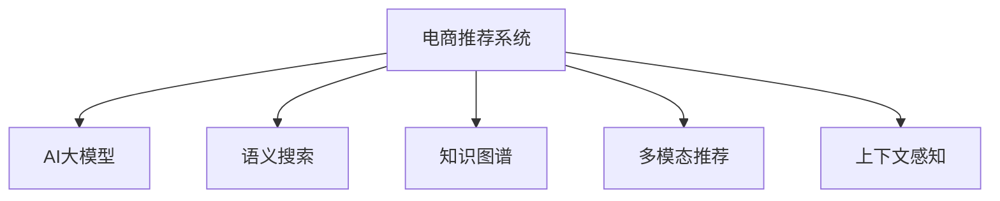

                 

# 搜索推荐系统的AI 大模型应用：提高电商平台的转化率与用户忠诚度

## 1. 背景介绍

### 1.1 问题由来

在电商领域，如何提升用户转化率和平台忠诚度一直是一个关键挑战。传统的推荐算法往往依赖于用户历史行为和物品属性，难以捕捉用户潜在的复杂需求。而近年来，基于深度学习的大模型在自然语言处理(NLP)领域取得了显著进展，为推荐系统的创新提供了新的思路。

AI大模型的出现，特别是像BERT、GPT等预训练语言模型，带来了新的方法来解决电商推荐系统的这一痛点。这些大模型通过在大规模无标签文本数据上进行预训练，学习到了丰富的语言知识和常识，可以在用户输入的查询中捕捉到更多的上下文信息，从而提供更加精准的推荐结果。

### 1.2 问题核心关键点

大模型在电商推荐中的应用主要集中在以下几个关键点：

- **语义理解**：通过大模型强大的语义理解能力，能够更好地理解用户输入的自然语言查询，挖掘用户的真实需求。
- **知识融合**：大模型可以整合更多结构化、半结构化数据，如商品描述、评论等，提升推荐结果的质量。
- **多模态融合**：结合视觉、音频等多模态信息，提供更加丰富、多样化的推荐服务。
- **个性化推荐**：基于用户个性化信息，如搜索历史、浏览行为等，提供更为精准的个性化推荐。
- **实时更新**：大模型能够动态更新，及时应对市场变化和用户兴趣的调整。

### 1.3 问题研究意义

研究AI大模型在电商推荐系统中的应用，对于提升电商平台的转化率和用户忠诚度具有重要意义：

1. **提升转化率**：通过精准的个性化推荐，显著增加用户点击率和购买转化率。
2. **增强用户忠诚度**：利用大模型分析用户行为和偏好，提供长期稳定的优质推荐服务，增强用户粘性。
3. **优化营销策略**：基于用户画像和市场趋势，制定更有效的营销策略，提升ROI。
4. **数据驱动决策**：通过大数据分析和AI模型，辅助管理层做出更加科学、合理的决策。

## 2. 核心概念与联系

### 2.1 核心概念概述

为更好地理解AI大模型在电商推荐中的应用，本节将介绍几个密切相关的核心概念：

- **电商推荐系统**：利用用户历史行为和物品属性，推荐用户可能感兴趣的商品或服务的系统。
- **AI大模型**：指通过大规模无标签文本数据预训练，具备强大的语言理解和知识表示能力的深度学习模型。
- **语义搜索**：利用大模型进行自然语言处理，理解用户查询的语义，提取关键词和需求。
- **知识图谱**：结构化的知识表示形式，用于整合和存储商品信息、品牌信息等，辅助推荐决策。
- **多模态推荐**：结合文本、图片、视频等多模态信息，提供更全面、直观的推荐服务。
- **上下文感知**：考虑用户搜索上下文、时间、地点等多方面因素，提供更个性化的推荐。

这些核心概念之间的逻辑关系可以通过以下Mermaid流程图来展示：



这个流程图展示了电商推荐系统与大模型的关系，以及大模型如何通过语义理解、知识融合、多模态融合、上下文感知等技术，提升推荐系统的性能。

## 3. 核心算法原理 & 具体操作步骤
### 3.1 算法原理概述

AI大模型在电商推荐中的应用，主要基于以下算法原理：

1. **语义搜索**：利用大模型的语义理解能力，对用户查询进行自然语言处理，提取关键词和需求。
2. **知识图谱融合**：将商品信息、品牌信息等整合到知识图谱中，通过大模型进行关联和推理，辅助推荐决策。
3. **多模态融合**：结合文本、图片、视频等多模态信息，提供更全面、直观的推荐服务。
4. **个性化推荐**：基于用户历史行为和个性化信息，利用大模型进行推荐生成。
5. **上下文感知**：考虑用户搜索上下文、时间、地点等多方面因素，提供更个性化的推荐。

### 3.2 算法步骤详解

基于AI大模型的电商推荐系统一般包括以下几个关键步骤：

**Step 1: 数据准备**
- 收集用户历史行为数据、商品属性数据、文本评论数据等。
- 对文本数据进行预处理，如分词、去停用词、构建词汇表等。
- 将数据划分训练集、验证集和测试集。

**Step 2: 模型预训练**
- 选择合适的预训练语言模型（如BERT、GPT等）作为初始化参数。
- 在大规模无标签文本数据上进行预训练，学习语言知识和常识。

**Step 3: 构建推荐模型**
- 根据具体任务设计推荐模型架构。
- 利用大模型进行推荐特征提取。
- 结合知识图谱、多模态信息等，进行推荐决策。

**Step 4: 微调与优化**
- 在标注数据上微调大模型，优化推荐效果。
- 应用正则化技术，防止过拟合。
- 选择合适学习率，优化模型参数。

**Step 5: 部署与评估**
- 将微调后的模型部署到推荐系统中。
- 在实际数据上评估推荐效果，使用AUC、点击率等指标。
- 定期重新微调模型，更新推荐策略。

### 3.3 算法优缺点

AI大模型在电商推荐中的应用具有以下优点：

1. **精度高**：利用大模型的语义理解能力，能够提供更精准的推荐结果。
2. **适应性强**：能够处理大规模数据，适应不同领域的电商推荐需求。
3. **可解释性**：大模型通过反向传播可以解释推荐决策过程，增强可解释性。
4. **扩展性好**：可以方便地扩展到多模态、上下文感知等高级推荐模型。

同时，该方法也存在一定的局限性：

1. **标注成本高**：大规模标注数据获取成本高，影响模型训练。
2. **过拟合风险**：若训练集和测试集分布差异大，易过拟合。
3. **资源需求大**：大模型计算量大，需要高性能计算资源。
4. **实时性要求高**：需要高效的前向和反向传播算法，满足实时推荐需求。

尽管存在这些局限性，但AI大模型在电商推荐中的应用仍然展现了巨大的潜力，未来仍需进一步优化和改进。

### 3.4 算法应用领域

AI大模型在电商推荐中的应用广泛，涵盖以下领域：

- **个性化推荐**：利用用户行为数据，提供个性化推荐，提升用户体验。
- **商品相似性分析**：通过大模型进行商品文本语义分析，发现商品间的相似性。
- **品牌推荐**：结合用户兴趣和品牌信息，进行品牌推荐，提升品牌曝光度。
- **上下文感知推荐**：考虑用户搜索上下文、时间、地点等因素，提供更个性化的推荐。
- **多模态推荐**：结合图片、视频等多模态信息，提供更丰富、直观的推荐服务。

这些应用领域展示了AI大模型在电商推荐系统中的广泛适用性，推动了电商行业向更加智能化、个性化方向发展。

## 4. 数学模型和公式 & 详细讲解  
### 4.1 数学模型构建

本节将使用数学语言对AI大模型在电商推荐中的应用进行更加严格的刻画。

假设电商推荐系统用户输入查询为 $q$，商品库为 $\mathcal{I}$，用户点击的商品为 $i$，大模型表示为 $M_{\theta}$，其中 $\theta$ 为模型参数。

定义大模型在查询 $q$ 上的预测概率为 $p(i|q; \theta)$，则推荐目标可以表示为：

$$
\max_{i \in \mathcal{I}} p(i|q; \theta)
$$

其中 $p(i|q; \theta)$ 为模型在查询 $q$ 下推荐商品 $i$ 的概率，可以通过大模型的softmax输出得到。

### 4.2 公式推导过程

对于推荐系统，我们通常使用交叉熵损失函数来衡量模型预测与真实标签之间的差异。假设模型预测的商品编号为 $i^*$，真实商品编号为 $i$，则损失函数可以表示为：

$$
\mathcal{L}(q, i; \theta) = -\log p(i|q; \theta)
$$

在训练过程中，我们需要最小化所有训练样本的平均损失，即：

$$
\mathcal{L}_{train}(\theta) = \frac{1}{N} \sum_{n=1}^N \mathcal{L}(q_n, i_n; \theta)
$$

其中 $q_n$ 和 $i_n$ 分别为第 $n$ 个样本的查询和点击商品。

通过反向传播算法，可以求得模型参数 $\theta$ 的梯度，进而进行参数更新。

### 4.3 案例分析与讲解

以个性化推荐为例，分析大模型的应用。

假设有一批用户的点击查询数据，我们首先对查询进行预处理，如分词、去停用词等。然后，利用大模型提取查询的语义特征，表示为 $\mathbf{q}$。接着，将用户历史行为和商品属性等信息融合到 $\mathbf{q}$ 中，生成推荐特征 $\mathbf{f}$。最后，利用 $\mathbf{f}$ 进行推荐决策，选择点击概率最高的商品 $i^*$。

具体而言，假设 $\mathbf{f}$ 为 $d$ 维特征向量，商品库 $\mathcal{I}$ 中的每个商品 $i$ 都对应一个 $d$ 维特征向量 $\mathbf{v}_i$。则推荐概率 $p(i|q; \theta)$ 可以表示为：

$$
p(i|q; \theta) = \frac{e^{a_i^\top \mathbf{f}}}{\sum_{j \in \mathcal{I}} e^{a_j^\top \mathbf{f}}}
$$

其中 $a_i$ 为 $d$ 维向量，表示商品 $i$ 的特征向量。

通过最大化 $p(i|q; \theta)$，可以确定用户最可能点击的商品 $i^*$。

## 5. 项目实践：代码实例和详细解释说明
### 5.1 开发环境搭建

在进行大模型应用开发前，我们需要准备好开发环境。以下是使用Python进行PyTorch开发的环境配置流程：

1. 安装Anaconda：从官网下载并安装Anaconda，用于创建独立的Python环境。

2. 创建并激活虚拟环境：
```bash
conda create -n pytorch-env python=3.8 
conda activate pytorch-env
```

3. 安装PyTorch：根据CUDA版本，从官网获取对应的安装命令。例如：
```bash
conda install pytorch torchvision torchaudio cudatoolkit=11.1 -c pytorch -c conda-forge
```

4. 安装Transformers库：
```bash
pip install transformers
```

5. 安装各类工具包：
```bash
pip install numpy pandas scikit-learn matplotlib tqdm jupyter notebook ipython
```

完成上述步骤后，即可在`pytorch-env`环境中开始大模型应用的实践。

### 5.2 源代码详细实现

下面我们以基于大模型的个性化推荐系统为例，给出使用Transformers库进行模型构建和微调的PyTorch代码实现。

首先，定义推荐系统所需的数据处理函数：

```python
from transformers import BertTokenizer
from torch.utils.data import Dataset
import torch

class RecommendationDataset(Dataset):
    def __init__(self, texts, queries, clicks, tokenizer, max_len=128):
        self.texts = texts
        self.queries = queries
        self.clicks = clicks
        self.tokenizer = tokenizer
        self.max_len = max_len
        
    def __len__(self):
        return len(self.texts)
    
    def __getitem__(self, item):
        query = self.queries[item]
        query_tokens = self.tokenizer(query, return_tensors='pt', max_length=self.max_len, padding='max_length', truncation=True)
        input_ids = query_tokens['input_ids'][0]
        attention_mask = query_tokens['attention_mask'][0]
        query_id = torch.tensor(self.queries[item], dtype=torch.long)
        click_id = torch.tensor(self.clicks[item], dtype=torch.long)
        
        return {'input_ids': input_ids, 
                'attention_mask': attention_mask,
                'query_id': query_id,
                'click_id': click_id}
```

然后，定义模型和优化器：

```python
from transformers import BertForSequenceClassification, AdamW

model = BertForSequenceClassification.from_pretrained('bert-base-cased', num_labels=1)

optimizer = AdamW(model.parameters(), lr=2e-5)
```

接着，定义训练和评估函数：

```python
from torch.utils.data import DataLoader
from tqdm import tqdm
from sklearn.metrics import accuracy_score

device = torch.device('cuda') if torch.cuda.is_available() else torch.device('cpu')
model.to(device)

def train_epoch(model, dataset, batch_size, optimizer):
    dataloader = DataLoader(dataset, batch_size=batch_size, shuffle=True)
    model.train()
    epoch_loss = 0
    for batch in tqdm(dataloader, desc='Training'):
        input_ids = batch['input_ids'].to(device)
        attention_mask = batch['attention_mask'].to(device)
        query_id = batch['query_id'].to(device)
        click_id = batch['click_id'].to(device)
        model.zero_grad()
        outputs = model(input_ids, attention_mask=attention_mask, labels=click_id)
        loss = outputs.loss
        epoch_loss += loss.item()
        loss.backward()
        optimizer.step()
    return epoch_loss / len(dataloader)

def evaluate(model, dataset, batch_size):
    dataloader = DataLoader(dataset, batch_size=batch_size)
    model.eval()
    preds, labels = [], []
    with torch.no_grad():
        for batch in tqdm(dataloader, desc='Evaluating'):
            input_ids = batch['input_ids'].to(device)
            attention_mask = batch['attention_mask'].to(device)
            query_id = batch['query_id'].to(device)
            batch_labels = batch['click_id']
            outputs = model(input_ids, attention_mask=attention_mask)
            batch_preds = outputs.logits.argmax(dim=1).to('cpu').tolist()
            batch_labels = batch_labels.to('cpu').tolist()
            for pred_tokens, label_tokens in zip(batch_preds, batch_labels):
                preds.append(pred_tokens[:len(label_tokens)])
                labels.append(label_tokens)
                
    return accuracy_score(labels, preds)

# 假设训练集、验证集、测试集数据划分好，可以直接使用
train_dataset = RecommendationDataset(train_texts, train_queries, train_clicks, tokenizer)
dev_dataset = RecommendationDataset(dev_texts, dev_queries, dev_clicks, tokenizer)
test_dataset = RecommendationDataset(test_texts, test_queries, test_clicks, tokenizer)
```

最后，启动训练流程并在测试集上评估：

```python
epochs = 5
batch_size = 16

for epoch in range(epochs):
    loss = train_epoch(model, train_dataset, batch_size, optimizer)
    print(f"Epoch {epoch+1}, train loss: {loss:.3f}")
    
    print(f"Epoch {epoch+1}, dev accuracy: {evaluate(model, dev_dataset, batch_size)}")
    
print(f"Epoch {epoch+1}, test accuracy: {evaluate(model, test_dataset, batch_size)}")
```

以上就是使用PyTorch对BERT进行个性化推荐系统构建和微调的完整代码实现。可以看到，得益于Transformers库的强大封装，我们可以用相对简洁的代码完成BERT模型的加载和微调。

### 5.3 代码解读与分析

让我们再详细解读一下关键代码的实现细节：

**RecommendationDataset类**：
- `__init__`方法：初始化文本、查询、点击等关键组件，并分词、填充等处理。
- `__len__`方法：返回数据集的样本数量。
- `__getitem__`方法：对单个样本进行处理，将查询输入编码为token ids，并将点击标签作为监督信号，最终返回模型所需的输入。

**模型和优化器**：
- 使用BertForSequenceClassification作为基础模型，将推荐任务转化为二分类任务。
- 使用AdamW优化器进行模型参数更新，选择适当的学习率。

**训练和评估函数**：
- 使用PyTorch的DataLoader对数据集进行批次化加载，供模型训练和推理使用。
- 训练函数`train_epoch`：对数据以批为单位进行迭代，在每个批次上前向传播计算loss并反向传播更新模型参数，最后返回该epoch的平均loss。
- 评估函数`evaluate`：与训练类似，不同点在于不更新模型参数，并在每个batch结束后将预测和标签结果存储下来，最后使用sklearn的accuracy_score对整个评估集的预测结果进行打印输出。

**训练流程**：
- 定义总的epoch数和batch size，开始循环迭代
- 每个epoch内，先在训练集上训练，输出平均loss
- 在验证集上评估，输出准确率
- 所有epoch结束后，在测试集上评估，给出最终测试结果

可以看到，PyTorch配合Transformers库使得BERT微调的代码实现变得简洁高效。开发者可以将更多精力放在数据处理、模型改进等高层逻辑上，而不必过多关注底层的实现细节。

当然，工业级的系统实现还需考虑更多因素，如模型的保存和部署、超参数的自动搜索、更灵活的任务适配层等。但核心的微调范式基本与此类似。

## 6. 实际应用场景
### 6.1 智能客服系统

基于大模型的推荐技术，可以广泛应用于智能客服系统的构建。传统客服往往需要配备大量人力，高峰期响应缓慢，且一致性和专业性难以保证。而使用大模型推荐的对话模型，可以7x24小时不间断服务，快速响应客户咨询，用自然流畅的语言解答各类常见问题。

在技术实现上，可以收集企业内部的历史客服对话记录，将问题和最佳答复构建成监督数据，在此基础上对预训练对话模型进行微调。微调后的对话模型能够自动理解用户意图，匹配最合适的答案模板进行回复。对于客户提出的新问题，还可以接入检索系统实时搜索相关内容，动态组织生成回答。如此构建的智能客服系统，能大幅提升客户咨询体验和问题解决效率。

### 6.2 金融舆情监测

金融机构需要实时监测市场舆论动向，以便及时应对负面信息传播，规避金融风险。传统的人工监测方式成本高、效率低，难以应对网络时代海量信息爆发的挑战。基于大模型推荐的文本分类和情感分析技术，为金融舆情监测提供了新的解决方案。

具体而言，可以收集金融领域相关的新闻、报道、评论等文本数据，并对其进行主题标注和情感标注。在此基础上对预训练语言模型进行微调，使其能够自动判断文本属于何种主题，情感倾向是正面、中性还是负面。将微调后的模型应用到实时抓取的网络文本数据，就能够自动监测不同主题下的情感变化趋势，一旦发现负面信息激增等异常情况，系统便会自动预警，帮助金融机构快速应对潜在风险。

### 6.3 个性化推荐系统

当前的推荐系统往往只依赖于用户历史行为数据进行物品推荐，无法深入理解用户的真实兴趣偏好。基于大模型推荐的推荐系统可以更好地挖掘用户行为背后的语义信息，从而提供更加精准的推荐结果。

在实践中，可以收集用户浏览、点击、评论、分享等行为数据，提取和用户交互的物品标题、描述、标签等文本内容。将文本内容作为模型输入，用户的后续行为（如是否点击、购买等）作为监督信号，在此基础上微调预训练语言模型。微调后的模型能够从文本内容中准确把握用户的兴趣点。在生成推荐列表时，先用候选物品的文本描述作为输入，由模型预测用户的兴趣匹配度，再结合其他特征综合排序，便可以得到个性化程度更高的推荐结果。

### 6.4 未来应用展望

随着大模型推荐技术的不断发展，未来将在更多领域得到应用，为传统行业带来变革性影响。

在智慧医疗领域，基于大模型的推荐技术可以为医疗推荐系统提供新的思路，推荐最适合患者的治疗方案和药品，提升医疗服务的智能化水平。

在智能教育领域，大模型推荐的推荐系统可应用于作业批改、学情分析、知识推荐等方面，因材施教，促进教育公平，提高教学质量。

在智慧城市治理中，大模型推荐的推荐技术可应用于城市事件监测、舆情分析、应急指挥等环节，提高城市管理的自动化和智能化水平，构建更安全、高效的未来城市。

此外，在企业生产、社会治理、文娱传媒等众多领域，大模型推荐的应用也将不断涌现，为NLP技术带来新的突破。相信随着技术的日益成熟，大模型推荐必将在更广阔的应用领域大放异彩，深刻影响人类的生产生活方式。

## 7. 工具和资源推荐
### 7.1 学习资源推荐

为了帮助开发者系统掌握大模型推荐技术的基础和实践技巧，这里推荐一些优质的学习资源：

1. 《Transformer from Foundations to Deep Learning》系列博文：由大模型技术专家撰写，深入浅出地介绍了Transformer原理、BERT模型、推荐系统等前沿话题。

2. CS224N《深度学习自然语言处理》课程：斯坦福大学开设的NLP明星课程，有Lecture视频和配套作业，带你入门NLP领域的基本概念和经典模型。

3. 《Natural Language Processing with Transformers》书籍：Transformers库的作者所著，全面介绍了如何使用Transformers库进行NLP任务开发，包括推荐系统的构建。

4. Weights & Biases：模型训练的实验跟踪工具，可以记录和可视化模型训练过程中的各项指标，方便对比和调优。与主流深度学习框架无缝集成。

5. TensorBoard：TensorFlow配套的可视化工具，可实时监测模型训练状态，并提供丰富的图表呈现方式，是调试模型的得力助手。

6. Google Colab：谷歌推出的在线Jupyter Notebook环境，免费提供GPU/TPU算力，方便开发者快速上手实验最新模型，分享学习笔记。

通过对这些资源的学习实践，相信你一定能够快速掌握大模型推荐技术的精髓，并用于解决实际的推荐问题。
###  7.2 开发工具推荐

高效的开发离不开优秀的工具支持。以下是几款用于大模型推荐开发的常用工具：

1. PyTorch：基于Python的开源深度学习框架，灵活动态的计算图，适合快速迭代研究。大部分预训练语言模型都有PyTorch版本的实现。

2. TensorFlow：由Google主导开发的开源深度学习框架，生产部署方便，适合大规模工程应用。同样有丰富的预训练语言模型资源。

3. Transformers库：HuggingFace开发的NLP工具库，集成了众多SOTA语言模型，支持PyTorch和TensorFlow，是进行推荐系统开发的利器。

4. Weights & Biases：模型训练的实验跟踪工具，可以记录和可视化模型训练过程中的各项指标，方便对比和调优。与主流深度学习框架无缝集成。

5. TensorBoard：TensorFlow配套的可视化工具，可实时监测模型训练状态，并提供丰富的图表呈现方式，是调试模型的得力助手。

6. Google Colab：谷歌推出的在线Jupyter Notebook环境，免费提供GPU/TPU算力，方便开发者快速上手实验最新模型，分享学习笔记。

合理利用这些工具，可以显著提升大模型推荐任务的开发效率，加快创新迭代的步伐。

### 7.3 相关论文推荐

大模型推荐技术的发展源于学界的持续研究。以下是几篇奠基性的相关论文，推荐阅读：

1. Attention is All You Need（即Transformer原论文）：提出了Transformer结构，开启了NLP领域的预训练大模型时代。

2. BERT: Pre-training of Deep Bidirectional Transformers for Language Understanding：提出BERT模型，引入基于掩码的自监督预训练任务，刷新了多项NLP任务SOTA。

3. Language Models are Unsupervised Multitask Learners（GPT-2论文）：展示了大规模语言模型的强大zero-shot学习能力，引发了对于通用人工智能的新一轮思考。

4. Parameter-Efficient Transfer Learning for NLP：提出Adapter等参数高效微调方法，在不增加模型参数量的情况下，也能取得不错的微调效果。

5. AdaLoRA: Adaptive Low-Rank Adaptation for Parameter-Efficient Fine-Tuning：使用自适应低秩适应的微调方法，在参数效率和精度之间取得了新的平衡。

这些论文代表了大模型推荐技术的发展脉络。通过学习这些前沿成果，可以帮助研究者把握学科前进方向，激发更多的创新灵感。

## 8. 总结：未来发展趋势与挑战
### 8.1 总结

本文对基于大模型的电商推荐系统进行了全面系统的介绍。首先阐述了AI大模型在电商推荐中的应用背景和意义，明确了微调在提升电商平台转化率和用户忠诚度方面的独特价值。其次，从原理到实践，详细讲解了推荐系统的算法原理和操作步骤，给出了推荐系统开发的完整代码实例。同时，本文还广泛探讨了推荐系统在智能客服、金融舆情、个性化推荐等多个行业领域的应用前景，展示了AI大模型推荐技术的广泛适用性。

通过本文的系统梳理，可以看到，基于AI大模型的推荐系统为电商推荐系统带来了全新的思路和方法，极大地提升了电商平台的个性化推荐能力和用户体验。未来，伴随大模型推荐技术的不断进步，基于用户行为和兴趣的推荐系统必将成为电商平台的核心竞争力，为电商平台带来更加智能、高效的运营模式。

### 8.2 未来发展趋势

展望未来，大模型推荐技术将呈现以下几个发展趋势：

1. **数据驱动的推荐系统**：大模型推荐系统将更加注重数据驱动，通过深度学习模型挖掘用户行为和语义信息，实现更加精准的推荐。

2. **多模态融合**：结合文本、图片、视频等多模态信息，提供更丰富、直观的推荐服务。

3. **实时推荐系统**：通过大模型和实时数据处理技术，构建实时推荐系统，满足用户即时需求。

4. **跨领域应用拓展**：将大模型推荐技术应用于更多领域，如医疗、教育、智能客服等，推动各行各业的智能化转型。

5. **可解释性和公平性**：提升推荐系统的可解释性和公平性，确保推荐结果透明、公正。

6. **模型优化和压缩**：通过模型优化和压缩技术，提高大模型推荐系统的效率和资源利用率。

以上趋势凸显了大模型推荐技术的广阔前景。这些方向的探索发展，必将进一步提升推荐系统的性能和应用范围，为电商平台带来更加智能化、个性化和高效的用户体验。

### 8.3 面临的挑战

尽管大模型推荐技术已经取得了显著进展，但在迈向更加智能化、普适化应用的过程中，它仍面临着诸多挑战：

1. **数据隐私和安全性**：如何保护用户隐私，确保推荐数据的安全性，是一个重要的挑战。

2. **计算资源限制**：大规模语言模型训练和推理需要大量的计算资源，如何优化资源利用率，降低计算成本，是一个亟待解决的问题。

3. **推荐系统偏见**：预训练语言模型可能学习到有偏见的信息，需要通过算法和策略避免推荐偏见。

4. **冷启动问题**：新用户或新商品缺乏历史数据，如何通过大模型进行冷启动推荐，是一个需要深入研究的问题。

5. **系统复杂度**：大模型推荐系统涉及多模态数据处理、实时推荐算法等多个方面，系统复杂度较高，如何简化模型架构，提高系统稳定性，是一个重要挑战。

6. **用户体验一致性**：如何在不同场景和设备上保持推荐一致性，提升用户体验，是一个需要持续优化的问题。

这些挑战凸显了大模型推荐技术在实际应用中的复杂性和多样性，需要研究者在多个方面进行深入探索和优化。

### 8.4 研究展望

面向未来，大模型推荐技术的研究需要在以下几个方面寻求新的突破：

1. **自监督学习**：探索更多自监督学习方法，提升大模型推荐系统的泛化能力和鲁棒性。

2. **可解释性**：研究推荐系统的可解释性，提供更加透明、可理解的推荐结果。

3. **跨模态推荐**：结合视觉、音频等多模态信息，提升推荐系统的多模态融合能力。

4. **交互式推荐**：研究用户与推荐系统的交互方式，提供更加个性化和互动的推荐体验。

5. **隐私保护**：研究推荐系统隐私保护技术，确保用户数据的安全性和隐私性。

6. **高效计算**：研究推荐系统的优化和压缩方法，提高计算效率和资源利用率。

这些研究方向的探索，必将引领大模型推荐技术迈向更高的台阶，为电商平台和更多行业带来更加智能化、高效化的推荐服务。

## 9. 附录：常见问题与解答

**Q1：大模型推荐系统是否适用于所有电商推荐任务？**

A: 大模型推荐系统在大多数电商推荐任务上都能取得不错的效果，特别是对于数据量较小的任务。但对于一些特定领域的任务，如高价值商品推荐、高端品牌推荐等，需要结合领域知识进行优化。

**Q2：微调过程中如何选择合适的学习率？**

A: 微调学习率一般要比预训练时小1-2个数量级，建议使用warmup策略，在开始阶段使用较小的学习率，再逐渐过渡到预设值。不同的优化器和学习率调度策略，可能需要设置不同的学习率阈值。

**Q3：大模型推荐系统在部署时需要注意哪些问题？**

A: 大模型推荐系统在部署时需要注意以下问题：
1. 模型裁剪：去除不必要的层和参数，减小模型尺寸，加快推理速度。
2. 量化加速：将浮点模型转为定点模型，压缩存储空间，提高计算效率。
3. 服务化封装：将模型封装为标准化服务接口，便于集成调用。
4. 弹性伸缩：根据请求流量动态调整资源配置，平衡服务质量和成本。
5. 监控告警：实时采集系统指标，设置异常告警阈值，确保服务稳定性。

大模型推荐系统在部署时还需要考虑更多因素，如模型的保存和部署、超参数的自动搜索、更灵活的任务适配层等。

**Q4：大模型推荐系统如何避免冷启动问题？**

A: 大模型推荐系统可以通过以下方法避免冷启动问题：
1. 基于用户特征和行为数据进行预训练，提升模型的泛化能力。
2. 利用用户输入的查询和上下文信息，进行零样本或少样本推荐。
3. 引入领域知识和先验信息，进行推荐决策。
4. 在少量标注数据上进行微调，提升模型适应性。

通过这些方法，可以有效地提升大模型推荐系统在冷启动场景下的推荐效果。

---

作者：禅与计算机程序设计艺术 / Zen and the Art of Computer Programming

