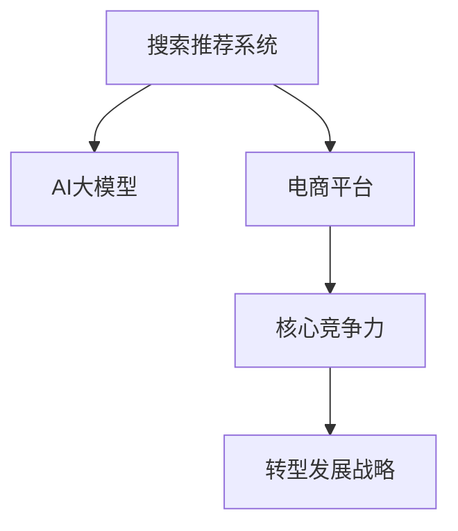

                 

# 搜索推荐系统的AI 大模型融合：电商平台的核心竞争力与转型发展战略

> 关键词：搜索推荐系统, 人工智能大模型, 电商平台, 核心竞争力, 转型发展战略

## 1. 背景介绍

### 1.1 问题由来

在当今数字化时代，电商平台正面临着日趋激烈的市场竞争，消费者需求的多样化和个性化不断挑战着传统电商平台的运营模式。传统基于规则的推荐系统已无法满足用户对个性化、精准化商品推荐的期望。

为了突破这一困境，电商平台开始探索使用人工智能大模型进行推荐系统的深度融合，通过构建AI 大模型，提供更加精准、个性化的推荐服务。在推荐系统中，搜索和推荐两大功能缺一不可，且相互依赖。因此，如何构建一套高效、精准的搜索和推荐系统，是电商平台亟待解决的难题。

### 1.2 问题核心关键点

传统电商平台的推荐系统往往依赖于基于规则的算法和简单的机器学习模型。这种方法的最大问题在于难以捕捉复杂用户需求，无法处理大量高维稀疏数据，也无法充分利用用户行为数据中的隐含关联。而通过融合AI大模型，可以解决这些难题，并实现推荐系统的性能提升。

具体来说，AI大模型可以：
1. **处理高维稀疏数据**：通过深度学习模型，可以捕捉用户行为数据中的隐含关联，解决传统模型面临的高维稀疏问题。
2. **学习用户行为规律**：大模型可以从海量数据中学习用户行为规律，更准确地预测用户需求。
3. **构建更丰富的推荐场景**：大模型可以处理更多的推荐场景，如上下文推荐、协同过滤、基于内容的推荐等。

### 1.3 问题研究意义

研究电商平台搜索推荐系统的AI大模型融合，对于电商平台的技术升级、用户体验优化和业务发展具有重要意义：

1. **提升用户体验**：通过AI大模型的融合，可以提供更加个性化、精准的推荐服务，满足用户多样化的需求，提升用户体验。
2. **提升运营效率**：AI大模型可以自动化分析用户数据，提供数据驱动的决策支持，提升平台的运营效率。
3. **增强核心竞争力**：在日益激烈的市场竞争中，通过AI技术的应用，可以提升平台的核心竞争力，实现差异化发展。
4. **促进业务创新**：AI大模型的融合，可以推动电商平台的业务模式创新，开拓新的收入来源，如推荐系统中的广告业务等。

## 2. 核心概念与联系

### 2.1 核心概念概述

为了更好地理解基于AI大模型融合的搜索推荐系统，本节将介绍几个密切相关的核心概念：

- **搜索推荐系统**：通过用户查询和行为数据，实时推荐商品或服务的系统。搜索和推荐两大功能相互依赖，共同完成用户需求的匹配和满足。
- **AI大模型**：基于深度学习技术训练的大型模型，通常具有极高的参数量和强大的表达能力。如BERT、GPT-3等模型。
- **电商平台**：利用互联网技术，通过在线销售商品或服务，实现商业交易的虚拟平台。
- **核心竞争力**：指企业具有的独特优势，使企业在市场竞争中保持领先地位。
- **转型发展战略**：企业为了应对市场环境变化，适应新的发展需求，进行的战略性调整和转型。

这些核心概念之间的逻辑关系可以通过以下Mermaid流程图来展示：



这个流程图展示出搜索推荐系统与AI大模型、电商平台、核心竞争力及转型发展战略之间的联系：

1. AI大模型为推荐系统提供强大的表达能力和丰富的知识，使其能够更好地理解和匹配用户需求。
2. 推荐系统是电商平台的核心功能，通过提升推荐质量，可以增强用户体验和平台粘性，提升运营效率。
3. 通过技术升级，电商平台可以提升核心竞争力，在市场竞争中保持领先。
4. 通过核心竞争力的提升，电商平台可以制定更科学的转型发展战略，实现长期发展。

## 3. 核心算法原理 & 具体操作步骤
### 3.1 算法原理概述

基于AI大模型的搜索推荐系统，本质上是一个数据驱动的优化问题。其核心思想是：通过AI大模型学习用户行为数据，预测用户需求，实时推荐商品或服务。

具体来说，系统由以下几个部分组成：
1. **用户画像模块**：通过AI大模型分析用户行为数据，构建用户画像，捕捉用户兴趣和行为规律。
2. **商品特征模块**：提取商品的特征，通过大模型学习商品的相似性和相关性。
3. **推荐模块**：根据用户画像和商品特征，实时生成推荐结果。

整个系统的工作流程如下：
1. **数据采集**：采集用户行为数据和商品信息。
2. **用户画像构建**：通过AI大模型对用户行为数据进行建模，构建用户画像。
3. **商品特征学习**：通过大模型对商品特征进行学习，提取商品的属性和关联。
4. **推荐生成**：根据用户画像和商品特征，生成推荐结果。
5. **反馈更新**：根据用户对推荐结果的反馈，不断调整模型参数，优化推荐结果。

### 3.2 算法步骤详解

以下是基于AI大模型的搜索推荐系统的具体操作步骤：

**Step 1: 数据采集与预处理**

1. **用户行为数据采集**：通过用户在平台上的浏览、点击、购买等行为，收集用户数据。
2. **商品信息采集**：通过商品的标签、属性、描述等信息，构建商品特征向量。
3. **数据预处理**：对采集到的数据进行清洗、去重、归一化等处理，为后续建模提供干净的数据集。

**Step 2: 用户画像构建**

1. **特征提取**：从用户行为数据中提取特征，如点击次数、停留时间、购买频率等。
2. **用户画像表示**：通过AI大模型对用户特征进行建模，得到用户画像的向量表示。

**Step 3: 商品特征学习**

1. **商品特征向量提取**：通过商品的属性和描述，提取商品的特征向量。
2. **商品关联学习**：使用大模型对商品特征进行建模，学习商品之间的关联性。

**Step 4: 推荐生成**

1. **用户画像与商品特征匹配**：根据用户画像和商品特征，通过大模型进行匹配，得到用户对商品的偏好。
2. **推荐排序**：根据匹配结果，对商品进行排序，生成推荐列表。

**Step 5: 反馈更新**

1. **用户反馈收集**：收集用户对推荐结果的反馈，如点击、购买等行为。
2. **模型调整**：根据用户反馈，使用大模型对模型参数进行调整，优化推荐结果。

### 3.3 算法优缺点

基于AI大模型的搜索推荐系统具有以下优点：
1. **高性能**：AI大模型具有强大的表达能力，可以高效处理高维稀疏数据，提高推荐系统性能。
2. **精准性**：通过学习用户行为数据和商品特征，大模型可以更准确地预测用户需求，提供精准的推荐结果。
3. **可扩展性**：AI大模型可以处理大量的数据，支持推荐系统的大规模扩展。
4. **动态性**：通过实时调整模型参数，大模型可以动态地适应用户需求变化，提供实时推荐。

同时，该方法也存在以下局限性：
1. **计算资源需求高**：AI大模型需要大量的计算资源，对于资源有限的平台可能难以支持。
2. **数据隐私问题**：用户行为数据可能包含敏感信息，如何保护用户隐私是一个重要问题。
3. **模型解释性不足**：AI大模型的黑盒性质使得其推荐结果缺乏可解释性，用户难以理解推荐逻辑。
4. **模型过拟合风险**：大模型容易过拟合训练数据，导致推荐结果泛化性差。

尽管存在这些局限性，但AI大模型在推荐系统中的应用仍具有巨大的潜力。未来相关研究的方向在于如何进一步优化模型的计算资源需求，增强其解释性，以及降低过拟合风险。

### 3.4 算法应用领域

基于AI大模型的搜索推荐系统在电商平台上已经得到了广泛的应用，具体包括：

1. **个性化推荐**：根据用户历史行为，实时生成个性化推荐结果。
2. **搜索排序**：根据用户查询，实时生成搜索结果，并根据模型预测调整排序。
3. **上下文推荐**：根据用户当前浏览行为和上下文信息，生成个性化推荐。
4. **实时反馈**：根据用户对推荐结果的反馈，动态调整模型参数，优化推荐结果。
5. **协同过滤**：根据用户行为和商品之间的关联性，生成推荐结果。

除了上述这些经典应用外，AI大模型还可以用于电商平台的更多场景中，如广告投放优化、库存管理、用户行为分析等，为电商平台提供更全面的数据支持和服务。

## 4. 数学模型和公式 & 详细讲解  
### 4.1 数学模型构建

在基于AI大模型的搜索推荐系统中，数学模型的构建主要基于深度学习技术。以个性化推荐为例，假设用户画像表示为 $\mathbf{u}$，商品特征表示为 $\mathbf{v}$，用户对商品 $i$ 的兴趣为 $r_i$，则推荐模型的数学模型为：

$$
r_i = f(\mathbf{u}, \mathbf{v}_i)
$$

其中 $f$ 为推荐函数，可以采用如协同过滤、基于内容的推荐、深度学习等方法。

### 4.2 公式推导过程

以协同过滤为例，推荐函数 $f$ 可以表示为用户画像和商品特征的相似度：

$$
r_i = \mathbf{u}^T \cdot \mathbf{v}_i
$$

其中 $\mathbf{u}$ 和 $\mathbf{v}_i$ 分别为用户画像和商品特征的向量表示。通过相似度计算，可以获取用户对商品 $i$ 的兴趣度。

### 4.3 案例分析与讲解

以用户画像和商品特征的相似度计算为例，可以使用余弦相似度进行计算：

$$
similarity(\mathbf{u}, \mathbf{v}_i) = \frac{\mathbf{u} \cdot \mathbf{v}_i}{\|\mathbf{u}\| \cdot \|\mathbf{v}_i\|}
$$

在实际应用中，为了提高计算效率，可以使用近似方法，如基于核函数的方法，或通过降维技术（如PCA、t-SNE等）进行特征表示。

## 5. 项目实践：代码实例和详细解释说明
### 5.1 开发环境搭建

在进行AI大模型的搜索推荐系统开发前，我们需要准备好开发环境。以下是使用Python进行TensorFlow开发的环境配置流程：

1. 安装Anaconda：从官网下载并安装Anaconda，用于创建独立的Python环境。

2. 创建并激活虚拟环境：
```bash
conda create -n tf-env python=3.8 
conda activate tf-env
```

3. 安装TensorFlow：根据CUDA版本，从官网获取对应的安装命令。例如：
```bash
conda install tensorflow -c tf -c conda-forge
```

4. 安装各类工具包：
```bash
pip install numpy pandas scikit-learn matplotlib tqdm jupyter notebook ipython
```

完成上述步骤后，即可在`tf-env`环境中开始搜索推荐系统的开发。

### 5.2 源代码详细实现

下面我们以电商平台上的个性化推荐系统为例，给出使用TensorFlow实现搜索推荐系统的PyTorch代码实现。

首先，定义推荐模型的输入输出：

```python
import tensorflow as tf
from tensorflow.keras import layers

# 定义输入层
user_input = tf.keras.layers.Input(shape=(user_features,), name='user_input')
item_input = tf.keras.layers.Input(shape=(item_features,), name='item_input')

# 定义模型
model = tf.keras.Sequential([
    # 用户画像嵌入层
    tf.keras.layers.Dense(128, activation='relu', input_shape=(user_features,)),
    # 商品特征嵌入层
    tf.keras.layers.Dense(128, activation='relu', input_shape=(item_features,)),
    # 相似度计算层
    tf.keras.layers.Dot(name='similarity', normalize=True),
    # 输出层
    tf.keras.layers.Dense(1, activation='sigmoid')
])

# 编译模型
model.compile(optimizer=tf.keras.optimizers.Adam(), loss='binary_crossentropy', metrics=['accuracy'])
```

然后，定义模型训练和评估函数：

```python
# 训练函数
def train(model, train_data, batch_size, epochs):
    model.fit(train_data, batch_size=batch_size, epochs=epochs, validation_data=val_data)

# 评估函数
def evaluate(model, test_data, batch_size):
    test_loss, test_acc = model.evaluate(test_data, batch_size=batch_size)
    print(f'Test Loss: {test_loss}, Test Accuracy: {test_acc}')
```

最后，启动模型训练并在测试集上评估：

```python
# 训练模型
train(model, train_data, batch_size=128, epochs=10)

# 评估模型
evaluate(model, test_data, batch_size=128)
```

以上就是使用TensorFlow对电商平台的个性化推荐系统进行建模和训练的完整代码实现。可以看到，TensorFlow的Keras API提供了便捷的模型构建和训练接口，使得模型开发和调试变得更加容易。

### 5.3 代码解读与分析

让我们再详细解读一下关键代码的实现细节：

**train_data和val_data定义**：
```python
# 定义训练数据和验证数据
train_data = tf.data.Dataset.from_tensor_slices((train_user_ids, train_item_ids))
train_data = train_data.map(lambda x, y: (embedding_lookup(user_embedding, x), embedding_lookup(item_embedding, y)))
train_data = train_data.batch(batch_size)

val_data = tf.data.Dataset.from_tensor_slices((val_user_ids, val_item_ids))
val_data = val_data.map(lambda x, y: (embedding_lookup(user_embedding, x), embedding_lookup(item_embedding, y)))
val_data = val_data.batch(batch_size)
```

这里使用了TensorFlow的Dataset API，通过map和batch方法对用户和商品的特征进行转换和批处理。同时，使用了嵌入层（embedding_lookup）对用户和商品特征进行表示。

**evaluate函数实现**：
```python
# 评估函数
def evaluate(model, test_data, batch_size):
    test_loss, test_acc = model.evaluate(test_data, batch_size=batch_size)
    print(f'Test Loss: {test_loss}, Test Accuracy: {test_acc}')
```

在评估函数中，使用了模型的evaluate方法，自动计算测试集上的损失和准确率，并输出结果。

**训练函数实现**：
```python
# 训练函数
def train(model, train_data, batch_size, epochs):
    model.fit(train_data, batch_size=batch_size, epochs=epochs, validation_data=val_data)
```

在训练函数中，使用了模型的fit方法，进行模型的训练和验证。

这些代码实现体现了TensorFlow的高效性和便捷性，使得模型开发和调试变得更加简单。

## 6. 实际应用场景
### 6.1 智能客服系统

基于AI大模型的推荐系统，可以广泛应用于智能客服系统的构建。传统客服往往需要配备大量人力，高峰期响应缓慢，且一致性和专业性难以保证。而使用基于大模型的推荐系统，可以7x24小时不间断服务，快速响应客户咨询，用自然流畅的语言解答各类常见问题。

在技术实现上，可以收集企业内部的历史客服对话记录，将问题和最佳答复构建成监督数据，在此基础上对预训练推荐模型进行微调。微调后的推荐模型能够自动理解用户意图，匹配最合适的答复模板进行回复。对于客户提出的新问题，还可以接入检索系统实时搜索相关内容，动态组织生成回答。如此构建的智能客服系统，能大幅提升客户咨询体验和问题解决效率。

### 6.2 金融舆情监测

金融机构需要实时监测市场舆论动向，以便及时应对负面信息传播，规避金融风险。传统的人工监测方式成本高、效率低，难以应对网络时代海量信息爆发的挑战。基于大模型的推荐系统可以应用于金融舆情监测，通过推荐系统对舆情数据进行分析和预测。

具体而言，可以收集金融领域相关的新闻、报道、评论等文本数据，并对其进行主题标注和情感标注。在此基础上对预训练语言模型进行微调，使其能够自动判断文本属于何种主题，情感倾向是正面、中性还是负面。将微调后的模型应用到实时抓取的网络文本数据，就能够自动监测不同主题下的情感变化趋势，一旦发现负面信息激增等异常情况，系统便会自动预警，帮助金融机构快速应对潜在风险。

### 6.3 个性化推荐系统

当前的推荐系统往往只依赖用户的历史行为数据进行物品推荐，无法深入理解用户的真实兴趣偏好。基于大模型的推荐系统可以更好地挖掘用户行为背后的语义信息，从而提供更精准、多样的推荐内容。

在实践中，可以收集用户浏览、点击、评论、分享等行为数据，提取和用户交互的物品标题、描述、标签等文本内容。将文本内容作为模型输入，用户的后续行为（如是否点击、购买等）作为监督信号，在此基础上微调预训练语言模型。微调后的模型能够从文本内容中准确把握用户的兴趣点。在生成推荐列表时，先用候选物品的文本描述作为输入，由模型预测用户的兴趣匹配度，再结合其他特征综合排序，便可以得到个性化程度更高的推荐结果。

### 6.4 未来应用展望

随着大语言模型和推荐系统的不断发展，基于大模型的推荐系统将在更多领域得到应用，为传统行业带来变革性影响。

在智慧医疗领域，基于大模型的推荐系统可以用于推荐个性化的医疗方案、药品和治疗方式，提升医疗服务的智能化水平，辅助医生诊疗，加速新药开发进程。

在智能教育领域，推荐系统可应用于作业批改、学情分析、知识推荐等方面，因材施教，促进教育公平，提高教学质量。

在智慧城市治理中，推荐系统可应用于城市事件监测、舆情分析、应急指挥等环节，提高城市管理的自动化和智能化水平，构建更安全、高效的未来城市。

此外，在企业生产、社会治理、文娱传媒等众多领域，基于大模型的推荐系统也将不断涌现，为经济社会发展注入新的动力。相信随着预训练语言模型和推荐方法的不断进步，基于大模型的推荐系统必将在构建人机协同的智能时代中扮演越来越重要的角色。

## 7. 工具和资源推荐
### 7.1 学习资源推荐

为了帮助开发者系统掌握大语言模型微调的理论基础和实践技巧，这里推荐一些优质的学习资源：

1. 《深度学习理论与实践》系列博文：由深度学习专家撰写，深入浅出地介绍了深度学习理论、模型构建和优化方法。

2. CS229《机器学习》课程：斯坦福大学开设的机器学习课程，涵盖了各类经典的机器学习算法和应用。

3. 《深度学习》书籍：Ian Goodfellow等所著，系统介绍了深度学习的基础知识和常用算法。

4. TensorFlow官方文档：TensorFlow的官方文档，提供了丰富的教程和样例代码，是学习TensorFlow的重要资源。

5. HuggingFace官方文档：HuggingFace的官方文档，提供了海量的预训练模型和微调样例，方便开发者快速上手。

通过对这些资源的学习实践，相信你一定能够快速掌握大语言模型微调的精髓，并用于解决实际的推荐系统问题。
###  7.2 开发工具推荐

高效的开发离不开优秀的工具支持。以下是几款用于大语言模型微调开发的常用工具：

1. TensorFlow：由Google主导开发的开源深度学习框架，生产部署方便，适合大规模工程应用。提供了丰富的Keras API和高级优化工具，如TFRecords、TensorBoard等。

2. PyTorch：基于Python的开源深度学习框架，灵活的计算图机制，适合快速迭代研究。提供了丰富的Tensorflow接口和优化工具，如Optimizer、Scheduler等。

3. Weights & Biases：模型训练的实验跟踪工具，可以记录和可视化模型训练过程中的各项指标，方便对比和调优。

4. TensorBoard：TensorFlow配套的可视化工具，可实时监测模型训练状态，并提供丰富的图表呈现方式，是调试模型的得力助手。

5. Jupyter Notebook：交互式Python环境，方便进行模型开发和调试，支持多种格式输出和文件共享。

合理利用这些工具，可以显著提升大语言模型微调任务的开发效率，加快创新迭代的步伐。

### 7.3 相关论文推荐

大语言模型和推荐系统的发展源于学界的持续研究。以下是几篇奠基性的相关论文，推荐阅读：

1. Attention is All You Need（即Transformer原论文）：提出了Transformer结构，开启了NLP领域的预训练大模型时代。

2. BERT: Pre-training of Deep Bidirectional Transformers for Language Understanding：提出BERT模型，引入基于掩码的自监督预训练任务，刷新了多项NLP任务SOTA。

3. Learning to Rank: A Dozen Years After: From Pairwise to Ranking RankNet, LambdaRank, LambdaMART, and Recently Adaptive Pairwise Ranking：介绍了推荐系统中的经典排名算法，如RankNet、LambdaRank、LambdaMART等。

4. Recommender Systems in Practice：介绍了推荐系统在电商、金融、医疗等领域的实际应用，以及常用的推荐算法和优化方法。

5. Matrix Factorization Techniques for Recommender Systems：介绍了矩阵分解等推荐系统的经典算法，以及如何利用大模型提升推荐系统效果。

这些论文代表了大语言模型微调和推荐系统的研究脉络。通过学习这些前沿成果，可以帮助研究者把握学科前进方向，激发更多的创新灵感。

## 8. 总结：未来发展趋势与挑战

### 8.1 总结

本文对基于AI大模型的搜索推荐系统进行了全面系统的介绍。首先阐述了搜索推荐系统的研究背景和意义，明确了AI大模型融合在提升电商平台推荐系统性能方面的重要价值。其次，从原理到实践，详细讲解了推荐系统的数学模型和关键步骤，给出了推荐系统开发的完整代码实例。同时，本文还广泛探讨了AI大模型在电商平台的实际应用场景，展示了AI技术在电商领域的巨大潜力。最后，本文精选了推荐系统的各类学习资源，力求为读者提供全方位的技术指引。

通过本文的系统梳理，可以看到，基于AI大模型的搜索推荐系统正在成为电商平台推荐系统的重要范式，极大地提升了电商平台的运营效率和用户体验。未来，伴随AI大模型的不断演进，基于大模型的推荐系统必将在更多领域得到应用，为传统行业带来变革性影响。

### 8.2 未来发展趋势

展望未来，AI大模型的搜索推荐系统将呈现以下几个发展趋势：

1. **多模态融合**：AI大模型融合多模态数据，如文本、图像、语音等，提供更全面的用户画像和推荐结果。
2. **深度学习优化**：使用深度学习技术，进一步提升模型的准确性和鲁棒性，处理更复杂的推荐场景。
3. **个性化推荐**：通过学习用户的多维数据，实现更精准、个性化的推荐。
4. **实时推荐**：结合用户实时行为数据，提供更及时的推荐结果。
5. **协同过滤**：利用用户和商品之间的关联性，实现更准确的推荐。
6. **上下文推荐**：考虑用户上下文信息，提供更全面的推荐服务。

以上趋势凸显了AI大模型在推荐系统中的广泛应用前景。这些方向的探索发展，必将进一步提升推荐系统的性能和用户体验，推动AI技术在更多领域的应用。

### 8.3 面临的挑战

尽管基于AI大模型的搜索推荐系统已经取得了瞩目成就，但在迈向更加智能化、普适化应用的过程中，它仍面临着诸多挑战：

1. **计算资源需求高**：AI大模型的计算资源需求高，对于资源有限的平台可能难以支持。
2. **数据隐私问题**：用户行为数据可能包含敏感信息，如何保护用户隐私是一个重要问题。
3. **模型解释性不足**：AI大模型的黑盒性质使得其推荐结果缺乏可解释性，用户难以理解推荐逻辑。
4. **模型过拟合风险**：大模型容易过拟合训练数据，导致推荐结果泛化性差。
5. **实时性问题**：实时推荐需要高效的计算和存储机制，对于大规模数据集可能存在延迟。

尽管存在这些挑战，但AI大模型在推荐系统中的应用仍具有巨大的潜力。未来相关研究需要在这些方面寻求新的突破，才能更好地发挥AI大模型在推荐系统中的价值。

### 8.4 研究展望

面向未来，AI大模型在推荐系统中的应用还需要从以下几个方面进行探索：

1. **优化计算资源需求**：开发更高效的计算图，如TensorRT、ONNX等，减少模型推理时间，提高实时性。
2. **增强模型解释性**：引入可解释性技术，如LIME、SHAP等，提高模型的透明度，增强用户信任。
3. **降低模型过拟合风险**：引入正则化技术，如Dropout、L2正则等，提升模型的泛化能力。
4. **结合外部知识**：将知识图谱、规则库等外部知识与模型结合，提升推荐系统的效果。
5. **处理多模态数据**：结合图像、语音等多模态数据，提供更全面的推荐服务。

这些研究方向将推动AI大模型在推荐系统中的应用走向更加成熟和高效，为推荐系统的进一步发展提供有力支持。

## 9. 附录：常见问题与解答

**Q1：AI大模型在推荐系统中的应用有哪些？**

A: AI大模型在推荐系统中的应用非常广泛，主要包括以下几个方面：
1. **个性化推荐**：通过学习用户的历史行为和兴趣，实现精准的个性化推荐。
2. **上下文推荐**：结合用户当前的上下文信息，如浏览记录、地理位置等，提供更个性化的推荐。
3. **实时推荐**：通过实时分析用户行为数据，动态生成推荐结果，提高推荐的时效性。
4. **协同过滤**：利用用户和商品之间的关联性，实现更准确的推荐。
5. **多模态融合**：结合文本、图像、语音等多模态数据，提供更全面的推荐服务。

**Q2：如何优化AI大模型的计算资源需求？**

A: 优化AI大模型的计算资源需求，可以从以下几个方面进行：
1. **模型压缩**：使用模型压缩技术，如剪枝、量化等，减少模型参数量，提高推理速度。
2. **模型并行**：使用模型并行技术，如数据并行、模型并行等，加速模型训练和推理。
3. **硬件加速**：使用硬件加速设备，如GPU、TPU等，提升模型训练和推理的效率。
4. **计算图优化**：优化计算图，减少计算量和内存占用，提高实时性。
5. **分布式训练**：使用分布式训练技术，利用多个计算节点进行并行计算，加速模型训练。

这些方法可以结合使用，通过多路径协同发力，进一步优化模型的计算资源需求。

**Q3：如何增强AI大模型的解释性？**

A: 增强AI大模型的解释性，可以从以下几个方面进行：
1. **可解释性技术**：使用可解释性技术，如LIME、SHAP等，解释模型的预测结果。
2. **规则嵌入**：在模型中嵌入规则，提高模型的透明度和可解释性。
3. **知识图谱融合**：将知识图谱与模型结合，提供更全面的推荐服务，增强模型的可解释性。
4. **用户反馈**：收集用户对推荐结果的反馈，不断调整模型参数，提高推荐结果的可解释性。

这些方法可以结合使用，通过多路径协同发力，进一步增强模型的可解释性，提高用户信任度。

**Q4：如何降低AI大模型的过拟合风险？**

A: 降低AI大模型的过拟合风险，可以从以下几个方面进行：
1. **正则化技术**：使用正则化技术，如L2正则、Dropout等，抑制模型的过拟合。
2. **数据增强**：通过数据增强技术，增加训练数据的多样性，提高模型的泛化能力。
3. **模型剪枝**：使用模型剪枝技术，减少模型参数量，降低模型的过拟合风险。
4. **提前停止**：使用提前停止技术，防止模型在训练后期过拟合。
5. **交叉验证**：使用交叉验证技术，评估模型的泛化能力，防止模型过拟合。

这些方法可以结合使用，通过多路径协同发力，进一步降低模型的过拟合风险，提高模型的泛化能力。

**Q5：如何结合外部知识提升AI大模型的推荐效果？**

A: 结合外部知识提升AI大模型的推荐效果，可以从以下几个方面进行：
1. **知识图谱融合**：将知识图谱与模型结合，提供更全面的推荐服务。
2. **规则嵌入**：在模型中嵌入规则，提高模型的透明度和可解释性。
3. **上下文知识**：结合用户上下文信息，提供更个性化的推荐。
4. **领域知识**：结合领域知识，提供更精准的推荐服务。

这些方法可以结合使用，通过多路径协同发力，进一步提升模型的推荐效果，提高用户满意度。

---

作者：禅与计算机程序设计艺术 / Zen and the Art of Computer Programming

