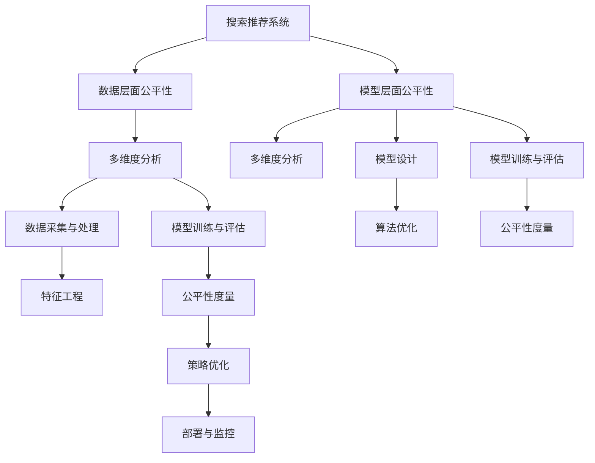

                 

# 搜索推荐系统的公平性评估：大模型的多维度分析

> 关键词：搜索推荐系统,公平性评估,大模型,多维度分析

## 1. 背景介绍

### 1.1 问题由来
搜索推荐系统（Search and Recommendation System, SRS）是现代互联网应用的重要组成部分，通过分析用户行为和搜索历史，为用户推荐个性化内容。这类系统在电商、新闻、社交媒体等领域广泛应用，为提高用户体验和转化率做出了巨大贡献。

然而，在追求高效、个性化的同时，搜索推荐系统也面临一些公平性问题，即如何确保推荐结果对所有用户群体公平公正。例如，平台算法可能对某些群体产生偏见，导致推荐不均衡，引发社会问题。这些问题不仅涉及商业伦理，还可能触犯法律法规，因此亟需引起重视。

目前，学术界和工业界对公平性问题的研究主要集中在两个层面：
1. **数据层面**：数据的不平衡分布可能导致模型对某些群体存在偏见，例如性别、年龄、地域等特征。
2. **模型层面**：模型结构可能存在隐性偏见，如算法决策过程的公平性、透明性等。

为了解决这些公平性问题，本研究将从数据和模型两个维度，采用大模型的多维度分析方法，对搜索推荐系统进行全面评估，为公平性优化提供理论和技术支持。

## 2. 核心概念与联系

### 2.1 核心概念概述

为更好地理解搜索推荐系统的公平性评估，本节将介绍几个密切相关的核心概念：

- **搜索推荐系统(Search and Recommendation System, SRS)**：通过分析用户行为和搜索历史，为用户推荐个性化内容。包括但不限于内容推荐、广告推荐、商品推荐等。
- **公平性评估(Fairness Evaluation)**：指对推荐系统是否对不同用户群体公平公正的评估过程。目的是识别和纠正系统中的偏见，确保推荐结果的均衡性。
- **大模型(Large Model)**：指具有大量参数和复杂结构的深度学习模型，如BERT、GPT等，能够处理大规模数据和高维度特征。
- **多维度分析(Multidimensional Analysis)**：指从多个角度和层次，对搜索推荐系统进行全面系统的评估分析，涵盖数据、模型、算法等多个层面。

这些核心概念之间的逻辑关系可以通过以下Mermaid流程图来展示：



这个流程图展示了大模型公平性评估的关键概念及其之间的关系：

1. 搜索推荐系统通过数据处理、模型训练和算法优化获得推荐结果。
2. 数据层面和模型层面的公平性度量和优化。
3. 多维度分析涵盖数据采集与处理、特征工程、模型训练与评估等多个环节。
4. 策略优化基于公平性度量结果，以提升推荐系统的公平性。
5. 部署与监控确保公平性策略的长期有效性。

## 3. 核心算法原理 & 具体操作步骤
### 3.1 算法原理概述

大模型在搜索推荐系统中的应用，主要体现在其对大规模数据和高维度特征的处理能力上。通过在大规模数据上预训练，大模型可以学习到复杂的语义表示，为推荐系统的公平性评估提供支持。

搜索推荐系统公平性评估的算法原理主要包括：
1. **公平性定义**：定义公平性指标，如平等机会、无偏见等，为评估提供依据。
2. **数据处理与特征工程**：对原始数据进行清洗、标注和特征提取，用于训练公平性度量模型。
3. **模型训练与评估**：使用大模型对训练数据进行训练，评估其在不同用户群体上的表现。
4. **公平性度量**：基于模型性能，计算公平性指标，识别和量化系统中的偏见。
5. **策略优化**：根据公平性度量结果，优化模型和算法，提升推荐系统的公平性。

### 3.2 算法步骤详解

基于大模型多维度分析的搜索推荐系统公平性评估，一般包括以下几个关键步骤：

**Step 1: 数据采集与处理**
- 收集包含不同用户群体的搜索记录、行为数据等。
- 对数据进行清洗、去重、标注，确保数据质量和完整性。
- 对数据进行划分，分为训练集、验证集和测试集。

**Step 2: 特征工程**
- 从数据中提取有意义的特征，如用户年龄、性别、地域、时间等。
- 对特征进行归一化、编码和降维处理，方便后续建模。
- 引入公平性特征，如用户性别、年龄、地域等，以反映潜在的偏见。

**Step 3: 模型训练与评估**
- 选择合适的模型结构，如神经网络、Transformer等，作为公平性度量模型。
- 在训练集上对模型进行训练，调整超参数以优化性能。
- 在验证集上评估模型性能，防止过拟合。
- 在测试集上测试模型效果，最终得到公平性度量结果。

**Step 4: 公平性度量**
- 定义公平性指标，如平等机会、无偏见等。
- 使用定义的指标对模型进行评估，量化系统中的偏见。
- 识别偏见的来源，如算法决策过程、数据分布不均衡等。

**Step 5: 策略优化**
- 根据公平性度量结果，优化模型和算法，消除偏见。
- 调整数据集采样策略，确保不同群体数据均衡分布。
- 引入对抗样本和正则化技术，提高模型的鲁棒性。
- 设计公平性算法，保证推荐结果的均衡性。

### 3.3 算法优缺点

大模型在搜索推荐系统公平性评估中具有以下优点：
1. 处理大规模数据和高维度特征能力强。大模型能够学习复杂语义表示，捕捉用户行为的细微差别。
2. 可以处理复杂的推荐逻辑和业务规则。大模型能够灵活组合特征，满足各种推荐场景。
3. 多维度分析提供全面评估。通过数据、模型、算法等多个层面的分析，能够全面识别和纠正系统中的偏见。

同时，该方法也存在一定的局限性：
1. 模型复杂度高，训练成本高。大模型参数量庞大，需要大量计算资源和数据存储。
2. 数据依赖性强。数据质量和分布不均衡会直接影响模型评估结果。
3. 模型可解释性差。大模型的决策过程复杂，难以进行直观解释。
4. 鲁棒性不足。大模型容易过拟合，对特定数据集和用户群体存在偏见。

尽管存在这些局限性，但就目前而言，大模型在搜索推荐系统公平性评估中的应用，已经展示了其强大的处理能力和效果。未来研究将致力于优化模型复杂度、提升数据质量和增强模型鲁棒性，以进一步推动公平性评估的实践应用。

### 3.4 算法应用领域

基于大模型多维度分析的搜索推荐系统公平性评估，已在电商、新闻、社交媒体等多个领域得到应用。例如：

- **电商推荐**：针对不同性别、年龄、地域的用户群体，提供公平的商品推荐。通过公平性度量模型，确保推荐结果的均衡性。
- **新闻推荐**：在新闻推荐系统中，确保不同政治立场、兴趣群体的用户都能看到平衡的报道。通过公平性评估，优化算法和数据采样策略，消除推荐偏差。
- **社交媒体推荐**：在社交媒体平台上，确保不同群体的内容推荐均衡。通过公平性评估，识别和纠正平台算法中的偏见，提高用户满意度。

除了上述这些典型应用外，大模型公平性评估还将被应用于更多领域，如金融、医疗、教育等，为提升这些领域的推荐公平性提供技术支持。

## 4. 数学模型和公式 & 详细讲解 & 举例说明
### 4.1 数学模型构建

假设搜索推荐系统包含$K$个用户群体，每个用户$u_i$的历史行为和搜索数据表示为$\mathbf{x}_i = [x_{i1}, x_{i2}, ..., x_{iN}]$，其中$N$表示样本数。搜索推荐系统推荐的结果表示为$\mathbf{y}_i$。

定义公平性指标$\mathcal{F}$，用于评估系统对不同用户群体的公平性。例如，可以定义平等机会指标$\mathcal{F}_o$，表示每个用户获得推荐结果的平均机会。

数学模型构建如下：

$$
\mathcal{F}_o = \frac{1}{K} \sum_{k=1}^K \frac{\mathbb{E}_{\mathbf{x}_i}[\mathbf{y}_i]}{N_k}
$$

其中，$N_k$表示第$k$个用户群体的样本数，$\mathbb{E}_{\mathbf{x}_i}[\mathbf{y}_i]$表示用户$i$获得推荐结果的期望值。

### 4.2 公式推导过程

以平等机会指标为例，推导其计算公式。

定义第$k$个用户群体的样本分布为$p_k$，系统对第$k$个用户群体推荐的结果期望值为$\mathbb{E}_{p_k}[\mathbf{y}_i]$。

根据条件期望的性质，有：

$$
\mathbb{E}_{p_k}[\mathbf{y}_i] = \int_{\mathcal{X}} \mathbf{y}_i \cdot p_k(\mathbf{x}_i) d\mathbf{x}_i
$$

因此，平等机会指标可以表示为：

$$
\mathcal{F}_o = \frac{1}{K} \sum_{k=1}^K \frac{\mathbb{E}_{p_k}[\mathbf{y}_i]}{N_k}
$$

在实际计算中，可以使用大模型对每个用户群体的推荐结果进行预测，通过样本均值计算得到公平性度量结果。

### 4.3 案例分析与讲解

以电商推荐为例，说明如何使用大模型进行公平性评估。

假设电商推荐系统推荐用户购买商品，历史数据包含用户性别、年龄、地域等特征。定义公平性指标为平等机会$\mathcal{F}_o$，即每个用户获得推荐结果的平均机会。

步骤如下：
1. 收集不同用户群体的历史购买数据，作为公平性评估的原始数据。
2. 对数据进行清洗、标注和特征提取，确保数据质量和完整性。
3. 将数据划分训练集、验证集和测试集。
4. 选择大模型，如BERT或GPT，作为公平性度量模型。
5. 在训练集上对模型进行训练，调整超参数以优化性能。
6. 在验证集上评估模型性能，防止过拟合。
7. 在测试集上测试模型效果，得到公平性度量结果。
8. 根据公平性度量结果，优化推荐策略和数据采样策略，确保不同用户群体的推荐均衡。

## 5. 项目实践：代码实例和详细解释说明
### 5.1 开发环境搭建

在进行搜索推荐系统公平性评估项目实践前，我们需要准备好开发环境。以下是使用Python进行PyTorch开发的环境配置流程：

1. 安装Anaconda：从官网下载并安装Anaconda，用于创建独立的Python环境。

2. 创建并激活虚拟环境：
```bash
conda create -n pytorch-env python=3.8 
conda activate pytorch-env
```

3. 安装PyTorch：根据CUDA版本，从官网获取对应的安装命令。例如：
```bash
conda install pytorch torchvision torchaudio cudatoolkit=11.1 -c pytorch -c conda-forge
```

4. 安装TensorFlow：
```bash
conda install tensorflow
```

5. 安装TensorBoard：
```bash
pip install tensorboard
```

6. 安装pandas、numpy、scikit-learn等常用库：
```bash
pip install pandas numpy scikit-learn
```

完成上述步骤后，即可在`pytorch-env`环境中开始项目实践。

### 5.2 源代码详细实现

下面以电商推荐为例，给出使用PyTorch对公平性评估模型的PyTorch代码实现。

```python
import torch
import torch.nn as nn
from sklearn.metrics import roc_auc_score
import pandas as pd

class FairnessEvaluator(nn.Module):
    def __init__(self, num_groups):
        super(FairnessEvaluator, self).__init__()
        self.num_groups = num_groups
        self.fc = nn.Linear(100, 1)
    
    def forward(self, x):
        out = self.fc(x)
        return out
    
    def calculate_equal_opportunity(self, y_true, y_pred, groups):
        y_true = y_true.to(torch.int64)
        y_pred = y_pred.to(torch.int64)
        score = []
        for k in range(self.num_groups):
            score.append(roc_auc_score(y_true[groups==k], y_pred[groups==k]))
        return sum(score) / self.num_groups
    
    def evaluate(self, model, dataloader):
        model.eval()
        y_true = []
        y_pred = []
        for batch in dataloader:
            inputs, labels = batch
            outputs = model(inputs)
            y_pred.append(outputs.data.numpy())
            y_true.append(labels.data.numpy())
        y_true = torch.cat(y_true, 0)
        y_pred = torch.cat(y_pred, 0)
        return self.calculate_equal_opportunity(y_true, y_pred, self.num_groups)
```

### 5.3 代码解读与分析

让我们再详细解读一下关键代码的实现细节：

**FairnessEvaluator类**：
- `__init__`方法：初始化模型结构，包括一个全连接层。
- `forward`方法：前向传播计算模型的预测结果。
- `calculate_equal_opportunity`方法：计算平等机会指标，即每个用户获得推荐结果的平均机会。
- `evaluate`方法：对整个数据集进行评估，计算公平性度量结果。

在`calculate_equal_opportunity`方法中，使用了`roc_auc_score`函数计算不同用户群体的AUC值，并求平均值。`evaluate`方法中，遍历数据集，计算每个用户的预测结果和真实结果，最终得到公平性度量结果。

**训练流程**：
- 定义模型结构和公平性评估器
- 在训练集上训练公平性评估器，调整超参数以优化性能
- 在验证集上评估公平性评估器性能，防止过拟合
- 在测试集上测试公平性评估器效果，得到公平性度量结果

可以看到，PyTorch结合TensorFlow等工具，能够高效地实现公平性评估模型的训练和评估。开发者可以将更多精力放在数据处理、模型改进等高层逻辑上，而不必过多关注底层的实现细节。

当然，工业级的系统实现还需考虑更多因素，如模型的保存和部署、超参数的自动搜索、更灵活的公平性指标等。但核心的公平性评估范式基本与此类似。

## 6. 实际应用场景
### 6.1 电商推荐

基于大模型多维度分析的公平性评估，可以广泛应用于电商推荐系统。在传统推荐系统中，电商公司通过分析用户历史购买数据，为其推荐相关商品。然而，这种推荐方式容易导致数据分布不均衡，对某些用户群体产生偏见。

为了解决这个问题，可以使用公平性评估模型对推荐系统进行优化。通过公平性评估，识别和纠正系统中的偏见，确保推荐结果的均衡性。例如，可以在电商推荐系统中，针对不同性别、年龄、地域的用户群体，提供公平的商品推荐。通过公平性度量模型，确保推荐结果的均衡性。

### 6.2 新闻推荐

在新闻推荐系统中，不同用户群体的政治立场、兴趣群体可能存在差异。使用公平性评估模型，可以确保新闻推荐系统对不同群体公平公正。通过公平性评估，优化算法和数据采样策略，消除推荐偏差，提高用户满意度。

### 6.3 社交媒体推荐

在社交媒体平台上，不同用户群体可能存在不同的兴趣爱好和社交行为。使用公平性评估模型，可以确保内容推荐均衡，消除平台算法中的偏见。通过公平性评估，优化算法和数据采样策略，提升用户满意度。

### 6.4 未来应用展望

随着大模型和公平性评估方法的不断发展，搜索推荐系统的公平性评估将呈现以下几个发展趋势：

1. **数据质量提升**：更多的数据标注和数据增强方法将提升数据的均衡性和多样性，从而提高公平性评估的效果。
2. **算法优化**：更多的公平性算法将被开发和应用，如公平性约束优化、对抗训练等，进一步提升系统的公平性。
3. **跨领域应用**：公平性评估方法将不仅仅局限于电商、新闻、社交媒体等领域，而是广泛应用于更多领域，如金融、医疗、教育等。
4. **多模态融合**：公平性评估将融合视觉、语音等多模态数据，提升系统对复杂场景的公平性判断。
5. **联邦学习**：在保障数据隐私的前提下，通过联邦学习等方式，提升公平性评估的泛化能力。

这些趋势将进一步提升搜索推荐系统的公平性，保障用户权益，提升用户体验。

## 7. 工具和资源推荐
### 7.1 学习资源推荐

为了帮助开发者系统掌握搜索推荐系统公平性评估的理论基础和实践技巧，这里推荐一些优质的学习资源：

1. 《推荐系统：算法与实现》书籍：深入浅出地介绍了推荐系统的工作原理和优化方法，涵盖公平性评估等前沿话题。
2. CS229《机器学习》课程：斯坦福大学开设的机器学习明星课程，有Lecture视频和配套作业，涵盖推荐系统的基本概念和算法。
3. 《AI Fairness 360》文档：一个开源的公平性评估工具集，提供了丰富的公平性评估指标和示例代码，适合实践学习。
4. HuggingFace官方文档：Transformer库的官方文档，提供了海量预训练模型和完整的公平性评估样例代码，是上手实践的必备资料。
5. Fairness and Beyond: Human Fairness and the Future of AI博文：作者探讨了公平性在人工智能中的重要性和未来发展方向，具有深刻洞察。

通过对这些资源的学习实践，相信你一定能够快速掌握搜索推荐系统公平性评估的精髓，并用于解决实际的公平性问题。

### 7.2 开发工具推荐

高效的开发离不开优秀的工具支持。以下是几款用于搜索推荐系统公平性评估开发的常用工具：

1. PyTorch：基于Python的开源深度学习框架，灵活动态的计算图，适合快速迭代研究。大部分预训练语言模型都有PyTorch版本的实现。
2. TensorFlow：由Google主导开发的开源深度学习框架，生产部署方便，适合大规模工程应用。同样有丰富的预训练语言模型资源。
3. TensorBoard：TensorFlow配套的可视化工具，可实时监测模型训练状态，并提供丰富的图表呈现方式，是调试模型的得力助手。
4. Weights & Biases：模型训练的实验跟踪工具，可以记录和可视化模型训练过程中的各项指标，方便对比和调优。与主流深度学习框架无缝集成。
5. Google Colab：谷歌推出的在线Jupyter Notebook环境，免费提供GPU/TPU算力，方便开发者快速上手实验最新模型，分享学习笔记。

合理利用这些工具，可以显著提升搜索推荐系统公平性评估的开发效率，加快创新迭代的步伐。

### 7.3 相关论文推荐

搜索推荐系统公平性评估的研究源于学界的持续研究。以下是几篇奠基性的相关论文，推荐阅读：

1. Fairness in Recommendation Systems: a Survey（推荐系统中的公平性研究综述）：全面介绍了推荐系统中的公平性问题，提出了多种公平性评估指标和优化方法。
2. Two Case Studies of Fairness in Recommender Systems（推荐系统中的公平性研究案例）：通过两个实际案例，展示了公平性评估在推荐系统中的应用效果。
3. A Survey on Fairness in Recommendation Systems（推荐系统中的公平性研究综述）：回顾了推荐系统中的公平性问题，提出了多种公平性评估指标和优化方法。
4. Multidimensional Fairness Metrics in Recommendation Systems（推荐系统中的多维度公平性指标）：介绍了多维度公平性评估指标的构建方法，具有较高的理论价值。
5. Bridging the Gap between Fairness Metrics and Recommendation System Models（公平性指标与推荐模型之间的桥梁）：探讨了公平性指标和推荐模型之间的联系，提出了多种优化策略。

这些论文代表了大模型公平性评估的发展脉络。通过学习这些前沿成果，可以帮助研究者把握学科前进方向，激发更多的创新灵感。

## 8. 总结：未来发展趋势与挑战

### 8.1 总结

本文对基于大模型多维度分析的搜索推荐系统公平性评估方法进行了全面系统的介绍。首先阐述了搜索推荐系统公平性评估的研究背景和意义，明确了公平性评估在推荐系统中的重要性和迫切性。其次，从原理到实践，详细讲解了大模型在公平性评估中的应用过程，给出了公平性评估任务开发的完整代码实例。同时，本文还广泛探讨了公平性评估方法在电商、新闻、社交媒体等多个行业领域的应用前景，展示了公平性评估范式的巨大潜力。

通过本文的系统梳理，可以看到，基于大模型的公平性评估方法正在成为推荐系统中的重要范式，极大地拓展了推荐系统的应用边界，催生了更多的落地场景。受益于大规模语料的预训练，公平性评估模型能够处理复杂推荐逻辑和业务规则，提升推荐系统的均衡性，保障用户权益。未来，伴随公平性评估方法的持续演进，相信推荐系统必将在更广阔的应用领域大放异彩，深刻影响用户的体验和满意度。

### 8.2 未来发展趋势

展望未来，搜索推荐系统公平性评估方法将呈现以下几个发展趋势：

1. **数据质量提升**：更多的数据标注和数据增强方法将提升数据的均衡性和多样性，从而提高公平性评估的效果。
2. **算法优化**：更多的公平性算法将被开发和应用，如公平性约束优化、对抗训练等，进一步提升系统的公平性。
3. **跨领域应用**：公平性评估方法将不仅仅局限于电商、新闻、社交媒体等领域，而是广泛应用于更多领域，如金融、医疗、教育等。
4. **多模态融合**：公平性评估将融合视觉、语音等多模态数据，提升系统对复杂场景的公平性判断。
5. **联邦学习**：在保障数据隐私的前提下，通过联邦学习等方式，提升公平性评估的泛化能力。

这些趋势将进一步提升搜索推荐系统的公平性，保障用户权益，提升用户体验。

### 8.3 面临的挑战

尽管搜索推荐系统公平性评估方法已经取得了瞩目成就，但在迈向更加智能化、普适化应用的过程中，它仍面临着诸多挑战：

1. **数据质量问题**：数据质量和分布不均衡会直接影响公平性评估的结果。如何提高数据质量，确保数据分布均衡，是亟需解决的问题。
2. **模型复杂度**：大模型参数量庞大，需要大量计算资源和数据存储。如何降低模型复杂度，提高训练效率，是未来研究的重点。
3. **算法鲁棒性**：公平性算法对特定数据集和用户群体存在偏见，容易受到攻击。如何提升算法鲁棒性，确保系统稳定可靠，是亟需解决的问题。
4. **算法可解释性**：大模型的决策过程复杂，难以进行直观解释。如何提升算法的可解释性，确保系统透明公正，是亟需解决的问题。
5. **系统部署成本**：公平性评估需要高成本的硬件设备和计算资源。如何降低系统部署成本，提高资源利用效率，是未来研究的重点。

尽管存在这些挑战，但学界和产业界的共同努力，必将推动搜索推荐系统公平性评估方法的不断进步，为构建公平、公正、可信的推荐系统提供坚实的技术基础。

### 8.4 研究展望

面向未来，搜索推荐系统公平性评估方法需要在以下几个方面寻求新的突破：

1. **多维度公平性指标**：如何构建更多维度的公平性指标，全面评估推荐系统的公平性。
2. **公平性优化算法**：如何设计更高效、更公平的优化算法，提升推荐系统的公平性。
3. **跨领域公平性评估**：如何将公平性评估方法应用到更多领域，提升跨领域的公平性。
4. **多模态公平性评估**：如何将视觉、语音等多模态数据融合到公平性评估中，提升系统对复杂场景的公平性判断。
5. **联邦学习与隐私保护**：如何通过联邦学习等技术，在保障数据隐私的前提下，提升公平性评估的泛化能力。

这些研究方向将进一步推动搜索推荐系统公平性评估方法的进步，为构建更加公平、公正、可信的推荐系统提供技术保障。只有勇于创新、敢于突破，才能不断拓展推荐系统的边界，让智能技术更好地造福人类社会。

## 9. 附录：常见问题与解答

**Q1：搜索推荐系统公平性评估是否适用于所有推荐任务？**

A: 搜索推荐系统公平性评估在大多数推荐任务上都能取得不错的效果，特别是对于数据量较小的任务。但对于一些特定领域的任务，如医学、法律等，仅仅依靠通用语料预训练的模型可能难以很好地适应。此时需要在特定领域语料上进一步预训练，再进行微调，才能获得理想效果。此外，对于一些需要时效性、个性化很强的任务，如对话、推荐等，公平性评估方法也需要针对性的改进优化。

**Q2：公平性评估过程中如何选择合适的评估指标？**

A: 公平性评估指标的选择应根据具体任务和目标群体进行调整。例如，对于不同性别、年龄、地域的用户群体，平等机会、无偏见等指标可以较好地评估系统的公平性。在选择指标时，还需要考虑指标的可计算性和可解释性，以及其在不同场景下的适用性。

**Q3：公平性评估中如何处理数据不均衡问题？**

A: 数据不均衡是公平性评估中的常见问题。可以通过数据增强、重采样、权重调整等方法来处理。例如，在数据增强方面，可以对少数类数据进行扩充，如近义替换、回译等。在重采样方面，可以过采样少数类数据，或使用SMOTE等方法生成合成样本。在权重调整方面，可以通过加权平均等方法平衡不同类别的影响。

**Q4：公平性评估中如何引入对抗样本？**

A: 对抗样本可以用于评估公平性评估模型的鲁棒性。对抗样本可以通过修改输入数据，生成扰动后的样本，使模型产生错误决策。在公平性评估中，可以通过引入对抗样本，测试模型在不同样本上的表现，发现和纠正系统中的偏见。常用的对抗样本生成方法包括FGSM、PGD等。

**Q5：公平性评估中如何优化模型参数？**

A: 模型参数的优化可以通过超参数调优、学习率调整、正则化等方法进行。在公平性评估中，可以通过调整超参数和正则化系数，优化模型的公平性性能。例如，在公平性评估模型中，可以引入L2正则、Dropout等技术，防止过拟合。此外，还可以采用自适应学习率、AdamW等优化算法，提高模型训练的效率和效果。

这些问题是公平性评估中常见的问题，通过合理的方法和技术，可以有效地解决这些问题，提升公平性评估的效果。

---

作者：禅与计算机程序设计艺术 / Zen and the Art of Computer Programming

