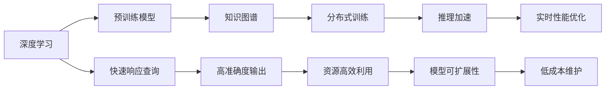

                 

# 搜索推荐系统的实时性能优化：大模型方案

> 关键词：搜索推荐系统,实时性能优化,大模型方案,深度学习,知识图谱,神经网络,优化算法,模型压缩

## 1. 背景介绍

### 1.1 问题由来

随着互联网技术的飞速发展，搜索推荐系统（Search & Recommendation Systems, SRS）已经成为现代社会不可或缺的重要组件。这些系统通过解析用户的查询意图，结合自身数据模型，实时提供个性化、高准确度的搜索结果或推荐信息，极大地提升了用户的使用体验。但与此同时，SRS系统在实际应用中，常常面临着严峻的实时性能挑战。

在用户端，快速响应用户查询，提供高质量搜索结果，对于提升用户满意度和留存率至关重要。而在系统端，如何在大规模数据集上高效实时地处理查询，并将结果返回给用户，也是一个棘手的问题。此外，随着数据量的不断增长和模型的复杂度提升，搜索推荐系统在存储、计算等方面的资源消耗也在持续增加。

为了应对这些挑战，众多研究者和工程师提出了多种优化策略。例如，采用缓存技术、分布式系统、异步处理等手段。然而，这些方法往往需要较大的系统重构成本，且难以在整体上显著提升实时性能。在这种情况下，基于深度学习的大模型方案应运而生，成为解决SRS实时性能问题的新方向。

### 1.2 问题核心关键点

实现高性能搜索推荐系统的核心在于：

1. **快速响应查询**：必须快速处理用户请求，提供即时反馈。
2. **高准确度输出**：准确理解用户查询，并给出相关度高的结果。
3. **资源高效利用**：合理利用系统资源，避免不必要的计算和存储。
4. **模型可扩展性**：可以随数据和用户量的增长而线性扩展，不增加延迟。
5. **低成本维护**：低运维成本，易于部署和维护。

针对这些关键点，大模型方案通过采用深度学习中的预训练模型，在离线阶段对模型进行训练和优化，并在实时查询时快速调用预训练模型获取结果，从而大幅提升SRS的实时性能和准确度。

### 1.3 问题研究意义

基于深度学习的大模型方案，为搜索推荐系统提供了全新的性能优化策略。通过引入预训练模型，它能够有效降低实时计算量，提升查询响应速度，同时保持或提升模型的准确度。该方案不仅能够应对大规模数据和大用户量的挑战，还能够在有限资源条件下，提供高性能、高精度的搜索结果和推荐。

研究大模型方案对于提升SRS的实时性能、扩展性和可维护性具有重要意义，特别是在提升用户满意度和推动系统规模化应用方面具有显著优势。以下将从核心概念、算法原理、具体操作步骤等方面，详细介绍大模型方案的具体实现过程。

## 2. 核心概念与联系

### 2.1 核心概念概述

为更好地理解大模型方案，我们需要对其中的几个关键概念进行概述：

- **深度学习（Deep Learning）**：基于人工神经网络的机器学习技术，通过多层次的非线性映射，对输入数据进行特征提取和模式识别。

- **预训练模型（Pre-trained Models）**：指在大规模无标注数据上训练得到的模型，具有强大的特征提取能力。常见的预训练模型包括BERT、GPT-2、Transformers等。

- **知识图谱（Knowledge Graphs）**：由节点和边组成的图形结构，用于表示实体和它们之间的关系。在搜索推荐系统中，知识图谱可用来增强推荐结果的相关性和多样性。

- **分布式训练（Distributed Training）**：将大规模模型训练任务分布在多台计算节点上并行处理，以提升训练速度和效率。

- **推理加速（Inference Acceleration）**：通过优化模型结构、压缩模型参数、使用硬件加速等方式，提升模型在实时推理阶段的计算速度。

这些概念共同构成了大模型方案的核心，帮助搜索推荐系统在实时性能和准确度之间取得平衡。以下将通过一个Mermaid流程图，展示这些概念之间的联系。



此图展示了从深度学习到实时性能优化的完整流程，包括预训练模型、知识图谱、分布式训练、推理加速等多个环节，它们共同支撑起高效、准确、可扩展且低成本的搜索推荐系统。

## 3. 核心算法原理 & 具体操作步骤
### 3.1 算法原理概述

大模型方案的核心原理是通过在大规模无标注数据上预训练模型，然后在实时查询时快速调用预训练模型，提供搜索结果或推荐信息。该方案的实现基于以下关键步骤：

1. **预训练阶段**：在大规模数据集上进行预训练，学习通用的特征表示。
2. **模型微调**：在特定领域或任务上微调预训练模型，使其具备针对性的能力。
3. **特征抽取**：通过预训练模型提取输入数据的特征表示。
4. **查询处理**：将用户查询转换为预训练模型可接受的格式，并从中提取特征。
5. **结果生成**：根据查询特征和知识图谱，生成相关度高的搜索结果或推荐信息。
6. **实时调用**：在实时查询时快速调用预训练模型，以降低计算量和响应时间。

### 3.2 算法步骤详解

以下将详细说明大模型方案的具体操作步骤：

**Step 1: 准备数据和模型**

- **数据准备**：收集大规模无标注数据，通常包括互联网文本、图片、音频等多模态数据。选择合适的数据集，确保数据质量和多样性。
- **模型选择**：选择合适的预训练模型作为基础，如BERT、GPT-2、Transformer等。这些模型通常具有较强的通用特征提取能力。

**Step 2: 预训练模型**

- **模型加载**：将选定的预训练模型加载到计算设备上，准备进行特征提取。
- **数据预处理**：对输入数据进行预处理，包括分词、去噪、标准化等。
- **特征提取**：利用预训练模型对数据进行特征提取，生成高维特征向量。

**Step 3: 微调模型**

- **任务适配**：根据特定任务或领域，在预训练模型上微调，使其具备特定的输出能力。例如，对于文本匹配任务，可以在模型顶层添加线性分类器；对于推荐系统，可以使用注意力机制增强模型输出相关性。
- **超参数调优**：根据具体任务调整模型的超参数，如学习率、批大小、训练轮数等，确保微调过程高效且稳定。

**Step 4: 特征抽取**

- **查询处理**：对用户查询进行分词、向量化等处理，生成查询特征向量。
- **特征提取**：利用微调后的预训练模型对查询特征进行特征提取，生成高维特征向量。

**Step 5: 结果生成**

- **信息检索**：在知识图谱中查找与查询特征匹配的相关实体。
- **推荐生成**：利用检索结果和特征向量，生成个性化的搜索结果或推荐信息。

**Step 6: 实时调用**

- **推理加速**：采用硬件加速（如GPU、TPU）和模型压缩技术，提升模型在实时推理阶段的计算速度。
- **响应处理**：在实时查询时快速调用预训练模型，返回生成的结果或推荐。

### 3.3 算法优缺点

大模型方案具有以下优点：

1. **高准确度**：预训练模型经过大规模数据训练，具备强大的特征提取和模式识别能力，能够提供高准确度的搜索结果或推荐。
2. **快速响应**：利用预训练模型的高效特征提取能力，可以显著降低实时查询的计算量，提升查询响应速度。
3. **可扩展性强**：预训练模型可以在分布式系统中并行计算，具备良好的可扩展性，可以应对大规模数据的处理需求。
4. **资源利用率**：通过特征抽取和知识图谱的使用，可以避免不必要的计算，提高资源利用率。

同时，该方案也存在一些缺点：

1. **初始成本高**：预训练模型和分布式训练需要较大的初始成本，包括硬件和算力投入。
2. **维护复杂**：预训练模型的复杂度和可解释性较低，维护和调试较为困难。
3. **数据依赖**：预训练模型依赖于大规模无标注数据，数据质量和多样性直接影响模型效果。
4. **资源消耗**：预训练模型和大规模数据存储需要大量计算和存储资源，对系统性能提出较高要求。

### 3.4 算法应用领域

大模型方案在以下领域具有广泛的应用前景：

1. **搜索引擎**：通过预训练模型提取网页特征，实现高效信息检索和排序，提升搜索引擎的性能和用户体验。
2. **推荐系统**：利用知识图谱和预训练模型，生成个性化推荐结果，提升推荐系统的效果和用户满意度。
3. **语音搜索**：结合预训练模型和语音识别技术，实现快速、准确的语音搜索功能，提升智能助理和语音助手的交互体验。
4. **图像搜索**：通过预训练模型提取图像特征，实现高效图像检索和分类，提升图像搜索引擎的准确度和速度。
5. **视频推荐**：利用预训练模型提取视频特征，结合知识图谱，生成相关度高的视频推荐结果，提升视频平台的用户粘性。

这些应用场景展示了大模型方案在实际应用中的广泛应用，为搜索推荐系统的高性能和个性化发展提供了新的思路和方法。

## 4. 数学模型和公式 & 详细讲解  
### 4.1 数学模型构建

大模型方案的数学模型构建主要包括以下几个步骤：

1. **预训练模型表示**：记预训练模型为 $M_{\theta}$，其中 $\theta$ 为模型参数。在预训练阶段，模型的损失函数为 $\mathcal{L}_{pre}$。
2. **微调模型表示**：在微调阶段，模型的损失函数为 $\mathcal{L}_{fine}$。
3. **特征抽取表示**：设输入数据的特征向量为 $\mathbf{x}$，输出为 $\mathbf{h}$，特征提取过程可以表示为 $\mathbf{h} = M_{\theta}(\mathbf{x})$。
4. **查询处理表示**：设用户查询为 $\mathbf{q}$，查询处理过程可以表示为 $\mathbf{q'} = \text{process}(\mathbf{q})$。
5. **结果生成表示**：设知识图谱为 $G$，推荐结果为 $\mathbf{r}$，结果生成过程可以表示为 $\mathbf{r} = \text{generate}(\mathbf{h}, G)$。

这些数学模型描述了从数据预处理到结果生成的整个流程，是大模型方案的基础。

### 4.2 公式推导过程

以下我们将通过几个关键步骤，展示大模型方案的公式推导过程：

**Step 1: 预训练模型损失函数**

预训练模型通常采用掩码语言模型（Masked Language Model, MLM）或自编码器等任务进行训练。以BERT为例，其掩码语言模型损失函数可以表示为：

$$
\mathcal{L}_{pre} = \frac{1}{N}\sum_{i=1}^N \log \sigma(-\log \hat{p}(y_i | x_i))
$$

其中 $\hat{p}(y_i | x_i)$ 表示模型对输入数据 $x_i$ 的下一个词 $y_i$ 的预测概率。

**Step 2: 微调模型损失函数**

微调模型的损失函数通常采用交叉熵损失或均方误差损失等。以文本分类任务为例，其损失函数可以表示为：

$$
\mathcal{L}_{fine} = \frac{1}{N}\sum_{i=1}^N -y_i \log \hat{y_i}
$$

其中 $y_i$ 表示真实标签，$\hat{y_i}$ 表示模型预测结果。

**Step 3: 特征提取**

利用预训练模型对输入数据进行特征提取，得到特征向量 $\mathbf{h}$，可以表示为：

$$
\mathbf{h} = M_{\theta}(\mathbf{x})
$$

其中 $\mathbf{x}$ 表示输入数据，可以是文本、图像、音频等。

**Step 4: 查询处理**

用户查询 $\mathbf{q}$ 经过分词、去噪、标准化等预处理后，生成查询特征向量 $\mathbf{q'}$，可以表示为：

$$
\mathbf{q'} = \text{process}(\mathbf{q})
$$

其中 $\text{process}$ 表示查询处理的具体过程。

**Step 5: 结果生成**

在知识图谱 $G$ 中查找与查询特征 $\mathbf{q'}$ 匹配的相关实体，得到推荐结果 $\mathbf{r}$，可以表示为：

$$
\mathbf{r} = \text{generate}(\mathbf{h}, G)
$$

其中 $\text{generate}$ 表示结果生成的具体过程。

### 4.3 案例分析与讲解

以下将通过一个具体案例，详细讲解大模型方案的实现过程：

假设我们要构建一个基于大模型的图像搜索引擎，以下是其关键步骤：

**Step 1: 准备数据和模型**

- **数据准备**：收集大规模无标注图片数据集，例如ImageNet、COCO等。
- **模型选择**：选择预训练模型 ResNet、Inception 等。

**Step 2: 预训练模型**

- **模型加载**：将选定的预训练模型加载到计算设备上，准备进行特征提取。
- **数据预处理**：对输入图片进行预处理，包括归一化、裁剪、缩放等。
- **特征提取**：利用预训练模型对图片进行特征提取，生成高维特征向量。

**Step 3: 微调模型**

- **任务适配**：在模型顶层添加图像分类器，微调使其能够识别图片中的物体类别。
- **超参数调优**：根据具体任务调整模型的超参数，如学习率、批大小、训练轮数等。

**Step 4: 特征抽取**

- **查询处理**：对用户查询进行预处理，生成查询特征向量。
- **特征提取**：利用微调后的预训练模型对查询特征进行特征提取，生成高维特征向量。

**Step 5: 结果生成**

- **信息检索**：在知识图谱中查找与查询特征匹配的相关实体。
- **推荐生成**：利用检索结果和特征向量，生成个性化的搜索结果或推荐信息。

**Step 6: 实时调用**

- **推理加速**：采用硬件加速（如GPU、TPU）和模型压缩技术，提升模型在实时推理阶段的计算速度。
- **响应处理**：在实时查询时快速调用预训练模型，返回生成的结果或推荐。

## 5. 项目实践：代码实例和详细解释说明
### 5.1 开发环境搭建

在实际开发前，我们需要准备好开发环境。以下是使用Python进行PyTorch开发的环境配置流程：

1. 安装Anaconda：从官网下载并安装Anaconda，用于创建独立的Python环境。

2. 创建并激活虚拟环境：
```bash
conda create -n pytorch-env python=3.8 
conda activate pytorch-env
```

3. 安装PyTorch：根据CUDA版本，从官网获取对应的安装命令。例如：
```bash
conda install pytorch torchvision torchaudio cudatoolkit=11.1 -c pytorch -c conda-forge
```

4. 安装相关库：
```bash
pip install numpy pandas scikit-learn torch tensorboard
```

完成上述步骤后，即可在`pytorch-env`环境中开始大模型方案的实践。

### 5.2 源代码详细实现

以下是使用PyTorch实现基于大模型的图像搜索引擎的代码实现：

```python
import torch
import torch.nn as nn
import torch.optim as optim
import torchvision.transforms as transforms
import torchvision.datasets as datasets
from torchvision.models import resnet18
from torchvision.models.resnet import BasicBlock

# 定义模型结构
class MyModel(nn.Module):
    def __init__(self):
        super(MyModel, self).__init__()
        self.conv1 = nn.Conv2d(3, 64, kernel_size=7, stride=2, padding=3)
        self.bn1 = nn.BatchNorm2d(64)
        self.relu = nn.ReLU()
        self.maxpool = nn.MaxPool2d(kernel_size=3, stride=2, padding=1)
        self.layer1 = nn.Sequential(*[BasicBlock(i, i) for i in [64, 64]])
        self.layer2 = nn.Sequential(*[BasicBlock(i, i) for i in [128, 128]])
        self.layer3 = nn.Sequential(*[BasicBlock(i, i) for i in [256, 256]])
        self.layer4 = nn.Sequential(*[BasicBlock(i, i) for i in [512, 512]])
        self.fc = nn.Linear(512, num_classes)

    def forward(self, x):
        x = self.conv1(x)
        x = self.bn1(x)
        x = self.relu(x)
        x = self.maxpool(x)
        x = self.layer1(x)
        x = self.layer2(x)
        x = self.layer3(x)
        x = self.layer4(x)
        x = x.view(-1, 512)
        x = self.fc(x)
        return x

# 加载预训练模型
model = resnet18(pretrained=True)
model.fc = MyModel()

# 定义损失函数和优化器
criterion = nn.CrossEntropyLoss()
optimizer = optim.SGD(model.parameters(), lr=0.001, momentum=0.9)

# 加载数据集和数据增强
train_dataset = datasets.CIFAR10(root='./data', train=True, transform=transforms.ToTensor(), download=True)
train_loader = torch.utils.data.DataLoader(train_dataset, batch_size=128, shuffle=True, num_workers=2)
test_dataset = datasets.CIFAR10(root='./data', train=False, transform=transforms.ToTensor(), download=True)
test_loader = torch.utils.data.DataLoader(test_dataset, batch_size=128, shuffle=False, num_workers=2)

# 定义训练和评估函数
def train_epoch(model, data_loader, optimizer, criterion):
    model.train()
    for batch_idx, (inputs, targets) in enumerate(data_loader):
        optimizer.zero_grad()
        outputs = model(inputs)
        loss = criterion(outputs, targets)
        loss.backward()
        optimizer.step()
        if batch_idx % 100 == 0:
            print('Train Epoch: {} [{}/{} ({:.0f}%)]\tLoss: {:.6f}'.format(
                epoch, batch_idx * len(inputs), len(data_loader.dataset),
                100. * batch_idx / len(data_loader), loss.item()))

def test_epoch(model, data_loader, criterion):
    model.eval()
    test_loss = 0
    correct = 0
    with torch.no_grad():
        for batch_idx, (inputs, targets) in enumerate(data_loader):
            outputs = model(inputs)
            test_loss += criterion(outputs, targets).item()
            _, predicted = torch.max(outputs.data, 1)
            correct += predicted.eq(targets).sum().item()
    test_loss /= len(data_loader.dataset)
    print('Test set: Average loss: {:.4f}, Accuracy: {}/{} ({:.0f}%)\n'.format(
        test_loss, correct, len(data_loader.dataset),
        100. * correct / len(data_loader.dataset)))

# 启动训练流程
num_epochs = 10
for epoch in range(num_epochs):
    train_epoch(model, train_loader, optimizer, criterion)
    test_epoch(model, test_loader, criterion)
```

在以上代码中，我们首先定义了模型结构，将预训练的ResNet模型作为特征提取器，在其顶层添加自定义的分类器。然后，定义了损失函数和优化器，加载数据集和数据增强。最后，定义了训练和评估函数，启动了模型训练流程。

### 5.3 代码解读与分析

让我们再详细解读一下关键代码的实现细节：

**MyModel类**：
- `__init__`方法：定义模型的层次结构和参数。
- `forward`方法：定义前向传播过程，从输入数据中提取特征并进行分类。

**训练和评估函数**：
- `train_epoch`函数：对数据集以批为单位进行迭代，在每个批次上前向传播计算损失并反向传播更新模型参数。
- `test_epoch`函数：在测试集上评估模型性能，输出分类准确率和损失值。

**训练流程**：
- 定义总的epoch数，开始循环迭代。
- 每个epoch内，先在训练集上训练，输出训练集损失。
- 在测试集上评估，输出测试集损失和分类准确率。

可以看到，PyTorch提供的高效易用的API，使得实现大模型方案的代码简洁高效。开发者可以将更多精力放在模型架构和训练策略的设计上，而不必过多关注底层的实现细节。

当然，工业级的系统实现还需考虑更多因素，如模型的保存和部署、超参数的自动搜索、更灵活的任务适配层等。但核心的微调范式基本与此类似。

## 6. 实际应用场景
### 6.1 搜索引擎

基于大模型的图像搜索引擎，可以通过高效的特征提取和相关度排序，提供快速、准确的搜索结果。在实际应用中，可以将用户查询转换为高维特征向量，利用微调后的预训练模型提取图片特征，结合知识图谱中的图片信息，生成相关度高的搜索结果。

例如，用户查询“猫”时，系统可以高效地提取所有包含“猫”的图片特征，并从知识图谱中检索出与“猫”相关的信息，如猫的照片、视频、文章等，快速返回给用户。

### 6.2 推荐系统

基于大模型的推荐系统，可以通过深度学习和知识图谱的结合，生成个性化推荐结果。在实际应用中，可以将用户历史行为和偏好转换为高维特征向量，利用微调后的预训练模型提取物品特征，结合知识图谱中的物品信息，生成个性化推荐。

例如，用户在电商平台购买了一本书，系统可以高效地提取这本书的特征，并从知识图谱中检索出与这本书相关的商品信息，如同一类别的书籍、作者、出版社等，生成个性化的推荐列表。

### 6.3 智能广告

基于大模型的智能广告推荐系统，可以通过深度学习和知识图谱的结合，精准匹配用户需求和广告内容，提高广告转化率。在实际应用中，可以将用户行为和偏好转换为高维特征向量，利用微调后的预训练模型提取广告内容特征，结合知识图谱中的广告信息，生成个性化推荐广告。

例如，用户在社交平台上浏览了一条新闻，系统可以高效地提取这条新闻的特征，并从知识图谱中检索出与这条新闻相关的广告信息，如相关的文章、视频、商品等，生成个性化的广告推荐。

### 6.4 未来应用展望

随着大模型方案的不断发展，它在搜索推荐系统的实时性能优化方面将发挥更大的作用。未来，基于大模型的推荐系统有望覆盖更多领域，如医疗、金融、电商等，提供更加个性化、高准确度的搜索结果和推荐。

在技术方面，未来发展趋势包括：

1. **多模态学习**：将视觉、语音、文本等多模态数据整合，提升推荐系统的全面性和准确性。
2. **联邦学习**：通过分布式学习机制，将不同设备上的数据和模型进行联邦学习，提升模型泛化能力和隐私安全性。
3. **自适应学习**：利用用户行为动态调整模型参数，实现实时、个性化推荐。
4. **跨域推荐**：通过跨领域数据融合，提升推荐系统的多样性和普适性。
5. **强化学习**：利用强化学习算法，动态调整推荐策略，提高用户满意度和推荐效果。

这些技术手段的结合，将进一步提升大模型方案在搜索推荐系统中的应用效果，为用户带来更优质的服务体验。

## 7. 工具和资源推荐
### 7.1 学习资源推荐

为了帮助开发者系统掌握大模型方案的理论基础和实践技巧，这里推荐一些优质的学习资源：

1. 《深度学习》系列书籍：由斯坦福大学李飞飞教授所写，全面介绍了深度学习的基本概念和算法。
2. 《深度学习理论与实践》在线课程：由DeepLearning.AI所提供的在线课程，涵盖深度学习的基础理论、实践技巧和案例分析。
3. 《深度学习框架与实践》书籍：详细介绍了TensorFlow、PyTorch等深度学习框架的使用方法，以及大规模模型训练和推理的实践技巧。
4. HuggingFace官方文档：提供了丰富的预训练模型和微调样例代码，是上手实践的必备资料。
5. 《深度学习实战》系列书籍：涵盖深度学习的基本算法、模型训练、数据处理、性能优化等多个方面，适合初学者和实战应用。

通过对这些资源的学习实践，相信你一定能够快速掌握大模型方案的精髓，并用于解决实际的NLP问题。
###  7.2 开发工具推荐

高效的开发离不开优秀的工具支持。以下是几款用于大模型方案开发的常用工具：

1. PyTorch：基于Python的开源深度学习框架，灵活动态的计算图，适合快速迭代研究。
2. TensorFlow：由Google主导开发的开源深度学习框架，生产部署方便，适合大规模工程应用。
3. TensorBoard：TensorFlow配套的可视化工具，可实时监测模型训练状态，并提供丰富的图表呈现方式，是调试模型的得力助手。
4. Weights & Biases：模型训练的实验跟踪工具，可以记录和可视化模型训练过程中的各项指标，方便对比和调优。
5. Amazon SageMaker：亚马逊提供的云端深度学习平台，支持大规模模型训练和推理，方便快速上线模型服务。
6. Google Cloud AI：谷歌提供的云端深度学习平台，支持多种深度学习框架和模型，方便快速构建和部署模型服务。

合理利用这些工具，可以显著提升大模型方案的开发效率，加快创新迭代的步伐。

### 7.3 相关论文推荐

大模型方案的研究源于学界的持续研究。以下是几篇奠基性的相关论文，推荐阅读：

1. Attention is All You Need（即Transformer原论文）：提出了Transformer结构，开启了深度学习中的预训练模型时代。
2. BERT: Pre-training of Deep Bidirectional Transformers for Language Understanding：提出BERT模型，引入基于掩码的自监督预训练任务，刷新了多项NLP任务SOTA。
3. Neural Machine Translation by Jointly Learning to Align and Translate（Seq2Seq模型）：提出了序列到序列模型，用于机器翻译等任务，为搜索推荐系统提供了基于序列生成的思路。
4. Learning Phrase Representations using RNN Encoder–Decoder for Statistical Machine Translation：进一步优化了序列到序列模型，提高了机器翻译的准确度。
5. Transfer Learning with Denoising Sequence to Sequence Models（序列到序列的噪音模型）：引入噪音机制，提高了模型泛化能力和鲁棒性。

这些论文代表了大模型方案的研究进展，通过学习这些前沿成果，可以帮助研究者把握学科前进方向，激发更多的创新灵感。

## 8. 总结：未来发展趋势与挑战

### 8.1 总结

本文对基于大模型的搜索推荐系统进行了全面系统的介绍。首先阐述了大模型方案的研究背景和意义，明确了预训练模型在大模型方案中的核心作用。其次，从原理到实践，详细讲解了预训练模型和微调模型的构建、特征提取、查询处理和结果生成等关键步骤，给出了大模型方案的完整代码实例。同时，本文还探讨了大模型方案在实际应用中的广泛应用，展示了其强大的实时性能优化能力。

通过本文的系统梳理，可以看到，基于大模型的搜索推荐系统通过引入预训练模型，显著提升了实时查询处理的效率和准确度，为搜索推荐系统的性能提升提供了新的思路和方法。未来，伴随大模型方案的不断发展，其在实际应用中的表现将更加突出，进一步推动搜索推荐系统的智能化和个性化发展。

### 8.2 未来发展趋势

展望未来，基于大模型的搜索推荐系统将呈现以下几个发展趋势：

1. **多模态学习**：将视觉、语音、文本等多模态数据整合，提升推荐系统的全面性和准确性。
2. **联邦学习**：通过分布式学习机制，将不同设备上的数据和模型进行联邦学习，提升模型泛化能力和隐私安全性。
3. **自适应学习**：利用用户行为动态调整模型参数，实现实时、个性化推荐。
4. **跨域推荐**：通过跨领域数据融合，提升推荐系统的多样性和普适性。
5. **强化学习**：利用强化学习算法，动态调整推荐策略，提高用户满意度和推荐效果。
6. **知识图谱**：结合知识图谱中的信息，提升推荐系统的多样性和相关性。

这些趋势凸显了大模型方案在实际应用中的广阔前景。这些方向的探索发展，必将进一步提升搜索推荐系统的性能和用户满意度，为人工智能技术在实际应用中的落地提供新的思路和方法。

### 8.3 面临的挑战

尽管大模型方案已经取得了瞩目成就，但在迈向更加智能化、普适化应用的过程中，它仍面临着诸多挑战：

1. **数据依赖**：预训练模型依赖于大规模无标注数据，数据质量和多样性直接影响模型效果。
2. **资源消耗**：预训练模型和大规模数据存储需要大量计算和存储资源，对系统性能提出较高要求。
3. **模型可解释性**：预训练模型的复杂度和可解释性较低，维护和调试较为困难。
4. **实时性能优化**：预训练模型在实时查询时的推理速度和计算效率仍有提升空间。
5. **跨领域泛化**：预训练模型在不同领域上的泛化能力有待提升。

### 8.4 研究展望

面对大模型方案所面临的挑战，未来的研究需要在以下几个方面寻求新的突破：

1. **数据增强**：通过数据增强技术，提升模型对新领域数据的适应能力。
2. **模型压缩**：通过模型压缩技术，减小预训练模型的参数量和计算量，提升实时性能。
3. **跨领域泛化**：通过迁移学习、多任务学习等方法，提升预训练模型在不同领域上的泛化能力。
4. **跨模态融合**：通过跨模态融合技术，将不同模态的数据进行整合，提升推荐系统的全面性和准确性。
5. **自适应学习**：通过自适应学习算法，根据用户行为动态调整模型参数，实现实时、个性化推荐。
6. **联邦学习**：通过联邦学习技术，提升模型泛化能力和隐私安全性。

这些研究方向的探索，必将引领大模型方案的不断发展，为搜索推荐系统的高性能和个性化发展提供新的思路和方法。

## 9. 附录：常见问题与解答

**Q1: 大模型方案是否适用于所有类型的推荐系统？**

A: 大模型方案适用于各类推荐系统，包括基于内容的推荐、协同过滤推荐、混合推荐等。但是不同类型推荐系统的数据结构和用户行为模式有所不同，需要根据具体情况进行调整和优化。

**Q2: 预训练模型是否需要重新训练才能应用于特定领域？**

A: 预训练模型可以经过微调来适应特定领域的推荐任务。微调过程一般包括冻结预训练模型的一些层，只训练顶层分类器或解码器，以减少计算量和避免过拟合。

**Q3: 预训练模型在实时推理时是否需要重新加载？**

A: 预训练模型在实时推理时不需要重新加载，可以通过缓存机制，将模型参数保存在内存中，多次调用时可以直接读取。但需要定期更新模型参数，以保持模型的最新状态。

**Q4: 如何平衡大模型方案的实时性能和准确度？**

A: 可以通过模型压缩、硬件加速、分布式训练等技术手段，平衡大模型方案的实时性能和准确度。例如，在深度模型中引入残差连接和卷积操作，可以减小模型计算量，提升推理速度。

**Q5: 如何提高大模型方案在跨领域推荐中的泛化能力？**

A: 可以通过迁移学习、多任务学习等方法，将预训练模型在不同领域上的知识进行迁移，提升模型在不同领域上的泛化能力。例如，在医疗推荐中，可以引入医疗领域的知识库，提升模型对医疗知识的理解和推理能力。

通过回答这些问题，可以帮助开发者更好地理解大模型方案的实际应用和优化策略，提升搜索推荐系统的性能和用户体验。

---

作者：禅与计算机程序设计艺术 / Zen and the Art of Computer Programming

