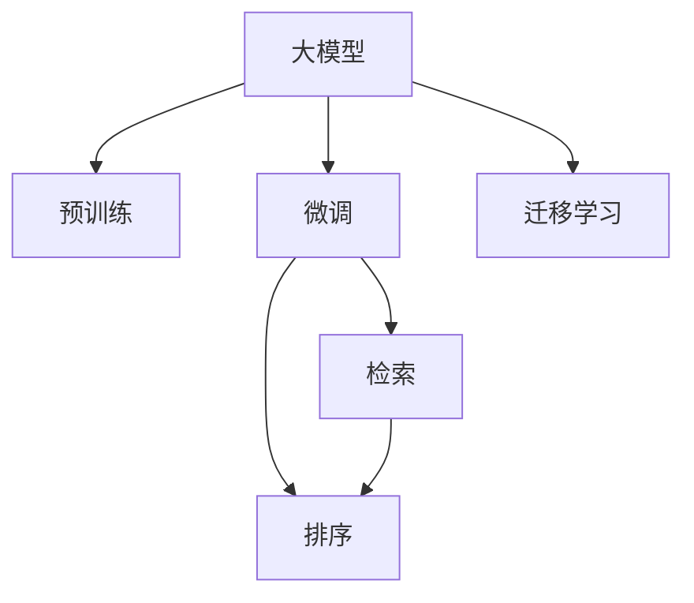

                 

## 1. 背景介绍

### 1.1 问题由来

随着信息技术的迅猛发展，互联网产生了海量的数据，给人们带来了前所未有的便利。然而，这些数据中包含了丰富的个性化信息，如何高效地搜索并推荐感兴趣的内容，成为了一个迫切需要解决的问题。传统的基于规则和统计的方法无法适应大规模数据，搜索推荐系统亟需引入新的技术手段。

### 1.2 问题核心关键点

近年来，深度学习技术在搜索推荐领域取得了显著进展，尤其是利用深度神经网络对用户行为数据进行建模，从而实现了个性化的推荐。然而，深度学习方法也存在计算资源消耗大、难以解释等缺点，限制了其在实际应用中的推广。大模型（如BERT、GPT等）的出现，以其巨大的参数量和强大的表达能力，为搜索推荐系统带来了新的突破。

大模型在预训练阶段利用大规模无标签数据进行训练，获取了丰富的语言知识和统计规律。通过微调大模型，可以将其应用于特定领域的搜索推荐任务，显著提升模型的精度和泛化能力。在实际应用中，大模型的微调模型常常具有更强的表达能力、更高的计算效率和更广泛的适用性，使得搜索推荐系统具备更强的个性化和智能化水平。

## 2. 核心概念与联系

### 2.1 核心概念概述

为更好地理解大模型在搜索推荐系统中的应用，本节将介绍几个密切相关的核心概念：

- 大模型（Large Model）：指具有大规模参数量的深度神经网络模型，如BERT、GPT-3等。通过在无标签数据上进行预训练，大模型可以学习到丰富的语义知识，具备强大的语言理解能力。

- 预训练（Pre-training）：指在无标签数据上训练模型，利用自监督学习任务获取模型的通用知识。预训练技术已成为深度学习模型的重要组成部分。

- 微调（Fine-tuning）：指在预训练模型基础上，使用特定任务的数据对其进行训练，使其适应该任务，提升模型在该任务上的性能。

- 迁移学习（Transfer Learning）：指将模型在一种任务上的知识迁移到另一种相关任务中。大模型的预训练和微调都是典型的迁移学习范式。

- 检索（Retrieval）：指在文档集合中查找与查询最相关的文档。检索技术在大规模数据下的个性化推荐中占有重要地位。

- 排序（Ranking）：指对检索结果进行排序，筛选出最符合用户需求的文档。排序模型通常利用深度学习技术进行训练。

这些概念之间的逻辑关系可以通过以下Mermaid流程图来展示：



这个流程图展示了大模型的核心概念及其之间的关系：

1. 大模型通过预训练获得基础能力。
2. 微调使模型适应特定任务，提升任务表现。
3. 检索和排序技术实现个性化推荐。
4. 迁移学习将大模型应用于搜索推荐。

这些概念共同构成了搜索推荐系统的工作原理和优化方向。

## 3. 核心算法原理 & 具体操作步骤
### 3.1 算法原理概述

基于大模型的搜索推荐系统，本质上是一种利用深度学习的检索和排序技术，实现个性化推荐的系统。其核心思想是：利用大模型学习用户行为数据的隐含规律，在搜索和推荐环节实现高效、准确的个性化匹配。

具体来说，大模型在预训练阶段通过自监督任务学习语言知识，并在微调阶段利用标注数据进行特定任务的优化。检索阶段，系统首先对用户查询进行编码，然后对文档集合中的文档进行编码，计算查询与文档的相似度。排序阶段，系统对检索结果进行排序，选出最符合用户需求的文档，并展示给用户。

### 3.2 算法步骤详解

基于大模型的搜索推荐系统一般包括以下几个关键步骤：

**Step 1: 准备预训练模型和数据集**
- 选择合适的预训练语言模型 $M_{\theta}$ 作为初始化参数，如 BERT、GPT-3等。
- 准备训练集 $D_{train}$ 和测试集 $D_{test}$，一般要求标注数据与预训练数据的分布不要差异过大。

**Step 2: 定义检索和排序模型**
- 根据任务类型，在预训练模型顶层设计合适的检索和排序模型。
- 检索模型通常使用序列编码器（如Transformer）进行文本表示，计算查询与文档的相似度。
- 排序模型则使用分类器（如MLP、LSTM等）对检索结果进行排序。

**Step 3: 设置微调超参数**
- 选择合适的优化算法及其参数，如 Adam、SGD 等，设置学习率、批大小、迭代轮数等。
- 设置正则化技术及强度，包括权重衰减、Dropout、Early Stopping等。
- 确定冻结预训练参数的策略，如仅微调顶层，或全部参数都参与微调。

**Step 4: 执行梯度训练**
- 将训练集数据分批次输入模型，前向传播计算检索结果和排序结果。
- 反向传播计算参数梯度，根据设定的优化算法和学习率更新模型参数。
- 周期性在测试集上评估模型性能，根据性能指标决定是否触发 Early Stopping。
- 重复上述步骤直到满足预设的迭代轮数或 Early Stopping 条件。

**Step 5: 测试和部署**
- 在测试集上评估微调后模型 $M_{\hat{\theta}}$ 的性能，对比微调前后的精度提升。
- 使用微调后的模型对新样本进行推理预测，集成到实际的应用系统中。
- 持续收集新的数据，定期重新微调模型，以适应数据分布的变化。

以上是基于大模型的搜索推荐系统的一般流程。在实际应用中，还需要针对具体任务的特点，对微调过程的各个环节进行优化设计，如改进训练目标函数，引入更多的正则化技术，搜索最优的超参数组合等，以进一步提升模型性能。

### 3.3 算法优缺点

基于大模型的搜索推荐系统具有以下优点：

1. 高效性：大模型强大的表达能力使得检索和排序过程更为高效。
2. 鲁棒性：大模型具备较强的泛化能力，能够在不同领域和数据分布下保持稳定性能。
3. 可扩展性：大模型可以通过微调技术，快速适应新的推荐场景和需求。
4. 个性化：大模型可以捕捉用户行为的复杂规律，提供高度个性化的推荐结果。
5. 实时性：基于大模型的推荐系统可以实现实时动态推荐。

同时，该方法也存在一些局限性：

1. 数据需求高：微调过程依赖于大量的标注数据，标注成本较高。
2. 计算资源消耗大：大模型需要大规模的计算资源进行训练和推理。
3. 模型复杂度高：大模型的参数量和结构复杂度较高，难以解释和调试。
4. 泛化能力有限：在测试样本的分布与训练集差异较大时，性能可能受到影响。

尽管存在这些局限性，但就目前而言，基于大模型的搜索推荐系统已成为一种主流技术范式，具有广阔的应用前景。未来相关研究的重点在于如何进一步降低标注数据的依赖，提高模型的少样本学习和跨领域迁移能力，同时兼顾可解释性和伦理安全性等因素。

### 3.4 算法应用领域

基于大模型的搜索推荐系统已经广泛应用于多个领域，例如：

- 电子商务：通过分析用户的浏览记录和购物行为，为用户推荐商品。
- 新闻阅读：根据用户的阅读习惯，推荐感兴趣的新闻文章。
- 视频推荐：根据用户观看的视频内容，推荐相关的视频或电影。
- 音乐推荐：根据用户听歌习惯，推荐相似或流行的音乐。
- 社交媒体：根据用户互动行为，推荐相关的内容和用户。

除了上述这些经典任务外，基于大模型的搜索推荐系统还被创新性地应用到更多场景中，如个性化广告、内容推荐、健康医疗、旅游旅游等领域，为这些行业带来了新的增长点。随着预训练模型和微调方法的不断进步，搜索推荐系统必将在更广阔的应用领域大放异彩。

## 4. 数学模型和公式 & 详细讲解 & 举例说明

### 4.1 数学模型构建

本节将使用数学语言对基于大模型的搜索推荐过程进行更加严格的刻画。

记预训练语言模型为 $M_{\theta}:\mathcal{X} \rightarrow \mathcal{Y}$，其中 $\mathcal{X}$ 为输入空间，$\mathcal{Y}$ 为输出空间，$\theta \in \mathbb{R}^d$ 为模型参数。假设推荐系统的训练集为 $D_{train}=\{(x_i,y_i)\}_{i=1}^N, x_i \in \mathcal{X}, y_i \in \mathcal{Y}$。

定义检索模型 $R_{\theta}:\mathcal{X} \times \mathcal{D} \rightarrow \mathbb{R}$，其中 $\mathcal{D}$ 为文档集合，$R_{\theta}(x,d)$ 表示模型对查询 $x$ 和文档 $d$ 的相似度评分。

定义排序模型 $S_{\theta}:\mathcal{X} \times \mathcal{Y} \rightarrow [0,1]$，其中 $S_{\theta}(x,y)$ 表示模型对查询 $x$ 和文档 $d$ 排序的得分。

检索排序模型的总体损失函数为：

$$
\mathcal{L}(\theta) = \frac{1}{N}\sum_{i=1}^N [\ell(R_{\theta}(x_i,d_i),y_i) + \ell(S_{\theta}(x_i,d_i),y_i)]
$$

其中 $\ell$ 为检索模型和排序模型的损失函数，可以是交叉熵、均方误差等。

### 4.2 公式推导过程

以下我们以二分类检索和排序任务为例，推导检索排序模型的损失函数及其梯度的计算公式。

假设检索模型的输出为 $R_{\theta}(x,d) \in [0,1]$，表示查询 $x$ 和文档 $d$ 的相似度得分。真实标签 $y \in \{0,1\}$，表示文档 $d$ 是否为用户感兴趣。则二分类交叉熵损失函数定义为：

$$
\ell(R_{\theta}(x,d),y) = -[y\log R_{\theta}(x,d) + (1-y)\log (1-R_{\theta}(x,d))]
$$

将其代入总体损失函数，得：

$$
\mathcal{L}(\theta) = -\frac{1}{N}\sum_{i=1}^N [\ell(R_{\theta}(x_i,d_i),y_i) + \ell(S_{\theta}(x_i,d_i),y_i)]
$$

根据链式法则，损失函数对参数 $\theta$ 的梯度为：

$$
\frac{\partial \mathcal{L}(\theta)}{\partial \theta} = -\frac{1}{N}\sum_{i=1}^N [(\frac{y_i}{R_{\theta}(x_i,d_i)}-\frac{1-y_i}{1-R_{\theta}(x_i,d_i)})\frac{\partial R_{\theta}(x_i,d_i)}{\partial \theta} + (\frac{y_i}{S_{\theta}(x_i,d_i)}-\frac{1-y_i}{1-S_{\theta}(x_i,d_i)})\frac{\partial S_{\theta}(x_i,d_i)}{\partial \theta}]
$$

其中 $\frac{\partial R_{\theta}(x_i,d_i)}{\partial \theta}$ 和 $\frac{\partial S_{\theta}(x_i,d_i)}{\partial \theta}$ 分别表示检索模型和排序模型的梯度，可以通过反向传播算法计算得到。

在得到损失函数的梯度后，即可带入参数更新公式，完成模型的迭代优化。重复上述过程直至收敛，最终得到适应推荐任务的最优模型参数 $\theta^*$。

## 5. 项目实践：代码实例和详细解释说明
### 5.1 开发环境搭建

在进行大模型微调的搜索推荐系统开发中，需要准备好以下开发环境：

1. 安装Anaconda：从官网下载并安装Anaconda，用于创建独立的Python环境。

2. 创建并激活虚拟环境：
```bash
conda create -n search-recommender python=3.8 
conda activate search-recommender
```

3. 安装PyTorch：根据CUDA版本，从官网获取对应的安装命令。例如：
```bash
conda install pytorch torchvision torchaudio cudatoolkit=11.1 -c pytorch -c conda-forge
```

4. 安装HuggingFace Transformers库：
```bash
pip install transformers
```

5. 安装各类工具包：
```bash
pip install numpy pandas scikit-learn matplotlib tqdm jupyter notebook ipython
```

完成上述步骤后，即可在`search-recommender`环境中开始搜索推荐系统的微调实践。

### 5.2 源代码详细实现

下面以基于大模型的二分类检索排序任务为例，给出使用Transformers库对BERT模型进行微调的PyTorch代码实现。

首先，定义检索排序模型的数据处理函数：

```python
from transformers import BertTokenizer
from torch.utils.data import Dataset
import torch

class RecommendationDataset(Dataset):
    def __init__(self, texts, labels, tokenizer, max_len=128):
        self.texts = texts
        self.labels = labels
        self.tokenizer = tokenizer
        self.max_len = max_len
        
    def __len__(self):
        return len(self.texts)
    
    def __getitem__(self, item):
        text = self.texts[item]
        label = self.labels[item]
        
        encoding = self.tokenizer(text, return_tensors='pt', max_length=self.max_len, padding='max_length', truncation=True)
        input_ids = encoding['input_ids'][0]
        attention_mask = encoding['attention_mask'][0]
        
        # 将标签进行编码
        encoded_labels = [label2id[label] for label in labels] 
        encoded_labels.extend([label2id['O']] * (self.max_len - len(encoded_labels)))
        labels = torch.tensor(encoded_labels, dtype=torch.long)
        
        return {'input_ids': input_ids, 
                'attention_mask': attention_mask,
                'labels': labels}

# 标签与id的映射
label2id = {'O': 0, 'Positive': 1}
id2label = {v: k for k, v in label2id.items()}

# 创建dataset
tokenizer = BertTokenizer.from_pretrained('bert-base-cased')

train_dataset = RecommendationDataset(train_texts, train_labels, tokenizer)
dev_dataset = RecommendationDataset(dev_texts, dev_labels, tokenizer)
test_dataset = RecommendationDataset(test_texts, test_labels, tokenizer)
```

然后，定义模型和优化器：

```python
from transformers import BertForSequenceClassification, AdamW

model = BertForSequenceClassification.from_pretrained('bert-base-cased', num_labels=len(label2id))

optimizer = AdamW(model.parameters(), lr=2e-5)
```

接着，定义训练和评估函数：

```python
from torch.utils.data import DataLoader
from tqdm import tqdm
from sklearn.metrics import accuracy_score, precision_score, recall_score, f1_score

device = torch.device('cuda') if torch.cuda.is_available() else torch.device('cpu')
model.to(device)

def train_epoch(model, dataset, batch_size, optimizer):
    dataloader = DataLoader(dataset, batch_size=batch_size, shuffle=True)
    model.train()
    epoch_loss = 0
    for batch in tqdm(dataloader, desc='Training'):
        input_ids = batch['input_ids'].to(device)
        attention_mask = batch['attention_mask'].to(device)
        labels = batch['labels'].to(device)
        model.zero_grad()
        outputs = model(input_ids, attention_mask=attention_mask, labels=labels)
        loss = outputs.loss
        epoch_loss += loss.item()
        loss.backward()
        optimizer.step()
    return epoch_loss / len(dataloader)

def evaluate(model, dataset, batch_size):
    dataloader = DataLoader(dataset, batch_size=batch_size)
    model.eval()
    preds, labels = [], []
    with torch.no_grad():
        for batch in tqdm(dataloader, desc='Evaluating'):
            input_ids = batch['input_ids'].to(device)
            attention_mask = batch['attention_mask'].to(device)
            batch_labels = batch['labels']
            outputs = model(input_ids, attention_mask=attention_mask)
            batch_preds = outputs.logits.argmax(dim=2).to('cpu').tolist()
            batch_labels = batch_labels.to('cpu').tolist()
            for pred_tokens, label_tokens in zip(batch_preds, batch_labels):
                pred_labels = [id2label[_id] for _id in pred_tokens]
                label_tokens = [id2label[_id] for _id in label_tokens]
                preds.append(pred_labels[:len(label_tokens)])
                labels.append(label_tokens)
                
    print('Accuracy: {:.4f}'.format(accuracy_score(labels, preds)))
    print('Precision: {:.4f}'.format(precision_score(labels, preds)))
    print('Recall: {:.4f}'.format(recall_score(labels, preds)))
    print('F1-score: {:.4f}'.format(f1_score(labels, preds)))
```

最后，启动训练流程并在测试集上评估：

```python
epochs = 5
batch_size = 16

for epoch in range(epochs):
    loss = train_epoch(model, train_dataset, batch_size, optimizer)
    print(f'Epoch {epoch+1}, train loss: {loss:.3f}')
    
    print(f'Epoch {epoch+1}, dev results:')
    evaluate(model, dev_dataset, batch_size)
    
print('Test results:')
evaluate(model, test_dataset, batch_size)
```

以上就是使用PyTorch对BERT进行二分类检索排序任务微调的完整代码实现。可以看到，得益于Transformers库的强大封装，我们可以用相对简洁的代码完成BERT模型的加载和微调。

### 5.3 代码解读与分析

让我们再详细解读一下关键代码的实现细节：

**RecommendationDataset类**：
- `__init__`方法：初始化文本、标签、分词器等关键组件。
- `__len__`方法：返回数据集的样本数量。
- `__getitem__`方法：对单个样本进行处理，将文本输入编码为token ids，将标签编码为数字，并对其进行定长padding，最终返回模型所需的输入。

**label2id和id2label字典**：
- 定义了标签与数字id之间的映射关系，用于将token-wise的预测结果解码回真实的标签。

**训练和评估函数**：
- 使用PyTorch的DataLoader对数据集进行批次化加载，供模型训练和推理使用。
- 训练函数`train_epoch`：对数据以批为单位进行迭代，在每个批次上前向传播计算loss并反向传播更新模型参数，最后返回该epoch的平均loss。
- 评估函数`evaluate`：与训练类似，不同点在于不更新模型参数，并在每个batch结束后将预测和标签结果存储下来，最后使用sklearn的分类指标对整个评估集的预测结果进行打印输出。

**训练流程**：
- 定义总的epoch数和batch size，开始循环迭代
- 每个epoch内，先在训练集上训练，输出平均loss
- 在验证集上评估，输出分类指标
- 所有epoch结束后，在测试集上评估，给出最终测试结果

可以看到，PyTorch配合Transformers库使得BERT微调的代码实现变得简洁高效。开发者可以将更多精力放在数据处理、模型改进等高层逻辑上，而不必过多关注底层的实现细节。

当然，工业级的系统实现还需考虑更多因素，如模型的保存和部署、超参数的自动搜索、更灵活的任务适配层等。但核心的微调范式基本与此类似。

## 6. 实际应用场景
### 6.1 智能广告系统

基于大模型的搜索推荐系统，可以应用于智能广告系统的定向投放。传统广告系统往往无法精准匹配用户的兴趣和需求，导致广告效果不理想。而利用大模型进行用户兴趣预测和广告推荐，可以显著提高广告的点击率和转化率。

在技术实现上，可以收集用户的浏览记录、点击行为、互动信息等数据，将这些行为数据作为输入，训练大模型进行兴趣预测。然后，系统根据预测结果，向用户推荐最相关的广告。通过不断调整模型参数和优化算法，可以使得广告推荐结果更加精准，提升广告投放的效率和效果。

### 6.2 新闻订阅系统

大模型的搜索推荐技术同样可以应用于新闻订阅系统的个性化推荐。传统新闻订阅系统通常依赖于用户的阅读历史和标签选择，难以适应用户行为的变化。通过大模型学习用户对新闻内容的偏好，可以动态调整新闻推送策略，提供更贴合用户需求的新闻内容。

在具体实现上，可以收集用户对新闻文章的阅读记录和评分，将这些数据作为输入，训练大模型进行新闻推荐。系统根据用户的兴趣和行为变化，动态调整推荐策略，为用户推送最感兴趣的新闻。通过不断迭代优化，可以使得新闻订阅系统更加智能化，提升用户满意度和使用体验。

### 6.3 在线教育平台

在线教育平台可以利用大模型进行个性化学习资源的推荐。传统在线教育平台往往依赖于静态的课程和内容，无法动态适应学生的学习需求。通过大模型学习学生的学习行为和反馈，可以动态推荐最适合的课程和学习资源。

在具体实现上，可以收集学生的学习记录、考试成绩、互动信息等数据，将这些数据作为输入，训练大模型进行学习资源的推荐。系统根据学生的学习行为和反馈，动态调整推荐策略，为学生提供最合适的学习资源。通过不断迭代优化，可以使得在线教育平台更加个性化，提升学生的学习效果和满意度。

### 6.4 未来应用展望

随着大模型和搜索推荐技术的不断发展，未来在更多领域将看到基于大模型的搜索推荐应用，为各行各业带来变革性影响。

在智慧城市治理中，大模型的搜索推荐技术可以应用于城市事件监测、舆情分析、应急指挥等环节，提高城市管理的自动化和智能化水平，构建更安全、高效的未来城市。

在智慧医疗领域，利用大模型进行疾病诊断和推荐，可以显著提高医疗服务的效率和准确性。大模型可以学习医学领域的知识和规律，辅助医生进行疾病诊断和个性化治疗。

在智能金融领域，大模型可以用于量化投资、风险控制、客户服务等方面，提升金融服务的智能化水平，降低金融风险。

除了上述这些应用领域外，大模型的搜索推荐技术还在社交媒体、零售电商、智能家居等领域展现出广阔的应用前景。相信随着技术的不断成熟，搜索推荐系统必将在更广阔的领域发挥作用，推动人工智能技术在各行各业的深入应用。

## 7. 工具和资源推荐
### 7.1 学习资源推荐

为了帮助开发者系统掌握大模型在搜索推荐系统中的应用，这里推荐一些优质的学习资源：

1. 《深度学习推荐系统》系列书籍：该书系统介绍了推荐系统的基本概念和深度学习方法，是学习推荐系统的好书。

2. 《搜索引擎原理与技术》书籍：该书介绍了搜索引擎的基本原理和实现技术，可以帮助开发者理解检索排序的原理。

3. 《Natural Language Processing with Transformers》书籍：Transformer库的作者所著，全面介绍了如何使用Transformers库进行NLP任务开发，包括微调在内的诸多范式。

4. CS294N《深度学习入门》课程：伯克利大学开设的深度学习课程，涵盖了深度学习的基本概念和应用技术。

5. DeepLearning.AI《深度学习专项课程》：由Andrew Ng教授主讲，系统介绍了深度学习的基本概念和实践技巧，是学习深度学习的好资源。

通过对这些资源的学习实践，相信你一定能够快速掌握大模型在搜索推荐系统中的应用，并用于解决实际的推荐问题。

### 7.2 开发工具推荐

高效的开发离不开优秀的工具支持。以下是几款用于搜索推荐系统开发的常用工具：

1. PyTorch：基于Python的开源深度学习框架，灵活动态的计算图，适合快速迭代研究。大部分预训练语言模型都有PyTorch版本的实现。

2. TensorFlow：由Google主导开发的开源深度学习框架，生产部署方便，适合大规模工程应用。同样有丰富的预训练语言模型资源。

3. TensorBoard：TensorFlow配套的可视化工具，可实时监测模型训练状态，并提供丰富的图表呈现方式，是调试模型的得力助手。

4. Weights & Biases：模型训练的实验跟踪工具，可以记录和可视化模型训练过程中的各项指标，方便对比和调优。与主流深度学习框架无缝集成。

5. Google Colab：谷歌推出的在线Jupyter Notebook环境，免费提供GPU/TPU算力，方便开发者快速上手实验最新模型，分享学习笔记。

合理利用这些工具，可以显著提升搜索推荐系统的开发效率，加快创新迭代的步伐。

### 7.3 相关论文推荐

大模型和搜索推荐技术的发展源于学界的持续研究。以下是几篇奠基性的相关论文，推荐阅读：

1. Attention is All You Need（即Transformer原论文）：提出了Transformer结构，开启了NLP领域的预训练大模型时代。

2. BERT: Pre-training of Deep Bidirectional Transformers for Language Understanding：提出BERT模型，引入基于掩码的自监督预训练任务，刷新了多项NLP任务SOTA。

3. Search and Recommendation with Transformers: A Survey：总结了基于Transformer的检索推荐技术，提供了大量的案例分析和实验结果。

4. Exploring the Limits of Transfer Learning with a Unified Text-to-Text Transformer：提出统一文本转换器，展示了其在多个NLP任务上的通用性能。

5. Understanding and Harnessing Representation Learning with Deep Learning for Recommender Systems：介绍了深度学习在推荐系统中的应用，探讨了如何优化模型表示。

这些论文代表了大模型在搜索推荐技术的发展脉络。通过学习这些前沿成果，可以帮助研究者把握学科前进方向，激发更多的创新灵感。

## 8. 总结：未来发展趋势与挑战

### 8.1 总结

本文对基于大模型的搜索推荐系统进行了全面系统的介绍。首先阐述了大模型和搜索推荐系统的研究背景和意义，明确了微调在拓展预训练模型应用、提升推荐系统性能方面的独特价值。其次，从原理到实践，详细讲解了基于大模型的搜索推荐系统的数学原理和关键步骤，给出了搜索推荐任务开发的完整代码实例。同时，本文还广泛探讨了搜索推荐系统在智能广告、新闻订阅、在线教育等多个领域的应用前景，展示了搜索推荐系统的巨大潜力。此外，本文精选了搜索推荐系统的各类学习资源，力求为读者提供全方位的技术指引。

通过本文的系统梳理，可以看到，基于大模型的搜索推荐系统正在成为推荐系统的重要范式，极大地拓展了预训练语言模型的应用边界，催生了更多的落地场景。受益于大规模语料的预训练，大模型在搜索排序环节具备更强的表达能力和鲁棒性，使得推荐系统具备更强的个性化和智能化水平。未来，伴随预训练模型和微调方法的不断进步，基于大模型的推荐系统必将在更广阔的应用领域大放异彩，深刻影响人们的生产生活方式。

### 8.2 未来发展趋势

展望未来，大模型在搜索推荐系统中的应用将呈现以下几个发展趋势：

1. 模型规模持续增大。随着算力成本的下降和数据规模的扩张，预训练语言模型的参数量还将持续增长。超大规模语言模型蕴含的丰富语言知识，有望支撑更加复杂多变的推荐场景。

2. 微调方法日趋多样。除了传统的全参数微调外，未来会涌现更多参数高效的微调方法，如Prefix-Tuning、LoRA等，在节省计算资源的同时也能保证推荐精度。

3. 检索排序融合。当前检索排序方法通常是独立进行的，未来将探索更加融合的检索排序方法，提升推荐系统整体的效率和效果。

4. 多模态融合。目前的推荐系统大多依赖于文本数据，未来将探索多模态数据的融合，如文本+图片、文本+视频等，进一步提升推荐系统的表现。

5. 个性化推荐算法突破。现有的推荐算法大多基于协同过滤或矩阵分解，未来将探索更加个性化的推荐算法，如神经协同过滤、深度学习推荐等。

6. 实时动态推荐。目前的推荐系统大多基于离线数据进行推荐，未来将探索实时动态推荐算法，根据用户的实时行为数据进行推荐，提升推荐的时效性和精准性。

以上趋势凸显了大模型在搜索推荐系统中的应用前景。这些方向的探索发展，必将进一步提升推荐系统的性能和应用范围，为人们提供更加个性化、智能化的服务。

### 8.3 面临的挑战

尽管基于大模型的搜索推荐系统已经取得了显著进展，但在迈向更加智能化、普适化应用的过程中，它仍面临着诸多挑战：

1. 数据需求高。微调过程依赖于大量的标注数据，标注成本较高。对于长尾应用场景，难以获得充足的高质量标注数据，成为制约推荐系统性能的瓶颈。

2. 计算资源消耗大。大模型需要大规模的计算资源进行训练和推理。在实际应用中，如何高效利用计算资源，优化推理速度，降低成本，将是重要的研究方向。

3. 模型复杂度高。大模型的参数量和结构复杂度较高，难以解释和调试。如何在保证性能的同时，降低模型复杂度，提高模型的可解释性，将是重要的优化方向。

4. 泛化能力有限。在测试样本的分布与训练集差异较大时，性能可能受到影响。如何提高推荐系统的泛化能力，适应不同领域的推荐场景，将是重要的研究课题。

5. 隐私和安全问题。推荐系统通常需要收集用户的个人信息，如何在保护用户隐私的前提下，提供个性化的推荐服务，将是重要的挑战。

6. 公平性和透明性。推荐系统面临公平性和透明性问题，如何避免算法偏见，提高算法的公平性和透明性，将是重要的研究方向。

尽管存在这些挑战，但就目前而言，基于大模型的搜索推荐系统已成为一种主流技术范式，具有广阔的应用前景。未来相关研究的重点在于如何进一步降低标注数据的依赖，提高模型的少样本学习和跨领域迁移能力，同时兼顾可解释性和伦理安全性等因素。

### 8.4 研究展望

面对搜索推荐系统所面临的诸多挑战，未来的研究需要在以下几个方面寻求新的突破：

1. 探索无监督和半监督微调方法。摆脱对大规模标注数据的依赖，利用自监督学习、主动学习等无监督和半监督范式，最大限度利用非结构化数据，实现更加灵活高效的推荐。

2. 研究参数高效和计算高效的微调范式。开发更加参数高效的微调方法，在固定大部分预训练参数的同时，只更新极少量的任务相关参数。同时优化推荐系统的计算图，减少前向传播和反向传播的资源消耗，实现更加轻量级、实时性的部署。

3. 融合因果和对比学习范式。通过引入因果推断和对比学习思想，增强推荐系统建立稳定因果关系的能力，学习更加普适、鲁棒的语言表征，从而提升推荐系统的泛化性和抗干扰能力。

4. 引入更多先验知识。将符号化的先验知识，如知识图谱、逻辑规则等，与神经网络模型进行巧妙融合，引导推荐系统学习更准确、合理的语言模型。同时加强不同模态数据的整合，实现视觉、语音等多模态信息与文本信息的协同建模。

5. 结合因果分析和博弈论工具。将因果分析方法引入推荐系统，识别出推荐决策的关键特征，增强推荐结果的因果性和逻辑性。借助博弈论工具刻画人机交互过程，主动探索并规避推荐系统的脆弱点，提高系统稳定性。

6. 纳入伦理道德约束。在推荐系统训练目标中引入伦理导向的评估指标，过滤和惩罚有偏见、有害的推荐输出倾向。同时加强人工干预和审核，建立推荐系统的监管机制，确保输出的公平性和透明性。

这些研究方向的探索，必将引领搜索推荐系统迈向更高的台阶，为构建安全、可靠、可解释、可控的智能系统铺平道路。面向未来，搜索推荐系统还需要与其他人工智能技术进行更深入的融合，如知识表示、因果推理、强化学习等，多路径协同发力，共同推动推荐系统的进步。只有勇于创新、敢于突破，才能不断拓展搜索推荐系统的边界，让智能推荐技术更好地服务人类社会。

## 9. 附录：常见问题与解答

**Q1：大模型在推荐系统中是如何进行微调的？**

A: 大模型在推荐系统中的微调过程主要包括以下几个步骤：
1. 收集标注数据：选取与推荐任务相关的标注数据，如用户的浏览记录、点击行为、评分等。
2. 定义检索和排序模型：在预训练模型基础上，定义检索模型和排序模型，并设置相应的损失函数。
3. 训练模型：使用标注数据进行模型训练，优化模型参数。
4. 评估模型：在验证集和测试集上评估模型性能，选择合适的模型进行推荐。

**Q2：大模型在推荐系统中会面临哪些问题？**

A: 大模型在推荐系统中面临的问题包括：
1. 数据需求高：微调过程依赖于大量的标注数据，标注成本较高。
2. 计算资源消耗大：大模型需要大规模的计算资源进行训练和推理。
3. 模型复杂度高：大模型的参数量和结构复杂度较高，难以解释和调试。
4. 泛化能力有限：在测试样本的分布与训练集差异较大时，性能可能受到影响。

**Q3：如何提高大模型在推荐系统中的泛化能力？**

A: 提高大模型在推荐系统中的泛化能力，可以从以下几个方面入手：
1. 数据多样化：收集更多的数据，尤其是长尾数据，以增加模型的泛化能力。
2. 正则化技术：使用L2正则、Dropout等正则化技术，防止过拟合。
3. 模型融合：将多个模型进行融合，提高系统的泛化能力。
4. 多任务学习：利用多任务学习，同时优化多个任务，提高模型的泛化能力。

**Q4：大模型在推荐系统中如何提高可解释性？**

A: 提高大模型在推荐系统中的可解释性，可以从以下几个方面入手：
1. 特征可视化：通过可视化特征的重要性，理解模型的决策过程。
2. 模型解释器：使用模型解释器，如LIME、SHAP等，解释模型的预测结果。
3. 规则提取：从模型中提取规则，增加模型的可解释性。
4. 模型简化：简化模型的结构，降低复杂度，提高可解释性。

**Q5：大模型在推荐系统中如何处理隐私问题？**

A: 大模型在推荐系统中处理隐私问题的方法包括：
1. 数据匿名化：对用户数据进行匿名化处理，保护用户隐私。
2. 联邦学习：使用联邦学习技术，在多个设备上联合训练模型，保护用户数据隐私。
3. 差分隐私：使用差分隐私技术，保护用户数据的隐私。
4. 用户授权：在推荐系统中，用户可以授权模型使用其数据，并控制数据的使用范围。

这些方法可以在保护用户隐私的前提下，利用大模型进行推荐系统的优化。

