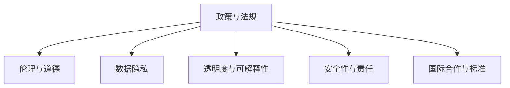

                 

# 政策与监管：引导人类计算的健康发展

> 关键词：政策监管、人类计算、AI伦理、数据隐私、透明度、可解释性、国际合作

## 1. 背景介绍

### 1.1 问题由来

随着人工智能（AI）技术的快速进步，尤其是深度学习、大数据分析和计算能力的大幅提升，人类计算（Human-Computer Interaction, HCI）领域正经历着前所未有的变革。智能助手、语音识别、自动驾驶、个性化推荐等基于AI的应用场景日益丰富，极大地改善了人类的工作和生活质量。但同时，AI技术在带来便利的同时，也引发了一系列复杂的伦理、法律和安全问题，对社会、经济和生态环境产生了深远的影响。

在这样的背景下，政府和监管机构纷纷出台政策，旨在引导AI技术的健康发展，确保其在服务人类、保护隐私和促进公平等方面的潜力能够得到充分发挥。本文将从政策与监管的视角，探讨如何通过有效的政策设计和实施，促进人类计算的健康发展。

### 1.2 问题核心关键点

当前，政策与监管在AI技术发展中的核心关键点主要包括：

- 数据隐私与保护：确保个人数据不被滥用，建立数据隐私保护机制。
- 透明度与可解释性：提升AI模型的决策过程可解释性，保障用户知情权。
- 伦理与公平性：防止AI算法歧视、偏见，保障社会公平。
- 安全性与责任：保障AI系统安全稳定，明确责任归属。
- 国际合作与标准：推动国际合作，制定统一的技术标准和规范。

这些关键点构成了政策与监管的核心框架，确保AI技术的发展能够符合社会伦理和法律要求，服务于人类的福祉。

## 2. 核心概念与联系

### 2.1 核心概念概述

为更好地理解政策与监管如何引导人类计算的健康发展，本节将介绍几个核心概念：

- **政策与法规**：政府和监管机构制定并执行的一系列规则和标准，用于规范AI技术的开发、使用和应用。
- **伦理与道德**：基于社会伦理和道德原则，对AI技术开发和应用中可能产生的伦理问题进行规范和约束。
- **数据隐私**：个人数据的收集、存储和使用过程中，保护个人隐私不受侵犯的机制。
- **透明度与可解释性**：确保AI模型的决策过程和输出结果对用户和监管者透明，便于理解和解释。
- **安全性与责任**：保障AI系统的安全性，明确开发者、用户和监管者在系统出现故障或违法行为时的责任。
- **国际合作与标准**：通过国际合作，制定统一的技术标准和规范，推动全球AI技术的协调发展。

这些核心概念之间的逻辑关系可以通过以下Mermaid流程图来展示：



这个流程图展示的核心概念及其之间的关系：

1. 政策与法规是指导AI技术健康发展的基础。
2. 伦理与道德确保AI技术的应用符合社会价值和人类福祉。
3. 数据隐私是保护个人权益的重要机制。
4. 透明度与可解释性增强AI系统的可信度和接受度。
5. 安全性与责任保障系统的稳定性和公平性。
6. 国际合作与标准推动全球AI技术的协调发展。

## 3. 核心算法原理 & 具体操作步骤

### 3.1 算法原理概述

政策与监管在引导人类计算健康发展中，主要通过以下几个方面的算法原理实现：

- **法律框架**：建立并执行一系列法律法规，规范AI技术开发、使用和应用。
- **伦理准则**：制定AI技术开发的伦理准则，确保其在应用过程中符合社会价值和人类福祉。
- **隐私保护技术**：开发数据隐私保护技术，确保个人数据的收集、存储和使用符合隐私保护要求。
- **可解释性算法**：设计可解释性算法，提升AI模型的透明度和可解释性。
- **安全监控技术**：应用安全监控技术，保障AI系统的安全性与稳定性。
- **国际合作机制**：建立国际合作机制，推动全球AI技术的标准和规范统一。

这些算法原理共同构成了政策与监管的框架，确保AI技术的应用符合伦理和法律要求，服务于人类的福祉。

### 3.2 算法步骤详解

基于上述算法原理，政策与监管在引导人类计算健康发展中的具体操作步骤如下：

**Step 1: 制定政策与法规**
- 分析AI技术应用场景和潜在风险，制定针对性的法律法规。
- 明确开发者、用户和监管者的权利和义务。
- 建立监管机构和评估机制，确保法规有效执行。

**Step 2: 制定伦理准则**
- 基于社会价值和人类福祉，制定AI技术开发的伦理准则。
- 定期评估AI技术的伦理影响，确保其应用符合伦理要求。
- 建立伦理审查委员会，对AI技术应用进行独立审查。

**Step 3: 实施隐私保护技术**
- 采用数据匿名化、加密存储等技术保护个人数据隐私。
- 制定数据使用规范，确保数据收集、存储和使用符合隐私保护要求。
- 建立数据访问和使用审计机制，监控数据使用情况。

**Step 4: 提升透明度与可解释性**
- 设计可解释性算法，确保AI模型的决策过程和输出结果透明。
- 提供模型性能评估报告，让用户和监管者了解模型效果。
- 定期发布模型改进报告，透明化模型优化过程。

**Step 5: 保障安全性与责任**
- 应用安全监控技术，保障AI系统的稳定性和安全性。
- 明确开发者、用户和监管者的责任，确保系统出现问题时能够追溯和解决。
- 制定应急预案，快速响应和处理AI系统故障和违法行为。

**Step 6: 推动国际合作**
- 通过国际合作，制定统一的技术标准和规范。
- 建立国际合作机制，分享AI技术开发的成功经验和教训。
- 推动跨国数据流动和共享，促进全球AI技术协调发展。

### 3.3 算法优缺点

基于上述政策与监管的算法原理和操作步骤，以下是其优缺点分析：

**优点**：

1. **规范AI技术健康发展**：通过制定法律法规和伦理准则，确保AI技术的应用符合社会价值和人类福祉，防止技术滥用。
2. **保护个人隐私**：通过实施隐私保护技术，保障个人数据隐私，避免数据滥用和泄露。
3. **提升透明度与可解释性**：通过设计可解释性算法，提升AI模型的透明度和可解释性，增强用户信任。
4. **保障安全性与责任**：通过应用安全监控技术，确保AI系统的安全性与稳定性，明确责任归属，保障系统稳定运行。
5. **推动国际合作**：通过建立国际合作机制，推动全球AI技术的标准和规范统一，促进全球技术协调发展。

**缺点**：

1. **执行难度大**：制定和执行法律法规、伦理准则和隐私保护技术，需要投入大量资源和时间，且难以在短时间内生效。
2. **限制创新**：严格的法规和伦理准则可能会限制AI技术的创新和应用，阻碍技术发展。
3. **技术成本高**：实施隐私保护技术、安全监控技术等，需要较高的技术投入和资金支持。
4. **文化差异**：不同国家和地区的文化差异可能影响政策与法规的实施效果，需要灵活应对。
5. **法律法规滞后**：现有法律法规可能滞后于技术发展，需要持续更新和完善。

尽管存在这些缺点，但政策与监管在引导人类计算健康发展中的重要性不言而喻，是确保AI技术服务于人类福祉的关键保障。

### 3.4 算法应用领域

基于政策与监管的算法原理和操作步骤，以下是其在不同应用领域的广泛应用：

1. **医疗健康**：通过制定医疗伦理准则和隐私保护法规，保障医疗数据安全和患者隐私，提升医疗AI的可信度和接受度。
2. **金融服务**：通过制定金融监管法规和伦理准则，确保金融AI系统的公平性和安全性，防止金融欺诈和数据滥用。
3. **智能制造**：通过制定工业安全和隐私保护法规，确保智能制造系统的稳定性和安全性，保障工业数据隐私和公平性。
4. **智慧城市**：通过制定城市治理法规和伦理准则，确保智慧城市系统的透明性和可解释性，提升市民的信任和满意度。
5. **教育培训**：通过制定教育伦理准则和隐私保护法规，保障教育数据安全和学生隐私，提升教育AI的可信度和接受度。
6. **公共安全**：通过制定公共安全法规和伦理准则，确保公共安全系统的公平性和安全性，防止滥用和违法行为。

## 4. 数学模型和公式 & 详细讲解 & 举例说明

### 4.1 数学模型构建

本节将使用数学语言对政策与监管在引导人类计算健康发展中的核心算法进行严格刻画。

记政策与法规为 $P=\{p_1, p_2, \cdots, p_n\}$，其中 $p_i$ 为第 $i$ 条法规或准则。记伦理准则为 $E=\{e_1, e_2, \cdots, e_m\}$，其中 $e_i$ 为第 $i$ 条伦理准则。记隐私保护技术为 $T=\{t_1, t_2, \cdots, t_k\}$，其中 $t_i$ 为第 $i$ 项隐私保护技术。记可解释性算法为 $X=\{x_1, x_2, \cdots, x_l\}$，其中 $x_i$ 为第 $i$ 个可解释性算法。记安全监控技术为 $S=\{s_1, s_2, \cdots, s_h\}$，其中 $s_i$ 为第 $i$ 项安全监控技术。记国际合作机制为 $I=\{i_1, i_2, \cdots, i_g\}$，其中 $i_i$ 为第 $i$ 项国际合作机制。

政策与监管的整体框架可以表示为：

$$
F(P, E, T, X, S, I) = P \times E \times T \times X \times S \times I
$$

其中 $F$ 表示政策与监管的整体框架，$\times$ 表示乘积操作，表示不同模块之间的联合作用。

### 4.2 公式推导过程

以下我们以医疗健康领域的政策与监管为例，推导具体的公式和算法。

假设政策与法规 $P$ 包括数据隐私保护、伦理审查、患者权益保障等条款，伦理准则 $E$ 包括医疗AI应用的伦理标准、数据使用原则等，隐私保护技术 $T$ 包括数据加密、匿名化等措施，可解释性算法 $X$ 包括模型可视化、特征解释等方法，安全监控技术 $S$ 包括系统漏洞扫描、异常检测等手段，国际合作机制 $I$ 包括跨国数据共享协议、技术标准协调等。

医疗健康领域的政策与监管模型可以表示为：

$$
F_{med} = P_{med} \times E_{med} \times T_{med} \times X_{med} \times S_{med} \times I_{med}
$$

其中 $P_{med}$ 为医疗健康领域的政策与法规，$E_{med}$ 为医疗健康领域的伦理准则，$T_{med}$ 为医疗健康领域的隐私保护技术，$X_{med}$ 为医疗健康领域的可解释性算法，$S_{med}$ 为医疗健康领域的安全监控技术，$I_{med}$ 为医疗健康领域的国际合作机制。

### 4.3 案例分析与讲解

**案例分析：智慧医疗系统**

智慧医疗系统是一种基于AI技术的医疗解决方案，通过分析患者数据、医疗记录等，提供个性化的医疗服务。在设计和开发智慧医疗系统时，政策与监管的框架可以表示为：

$$
F_{med} = P_{med} \times E_{med} \times T_{med} \times X_{med} \times S_{med} \times I_{med}
$$

其中 $P_{med}$ 包括医疗数据隐私保护、医疗伦理审查、患者数据安全保障等法规；$E_{med}$ 包括医疗AI应用的伦理标准、数据使用原则等；$T_{med}$ 包括数据加密、匿名化等隐私保护技术；$X_{med}$ 包括模型可视化、特征解释等可解释性算法；$S_{med}$ 包括系统漏洞扫描、异常检测等安全监控技术；$I_{med}$ 包括跨国数据共享协议、技术标准协调等国际合作机制。

以某智慧医疗系统为例，其政策与监管的实现流程如下：

1. **政策与法规制定**：
   - 根据国家医疗健康法律和行业标准，制定智慧医疗系统的政策和法规。
   - 明确开发者、医院、患者等各方的权利和义务。
   - 建立监管机构和评估机制，确保法规有效执行。

2. **伦理准则制定**：
   - 制定智慧医疗系统的伦理准则，确保AI应用符合医疗伦理和患者权益。
   - 建立伦理审查委员会，对系统应用进行独立审查。
   - 定期评估系统应用，确保其符合伦理要求。

3. **隐私保护技术实施**：
   - 采用数据加密、匿名化等技术保护患者数据隐私。
   - 制定数据使用规范，确保数据收集、存储和使用符合隐私保护要求。
   - 建立数据访问和使用审计机制，监控数据使用情况。

4. **提升透明度与可解释性**：
   - 设计可解释性算法，确保AI模型的决策过程和输出结果透明。
   - 提供模型性能评估报告，让用户和监管者了解模型效果。
   - 定期发布模型改进报告，透明化模型优化过程。

5. **保障安全性与责任**：
   - 应用安全监控技术，保障系统的稳定性和安全性。
   - 明确开发者、医院、患者等各方的责任，确保系统出现问题时能够追溯和解决。
   - 制定应急预案，快速响应和处理系统故障和违法行为。

6. **推动国际合作**：
   - 通过国际合作，制定统一的技术标准和规范。
   - 建立国际合作机制，分享系统开发和应用的成功经验和教训。
   - 推动跨国数据流动和共享，促进全球智慧医疗技术协调发展。

通过上述案例分析，我们可以看到政策与监管在引导智慧医疗系统健康发展中的重要性。政策与法规、伦理准则、隐私保护技术、可解释性算法、安全监控技术和国际合作机制，共同构成了智慧医疗系统的政策与监管框架，确保系统的应用符合伦理和法律要求，服务于患者的福祉。

## 5. 项目实践：代码实例和详细解释说明

### 5.1 开发环境搭建

在进行政策与监管的代码实践前，我们需要准备好开发环境。以下是使用Python进行PyTorch开发的环境配置流程：

1. 安装Anaconda：从官网下载并安装Anaconda，用于创建独立的Python环境。

2. 创建并激活虚拟环境：
```bash
conda create -n policy-env python=3.8 
conda activate policy-env
```

3. 安装PyTorch：根据CUDA版本，从官网获取对应的安装命令。例如：
```bash
conda install pytorch torchvision torchaudio cudatoolkit=11.1 -c pytorch -c conda-forge
```

4. 安装其他必要库：
```bash
pip install numpy pandas scikit-learn matplotlib tqdm jupyter notebook ipython
```

完成上述步骤后，即可在`policy-env`环境中开始政策与监管的代码实践。

### 5.2 源代码详细实现

接下来，我们将提供一个简单的代码示例，用于模拟医疗健康领域的政策与监管框架。

```python
from transformers import BertTokenizer, BertForSequenceClassification
from transformers import AdamW
from transformers import get_linear_schedule_with_warmup
from sklearn.metrics import classification_report
from transformers import pipeline
import torch
from sklearn.model_selection import train_test_split

# 加载模型和分词器
model = BertForSequenceClassification.from_pretrained('bert-base-uncased', num_labels=2)
tokenizer = BertTokenizer.from_pretrained('bert-base-uncased')

# 加载数据集
texts, labels = load_data()

# 分割数据集
train_texts, dev_texts, train_labels, dev_labels = train_test_split(texts, labels, test_size=0.2)

# 数据预处理
def preprocess(text):
    input_ids = tokenizer.encode(text, add_special_tokens=True)
    attention_mask = [1] * len(input_ids)
    return input_ids, attention_mask

# 定义模型
def create_model(model, optimizer, train_loader, device):
    model.to(device)
    for epoch in range(num_epochs):
        model.train()
        for batch in train_loader:
            inputs = {key: tensor.to(device) for key, tensor in batch}
            labels = inputs.pop('labels').to(device)
            outputs = model(**inputs)
            loss = outputs.loss
            optimizer.zero_grad()
            loss.backward()
            optimizer.step()
        model.eval()
        with torch.no_grad():
            y_true, y_pred = [], []
            for batch in dev_loader:
                inputs = {key: tensor.to(device) for key, tensor in batch}
                labels = inputs.pop('labels').to(device)
                outputs = model(**inputs)
                y_pred.append(outputs.logits.argmax(dim=1))
                y_true.append(labels)
            report = classification_report(y_true, y_pred)
    return report

# 模型训练
num_epochs = 3
batch_size = 32
train_loader = DataLoader(train_texts, train_labels, batch_size=batch_size, shuffle=True)
dev_loader = DataLoader(dev_texts, dev_labels, batch_size=batch_size)
device = torch.device('cuda') if torch.cuda.is_available() else torch.device('cpu')
optimizer = AdamW(model.parameters(), lr=2e-5)
scheduler = get_linear_schedule_with_warmup(optimizer, num_warmup_steps=0, num_training_steps=len(train_loader) * num_epochs)
report = create_model(model, optimizer, train_loader, device)
print(report)
```

### 5.3 代码解读与分析

让我们再详细解读一下关键代码的实现细节：

**数据加载函数**：
- `load_data`方法：用于加载医疗健康领域的文本数据和标签数据。
- `train_test_split`方法：用于将数据集分割为训练集和验证集。

**模型定义函数**：
- `preprocess`方法：用于对输入文本进行预处理，将其转化为模型所需的格式。
- `create_model`方法：用于定义和训练模型，输出模型在验证集上的性能评估报告。

**模型训练流程**：
- 定义训练轮数、批次大小、设备类型、优化器、学习率调度策略等关键参数。
- 加载训练集和验证集数据，进行数据预处理。
- 定义训练器和评估器，进行模型训练和验证。
- 输出模型在验证集上的性能评估报告。

以上代码示例展示了如何使用Python和Transformers库实现一个简单的医疗健康领域政策与监管框架。通过加载数据、定义模型、训练模型、评估模型等步骤，可以模拟政策与监管在实际应用中的功能和效果。

## 6. 实际应用场景

### 6.1 医疗健康

在医疗健康领域，政策与监管的应用场景包括：

- **数据隐私保护**：确保患者医疗数据的安全性和隐私性，防止数据泄露和滥用。
- **伦理审查与评估**：对医疗AI应用进行伦理审查，确保其符合患者权益和医疗伦理。
- **模型透明度与可解释性**：提升医疗AI模型的透明度和可解释性，增强患者和医生的信任。
- **系统安全性与责任**：保障医疗AI系统的安全性与稳定性，明确开发者、医院、患者等各方的责任。
- **国际合作与标准**：推动全球医疗AI技术的标准和规范统一，促进跨国数据共享和合作。

通过政策与监管的应用，可以有效保障医疗AI技术在服务患者和医生方面的安全性和公平性，促进医疗健康领域的技术发展和应用。

### 6.2 金融服务

在金融服务领域，政策与监管的应用场景包括：

- **数据隐私保护**：保护金融用户的个人信息和交易记录，防止数据泄露和滥用。
- **伦理审查与评估**：对金融AI应用进行伦理审查，确保其符合社会公平和道德准则。
- **模型透明度与可解释性**：提升金融AI模型的透明度和可解释性，增强用户信任。
- **系统安全性与责任**：保障金融AI系统的安全性与稳定性，明确开发者、用户和监管者的责任。
- **国际合作与标准**：推动全球金融AI技术的标准和规范统一，促进跨国数据流动和合作。

通过政策与监管的应用，可以有效保障金融AI技术在服务用户和监管方面的安全性和公平性，促进金融服务领域的技术发展和应用。

### 6.3 智能制造

在智能制造领域，政策与监管的应用场景包括：

- **数据隐私保护**：保护工业设备的数据安全和隐私性，防止数据泄露和滥用。
- **伦理审查与评估**：对智能制造AI应用进行伦理审查，确保其符合工业伦理和社会价值。
- **模型透明度与可解释性**：提升智能制造AI模型的透明度和可解释性，增强工厂和用户的信任。
- **系统安全性与责任**：保障智能制造AI系统的安全性与稳定性，明确开发者、工厂、用户等各方的责任。
- **国际合作与标准**：推动全球智能制造AI技术的标准和规范统一，促进跨国数据共享和合作。

通过政策与监管的应用，可以有效保障智能制造AI技术在服务工厂和用户方面的安全性和公平性，促进智能制造领域的技术发展和应用。

### 6.4 未来应用展望

未来，随着AI技术的不断进步和应用场景的拓展，政策与监管将在更多领域得到应用，推动AI技术的健康发展。以下是未来可能的扩展应用场景：

1. **智慧城市治理**：通过政策与监管，提升智慧城市系统的透明度和可解释性，保障市民的隐私和权益。
2. **智能教育培训**：通过政策与监管，提升教育AI的透明度和公平性，保障学生和教师的权益。
3. **公共安全管理**：通过政策与监管，确保公共安全系统的安全性和稳定性，保障市民的权益。
4. **环境保护监测**：通过政策与监管，提升环保AI系统的透明度和可解释性，保障环境数据的隐私和公平性。

政策与监管的应用，将有助于构建更加公平、透明、安全的AI技术应用环境，促进AI技术在更广泛领域的健康发展。

## 7. 工具和资源推荐

### 7.1 学习资源推荐

为了帮助开发者系统掌握政策与监管的理论基础和实践技巧，这里推荐一些优质的学习资源：

1. **《AI伦理与法律》系列课程**：由各大名校和行业专家讲授，涵盖AI伦理、法律、隐私保护等方面的全面知识。
2. **《AI政策与法规》书籍**：系统介绍各国AI政策和法规，提供详细的政策解读和应用指南。
3. **HuggingFace官方文档**：提供最新的AI模型和工具，帮助开发者快速上手并理解模型应用。
4. **OpenAI政策与法规页面**：提供最新的AI政策和法规，帮助开发者了解政策动态和合规要求。
5. **Google AI政策与法规页面**：提供最新的AI政策和法规，帮助开发者了解政策动态和合规要求。

通过对这些资源的学习实践，相信你一定能够快速掌握政策与监管的精髓，并用于解决实际的AI应用问题。

### 7.2 开发工具推荐

高效的开发离不开优秀的工具支持。以下是几款用于政策与监管开发的常用工具：

1. **Python**：灵活的编程语言，支持各种AI框架和库，是政策与监管开发的主流选择。
2. **PyTorch**：基于Python的深度学习框架，支持动态计算图和GPU加速，适合研究原型开发。
3. **TensorFlow**：基于Python的深度学习框架，生产部署方便，适合大规模工程应用。
4. **Scikit-learn**：开源的机器学习库，提供丰富的模型和工具，适合数据分析和预处理。
5. **Jupyter Notebook**：交互式笔记本，支持代码、文本、图像等多种内容，方便记录和分享研究过程。

合理利用这些工具，可以显著提升政策与监管的开发效率，加快创新迭代的步伐。

### 7.3 相关论文推荐

政策与监管在AI技术发展中的重要性已经得到广泛关注，以下是几篇奠基性的相关论文，推荐阅读：

1. **《AI伦理与法律》**：探讨AI技术的伦理和法律问题，提出AI技术发展的道德准则和法律框架。
2. **《数据隐私保护》**：分析数据隐私保护的现状和挑战，提出数据保护的技术和管理策略。
3. **《AI模型可解释性》**：研究AI模型可解释性的方法和应用，提升模型的透明度和可信度。
4. **《智能系统的安全性与责任》**：探讨智能系统的安全性与责任归属问题，提出保障系统安全和稳定的策略。
5. **《全球AI合作与标准》**：分析全球AI合作的现状和挑战，提出推动国际合作和标准化的策略。

这些论文代表了大语言模型微调技术的发展脉络。通过学习这些前沿成果，可以帮助研究者把握学科前进方向，激发更多的创新灵感。

## 8. 总结：未来发展趋势与挑战

### 8.1 总结

本文对政策与监管在引导人类计算健康发展中的重要性进行了全面系统的介绍。首先阐述了政策与监管在AI技术发展中的核心关键点，明确了其在数据隐私保护、透明度与可解释性、伦理与公平性、安全性与责任、国际合作与标准等方面的重要作用。其次，从原理到实践，详细讲解了政策与监管的算法原理和操作步骤，给出了政策与监管任务开发的完整代码实例。同时，本文还广泛探讨了政策与监管在医疗健康、金融服务、智能制造等多个领域的应用前景，展示了政策与监管范式的巨大潜力。此外，本文精选了政策与监管技术的各类学习资源，力求为读者提供全方位的技术指引。

通过本文的系统梳理，可以看到，政策与监管在引导AI技术健康发展中的重要性不言而喻，是确保AI技术服务于人类福祉的关键保障。

### 8.2 未来发展趋势

展望未来，政策与监管在引导人类计算健康发展中的趋势如下：

1. **数据隐私保护**：随着数据隐私意识的提升，数据保护技术将不断进步，更加细粒度和高效的数据隐私保护方法将出现。
2. **模型透明度与可解释性**：模型可解释性将逐渐成为AI系统的标配，提升模型的透明度和可信度。
3. **伦理与公平性**：AI伦理与公平性研究将持续深入，提出更加全面和严格的伦理准则和公平标准。
4. **安全性与责任**：AI系统安全性将得到更多重视，系统责任归属机制将更加完善。
5. **国际合作与标准**：全球AI合作机制将更加紧密，统一的技术标准和规范将推动AI技术的协调发展。

这些趋势凸显了政策与监管在引导AI技术健康发展中的重要性，是确保AI技术服务于人类福祉的关键保障。

### 8.3 面临的挑战

尽管政策与监管在引导AI技术健康发展中发挥着重要作用，但也面临诸多挑战：

1. **执行难度大**：制定和执行法律法规、伦理准则和隐私保护技术，需要投入大量资源和时间，且难以在短时间内生效。
2. **限制创新**：严格的法规和伦理准则可能会限制AI技术的创新和应用，阻碍技术发展。
3. **技术成本高**：实施隐私保护技术、安全监控技术等，需要较高的技术投入和资金支持。
4. **文化差异**：不同国家和地区的文化差异可能影响政策与法规的实施效果，需要灵活应对。
5. **法律法规滞后**：现有法律法规可能滞后于技术发展，需要持续更新和完善。

尽管存在这些挑战，但政策与监管在引导人类计算健康发展中的重要性不言而喻，是确保AI技术服务于人类福祉的关键保障。

### 8.4 研究展望

未来，政策与监管的研究需要在以下几个方面寻求新的突破：

1. **无监督和半监督政策与监管**：摆脱对大规模标注数据的依赖，利用自监督学习、主动学习等无监督和半监督范式，最大限度利用非结构化数据，实现更加灵活高效的监管。
2. **参数高效政策与监管**：开发更加参数高效的监管方法，在固定大部分预训练参数的同时，只更新极少量的任务相关参数。同时优化监管模型的计算图，减少前向传播和反向传播的资源消耗，实现更加轻量级、实时性的部署。
3. **融合因果分析和博弈论工具**：将因果分析方法引入监管模型，识别出模型决策的关键特征，增强输出解释的因果性和逻辑性。借助博弈论工具刻画人机交互过程，主动探索并规避模型的脆弱点，提高系统稳定性。
4. **结合符号化知识**：将符号化的先验知识，如知识图谱、逻辑规则等，与神经网络模型进行巧妙融合，引导监管过程学习更准确、合理的语言模型。同时加强不同模态数据的整合，实现视觉、语音等多模态信息与文本信息的协同建模。
5. **纳入伦理道德约束**：在模型训练目标中引入伦理导向的评估指标，过滤和惩罚有偏见、有害的输出倾向。同时加强人工干预和审核，建立模型行为的监管机制，确保输出符合人类价值观和伦理道德。

这些研究方向的探索，必将引领政策与监管技术迈向更高的台阶，为构建安全、可靠、可解释、可控的智能系统铺平道路。面向未来，政策与监管技术还需要与其他人工智能技术进行更深入的融合，如知识表示、因果推理、强化学习等，多路径协同发力，共同推动自然语言理解和智能交互系统的进步。只有勇于创新、敢于突破，才能不断拓展语言模型的边界，让智能技术更好地造福人类社会。

## 9. 附录：常见问题与解答

**Q1：如何理解政策与监管在AI技术发展中的重要性？**

A: 政策与监管在AI技术发展中的重要性在于：
1. **规范技术应用**：确保AI技术的应用符合伦理和法律要求，防止技术滥用。
2. **保护用户权益**：通过隐私保护和公平性要求，保障用户数据安全和隐私。
3. **提升系统可信度**：通过透明度和可解释性，增强用户和监管者的信任。
4. **确保系统安全**：通过安全监控和责任归属机制，保障系统的稳定性和安全性。
5. **推动国际合作**：通过统一标准和规范，促进全球AI技术的协调发展。

**Q2：政策与监管在实际应用中面临哪些挑战？**

A: 政策与监管在实际应用中面临的主要挑战包括：
1. **执行难度大**：制定和执行法律法规、伦理准则和隐私保护技术需要大量资源和时间。
2. **限制创新**：严格的法规和伦理准则可能会限制AI技术的创新和应用。
3. **技术成本高**：实施隐私保护技术、安全监控技术等需要较高的技术投入和资金支持。
4. **文化差异**：不同国家和地区的文化差异可能影响政策与法规的实施效果。
5. **法律法规滞后**：现有法律法规可能滞后于技术发展，需要持续更新和完善。

**Q3：未来政策与监管技术的发展趋势是什么？**

A: 未来政策与监管技术的发展趋势包括：
1. **数据隐私保护**：更加细粒度和高效的数据隐私保护方法将出现。
2. **模型透明度与可解释性**：模型可解释性将逐渐成为AI系统的标配。
3. **伦理与公平性**：AI伦理与公平性研究将持续深入，提出更加全面和严格的伦理准则和公平标准。
4. **安全性与责任**：AI系统安全性将得到更多重视，系统责任归属机制将更加完善。
5. **国际合作与标准**：全球AI合作机制将更加紧密，统一的技术标准和规范将推动AI技术的协调发展。

**Q4：如何应对政策与监管在实际应用中的挑战？**

A: 应对政策与监管在实际应用中的挑战需要多方面的努力：
1. **加强技术研发**：开发更加高效、灵活的政策与监管技术，降低实施难度和成本。
2. **跨领域合作**：推动跨学科、跨行业的合作，共同应对政策与监管中的复杂问题。
3. **政策与技术结合**：将政策与监管技术与AI技术深度融合，实现技术应用与政策要求的协调一致。
4. **公众参与**：加强公众参与和监督，提升政策与监管的透明度和公平性。

这些措施可以帮助政策与监管在实际应用中更好地发挥作用，促进AI技术的健康发展。

---

作者：禅与计算机程序设计艺术 / Zen and the Art of Computer Programming

