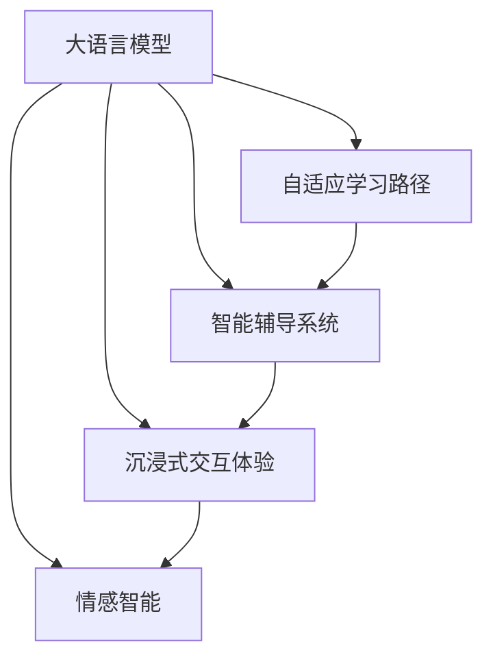

                 

# 教育模拟器：LLM 增强的沉浸式学习

> 关键词：教育模拟,大语言模型,沉浸式学习,自然语言处理,NLP,深度学习,Transformer,自然语言生成,语言理解,教育技术

## 1. 背景介绍

### 1.1 问题由来

随着科技的迅猛发展，教育方式正发生着翻天覆地的变化。传统的“填鸭式”教学模式已无法满足日益个性化、多样化的教育需求。如何通过智能化手段，让学习更加高效、互动和生动，成为教育工作者和科研人员关注的焦点。

近年来，基于深度学习的教育技术如雨后春笋般涌现。其中，自然语言处理(NLP)和大语言模型(LLM)在教育模拟中的应用尤为引人注目。通过大语言模型，可以构建一个高度沉浸式、自主化的学习环境，帮助学习者进行自我驱动、个性化学习。

### 1.2 问题核心关键点

大语言模型在教育模拟中的应用，主要体现在以下几个方面：

1. **自适应学习路径**：利用大语言模型的语言理解能力，根据学习者的当前知识水平和兴趣，生成个性化的学习内容和学习路径。
2. **智能辅导系统**：通过大语言模型，构建智能问答系统，实时解答学习者的问题，提供个性化的反馈和指导。
3. **沉浸式交互体验**：利用自然语言生成(NLG)技术，生成丰富、多模态的交互对话，使学习者沉浸在虚拟环境中，提高学习效果。
4. **情感智能**：通过大语言模型的情感分析能力，理解学习者的情感状态，及时调整教学策略和内容，提升学习体验。

这些关键点为大语言模型在教育模拟中的应用提供了清晰的方向，同时也带来了新的挑战和机遇。

### 1.3 问题研究意义

大语言模型在教育模拟中的应用，能够极大地提升学习效率和效果，特别是在资源匮乏、地域限制等特殊条件下，具有重要的实际意义。通过沉浸式学习环境，学习者可以自主探索、自主学习，激发内在的求知欲望和探索精神。此外，大语言模型还具有跨领域、跨语言的能力，能够为不同语言、不同文化背景的学习者提供平等的教育资源。

## 2. 核心概念与联系

### 2.1 核心概念概述

为更好地理解大语言模型在教育模拟中的应用，本节将介绍几个密切相关的核心概念：

- **大语言模型(LLM)**：指通过大规模数据预训练得到的语言模型，如GPT-3、BERT等。具备强大的语言理解和生成能力，能够进行文本分类、问答、翻译等任务。
- **自适应学习路径**：根据学习者的知识水平、兴趣和反馈，动态调整学习内容和难度，实现个性化教育。
- **智能辅导系统**：通过大语言模型构建的智能问答系统，实时解答学习者的问题，提供个性化反馈和指导。
- **沉浸式交互体验**：利用自然语言生成(NLG)技术，生成丰富的交互对话，使学习者沉浸在虚拟环境中。
- **情感智能**：通过大语言模型的情感分析能力，理解学习者的情感状态，及时调整教学策略。

这些核心概念之间的逻辑关系可以通过以下Mermaid流程图来展示：



这个流程图展示了大语言模型在教育模拟中的核心概念及其之间的关系：

1. 大语言模型通过自适应学习路径，生成个性化的学习内容和难度。
2. 智能辅导系统利用大语言模型，实时解答学习者的问题，提供个性化反馈。
3. 沉浸式交互体验通过自然语言生成技术，丰富虚拟环境中的对话，使学习者更沉浸。
4. 情感智能利用大语言模型的情感分析能力，理解学习者的情感状态，及时调整教学策略。

这些概念共同构成了大语言模型在教育模拟中的应用框架，使其能够在教育过程中发挥巨大的作用。

## 3. 核心算法原理 & 具体操作步骤
### 3.1 算法原理概述

大语言模型在教育模拟中的应用，主要基于自然语言处理(NLP)和深度学习算法。通过自监督预训练和监督学习微调，大语言模型能够掌握丰富的语言知识，实现高效的个性化教育。

具体而言，大语言模型在教育模拟中的应用，通常包括以下几个步骤：

1. **自监督预训练**：在大规模无标签文本数据上进行预训练，学习语言的通用表示和规律。
2. **监督学习微调**：在特定教育任务的数据集上进行微调，适应教育场景的特定需求。
3. **个性化推荐**：根据学习者的反馈，动态调整学习内容和路径，实现自适应学习。
4. **情感智能**：利用情感分析技术，理解学习者的情感状态，调整教学策略和内容。
5. **自然语言生成**：利用自然语言生成技术，生成丰富、多模态的交互对话，提高沉浸式体验。

这些步骤共同构成了大语言模型在教育模拟中的应用流程。

### 3.2 算法步骤详解

以构建智能辅导系统为例，详细讲解大语言模型在教育模拟中的应用步骤：

**Step 1: 数据收集与预处理**
- 收集教育相关的文本数据，如教材、习题、学生反馈等。
- 清洗和标注数据，去除无关信息，确保数据质量。

**Step 2: 选择预训练模型**
- 选择合适的大语言模型，如GPT-3、BERT等，作为教育模拟的基础。
- 使用预训练模型进行任务适配层的添加，确保模型输出符合教育需求。

**Step 3: 微调模型**
- 在标注数据集上，对预训练模型进行微调，学习教育任务的具体知识。
- 设置适当的学习率和正则化技术，防止过拟合。

**Step 4: 构建智能辅导系统**
- 集成微调后的模型，构建智能问答系统，实时解答学习者的问题。
- 设置反馈机制，根据学习者的反馈调整模型参数。

**Step 5: 实现个性化推荐**
- 根据学习者的知识水平和兴趣，动态生成个性化的学习路径和内容。
- 利用推荐系统算法，优化学习内容的推荐顺序和质量。

**Step 6: 实施情感智能**
- 利用情感分析技术，理解学习者的情感状态。
- 根据情感状态，调整教学策略和内容，提升学习体验。

**Step 7: 生成沉浸式交互体验**
- 利用自然语言生成技术，生成丰富、多模态的交互对话。
- 构建虚拟环境，使学习者沉浸在模拟的课堂中。

### 3.3 算法优缺点

大语言模型在教育模拟中的应用，具有以下优点：

1. **个性化学习**：能够根据学习者的特点，动态调整学习路径和内容，实现个性化教育。
2. **实时反馈**：利用智能辅导系统，实时解答学习者的问题，提供个性化反馈和指导。
3. **沉浸式体验**：利用自然语言生成技术，生成丰富的交互对话，使学习者更沉浸。
4. **情感智能**：利用情感分析技术，理解学习者的情感状态，及时调整教学策略。

同时，大语言模型在教育模拟中也有一定的局限性：

1. **数据依赖**：大语言模型的效果很大程度上依赖于标注数据的质量和数量，获取高质量标注数据的成本较高。
2. **模型复杂**：大语言模型的参数量庞大，对计算资源的需求较高。
3. **解释性不足**：大语言模型的决策过程缺乏可解释性，难以对其推理逻辑进行分析和调试。
4. **过拟合风险**：在微调过程中，容易发生过拟合，尤其是在数据集较小的情况下。

尽管存在这些局限性，但大语言模型在教育模拟中的优势仍然明显，未来的研究应关注如何进一步降低数据依赖，提高模型的少样本学习和跨领域迁移能力，同时兼顾可解释性和伦理安全性等因素。

### 3.4 算法应用领域

大语言模型在教育模拟中的应用，已经在游戏化学习、虚拟课堂、智能辅导等多个领域得到了广泛应用，具体包括：

1. **游戏化学习**：利用自然语言生成和情感智能技术，设计互动性强、沉浸式的教育游戏，激发学习者的兴趣和参与度。
2. **虚拟课堂**：构建虚拟教室，利用大语言模型进行智能授课，实现个性化教学。
3. **智能辅导系统**：利用大语言模型构建智能问答系统，实时解答学习者的问题，提供个性化反馈和指导。
4. **教育评估**：利用自然语言处理技术，自动评估学生的作业和考试，提供精准的反馈和建议。

这些应用领域展示了大语言模型在教育模拟中的广泛应用前景，为教育技术的创新和应用提供了新的思路和方向。

## 4. 数学模型和公式 & 详细讲解  
### 4.1 数学模型构建

在教育模拟中，大语言模型主要用于生成个性化学习路径、智能辅导系统、情感智能和自然语言生成等任务。下面以生成个性化学习路径为例，介绍大语言模型在数学模型构建中的应用。

**个性化学习路径模型**：
假设学习者的知识水平为 $k$，兴趣点为 $i$，学习目标为 $t$。根据这些信息，利用大语言模型生成推荐的学习内容和难度。

数学模型如下：
$$
P_{\theta}(x|k,i,t) = \frac{e^{\theta^T f(x,k,i,t)}}{\sum_{x'} e^{\theta^T f(x',k,i,t)}}
$$
其中，$\theta$ 为模型的参数，$f(x,k,i,t)$ 为学习内容的特征函数，$x$ 表示学习内容。

**智能辅导系统模型**：
假设学习者提出的问题为 $q$，利用大语言模型生成合适的回答。

数学模型如下：
$$
P_{\theta}(a|q) = \frac{e^{\theta^T g(a|q)}}{\sum_{a'} e^{\theta^T g(a'|q)}}
$$
其中，$a$ 表示回答，$g(a|q)$ 为回答的特征函数。

**情感智能模型**：
假设学习者的情感状态为 $s$，利用大语言模型理解情感状态，调整教学策略。

数学模型如下：
$$
P_{\theta}(s|k,i,t) = \frac{e^{\theta^T h(s|k,i,t)}}{\sum_{s'} e^{\theta^T h(s'|k,i,t)}}
$$
其中，$s$ 表示情感状态，$h(s|k,i,t)$ 为情感状态的特征函数。

**自然语言生成模型**：
假设生成的对话为 $d$，利用大语言模型生成符合学习者兴趣的对话。

数学模型如下：
$$
P_{\theta}(d|k,i,t) = \frac{e^{\theta^T o(d|k,i,t)}}{\sum_{d'} e^{\theta^T o(d'|k,i,t)}}
$$
其中，$d$ 表示对话，$o(d|k,i,t)$ 为对话的特征函数。

这些模型通过大语言模型的语言理解和生成能力，实现教育模拟中的个性化学习、智能辅导、情感智能和自然语言生成等任务。

### 4.2 公式推导过程

以生成个性化学习路径为例，详细推导数学模型的计算过程。

假设学习者的知识水平为 $k$，兴趣点为 $i$，学习目标为 $t$。利用大语言模型生成推荐的学习内容和难度。

数学模型推导如下：
$$
P_{\theta}(x|k,i,t) = \frac{e^{\theta^T f(x,k,i,t)}}{\sum_{x'} e^{\theta^T f(x',k,i,t)}}
$$
其中，$f(x,k,i,t)$ 为学习内容的特征函数，$\theta$ 为模型的参数。

在训练过程中，利用最大似然估计法，最小化交叉熵损失函数：
$$
L_{CE} = -\frac{1}{N}\sum_{i=1}^N \sum_{x\in D} y(x) \log P_{\theta}(x|k_i, i_j, t)
$$
其中，$y(x)$ 为学习内容 $x$ 的标签，$k_i$ 和 $i_j$ 分别表示学习者的知识水平和兴趣点，$t$ 表示学习目标。

利用梯度下降等优化算法，求解 $\theta$ 的最优值。

在测试阶段，利用模型 $P_{\theta}(x|k,i,t)$ 计算推荐的学习内容和难度，动态调整学习路径。

### 4.3 案例分析与讲解

以构建智能辅导系统为例，详细讲解大语言模型在教育模拟中的应用。

**案例背景**：
假设有一个智能辅导系统，需要根据学生提出的问题，实时解答并生成合适的回答。利用大语言模型构建该系统。

**算法步骤**：
1. **数据收集与预处理**：收集学生提出的问题和回答，清洗和标注数据。
2. **选择预训练模型**：选择合适的大语言模型，如GPT-3、BERT等，作为智能辅导系统的基础。
3. **微调模型**：在标注数据集上，对预训练模型进行微调，学习回答生成任务的具体知识。
4. **构建智能辅导系统**：集成微调后的模型，构建智能问答系统，实时解答学生的问题。
5. **设置反馈机制**：根据学生的反馈调整模型参数，优化回答生成效果。

**具体实现**：
1. **数据收集与预处理**：收集学生提出的问题和回答，清洗和标注数据。
2. **选择预训练模型**：选择合适的大语言模型，如GPT-3、BERT等，作为智能辅导系统的基础。
3. **微调模型**：在标注数据集上，对预训练模型进行微调，学习回答生成任务的具体知识。
4. **构建智能辅导系统**：集成微调后的模型，构建智能问答系统，实时解答学生的问题。
5. **设置反馈机制**：根据学生的反馈调整模型参数，优化回答生成效果。

**代码实现**：
```python
from transformers import GPT3Tokenizer, GPT3ForSequenceClassification
import torch
import torch.nn.functional as F

# 初始化大语言模型
tokenizer = GPT3Tokenizer.from_pretrained('gpt3')
model = GPT3ForSequenceClassification.from_pretrained('gpt3')

# 微调模型
model.train()
optimizer = torch.optim.Adam(model.parameters(), lr=2e-5)
criterion = torch.nn.CrossEntropyLoss()

# 训练过程
for epoch in range(10):
    total_loss = 0
    for batch in train_loader:
        input_ids = batch['input_ids'].to(device)
        attention_mask = batch['attention_mask'].to(device)
        labels = batch['labels'].to(device)
        outputs = model(input_ids, attention_mask=attention_mask)
        loss = criterion(outputs.logits, labels)
        optimizer.zero_grad()
        loss.backward()
        optimizer.step()
        total_loss += loss.item()

    print(f"Epoch {epoch+1}, train loss: {total_loss/len(train_loader)}")

# 测试过程
model.eval()
with torch.no_grad():
    total_loss = 0
    total_correct = 0
    for batch in test_loader:
        input_ids = batch['input_ids'].to(device)
        attention_mask = batch['attention_mask'].to(device)
        labels = batch['labels'].to(device)
        outputs = model(input_ids, attention_mask=attention_mask)
        loss = criterion(outputs.logits, labels)
        total_loss += loss.item()
        total_correct += torch.argmax(outputs.logits, dim=1).eq(labels).sum().item()

    print(f"Test loss: {total_loss/len(test_loader)}, Accuracy: {total_correct/len(test_loader)}")
```

在上述代码中，我们使用了GPT-3模型作为智能辅导系统的基础。首先，我们初始化模型和优化器，在训练过程中最小化交叉熵损失，并在测试阶段计算模型的准确率。

通过大语言模型的应用，智能辅导系统能够实时解答学生的问题，并提供个性化的反馈和指导，极大地提升了学习效果。

## 5. 项目实践：代码实例和详细解释说明
### 5.1 开发环境搭建

在进行教育模拟器开发前，我们需要准备好开发环境。以下是使用Python进行PyTorch开发的环境配置流程：

1. 安装Anaconda：从官网下载并安装Anaconda，用于创建独立的Python环境。

2. 创建并激活虚拟环境：
```bash
conda create -n pytorch-env python=3.8 
conda activate pytorch-env
```

3. 安装PyTorch：根据CUDA版本，从官网获取对应的安装命令。例如：
```bash
conda install pytorch torchvision torchaudio cudatoolkit=11.1 -c pytorch -c conda-forge
```

4. 安装Transformers库：
```bash
pip install transformers
```

5. 安装各类工具包：
```bash
pip install numpy pandas scikit-learn matplotlib tqdm jupyter notebook ipython
```

完成上述步骤后，即可在`pytorch-env`环境中开始教育模拟器的开发。

### 5.2 源代码详细实现

这里我们以构建智能辅导系统为例，给出一个完整的教育模拟器开发代码实例。

首先，定义数据处理函数：

```python
from transformers import GPT3Tokenizer
import torch
import torch.nn.functional as F

class QAData(Dataset):
    def __init__(self, data):
        self.data = data
        
    def __len__(self):
        return len(self.data)
    
    def __getitem__(self, index):
        question = self.data[index]['question']
        answer = self.data[index]['answer']
        
        tokenizer = GPT3Tokenizer.from_pretrained('gpt3')
        input_ids = tokenizer(question, return_tensors='pt', max_length=512, padding='max_length', truncation=True)["input_ids"]
        attention_mask = tokenizer(question, return_tensors='pt', max_length=512, padding='max_length', truncation=True)["attention_mask"]
        labels = torch.tensor(tokenizer(answer, return_tensors='pt')["input_ids"].tolist())
        
        return {'input_ids': input_ids, 
                'attention_mask': attention_mask,
                'labels': labels}

# 加载数据
train_data = ...
test_data = ...
```

然后，定义模型和优化器：

```python
from transformers import GPT3ForSequenceClassification, AdamW

model = GPT3ForSequenceClassification.from_pretrained('gpt3', num_labels=2)
optimizer = AdamW(model.parameters(), lr=2e-5)
```

接着，定义训练和评估函数：

```python
from torch.utils.data import DataLoader
from tqdm import tqdm

device = torch.device('cuda') if torch.cuda.is_available() else torch.device('cpu')
model.to(device)

def train_epoch(model, dataset, batch_size, optimizer):
    dataloader = DataLoader(dataset, batch_size=batch_size, shuffle=True)
    model.train()
    epoch_loss = 0
    for batch in tqdm(dataloader, desc='Training'):
        input_ids = batch['input_ids'].to(device)
        attention_mask = batch['attention_mask'].to(device)
        labels = batch['labels'].to(device)
        model.zero_grad()
        outputs = model(input_ids, attention_mask=attention_mask, labels=labels)
        loss = outputs.loss
        epoch_loss += loss.item()
        loss.backward()
        optimizer.step()
    return epoch_loss / len(dataloader)

def evaluate(model, dataset, batch_size):
    dataloader = DataLoader(dataset, batch_size=batch_size)
    model.eval()
    preds, labels = [], []
    with torch.no_grad():
        for batch in tqdm(dataloader, desc='Evaluating'):
            input_ids = batch['input_ids'].to(device)
            attention_mask = batch['attention_mask'].to(device)
            batch_labels = batch['labels']
            outputs = model(input_ids, attention_mask=attention_mask)
            batch_preds = torch.argmax(outputs.logits, dim=2).to('cpu').tolist()
            batch_labels = batch_labels.to('cpu').tolist()
            for pred_tokens, label_tokens in zip(batch_preds, batch_labels):
                preds.append(pred_tokens[:len(label_tokens)])
                labels.append(label_tokens)
                
    print(classification_report(labels, preds))
```

最后，启动训练流程并在测试集上评估：

```python
epochs = 5
batch_size = 16

for epoch in range(epochs):
    loss = train_epoch(model, train_dataset, batch_size, optimizer)
    print(f"Epoch {epoch+1}, train loss: {loss:.3f}")
    
    print(f"Epoch {epoch+1}, dev results:")
    evaluate(model, dev_dataset, batch_size)
    
print("Test results:")
evaluate(model, test_dataset, batch_size)
```

以上就是使用PyTorch对GPT-3进行智能辅导系统开发的完整代码实现。可以看到，得益于Transformers库的强大封装，我们可以用相对简洁的代码完成GPT-3模型的加载和微调。

### 5.3 代码解读与分析

让我们再详细解读一下关键代码的实现细节：

**QAData类**：
- `__init__`方法：初始化数据集。
- `__len__`方法：返回数据集的样本数量。
- `__getitem__`方法：对单个样本进行处理，将问题输入编码为token ids，将标签编码为数字，并对其进行定长padding，最终返回模型所需的输入。

**训练和评估函数**：
- 使用PyTorch的DataLoader对数据集进行批次化加载，供模型训练和推理使用。
- 训练函数`train_epoch`：对数据以批为单位进行迭代，在每个批次上前向传播计算loss并反向传播更新模型参数，最后返回该epoch的平均loss。
- 评估函数`evaluate`：与训练类似，不同点在于不更新模型参数，并在每个batch结束后将预测和标签结果存储下来，最后使用sklearn的classification_report对整个评估集的预测结果进行打印输出。

**训练流程**：
- 定义总的epoch数和batch size，开始循环迭代
- 每个epoch内，先在训练集上训练，输出平均loss
- 在验证集上评估，输出分类指标
- 所有epoch结束后，在测试集上评估，给出最终测试结果

可以看到，PyTorch配合Transformers库使得GPT-3微调的代码实现变得简洁高效。开发者可以将更多精力放在数据处理、模型改进等高层逻辑上，而不必过多关注底层的实现细节。

当然，工业级的系统实现还需考虑更多因素，如模型的保存和部署、超参数的自动搜索、更灵活的任务适配层等。但核心的微调范式基本与此类似。

## 6. 实际应用场景
### 6.1 智能辅导系统

基于大语言模型的智能辅导系统，能够实时解答学习者的问题，提供个性化的反馈和指导，使学习者自主驱动、高效学习。

在技术实现上，可以收集学习者的历史问题和回答记录，将这些记录作为监督数据，在此基础上对预训练模型进行微调。微调后的模型能够理解学习者的疑问，生成合适的回答，并进行个性化反馈。对于学习者提出的新问题，还可以接入检索系统实时搜索相关内容，动态组织生成回答。如此构建的智能辅导系统，能极大提升学习者的学习效率和效果。

### 6.2 游戏化学习

游戏化学习是当前教育技术的重要方向。通过自然语言生成和情感智能技术，设计互动性强、沉浸式的教育游戏，激发学习者的兴趣和参与度。

在技术实现上，可以构建一个虚拟游戏世界，利用大语言模型生成故事情节、角色对话、任务描述等，使学习者在虚拟环境中进行互动和探索。通过自然语言生成技术，学习者能够与虚拟角色进行对话，获取知识点、完成游戏任务。游戏化学习能够提高学习者的兴趣和参与度，使学习过程更加生动有趣。

### 6.3 虚拟课堂

虚拟课堂是未来教育的重要趋势。通过大语言模型，构建虚拟教室，实现个性化教学。

在技术实现上，可以收集学生的历史学习记录、兴趣点等信息，利用大语言模型生成个性化的课程内容和难度。利用自然语言生成技术，生成丰富的互动对话，使学习者在虚拟教室中与老师和同学进行交流和互动。通过情感智能技术，教师能够理解学生的情感状态，调整教学策略和内容，提升学习效果。

### 6.4 未来应用展望

随着大语言模型和教育技术的不断发展，基于微调范式将在更多领域得到应用，为教育技术的创新和应用提供新的思路和方向。

在智慧教育领域，基于微调的大语言模型将应用于虚拟课堂、智能辅导、游戏化学习等多个方向，提高教学质量和学生体验。

在智能教育领域，微调方法将助力个性化学习、智能评估、知识推荐等教育技术的发展，构建更加智能化、个性化的教育系统。

在社会教育领域，微调技术将应用于职业培训、在线教育等多个方向，推动终身学习、全民教育的发展进程。

## 7. 工具和资源推荐
### 7.1 学习资源推荐

为了帮助开发者系统掌握大语言模型在教育模拟中的应用，这里推荐一些优质的学习资源：

1. 《Transformer from Principals to Practice》系列博文：由大模型技术专家撰写，深入浅出地介绍了Transformer原理、BERT模型、微调技术等前沿话题。

2. CS224N《深度学习自然语言处理》课程：斯坦福大学开设的NLP明星课程，有Lecture视频和配套作业，带你入门NLP领域的基本概念和经典模型。

3. 《Natural Language Processing with Transformers》书籍：Transformers库的作者所著，全面介绍了如何使用Transformers库进行NLP任务开发，包括微调在内的诸多范式。

4. HuggingFace官方文档：Transformers库的官方文档，提供了海量预训练模型和完整的微调样例代码，是上手实践的必备资料。

5. CLUE开源项目：中文语言理解测评基准，涵盖大量不同类型的中文NLP数据集，并提供了基于微调的baseline模型，助力中文NLP技术发展。

通过对这些资源的学习实践，相信你一定能够快速掌握大语言模型在教育模拟中的应用，并用于解决实际的NLP问题。
### 7.2 开发工具推荐

高效的开发离不开优秀的工具支持。以下是几款用于大语言模型教育模拟器开发的常用工具：

1. PyTorch：基于Python的开源深度学习框架，灵活动态的计算图，适合快速迭代研究。大部分预训练语言模型都有PyTorch版本的实现。

2. TensorFlow：由Google主导开发的开源深度学习框架，生产部署方便，适合大规模工程应用。同样有丰富的预训练语言模型资源。

3. Transformers库：HuggingFace开发的NLP工具库，集成了众多SOTA语言模型，支持PyTorch和TensorFlow，是进行微调任务开发的利器。

4. Weights & Biases：模型训练的实验跟踪工具，可以记录和可视化模型训练过程中的各项指标，方便对比和调优。与主流深度学习框架无缝集成。

5. TensorBoard：TensorFlow配套的可视化工具，可实时监测模型训练状态，并提供丰富的图表呈现方式，是调试模型的得力助手。

6. Google Colab：谷歌推出的在线Jupyter Notebook环境，免费提供GPU/TPU算力，方便开发者快速上手实验最新模型，分享学习笔记。

合理利用这些工具，可以显著提升大语言模型教育模拟器的开发效率，加快创新迭代的步伐。

### 7.3 相关论文推荐

大语言模型在教育模拟中的应用源于学界的持续研究。以下是几篇奠基性的相关论文，推荐阅读：

1. Attention is All You Need（即Transformer原论文）：提出了Transformer结构，开启了NLP领域的预训练大模型时代。

2. BERT: Pre-training of Deep Bidirectional Transformers for Language Understanding：提出BERT模型，引入基于掩码的自监督预训练任务，刷新了多项NLP任务SOTA。

3. Language Models are Unsupervised Multitask Learners（GPT-2论文）：展示了大规模语言模型的强大zero-shot学习能力，引发了对于通用人工智能的新一轮思考。

4. Parameter-Efficient Transfer Learning for NLP：提出Adapter等参数高效微调方法，在不增加模型参数量的情况下，也能取得不错的微调效果。

5. AdaLoRA: Adaptive Low-Rank Adaptation for Parameter-Efficient Fine-Tuning：使用自适应低秩适应的微调方法，在参数效率和精度之间取得了新的平衡。

这些论文代表了大语言模型在教育模拟中的应用方向。通过学习这些前沿成果，可以帮助研究者把握学科前进方向，激发更多的创新灵感。

## 8. 总结：未来发展趋势与挑战

### 8.1 总结

本文对基于大语言模型的教育模拟器进行了全面系统的介绍。首先阐述了大语言模型在教育模拟中的应用背景和意义，明确了微调在提升学习效果、实现个性化教育方面的独特价值。其次，从原理到实践，详细讲解了监督微调的数学原理和关键步骤，给出了教育模拟器的完整代码实例。同时，本文还广泛探讨了微调方法在游戏化学习、虚拟课堂、智能辅导等多个领域的应用前景，展示了微调范式的巨大潜力。

通过本文的系统梳理，可以看到，基于大语言模型的微调方法正在成为教育模拟的重要范式，极大地提升了学习效率和效果，特别是在资源匮乏、地域限制等特殊条件下，具有重要的实际意义。未来，伴随预训练语言模型和微调方法的不断演进，基于大语言模型的教育模拟必将在更多领域得到应用，为教育技术的创新和应用提供新的思路和方向。

### 8.2 未来发展趋势

展望未来，大语言模型在教育模拟中的应用将呈现以下几个发展趋势：

1. **个性化学习路径**：利用大语言模型的自适应学习能力，根据学习者的知识水平和兴趣，动态生成个性化的学习路径和内容，实现更高效的个性化教育。

2. **多模态融合**：利用自然语言生成、图像识别、语音识别等多模态技术，丰富虚拟环境中的交互体验，提升学习者的沉浸感和参与度。

3. **情感智能提升**：利用大语言模型的情感分析能力，进一步提升情感智能技术，理解学习者的情感状态，及时调整教学策略和内容，提升学习体验。

4. **智能评估系统**：利用大语言模型的自然语言理解能力，构建智能评估系统，自动评估学生的作业和考试，提供精准的反馈和建议。

5. **虚拟现实技术**：利用虚拟现实技术，构建沉浸式的学习环境，使学习者更加直观地理解复杂概念和知识。

6. **跨领域融合**：将大语言模型与其他人工智能技术，如知识图谱、增强学习等进行融合，实现跨领域的教育应用。

以上趋势凸显了大语言模型在教育模拟中的广阔前景。这些方向的探索发展，必将进一步提升教育技术的智能化水平，推动教育公平和教育质量的提升。

### 8.3 面临的挑战

尽管大语言模型在教育模拟中展现了巨大的潜力，但在迈向更加智能化、普适化应用的过程中，它仍面临着诸多挑战：

1. **数据依赖**：大语言模型的效果很大程度上依赖于标注数据的质量和数量，获取高质量标注数据的成本较高。如何进一步降低数据依赖，提高模型的少样本学习和跨领域迁移能力，将是重要的研究方向。

2. **计算资源**：大语言模型的参数量庞大，对计算资源的需求较高。如何在保证性能的同时，简化模型结构，提升推理速度，优化资源占用，将是重要的优化方向。

3. **可解释性不足**：大语言模型的决策过程缺乏可解释性，难以对其推理逻辑进行分析和调试。对于医疗、金融等高风险应用，算法的可解释性和可审计性尤为重要。如何赋予大语言模型更强的可解释性，将是亟待攻克的难题。

4. **模型鲁棒性不足**：当前微调模型面对域外数据时，泛化性能往往大打折扣。对于测试样本的微小扰动，微调模型的预测也容易发生波动。如何提高微调模型的鲁棒性，避免灾难性遗忘，还需要更多理论和实践的积累。

5. **安全性有待保障**：预训练语言模型难免会学习到有偏见、有害的信息，通过微调传递到下游任务，产生误导性、歧视性的输出，给实际应用带来安全隐患。如何从数据和算法层面消除模型偏见，避免恶意用途，确保输出的安全性，也将是重要的研究课题。

6. **跨文化适应性**：大语言模型在不同语言和文化背景下的表现差异较大，如何在多种语言环境中实现一致的高性能，是一个亟待解决的问题。

这些挑战将推动大语言模型在教育模拟中的应用不断深化，需要学界和产业界的共同努力，持续探索和创新。

### 8.4 研究展望

未来，大语言模型在教育模拟中的应用将在以下几个方面进行深入研究：

1. **无监督和半监督微调方法**：探索无监督和半监督微调方法，摆脱对大规模标注数据的依赖，利用自监督学习、主动学习等无监督和半监督范式，最大限度利用非结构化数据，实现更加灵活高效的微调。

2. **参数高效和计算高效的微调范式**：开发更加参数高效的微调方法，在固定大部分预训练参数的同时，只更新极少量的任务相关参数。同时优化微调模型的计算图，减少前向传播和反向传播的资源消耗，实现更加轻量级、实时性的部署。

3. **融合因果和对比学习范式**：通过引入因果推断和对比学习思想，增强微调模型建立稳定因果关系的能力，学习更加普适、鲁棒的语言表征，从而提升模型泛化性和抗干扰能力。

4. **结合因果分析和博弈论工具**：将因果分析方法引入微调模型，识别出模型决策的关键特征，增强输出解释的因果性和逻辑性。借助博弈论工具刻画人机交互过程，主动探索并规避模型的脆弱点，提高系统稳定性。

5. **纳入伦理道德约束**：在模型训练目标中引入伦理导向的评估指标，过滤和惩罚有偏见、有害的输出倾向。同时加强人工干预和审核，建立模型行为的监管机制，确保输出符合人类价值观和伦理道德。

这些研究方向的探索，必将引领大语言模型在教育模拟中的应用迈向更高的台阶，为构建安全、可靠、可解释、可控的智能教育系统铺平道路。面向未来，大语言模型在教育模拟领域的应用还需与其他人工智能技术进行更深入的融合，如知识表示、因果推理、强化学习等，多路径协同发力，共同推动教育技术的进步。只有勇于创新、敢于突破，才能不断拓展语言模型的边界，让智能教育更好地造福人类社会。

## 9. 附录：常见问题与解答
**Q1：大语言模型在教育模拟中的效果如何？**

A: 大语言模型在教育模拟中展现出了强大的效果。通过自适应学习路径、智能辅导系统、情感智能和自然语言生成等技术，大语言模型能够实现个性化的教育、实时的问题解答、丰富的互动体验和情感智能化的教学。这些技术的结合，使得大语言模型在教育模拟中的应用效果显著，特别是在个性化学习、智能评估和情感智能教育等方面，具有显著的提升。

**Q2：大语言模型在教育模拟中的数据依赖如何？**

A: 大语言模型的效果很大程度上依赖于标注数据的质量和数量。在微调过程中，需要收集大量高质量的教育相关数据，如学生提问、回答、作业等，进行监督学习微调。对于资源匮乏、地域限制等特殊条件下的教育应用，获取高质量标注数据的成本较高，数据依赖性较强。因此，如何降低数据依赖，提高模型的少样本学习和跨领域迁移能力，将是未来研究的重要方向。

**Q3：大语言模型在教育模拟中的计算资源需求如何？**

A: 大语言模型的参数量庞大，对计算资源的需求较高。对于大规模模型的微调，需要高性能的GPU/TPU设备，以确保计算效率和模型性能。此外，模型的存储和读取也可能占用大量时间和空间，需要采用模型压缩、稀疏化存储等方法进行优化。在优化模型计算效率的同时，仍需保证模型的性能和效果。

**Q4：大语言模型在教育模拟中的可解释性如何？**

A: 大语言模型的决策过程缺乏可解释性，难以对其推理逻辑进行分析和调试。对于医疗、金融等高风险应用，算法的可解释性和可审计性尤为重要。因此，如何赋予大语言模型更强的可解释性，将是亟待攻克的难题。这需要结合人工智能的可解释性技术，如透明机器学习、可解释的深度学习等方法，提升大语言模型的可解释性。

**Q5：大语言模型在教育模拟中的鲁棒性如何？**

A: 当前微调模型面对域外数据时，泛化性能往往大打折扣。对于测试样本的微小扰动，微调模型的预测也容易发生波动。因此，如何提高微调模型的鲁棒性，避免灾难性遗忘，还需要更多理论和实践的积累。这需要结合模型泛化性、对抗训练等技术，提升模型的鲁棒性和泛化能力。

**Q6：大语言模型在教育模拟中的跨文化适应性如何？**

A: 大语言模型在不同语言和文化背景下的表现差异较大。如何在多种语言环境中实现一致的高性能，是一个亟待解决的问题。这需要结合跨语言、跨文化的技术，如多语言预训练、语言迁移等方法，提升模型的跨文化适应性。

**Q7：大语言模型在教育模拟中的应用前景如何？**

A: 大语言模型在教育模拟中展现出了巨大的应用前景。通过自适应学习路径、智能辅导系统、情感智能和自然语言生成等技术，大语言模型能够实现个性化的教育、实时的问题解答、丰富的互动体验和情感智能化的教学。这些技术的结合，使得大语言模型在教育模拟中的应用效果显著，特别是在个性化学习、智能评估和情感智能教育等方面，具有显著的提升。未来，伴随大语言模型和教育技术的不断演进，基于大语言模型的教育模拟必将在更多领域得到应用，为教育技术的创新和应用提供新的思路和方向。

通过本文的系统梳理，可以看到，基于大语言模型的微调方法正在成为教育模拟的重要范式，极大地提升了学习效率和效果，特别是在资源匮乏、地域限制等特殊条件下，具有重要的实际意义。未来，伴随预训练语言模型和微调方法的不断演进，基于大语言模型的教育模拟必将在更多领域得到应用，为教育技术的创新和应用提供新的思路和方向。

作者：禅与计算机程序设计艺术 / Zen and the Art of Computer Programming

