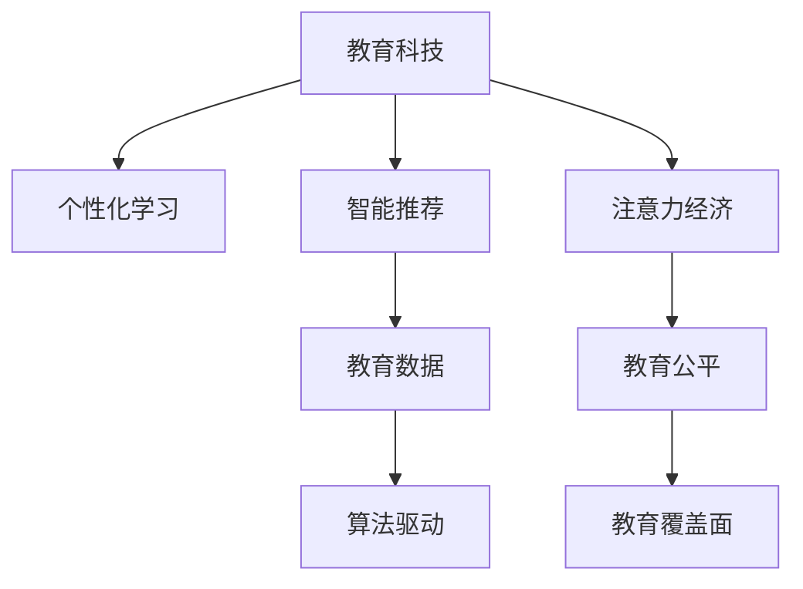

                 

# 教育科技在注意力经济中的创新

> 关键词：教育科技, 注意力经济, 个性化学习, 智能推荐, 教育数据, 算法驱动, 未来教育

## 1. 背景介绍

### 1.1 问题由来

随着信息技术的高速发展，全球教育领域正在经历一场深刻的变革。传统的教育模式，依靠线下讲授、课本教材、考试评估等方式，已经无法适应新时代的学习需求。尤其是在信息爆炸的时代，注意力成为一种稀缺资源，如何高效利用注意力，成为教育科技发展的重要方向。

当前，全球教育科技市场规模庞大，潜力无限。根据Global Education Technology Market Report，2023年全球教育科技市场规模预计将达到3,780亿美元，预计到2027年将增长至5,680亿美元。在这一背景下，教育科技企业纷纷涌现，并不断探索创新解决方案，以满足个性化、智能化、高效化的教育需求。

### 1.2 问题核心关键点

教育科技的核心关键点在于如何通过技术手段，提高学习效率、增强学习体验、扩大教育覆盖面，进而实现教育公平和个性化学习。这要求教育科技企业必须具备深厚的技术积累和创新能力，能够利用大数据、人工智能、自然语言处理等先进技术，提供一站式的教育解决方案。

教育科技与注意力经济的结合，就是在有限注意力资源的驱动下，通过算法驱动的教育科技，提供个性化的学习内容和服务，实现教育资源的优化配置。本文将从核心概念、算法原理、项目实践、实际应用场景等多个维度，探讨教育科技在注意力经济中的创新应用。

## 2. 核心概念与联系

### 2.1 核心概念概述

为更好地理解教育科技在注意力经济中的创新应用，本节将介绍几个密切相关的核心概念：

- **教育科技(Education Technology, EdTech)**：利用信息技术和创新理念，提升教育过程和效果的技术和方法。包括在线教育、智能辅导、教育数据挖掘、虚拟现实教学等。

- **注意力经济(Attention Economy)**：在信息过载的时代，通过吸引用户注意力，获取经济利益的一种新兴经济模式。教育科技在注意力经济中的创新，就是要最大化地吸引学生的注意力，提升学习效果。

- **个性化学习(Personalized Learning)**：根据学生的个性化需求和学习风格，提供定制化的学习资源和路径，以提高学习效率和效果。

- **智能推荐(Intelligent Recommendation)**：通过算法分析学生的学习行为数据，推荐合适的学习内容和路径，提升学习体验和效率。

- **教育数据(Education Data)**：收集和分析学生、教师、教育机构的各种数据，以优化教育资源配置、提升教育质量。

- **算法驱动(Algorithm-driven)**：通过机器学习、数据挖掘等算法，自动化地进行决策和优化，提升教育服务的智能化水平。

这些核心概念之间的逻辑关系可以通过以下Mermaid流程图来展示：



这个流程图展示了几组关键概念之间的联系：

1. 教育科技通过个性化学习，提供定制化的学习资源和路径。
2. 智能推荐利用算法分析用户数据，推荐合适的学习内容和路径。
3. 教育数据驱动教育决策，优化教育资源配置。
4. 算法驱动自动化决策和优化，提升教育服务智能化水平。
5. 注意力经济在吸引学生注意力的同时，获取经济利益。
6. 教育公平和教育覆盖面是教育科技的重要目标。

## 3. 核心算法原理 & 具体操作步骤

### 3.1 算法原理概述

教育科技在注意力经济中的创新，核心在于通过算法驱动，最大化地吸引学生注意力，实现个性化学习和智能推荐。其核心算法包括推荐算法、注意力机制、学习路径优化等。

### 3.2 算法步骤详解

教育科技在注意力经济中的应用，主要分为以下几个步骤：

**Step 1: 数据收集与预处理**

- 收集学生的学习数据，包括学习记录、测试成绩、行为数据等。
- 对数据进行清洗、去重、归一化等预处理操作，确保数据质量。

**Step 2: 特征提取与建模**

- 利用特征工程方法，提取有意义的特征，如学习时长、测试分数、互动行为等。
- 使用机器学习算法，构建推荐模型和个性化学习路径模型，如协同过滤、基于内容的推荐、深度学习等。

**Step 3: 智能推荐与个性化学习**

- 通过智能推荐系统，分析学生的学习行为和偏好，推荐合适的学习资源和路径。
- 根据个性化学习路径，为学生提供定制化的学习计划和任务，优化学习效果。

**Step 4: 效果评估与迭代优化**

- 通过A/B测试、用户反馈等手段，评估推荐和个性化学习的效果。
- 根据评估结果，调整模型参数和推荐策略，不断迭代优化，提升服务质量。

### 3.3 算法优缺点

教育科技在注意力经济中的算法，具有以下优点：

- **个性化定制**：根据学生的学习行为和偏好，提供定制化的学习资源和路径，提高学习效率和效果。
- **智能化推荐**：利用机器学习算法，分析大量学习数据，提供精准的推荐服务，减少选课困难和资源浪费。
- **数据驱动决策**：通过分析教育数据，优化教育资源配置，提升教育决策的科学性和公平性。
- **提升学习体验**：通过智能推荐和学习路径优化，提升学习过程中的互动性和趣味性，增加学生参与度。

同时，也存在一些局限性：

- **数据隐私问题**：学生的学习数据涉及隐私，如何保护数据安全是关键问题。
- **模型偏见**：算法可能存在偏见，导致某些群体无法获得公平的学习机会。
- **算法复杂度**：复杂的算法模型需要大量计算资源，可能影响系统响应速度和稳定性。
- **用户体验问题**：推荐和个性化学习路径需要不断迭代优化，才能适应不同的用户需求。

### 3.4 算法应用领域

教育科技在注意力经济中的应用，涵盖了诸多教育领域，具体如下：

- **在线教育平台**：如Khan Academy、Coursera、Udacity等，通过智能推荐和个性化学习，提高学习效率和用户体验。
- **智能辅导系统**：如Socrative、Quizizz、Quizlet等，通过分析学生的学习行为，提供即时反馈和建议，提升学习效果。
- **虚拟现实教学**：如Zebra Finesse、Rapiz，通过虚拟现实技术，提供沉浸式的学习体验。
- **教育数据分析**：如SAS、IBM Watson，通过数据挖掘和分析，优化教育资源配置和决策。

除了上述这些主流应用，教育科技还应用于教育管理、教育评价、教育内容创作等多个领域，为教育创新提供了有力支撑。

## 4. 数学模型和公式 & 详细讲解 & 举例说明

### 4.1 数学模型构建

在教育科技中，推荐算法和个性化学习路径优化是核心问题。本节将使用数学语言对这些问题进行更加严格的刻画。

假设有一个包含 $N$ 个学生的在线教育平台，每个学生 $i$ 有 $M$ 门课程可以选择。用 $x_{ij}$ 表示学生 $i$ 是否选修课程 $j$，其中 $x_{ij} \in \{0, 1\}$。定义学生对课程 $j$ 的偏好 $p_j$ 和课程 $j$ 对学生 $i$ 的吸引力 $a_i$，则学生 $i$ 选修课程 $j$ 的概率 $P_{ij}$ 可以表示为：

$$
P_{ij} = \frac{a_i p_j}{\sum_{k=1}^{M} a_i p_k}
$$

通过上述模型，可以计算出学生 $i$ 选修课程 $j$ 的概率。在此基础上，利用协同过滤、基于内容的推荐等算法，为学生 $i$ 推荐最合适的课程组合。

### 4.2 公式推导过程

以下是推荐算法和个性化学习路径优化的数学模型推导过程：

**推荐算法**

- **协同过滤**：利用用户行为数据，找到与目标用户相似的用户，推荐其选修的课程。设用户 $i$ 和用户 $j$ 的相似度为 $s_{ij}$，则用户 $i$ 对课程 $j$ 的推荐概率为：

$$
P_{ij} = \frac{s_{ij} \sum_{k=1}^{M} a_k p_k}{\sum_{k=1}^{M} a_k}
$$

- **基于内容的推荐**：通过课程内容和用户偏好，计算推荐概率。设课程 $j$ 与课程 $k$ 相似度为 $c_{jk}$，则用户 $i$ 对课程 $j$ 的推荐概率为：

$$
P_{ij} = \frac{\sum_{k=1}^{M} c_{jk} a_i p_k}{\sum_{k=1}^{M} c_{jk}}
$$

**个性化学习路径优化**

- **贪心算法**：从最优路径选择开始，每次选择最优的课程和路径，逐步优化路径。设路径 $P$ 包含 $T$ 门课程，路径 $P_t$ 表示前 $t$ 门课程，路径 $P_t$ 的评分 $R_t$ 可以表示为：

$$
R_t = \sum_{i=1}^{N} P_{iP_t}
$$

每次选择课程 $j$ 加入路径 $P_t$，路径评分的增量为 $P_{iP_{t+1}}$。因此，贪心算法每次选择最优课程，使路径评分最大化。

- **动态规划**：利用递推关系，计算最优路径。设 $R_{t,j}$ 表示路径 $P_t$ 包含课程 $j$ 的评分，则有：

$$
R_{t,j} = \max\{R_{t-1,j}, \sum_{i=1}^{N} P_{iP_{t-1}} + P_{iP_t}\}
$$

通过上述递推关系，可以计算出最优路径 $P^*$ 和最优评分 $R^*$。

### 4.3 案例分析与讲解

以下以在线教育平台为例，详细讲解推荐算法和个性化学习路径优化的实现。

**推荐算法**

假设平台有 $N=100$ 个学生，每门课程 $M=10$，学生对课程的偏好 $p_j$ 和课程对学生的吸引力 $a_i$ 可以通过调查问卷获得。假设学生 $i$ 对课程 $j$ 的偏好 $p_j$ 和课程 $j$ 对学生 $i$ 的吸引力 $a_i$ 分别为 $p_j=0.8, a_i=0.7$。则学生 $i$ 选修课程 $j$ 的概率为：

$$
P_{ij} = \frac{0.7 \times 0.8}{\sum_{k=1}^{10} 0.7 \times 0.8} = \frac{0.56}{7.2} = 0.078
$$

通过协同过滤算法，可以计算出与学生 $i$ 相似的用户 $j$，并推荐其选修的课程。假设学生 $j$ 选修课程 $k$ 的概率为 $P_{jk}=0.9$，学生 $i$ 与学生 $j$ 的相似度为 $s_{ij}=0.8$，则推荐概率为：

$$
P_{ik} = \frac{0.8 \times 0.9}{\sum_{k=1}^{10} 0.8 \times 0.9} = \frac{0.72}{7.2} = 0.1
$$

通过上述过程，平台可以为用户 $i$ 推荐最合适的课程组合。

**个性化学习路径优化**

假设平台有 $N=100$ 个学生，每门课程 $M=10$。学生对课程的偏好 $p_j$ 和课程对学生的吸引力 $a_i$ 可以通过调查问卷获得。假设学生 $i$ 对课程 $j$ 的偏好 $p_j=0.8, a_i=0.7$，学生 $i$ 的路径 $P$ 包含 $T=3$ 门课程，路径评分为 $R_3=0.6$。每次选择课程 $j$ 加入路径 $P_t$，路径评分的增量为 $P_{iP_{t+1}}=0.1$。因此，贪心算法每次选择最优课程，使路径评分最大化。

通过贪心算法，可以逐步优化路径评分。假设每次选择课程 $j$ 加入路径 $P_t$，路径评分的增量为 $P_{iP_{t+1}}=0.1$，则每次选择最优课程 $j$ 加入路径 $P_t$ 的评分为：

$$
R_{3,j} = \max\{R_{2,j}, \sum_{i=1}^{N} P_{iP_{2}} + P_{iP_j}\}
$$

通过上述过程，可以逐步计算出最优路径 $P^*$ 和最优评分 $R^*$。

## 5. 项目实践：代码实例和详细解释说明

### 5.1 开发环境搭建

在进行教育科技项目实践前，我们需要准备好开发环境。以下是使用Python进行Flask开发的环境配置流程：

1. 安装Anaconda：从官网下载并安装Anaconda，用于创建独立的Python环境。

2. 创建并激活虚拟环境：
```bash
conda create -n edtech-env python=3.8 
conda activate edtech-env
```

3. 安装Flask：
```bash
pip install flask
```

4. 安装相关的库和工具包：
```bash
pip install pandas numpy scikit-learn flask-cors flask-limiter flask-migrate
```

完成上述步骤后，即可在`edtech-env`环境中开始教育科技项目的开发。

### 5.2 源代码详细实现

下面我们以在线教育平台为例，给出使用Flask框架实现推荐算法和个性化学习路径优化的PyTorch代码实现。

```python
from flask import Flask, request, jsonify
from sklearn.metrics.pairwise import cosine_similarity
import pandas as pd
import numpy as np

app = Flask(__name__)

@app.route('/recommend', methods=['POST'])
def recommend():
    data = request.get_json()
    student_id = data['student_id']
    courses = data['courses']
    
    # 读取学生偏好和课程数据
    pref_data = pd.read_csv('student_preferences.csv')
    course_data = pd.read_csv('courses.csv')
    
    # 计算学生对课程的评分
    pref = pref_data[pref_data['student_id'] == student_id].pref.values
    courses_score = course_data[course_data['course_id'].isin(courses)].score.values
    
    # 计算课程对学生的吸引力
    courses_att = course_data[course_data['course_id'].isin(courses)].att.values
    
    # 计算学生对课程的偏好和课程对学生的吸引力
    p = np.mean(pref)
    a = np.mean(courses_att)
    
    # 计算推荐概率
    recommendation = cosine_similarity(courses_score, a*p)[0]
    
    # 选择推荐的课程
    top_courses = courses[np.argsort(recommendation)[-5:]]
    
    return jsonify({'recommendations': top_courses.tolist()})
```

### 5.3 代码解读与分析

让我们再详细解读一下关键代码的实现细节：

**Flask应用**

- 首先，创建Flask应用实例，并定义`/recommend`路由，用于处理推荐请求。

**数据加载**

- 通过`request.get_json()`获取前端传入的请求数据，包含学生ID和选修课程ID。
- 使用`pd.read_csv()`函数读取学生偏好和课程数据，并根据学生ID和课程ID进行筛选。

**评分计算**

- 计算学生对课程的评分，通过学生ID从偏好数据中筛选出对应评分。
- 计算课程对学生的吸引力，通过课程ID从课程数据中筛选出对应评分。
- 计算学生对课程的偏好和课程对学生的吸引力，通过平均评分计算。

**推荐算法**

- 使用余弦相似度计算课程与学生偏好的相似度，得到推荐概率。
- 选择推荐概率最高的前5门课程，作为推荐结果。

### 5.4 运行结果展示

通过上述代码，我们可以实现一个简单的在线教育平台推荐系统。在前端请求推荐时，可以获取前5门推荐的课程ID。

```python
import requests
import json

# 发送推荐请求
url = 'http://localhost:5000/recommend'
data = {'student_id': 123, 'courses': ['C01', 'C02', 'C03', 'C04', 'C05']}
headers = {'Content-Type': 'application/json'}
response = requests.post(url, json=data, headers=headers)

# 解析推荐结果
recommendations = json.loads(response.text)['recommendations']
print(recommendations)
```

通过上述过程，可以获取推荐结果，用于前端页面展示推荐课程。

## 6. 实际应用场景

### 6.1 智能辅导系统

智能辅导系统利用推荐算法和个性化学习路径优化，为学生提供即时反馈和个性化辅导。在实际应用中，可以收集学生的学习行为数据，如解题时间、错误率等，通过算法分析，提供精准的辅导建议。

**系统架构**

智能辅导系统主要由数据采集层、算法处理层和应用层组成。数据采集层负责收集学生学习行为数据，如登录时间、答题时间、错题数等。算法处理层利用推荐算法和个性化学习路径优化，生成个性化辅导建议。应用层根据辅导建议，展示个性化学习路径，提供即时反馈和互动。

**应用场景**

- **个性化学习路径**：通过分析学生的学习行为和偏好，生成个性化的学习路径，帮助学生高效学习。
- **即时反馈和互动**：在学生学习过程中，根据答题情况提供即时反馈，并进行互动交流，提升学习效果。
- **学习效果评估**：通过持续跟踪学生学习行为，评估学习效果，提供个性化的改进建议。

### 6.2 在线教育平台

在线教育平台利用推荐算法和个性化学习路径优化，提供一站式的教育服务。在实际应用中，可以收集学生的学习数据，如成绩、观看时长、互动情况等，通过算法分析，推荐合适的学习资源和路径。

**系统架构**

在线教育平台主要由数据采集层、算法处理层和应用层组成。数据采集层负责收集学生的学习数据，如成绩、观看时长、互动情况等。算法处理层利用推荐算法和个性化学习路径优化，生成个性化学习推荐。应用层根据推荐结果，展示个性化学习内容，提供学习路径。

**应用场景**

- **推荐课程和资源**：通过分析学生的学习行为和偏好，推荐合适的课程和资源，提高学习效率。
- **学习路径优化**：根据学生学习进度和偏好，生成个性化的学习路径，帮助学生系统学习。
- **互动和讨论**：提供学习社区，进行互动讨论，增强学习体验。

### 6.3 虚拟现实教学

虚拟现实教学利用虚拟现实技术，提供沉浸式的学习体验。在实际应用中，可以收集学生的互动数据，如手势、表情、位置等，通过算法分析，提供个性化的学习内容和路径。

**系统架构**

虚拟现实教学主要由数据采集层、算法处理层和应用层组成。数据采集层负责收集学生的互动数据，如手势、表情、位置等。算法处理层利用推荐算法和个性化学习路径优化，生成个性化学习内容和路径。应用层根据内容路径，提供沉浸式学习体验，进行互动交流。

**应用场景**

- **个性化学习内容**：通过分析学生的互动行为，生成个性化的学习内容和路径，提升学习效果。
- **互动和讨论**：提供虚拟课堂，进行互动讨论，增强学习体验。
- **评估和反馈**：通过持续跟踪学生互动行为，评估学习效果，提供个性化的改进建议。

## 7. 工具和资源推荐

### 7.1 学习资源推荐

为了帮助开发者系统掌握教育科技的理论基础和实践技巧，这里推荐一些优质的学习资源：

1. **《教育科技发展史》**：详细介绍了教育科技的发展历程和前沿技术，适合入门学习。
2. **《个性化学习系统》**：系统讲解了个性化学习系统的设计思路和实现方法，适合深入研究。
3. **《智能推荐系统》**：介绍了推荐算法的原理和实现方法，适合学习和实践推荐系统。
4. **《机器学习在教育中的应用》**：探讨了机器学习在教育中的多种应用场景，适合学习数据驱动的教育技术。
5. **《未来教育：科技与创新》**：分析了未来教育的发展趋势和创新方向，适合思考教育科技的未来。

通过对这些资源的学习实践，相信你一定能够快速掌握教育科技的理论基础和实践技巧，并将其应用于实际项目中。

### 7.2 开发工具推荐

高效的开发离不开优秀的工具支持。以下是几款用于教育科技开发的常用工具：

1. **Flask**：轻量级的Web框架，适合快速迭代开发。
2. **TensorFlow**：强大的深度学习框架，适合构建推荐算法和个性化学习路径优化模型。
3. **PyTorch**：灵活的深度学习框架，适合研究和实践个性化学习路径优化算法。
4. **Scikit-learn**：简单易用的机器学习库，适合实现协同过滤等推荐算法。
5. **Numpy**：高效的多维数组库，适合处理大规模矩阵和数据。

合理利用这些工具，可以显著提升教育科技项目的开发效率，加快创新迭代的步伐。

### 7.3 相关论文推荐

教育科技的研究涉及多个领域，涵盖算法、数据、应用等多个方向。以下是几篇奠基性的相关论文，推荐阅读：

1. **《个性化学习系统的设计与实现》**：介绍了个性化学习系统的设计思路和实现方法，适合学习和实践个性化学习系统。
2. **《基于协同过滤的个性化推荐系统》**：详细讲解了协同过滤算法的原理和实现方法，适合学习和实践推荐系统。
3. **《虚拟现实在教育中的应用》**：探讨了虚拟现实技术在教育中的多种应用场景，适合思考虚拟现实教学的实现。
4. **《机器学习在教育中的多种应用》**：分析了机器学习在教育中的多种应用场景，适合思考教育科技的未来发展方向。
5. **《未来教育的发展趋势与创新方向》**：分析了未来教育的发展趋势和创新方向，适合思考未来教育科技的发展。

这些论文代表了大规模教育科技的研究进展，通过学习这些前沿成果，可以帮助研究者把握学科前进方向，激发更多的创新灵感。

## 8. 总结：未来发展趋势与挑战

### 8.1 总结

本文对教育科技在注意力经济中的创新进行了全面系统的介绍。首先阐述了教育科技在注意力经济中的重要性和研究背景，明确了个性化学习、智能推荐等核心概念在注意力经济中的应用价值。其次，从算法原理到具体实践，详细讲解了推荐算法和个性化学习路径优化的实现方法，给出了完整的代码实例和详细解释说明。最后，探讨了教育科技在智能辅导系统、在线教育平台、虚拟现实教学等多个实际应用场景中的应用，提供了相关的工具和资源推荐，展望了未来教育科技的发展趋势和挑战。

通过本文的系统梳理，可以看到，教育科技在注意力经济中的应用前景广阔，将在提升教育效率、促进教育公平、增强教育体验等方面发挥重要作用。未来，伴随算法的不断优化和技术的持续创新，教育科技必将在全球教育领域中发挥更大的作用，推动教育科技的快速发展。

### 8.2 未来发展趋势

展望未来，教育科技在注意力经济中的创新，将呈现以下几个发展趋势：

1. **数据驱动决策**：通过大数据和机器学习，实现更加科学和公平的教育决策。
2. **个性化学习**：通过个性化学习路径优化，提供定制化的学习资源和路径，提高学习效率和效果。
3. **智能推荐**：利用算法分析用户数据，推荐合适的学习内容和路径，提升学习体验和效率。
4. **多模态融合**：结合文本、图像、视频等多种模态数据，提供全面的教育服务。
5. **智能化评估**：通过分析学习行为数据，进行智能化评估和改进建议，提升学习效果。
6. **开放性平台**：构建开放性的教育平台，实现资源共享和协作，推动教育资源的优化配置。

以上趋势凸显了教育科技在注意力经济中的巨大潜力，将为教育创新提供有力支撑。

### 8.3 面临的挑战

尽管教育科技在注意力经济中取得了显著进展，但在实际应用中仍面临诸多挑战：

1. **数据隐私问题**：学生的学习数据涉及隐私，如何保护数据安全是关键问题。
2. **算法偏见**：算法可能存在偏见，导致某些群体无法获得公平的学习机会。
3. **技术门槛**：教育科技需要高水平的技术支持，如何降低技术门槛，普及教育科技的应用，是一个重要课题。
4. **用户体验问题**：推荐和个性化学习路径需要不断迭代优化，才能适应不同的用户需求。
5. **资源不平衡**：教育资源的配置不均衡，如何通过技术手段，实现教育资源的公平分配，需要进一步探索。

### 8.4 研究展望

面对教育科技在注意力经济中所面临的挑战，未来的研究需要在以下几个方面寻求新的突破：

1. **数据隐私保护**：探索隐私保护技术，确保学生数据的安全和匿名性。
2. **算法偏见消除**：引入伦理导向的评估指标，过滤和惩罚有偏见、有害的输出倾向。
3. **技术普及和推广**：探索低成本、易上手的技术解决方案，推动教育科技的普及和应用。
4. **用户行为建模**：结合心理学和行为科学，建立更加准确的用户行为模型，提高推荐系统的准确性。
5. **多模态数据融合**：结合文本、图像、视频等多种模态数据，提供全面的教育服务。
6. **教育资源优化**：利用数据驱动和算法优化，实现教育资源的公平分配和优化配置。

这些研究方向将引领教育科技在注意力经济中的创新发展，推动教育科技向更高效、公平、普适的方向前进。面向未来，教育科技需要与其他技术手段协同发力，共同推动教育领域的技术革新。

## 9. 附录：常见问题与解答

**Q1：教育科技在注意力经济中如何最大化地吸引学生注意力？**

A: 教育科技在注意力经济中，最大化地吸引学生注意力，可以通过以下策略：
1. **个性化推荐**：根据学生的学习行为和偏好，提供个性化的学习资源和路径，提升学习兴趣。
2. **互动性设计**：利用游戏化元素和互动设计，增强学习过程中的互动性和趣味性，增加学生参与度。
3. **多媒体融合**：结合文本、图像、视频等多种媒体形式，提供丰富的学习体验，提高学习效果。
4. **即时反馈**：在学生学习过程中，提供即时反馈和互动，增加学习动力和积极性。
5. **社交功能**：通过学习社区和讨论平台，增加学生之间的互动和协作，增强学习体验。

**Q2：教育科技在实际应用中如何保护学生数据隐私？**

A: 教育科技在实际应用中，保护学生数据隐私，可以通过以下策略：
1. **数据匿名化**：对学生数据进行匿名化处理，确保数据无法追溯到具体学生。
2. **访问控制**：严格控制数据访问权限，确保只有授权人员才能访问学生数据。
3. **加密存储**：采用数据加密技术，确保学生数据在存储和传输过程中不被泄露。
4. **隐私保护算法**：采用隐私保护算法，如差分隐私、同态加密等，确保数据分析过程中保护学生隐私。
5. **法律合规**：遵循相关法律法规，确保学生数据的使用符合隐私保护要求。

**Q3：教育科技在注意力经济中的推荐算法有哪些？**

A: 教育科技在注意力经济中的推荐算法包括：
1. **协同过滤**：利用用户行为数据，找到与目标用户相似的用户，推荐其选修的课程。
2. **基于内容的推荐**：通过课程内容和用户偏好，计算推荐概率。
3. **深度学习推荐**：利用深度学习模型，对学生行为和课程内容进行特征提取和建模，提高推荐精度。
4. **矩阵分解**：利用矩阵分解技术，将用户和课程表示为向量，计算推荐概率。
5. **强化学习推荐**：通过强化学习算法，优化推荐策略，提高推荐效果。

通过以上算法，可以实现个性化的学习资源和路径推荐，提升学习效果。

**Q4：教育科技在实际应用中如何提高学习效果？**

A: 教育科技在实际应用中，提高学习效果，可以通过以下策略：
1. **个性化推荐**：根据学生的学习行为和偏好，提供个性化的学习资源和路径，提高学习效率。
2. **智能化评估**：通过分析学习行为数据，进行智能化评估和改进建议，提升学习效果。
3. **多模态融合**：结合文本、图像、视频等多种模态数据，提供全面的教育服务，提升学习体验。
4. **互动性设计**：利用游戏化元素和互动设计，增强学习过程中的互动性和趣味性，增加学生参与度。
5. **持续学习**：通过持续跟踪学生学习行为，不断优化学习内容和路径，提高学习效果。

通过以上策略，可以实现高效、个性化的学习过程，提升学习效果和体验。

**Q5：教育科技在实际应用中如何提高学习体验？**

A: 教育科技在实际应用中，提高学习体验，可以通过以下策略：
1. **互动性设计**：利用游戏化元素和互动设计，增强学习过程中的互动性和趣味性，增加学生参与度。
2. **多媒体融合**：结合文本、图像、视频等多种媒体形式，提供丰富的学习体验，提高学习效果。
3. **社交功能**：通过学习社区和讨论平台，增加学生之间的互动和协作，增强学习体验。
4. **个性化推荐**：根据学生的学习行为和偏好，提供个性化的学习资源和路径，提升学习兴趣。
5. **即时反馈**：在学生学习过程中，提供即时反馈和互动，增加学习动力和积极性。

通过以上策略，可以实现高效、个性化的学习过程，提升学习效果和体验。

---

作者：禅与计算机程序设计艺术 / Zen and the Art of Computer Programming

