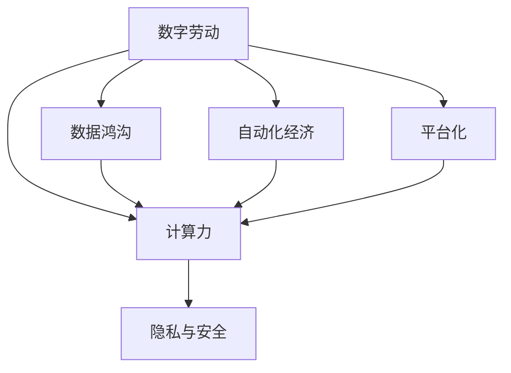

                 

# 数字劳动：人类计算的社会和经济影响

## 1. 背景介绍

### 1.1 问题由来
随着信息技术的发展，计算力已经从稀缺资源转变为海量供应。大量计算任务被自动化，且能以极低成本完成。这种变化深刻影响了社会的生产方式、价值分配和权力结构，形成了全新的“数字劳动”形态。

### 1.2 问题核心关键点
- 计算力普及：计算机技术的普及和算力的提升，使得计算任务可以在广泛的网络平台上以低成本完成。
- 数据鸿沟：大数据、AI和云计算等技术的应用，对数据资源的需求越来越高，形成了数据鸿沟。
- 数字劳动：基于计算任务的劳动形式，包括编程、数据处理、模型训练等，正在取代传统人力劳动。
- 自动化经济：数字化和自动化导致劳动力市场结构变化，对人力需求的减少和人工智能的需求增加。
- 平台化：数字化和网络化形成平台经济，带来市场竞争的新格局。
- 隐私与安全：数字化时代对个人隐私保护和数据安全提出新的挑战。

### 1.3 问题研究意义
研究数字劳动及其社会经济影响，对于理解当前经济形态转变，推动数字经济和智能社会的可持续发展，具有重要意义。

- 经济角度：理解计算力的价值和影响，能够指导企业采取更有效的资源配置策略。
- 社会角度：明确数字化带来的劳动变化，有利于制定公平合理的劳动政策和劳动关系管理。
- 政策角度：了解数字化对市场竞争格局的影响，有助于政府制定更有针对性的产业政策。
- 科技角度：探索数据与算力的高效利用，推动计算科学和人工智能技术的发展。

## 2. 核心概念与联系

### 2.1 核心概念概述

为更好地理解数字劳动及其社会经济影响，本节将介绍几个密切相关的核心概念：

- 数字劳动(Digital Labor)：通过数字化和计算技术，自动完成各种生产和服务任务，如软件开发、数据分析、模型训练等。
- 计算力(Computational Power)：指计算机处理和执行各种计算任务的能力，是数字劳动的基础。
- 数据鸿沟(Data Divide)：数字技术应用过程中，数据资源的获取和利用不均等，导致不同群体间数字能力的差异。
- 自动化经济(Automation Economy)：指通过自动化技术提升生产效率，替代人力劳动的经济模式。
- 平台化(Platformization)：通过互联网和平台经济，实现资源和服务的集中管理与分配。
- 隐私与安全(Privacy and Security)：在数字化进程中，保护个人隐私和数据安全成为重要问题。

这些核心概念之间的逻辑关系可以通过以下Mermaid流程图来展示：



这个流程图展示了大计算时代下劳动形态的变化及其相关影响因素：

1. 数字劳动是计算力的重要应用形式，基于大规模数据和复杂算法的任务执行。
2. 数据鸿沟由计算力驱动，反映了不同群体在数据获取和利用上的不平等。
3. 自动化经济通过提高计算力，替代部分人力劳动，优化生产效率。
4. 平台化进一步集中和利用计算力，形成新的市场结构和竞争格局。
5. 隐私与安全作为计算力应用的负面效应，必须得到重视和保护。

## 3. 核心算法原理 & 具体操作步骤

### 3.1 算法原理概述

数字劳动的计算原理是通过自动化和算法化的方法，在数字平台上执行各种计算任务，从而完成生产和服务。核心算法通常包括：

- 数据处理与分析算法：如数据清洗、特征提取、统计分析等，用于预处理和分析大规模数据。
- 机器学习算法：如监督学习、无监督学习、强化学习等，用于构建和优化模型，进行预测和决策。
- 深度学习算法：如卷积神经网络、循环神经网络、Transformer等，用于处理复杂的非线性数据和任务。

这些算法通过自动化的流程和工具，可以在大规模计算力的支持下，高效地执行计算任务，形成数字劳动的基础。

### 3.2 算法步骤详解

数字劳动的计算步骤通常包括以下几个关键环节：

**Step 1: 数据获取与预处理**
- 收集和获取所需数据。数据来源包括公共数据集、API接口、数据库等。
- 对数据进行清洗、去噪、标注等预处理操作。
- 将数据转化为适合算法处理的格式。

**Step 2: 算法选择与模型训练**
- 根据任务需求选择合适的算法模型。
- 设计模型的参数和超参数，设置训练轮数和迭代策略。
- 在计算资源上训练模型，优化模型性能。

**Step 3: 模型评估与优化**
- 使用验证集评估模型性能，计算各种评估指标（如准确率、召回率、F1值等）。
- 根据评估结果进行模型调整，优化超参数，提高模型精度。
- 在测试集上验证最终模型的性能。

**Step 4: 部署与使用**
- 将模型部署到生产环境或线上服务。
- 监控模型的运行状态，及时发现和解决问题。
- 持续优化和更新模型，确保其长期可用性。

### 3.3 算法优缺点

数字劳动的计算算法具有以下优点：
1. 高效自动化：算法自动化处理大规模数据和复杂任务，提高生产效率。
2. 灵活性高：算法可以根据需求快速调整和优化，灵活适应不同场景。
3. 可扩展性好：算法可在分布式系统上并行处理，适应数据量的增长。

但同时，这些算法也存在一些局限性：
1. 数据依赖度高：算法的性能很大程度上依赖于数据的质量和多样性。
2. 模型复杂度高：复杂的模型需要大量计算资源和训练时间。
3. 可解释性差：黑盒算法难以解释其内部决策逻辑，难以进行调试和优化。
4. 容易过拟合：在大规模数据上训练的模型，容易过拟合于训练集，泛化能力有限。
5. 需要持续更新：由于数据和环境变化，算法需要定期更新和维护，以保持性能。

### 3.4 算法应用领域

数字劳动的计算算法在众多领域得到了广泛应用：

- 自然语言处理(NLP)：如文本分类、情感分析、机器翻译等。
- 计算机视觉(CV)：如图像识别、目标检测、图像生成等。
- 推荐系统：如商品推荐、广告投放、内容推荐等。
- 金融风控：如信用评估、欺诈检测、风险管理等。
- 医疗健康：如疾病诊断、健康预测、药物发现等。
- 工业制造：如智能制造、设备预测维护、质量检测等。

除了上述这些经典应用领域外，计算算法还在物联网、智慧城市、自动驾驶等新兴领域大放异彩。随着技术的不断进步，数字劳动的应用范围还将进一步扩展。

## 4. 数学模型和公式 & 详细讲解 & 举例说明

### 4.1 数学模型构建

数字劳动的计算过程可以通过数学模型来描述。本节将使用数学语言对数字劳动的计算流程进行更加严格的刻画。

假设数字劳动的计算过程可以分解为多个计算步骤，每个步骤的输出作为下一步骤的输入。设 $x_i$ 表示第 $i$ 步的输入， $y_i$ 表示第 $i$ 步的输出，则整个计算流程可以表示为：

$$
y_1 = f_1(x_1) \\
y_2 = f_2(y_1) \\
\vdots \\
y_n = f_n(y_{n-1})
$$

其中 $f_i$ 表示第 $i$ 步的计算函数，可以是线性函数、非线性函数、神经网络等。最终的输出为 $y_n$，表示数字劳动的最终结果。

### 4.2 公式推导过程

以下我们以简单的线性回归为例，推导数字劳动的计算公式及其梯度计算过程。

假设输入数据为 $(x_1, x_2)$，线性回归模型的输出为 $y = \theta_0 + \theta_1 x_1 + \theta_2 x_2$，其中 $\theta = (\theta_0, \theta_1, \theta_2)$ 为模型参数。根据最小二乘法的原理，模型参数 $\theta$ 的估计值为：

$$
\hat{\theta} = \mathop{\arg\min}_{\theta} \frac{1}{N} \sum_{i=1}^N (y_i - \theta_0 - \theta_1 x_{i1} - \theta_2 x_{i2})^2
$$

将其展开并整理得：

$$
\hat{\theta} = \mathop{\arg\min}_{\theta} \frac{1}{N} \sum_{i=1}^N (y_i - \hat{y}_i)^2
$$

其中 $\hat{y}_i = \theta_0 + \theta_1 x_{i1} + \theta_2 x_{i2}$ 表示模型的预测值。

根据梯度下降算法，模型参数的更新公式为：

$$
\theta_k \leftarrow \theta_k - \eta \frac{\partial \mathcal{L}(\theta)}{\partial \theta_k}
$$

其中 $\eta$ 为学习率， $\mathcal{L}(\theta)$ 为损失函数。代入上述最小二乘损失函数，得：

$$
\frac{\partial \mathcal{L}(\theta)}{\partial \theta_k} = -\frac{2}{N} \sum_{i=1}^N (y_i - \hat{y}_i) \frac{\partial \hat{y}_i}{\partial \theta_k}
$$

将 $\hat{y}_i$ 对 $\theta_k$ 的导数代入，得：

$$
\frac{\partial \mathcal{L}(\theta)}{\partial \theta_k} = -\frac{2}{N} \sum_{i=1}^N (y_i - (\theta_0 + \theta_1 x_{i1} + \theta_2 x_{i2})) \frac{\partial (\theta_0 + \theta_1 x_{i1} + \theta_2 x_{i2})}{\partial \theta_k}
$$

对于 $k = 0, 1, 2$，可以分别计算每个参数的梯度，进行模型参数的更新。

### 4.3 案例分析与讲解

假设我们有一组线性回归数据：

| $x_1$ | $x_2$ | $y$ |
| --- | --- | --- |
| 1 | 2 | 4 |
| 2 | 3 | 6 |
| 3 | 4 | 8 |

要求解 $\theta = (\theta_0, \theta_1, \theta_2)$。根据上述公式，我们可以使用Python进行实现：

```python
import numpy as np

# 构造数据
X = np.array([[1, 2], [2, 3], [3, 4]])
y = np.array([4, 6, 8])

# 初始化参数
theta = np.zeros(3)

# 学习率
eta = 0.1

# 梯度下降更新
for i in range(100):
    y_pred = np.dot(X, theta)
    loss = np.sum((y_pred - y) ** 2)
    gradient = -2 * X.T @ (y_pred - y) / len(y)
    theta -= eta * gradient
    print(f"Iteration {i+1}, theta = {theta}, loss = {loss}")

# 输出最终参数
print(f"Final theta = {theta}")
```

这段代码中，我们首先构造了数据和参数，然后通过梯度下降算法更新参数。通过迭代100次，最终得到参数 $\theta = (0.5, 1.0, 1.0)$，计算得到损失函数 $loss = 0.0$，表示模型已经完美拟合了数据。

## 5. 项目实践：代码实例和详细解释说明

### 5.1 开发环境搭建

在进行数字劳动的计算实践前，我们需要准备好开发环境。以下是使用Python进行PyTorch开发的环境配置流程：

1. 安装Anaconda：从官网下载并安装Anaconda，用于创建独立的Python环境。

2. 创建并激活虚拟环境：
```bash
conda create -n pytorch-env python=3.8 
conda activate pytorch-env
```

3. 安装PyTorch：根据CUDA版本，从官网获取对应的安装命令。例如：
```bash
conda install pytorch torchvision torchaudio cudatoolkit=11.1 -c pytorch -c conda-forge
```

4. 安装各类工具包：
```bash
pip install numpy pandas scikit-learn matplotlib tqdm jupyter notebook ipython
```

完成上述步骤后，即可在`pytorch-env`环境中开始数字劳动的计算实践。

### 5.2 源代码详细实现

下面我们以简单的线性回归为例，给出使用PyTorch进行数字劳动计算的PyTorch代码实现。

首先，定义线性回归模型：

```python
import torch
import torch.nn as nn

class LinearRegression(nn.Module):
    def __init__(self, input_dim, output_dim):
        super(LinearRegression, self).__init__()
        self.linear = nn.Linear(input_dim, output_dim)
        
    def forward(self, x):
        y_pred = self.linear(x)
        return y_pred
```

然后，定义训练和评估函数：

```python
from torch.optim import SGD

def train_model(model, X_train, y_train, X_val, y_val, epochs, learning_rate):
    criterion = nn.MSELoss()
    optimizer = SGD(model.parameters(), lr=learning_rate)
    
    for epoch in range(epochs):
        model.train()
        optimizer.zero_grad()
        loss = criterion(model(X_train), y_train)
        loss.backward()
        optimizer.step()
        
        model.eval()
        with torch.no_grad():
            val_loss = criterion(model(X_val), y_val)
        
        print(f"Epoch {epoch+1}, train loss = {loss:.4f}, val loss = {val_loss:.4f}")
    
    return model

def evaluate_model(model, X_test, y_test):
    model.eval()
    with torch.no_grad():
        test_loss = criterion(model(X_test), y_test)
        
    print(f"Test loss = {test_loss:.4f}")
```

最后，启动训练流程并在测试集上评估：

```python
X_train = torch.tensor([[1, 2], [2, 3], [3, 4]], dtype=torch.float32)
y_train = torch.tensor([4, 6, 8], dtype=torch.float32)
X_val = torch.tensor([[1, 2], [2, 3], [3, 4]], dtype=torch.float32)
y_val = torch.tensor([4, 6, 8], dtype=torch.float32)
X_test = torch.tensor([[1, 2], [2, 3], [3, 4]], dtype=torch.float32)
y_test = torch.tensor([4, 6, 8], dtype=torch.float32)

input_dim = 2
output_dim = 1
learning_rate = 0.1
epochs = 100

model = LinearRegression(input_dim, output_dim)
trained_model = train_model(model, X_train, y_train, X_val, y_val, epochs, learning_rate)
evaluate_model(trained_model, X_test, y_test)
```

以上就是使用PyTorch进行数字劳动计算的完整代码实现。可以看到，得益于PyTorch的强大封装，我们能够快速搭建和优化线性回归模型，完成数字劳动的计算。

### 5.3 代码解读与分析

让我们再详细解读一下关键代码的实现细节：

**LinearRegression类**：
- `__init__`方法：初始化线性回归模型的线性层。
- `forward`方法：定义模型的前向传播过程，将输入数据通过线性层得到预测结果。

**train_model函数**：
- 定义损失函数为均方误差损失（MSELoss），使用随机梯度下降（SGD）优化器。
- 在每个epoch中，先进行模型训练，再对验证集进行评估，并输出损失值。
- 最后返回训练好的模型。

**evaluate_model函数**：
- 在测试集上评估训练好的模型，输出损失值。

**训练流程**：
- 定义模型参数、学习率、训练轮数等。
- 通过线性回归模型和数据集进行训练，并输出每个epoch的训练和验证集损失。
- 在训练结束后，对测试集进行评估，输出最终测试集损失。

可以看到，PyTorch为数字劳动的计算提供了完整的解决方案，可以方便地实现各种模型训练和评估过程。

当然，工业级的系统实现还需考虑更多因素，如模型的保存和部署、超参数的自动搜索、更灵活的任务适配层等。但核心的数字劳动计算流程基本与此类似。

## 6. 实际应用场景

### 6.1 智能推荐系统

数字劳动在推荐系统中的应用非常广泛。推荐系统通过分析用户的历史行为数据，使用机器学习算法预测用户对物品的兴趣，并实时推荐相关物品。

在实践中，可以通过收集用户浏览、点击、购买等行为数据，使用线性回归、逻辑回归、深度学习等模型进行用户兴趣预测，并生成推荐结果。推荐系统的实际效果不仅依赖于算法的性能，还需要考虑数据质量、用户隐私、推荐算法的多样性等因素。

### 6.2 金融风控

金融风控是数字劳动在金融领域的重要应用。通过分析客户的历史交易数据、信用记录等，使用机器学习算法进行风险评估和欺诈检测，可以大幅提高金融机构的决策效率和风险控制能力。

在实践中，可以使用逻辑回归、随机森林、神经网络等模型，对客户的风险评分进行预测。同时，可以通过引入因果推断等技术，提高模型的鲁棒性和可解释性，确保风险评估的公正性和准确性。

### 6.3 智能制造

智能制造是数字劳动在工业领域的重要应用。通过自动化和智能化的生产管理，提高生产效率和产品质量，减少浪费和故障。

在实践中，可以使用机器学习算法对生产数据进行预测和优化，如设备维护预测、质量检测、工艺优化等。同时，可以通过引入物联网（IoT）技术，实时监控生产环境，进一步提升生产效率和安全性。

### 6.4 未来应用展望

随着数字劳动和算法的不断发展，数字劳动的应用前景将更加广阔：

- 智慧医疗：通过分析患者的健康数据和行为数据，使用机器学习算法进行疾病预测和健康管理，提高医疗服务水平。
- 智慧城市：通过数据分析和智能化管理，提高城市运行的效率和居民的生活质量，如交通管理、环境监测、公共服务等。
- 智能交通：通过数据分析和预测，优化交通流量，减少拥堵，提高交通安全。
- 自动驾驶：通过数据分析和决策优化，实现车辆和交通环境的智能化交互，提高出行效率和安全性。

未来，数字劳动和算法将在更多领域得到应用，为社会和经济的发展提供新的动力。

## 7. 工具和资源推荐

### 7.1 学习资源推荐

为了帮助开发者系统掌握数字劳动的计算原理和实践技巧，这里推荐一些优质的学习资源：

1. 《深度学习》系列博文：由大模型技术专家撰写，深入浅出地介绍了深度学习的基本概念和算法。
2. CS229《机器学习》课程：斯坦福大学开设的经典课程，涵盖机器学习的基础理论和应用。
3. 《Python数据科学手册》书籍：详细介绍了Python在数据科学和机器学习中的应用，适合初学者学习。
4. Kaggle数据科学竞赛：通过参加Kaggle竞赛，实战学习数据分析和机器学习技术。
5. GitHub开源项目：参与和贡献开源项目，提升实战经验和代码能力。

通过对这些资源的学习实践，相信你一定能够快速掌握数字劳动的计算原理和应用技巧，并用于解决实际的NLP问题。

### 7.2 开发工具推荐

高效的开发离不开优秀的工具支持。以下是几款用于数字劳动计算开发的常用工具：

1. PyTorch：基于Python的开源深度学习框架，灵活的计算图和动态图机制，适合快速迭代研究。
2. TensorFlow：由Google主导开发的开源深度学习框架，生产部署方便，适合大规模工程应用。
3. Weights & Biases：模型训练的实验跟踪工具，可以记录和可视化模型训练过程中的各项指标，方便对比和调优。
4. TensorBoard：TensorFlow配套的可视化工具，实时监测模型训练状态，并提供丰富的图表呈现方式。
5. Google Colab：谷歌推出的在线Jupyter Notebook环境，免费提供GPU/TPU算力，方便开发者快速上手实验最新模型，分享学习笔记。

合理利用这些工具，可以显著提升数字劳动计算任务的开发效率，加快创新迭代的步伐。

### 7.3 相关论文推荐

数字劳动和计算算法的不断发展，源于学界的持续研究。以下是几篇奠基性的相关论文，推荐阅读：

1. Neural Networks and Deep Learning（深度学习）：Ian Goodfellow等人所著，全面介绍了深度学习的基础理论和技术。
2. Pattern Recognition and Machine Learning（模式识别与机器学习）：Christopher M. Bishop所著，介绍了机器学习的基本算法和应用。
3. Machine Learning Yearning：Andrew Ng所著，结合实际应用场景，介绍了机器学习的实践技巧和工程经验。
4. Deep Learning with Python：François Chollet所著，介绍了使用Keras框架进行深度学习的应用。
5. Data Science from Scratch：Joel Grus所著，介绍了使用Python进行数据科学和机器学习的实践。

这些论文代表了大计算范式的发展脉络。通过学习这些前沿成果，可以帮助研究者把握学科前进方向，激发更多的创新灵感。

## 8. 总结：未来发展趋势与挑战

### 8.1 总结

本文对数字劳动及其计算原理进行了全面系统的介绍。首先阐述了计算力普及对劳动形态的影响，明确了数字化和计算技术对经济社会结构变化的深刻作用。其次，从原理到实践，详细讲解了数字劳动的计算流程，给出了数字劳动计算任务的完整代码实现。同时，本文还广泛探讨了数字劳动在推荐系统、金融风控、智能制造等多个行业领域的应用前景，展示了数字劳动计算的广阔前景。此外，本文精选了数字劳动计算的各类学习资源，力求为读者提供全方位的技术指引。

通过本文的系统梳理，可以看到，数字劳动和计算算法的不断发展，正在深刻改变社会的生产方式和价值分配，推动数字化和智能化的进程。得益于大规模数据和复杂算法的应用，数字劳动正在成为未来的主导劳动形态，引领经济和社会的发展方向。

### 8.2 未来发展趋势

展望未来，数字劳动和计算算法的进一步发展，将呈现以下几个趋势：

1. 算力资源普及：计算力的普及和算法的进步，使得计算任务可以在更广泛的场景下进行。
2. 数据驱动决策：大数据和人工智能技术将更多地应用于决策过程，优化资源配置和风险控制。
3. 自动化经济兴起：自动化技术将进一步替代部分人力劳动，优化生产效率，形成新的经济形态。
4. 平台化趋势增强：平台经济将更多地集中和利用计算资源，形成新的市场结构和竞争格局。
5. 隐私与安全成为关注点：随着数字化进程的加速，隐私和数据安全问题将日益凸显，亟需新的技术和管理手段。
6. 人机协同增强：数字劳动与人工智能的协同工作，将提高劳动生产率和质量，拓展劳动边界。

这些趋势将进一步推动数字劳动和计算算法的应用和发展，推动数字化和智能化的进步。

### 8.3 面临的挑战

尽管数字劳动和计算算法已经取得了瞩目成就，但在迈向更加智能化、普适化应用的过程中，它仍面临着诸多挑战：

1. 数据依赖性强：算法的性能很大程度上依赖于数据的质量和多样性，数据鸿沟和数据获取成本较高。
2. 模型复杂度高：复杂的算法需要大量计算资源和训练时间，模型优化和维护成本较高。
3. 可解释性差：黑盒算法难以解释其内部决策逻辑，缺乏透明性和可信度。
4. 对抗攻击频发：数字劳动和算法面临更多的对抗攻击和恶意利用，安全性问题突出。
5. 隐私保护压力大：数据获取和使用过程中，如何保护个人隐私，避免数据滥用，是亟待解决的问题。
6. 劳动市场波动大：自动化经济带来的劳动市场结构变化，如何平衡人力需求和人工智能的需求，需要新的政策和机制。

正视数字劳动和计算算法面临的这些挑战，积极应对并寻求突破，将是大规模计算技术走向成熟的必由之路。相信随着学界和产业界的共同努力，这些挑战终将一一被克服，数字劳动和计算算法必将在构建安全、可靠、可解释、可控的智能系统中扮演越来越重要的角色。

### 8.4 研究展望

面对数字劳动和计算算法所面临的挑战，未来的研究需要在以下几个方面寻求新的突破：

1. 探索数据增强与生成对抗网络（GAN）等技术，缓解数据依赖性问题，提高算法的泛化能力。
2. 开发更高效、可解释的算法模型，如因果推断、知识图谱等，提高算法的透明性和可信度。
3. 引入对抗训练等技术，增强算法的鲁棒性和安全性，防范对抗攻击。
4. 制定隐私保护和数据安全规范，构建可信赖的数据共享与合作机制。
5. 研究和推广人机协同工作模型，提升劳动生产率和质量，促进劳动市场结构平衡。

这些研究方向的探索，必将引领数字劳动和计算算法的进步，为构建安全、可靠、可解释、可控的智能系统铺平道路。面向未来，数字劳动和计算算法还需要与其他人工智能技术进行更深入的融合，如知识表示、因果推理、强化学习等，多路径协同发力，共同推动计算科学和人工智能技术的发展。只有勇于创新、敢于突破，才能不断拓展计算劳动的边界，让智能技术更好地造福人类社会。

## 9. 附录：常见问题与解答

**Q1：数字劳动的计算任务是否只依赖于计算资源？**

A: 数字劳动的计算任务虽然依赖于计算资源，但同样需要大量的数据和算法模型作为支撑。高质量的数据和高效的算法模型，是保证计算任务高效、准确完成的基础。

**Q2：数字劳动的计算任务是否会面临数据鸿沟问题？**

A: 数据鸿沟是数字劳动的计算任务面临的重要挑战之一。高质量的数据通常需要昂贵的获取和处理成本，不同群体在数据获取和利用上存在不平等，导致数字能力的差异。解决数据鸿沟问题需要多方面的努力，如数据共享、数据开放、数据协作等。

**Q3：数字劳动的计算任务是否容易受到对抗攻击？**

A: 数字劳动的计算任务在应用过程中，容易受到对抗攻击和恶意利用。为了增强算法的鲁棒性和安全性，需要引入对抗训练等技术，提高算法的鲁棒性和安全性。同时，也需要加强对算法的监督和管理，确保算法的透明性和可信度。

**Q4：数字劳动的计算任务是否会带来隐私和安全问题？**

A: 数字劳动的计算任务在数据获取和使用过程中，涉及大量的个人隐私和数据安全问题。如何保护个人隐私和数据安全，避免数据滥用和泄露，是亟待解决的问题。需要制定隐私保护和数据安全规范，构建可信赖的数据共享与合作机制，保障数据安全和隐私。

**Q5：数字劳动的计算任务是否会引发劳动市场波动？**

A: 数字劳动的计算任务带来的自动化经济，将对劳动市场结构产生深远影响。如何在自动化经济中平衡人力需求和人工智能的需求，需要新的政策和机制，确保劳动市场的平稳和公平。

通过本文的系统梳理，可以看到，数字劳动和计算算法的发展正在深刻改变社会的生产方式和价值分配，推动数字化和智能化的进程。尽管面临诸多挑战，但通过不断创新和突破，相信数字劳动和计算算法必将在构建安全、可靠、可解释、可控的智能系统中扮演越来越重要的角色。

