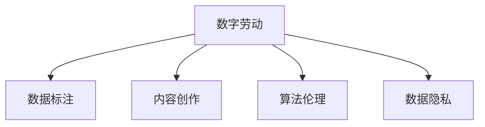

                 

# 数字劳动：人类计算的社会和经济影响分析

> 关键词：数字劳动, 人类计算, 社会影响, 经济影响, 算法伦理, 人工智能, 数据隐私

## 1. 背景介绍

### 1.1 问题由来

随着信息技术的飞速发展，数字劳动（Digital Labor）已经成为现代经济体系的重要组成部分。数字劳动是指人类在数字化工具和平台的帮助下，利用算法和数据进行工作的活动，涵盖了数据收集、数据标注、内容创作、知识检索等多个环节。数字劳动的兴起不仅改变了工作方式和生产组织模式，也引发了广泛的社会和经济影响。

### 1.2 问题核心关键点

数字劳动的核心在于人类与计算工具的深度融合。它使得人类可以在计算工具的辅助下，以更加高效、灵活的方式完成各种复杂任务。然而，这种融合也带来了诸多挑战，包括数据隐私、算法伦理、社会不平等以及经济利益分配等问题。因此，对数字劳动进行深入分析，了解其社会和经济影响，具有重要意义。

### 1.3 问题研究意义

研究数字劳动的社会和经济影响，对于理解现代经济和社会的变迁，制定相关政策，保护劳动者权益，具有重要的理论和实践价值：

1. **理解经济结构变化**：数字劳动改变了传统产业结构，推动了新兴产业的发展，研究其影响有助于把握经济发展的方向。
2. **应对社会不平等**：数字劳动使得知识、技能的不平等加剧，研究其影响有助于制定公平的社会政策。
3. **促进算法伦理**：数字劳动涉及大量数据和算法的使用，研究其影响有助于推动算法伦理的发展。
4. **保护数据隐私**：数字劳动依赖于数据的收集和利用，研究其影响有助于保护个人隐私和数据安全。

## 2. 核心概念与联系

### 2.1 核心概念概述

数字劳动涉及多个核心概念，包括：

- **数字劳动**：人类在数字化工具和平台上利用算法和数据进行工作的活动，如数据标注、内容创作、知识检索等。
- **数据标注**：在机器学习中，标注数据是模型训练的重要步骤，涉及对数据进行分类、标注等操作。
- **内容创作**：利用算法工具进行文本、图像、音频等内容的创作和编辑，如生成式模型、内容推荐系统等。
- **算法伦理**：涉及算法设计和使用的道德规范，确保算法的透明性、公平性、可解释性等。
- **数据隐私**：在数字劳动中，数据隐私保护是一个重要议题，涉及个人数据的收集、存储、使用和分享。

### 2.2 核心概念原理和架构的 Mermaid 流程图



此图展示了数字劳动与数据标注、内容创作、算法伦理、数据隐私等核心概念的联系。

## 3. 核心算法原理 & 具体操作步骤

### 3.1 算法原理概述

数字劳动的实现依赖于多种算法，如机器学习、自然语言处理、计算机视觉等。其核心算法原理包括以下几个方面：

- **监督学习**：通过有标注数据训练模型，实现分类、回归等任务。
- **无监督学习**：利用未标注数据发现数据的内在结构，如聚类、降维等。
- **强化学习**：通过与环境交互，学习最优策略以实现特定目标。
- **生成对抗网络（GAN）**：通过对抗训练生成逼真的数据和内容。

### 3.2 算法步骤详解

数字劳动的实现通常分为以下几个步骤：

1. **数据收集**：从互联网、社交媒体、公开数据库等渠道收集数据。
2. **数据预处理**：清洗数据，去除噪声，进行归一化等处理。
3. **特征提取**：使用算法工具提取数据的关键特征，如文本的词向量表示、图像的卷积特征等。
4. **模型训练**：利用训练数据训练机器学习模型，优化模型参数。
5. **模型评估**：在验证集或测试集上评估模型性能，调整超参数。
6. **模型部署**：将训练好的模型部署到生产环境，进行实时计算。

### 3.3 算法优缺点

数字劳动的算法具有以下优缺点：

- **优点**：
  - 高效性：算法可以自动化处理大量数据，提高工作效率。
  - 可扩展性：算法可以很容易地扩展到不同场景，适应多种任务。
  - 灵活性：算法可以根据需求灵活调整，实现个性化定制。

- **缺点**：
  - 数据依赖：算法的性能依赖于数据的质量和数量，数据偏差可能影响模型结果。
  - 模型复杂性：复杂算法需要较高的计算资源和时间成本。
  - 算法透明性：部分算法（如深度学习）的内部机制不透明，难以解释。

### 3.4 算法应用领域

数字劳动的算法广泛应用于多个领域，包括：

- **自然语言处理（NLP）**：文本分类、情感分析、机器翻译、对话系统等。
- **计算机视觉（CV）**：图像识别、目标检测、人脸识别、视频分析等。
- **推荐系统**：商品推荐、内容推荐、广告投放等。
- **智能客服**：智能问答、语音识别、图像识别等。
- **金融科技**：信用评估、风险管理、智能投顾等。

## 4. 数学模型和公式 & 详细讲解 & 举例说明

### 4.1 数学模型构建

以自然语言处理中的文本分类任务为例，我们定义一个简单的分类模型，用于将文本分为正负两类。设文本为 $x$，模型参数为 $\theta$，损失函数为 $L(\theta, x, y)$，其中 $y$ 为文本的标签。模型输出为 $y' = \sigma(\langle x, \theta \rangle)$，其中 $\sigma$ 为激活函数，$\langle \cdot, \cdot \rangle$ 为点积运算。

### 4.2 公式推导过程

使用逻辑回归模型，文本分类的损失函数为交叉熵损失：

$$
L(\theta, x, y) = -y \log y' - (1-y) \log (1-y')
$$

通过梯度下降等优化算法，模型参数 $\theta$ 的更新公式为：

$$
\theta \leftarrow \theta - \alpha \nabla_{\theta} L(\theta, x, y)
$$

其中 $\alpha$ 为学习率，$\nabla_{\theta} L(\theta, x, y)$ 为损失函数对模型参数的梯度。

### 4.3 案例分析与讲解

假设我们有一个简单的文本分类模型，用于将电影评论分为正面和负面两类。通过在IMDB电影评论数据集上训练，可以得到一个简单的文本分类器。使用该模型对新的电影评论进行分类，可以得到较高的准确率。

## 5. 项目实践：代码实例和详细解释说明

### 5.1 开发环境搭建

为了进行文本分类任务的实践，我们需要搭建以下开发环境：

1. **安装Python**：确保安装了最新版本的Python，推荐使用Anaconda或Miniconda。
2. **安装机器学习库**：安装Scikit-Learn、Numpy、Pandas等机器学习相关的Python库。
3. **安装深度学习库**：安装TensorFlow或PyTorch等深度学习库，用于构建和训练文本分类模型。
4. **数据集准备**：准备IMDB电影评论数据集，将其分为训练集和测试集。

### 5.2 源代码详细实现

以下是一个简单的文本分类模型的实现示例：

```python
import numpy as np
from sklearn.datasets import fetch_20newsgroups
from sklearn.feature_extraction.text import TfidfVectorizer
from sklearn.linear_model import LogisticRegression
from sklearn.metrics import accuracy_score
from sklearn.model_selection import train_test_split

# 加载IMDB数据集
data = fetch_20newsgroups(subset='train', categories=['alt.atheism', 'talk.religion.misc'])
X_train = data.data
y_train = data.target

# 数据预处理
vectorizer = TfidfVectorizer()
X_train = vectorizer.fit_transform(X_train)

# 构建逻辑回归模型
model = LogisticRegression()
model.fit(X_train, y_train)

# 预测并评估
X_test = vectorizer.transform(data.data)
y_pred = model.predict(X_test)
accuracy = accuracy_score(y_pred, y_test)
print(f"Accuracy: {accuracy:.3f}")
```

### 5.3 代码解读与分析

上述代码实现了一个简单的文本分类器，主要步骤如下：

1. **数据加载**：使用Scikit-Learn的fetch_20newsgroups函数加载IMDB数据集。
2. **数据预处理**：使用TfidfVectorizer将文本转换为TF-IDF向量表示。
3. **模型构建**：使用Scikit-Learn的LogisticRegression构建逻辑回归模型。
4. **模型训练**：在训练集上训练模型。
5. **模型评估**：在测试集上评估模型性能，计算准确率。

## 6. 实际应用场景

### 6.1 智能客服系统

智能客服系统利用自然语言处理技术，通过理解用户的问题并提供合适的答案，提高客户服务效率。数字劳动在智能客服系统中主要用于：

- **文本预处理**：清洗和标准化用户的输入，提取关键信息。
- **意图识别**：使用NLP技术识别用户的问题意图。
- **答案生成**：根据意图生成合适的答案，进行对话管理。
- **情感分析**：分析用户情感，提供更个性化的服务。

### 6.2 金融科技

金融科技领域利用数字劳动进行风险管理、信用评估、智能投顾等任务。数字劳动在金融科技中的作用包括：

- **数据清洗**：清洗和整合金融数据，消除噪声。
- **特征提取**：提取重要的金融特征，如信用评分、风险评级等。
- **模型训练**：训练机器学习模型，进行风险预测、信用评估等。
- **实时计算**：实时处理金融数据，进行交易决策和风险控制。

### 6.3 智能推荐系统

智能推荐系统利用数字劳动进行商品推荐、内容推荐等任务。数字劳动在智能推荐系统中的作用包括：

- **用户画像**：构建用户画像，了解用户兴趣和行为。
- **物品推荐**：使用协同过滤、深度学习等技术进行物品推荐。
- **数据处理**：处理和分析推荐数据，优化推荐算法。
- **系统优化**：优化推荐系统性能，提高用户体验。

### 6.4 未来应用展望

未来，数字劳动在更多领域将发挥重要作用。数字劳动的应用前景包括：

- **医疗健康**：利用数字劳动进行疾病诊断、患者管理等。
- **智能制造**：利用数字劳动进行设备监测、预测性维护等。
- **智慧城市**：利用数字劳动进行城市管理、交通优化等。
- **农业科技**：利用数字劳动进行农作物监测、精准农业等。

## 7. 工具和资源推荐

### 7.1 学习资源推荐

1. **机器学习课程**：
   - Andrew Ng的Coursera课程：涵盖机器学习基础，适合初学者。
   - 吴恩达的深度学习课程：介绍深度学习理论和技术，适合进阶学习。

2. **NLP资源**：
   - Stanford的NLP课程：涵盖自然语言处理的基础和高级技术。
   - arXiv上的最新论文：关注最新的自然语言处理研究成果。

3. **推荐系统资源**：
   - Recommender Systems Specialization by Coursera：涵盖推荐系统的理论和技术。
   - Netflix Prize：了解推荐系统竞赛和最佳实践。

4. **智能客服资源**：
   - Amazon的Alexa技能开发：学习智能客服的开发和部署。
   - Google的Dialogflow：了解自然语言对话系统的构建。

### 7.2 开发工具推荐

1. **Python开发工具**：
   - Jupyter Notebook：交互式编程环境，适合研究和开发。
   - PyCharm：功能强大的IDE，支持Python开发。

2. **深度学习工具**：
   - TensorFlow：由Google开发的深度学习框架，支持分布式训练。
   - PyTorch：由Facebook开发的深度学习框架，易于使用和调试。

3. **数据处理工具**：
   - Pandas：数据处理和分析工具，支持大规模数据处理。
   - Scikit-Learn：机器学习库，提供多种常用算法和工具。

4. **可视化工具**：
   - Matplotlib：绘图工具，支持多种图表类型。
   - Seaborn：高级绘图工具，适合统计分析和数据可视化。

### 7.3 相关论文推荐

1. **机器学习相关论文**：
   - P. Nguyen, M. Simonyan: Robust Machine Learning Algorithms
   - G. Hinton, N. Dean: Neural Networks for Machine Learning

2. **自然语言处理相关论文**：
   - Y. Bengio: Learning Phrases, Words, and Sentences from Pixels
   - A. Y. Ng: On the Learning Dynamics of Multilayer Networks

3. **推荐系统相关论文**：
   - R. Srebro, Y. Singer, J. Goldstein: Maximum Margin Collaborative Filtering
   - K. G. Borgwardt: Learning Structured Domains

## 8. 总结：未来发展趋势与挑战

### 8.1 研究成果总结

本文通过分析数字劳动的核心概念、算法原理和操作步骤，探讨了数字劳动的社会和经济影响。数字劳动改变了工作方式和生产组织模式，推动了经济和社会的发展。然而，数字劳动也带来了数据隐私、算法伦理和社会不平等等挑战。

### 8.2 未来发展趋势

未来，数字劳动将进一步渗透到各个领域，推动经济和社会的发展。数字劳动的发展趋势包括：

1. **智能化程度提升**：随着算法的进步，数字劳动的智能化水平将进一步提升，适应更多复杂任务。
2. **跨领域融合**：数字劳动将与其他技术（如区块链、物联网等）进行深度融合，推动跨领域创新。
3. **数据驱动决策**：数字劳动将进一步推动数据驱动的决策过程，优化资源配置和管理。
4. **算法伦理普及**：算法伦理将得到更广泛的关注和研究，推动算法的透明性和公平性。
5. **隐私保护加强**：数据隐私保护技术将不断进步，保护用户数据安全。

### 8.3 面临的挑战

尽管数字劳动带来了诸多好处，但也面临着诸多挑战：

1. **数据隐私**：数字劳动依赖大量数据，数据隐私保护成为重要议题。
2. **算法透明性**：部分算法（如深度学习）的内部机制不透明，难以解释。
3. **社会不平等**：数字劳动可能导致知识、技能的不平等加剧，加剧社会不平等。
4. **算法伦理**：算法设计和使用的道德规范需要进一步完善。
5. **技术壁垒**：数字劳动涉及复杂的技术和算法，需要专业知识和技能。

### 8.4 研究展望

未来的研究需要在以下几个方面进行探索：

1. **隐私保护技术**：研究更加有效的数据隐私保护技术，保护用户隐私。
2. **算法透明性**：研究算法透明性技术，提高算法的可解释性。
3. **社会公平性**：研究如何通过数字劳动促进社会公平，减少社会不平等。
4. **跨领域融合**：研究数字劳动与其他技术的深度融合，推动跨领域创新。
5. **伦理规范**：研究数字劳动的伦理规范，推动算法伦理的发展。

## 9. 附录：常见问题与解答

**Q1：数字劳动对个人隐私有何影响？**

A: 数字劳动涉及大量数据的收集和处理，个人隐私保护是一个重要议题。数字劳动可能导致数据泄露、身份盗窃等问题。为了保护个人隐私，需要采取数据加密、匿名化、数据访问控制等措施。

**Q2：如何提高数字劳动算法的透明性？**

A: 提高算法透明性需要从多个方面入手：

1. **模型解释**：使用模型解释工具，如LIME、SHAP等，解释算法的决策过程。
2. **可解释性设计**：在设计算法时，考虑算法的可解释性，使用简单的模型和特征。
3. **算法公开**：开放算法的源代码和论文，促进学术交流和研究。

**Q3：数字劳动如何影响社会不平等？**

A: 数字劳动可能导致知识、技能的不平等加剧，加剧社会不平等。数字劳动需要高水平的技能和知识，只有具备相关技能的人才能获得高薪工作。为了减少社会不平等，需要提供更多的教育和培训机会，普及数字劳动技能。

**Q4：数字劳动对经济有哪些影响？**

A: 数字劳动推动了经济的发展，提高了生产效率和竞争力。数字劳动使得许多传统行业向智能化、自动化方向发展，提高了生产效率和经济效益。然而，数字劳动也可能导致一些低技能工人失业，需要关注社会稳定和就业问题。

---

作者：禅与计算机程序设计艺术 / Zen and the Art of Computer Programming

