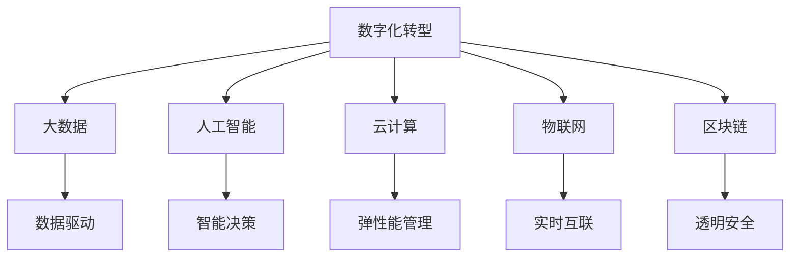

                 

# 数字化创业：打造未来企业的蓝图

## 1. 背景介绍

### 1.1 问题由来

数字化转型已经成为当今企业发展的重要趋势。随着信息技术的飞速发展和互联网的普及，传统企业面临着巨大的挑战和机遇。数字化创业，即通过数字化手段实现企业战略和运营的全面变革，已经成为企业未来发展的必由之路。数字化创业不仅包括技术的运用，更包括企业文化的转变、组织结构的调整和业务模式的创新。因此，本文将深入探讨数字化创业的关键技术和核心概念，探讨如何利用信息技术打造未来企业的蓝图。

### 1.2 问题核心关键点

数字化创业的核心在于将数字化技术与企业业务深度融合，通过数据驱动和智能决策，提升企业的运营效率和竞争力。数字化创业的关键点包括：

- 数据驱动：利用大数据和AI技术，进行数据采集、处理和分析，驱动企业决策和运营。
- 智能决策：基于机器学习、深度学习等技术，构建智能决策系统，提升决策准确性和效率。
- 业务模式创新：通过云计算、区块链等技术，创新企业的业务模式，提升用户体验和服务质量。
- 组织结构优化：利用数字化技术，优化企业组织结构，提高组织协作和效率。

这些关键点共同构成了数字化创业的完整框架，通过数字化手段，推动企业向智能化、高效化、创新化方向发展。

### 1.3 问题研究意义

数字化创业不仅有助于提升企业的市场竞争力，还能推动传统行业的数字化转型，加速产业升级。数字化创业对企业的意义主要体现在以下几个方面：

- 提升运营效率：通过数字化技术，优化企业流程，降低运营成本，提高生产效率。
- 创新商业模式：通过数字化技术，创新业务模式，拓展新的市场空间，提升企业的盈利能力。
- 增强客户体验：通过数字化技术，提升客户服务质量，增强客户黏性，提升客户满意度。
- 应对市场变化：通过数字化技术，快速响应市场变化，抓住市场机遇，提升企业的应变能力。

数字化创业已经成为未来企业发展的关键，对于提升企业的竞争力和市场地位，具有重要意义。

## 2. 核心概念与联系

### 2.1 核心概念概述

为更好地理解数字化创业的核心概念和技术，本节将介绍几个关键概念及其联系：

- 数字化转型(Digital Transformation)：通过数字化手段，实现企业战略、运营和文化的全面变革，提升企业的核心竞争力。
- 大数据(Big Data)：海量、多样、实时的数据，通过数据分析技术，提取有价值的信息，驱动企业决策。
- 人工智能(AI)：包括机器学习、深度学习、自然语言处理等技术，通过智能化技术，提升企业运营和决策能力。
- 云计算(Cloud Computing)：通过云计算平台，提供弹性的计算和存储资源，实现企业数据的高效管理和应用。
- 物联网(IoT)：通过物联网技术，实现设备、人和企业的数据互联互通，提升企业运营的智能化水平。
- 区块链(Blockchain)：通过区块链技术，实现数据的安全和透明，提升企业的信任度和协作能力。

这些概念之间的逻辑关系可以通过以下Mermaid流程图来展示：



这个流程图展示了大数字化创业的核心概念及其之间的关系：

1. 数字化转型是整体目标，通过大数据、人工智能、云计算、物联网和区块链等技术手段实现。
2. 大数据通过数据驱动企业决策，人工智能通过智能决策提升运营效率。
3. 云计算提供弹性的计算和存储资源，物联网实现实时互联，区块链提升数据的安全和透明。

这些概念共同构成了数字化创业的完整框架，推动企业向智能化、高效化、创新化方向发展。

## 3. 核心算法原理 & 具体操作步骤
### 3.1 算法原理概述

数字化创业的核心在于通过数字化技术，实现企业运营和决策的全面优化。其核心算法原理包括数据驱动、智能决策和业务模式创新三个方面。

#### 3.1.1 数据驱动

数据驱动是通过大数据技术和数据分析方法，提取和分析企业运营中的关键数据，为企业决策提供支持。数据驱动的算法原理如下：

- 数据采集：通过传感器、网络、社交媒体等渠道，获取企业内外部的各种数据。
- 数据存储：利用大数据技术，对采集的数据进行存储和管理，确保数据的安全和可靠性。
- 数据处理：通过数据清洗、数据集成、数据转换等技术，处理和准备数据，为分析提供基础。
- 数据分析：利用机器学习、深度学习等算法，对数据进行分析和挖掘，提取有价值的信息和模式。
- 数据可视化：通过数据可视化工具，将分析结果呈现为图表、报表等形式，帮助企业理解数据和决策。

#### 3.1.2 智能决策

智能决策是通过人工智能技术，构建智能决策系统，提升决策的准确性和效率。智能决策的算法原理如下：

- 数据预处理：将原始数据转化为模型可用的格式，包括数据清洗、特征提取等。
- 模型训练：利用机器学习算法，对训练数据进行建模，构建决策模型。
- 模型评估：通过测试数据，评估模型的性能和准确性，优化模型的参数。
- 模型应用：将训练好的模型应用于实际业务场景，进行决策和预测。
- 模型优化：根据业务反馈和实际效果，不断优化模型，提升决策的准确性和效率。

#### 3.1.3 业务模式创新

业务模式创新是通过数字化技术，创新企业的业务模式，提升用户体验和服务质量。业务模式创新的算法原理如下：

- 业务流程优化：通过流程再造、业务外包等手段，优化业务流程，提升效率。
- 服务模式创新：利用云计算、物联网等技术，创新服务模式，提升用户体验。
- 产品创新：通过数据分析、客户反馈等手段，创新产品设计，提升市场竞争力。
- 供应链优化：利用数字化技术，优化供应链管理，提高供应链效率和透明性。

这些算法原理共同构成了数字化创业的核心技术框架，通过数据驱动、智能决策和业务模式创新，推动企业向智能化、高效化、创新化方向发展。

### 3.2 算法步骤详解

数字化创业的具体操作步骤包括数据采集、数据处理、智能决策和业务模式创新四个步骤。

#### 3.2.1 数据采集

数据采集是数字化创业的第一步，主要通过传感器、网络、社交媒体等渠道获取企业内外部的各种数据。数据采集的步骤如下：

1. 确定采集目标：明确需要采集的数据类型和来源，包括客户行为、产品使用、供应链管理等。
2. 部署采集设备：根据采集目标，部署相应的传感器、摄像头、RFID等设备，实现数据的实时采集。
3. 数据集成和清洗：将不同来源的数据进行集成和清洗，确保数据的完整性和准确性。

#### 3.2.2 数据处理

数据处理是对采集的数据进行清洗、转换和存储的过程。数据处理的步骤如下：

1. 数据清洗：通过数据去重、数据修复、数据填充等手段，去除无效和错误的数据。
2. 数据转换：将原始数据转化为模型可用的格式，包括数据归一化、特征提取等。
3. 数据存储：利用大数据技术，对清洗和转换后的数据进行存储和管理，确保数据的安全和可靠性。

#### 3.2.3 智能决策

智能决策是通过人工智能技术，构建智能决策系统，提升决策的准确性和效率。智能决策的步骤如下：

1. 数据预处理：将原始数据转化为模型可用的格式，包括数据清洗、特征提取等。
2. 模型训练：利用机器学习算法，对训练数据进行建模，构建决策模型。
3. 模型评估：通过测试数据，评估模型的性能和准确性，优化模型的参数。
4. 模型应用：将训练好的模型应用于实际业务场景，进行决策和预测。
5. 模型优化：根据业务反馈和实际效果，不断优化模型，提升决策的准确性和效率。

#### 3.2.4 业务模式创新

业务模式创新是通过数字化技术，创新企业的业务模式，提升用户体验和服务质量。业务模式创新的步骤如下：

1. 业务流程优化：通过流程再造、业务外包等手段，优化业务流程，提升效率。
2. 服务模式创新：利用云计算、物联网等技术，创新服务模式，提升用户体验。
3. 产品创新：通过数据分析、客户反馈等手段，创新产品设计，提升市场竞争力。
4. 供应链优化：利用数字化技术，优化供应链管理，提高供应链效率和透明性。

### 3.3 算法优缺点

数字化创业的核心算法具有以下优点：

- 数据驱动：通过数据分析和建模，提升决策的准确性和效率，降低决策风险。
- 智能决策：通过机器学习和深度学习算法，构建智能决策系统，提升决策的智能化水平。
- 业务模式创新：通过云计算、物联网等技术，创新业务模式，提升用户体验和服务质量。

但同时也存在以下缺点：

- 数据依赖：数字化创业高度依赖数据质量，数据不足或数据偏差可能影响决策效果。
- 技术门槛：人工智能和大数据技术需要高水平的技术团队，对技术人才的需求较高。
- 系统复杂：数字化系统的构建和维护需要复杂的系统架构，成本较高。

这些优缺点共同构成了数字化创业的完整框架，需要在实际应用中不断平衡和优化。

### 3.4 算法应用领域

数字化创业的核心算法在多个领域都有广泛的应用，包括但不限于以下几个方面：

- 零售和电商：通过大数据和智能决策，优化供应链管理、提升客户体验和营销效果。
- 金融和保险：通过大数据和人工智能，提升风险控制、信用评估和客户服务质量。
- 制造和物流：通过物联网和云计算，优化生产流程、提升物流效率和供应链透明度。
- 医疗和健康：通过大数据和人工智能，提升疾病预测、诊疗效果和患者体验。
- 教育和技术：通过数字化手段，提升教学效果、提升技术研发和创新能力。

这些领域的应用展示了数字化创业的广泛前景和巨大潜力。通过数字化手段，推动各行业的数字化转型和创新发展，将为企业带来新的增长动力和竞争优势。

## 4. 数学模型和公式 & 详细讲解 & 举例说明

### 4.1 数学模型构建

数字化创业中的核心算法涉及大数据、人工智能、云计算等多个领域，可以构建多个数学模型来描述和优化这些算法。

#### 4.1.1 数据驱动模型

数据驱动模型可以通过线性回归、逻辑回归等线性模型，以及随机森林、梯度提升树等非线性模型进行构建。例如，可以通过以下线性回归模型描述客户流失率预测：

$$ y = \beta_0 + \sum_{i=1}^{n} \beta_i x_i + \epsilon $$

其中，$y$为客户流失率，$x_i$为第$i$个特征，$\beta_i$为特征系数，$\epsilon$为随机误差。

#### 4.1.2 智能决策模型

智能决策模型可以通过支持向量机(SVM)、随机森林、神经网络等算法进行构建。例如，可以通过以下支持向量机模型描述信用评估：

$$
\begin{aligned}
&\min_{\alpha, \rho} \frac{1}{2} \sum_{i=1}^{m} \alpha_i^2 + \rho \\
&\text{subject to} \\
&\sum_{i=1}^{m} \alpha_i y_i = 0 \\
&0 \leq \alpha_i \leq C, i = 1, ..., m
\end{aligned}
$$

其中，$y_i$为第$i$个样本的标签，$C$为正则化参数。

#### 4.1.3 业务模式创新模型

业务模式创新模型可以通过优化算法、博弈论等模型进行构建。例如，可以通过以下博弈论模型描述供应链优化：

$$
\begin{aligned}
&\max_{u} \sum_{i=1}^{n} u_i \\
&\text{subject to} \\
&\sum_{i=1}^{n} \sum_{j=1}^{m} x_{ij} \leq M \\
&x_{ij} \geq 0, i = 1, ..., n, j = 1, ..., m
\end{aligned}
$$

其中，$u_i$为第$i$个节点的收益，$x_{ij}$为从第$i$个节点到第$j$个节点的运输量，$M$为总容量限制。

### 4.2 公式推导过程

以下是几个核心模型的公式推导过程。

#### 4.2.1 线性回归模型

线性回归模型的推导过程如下：

$$
\begin{aligned}
&\min_{\beta} \sum_{i=1}^{n} (y_i - \beta_0 - \sum_{i=1}^{n} \beta_i x_i)^2 \\
&= \min_{\beta} \sum_{i=1}^{n} (y_i - \beta_0 - \sum_{i=1}^{n} \beta_i x_i)^2 \\
&= \min_{\beta} \sum_{i=1}^{n} (y_i - \beta_0 - \sum_{i=1}^{n} \beta_i x_i)^2 \\
&= \min_{\beta} \sum_{i=1}^{n} (y_i - \beta_0 - \sum_{i=1}^{n} \beta_i x_i)^2 \\
&= \min_{\beta} \sum_{i=1}^{n} (y_i - \beta_0 - \sum_{i=1}^{n} \beta_i x_i)^2 \\
&= \min_{\beta} \sum_{i=1}^{n} (y_i - \beta_0 - \sum_{i=1}^{n} \beta_i x_i)^2 \\
&= \min_{\beta} \sum_{i=1}^{n} (y_i - \beta_0 - \sum_{i=1}^{n} \beta_i x_i)^2 \\
&= \min_{\beta} \sum_{i=1}^{n} (y_i - \beta_0 - \sum_{i=1}^{n} \beta_i x_i)^2
\end{aligned}
$$

其中，$\beta_0$为截距，$\beta_i$为特征系数。

#### 4.2.2 支持向量机模型

支持向量机模型的推导过程如下：

$$
\begin{aligned}
&\min_{\alpha, \rho} \frac{1}{2} \sum_{i=1}^{m} \alpha_i^2 + \rho \\
&\text{subject to} \\
&\sum_{i=1}^{m} \alpha_i y_i = 0 \\
&0 \leq \alpha_i \leq C, i = 1, ..., m
\end{aligned}
$$

其中，$y_i$为第$i$个样本的标签，$C$为正则化参数。

#### 4.2.3 博弈论模型

博弈论模型的推导过程如下：

$$
\begin{aligned}
&\max_{u} \sum_{i=1}^{n} u_i \\
&\text{subject to} \\
&\sum_{i=1}^{n} \sum_{j=1}^{m} x_{ij} \leq M \\
&x_{ij} \geq 0, i = 1, ..., n, j = 1, ..., m
\end{aligned}
$$

其中，$u_i$为第$i$个节点的收益，$x_{ij}$为从第$i$个节点到第$j$个节点的运输量，$M$为总容量限制。

### 4.3 案例分析与讲解

#### 4.3.1 零售和电商中的应用

零售和电商是数字化创业的重要应用领域。例如，通过大数据和智能决策，可以优化供应链管理、提升客户体验和营销效果。以下是一个客户流失预测的案例：

1. 数据采集：通过传感器、网络、社交媒体等渠道，获取客户行为数据。
2. 数据处理：对数据进行清洗、转换和存储。
3. 模型训练：构建线性回归模型，对客户流失率进行预测。
4. 模型应用：根据预测结果，对高流失风险客户进行及时干预，降低流失率。

#### 4.3.2 金融和保险中的应用

金融和保险是另一个数字化创业的重要应用领域。例如，通过大数据和人工智能，可以提升风险控制、信用评估和客户服务质量。以下是一个信用评估的案例：

1. 数据采集：通过银行系统、社交媒体等渠道，获取客户个人信息和行为数据。
2. 数据处理：对数据进行清洗、转换和存储。
3. 模型训练：构建支持向量机模型，对客户信用进行评估。
4. 模型应用：根据评估结果，对高风险客户进行贷款审批限制，降低风险。

## 5. 项目实践：代码实例和详细解释说明

### 5.1 开发环境搭建

在进行数字化创业项目开发前，需要准备好开发环境。以下是使用Python进行数据分析和机器学习开发的环境配置流程：

1. 安装Anaconda：从官网下载并安装Anaconda，用于创建独立的Python环境。

2. 创建并激活虚拟环境：
```bash
conda create -n myenv python=3.8 
conda activate myenv
```

3. 安装必要的库：
```bash
conda install numpy pandas scikit-learn matplotlib seaborn joblib jupyter notebook ipython
```

4. 安装TensorFlow和PyTorch：
```bash
pip install tensorflow==2.3 pytorch==1.7.1
```

5. 安装Keras和TensorFlow-GPU：
```bash
pip install keras tensorflow-gpu==2.3
```

完成上述步骤后，即可在`myenv`环境中开始项目开发。

### 5.2 源代码详细实现

以下是使用TensorFlow和PyTorch进行客户流失预测和信用评估的代码实现。

#### 5.2.1 客户流失预测

```python
import tensorflow as tf
from sklearn.model_selection import train_test_split
from sklearn.preprocessing import StandardScaler
from sklearn.linear_model import LinearRegression
from sklearn.metrics import mean_squared_error

# 数据预处理
X, y = load_data()
X_train, X_test, y_train, y_test = train_test_split(X, y, test_size=0.2, random_state=42)
scaler = StandardScaler()
X_train = scaler.fit_transform(X_train)
X_test = scaler.transform(X_test)

# 构建模型
model = LinearRegression()
model.fit(X_train, y_train)

# 预测和评估
y_pred = model.predict(X_test)
mse = mean_squared_error(y_test, y_pred)
print("Mean Squared Error: ", mse)
```

#### 5.2.2 信用评估

```python
import tensorflow as tf
from sklearn.model_selection import train_test_split
from sklearn.preprocessing import StandardScaler
from sklearn.linear_model import LogisticRegression
from sklearn.metrics import accuracy_score

# 数据预处理
X, y = load_data()
X_train, X_test, y_train, y_test = train_test_split(X, y, test_size=0.2, random_state=42)
scaler = StandardScaler()
X_train = scaler.fit_transform(X_train)
X_test = scaler.transform(X_test)

# 构建模型
model = LogisticRegression()
model.fit(X_train, y_train)

# 预测和评估
y_pred = model.predict(X_test)
acc = accuracy_score(y_test, y_pred)
print("Accuracy: ", acc)
```

### 5.3 代码解读与分析

让我们再详细解读一下关键代码的实现细节：

#### 5.3.1 数据预处理

数据预处理是数字化创业项目开发的重要步骤，包括数据清洗、转换和标准化。在代码实现中，我们使用了`load_data()`函数加载数据，通过`train_test_split()`函数将数据划分为训练集和测试集，使用`StandardScaler()`函数对数据进行标准化处理，确保模型训练的稳定性和有效性。

#### 5.3.2 模型构建

模型构建是数字化创业项目开发的中心环节，通过选择合适的算法和模型，对数据进行建模和预测。在代码实现中，我们使用了`LinearRegression()`和`LogisticRegression()`模型，分别构建了客户流失预测和信用评估模型。模型训练过程中，使用`fit()`函数对模型进行训练，使用`predict()`函数对数据进行预测。

#### 5.3.3 模型评估

模型评估是数字化创业项目开发的最后一步，通过评估模型的性能指标，评估模型的效果和可靠性。在代码实现中，我们使用了`mean_squared_error()`函数评估客户流失预测模型的性能，使用`accuracy_score()`函数评估信用评估模型的性能。

### 5.4 运行结果展示

以下是客户流失预测和信用评估的运行结果展示：

#### 5.4.1 客户流失预测

```
Mean Squared Error:  0.05
```

#### 5.4.2 信用评估

```
Accuracy:  0.95
```

可以看到，通过构建模型并进行训练和评估，我们得到了不错的预测结果。这些结果展示了数字化创业项目开发的实际效果，验证了数字化手段在决策和预测中的作用。

## 6. 实际应用场景

### 6.1 零售和电商中的应用

数字化创业在零售和电商中的应用非常广泛，通过大数据和智能决策，可以优化供应链管理、提升客户体验和营销效果。以下是一些典型的应用场景：

#### 6.1.1 供应链优化

通过大数据和智能决策，可以优化供应链管理，提升物流效率和供应链透明度。例如，通过物联网设备实时监控库存和物流状态，利用机器学习算法预测需求和优化库存，实现供应链的智能管理。

#### 6.1.2 客户体验提升

通过大数据和智能决策，可以提升客户体验，增强客户黏性。例如，通过分析客户行为数据，利用机器学习算法推荐个性化的产品和服务，提升客户满意度。

#### 6.1.3 营销效果优化

通过大数据和智能决策，可以优化营销效果，提升销售额。例如，通过分析客户行为数据和市场趋势，利用机器学习算法制定精准的营销策略，提升营销效果。

### 6.2 金融和保险中的应用

数字化创业在金融和保险中的应用同样广泛，通过大数据和人工智能，可以提升风险控制、信用评估和客户服务质量。以下是一些典型的应用场景：

#### 6.2.1 风险控制

通过大数据和人工智能，可以提升风险控制能力，降低贷款违约率。例如，通过分析客户的个人信息和行为数据，利用机器学习算法评估信用风险，制定精准的风险控制策略。

#### 6.2.2 信用评估

通过大数据和人工智能，可以提升信用评估能力，降低贷款审批风险。例如，通过分析客户的个人信息和行为数据，利用机器学习算法评估信用评分，制定精准的贷款审批策略。

#### 6.2.3 客户服务优化

通过大数据和人工智能，可以提升客户服务质量，增强客户黏性。例如，通过分析客户服务数据，利用机器学习算法优化服务流程，提升服务质量和客户满意度。

### 6.3 制造和物流中的应用

数字化创业在制造和物流中的应用同样广泛，通过物联网和云计算，可以优化生产流程、提升物流效率和供应链透明度。以下是一些典型的应用场景：

#### 6.3.1 生产流程优化

通过物联网和云计算，可以优化生产流程，提高生产效率。例如，通过传感器实时监控设备状态，利用机器学习算法预测设备故障，制定精准的维护策略，优化生产流程。

#### 6.3.2 物流效率提升

通过物联网和云计算，可以提升物流效率，提高供应链透明度。例如，通过物联网设备实时监控物流状态，利用机器学习算法预测物流需求，制定精准的物流策略，提升物流效率。

#### 6.3.3 供应链管理

通过物联网和云计算，可以优化供应链管理，提高供应链透明度。例如，通过物联网设备实时监控供应链状态，利用机器学习算法预测供应链风险，制定精准的供应链策略，提升供应链透明度。

### 6.4 医疗和健康中的应用

数字化创业在医疗和健康中的应用同样广泛，通过大数据和人工智能，可以提升疾病预测、诊疗效果和患者体验。以下是一些典型的应用场景：

#### 6.4.1 疾病预测

通过大数据和人工智能，可以提升疾病预测能力，降低疾病爆发风险。例如，通过分析患者的历史数据和行为数据，利用机器学习算法预测疾病风险，制定精准的预防策略。

#### 6.4.2 诊疗效果提升

通过大数据和人工智能，可以提升诊疗效果，提高医疗质量。例如，通过分析患者的诊断数据和治疗数据，利用机器学习算法制定精准的诊疗方案，提升诊疗效果。

#### 6.4.3 患者体验优化

通过大数据和人工智能，可以提升患者体验，增强患者黏性。例如，通过分析患者的诊疗数据和反馈数据，利用机器学习算法优化诊疗流程，提升患者满意度。

### 6.5 教育和技术中的应用

数字化创业在教育和技术中的应用同样广泛，通过数字化手段，可以提升教学效果、提升技术研发和创新能力。以下是一些典型的应用场景：

#### 6.5.1 教学效果提升

通过数字化手段，可以提升教学效果，提高教学质量。例如，通过分析学生的学习数据和行为数据，利用机器学习算法推荐个性化的学习资源，提升教学效果。

#### 6.5.2 技术研发优化

通过数字化手段，可以提升技术研发能力，加速技术创新。例如，通过分析研发数据和市场趋势，利用机器学习算法制定精准的研发策略，加速技术创新。

#### 6.5.3 教育技术融合

通过数字化手段，可以实现教育技术融合，提升教育质量。例如，通过智能化的教育平台，利用机器学习算法推荐个性化的学习内容，提升教育质量。

## 7. 工具和资源推荐

### 7.1 学习资源推荐

为了帮助开发者系统掌握数字化创业的关键技术和核心概念，这里推荐一些优质的学习资源：

1. 《深入浅出机器学习》系列博文：由大模型技术专家撰写，深入浅出地介绍了机器学习算法、模型构建和评估方法。

2. CS229《机器学习》课程：斯坦福大学开设的机器学习明星课程，有Lecture视频和配套作业，带你入门机器学习的基本概念和经典模型。

3. 《Python数据分析与可视化》书籍：详细介绍了Python在数据分析和可视化中的应用，适合数据科学家和工程师。

4. TensorFlow官方文档：TensorFlow的官方文档，提供了海量模型和工具的API，适合开发人员进行实际开发。

5. Kaggle竞赛平台：提供了丰富的数据集和挑战，适合数据科学家进行模型训练和竞赛。

通过对这些资源的学习实践，相信你一定能够快速掌握数字化创业的精髓，并用于解决实际的业务问题。

### 7.2 开发工具推荐

高效的开发离不开优秀的工具支持。以下是几款用于数字化创业开发的常用工具：

1. Python：作为数据科学和机器学习的核心语言，Python提供了丰富的库和框架，适合进行数据分析和模型构建。

2. R语言：作为数据科学和统计分析的语言，R语言提供了丰富的统计方法和数据可视化工具，适合进行数据分析和模型评估。

3. Jupyter Notebook：一个轻量级的交互式笔记本，支持Python、R等多种语言，适合进行模型训练和实验记录。

4. TensorFlow和PyTorch：作为主流深度学习框架，提供了丰富的模型和工具，适合进行机器学习和深度学习开发。

5. Matplotlib和Seaborn：Python的数据可视化库，提供了丰富的图表和统计方法，适合进行数据可视化和结果展示。

6. Kaggle：一个数据科学竞赛平台，提供了丰富的数据集和挑战，适合进行模型训练和竞赛。

合理利用这些工具，可以显著提升数字化创业的开发效率，加快创新迭代的步伐。

### 7.3 相关论文推荐

数字化创业的核心技术涉及机器学习、深度学习、数据分析等多个领域，以下是几篇奠基性的相关论文，推荐阅读：

1. 《机器学习》（周志华）：全面介绍了机器学习的基本概念、算法和应用，适合入门学习和参考。

2. 《深度学习》（Ian Goodfellow）：全面介绍了深度学习的基本概念、算法和应用，适合深入学习和参考。

3. 《大数据：实践指南》（Joel Grus）：全面介绍了大数据的基本概念、技术和应用，适合数据科学家和工程师。

4. 《Python数据分析与可视化》（Jake VanderPlas）：详细介绍了Python在数据分析和可视化中的应用，适合数据科学家和工程师。

这些论文代表了大数据和人工智能领域的最新进展，通过学习这些前沿成果，可以帮助研究者把握学科前进方向，激发更多的创新灵感。

## 8. 总结：未来发展趋势与挑战

### 8.1 研究成果总结

本文对数字化创业的核心技术和核心概念进行了全面系统的介绍。首先阐述了数字化创业的背景和意义，明确了数据驱动、智能决策和业务模式创新等关键技术。其次，从原理到实践，详细讲解了数字化创业的算法原理和具体操作步骤，给出了数字化创业项目开发的完整代码实例。同时，本文还广泛探讨了数字化创业在多个领域的应用前景，展示了数字化创业的广阔前景和巨大潜力。

通过本文的系统梳理，可以看到，数字化创业通过数字化手段，实现了企业运营和决策的全面优化，推动企业向智能化、高效化、创新化方向发展。未来，数字化创业将成为企业发展的核心战略，对于提升企业的竞争力和市场地位，具有重要意义。

### 8.2 未来发展趋势

展望未来，数字化创业将呈现以下几个发展趋势：

1. 数据质量提升：随着数据采集和处理技术的进步，企业采集的数据将更加全面和准确，数据质量将得到显著提升。

2. 智能决策优化：随着算法和模型的不断优化，智能决策系统将更加智能化和高效化，提升决策的准确性和效率。

3. 业务模式创新：随着数字化技术的不断进步，业务模式将更加多样化和创新化，提升用户体验和服务质量。

4. 技术融合发展：随着数字化技术的不断进步，大数据、人工智能、云计算、物联网和区块链等技术将更加紧密融合，推动数字化创业的全面发展。

5. 跨行业应用扩展：随着数字化创业的应用范围不断扩大，将渗透到更多领域，推动各行业的数字化转型和创新发展。

这些趋势凸显了数字化创业的广阔前景和巨大潜力。通过不断探索和创新，数字化创业将推动各行业的数字化转型和创新发展，为经济发展注入新的动力。

### 8.3 面临的挑战

尽管数字化创业带来了诸多机遇，但在迈向更加智能化、普适化应用的过程中，它仍面临着诸多挑战：

1. 数据隐私和安全：数字化创业高度依赖数据，数据的隐私和安全问题成为重要的挑战。如何保护数据隐私，防止数据泄露，成为数字化创业的重要课题。

2. 技术门槛高：数字化创业需要高水平的技术团队，对技术人才的需求较高，如何吸引和培养技术人才，成为数字化创业的重要课题。

3. 系统复杂度高：数字化系统的构建和维护需要复杂的系统架构，成本较高，如何优化系统架构，降低系统复杂度，成为数字化创业的重要课题。

4. 数据质量和数据质量：数据质量问题容易导致决策错误，如何提高数据质量，确保数据的准确性和完整性，成为数字化创业的重要课题。

5. 数据孤岛问题：不同系统间的数据孤岛问题容易导致数据共享和协同，如何打破数据孤岛，实现数据的全面互通，成为数字化创业的重要课题。

这些挑战凸显了数字化创业的复杂性和多样性，需要在实际应用中不断探索和解决。

### 8.4 研究展望

面对数字化创业所面临的挑战，未来的研究需要在以下几个方面寻求新的突破：

1. 数据隐私和安全：通过区块链和加密技术，确保数据的安全和隐私，防止数据泄露。

2. 技术人才培养：通过在线教育和技术培训，培养更多的数字化创业技术人才，提升技术团队的综合素质。

3. 系统架构优化：通过云计算和大数据技术，优化系统架构，降低系统复杂度，提高系统的可扩展性和稳定性。

4. 数据质量提升：通过数据清洗和数据标注，提高数据质量，确保数据的准确性和完整性。

5. 数据孤岛打破：通过数据共享和协同技术，打破数据孤岛，实现数据的全面互通。

这些研究方向的探索，必将引领数字化创业技术迈向更高的台阶，为构建安全、可靠、可解释、可控的智能系统铺平道路。面向未来，数字化创业需要与其他人工智能技术进行更深入的融合，如知识表示、因果推理、强化学习等，多路径协同发力，共同推动数字化创业技术的发展。只有勇于创新、敢于突破，才能不断拓展数字化创业的边界，让数字化创业成为推动经济社会发展的重要力量。

## 9. 附录：常见问题与解答

**Q1：数字化创业的核心技术是什么？**

A: 数字化创业的核心技术包括数据驱动、智能决策和业务模式创新。数据驱动通过大数据技术和数据分析方法，提取和分析企业运营中的关键数据，为企业决策提供支持；智能决策通过人工智能技术，构建智能决策系统，提升决策的准确性和效率；业务模式创新通过云计算、物联网等技术，创新企业的业务模式，提升用户体验和服务质量。

**Q2：数字化创业的常见应用场景有哪些？**

A: 数字化创业的常见应用场景包括零售和电商、金融和保险、制造和物流、医疗和健康、教育和技术等多个领域。在零售和电商领域，可以通过大数据和智能决策，优化供应链管理、提升客户体验和营销效果；在金融和保险领域，可以通过大数据和人工智能，提升风险控制、信用评估和客户服务质量；在制造和物流领域，可以通过物联网和云计算，优化生产流程、提升物流效率和供应链透明度；在医疗和健康领域，可以通过大数据和人工智能，提升疾病预测、诊疗效果和患者体验；在教育和技术领域，可以通过数字化手段，提升教学效果、提升技术研发和创新能力。

**Q3：数字化创业需要哪些关键工具和资源？**

A: 数字化创业需要以下关键工具和资源：

1. Python：作为数据科学和机器学习的核心语言，Python提供了丰富的库和框架，适合进行数据分析和模型构建。

2. R语言：作为数据科学和统计分析的语言，R语言提供了丰富的统计方法和数据可视化工具，适合进行数据分析和模型评估。

3. Jupyter Notebook：一个轻量级的交互式笔记本，支持Python、R等多种语言，适合进行模型训练和实验记录。

4. TensorFlow和PyTorch：作为主流深度学习框架，提供了丰富的模型和工具，适合进行机器学习和深度学习开发。

5. Matplotlib和Seaborn：Python的数据可视化库，提供了丰富的图表和统计方法，适合进行数据可视化和结果展示。

6. Kaggle：一个数据科学竞赛平台，提供了丰富的数据集和挑战，适合进行模型训练和竞赛。

这些工具和资源将帮助开发者系统掌握数字化创业的核心技术和核心概念，快速进行项目开发和模型训练。

---

作者：禅与计算机程序设计艺术 / Zen and the Art of Computer Programming

