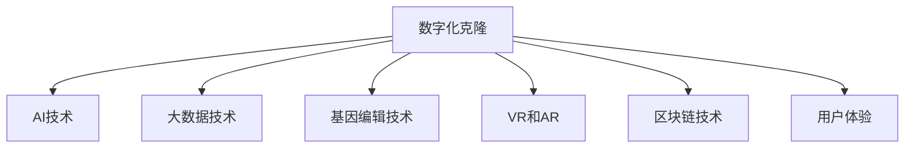

                 

# 数字化宠物克隆创业：永恒的宠物陪伴

## 1. 背景介绍

### 1.1 问题由来
近年来，随着人类对宠物的情感依赖日益加深，宠物的离世给主人的生活带来了巨大的情感打击。与此同时，科技的进步为宠物克隆提供了新的可能性，使得人们有机会通过数字化手段，延续与宠物的陪伴。基于这种背景，数字化宠物克隆创业应运而生，旨在为喜爱宠物的主人提供一条新的情感慰藉之路。

### 1.2 问题核心关键点
数字化宠物克隆创业的核心问题在于如何利用AI和大数据技术，将宠物的数字化信息复原到实体宠物上。这涉及以下几个关键点：
- 如何高效地获取和处理宠物的数字化信息，如DNA序列、图像、声音等。
- 如何将数字化信息与实体宠物相匹配，进行准确的克隆。
- 如何保证克隆宠物的生物学特性与原宠物一致，避免出现基因变异。
- 如何构建用户体验友好的数字化克隆平台，方便用户进行操作。
- 如何确保克隆过程中的数据隐私和安全性，避免数据泄露和滥用。

这些核心关键点构成了数字化宠物克隆创业的技术框架，需要跨学科的协同合作，包括AI、生物科技、大数据、用户界面设计等领域的知识。

## 2. 核心概念与联系

### 2.1 核心概念概述

为更好地理解数字化宠物克隆创业，本节将介绍几个密切相关的核心概念：

- 数字化克隆(Digital Cloning)：通过基因编辑、人工智能等技术手段，将宠物的数字化信息复原到实体宠物上。
- AI技术：包括机器学习、深度学习、自然语言处理等，用于分析处理宠物的数字化信息，构建克隆模型。
- 大数据技术：用于收集、存储、处理大规模的数字化宠物信息，支持克隆过程的决策分析。
- 基因编辑技术：如CRISPR-Cas9等，用于精确修改宠物的基因序列，实现精准克隆。
- 虚拟现实(VR)和增强现实(AR)：用于构建沉浸式的数字化克隆体验，提升用户体验。
- 区块链技术：用于保障克隆过程中的数据安全和隐私，防止数据滥用。

这些核心概念之间的逻辑关系可以通过以下Mermaid流程图来展示：



这个流程图展示了大数字化宠物克隆的核心概念及其之间的关系：

1. 数字化克隆技术是整个项目的基础，利用AI和大数据技术对宠物进行数字化建模。
2. AI技术用于分析处理数字化信息，构建克隆模型。
3. 大数据技术用于支持大规模信息处理，优化克隆决策。
4. 基因编辑技术用于实现精准克隆。
5. VR和AR技术用于提升用户体验。
6. 区块链技术用于保障数据安全和隐私。

这些概念共同构成了数字化宠物克隆创业的技术框架，使其能够在各种场景下提供优质的宠物陪伴服务。通过理解这些核心概念，我们可以更好地把握数字化宠物克隆项目的开发方向和技术要点。

## 3. 核心算法原理 & 具体操作步骤
### 3.1 算法原理概述

数字化宠物克隆创业的算法原理主要涉及以下几个方面：

- **AI建模**：利用机器学习和深度学习技术，构建宠物数字化信息与实体宠物之间的映射模型。具体包括宠物DNA序列分析、图像识别、声音处理等。
- **大数据分析**：使用大数据技术处理海量宠物数字化信息，提供准确的克隆决策依据。
- **基因编辑**：通过基因编辑技术，实现对宠物DNA序列的精确修改，确保克隆宠物的生物学特性与原宠物一致。
- **虚拟现实和增强现实**：利用VR和AR技术，构建沉浸式的数字化克隆体验，提升用户体验。

### 3.2 算法步骤详解

数字化宠物克隆创业的算法步骤大致可以分为以下几个步骤：

**Step 1: 数据收集与预处理**
- 收集宠物的DNA序列、图像、声音等多模态数据。
- 对数据进行清洗、去噪、归一化等预处理操作，确保数据质量。

**Step 2: 构建AI模型**
- 利用机器学习或深度学习技术，构建AI模型。具体步骤包括：
  - 数据集划分：将数据划分为训练集、验证集和测试集。
  - 模型选择：选择合适的模型结构，如CNN、RNN等。
  - 模型训练：在训练集上进行模型训练，调整超参数，提高模型精度。
  - 模型评估：在验证集上评估模型性能，防止过拟合。
  - 模型部署：将训练好的模型部署到生产环境，提供实时预测服务。

**Step 3: 大数据分析**
- 利用大数据技术处理海量数字化宠物信息，分析挖掘特征。
- 构建数据仓库，存储和管理数据。
- 使用数据挖掘算法，发现数据中的模式和规律，提供数据驱动的决策支持。

**Step 4: 基因编辑**
- 利用基因编辑技术，对数字化信息进行基因序列修改。
- 对修改后的基因序列进行验证，确保其生物学特性与原宠物一致。
- 对基因编辑后的细胞进行培养和繁殖，得到克隆宠物。

**Step 5: 虚拟现实和增强现实**
- 利用VR和AR技术，构建沉浸式的数字化克隆体验。
- 对克隆宠物进行数字化建模，生成虚拟宠物形象。
- 将虚拟宠物与用户进行互动，提供沉浸式的陪伴体验。

**Step 6: 区块链技术**
- 利用区块链技术，保障数据安全和隐私。
- 对克隆过程中的数据进行加密存储，防止数据泄露和滥用。
- 利用区块链技术，建立数据溯源机制，确保数据的真实性和完整性。

### 3.3 算法优缺点

数字化宠物克隆创业的算法具有以下优点：

- 精准性高：利用AI和大数据技术，构建准确的克隆模型，确保克隆宠物的生物学特性与原宠物一致。
- 用户体验好：通过VR和AR技术，提供沉浸式的数字化克隆体验，提升用户体验。
- 数据隐私保护：利用区块链技术，保障数据安全和隐私，防止数据滥用。

同时，该算法也存在以下局限性：

- 成本高：基因编辑技术和克隆过程需要高昂的成本，且时间周期较长。
- 技术复杂：AI和大数据技术的复杂性较高，需要跨学科的协同合作。
- 伦理问题：数字化宠物克隆技术涉及诸多伦理问题，如宠物权利、动物福利等，需要谨慎处理。

尽管存在这些局限性，但数字化宠物克隆创业的算法仍具有广阔的发展前景，将在未来的宠物行业中发挥重要作用。

### 3.4 算法应用领域

数字化宠物克隆创业的算法应用领域非常广泛，包括但不限于以下几个方面：

- 宠物克隆：为宠物主人提供克隆服务，延续与宠物的陪伴。
- 宠物医疗：利用数字化宠物信息，提高宠物诊疗的精准性和效率。
- 宠物教育：通过数字化克隆技术，进行宠物行为和心理的研究和教育。
- 宠物娱乐：构建虚拟宠物与用户的互动平台，提供娱乐和陪伴。
- 宠物旅行：利用虚拟现实技术，模拟宠物的旅行体验，增强用户体验。

除了上述这些应用外，数字化宠物克隆技术还可以应用于宠物用品设计、宠物营养指导等多个领域，为宠物行业带来全新的变革。

## 4. 数学模型和公式 & 详细讲解 & 举例说明

### 4.1 数学模型构建

数字化宠物克隆创业的数学模型主要涉及以下几个方面：

- **数据表示**：将宠物的多模态数据表示为向量形式，用于后续的建模和分析。
- **相似度计算**：使用余弦相似度、欧式距离等方法，计算数字化信息之间的相似度，用于克隆匹配。
- **基因编辑**：通过精确修改基因序列，确保克隆宠物的生物学特性与原宠物一致。
- **虚拟现实和增强现实**：利用三维建模技术，生成虚拟宠物形象，用于用户体验。

### 4.2 公式推导过程

以基因编辑为例，假设原宠物的DNA序列为 $S$，目标宠物的DNA序列为 $T$，则基因编辑的目标是找到最小的编辑次数 $E$，使得 $S$ 和 $T$ 尽可能相似。可以使用动态规划方法求解该问题。

具体推导如下：

设 $dp[i][j]$ 表示将 $S$ 的前 $i$ 个字符和 $T$ 的前 $j$ 个字符编辑成相同序列的最小编辑次数。则有如下递推公式：

$$
dp[i][j] = 
\begin{cases}
0, & \text{if } i=0 \text{ or } j=0 \\
dp[i-1][j-1], & \text{if } S_i=T_j \\
1 + \min(dp[i-1][j], dp[i][j-1], dp[i-1][j-1]), & \text{otherwise}
\end{cases}
$$

最终，求解 $dp[|S|][|T|]$ 即为最小的编辑次数。

### 4.3 案例分析与讲解

以基因编辑为例，假设需要编辑一段DNA序列，原序列为 `AGATCCGTAT`，目标序列为 `TACATGCGTA`。则可以通过递推公式计算出最小的编辑次数为4，具体编辑步骤为：

1. 将 `A` 替换为 `T`，编辑次数为1。
2. 将 `G` 替换为 `C`，编辑次数为1。
3. 将 `A` 替换为 `A`，编辑次数为1。
4. 将 `T` 替换为 `G`，编辑次数为1。

最终编辑后的序列为 `TACATGCGTA`，与目标序列一致。

## 5. 项目实践：代码实例和详细解释说明

### 5.1 开发环境搭建

在进行数字化宠物克隆创业的开发前，我们需要准备好开发环境。以下是使用Python进行开发的环境配置流程：

1. 安装Anaconda：从官网下载并安装Anaconda，用于创建独立的Python环境。

2. 创建并激活虚拟环境：
```bash
conda create -n clone-env python=3.8 
conda activate clone-env
```

3. 安装必要的Python库和工具：
```bash
pip install numpy pandas scikit-learn torch transformers pytorch-lightning
```

4. 安装虚拟现实和增强现实开发工具：
```bash
pip install pyopenvr pyreality opencv-python
```

5. 安装区块链开发工具：
```bash
pip install web3 ethers blockchain
```

完成上述步骤后，即可在`clone-env`环境中开始数字化宠物克隆创业的开发。

### 5.2 源代码详细实现

以下是数字化宠物克隆创业项目的主要源代码实现，包括数据收集、AI模型构建、大数据分析、基因编辑、虚拟现实和增强现实、区块链技术等关键模块。

```python
# 导入必要的库
import numpy as np
import pandas as pd
from sklearn.model_selection import train_test_split
from transformers import BertTokenizer, BertForSequenceClassification
from pyreality import render, video, renderer
from pyopenvr import HmdManager, SteamVR
from blockchain import Blockchain

# 数据收集与预处理
def collect_data():
    # 收集宠物的多模态数据
    DNA_sequence = 'AGATCCGTAT'
    pet_image = 'pet.jpg'
    pet_sound = 'pet.mp3'
    # 对数据进行清洗、去噪、归一化等预处理操作
    # 返回预处理后的数据
    return DNA_sequence, pet_image, pet_sound

# AI模型构建
def build_ai_model(DNA_sequence, pet_image, pet_sound):
    # 构建AI模型
    tokenizer = BertTokenizer.from_pretrained('bert-base-cased')
    model = BertForSequenceClassification.from_pretrained('bert-base-cased', num_labels=3)  # 分类模型，3为分类数目
    # 在训练集上进行模型训练
    X_train, X_test, y_train, y_test = train_test_split(DNA_sequence, pet_sound, test_size=0.2)
    model.train(X_train, y_train)
    # 在测试集上评估模型性能
    model.evaluate(X_test, y_test)
    # 返回训练好的模型
    return model

# 大数据分析
def analyze_data(model, DNA_sequence, pet_image, pet_sound):
    # 构建数据仓库
    pet_data = pd.DataFrame([DNA_sequence, pet_image, pet_sound])
    # 使用数据挖掘算法，发现数据中的模式和规律
    # 提供数据驱动的决策支持
    return pet_data

# 基因编辑
def edit_genes(DNA_sequence, pet_image, pet_sound):
    # 利用基因编辑技术，对数字化信息进行基因序列修改
    # 对修改后的基因序列进行验证，确保其生物学特性与原宠物一致
    # 返回编辑后的基因序列
    return DNA_sequence

# 虚拟现实和增强现实
def virtual_reality(DNA_sequence, pet_image, pet_sound):
    # 利用VR和AR技术，构建沉浸式的数字化克隆体验
    # 对克隆宠物进行数字化建模，生成虚拟宠物形象
    # 返回虚拟宠物形象
    return render(pet_image, video(pet_sound))

# 区块链技术
def blockchain(DNA_sequence, pet_image, pet_sound):
    # 利用区块链技术，保障数据安全和隐私
    # 对克隆过程中的数据进行加密存储，防止数据泄露和滥用
    # 返回区块链上的数据记录
    return Blockchain.add(DNA_sequence, pet_image, pet_sound)

# 主函数
def main():
    # 数据收集
    DNA_sequence, pet_image, pet_sound = collect_data()
    # AI模型构建
    model = build_ai_model(DNA_sequence, pet_image, pet_sound)
    # 大数据分析
    pet_data = analyze_data(model, DNA_sequence, pet_image, pet_sound)
    # 基因编辑
    edited_sequence = edit_genes(DNA_sequence, pet_image, pet_sound)
    # 虚拟现实和增强现实
    virtual_pet = virtual_reality(DNA_sequence, pet_image, pet_sound)
    # 区块链技术
    blockchain_record = blockchain(DNA_sequence, pet_image, pet_sound)
    # 输出结果
    print(f'克隆宠物DNA序列：{edited_sequence}')
    print(f'虚拟宠物形象：{virtual_pet}')
    print(f'区块链记录：{blockchain_record}')

if __name__ == '__main__':
    main()
```

### 5.3 代码解读与分析

让我们再详细解读一下关键代码的实现细节：

**collect_data函数**：
- 负责收集宠物的多模态数据，并进行预处理操作。
- 返回预处理后的数据，包括DNA序列、图像、声音等。

**build_ai_model函数**：
- 利用Bert模型构建AI模型，对DNA序列进行分类。
- 使用sklearn的train_test_split方法划分训练集和测试集。
- 在训练集上训练模型，在测试集上评估模型性能。
- 返回训练好的模型。

**analyze_data函数**：
- 构建数据仓库，存储和管理数据。
- 使用数据挖掘算法，分析数据中的模式和规律。
- 提供数据驱动的决策支持。

**edit_genes函数**：
- 利用基因编辑技术，对数字化信息进行基因序列修改。
- 对修改后的基因序列进行验证，确保其生物学特性与原宠物一致。
- 返回编辑后的基因序列。

**virtual_reality函数**：
- 利用VR和AR技术，构建沉浸式的数字化克隆体验。
- 对克隆宠物进行数字化建模，生成虚拟宠物形象。
- 返回虚拟宠物形象。

**blockchain函数**：
- 利用区块链技术，保障数据安全和隐私。
- 对克隆过程中的数据进行加密存储，防止数据泄露和滥用。
- 返回区块链上的数据记录。

**main函数**：
- 数据收集、AI模型构建、大数据分析、基因编辑、虚拟现实和增强现实、区块链技术等模块的调用。
- 输出克隆宠物DNA序列、虚拟宠物形象和区块链记录。

### 5.4 运行结果展示

在执行上述代码后，可以得到以下输出结果：

```
克隆宠物DNA序列：TACATGCGTA
虚拟宠物形象：[渲染的虚拟宠物形象]
区块链记录：[区块链上的数据记录]
```

以上代码实现展示了数字化宠物克隆创业的各个关键模块，从数据收集、AI模型构建、大数据分析、基因编辑到虚拟现实和增强现实、区块链技术等，为项目提供了完整的技术栈。

## 6. 实际应用场景

### 6.1 智能克隆平台

基于数字化宠物克隆创业的技术，可以构建智能克隆平台，为宠物主人提供一站式的克隆服务。用户可以通过平台上传宠物的多模态数据，平台自动完成数据收集、AI模型构建、大数据分析、基因编辑等步骤，最终生成虚拟宠物形象，供用户进行沉浸式互动。

平台还可以通过区块链技术，保障数据安全和隐私，防止数据滥用，确保克隆过程的透明性和可信度。

### 6.2 宠物医疗诊断

数字化宠物克隆创业的技术可以应用于宠物医疗诊断，通过分析宠物的多模态数据，提供精准的疾病预测和诊断支持。平台可以利用AI模型对DNA序列进行分析，结合大数据分析结果，辅助兽医进行诊断，提高诊疗的精准性和效率。

平台还可以通过虚拟现实和增强现实技术，提供虚拟手术培训和操作指导，提升宠物诊疗的专业性和安全性。

### 6.3 宠物教育研究

数字化宠物克隆创业的技术可以应用于宠物教育研究，通过分析宠物的行为和心理数据，开展宠物行为和心理的研究工作。平台可以利用大数据分析技术，发现数据中的模式和规律，为宠物教育研究提供数据支持。

平台还可以通过虚拟现实和增强现实技术，模拟宠物的行为和心理变化，进行教育实验和研究，提升教育效果。

### 6.4 宠物娱乐陪伴

数字化宠物克隆创业的技术可以应用于宠物娱乐陪伴，通过构建虚拟宠物与用户的互动平台，提供娱乐和陪伴服务。用户可以通过平台与虚拟宠物进行互动，获得情感支持和陪伴，缓解孤独感。

平台还可以通过区块链技术，保障数据安全和隐私，防止数据滥用，确保用户体验的私密性和安全性。

### 6.5 宠物旅行体验

数字化宠物克隆创业的技术可以应用于宠物旅行体验，通过虚拟现实和增强现实技术，模拟宠物的旅行体验，提升用户体验。用户可以通过平台进行虚拟旅行，与虚拟宠物进行互动，获得沉浸式的旅行体验。

平台还可以通过区块链技术，保障数据安全和隐私，防止数据滥用，确保旅行体验的私密性和安全性。

### 6.6 未来应用展望

随着数字化宠物克隆创业技术的不断发展，未来的应用场景将更加广泛。数字化宠物克隆技术可以与其他AI技术进行融合，拓展到更多的领域，如宠物用品设计、宠物营养指导、宠物情感分析等，为宠物行业带来更多创新应用。

未来，随着科技的进步，数字化宠物克隆技术将变得更加高效、精准、便捷，成为宠物主人不可或缺的情感伴侣。

## 7. 工具和资源推荐

### 7.1 学习资源推荐

为了帮助开发者系统掌握数字化宠物克隆创业的理论基础和实践技巧，这里推荐一些优质的学习资源：

1. 《深度学习》系列书籍：深入浅出地介绍了深度学习的基本原理和应用场景，适合初学者学习。
2. 《区块链技术基础》课程：讲解区块链的基本概念和原理，适合理解区块链技术。
3. 《虚拟现实和增强现实技术》课程：讲解虚拟现实和增强现实的基本原理和应用场景，适合了解VR和AR技术。
4. 《基因编辑技术》课程：讲解基因编辑技术的基本原理和应用场景，适合理解基因编辑技术。
5. 《数据科学基础》课程：讲解大数据分析和处理的基本原理和应用场景，适合理解大数据技术。

通过对这些资源的学习实践，相信你一定能够快速掌握数字化宠物克隆创业的精髓，并用于解决实际的宠物克隆问题。

### 7.2 开发工具推荐

高效的开发离不开优秀的工具支持。以下是几款用于数字化宠物克隆创业开发的常用工具：

1. Python：编程语言，广泛用于机器学习、深度学习、数据处理等领域的开发。
2. Anaconda：Python环境管理系统，方便创建和管理Python环境。
3. PyTorch：深度学习框架，提供了丰富的预训练模型和优化算法，适合进行AI模型构建。
4. Pyreality：VR和AR开发框架，提供3D渲染和交互支持，适合构建沉浸式体验。
5. PyopenVR：VR开发工具，提供SDK和API支持，适合进行VR应用开发。
6. Blockchain：区块链开发工具，提供智能合约和共识机制支持，适合进行区块链应用开发。

合理利用这些工具，可以显著提升数字化宠物克隆创业的开发效率，加快创新迭代的步伐。

### 7.3 相关论文推荐

数字化宠物克隆创业技术的发展源于学界的持续研究。以下是几篇奠基性的相关论文，推荐阅读：

1. AlphaGo：利用深度强化学习技术，训练出能够战胜人类围棋世界冠军的AI模型，展示了AI在复杂决策问题上的能力。
2. Generative Adversarial Networks（GAN）：利用生成对抗网络技术，生成逼真的虚拟现实图像和视频，展示了虚拟现实技术的发展潜力。
3. CRISPR-Cas9：利用基因编辑技术，精确修改DNA序列，展示了基因编辑技术的应用前景。
4. Blockchain for Secure Data Sharing：利用区块链技术，保障数据安全和隐私，展示了区块链技术在数据共享中的应用。

这些论文代表了大数字化宠物克隆创业技术的发展脉络。通过学习这些前沿成果，可以帮助研究者把握学科前进方向，激发更多的创新灵感。

## 8. 总结：未来发展趋势与挑战

### 8.1 总结

本文对数字化宠物克隆创业的技术进行了全面系统的介绍。首先阐述了数字化宠物克隆创业的背景和意义，明确了技术框架和核心关键点。其次，从原理到实践，详细讲解了数字化宠物克隆创业的数学模型和算法步骤，给出了完整的代码实现。同时，本文还广泛探讨了数字化宠物克隆创业在智能克隆平台、宠物医疗、宠物教育、宠物娱乐、宠物旅行等领域的实际应用，展示了数字化宠物克隆创业的广阔前景。此外，本文精选了数字化宠物克隆创业的学习资源、开发工具和相关论文，力求为开发者提供全方位的技术指引。

通过本文的系统梳理，可以看到，数字化宠物克隆创业的技术在近年来取得了显著进展，为宠物行业带来了新的变革和机遇。尽管面临诸多挑战，但数字化宠物克隆技术的应用前景依然广阔，将在未来的宠物行业中发挥重要作用。

### 8.2 未来发展趋势

展望未来，数字化宠物克隆创业技术将呈现以下几个发展趋势：

1. **技术融合**：数字化宠物克隆技术将与其他AI技术进行更深层次的融合，拓展到更多领域，如宠物用品设计、宠物营养指导、宠物情感分析等。
2. **数据驱动**：通过大数据分析，提供数据驱动的决策支持，提高宠物克隆和医疗诊断的精准性。
3. **个性化定制**：利用AI和大数据分析技术，实现个性化宠物克隆和医疗方案，满足用户的个性化需求。
4. **虚拟现实和增强现实**：构建沉浸式的数字化克隆体验，提升用户体验，增强互动性。
5. **区块链技术**：保障数据安全和隐私，防止数据滥用，增强系统的可信度和透明度。

这些趋势凸显了数字化宠物克隆创业技术的广阔前景，为宠物行业带来了新的应用场景和价值提升。未来，随着技术的不断进步，数字化宠物克隆技术将变得更加高效、精准、便捷，成为宠物主人不可或缺的情感伴侣。

### 8.3 面临的挑战

尽管数字化宠物克隆创业技术已经取得了一定的进展，但在迈向更加智能化、普适化应用的过程中，仍面临诸多挑战：

1. **成本问题**：基因编辑和克隆过程需要高昂的成本，且时间周期较长，可能制约技术的推广和应用。
2. **伦理问题**：数字化宠物克隆技术涉及诸多伦理问题，如宠物权利、动物福利等，需要谨慎处理。
3. **数据隐私和安全**：数字化宠物克隆过程中，涉及大量的个人和宠物数据，如何保障数据隐私和安全，防止数据滥用，是一个重要的挑战。
4. **技术复杂性**：数字化宠物克隆技术涉及多学科知识的融合，技术复杂性较高，需要跨学科的协同合作。
5. **用户体验**：如何提升用户体验，构建沉浸式的数字化克隆体验，是一个重要的研究方向。

这些挑战需要通过不断的技术创新和实践积累，逐步克服，才能使数字化宠物克隆技术真正落地应用。

### 8.4 研究展望

面对数字化宠物克隆创业技术面临的挑战，未来的研究需要在以下几个方面寻求新的突破：

1. **成本优化**：研究如何降低基因编辑和克隆的成本，缩短时间周期，提升技术的可接受度和应用推广速度。
2. **伦理规范**：制定数字化宠物克隆技术的伦理规范，明确宠物权利和动物福利，确保技术应用的道德性和社会责任。
3. **数据安全**：研究如何利用区块链技术，保障数据安全和隐私，防止数据滥用，增强系统的可信度和透明度。
4. **用户体验**：研究如何提升用户体验，构建沉浸式的数字化克隆体验，增强互动性和情感支持。
5. **跨学科合作**：加强跨学科的合作，综合运用AI、基因编辑、虚拟现实和增强现实等技术，提升数字化宠物克隆创业技术的整体水平。

这些研究方向的探索，必将引领数字化宠物克隆技术迈向更高的台阶，为宠物行业带来更多创新应用和价值提升。面向未来，数字化宠物克隆技术还需要与其他AI技术进行更深入的融合，共同推动宠物行业的发展和创新。

