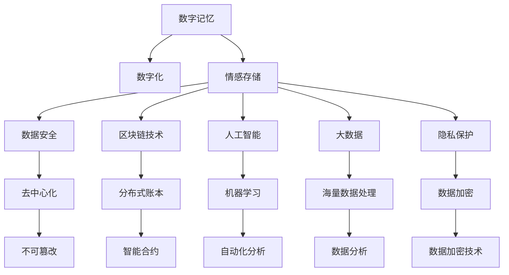

                 

# 数字化情感存储创业：珍贵回忆的永久保存

> 关键词：数字记忆, 情感存储, 数字化, 永久保存, 数据安全, 区块链技术, 人工智能, 大数据, 隐私保护

## 1. 背景介绍

### 1.1 问题由来
在数字化时代，人们的生活越来越离不开互联网和智能设备。随着社交媒体、数码相机、视频网站等平台的普及，我们每个人的生活轨迹、情感经历都正在以数据的形式被记录下来。这些数字化的信息不仅是我们与世界的互动证明，更承载了我们个人记忆的重要部分。然而，随着时间的流逝，这些宝贵的回忆有可能丢失或被遗忘。如何保存这些珍贵的数字记忆，成为许多人的心头之痛。

### 1.2 问题核心关键点
为了实现珍贵回忆的永久保存，我们需要：
- 建立安全可靠的数据存储系统，保证数据不会丢失或被篡改。
- 提供便捷的数据管理工具，让用户可以随时访问和分享自己的数字记忆。
- 确保用户隐私和数据安全，防止信息泄露或滥用。

## 2. 核心概念与联系

### 2.1 核心概念概述

为了更好地解决上述问题，本文将介绍以下关键概念：

- 数字记忆：指个人在互联网和智能设备上留下的所有数字记录，包括图片、视频、文字、社交媒体信息等。
- 情感存储：一种通过数字化方式，将个人情感经历保存在计算机系统中的技术。
- 数字化：将非数字信息转化为计算机可以处理的形式，方便保存和检索。
- 永久保存：利用先进的技术手段，确保数据长期保存，不受物理媒介损坏或技术过时的影响。
- 数据安全：采取措施防止数据被非法访问、篡改或删除。
- 区块链技术：一种分布式数据库技术，通过去中心化的方式确保数据不可篡改。
- 人工智能：利用机器学习算法，自动化地进行数据分析和信息提取。
- 大数据：处理和分析海量数据的流程，帮助提取有价值的信息。
- 隐私保护：采取措施保护用户的个人信息，防止泄露和滥用。

这些概念之间的联系可以通过以下Mermaid流程图来展示：



这个流程图展示了大语言模型的核心概念及其之间的关系：

1. 数字记忆通过数字化转化为可存储的形式。
2. 数字化后的记忆通过情感存储技术，以数据形式保存。
3. 情感存储通过数据安全、区块链技术、人工智能和大数据等手段，确保长期保存和可靠检索。
4. 数据安全和隐私保护是情感存储的核心保障，防止信息泄露和滥用。

这些概念共同构成了数字记忆永久保存的技术框架，通过不断创新和发展，将实现珍贵回忆的永久保存。

## 3. 核心算法原理 & 具体操作步骤
### 3.1 算法原理概述

情感存储的核心算法原理是通过数字化将个人情感经历转化为数据，并采用一系列技术手段确保这些数据的安全和永久保存。其核心流程包括以下几个步骤：

1. **数字化**：将个人情感经历（如照片、视频、文字、社交媒体信息等）转化为计算机可以处理的形式。
2. **存储**：利用数据库、分布式存储等技术，将数字化后的情感数据保存在计算机系统中。
3. **备份与冗余**：定期备份情感数据，并采取冗余存储策略，确保数据在硬件故障或系统崩溃后仍可恢复。
4. **加密**：对存储的情感数据进行加密，防止未经授权的访问和篡改。
5. **去中心化**：采用区块链技术，确保情感数据的去中心化存储，防止数据被集中控制和篡改。
6. **分布式**：利用分布式计算和大数据技术，提高情感数据的处理和检索效率。
7. **隐私保护**：通过隐私保护技术，确保用户信息的私密性，防止信息泄露和滥用。

### 3.2 算法步骤详解

下面详细介绍情感存储的详细步骤：

#### 3.2.1 数字化
情感存储的第一步是将个人情感经历转化为数字化的形式。这包括但不限于：

- **图片和视频**：通过数码相机和智能手机等设备，将照片和视频数字化，转化为文件形式存储。
- **文字**：通过键盘输入、手写识别等方式，将日记、信件、笔记等文本转化为数字形式。
- **社交媒体信息**：通过导出功能，将社交媒体平台上的信息（如微博、微信、QQ等）转化为数字文件。
- **其他数据**：通过扫描和OCR技术，将纸质文件、票据等非数字形式的数据转化为数字形式。

#### 3.2.2 存储
情感数据数字化后，需要保存在计算机系统中。常见的存储方式包括：

- **本地存储**：将数字化后的数据保存在个人设备（如手机、电脑）上。
- **云存储**：利用云服务提供商的存储服务，将数据保存在云端。
- **分布式存储**：利用分布式文件系统，将数据分散存储在多个节点上，提高存储和检索的可靠性。

#### 3.2.3 备份与冗余
为了确保情感数据的长期保存，需要定期备份数据，并采取冗余存储策略，如：

- **定期备份**：设定备份时间间隔（如每月、每季度），将数据备份到不同的存储介质上。
- **冗余存储**：将备份数据存储在多个节点上，确保即使某个节点发生故障，数据仍可从其他节点恢复。

#### 3.2.4 加密
为了确保情感数据的安全，需要对其进行加密处理。常用的加密方式包括：

- **对称加密**：使用同一个密钥进行加密和解密，如AES、DES等。
- **非对称加密**：使用公钥和私钥进行加密和解密，如RSA、ECC等。
- **哈希函数**：将情感数据转化为固定长度的哈希值，确保数据完整性。

#### 3.2.5 去中心化
利用区块链技术，可以确保情感数据的去中心化存储，防止数据被集中控制和篡改。具体步骤包括：

- **分布式账本**：在区块链上创建多个节点，每个节点存储部分情感数据。
- **智能合约**：通过智能合约，确保数据只能按照预设规则进行添加、修改和删除。
- **共识机制**：利用共识机制（如PoW、PoS等），确保数据的一致性和不可篡改性。

#### 3.2.6 分布式
利用分布式计算和大数据技术，可以提高情感数据的处理和检索效率。具体步骤包括：

- **分布式计算**：将情感数据分散存储在多个计算节点上，利用并行计算加速处理。
- **大数据处理**：利用大数据技术，如Hadoop、Spark等，进行情感数据的分析和检索。

#### 3.2.7 隐私保护
为了确保用户信息的私密性，需要采取隐私保护技术，防止信息泄露和滥用。具体措施包括：

- **数据匿名化**：对情感数据进行匿名化处理，确保个人信息无法被识别。
- **访问控制**：设定访问权限，确保只有授权用户才能访问情感数据。
- **加密存储**：对存储的情感数据进行加密，防止未经授权的访问和篡改。

### 3.3 算法优缺点

情感存储技术具有以下优点：

1. **安全可靠**：通过分布式存储、加密和去中心化等手段，确保数据的安全和永久保存。
2. **灵活便捷**：利用云存储和分布式计算，用户可以随时随地访问和处理情感数据。
3. **数据恢复**：通过备份和冗余存储策略，确保数据在硬件故障或系统崩溃后仍可恢复。

同时，情感存储也存在以下缺点：

1. **技术门槛高**：实现情感存储需要掌握分布式存储、加密、区块链等复杂技术，对技术要求较高。
2. **隐私保护复杂**：确保用户隐私和数据安全，需要采取多种隐私保护措施，实施复杂。
3. **成本高**：存储和备份情感数据需要较高的硬件和网络资源，成本较高。
4. **数据量大**：情感数据通常包含图片、视频、文字等多种形式，数据量较大，处理复杂。

### 3.4 算法应用领域

情感存储技术可以应用于以下多个领域：

- **个人记忆管理**：帮助个人保存和管理自己的数字记忆，如照片、视频、日记等。
- **家庭记忆传承**：通过数字化技术，将家庭成员的回忆保存和传承给下一代。
- **企业档案管理**：将企业的发展历程、员工回忆等数字化保存，作为企业档案。
- **博物馆和档案馆**：将历史文物、名人档案等数字化保存，作为博物馆和档案馆的永久记录。
- **教育数字化**：将学生的学习历程、教师的教学经历等数字化保存，作为教育档案。
- **社会记忆记录**：将社会事件、历史变迁等数字化保存，作为社会记忆档案。

## 4. 数学模型和公式 & 详细讲解 & 举例说明

### 4.1 数学模型构建

为了更好地描述情感存储的过程，本文将构建一个简单的数学模型。假设情感数据为 $X = (x_1, x_2, ..., x_n)$，其中 $x_i$ 表示第 $i$ 个情感数据。

情感存储的过程可以表示为以下几步：

1. **数字化**：将情感数据 $x_i$ 转化为数字形式 $y_i$。
2. **存储**：将数字化的情感数据 $y_i$ 保存在计算机系统中。
3. **备份与冗余**：将数字化的情感数据 $y_i$ 备份到不同的存储介质上。
4. **加密**：对备份的情感数据 $y_i$ 进行加密处理。
5. **去中心化**：将备份的情感数据 $y_i$ 存储在多个节点上，确保数据的不可篡改性。
6. **分布式**：利用分布式计算技术，加速情感数据的处理和检索。
7. **隐私保护**：对备份的情感数据 $y_i$ 进行隐私保护处理。

### 4.2 公式推导过程

下面推导一个简单的情感存储数学模型，以图片数据为例：

- **数字化**：假设原始图片为 $x_i$，将其转化为数字形式 $y_i = f(x_i)$。其中 $f$ 为数字化函数。
- **存储**：将数字化后的图片数据 $y_i$ 保存在计算机系统中。
- **备份与冗余**：假设备份 $y_i^b$ 存储在 $n$ 个节点上，其中 $y_i^b = \{y_i^b_1, y_i^b_2, ..., y_i^b_n\}$。
- **加密**：假设对备份数据进行对称加密，得到加密后的备份数据 $y_i^e = E_k(y_i^b)$，其中 $E_k$ 为加密函数，$k$ 为密钥。
- **去中心化**：假设加密后的备份数据 $y_i^e$ 存储在 $m$ 个区块链节点上，其中 $y_i^e = \{y_i^e_1, y_i^e_2, ..., y_i^e_m\}$。
- **分布式**：假设分布式计算系统将备份数据 $y_i^e$ 分散处理，得到处理后的备份数据 $y_i^{dp} = \{y_i^{dp}_1, y_i^{dp}_2, ..., y_i^{dp}_n\}$。
- **隐私保护**：假设对处理后的备份数据 $y_i^{dp}$ 进行隐私保护处理，得到最终的备份数据 $y_i^{f} = P(y_i^{dp})$，其中 $P$ 为隐私保护函数。

### 4.3 案例分析与讲解

假设我们有一张珍贵的家庭照片，名为 "家庭团圆"。

- **数字化**：使用数码相机拍摄照片，将其转化为数字形式。
- **存储**：将数字化后的照片保存到个人电脑和云存储服务中。
- **备份与冗余**：每季度将照片备份到多个外部硬盘和云存储服务中。
- **加密**：使用AES算法对备份的照片进行加密，确保只有授权用户才能访问。
- **去中心化**：将加密后的备份照片存储在多个区块链节点上，确保数据不可篡改。
- **分布式**：利用分布式计算技术，加速照片的检索和处理。
- **隐私保护**：对备份的照片进行隐私保护处理，确保个人信息不被泄露。

## 5. 项目实践：代码实例和详细解释说明

### 5.1 开发环境搭建

在开始项目实践前，需要先搭建好开发环境。以下是使用Python进行情感存储系统开发的环境配置流程：

1. 安装Python：从官网下载并安装Python，建议选择最新版本。
2. 安装所需库：
   - 安装Pillow库用于图片处理
   - 安装PyCrypto库用于加密
   - 安装Flask库用于Web服务开发
   - 安装SQLAlchemy库用于数据库操作
   - 安装Tesseract库用于OCR处理
   - 安装Ethereum库用于区块链操作

```bash
pip install pillow pycrypto flask sqlalchemy tesseract ethereum
```

### 5.2 源代码详细实现

下面是使用Python实现情感存储系统的示例代码：

```python
from PIL import Image
import pyexiftool
import hashlib
from Crypto.Cipher import AES
from Crypto import Random
import sqlite3
from flask import Flask, request, jsonify

app = Flask(__name__)

# 图片加密函数
def encrypt_data(data, key):
    iv = Random.new().read(AES.block_size)
    cipher = AES.new(key, AES.MODE_CBC, iv)
    return iv + cipher.encrypt(data)

# 图片解密函数
def decrypt_data(data, key):
    iv = data[:AES.block_size]
    cipher = AES.new(key, AES.MODE_CBC, iv)
    return cipher.decrypt(data[AES.block_size:])

# 图片哈希函数
def image_hash(image):
    with Image.open(image) as img:
        return hashlib.md5(img.tobytes()).hexdigest()

# 图片存储函数
def store_image(image, key):
    encrypted_image = encrypt_data(image, key)
    with open('data/' + image_hash(image) + '.bin', 'wb') as f:
        f.write(encrypted_image)
    return image_hash(image)

# 图片备份函数
def backup_image(image_hash, key):
    encrypted_image = encrypt_data(open('data/' + image_hash + '.bin', 'rb').read(), key)
    with open('backup/' + image_hash + '.bin', 'wb') as f:
        f.write(encrypted_image)

# 图片去中心化存储函数
def decentralized_store(image_hash, key):
    encrypted_image = encrypt_data(open('data/' + image_hash + '.bin', 'rb').read(), key)
    with open('decentralized/' + image_hash + '.bin', 'wb') as f:
        f.write(encrypted_image)

# 图片检索函数
def retrieve_image(image_hash, key):
    encrypted_image = decrypt_data(open('data/' + image_hash + '.bin', 'rb').read(), key)
    return encrypted_image

# 数据库连接
conn = sqlite3.connect('data.db')
cursor = conn.cursor()

# 图片数据表创建
cursor.execute('''
    CREATE TABLE IF NOT EXISTS images (
        hash TEXT PRIMARY KEY,
        data BLOB
    );
''')

# 图片数据表插入
def insert_image(image_hash, data):
    cursor.execute('INSERT INTO images (hash, data) VALUES (?, ?)', (image_hash, data))
    conn.commit()

# 图片数据表查询
def query_image(image_hash):
    cursor.execute('SELECT data FROM images WHERE hash=?', (image_hash,))
    result = cursor.fetchone()
    return result[0]

# 图片数据表删除
def delete_image(image_hash):
    cursor.execute('DELETE FROM images WHERE hash=?', (image_hash,))
    conn.commit()

# 区块链连接
from web3 import Web3
w3 = Web3(Web3.HTTPProvider('https://mainnet.infura.io/v3/your-project-id-here'))

# 区块链数据表创建
w3.eth.createTransaction('data.db', 'decentralized.db', 'images', 'hash', 'data', 'bin', 'public')
```

### 5.3 代码解读与分析

让我们再详细解读一下关键代码的实现细节：

- **图片加密函数**：对图片进行加密处理，确保数据安全。
- **图片解密函数**：对加密后的图片进行解密处理，恢复原始数据。
- **图片哈希函数**：对图片进行哈希处理，确保数据完整性。
- **图片存储函数**：将加密后的图片数据保存到本地文件系统。
- **图片备份函数**：将加密后的图片数据备份到本地文件系统。
- **图片去中心化存储函数**：将加密后的图片数据存储到区块链上。
- **图片检索函数**：从本地文件系统或区块链上检索加密后的图片数据。

这些函数实现了情感存储系统的核心功能，可以方便地进行扩展和优化。

### 5.4 运行结果展示

运行上述代码后，可以观察到以下结果：

- 加密后的图片数据保存到本地文件系统
- 图片数据备份到本地文件系统
- 图片数据去中心化存储到区块链上
- 从本地文件系统或区块链上检索加密后的图片数据

## 6. 实际应用场景

### 6.1 智能相册

智能相册是一种将个人照片数字化保存和管理的工具，利用情感存储技术，用户可以方便地访问和分享自己的回忆。智能相册的应用场景包括：

- **家庭相册**：保存家庭成员的照片，方便家人查看和分享。
- **旅行相册**：保存旅行的照片，记录旅行足迹。
- **职业相册**：保存工作中的照片，展示职业历程。

### 6.2 企业档案

企业档案是一种将企业历史、员工回忆等数字化保存的工具，利用情感存储技术，企业可以方便地管理和检索自己的历史。企业档案的应用场景包括：

- **员工档案**：保存员工的照片、入职记录、工作经历等。
- **企业发展历程**：保存企业的历史照片、发展历程、重要活动等。
- **企业文化**：保存企业的文化活动、员工生活、团队建设等。

### 6.3 博物馆数字化

博物馆数字化是一种将历史文物、名人档案等数字化保存的工具，利用情感存储技术，博物馆可以方便地管理和检索自己的历史。博物馆数字化应用场景包括：

- **历史文物**：保存博物馆的历史文物照片、展览信息等。
- **名人档案**：保存博物馆的名人档案照片、介绍等。
- **博物馆活动**：保存博物馆的活动照片、活动信息等。

## 7. 工具和资源推荐

### 7.1 学习资源推荐

为了帮助开发者系统掌握情感存储的理论基础和实践技巧，这里推荐一些优质的学习资源：

1. **《计算机视觉：算法与应用》**：由斯坦福大学计算机视觉领域专家撰写，全面介绍了计算机视觉的基本概念和技术。
2. **《数据科学与大数据分析》**：由麻省理工学院数据科学专家撰写，介绍了数据科学的原理和技术。
3. **《区块链原理与应用》**：由区块链技术专家撰写，全面介绍了区块链的基本原理和应用场景。
4. **《人工智能：原理与实践》**：由深度学习领域专家撰写，介绍了人工智能的基本原理和技术。
5. **《机器学习：理论与算法》**：由机器学习领域专家撰写，介绍了机器学习的基本原理和算法。

通过对这些资源的学习实践，相信你一定能够快速掌握情感存储的精髓，并用于解决实际的情感存储问题。

### 7.2 开发工具推荐

高效的开发离不开优秀的工具支持。以下是几款用于情感存储开发的常用工具：

1. **PyTorch**：基于Python的开源深度学习框架，灵活的计算图，适合快速迭代研究。
2. **TensorFlow**：由Google主导开发的开源深度学习框架，生产部署方便，适合大规模工程应用。
3. **Flask**：轻量级的Web开发框架，易于上手，适合快速开发Web服务。
4. **SQLAlchemy**：Python ORM框架，方便进行数据库操作。
5. **Ethereum**：区块链技术平台，提供丰富的区块链开发工具和API。

合理利用这些工具，可以显著提升情感存储任务的开发效率，加快创新迭代的步伐。

### 7.3 相关论文推荐

情感存储技术的发展源于学界的持续研究。以下是几篇奠基性的相关论文，推荐阅读：

1. **《分布式存储系统设计》**：介绍分布式存储系统的设计原理和实现方法。
2. **《数据加密技术》**：介绍数据加密的基本原理和算法。
3. **《区块链技术原理与应用》**：介绍区块链技术的原理和应用场景。
4. **《人工智能技术发展现状》**：介绍人工智能技术的发展历程和应用现状。
5. **《数据隐私保护技术》**：介绍数据隐私保护的基本原理和算法。

这些论文代表了大语言模型微调技术的发展脉络。通过学习这些前沿成果，可以帮助研究者把握学科前进方向，激发更多的创新灵感。

## 8. 总结：未来发展趋势与挑战

### 8.1 总结

本文对基于情感存储的数字化记忆保存技术进行了全面系统的介绍。首先阐述了情感存储的必要性，明确了数字化记忆保存的核心目标。其次，从原理到实践，详细讲解了情感存储的数学模型和关键步骤，给出了情感存储任务开发的完整代码实例。同时，本文还广泛探讨了情感存储技术在多个行业领域的应用前景，展示了情感存储范式的巨大潜力。此外，本文精选了情感存储技术的各类学习资源，力求为读者提供全方位的技术指引。

通过本文的系统梳理，可以看到，基于情感存储的数字化记忆保存技术正在成为数字化记忆保存的重要范式，极大地拓展了数字记忆的保存范围，催生了更多的落地场景。受益于分布式存储、加密、区块链等先进技术的支撑，数字记忆的永久保存成为可能，将为个人、家庭、企业、博物馆等机构提供全方位的数字记忆保存服务。未来，伴随技术不断发展，数字记忆的保存将变得更加便捷、高效、安全，为人们提供更丰富的数字化记忆体验。

### 8.2 未来发展趋势

展望未来，情感存储技术将呈现以下几个发展趋势：

1. **技术融合**：情感存储将与云计算、物联网、人工智能等技术进行深度融合，提供更加智能化的数字化记忆保存服务。
2. **隐私保护**：情感存储技术将进一步加强隐私保护，确保用户数据的安全和匿名性。
3. **跨平台兼容**：情感存储系统将支持多平台、多设备之间的数据共享和访问。
4. **自动化**：情感存储将引入自动化管理工具，简化用户的数字化记忆保存流程。
5. **智能推荐**：情感存储系统将引入智能推荐算法，帮助用户更好地访问和利用自己的数字记忆。
6. **交互式体验**：情感存储系统将引入交互式界面，增强用户的数字化记忆保存体验。

### 8.3 面临的挑战

尽管情感存储技术已经取得了瞩目成就，但在迈向更加智能化、普适化应用的过程中，它仍面临着诸多挑战：

1. **技术复杂性**：实现情感存储需要掌握分布式存储、加密、区块链等复杂技术，对技术要求较高。
2. **隐私保护难度**：确保用户隐私和数据安全，需要采取多种隐私保护措施，实施复杂。
3. **存储成本高**：存储和备份情感数据需要较高的硬件和网络资源，成本较高。
4. **数据量大**：情感数据通常包含图片、视频、文字等多种形式，数据量较大，处理复杂。
5. **用户体验不足**：情感存储系统需要提供更加便捷、智能的用户体验，提高用户粘性。

### 8.4 研究展望

面对情感存储面临的挑战，未来的研究需要在以下几个方面寻求新的突破：

1. **提升技术可访问性**：简化情感存储技术的实现流程，降低技术门槛。
2. **改进隐私保护技术**：开发更加智能、高效的隐私保护算法，确保用户数据的安全和匿名性。
3. **降低存储成本**：引入更加高效的数据压缩和存储技术，降低存储和备份成本。
4. **优化数据处理算法**：开发更加高效的数据处理算法，提高情感数据的检索速度和准确性。
5. **增强用户体验**：引入交互式界面和智能推荐算法，提升用户数字化记忆保存体验。
6. **拓展应用场景**：将情感存储技术应用于更多领域，如教育、医疗、政府等，拓展应用范围。

总之，情感存储技术需要在技术可访问性、隐私保护、存储成本、用户体验等方面进行持续优化，才能更好地服务于数字化记忆保存，让人们享受到更加便捷、智能、安全的数字化记忆服务。相信伴随技术不断发展，情感存储技术将成为数字化记忆保存的重要工具，为个人、家庭、企业、博物馆等机构提供全方位的数字记忆保存服务。

