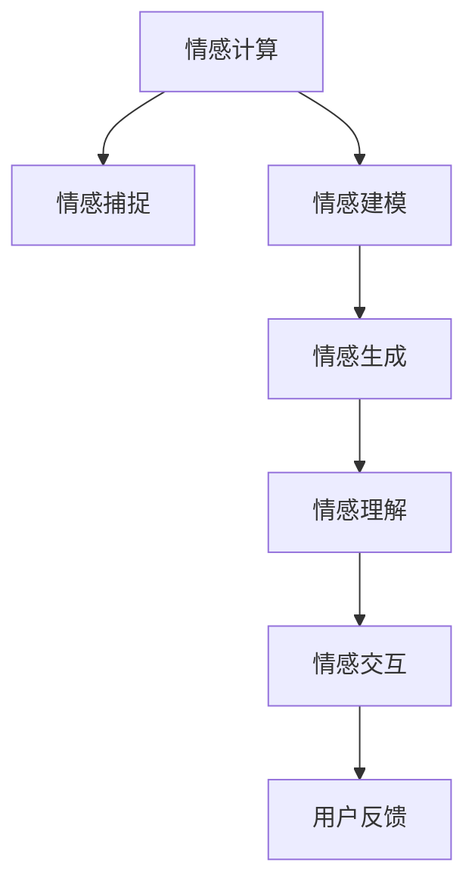

                 

## 1. 背景介绍

### 1.1 问题由来

随着数字技术的高速发展，元宇宙（Metaverse）成为了各大科技巨头竞相布局的热点领域。元宇宙作为一个集虚拟与现实于一体的数字世界，提供了无限可能的人机交互方式，使得人们可以在虚拟空间中自由地表达自我，探索未知。数字化情感表达，作为元宇宙中的核心应用之一，能够使得用户在数字世界中实现更加丰富、细腻的情感交互。

然而，随着元宇宙应用的普及，用户对于数字化情感表达的需求也在不断增长。传统的文本、图像等单一表达方式已经难以满足用户的情感需求，如何在虚拟环境中实现更加复杂、精细的情感表达，成为了当前研究的重点。

### 1.2 问题核心关键点

数字化情感表达问题主要包括以下几个方面：

1. **情感捕捉与建模**：如何从用户的语言、动作、姿态等数据中提取和建模情感信息。
2. **情感表达与生成**：如何通过模型生成符合用户情感需求的文本、图像、音频等表达形式。
3. **情感理解与互动**：如何通过机器学习技术使智能体能够理解用户的情感状态，实现更加自然、流畅的人机互动。
4. **情感表达的多样性**：如何设计多样化的情感表达形式，满足不同用户的个性化需求。

这些核心问题不仅涉及到情感计算、自然语言处理、计算机视觉等多个领域的知识，还需要从心理学、社会学等多个角度进行综合考虑。

### 1.3 问题研究意义

数字化情感表达的深入研究，对于元宇宙中的人机交互具有重要意义：

1. **提升用户体验**：通过更加丰富、细腻的情感表达，能够显著提升用户在元宇宙中的体验感和沉浸感。
2. **促进人机互动**：情感理解与互动能力的提升，可以使得智能体更加自然、真实地与用户交流，增强用户对虚拟世界的信任感。
3. **拓展应用场景**：通过情感表达技术，可以在虚拟世界中开展更多元、更复杂的人机互动应用，如虚拟会议、虚拟社交等。
4. **推动技术发展**：情感表达技术的发展，将带动自然语言处理、计算机视觉等多领域技术的进步，为人工智能技术的发展提供新的方向。

## 2. 核心概念与联系

### 2.1 核心概念概述

为更好地理解数字化情感表达，本节将介绍几个密切相关的核心概念：

- **情感计算（Affective Computing）**：通过计算手段理解和生成人类情感的技术，是实现数字化情感表达的基础。
- **情感捕捉（Emotion Capture）**：通过传感器、摄像头、麦克风等设备捕捉用户的语言、动作、姿态等信息，生成情感表达数据。
- **情感建模（Emotion Modeling）**：通过机器学习算法从捕捉到的数据中提取情感特征，建模情感状态。
- **情感生成（Emotion Generation）**：通过生成模型生成符合用户情感需求的文本、图像、音频等表达形式。
- **情感理解（Emotion Understanding）**：通过智能体理解用户的情感状态，实现更加自然、流畅的互动。
- **情感交互（Emotion Interaction）**：通过情感理解与生成，使得智能体能够以更加自然、流畅的方式与用户互动。

这些核心概念之间的逻辑关系可以通过以下Mermaid流程图来展示：



这个流程图展示了数字化情感表达的核心流程：从情感计算开始，通过捕捉和建模用户情感，生成符合用户情感需求的表达，最终实现情感理解与交互。

## 3. 核心算法原理 & 具体操作步骤

### 3.1 算法原理概述

数字化情感表达的核心算法包括情感捕捉、情感建模、情感生成和情感理解等。本文将重点介绍情感建模和情感生成的算法原理，并通过具体的代码实现来展示其操作步骤。

**情感建模**：通过机器学习算法从捕捉到的数据中提取情感特征，建模情感状态。常用的情感建模方法包括基于规则的方法、基于统计的方法和基于深度学习的方法。其中，深度学习方法在近年来得到了广泛应用，特别是基于卷积神经网络（CNN）和循环神经网络（RNN）的模型。

**情感生成**：通过生成模型生成符合用户情感需求的文本、图像、音频等表达形式。常用的情感生成方法包括文本生成、图像生成和音频生成。其中，基于生成对抗网络（GAN）的模型在图像和音频生成方面表现出色。

### 3.2 算法步骤详解

**情感建模步骤**：

1. **数据预处理**：对捕捉到的数据进行去噪、归一化等预处理操作。
2. **特征提取**：通过卷积神经网络（CNN）或循环神经网络（RNN）提取特征。
3. **情感分类**：通过分类算法（如支持向量机、KNN等）对提取的特征进行分类，生成情感状态。

**情感生成步骤**：

1. **数据预处理**：对捕捉到的数据进行去噪、归一化等预处理操作。
2. **生成模型训练**：通过生成对抗网络（GAN）或变分自编码器（VAE）训练生成模型。
3. **生成情感表达**：通过训练好的生成模型生成符合用户情感需求的文本、图像、音频等表达形式。

### 3.3 算法优缺点

情感建模和情感生成的算法有以下优点：

- **高效性**：深度学习方法能够自动学习特征，无需手动设计特征工程，大大提高了建模效率。
- **灵活性**：深度学习模型可以处理复杂、非线性的数据，适用于多种情感表达形式。
- **准确性**：深度学习模型具有强大的表示能力，能够实现高精度的情感建模和生成。

同时，这些算法也存在一些缺点：

- **数据依赖性**：深度学习模型的性能很大程度上依赖于标注数据的质量和数量，获取高质量标注数据的成本较高。
- **模型复杂性**：深度学习模型需要大量计算资源进行训练和推理，对硬件要求较高。
- **泛化能力**：深度学习模型容易受到噪声数据的影响，泛化能力较弱。

### 3.4 算法应用领域

数字化情感表达技术在多个领域都有广泛应用，例如：

1. **虚拟社交平台**：在虚拟社交平台中，情感理解与生成技术能够使得智能体更加自然、真实地与用户交流，增强用户对虚拟世界的信任感。
2. **虚拟客服系统**：通过情感建模和生成技术，虚拟客服系统能够更好地理解用户的情感状态，提供更加个性化、人性化的服务。
3. **虚拟游戏**：在虚拟游戏中，情感理解与生成技术能够增强游戏的沉浸感和互动性，提供更加丰富的游戏体验。
4. **虚拟会议**：在虚拟会议中，情感生成技术能够模拟人类的情感表达，使得远程会议更加自然、流畅。

除了上述这些应用场景外，数字化情感表达技术还在虚拟教育、虚拟旅游、虚拟广告等多个领域有广泛应用，为人们带来了更加丰富、细腻的数字化生活体验。

## 4. 数学模型和公式 & 详细讲解 & 举例说明

### 4.1 数学模型构建

在情感建模和情感生成中，常用的数学模型包括卷积神经网络（CNN）和生成对抗网络（GAN）。以下是这些模型的详细构建过程：

**卷积神经网络（CNN）**：

卷积神经网络是一种广泛应用于图像处理和自然语言处理的深度学习模型。在情感建模中，CNN可以提取文本、图像等数据中的局部特征，实现情感分类。

**生成对抗网络（GAN）**：

生成对抗网络是一种由生成器和判别器组成的深度学习模型，常用于生成图像和音频等表达形式。在情感生成中，GAN可以通过生成器和判别器的对抗训练，生成符合用户情感需求的文本、图像、音频等表达形式。

### 4.2 公式推导过程

**卷积神经网络（CNN）公式推导**：

卷积神经网络的主要公式包括卷积操作和池化操作。以文本情感分类为例，CNN的卷积操作可以表示为：

$$
y = \sigma(W*x + b)
$$

其中，$W$ 为卷积核，$x$ 为输入文本，$b$ 为偏置项，$\sigma$ 为激活函数。

池化操作可以表示为：

$$
y = \max_{i} x_i
$$

其中，$x$ 为输入文本，$i$ 为池化窗口位置。

**生成对抗网络（GAN）公式推导**：

生成对抗网络由生成器和判别器组成，其主要公式包括损失函数和梯度更新。以图像生成为例，GAN的生成器和判别器可以表示为：

$$
G(z) = \mu(z) + \sigma(z)
$$

其中，$G$ 为生成器，$z$ 为噪声向量，$\mu$ 为均值函数，$\sigma$ 为标准差函数。

判别器的损失函数可以表示为：

$$
L_G = \log D(G(z))
$$

生成器的损失函数可以表示为：

$$
L_G = -\log D(G(z))
$$

其中，$L_G$ 为生成器的损失函数，$D$ 为判别器。

### 4.3 案例分析与讲解

以文本情感分类为例，以下是基于卷积神经网络的情感建模案例：

```python
import torch
import torch.nn as nn
import torch.optim as optim

class CNN(nn.Module):
    def __init__(self, input_dim, hidden_dim, output_dim):
        super(CNN, self).__init__()
        self.conv1 = nn.Conv1d(input_dim, hidden_dim, 3)
        self.pool = nn.MaxPool1d(2)
        self.fc1 = nn.Linear(hidden_dim, output_dim)
        self.fc2 = nn.Linear(hidden_dim, output_dim)
        self.dropout = nn.Dropout(0.2)

    def forward(self, x):
        x = self.pool(torch.relu(self.conv1(x)))
        x = self.dropout(x)
        x = torch.flatten(x, 1)
        x = self.fc1(x)
        x = torch.relu(x)
        x = self.fc2(x)
        x = torch.sigmoid(x)
        return x

# 训练CNN模型
input_dim = 200
hidden_dim = 100
output_dim = 2
learning_rate = 0.001

model = CNN(input_dim, hidden_dim, output_dim)
criterion = nn.BCELoss()
optimizer = optim.Adam(model.parameters(), lr=learning_rate)

# 数据预处理
texts = ['happy', 'sad', 'angry', 'calm']
labels = [1, 0, 1, 0]
texts = torch.tensor(texts)
labels = torch.tensor(labels)

# 训练模型
for epoch in range(100):
    optimizer.zero_grad()
    outputs = model(texts)
    loss = criterion(outputs, labels)
    loss.backward()
    optimizer.step()
    print(f'Epoch {epoch+1}, Loss: {loss.item()}')
```

在上述代码中，我们定义了一个简单的卷积神经网络模型，并使用二分类任务的数据进行训练。模型通过卷积层、池化层和全连接层实现文本情感分类。训练过程中，我们使用二分类交叉熵损失函数进行优化，并使用Adam优化器更新模型参数。通过不断迭代训练，模型能够从文本中提取情感特征，实现情感分类。

## 5. 项目实践：代码实例和详细解释说明

### 5.1 开发环境搭建

在进行情感表达项目的开发前，我们需要准备好开发环境。以下是使用Python进行TensorFlow开发的环境配置流程：

1. 安装Anaconda：从官网下载并安装Anaconda，用于创建独立的Python环境。

2. 创建并激活虚拟环境：
```bash
conda create -n tensorflow-env python=3.8 
conda activate tensorflow-env
```

3. 安装TensorFlow：根据CUDA版本，从官网获取对应的安装命令。例如：
```bash
conda install tensorflow tensorflow-gpu=2.5.0 -c conda-forge
```

4. 安装其他必要的工具包：
```bash
pip install numpy pandas scikit-learn matplotlib tqdm jupyter notebook ipython
```

完成上述步骤后，即可在`tensorflow-env`环境中开始情感表达项目的开发。

### 5.2 源代码详细实现

下面我们以生成情感文本为例，给出使用TensorFlow实现情感生成的PyTorch代码实现。

首先，定义生成模型：

```python
import tensorflow as tf
from tensorflow.keras.layers import Input, Dense, Embedding, LSTM, Dropout
from tensorflow.keras.models import Model

# 定义模型
input_layer = Input(shape=(MAX_SEQUENCE_LENGTH,))
embedding_layer = Embedding(VOCAB_SIZE, EMBEDDING_DIM, input_length=MAX_SEQUENCE_LENGTH)(input_layer)
lstm_layer = LSTM(128)(embedding_layer)
output_layer = Dense(NUM_CLASSES, activation='softmax')(lstm_layer)
model = Model(inputs=input_layer, outputs=output_layer)
model.compile(loss='categorical_crossentropy', optimizer='adam', metrics=['accuracy'])
```

然后，训练生成模型：

```python
# 训练模型
model.fit(X_train, y_train, validation_data=(X_test, y_test), epochs=10, batch_size=32)
```

接着，生成情感文本：

```python
# 生成情感文本
sequence = "I am"
generated_text = ""
for i in range(20):
    x = tokenizer.texts_to_sequences([sequence])
    x = pad_sequences(x)
    preds = model.predict(x)
    idx = np.argmax(preds[0])
    word = word_index[idx]
    sequence += " " + word
    generated_text += word + " "
print(generated_text)
```

在这个代码实现中，我们使用TensorFlow和Keras搭建了一个简单的LSTM生成模型，用于生成符合用户情感需求的文本。在训练过程中，我们使用交叉熵损失函数进行优化，并使用Adam优化器更新模型参数。在生成情感文本时，我们通过不断迭代模型预测和选择最可能的词语，逐步构建生成文本。

### 5.3 代码解读与分析

让我们再详细解读一下关键代码的实现细节：

**LSTM生成模型**：

- `Input`层：定义输入层，输入序列长度为`MAX_SEQUENCE_LENGTH`。
- `Embedding`层：将输入的整数序列转化为密集向量表示，向量维度为`EMBEDDING_DIM`。
- `LSTM`层：使用LSTM模型进行序列建模，输出维度为128。
- `Dense`层：使用全连接层进行情感分类，输出维度为`NUM_CLASSES`，激活函数为softmax。
- `Model`层：将输入层和输出层封装成模型，定义模型的输入和输出。
- `compile`方法：定义损失函数、优化器和评价指标，准备模型训练。
- `fit`方法：使用训练数据进行模型训练，迭代次数为10次，每次批量大小为32。

**情感文本生成**：

- `tokenizer.texts_to_sequences`：将文本序列转化为整数序列。
- `pad_sequences`：对整数序列进行填充，保证序列长度一致。
- `model.predict`：使用训练好的模型进行预测，输出情感概率分布。
- `np.argmax`：选择预测概率最高的类别作为下一个单词。
- `word_index`：将类别索引转换为单词。

通过上述代码实现，我们可以看到TensorFlow在情感表达中的强大应用潜力。开发者可以通过调整模型结构和训练参数，实现更加复杂、精细的情感生成。

## 6. 实际应用场景

### 6.1 智能客服系统

智能客服系统通过数字化情感表达技术，能够实现更加自然、流畅的人机互动。在用户与智能客服交互时，系统能够通过情感捕捉和建模技术，准确理解用户的情感状态，并根据情感状态调整回答策略，提供更加个性化的服务。例如，当用户感到愤怒时，系统能够及时检测并回复安抚性的回答，提升用户满意度。

### 6.2 虚拟社交平台

虚拟社交平台通过情感生成技术，能够模拟人类的情感表达，增强用户的社交体验。例如，在用户发表动态时，系统可以根据用户的情感状态生成相应的表情符号、文字回复等，使得社交互动更加自然、丰富。此外，系统还可以通过情感理解技术，自动识别用户的情绪变化，及时提供情感支持，增强用户粘性。

### 6.3 虚拟游戏

虚拟游戏中通过情感生成技术，能够实现更加多样化的互动方式。例如，在游戏中，系统可以根据玩家的情绪状态，生成不同的任务和挑战，提升游戏难度和趣味性。此外，系统还可以通过情感理解技术，自动识别玩家的情绪变化，及时调整游戏难度和故事情节，提供更加个性化的游戏体验。

### 6.4 未来应用展望

随着情感计算技术的不断进步，数字化情感表达将在元宇宙中发挥越来越重要的作用。未来，情感表达技术将在以下方面得到进一步发展：

1. **多模态情感表达**：未来的情感表达技术将不再局限于单一的文本、图像或音频形式，而是融合多种模态数据，实现更加丰富、细腻的情感表达。例如，在虚拟会议中，系统可以通过语音识别和面部表情捕捉，实现更加全面的情感理解与生成。
2. **情感交互的增强**：未来的情感表达技术将使得智能体更加自然、真实地与用户互动，增强用户的沉浸感和信任感。例如，在虚拟助手中，系统能够通过情感生成技术，模拟人类的情感表达，提升用户的情感体验。
3. **情感计算的普适性**：未来的情感计算技术将更加普及，不仅应用于元宇宙中的人机互动，还将拓展到更多现实场景，如智能家居、智能医疗等领域。
4. **跨文化情感表达**：未来的情感表达技术将能够更好地理解和生成跨文化情感，实现更加多样化的情感交流。

## 7. 工具和资源推荐

### 7.1 学习资源推荐

为了帮助开发者系统掌握数字化情感表达的理论基础和实践技巧，这里推荐一些优质的学习资源：

1. **《情感计算基础》系列书籍**：由情感计算领域权威专家撰写，深入浅出地介绍了情感计算的基本概念和前沿技术。
2. **《深度学习与自然语言处理》课程**：斯坦福大学开设的自然语言处理课程，详细讲解了文本情感分析、情感生成等重要内容。
3. **《情感计算》在线课程**：多所大学联合开设的情感计算在线课程，涵盖了情感捕捉、建模、生成等多个方面。
4. **Transformers库官方文档**：详细介绍了情感生成技术中常用的Transformer模型及其应用。
5. **情感计算开源项目**：提供了丰富的情感生成和情感理解代码示例，方便开发者快速上手。

通过对这些资源的学习实践，相信你一定能够快速掌握数字化情感表达的精髓，并用于解决实际的元宇宙人机互动问题。

### 7.2 开发工具推荐

高效的开发离不开优秀的工具支持。以下是几款用于数字化情感表达开发的常用工具：

1. **TensorFlow**：由Google主导开发的深度学习框架，提供了强大的计算图和模型训练能力。
2. **Keras**：基于TensorFlow的高级API，简化了模型的搭建和训练过程。
3. **PyTorch**：基于Python的开源深度学习框架，支持动态计算图，适合快速迭代研究。
4. **TensorBoard**：TensorFlow配套的可视化工具，实时监测模型训练状态，提供丰富的图表呈现方式。
5. **Weights & Biases**：模型训练的实验跟踪工具，记录和可视化模型训练过程中的各项指标，方便对比和调优。

合理利用这些工具，可以显著提升数字化情感表达任务的开发效率，加快创新迭代的步伐。

### 7.3 相关论文推荐

数字化情感表达技术的研究得到了学界的广泛关注，以下是几篇奠基性的相关论文，推荐阅读：

1. **《深度情感计算》**：介绍了情感捕捉和建模技术的基本原理和算法。
2. **《基于深度学习的情感生成》**：详细讲解了深度学习在情感生成中的应用。
3. **《情感交互系统的设计》**：探讨了情感理解和生成技术在虚拟社交平台中的应用。
4. **《情感计算的未来趋势》**：分析了情感计算技术的发展方向和未来应用前景。

这些论文代表了大语言模型微调技术的发展脉络。通过学习这些前沿成果，可以帮助研究者把握学科前进方向，激发更多的创新灵感。

## 8. 总结：未来发展趋势与挑战

### 8.1 研究成果总结

数字化情感表达技术在元宇宙中有着广泛的应用前景，已经成为NLP领域的重要研究方向。本文对数字化情感表达的核心算法和操作步骤进行了详细讲解，并通过具体的代码实现展示了其应用效果。同时，本文还探讨了数字化情感表达在实际应用中的多种场景，展望了未来技术的发展趋势。

### 8.2 未来发展趋势

展望未来，数字化情感表达技术将呈现以下几个发展趋势：

1. **多模态情感表达**：未来的情感表达技术将融合多种模态数据，实现更加丰富、细腻的情感表达。
2. **情感交互的增强**：未来的情感表达技术将使得智能体更加自然、真实地与用户互动，增强用户的沉浸感和信任感。
3. **情感计算的普适性**：未来的情感计算技术将更加普及，不仅应用于元宇宙中的人机互动，还将拓展到更多现实场景。
4. **跨文化情感表达**：未来的情感表达技术将能够更好地理解和生成跨文化情感，实现更加多样化的情感交流。

### 8.3 面临的挑战

尽管数字化情感表达技术已经取得了瞩目成就，但在迈向更加智能化、普适化应用的过程中，它仍面临着诸多挑战：

1. **数据依赖性**：深度学习模型的性能很大程度上依赖于标注数据的质量和数量，获取高质量标注数据的成本较高。
2. **模型复杂性**：深度学习模型需要大量计算资源进行训练和推理，对硬件要求较高。
3. **泛化能力**：深度学习模型容易受到噪声数据的影响，泛化能力较弱。

### 8.4 研究展望

面对数字化情感表达面临的挑战，未来的研究需要在以下几个方面寻求新的突破：

1. **数据增强与生成**：开发更加高效的数据增强和生成技术，减少对标注数据的依赖，提升模型泛化能力。
2. **跨模态情感理解**：研究如何更好地融合多模态数据，提升情感理解与生成的准确性。
3. **鲁棒性与安全性**：研究如何提高情感表达技术的鲁棒性和安全性，避免恶意用途。
4. **人机协作**：研究如何在情感表达技术中引入人类专家知识，提升系统的可解释性和可控性。

这些研究方向的探索，必将引领数字化情感表达技术迈向更高的台阶，为构建安全、可靠、可解释、可控的智能系统铺平道路。面向未来，数字化情感表达技术还需要与其他人工智能技术进行更深入的融合，如自然语言处理、计算机视觉、增强现实等，多路径协同发力，共同推动人机交互技术的进步。

## 9. 附录：常见问题与解答

**Q1：数字化情感表达是否只适用于文本情感分析？**

A: 数字化情感表达不仅适用于文本情感分析，还可以应用于图像、语音等多种模态数据。例如，在虚拟社交平台中，系统可以通过面部表情捕捉和语音识别技术，实现更加全面的情感理解与生成。

**Q2：如何优化情感生成模型的性能？**

A: 优化情感生成模型的性能可以从以下几个方面入手：
1. 数据增强：通过数据增强技术，如回译、近义替换等方式扩充训练集。
2. 超参数调优：通过超参数调优，找到最佳的模型参数配置。
3. 模型融合：将多个情感生成模型进行融合，提高生成文本的多样性和质量。
4. 对抗训练：引入对抗样本，提高模型鲁棒性。

**Q3：数字化情感表达在实际应用中需要注意哪些问题？**

A: 在实际应用中，需要注意以下几个问题：
1. 模型公平性：避免模型在情感表达中出现偏见和歧视。
2. 用户隐私保护：确保用户数据的安全性和隐私性。
3. 系统稳定性：确保系统在面对异常数据或网络波动时能够稳定运行。
4. 反馈机制：提供用户反馈渠道，及时调整和优化模型。

通过回答这些问题，可以帮助开发者更好地应用数字化情感表达技术，提升用户体验和系统质量。

---

作者：禅与计算机程序设计艺术 / Zen and the Art of Computer Programming

