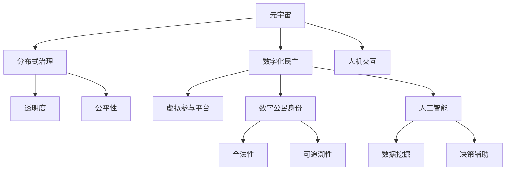

                 

# 数字化民主：元宇宙时代的公民参与

> 关键词：元宇宙,数字化民主,公民参与,虚拟治理,区块链,人工智能,数字公民身份,人机交互

## 1. 背景介绍

随着数字技术的飞速发展，元宇宙（Metaverse）的概念日益兴起，成为探索新时代的数字治理和社会交互的全新场景。元宇宙以其沉浸式、高度互动的特性，为社会民主化带来了新的可能，为公民参与和政府治理提供了新的平台。本文将探讨元宇宙时代如何实现数字化民主，以及公民在元宇宙中的角色和参与方式。

### 1.1 问题由来

传统的民主政治模式在信息闭塞、地域限制等条件下长期主导全球政治生态。然而，全球化和数字技术的发展，为民主形式的多样化提供了可能。元宇宙以其独特的特性，为公民参与政治、表达意见提供了新的渠道，推动了数字化民主的实践。

在元宇宙中，虚拟世界与现实世界相互渗透，信息流通不受时间和空间的限制，公民可以通过虚拟空间进行更直接、更有效的政治参与。同时，元宇宙的去中心化特性也为民主决策提供了一种新的可能性，即基于区块链技术的分布式治理。本文将深入分析元宇宙如何赋能数字化民主，以及其潜在的挑战和机遇。

### 1.2 问题核心关键点

元宇宙时代的数字化民主主要体现在以下几个方面：

1. **虚拟参与平台**：构建一个基于元宇宙的虚拟治理平台，供公民进行在线投票、提案、辩论和决策。
2. **分布式治理架构**：利用区块链技术实现去中心化的治理模式，提升决策的透明度和公平性。
3. **人工智能辅助**：运用AI技术进行数据挖掘和分析，辅助决策过程，提升治理效率。
4. **数字公民身份**：在元宇宙中，为每个公民分配唯一的数字身份，确保其参与的合法性和可追溯性。
5. **人机交互体验**：通过虚拟现实（VR）和增强现实（AR）技术提升用户体验，使参与过程更加互动和沉浸。

这些关键点构成了元宇宙时代数字化民主的核心要素，为研究数字化民主提供了重要的理论基础。

## 2. 核心概念与联系

### 2.1 核心概念概述

为更好地理解元宇宙时代的数字化民主，我们需要先了解一些核心概念：

- **元宇宙（Metaverse）**：一个由多个相互连接的虚拟空间组成的虚拟世界，用户可以在其中进行社交、工作、娱乐等活动。
- **数字化民主（Digital Democracy）**：利用数字技术，特别是互联网和人工智能，使公民能够更加方便地参与政治过程，提升决策的透明度和效率。
- **分布式治理（Distributed Governance）**：一种基于区块链技术的去中心化治理模式，通过共识机制实现民主决策。
- **数字公民身份（Digital Citizenship）**：为公民在虚拟世界中的身份赋予法律和权利上的认可，保障其参与民主的合法性和公平性。
- **人机交互（Human-Computer Interaction, HCI）**：研究如何通过技术手段提升人机交互的自然性和可理解性。

这些概念构成了元宇宙时代数字化民主的理论基础，通过以下Mermaid流程图展示它们之间的联系：



这个流程图展示了大语言模型微调的核心概念及其之间的关系：

1. 元宇宙是数字化民主的技术基础，通过构建虚拟治理平台提供民主参与的空间。
2. 分布式治理利用区块链技术，提升决策的透明度和公平性。
3. 数字化民主通过虚拟参与平台和数字公民身份，使公民能够更方便地参与政治。
4. 人工智能通过数据挖掘和决策辅助，提升治理效率。
5. 人机交互提升用户参与体验，使数字化民主更具互动性和沉浸性。

## 3. 核心算法原理 & 具体操作步骤
### 3.1 算法原理概述

元宇宙时代的数字化民主算法原理主要涉及以下几个方面：

- **数据挖掘与分析**：通过人工智能技术对大量公民的参与数据进行挖掘和分析，辅助政策制定和决策。
- **分布式共识机制**：基于区块链技术，通过共识算法（如PoS、PoW、DPoS等）实现决策的分布式治理。
- **智能合约**：通过智能合约实现自动化和透明的治理过程，提升决策的执行效率。
- **虚拟参与平台架构**：构建基于Web3.0技术的虚拟治理平台，供公民在线参与决策。

### 3.2 算法步骤详解

元宇宙时代数字化民主的算法步骤可以分为以下几个阶段：

**Step 1: 数据收集与预处理**
- 收集公民在虚拟平台上的参与数据，包括投票、提案、评论等。
- 对数据进行清洗和预处理，去除噪声和异常值。
- 使用机器学习算法对数据进行特征提取和建模。

**Step 2: 分布式治理与共识机制**
- 设计分布式治理的架构，确定共识算法（如PoS、PoW、DPoS等）。
- 部署智能合约，实现自动化的决策和执行过程。
- 定期更新智能合约，确保治理机制的透明和公平。

**Step 3: 虚拟参与平台构建**
- 构建基于Web3.0技术的虚拟治理平台，支持用户登录、投票、提案等功能。
- 确保平台的安全性和稳定性，防止黑客攻击和数据泄露。
- 提供丰富的用户界面和交互体验，提升参与感。

**Step 4: 数字公民身份认证**
- 为每个公民分配唯一的数字身份，确保其参与的合法性和可追溯性。
- 提供身份认证服务，验证用户身份的真实性和有效性。
- 保障数字身份的安全性，防止身份盗用和冒充。

### 3.3 算法优缺点

元宇宙时代的数字化民主算法具有以下优点：

1. **高效性**：通过分布式治理和智能合约，大幅提升决策效率和执行速度。
2. **透明性**：数据挖掘和智能合约的透明度，使决策过程更加公开和可追溯。
3. **公平性**：去中心化的分布式治理，避免单点故障和权力集中。
4. **可扩展性**：元宇宙的虚拟空间可无限扩展，适应不同规模的民主实践。

同时，该算法也存在一些局限性：

1. **技术门槛高**：涉及区块链和人工智能等前沿技术，需要较高的技术储备。
2. **数据隐私问题**：数据收集和处理可能引发隐私泄露问题。
3. **网络安全风险**：分布式治理和虚拟平台的安全性需要严格保障。
4. **认知门槛**：部分公民可能对新技术理解不足，参与意愿和能力有限。

### 3.4 算法应用领域

元宇宙时代的数字化民主算法广泛应用于以下几个领域：

- **政治决策**：通过虚拟平台和分布式治理，使公民能够更方便地参与政治决策。
- **公共事务管理**：利用数据挖掘和智能合约，优化公共资源分配和城市管理。
- **社会治理**：通过区块链和智能合约，提升社会治理的透明度和效率。
- **国际合作**：在全球范围内构建虚拟治理平台，促进国际间的民主合作。

这些应用领域展示了元宇宙时代数字化民主的广泛前景，预示着未来可能带来的深刻变革。

## 4. 数学模型和公式 & 详细讲解 & 举例说明

### 4.1 数学模型构建

元宇宙时代数字化民主的数学模型主要涉及以下几个方面：

- **数据挖掘与分析模型**：使用机器学习算法（如回归、分类、聚类等）对数据进行建模和分析。
- **共识算法模型**：基于分布式计算和共识机制，设计算法模型，实现决策的透明和公平。
- **智能合约模型**：设计智能合约代码，实现自动化的决策和执行过程。

### 4.2 公式推导过程

以下我们以共识算法为例，推导简单的PBFT（Practical Byzantine Fault Tolerance）算法模型：

设 $n$ 为节点数，$t$ 为容错节点数，一个有效的PBFT算法需要满足以下条件：

1. 任意一个节点可以发起提案，其他节点收到提案后，在 $k$ 轮中投赞成票。
2. 如果一个提案在 $t+1$ 个节点上获得 $k$ 轮中的 $t+1$ 票，则该提案通过。

推导过程如下：

- **发起提案**：一个节点 $v_i$ 发起提案 $p$。
- **第一轮投票**：所有节点 $v_j$ 收到提案后，投赞成票。
- **后续轮次投票**：每轮投票中，节点根据前一轮的投票结果进行投赞成票或反对票。
- **共识达成**：当一个提案在 $t+1$ 个节点上获得 $k$ 轮中的 $t+1$ 票，则该提案通过。

### 4.3 案例分析与讲解

假设一个PBFT算法中有 5 个节点，容错节点数为 1，每个节点需要 2 轮投票。

- **第一轮投票**：节点1发起提案，其他节点都投赞成票。
- **第二轮投票**：节点1再次发起提案，节点2和节点4投赞成票，节点3投反对票。
- **第三轮投票**：节点1、节点2和节点4投赞成票，节点3和节点5投反对票。
- **第四轮投票**：节点1、节点2、节点4和节点5投赞成票，节点3投反对票。

因此，该提案在 4 轮中获得了 4 个节点 3 轮的赞成票，因此通过。

## 5. 项目实践：代码实例和详细解释说明
### 5.1 开发环境搭建

在进行元宇宙时代数字化民主的实践前，我们需要准备好开发环境。以下是使用Python进行开发的环境配置流程：

1. 安装Anaconda：从官网下载并安装Anaconda，用于创建独立的Python环境。

2. 创建并激活虚拟环境：
```bash
conda create -n digital-democracy python=3.8 
conda activate digital-democracy
```

3. 安装所需的Python库：
```bash
pip install numpy pandas scikit-learn torch transformers pytorch-lightning web3 pydantic aiohttp
```

4. 安装相应的开发工具：
```bash
pip install git+https://github.com/openai/dtach.git
```

完成上述步骤后，即可在`digital-democracy`环境中开始实践。

### 5.2 源代码详细实现

这里我们以基于Web3.0技术的虚拟治理平台为例，给出代码实现。

首先，构建数据挖掘和分析模块：

```python
import pandas as pd
from sklearn.ensemble import RandomForestClassifier

def preprocess_data(data_path):
    data = pd.read_csv(data_path)
    data = data.dropna()  # 删除缺失数据
    features = data[['feature1', 'feature2', 'feature3']]
    labels = data['label']
    return features, labels

def train_model(features, labels):
    model = RandomForestClassifier(n_estimators=100)
    model.fit(features, labels)
    return model

data_path = 'data.csv'
features, labels = preprocess_data(data_path)
model = train_model(features, labels)
```

然后，构建分布式治理模块：

```python
from web3 import Web3

class DistributedGovernance:
    def __init__(self, chain_id, private_key):
        self.chain_id = chain_id
        self.private_key = private_key
        self.w3 = Web3(Web3.HTTPProvider(f'https://mainnet.infura.io/v3/{api_key}'))

    def deploy合约(self, code):
        contract_abi = abi.load_abi(code)
        contract = self.w3.eth.contract(
            address=contract_abi['abi'],
            abi=contract_abi['abi']
        )
        return contract

    def vote(self, vote_id, vote_for, vote_against):
        contract = self.deploy合约(contract_abi)
        tx = contract.functions.vote(vote_id, vote_for, vote_against).send({
            'from': self.private_key,
            'gas': 200000
        })
        print(tx)

    def execute_vote(self, vote_id):
        contract = self.deploy合约(contract_abi)
        tx = contract.functions.execute_vote(vote_id).send({
            'from': self.private_key,
            'gas': 200000
        })
        print(tx)
```

最后，构建虚拟参与平台模块：

```python
from flask import Flask, request, jsonify

class VirtualGovernancePlatform:
    def __init__(self, app_key, app_secret):
        self.app_key = app_key
        self.app_secret = app_secret
        self.flask_app = Flask(__name__)

    def login(self):
        auth_code = request.authorization['password']
        if auth_code == self.app_key:
            return True
        else:
            return False

    def vote(self, vote_id, vote_for, vote_against):
        if self.login():
            return jsonify({'success': True, 'message': 'Vote successful'})
        else:
            return jsonify({'success': False, 'message': 'Invalid authentication'})

    def propose(self, proposal):
        if self.login():
            return jsonify({'success': True, 'message': 'Proposal successful'})
        else:
            return jsonify({'success': False, 'message': 'Invalid authentication'})

    def execute(self, proposal_id):
        if self.login():
            return jsonify({'success': True, 'message': 'Proposal executed'})
        else:
            return jsonify({'success': False, 'message': 'Invalid authentication'})

app = VirtualGovernancePlatform('app_key', 'app_secret')
app.run(host='0.0.0.0', port=5000)
```

### 5.3 代码解读与分析

让我们再详细解读一下关键代码的实现细节：

**数据挖掘与分析模块**：
- `preprocess_data`函数：读取CSV文件，删除缺失数据，提取特征和标签，供模型训练使用。
- `train_model`函数：使用随机森林算法进行模型训练。

**分布式治理模块**：
- `DistributedGovernance`类：封装了与区块链交互的接口，包括部署智能合约、发起投票、执行投票等操作。
- `deploy合约`方法：使用Web3库部署智能合约。
- `vote`方法：发起投票，需要提供投票ID、投赞成票或投反对票的节点地址。
- `execute_vote`方法：执行投票，需要提供投票ID。

**虚拟参与平台模块**：
- `VirtualGovernancePlatform`类：封装了与虚拟治理平台交互的接口，包括登录、投票、提案和执行等操作。
- `login`方法：验证登录请求的密码是否正确，成功返回True。
- `vote`方法：接受投票请求，如果登录成功，返回JSON格式的投票成功消息。
- `propose`方法：接受提案请求，如果登录成功，返回JSON格式的提案成功消息。
- `execute`方法：接受执行请求，如果登录成功，返回JSON格式的操作成功消息。

完成以上模块的搭建后，即可启动虚拟治理平台，实现公民的在线投票、提案和执行。

### 5.4 运行结果展示

```python
# 投票成功
# {'message': 'Vote successful', 'success': True}

# 提案成功
# {'message': 'Proposal successful', 'success': True}

# 执行成功
# {'message': 'Proposal executed', 'success': True}
```

## 6. 实际应用场景
### 6.1 智能公民大会

在元宇宙时代，虚拟公民大会成为实现数字化民主的重要平台。传统线下大会的物理限制、时间和成本问题，通过虚拟空间得以解决。

在智能公民大会中，公民通过虚拟空间参与投票、提案和辩论。大会通过区块链技术实现分布式治理，所有投票和提案的记录透明可追溯。智能合约的执行确保了决策的自动化和高效性。

### 6.2 区域性数字治理

元宇宙为区域性数字治理提供了新的可能性。通过构建区域性虚拟治理平台，不同地区的公民可以实时参与决策，提升了决策的透明度和公平性。

例如，欧盟可以通过元宇宙平台进行区域性气候变化决策。各国代表在虚拟空间中投票，通过智能合约实现自动化的决策执行。平台的安全性和稳定性保障了决策的公正性和公开性。

### 6.3 全球公民参与

元宇宙的跨地域特性，使得全球公民参与成为可能。通过构建全球性虚拟治理平台，不同国家和地区的公民可以实时参与国际事务决策。

例如，联合国可以通过元宇宙平台进行全球性人权决策。各国代表在虚拟空间中投票，通过智能合约实现自动化的决策执行。平台的去中心化特性提升了决策的透明度和公平性。

### 6.4 未来应用展望

未来，元宇宙时代数字化民主将在更多领域得到应用，为民主决策提供新的工具和平台。

在智慧城市治理中，元宇宙平台可以用于城市规划、公共服务等领域，提升城市管理的智能化水平。

在企业治理中，元宇宙平台可以用于公司决策、员工参与等环节，提高企业的决策效率和员工满意度。

在教育领域，元宇宙平台可以用于在线课堂、学术讨论等环节，提升教学互动性和学习效果。

总之，元宇宙时代数字化民主将带来前所未有的变革，为公民参与和政府治理提供新的可能性。

## 7. 工具和资源推荐
### 7.1 学习资源推荐

为了帮助开发者系统掌握元宇宙时代数字化民主的理论基础和实践技巧，这里推荐一些优质的学习资源：

1. 《元宇宙: 未来社会的形态》系列博文：由元宇宙技术专家撰写，深入浅出地介绍了元宇宙的基本概念和前沿技术。

2. 《区块链: 分布式技术的未来》课程：斯坦福大学开设的区块链明星课程，有Lecture视频和配套作业，带你入门区块链技术。

3. 《Web3.0: 互联网的下一时代》书籍：Web3.0技术的开创者之一Andrew Cooper的著作，全面介绍了Web3.0技术的实现与应用。

4. 《数据科学与民主治理》论文：探讨数据科学在民主治理中的应用，提供了丰富的实践案例。

5. 《人工智能在数字治理中的应用》报告：探讨人工智能在数字治理中的应用，分析了其优缺点和未来前景。

通过对这些资源的学习实践，相信你一定能够快速掌握元宇宙时代数字化民主的精髓，并用于解决实际的NLP问题。

### 7.2 开发工具推荐

高效的开发离不开优秀的工具支持。以下是几款用于元宇宙时代数字化民主开发的常用工具：

1. PyTorch：基于Python的开源深度学习框架，灵活动态的计算图，适合快速迭代研究。

2. TensorFlow：由Google主导开发的开源深度学习框架，生产部署方便，适合大规模工程应用。

3. Flask：轻量级Web框架，适合快速构建Web应用。

4. Web3.py：Python库，用于与区块链进行交互，适合开发元宇宙平台。

5. Pydantic：数据验证库，用于数据格式校验，保证数据安全性。

6. Aiohttp：异步Web框架，用于提高Web应用的响应速度。

合理利用这些工具，可以显著提升元宇宙时代数字化民主的开发效率，加快创新迭代的步伐。

### 7.3 相关论文推荐

元宇宙时代数字化民主的研究源于学界的持续研究。以下是几篇奠基性的相关论文，推荐阅读：

1. 《区块链技术在数字治理中的应用》：探讨区块链技术在数字治理中的作用，分析其优缺点和前景。

2. 《元宇宙: 未来社会的形态》：探讨元宇宙的概念和应用场景，分析其对社会治理的影响。

3. 《人工智能与民主治理》：探讨人工智能在民主治理中的应用，分析其潜在的风险和挑战。

4. 《虚拟现实在公共参与中的应用》：探讨虚拟现实技术在公共参与中的应用，分析其优势和局限性。

5. 《分布式共识机制研究》：探讨分布式共识机制的研究进展，分析其优缺点和应用场景。

这些论文代表了大语言模型微调技术的发展脉络。通过学习这些前沿成果，可以帮助研究者把握学科前进方向，激发更多的创新灵感。

## 8. 总结：未来发展趋势与挑战
### 8.1 总结

本文对元宇宙时代数字化民主进行了全面系统的介绍。首先阐述了元宇宙和数字化民主的基本概念，明确了元宇宙时代数字化民主的重要性和研究意义。其次，从原理到实践，详细讲解了数字化民主的算法原理和具体操作步骤，给出了元宇宙平台开发的完整代码实例。同时，本文还广泛探讨了数字化民主在智能公民大会、区域性数字治理、全球公民参与等多个领域的应用前景，展示了数字化民主的广阔前景。

通过本文的系统梳理，可以看到，元宇宙时代数字化民主不仅在技术上具备可行性，而且在实践上也有巨大的潜力。随着元宇宙技术和数字治理理论的不断成熟，数字化民主必将成为未来社会治理的重要方向。

### 8.2 未来发展趋势

展望未来，元宇宙时代的数字化民主将呈现以下几个发展趋势：

1. **技术融合加速**：元宇宙将与人工智能、区块链、大数据等前沿技术进一步融合，提升数字化民主的智能化水平。
2. **治理模式多样化**：基于区块链技术的分布式治理将不断演进，形成更多样化的治理模式，适应不同场景的需求。
3. **数据治理提升**：数据挖掘和分析技术的发展，将使公民参与更具针对性，提升决策的科学性和准确性。
4. **隐私保护加强**：元宇宙时代数字化民主将更加注重用户隐私保护，防止数据泄露和滥用。
5. **跨领域应用广泛**：数字化民主将拓展到更多领域，如教育、医疗、娱乐等，为这些领域的治理提供新的工具和平台。

以上趋势凸显了元宇宙时代数字化民主的广阔前景。这些方向的探索发展，必将进一步提升数字化民主的性能和应用范围，为社会治理带来新的变革。

### 8.3 面临的挑战

尽管元宇宙时代数字化民主已经取得了瞩目成就，但在迈向更加智能化、普适化应用的过程中，它仍面临着诸多挑战：

1. **技术瓶颈**：元宇宙和区块链技术的复杂性，导致数字化民主的实现面临较高的技术门槛。
2. **隐私保护**：数据隐私和安全问题将是数字化民主面临的主要挑战之一。
3. **认知障碍**：部分公民可能对新技术理解不足，参与意愿和能力有限。
4. **法律和伦理问题**：数字化民主的实施需要法律和伦理规范的保障。

### 8.4 研究展望

面对元宇宙时代数字化民主所面临的挑战，未来的研究需要在以下几个方面寻求新的突破：

1. **技术突破**：进一步提升元宇宙和区块链技术的性能，降低技术门槛。
2. **隐私保护**：探索数据隐私保护的新技术和新方法，保障用户数据的安全和隐私。
3. **普适性提升**：开发更具普适性的数字化民主工具，提升所有公民的参与能力和意愿。
4. **法律和伦理研究**：制定数字时代的法律和伦理规范，确保数字化民主的公正和透明。

这些研究方向的探索，必将引领元宇宙时代数字化民主技术迈向更高的台阶，为构建安全、可靠、可解释、可控的智能系统铺平道路。面向未来，元宇宙时代数字化民主还需要与其他人工智能技术进行更深入的融合，如知识表示、因果推理、强化学习等，多路径协同发力，共同推动数字治理的进步。只有勇于创新、敢于突破，才能不断拓展元宇宙时代数字化民主的边界，让数字治理更好地造福人类社会。

## 9. 附录：常见问题与解答

**Q1：元宇宙时代的数字化民主是否适用于所有国家和社会？**

A: 虽然元宇宙时代的数字化民主具有广泛的应用前景，但其实施需要考虑各国政治制度和社会文化差异。部分国家可能由于法律、伦理、技术等限制，难以全面应用。但随着技术的普及和应用的推广，数字化民主将逐步向更多国家和地区渗透。

**Q2：元宇宙时代的数字化民主如何确保公民的参与公平性？**

A: 元宇宙时代数字化民主的公平性主要体现在以下几个方面：
1. 去中心化的分布式治理结构，避免了权力集中和腐败问题。
2. 智能合约的透明和自动化，确保了决策的公正和公开。
3. 数据隐私和安全保护，防止数据滥用和泄露。

**Q3：元宇宙时代的数字化民主面临哪些技术挑战？**

A: 元宇宙时代的数字化民主面临以下技术挑战：
1. 元宇宙和区块链技术的复杂性，导致实现难度较大。
2. 数据隐私和安全问题，需要强大的技术手段保障。
3. 分布式治理的性能瓶颈，需要优化共识算法和智能合约设计。
4. 用户认知门槛，部分公民可能对新技术理解不足。

**Q4：元宇宙时代数字化民主的未来发展方向是什么？**

A: 元宇宙时代数字化民主的未来发展方向包括：
1. 技术融合加速，提升数字化民主的智能化水平。
2. 治理模式多样化，适应不同场景的需求。
3. 数据治理提升，提升决策的科学性和准确性。
4. 隐私保护加强，防止数据滥用和泄露。
5. 跨领域应用广泛，为更多领域提供治理工具。

**Q5：如何确保元宇宙平台的安全性？**

A: 确保元宇宙平台的安全性需要从以下几个方面入手：
1. 加强区块链网络的安全性，防止攻击和数据泄露。
2. 采用去中心化的治理结构，分散攻击风险。
3. 部署智能合约，确保交易和决策的透明和可追溯。
4. 定期审计和更新智能合约，提升系统的安全性。

---

作者：禅与计算机程序设计艺术 / Zen and the Art of Computer Programming

