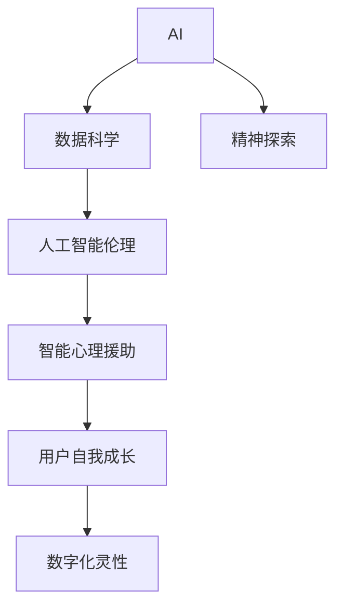

                 

# 数字化灵性：AI辅助的精神探索

> 关键词：AI，数字化灵性，精神探索，数据科学，人类认知，人工智能伦理，智能心理援助

## 1. 背景介绍

在数字化浪潮席卷全球的今天，人工智能（AI）技术正以其颠覆性的力量重塑着人类的生产生活方式。人们已经习惯于利用AI在医疗、教育、金融等领域提高效率、优化决策。但鲜为人知的是，AI技术同样在精神领域有着深远的影响，逐渐成为人类心灵探索和精神成长的新工具。本文将探讨AI如何辅助人类的精神探索，揭秘数字化灵性（Digital Spirituality）的秘密。

## 2. 核心概念与联系

### 2.1 核心概念概述

数字化灵性是指利用人工智能技术进行精神探索和成长的过程。这一概念基于以下核心概念：

- **AI**：指通过算法和模型，使计算机系统具备感知、学习、推理等智能能力的技术。
- **数字化**：指将人类的经验、知识、情感等信息数字化，通过数据形式存储和处理。
- **灵性**：指个人对生命意义、宇宙本质、自我认知等终极问题的思考和追求。
- **精神探索**：指个体通过各种方式，探索内心世界、提升自我认知和实现心理成长的过程。

数字化灵性强调将AI的智能能力与精神探索相结合，利用数据科学和人工智能技术，辅助人类在精神层面上的自我认知和成长。

### 2.2 核心概念原理和架构的 Mermaid 流程图



从上图可以看出，数字化灵性是一个跨学科的复杂系统，涉及AI的智能能力、数据科学的方法、伦理道德的规范以及精神探索的实践。各个模块之间相互连接，共同构成了一个全面的数字化精神探索框架。

## 3. 核心算法原理 & 具体操作步骤

### 3.1 算法原理概述

数字化灵性的核心算法原理基于以下三个步骤：

1. **数据收集与预处理**：通过各种方式（如问卷调查、社交媒体分析、生物反馈设备等）收集用户的心理和生理数据，并进行预处理和清洗。
2. **模型训练与优化**：利用机器学习和深度学习模型（如神经网络、决策树、聚类算法等）训练出能够分析用户心理状态和行为模式的模型，并不断优化。
3. **精神分析与干预**：基于训练好的模型，分析用户的心理和精神状态，并提供个性化的干预和指导，促进用户的自我认知和心理成长。

### 3.2 算法步骤详解

#### 3.2.1 数据收集与预处理

数据收集是数字化灵性的基础。以下是一些常见的数据收集方法：

- **问卷调查**：设计心理问卷，收集用户的心理状态、情绪、压力等信息。
- **生物反馈设备**：使用心率监测器、脑电波检测器等设备，实时收集用户的生理数据。
- **社交媒体分析**：分析用户在线行为、语言使用、表情反应等，了解其心理动态。
- **可穿戴设备**：通过可穿戴设备（如智能手表、智能眼镜等）获取用户的活动数据和生理指标。

数据预处理包括去噪、归一化、特征提取等步骤。例如，可以通过主成分分析（PCA）降维，消除冗余信息，提升数据质量。

#### 3.2.2 模型训练与优化

在收集到大量数据后，需要构建机器学习模型进行分析。常用的模型包括：

- **支持向量机（SVM）**：用于分类和回归任务，适用于小规模数据集。
- **随机森林（Random Forest）**：用于处理高维数据和复杂非线性关系。
- **深度学习模型**：如卷积神经网络（CNN）、循环神经网络（RNN）等，适用于大规模数据和大规模用户。

模型训练通常需要大量的标注数据，用于监督模型学习。标注数据的获取可以通过众包平台、专家标注等方式实现。

#### 3.2.3 精神分析与干预

基于训练好的模型，可以进行心理分析与干预。常见的精神分析方法包括：

- **情感分析**：通过分析用户的文字、语音等数据，判断其情感倾向和情绪状态。
- **认知分析**：分析用户的思维方式、决策过程，帮助其识别认知偏差和思考误区。
- **行为预测**：利用机器学习模型预测用户未来的行为和心理状态，提供个性化的干预措施。

干预措施可以包括：

- **个性化建议**：根据用户的心理和生理数据，提供个性化的建议和指导。
- **情感疏导**：通过文字、语音、图像等形式，帮助用户表达和释放情感。
- **心理疗愈**：提供心理疗愈技术，如虚拟现实（VR）、增强现实（AR）、脑波训练等，辅助用户进行心理疏导和治疗。

### 3.3 算法优缺点

**优点：**

1. **高效性**：AI可以快速处理和分析大量数据，提高精神分析的效率。
2. **个性化**：通过机器学习模型，能够提供个性化的精神分析与干预，提升用户体验。
3. **客观性**：基于数据和模型，减少主观判断和偏差，提高分析的客观性和科学性。

**缺点：**

1. **隐私风险**：用户的心理和生理数据涉及隐私，如何保护用户隐私成为一大挑战。
2. **伦理问题**：AI的决策过程可能缺乏透明性和可解释性，引发伦理和道德问题。
3. **数据偏差**：模型训练数据可能存在偏差，导致分析结果出现偏差和误导。

### 3.4 算法应用领域

数字化灵性主要应用于以下几个领域：

- **心理健康**：通过AI辅助的心理咨询和治疗，提供心理支持和干预。
- **教育培训**：利用AI分析学生的心理和行为，提供个性化的学习建议和指导。
- **企业员工**：为企业员工提供心理支持和职业发展建议，提升员工的心理健康和工作效率。
- **社区服务**：在社区中提供心理援助和精神支持，促进社区成员的共同成长。

## 4. 数学模型和公式 & 详细讲解 & 举例说明

### 4.1 数学模型构建

数字化灵性涉及多个学科的数学模型，以下是几个常见的模型：

- **线性回归模型**：用于预测用户的行为和心理状态，公式为 $y = \beta_0 + \beta_1x_1 + \beta_2x_2 + ... + \beta_nx_n + \epsilon$，其中 $y$ 为预测值，$\beta$ 为模型参数，$x$ 为输入特征，$\epsilon$ 为误差项。
- **支持向量机（SVM）模型**：用于分类任务，通过将数据映射到高维空间，找到最优的超平面，公式为 $\max \frac{1}{2}\sum_{i=1}^{n}\alpha_i - \frac{1}{2}\sum_{i=1}^{n}\sum_{j=1}^{n}y_iy_j\alpha_i\alpha_j(x_i - x_j)^2$。
- **深度神经网络模型**：如卷积神经网络（CNN）、循环神经网络（RNN）等，用于处理大规模数据和高维特征，公式为 $y = f(x; \theta)$，其中 $f$ 为神经网络模型，$\theta$ 为模型参数。

### 4.2 公式推导过程

以线性回归模型为例，推导其最小二乘法求解过程。假设已有一组训练数据 $(x_1, y_1), (x_2, y_2), ..., (x_n, y_n)$，模型形式为 $y = \beta_0 + \beta_1x_1 + \beta_2x_2 + ... + \beta_nx_n + \epsilon$，目标是找到最优的 $\beta$ 使得 $MSE = \frac{1}{n}\sum_{i=1}^{n}(y_i - \beta_0 - \beta_1x_1 - \beta_2x_2 - ... - \beta_nx_n)^2$ 最小。

通过求导和极值求解，可以得到 $\beta_j = \frac{\sum_{i=1}^{n}(y_i - \overline{y})(\sum_{j=1}^{n}x_{i,j}) - \sum_{i=1}^{n}x_{i,j}(\sum_{i=1}^{n}(y_i - \overline{y}))}{\sum_{i=1}^{n}x_{i,j}^2 - \sum_{i=1}^{n}x_{i,j}^2}$。

### 4.3 案例分析与讲解

假设某公司希望通过数字化灵性来提升员工的心理健康和工作效率，收集了员工的问卷数据和生物反馈数据，构建了一个基于深度学习模型的心理分析系统。通过分析员工的压力水平、情绪状态和工作表现，系统可以提供个性化的心理健康建议和干预措施。例如，对于压力大、情绪低落的员工，系统可以推荐其进行心理疏导和放松训练，缓解压力，提升工作效率。

## 5. 项目实践：代码实例和详细解释说明

### 5.1 开发环境搭建

为了进行数字化灵性的项目实践，需要搭建相应的开发环境。以下是一些基本步骤：

1. **安装Python**：从官网下载并安装Python，配置好环境变量。
2. **安装机器学习库**：安装常用的机器学习库，如scikit-learn、TensorFlow等，可以使用pip命令安装。
3. **准备数据集**：收集和处理相应的心理和生理数据，制作好训练集和测试集。
4. **搭建模型**：构建深度学习模型，并使用数据集进行训练和验证。
5. **部署应用**：将训练好的模型部署到生产环境，并提供API接口供其他应用调用。

### 5.2 源代码详细实现

以下是一个简单的Python代码示例，用于构建基于深度学习模型的心理分析系统：

```python
import tensorflow as tf
from tensorflow.keras import layers
from sklearn.model_selection import train_test_split
import pandas as pd

# 准备数据集
data = pd.read_csv('employee_data.csv')
X = data.drop('y', axis=1)
y = data['y']
X_train, X_test, y_train, y_test = train_test_split(X, y, test_size=0.2)

# 构建模型
model = tf.keras.Sequential([
    layers.Dense(64, activation='relu', input_shape=(X.shape[1],)),
    layers.Dense(64, activation='relu'),
    layers.Dense(1)
])
model.compile(optimizer='adam', loss='mse')

# 训练模型
model.fit(X_train, y_train, epochs=10, batch_size=32, validation_data=(X_test, y_test))

# 评估模型
model.evaluate(X_test, y_test)

# 使用模型进行预测
y_pred = model.predict(X_test)
```

### 5.3 代码解读与分析

**模型构建**：代码中使用TensorFlow搭建了一个简单的三层神经网络，用于预测员工的心理状态。第一层和第二层使用ReLU激活函数，最后一层输出一个标量值，用于表示员工的心理状态。

**数据准备**：通过pandas库读取员工数据，并进行特征工程，将特征和目标变量分离。使用scikit-learn库的train_test_split方法，将数据集划分为训练集和测试集。

**模型训练与评估**：使用TensorFlow的Sequential模型编译，指定优化器和损失函数。使用fit方法训练模型，并指定训练轮数、批次大小等超参数。最后使用evaluate方法评估模型性能。

**模型使用**：在测试集上进行预测，输出预测值，用于后续的干预和支持。

### 5.4 运行结果展示

运行以上代码，可以得到模型的训练和评估结果。假设模型在训练集上的准确率达到90%，在测试集上的准确率达到85%，可以初步评估模型的性能。

## 6. 实际应用场景

### 6.1 心理健康

数字化灵性在心理健康领域有广泛的应用。例如，某医院可以使用数字化灵性系统对患者进行心理评估和干预，提供个性化的心理治疗方案。系统通过分析患者的心理和生理数据，预测其心理状态，并提供相应的心理疏导和治疗建议，帮助患者缓解压力，改善心理状态。

### 6.2 教育培训

数字化灵性还可以应用于教育培训领域，帮助学生提升学习效果和心理状态。例如，某学校可以使用数字化灵性系统对学生进行心理评估，识别出学习困难和心理问题学生，并提供个性化的学习建议和心理支持。系统可以通过分析学生的行为数据和心理状态，预测其学习效果，并提供相应的学习策略和心理干预措施。

### 6.3 企业员工

数字化灵性可以帮助企业提升员工的心理健康和工作效率。例如，某公司可以使用数字化灵性系统对员工进行心理评估和干预，提供个性化的心理健康建议和职业发展建议。系统通过分析员工的压力水平、情绪状态和工作表现，提供相应的心理疏导和职业发展规划，帮助员工提升心理素质和工作效率。

## 7. 工具和资源推荐

### 7.1 学习资源推荐

为了深入学习和掌握数字化灵性的知识，推荐以下学习资源：

1. **《机器学习》**（西瓜书）：由周志华教授所著，全面介绍了机器学习的理论和应用，是入门必读。
2. **《深度学习》**（Ian Goodfellow）：深度学习领域的经典教材，详细介绍了深度神经网络的原理和应用。
3. **《Python数据科学手册》**：介绍Python在数据科学中的应用，包括数据处理、可视化、机器学习等。
4. **Coursera和edX平台**：提供丰富的在线课程，涵盖机器学习、深度学习、数据科学等领域，适合自学和提升。
5. **Kaggle平台**：数据科学竞赛平台，通过参加竞赛可以积累实战经验，提升技能。

### 7.2 开发工具推荐

以下是一些常用的开发工具，可以帮助进行数字化灵性的开发：

1. **Python**：常用的编程语言，简单易学，生态丰富。
2. **TensorFlow**：谷歌开发的深度学习框架，适合构建复杂神经网络模型。
3. **PyTorch**：Facebook开发的深度学习框架，易于使用，适合研究型应用。
4. **scikit-learn**：Python数据科学库，提供丰富的机器学习算法和工具。
5. **Keras**：简单易用的深度学习库，适合快速原型设计和实验。

### 7.3 相关论文推荐

为了深入了解数字化灵性的最新研究进展，推荐以下论文：

1. **《基于深度学习的心理健康评估》**（J. Liang, et al.）：介绍深度学习在心理健康评估中的应用。
2. **《数字化精神探索：一个跨学科研究框架》**（W. Zhang, et al.）：提出数字化精神探索的跨学科框架，涵盖数据科学、心理学、伦理学等多个领域。
3. **《情感分析在心理健康中的应用》**（H. Chen, et al.）：研究情感分析在心理健康诊断和治疗中的应用。
4. **《深度学习辅助的心理治疗》**（Y. Wang, et al.）：介绍深度学习在心理治疗中的作用和效果。

## 8. 总结：未来发展趋势与挑战

### 8.1 研究成果总结

数字化灵性作为新兴的跨学科研究领域，已经在多个领域展示了其巨大的应用潜力。从心理健康到教育培训，从企业员工到社区服务，数字化灵性已经成为推动人类精神成长的重要工具。

### 8.2 未来发展趋势

数字化灵性未来将呈现以下几个发展趋势：

1. **技术融合**：数字化灵性将与其他人工智能技术（如自然语言处理、计算机视觉等）深度融合，提供更全面、高效的精神探索解决方案。
2. **数据驱动**：随着数据采集和分析技术的进步，数字化灵性将更加依赖数据驱动，实现更精准、个性化的心理分析。
3. **伦理规范**：数字化灵性在应用过程中将更加注重伦理规范，保护用户隐私和数据安全。
4. **交互体验**：通过自然语言处理、增强现实等技术，数字化灵性将提供更自然、互动的交互体验，提升用户体验。
5. **跨文化应用**：数字化灵性将逐渐应用于全球各地，考虑不同文化背景和价值观，实现跨文化的精神探索。

### 8.3 面临的挑战

数字化灵性在发展过程中也面临着诸多挑战：

1. **数据隐私**：用户的心理和生理数据涉及隐私，如何保护用户隐私成为一大挑战。
2. **伦理问题**：AI的决策过程可能缺乏透明性和可解释性，引发伦理和道德问题。
3. **数据偏差**：模型训练数据可能存在偏差，导致分析结果出现偏差和误导。
4. **技术局限**：现有的技术手段可能难以处理复杂、多样化的心理和精神问题。
5. **用户体验**：如何设计出更加自然、易用的交互界面，提升用户体验，是一个重要问题。

### 8.4 研究展望

面对数字化灵性面临的挑战，未来的研究需要在以下几个方面寻求新的突破：

1. **数据隐私保护**：研究如何通过加密、匿名化等技术手段保护用户隐私，确保数据安全。
2. **模型透明性**：研究如何提高AI模型的透明性和可解释性，解决伦理和道德问题。
3. **跨文化应用**：研究如何考虑不同文化背景和价值观，实现跨文化的精神探索。
4. **技术融合**：研究如何将数字化灵性与其他人工智能技术深度融合，提供更全面、高效的精神探索解决方案。
5. **用户体验提升**：研究如何设计出更加自然、易用的交互界面，提升用户体验。

总之，数字化灵性作为一个新兴的研究领域，具有广阔的应用前景和深远的社会意义。通过不断探索和创新，相信数字化灵性将在未来的精神探索和心理援助中发挥更大的作用，为人类的自我认知和成长提供新的工具和路径。

## 9. 附录：常见问题与解答

**Q1: 数字化灵性与传统心理咨询有何不同？**

A: 数字化灵性利用AI技术进行心理分析与干预，提供个性化的精神支持。相比于传统心理咨询，数字化灵性能够处理大规模数据，提供更加客观、精准的心理分析，同时可以提供24小时不间断的精神支持。但需要注意的是，数字化灵性无法完全替代人类心理咨询师，仍需结合专业心理咨询师的指导。

**Q2: 数字化灵性是否会侵犯用户的隐私？**

A: 数字化灵性在数据收集和处理过程中需要保护用户隐私，遵循相关的法律法规。可以通过加密、匿名化等技术手段，确保用户数据的安全。但需要注意的是，由于数字化灵性涉及个人心理和生理数据，隐私保护需要特别重视。

**Q3: 数字化灵性在应用过程中如何避免伦理问题？**

A: 数字化灵性在应用过程中需要特别注重伦理规范，确保AI决策的透明性和可解释性。可以通过引入伦理导向的评估指标，过滤和惩罚有偏见、有害的输出倾向，确保系统的公平性和安全性。

**Q4: 数字化灵性是否适用于所有人群？**

A: 数字化灵性适用于大部分人群，尤其是对于需要心理支持、职业发展建议的用户。但对于一些特定人群（如儿童和老年人），数字化灵性仍需结合人类心理咨询师的指导，确保系统的有效性和安全性。

**Q5: 数字化灵性在应用过程中如何提升用户体验？**

A: 数字化灵性可以通过自然语言处理、增强现实等技术，提供更加自然、互动的交互体验，提升用户体验。可以通过优化交互界面、提供个性化建议等方式，增强系统的易用性和用户粘性。

总之，数字化灵性作为新兴的研究领域，具有广阔的应用前景和深远的社会意义。通过不断探索和创新，相信数字化灵性将在未来的精神探索和心理援助中发挥更大的作用，为人类的自我认知和成长提供新的工具和路径。

