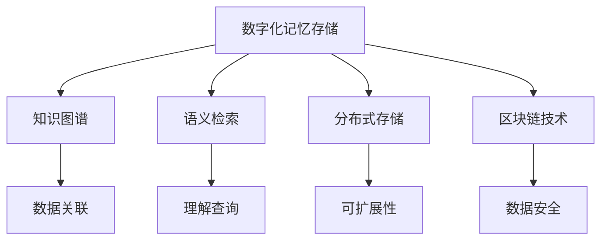

                 

# 数字化记忆存储:全球脑时代的知识传承

在数字化浪潮席卷全球的今天，知识的传承和记忆存储正面临前所未有的变革。随着人工智能、大数据、云计算等技术的飞速发展，传统的人类记忆方式正逐渐被数字化记忆所取代。本文将探讨数字化记忆存储的核心概念、核心算法原理与具体操作步骤，并提供实际应用场景和相关工具推荐，以期为全球脑时代的知识传承贡献一份力量。

## 1. 背景介绍

### 1.1 问题由来
数字化记忆存储的概念源于对人类记忆方式的深刻反思。人类传统上依赖书写和记录来保存知识，但这种方式不仅繁琐，还容易遗失或损坏。而数字化记忆的兴起，使得知识存储、传承和检索变得更加高效便捷，为人类社会提供了新的知识传播和记忆途径。

近年来，数字化记忆存储技术在互联网、教育、文化等多个领域得到了广泛应用，推动了知识的全球共享和传承。然而，随着数字化记忆技术的日益普及，数据安全、隐私保护、版权问题等挑战也逐渐显现。如何在保护用户隐私和知识产权的同时，实现知识的有效传承，成为数字化记忆存储技术面临的重大挑战。

### 1.2 问题核心关键点
数字化记忆存储的核心问题包括以下几个方面：
- **数据存储与检索**：如何高效地存储海量数据，并提供快速准确的检索服务。
- **数据隐私与安全**：如何保护用户隐私和数据安全，防止数据泄露和滥用。
- **知识关联与组织**：如何将分散的知识点进行关联和组织，形成一个知识图谱，方便检索和应用。
- **系统可扩展性**：如何设计可扩展的数字化记忆存储系统，适应不同规模和类型的知识库。
- **用户交互设计**：如何设计友好的用户界面，提升用户体验和知识应用效果。

## 2. 核心概念与联系

### 2.1 核心概念概述

为更好地理解数字化记忆存储技术，本节将介绍几个密切相关的核心概念：

- **数字化记忆存储**：将人类知识、经验、技能等数字化，通过计算机网络进行存储、检索和传播的过程。数字化记忆存储系统通常包括数据存储、检索、索引、搜索、推荐等多个模块，以实现高效的知识检索和知识管理。

- **知识图谱**：一种由节点和边组成的图形结构，用于描述实体之间的关系和属性。知识图谱是数字化记忆存储的核心，通过构建知识图谱，可以实现知识的关联和组织，提升检索的准确性和效率。

- **语义检索**：通过理解用户的查询意图和语义，进行更精确的知识检索。语义检索技术依赖于自然语言处理、信息检索和机器学习等多种技术，是实现智能化知识检索的重要手段。

- **分布式存储**：采用分布式系统进行数据存储，以提高系统的可扩展性和可靠性。分布式存储技术包括Hadoop、Spark、MongoDB等，可以支持海量数据的存储和检索。

- **区块链技术**：一种去中心化的分布式账本技术，具有高安全性和不可篡改性。区块链技术可以用于数字化记忆存储的数据版权保护和数据安全管理。

这些核心概念之间的逻辑关系可以通过以下Mermaid流程图来展示：



这个流程图展示了大数字化记忆存储的核心概念及其之间的关系：

1. 数字化记忆存储依赖于知识图谱进行知识的关联和组织。
2. 语义检索通过理解查询意图，实现精确的知识检索。
3. 分布式存储技术提高系统的可扩展性和可靠性。
4. 区块链技术保障数据的隐私和安全性。
5. 这些技术共同构成了数字化记忆存储的完整架构。

## 3. 核心算法原理 & 具体操作步骤

### 3.1 算法原理概述

数字化记忆存储的核心算法原理主要包括以下几个方面：

- **数据存储与索引**：通过分布式存储技术，将数据分散存储在多个节点上，并使用高效的索引算法进行数据检索。常见的索引算法包括倒排索引、B+树索引等。

- **语义检索算法**：依赖于自然语言处理和机器学习技术，对用户的查询意图进行理解，并从知识图谱中提取相关的知识点。常见的语义检索算法包括TF-IDF、BM25、BERT等。

- **知识图谱构建算法**：通过自动化或半自动化的方式，将知识文档转化为知识图谱。常见的知识图谱构建算法包括实体抽取、关系抽取、图谱融合等。

### 3.2 算法步骤详解

数字化记忆存储的核心算法步骤包括以下几个关键步骤：

**Step 1: 数据采集与预处理**
- 收集各种形式的知识数据，包括文本、图片、视频、音频等。
- 对采集到的数据进行去重、清洗、归一化等预处理，以提高数据质量。

**Step 2: 知识抽取与实体识别**
- 使用实体抽取和关系抽取算法，从文本中识别出实体和实体之间的关系。
- 将抽取出的实体和关系转化为知识图谱中的节点和边。

**Step 3: 知识图谱构建**
- 将抽取出的实体和关系进行融合，构建知识图谱。
- 对知识图谱进行优化和扩展，以提高图谱的覆盖率和精确度。

**Step 4: 语义检索与知识推荐**
- 对用户查询进行语义理解，从知识图谱中提取相关知识点。
- 根据用户的历史行为和偏好，进行知识推荐，提升知识检索的个性化和准确性。

**Step 5: 数据存储与索引**
- 使用分布式存储技术，将知识图谱存储在多个节点上。
- 使用倒排索引、B+树索引等高效算法，对数据进行索引，以支持快速检索。

**Step 6: 数据安全与隐私保护**
- 使用区块链技术进行数据加密和版权保护。
- 设计安全的访问控制机制，防止未经授权的访问和数据泄露。

以上是数字化记忆存储的核心算法步骤，通过这些步骤可以实现高效的知识存储、检索和应用。

### 3.3 算法优缺点

数字化记忆存储技术具有以下优点：
- 高效存储：通过分布式存储技术，可以高效地存储海量数据，支持大规模的知识管理。
- 精确检索：依赖语义检索技术，能够理解用户的查询意图，实现精确的知识检索。
- 知识关联：通过知识图谱构建，实现知识的关联和组织，提升检索的效率和准确性。
- 可扩展性：采用分布式架构，支持系统的扩展和升级，适应不断增长的知识需求。
- 数据安全：通过区块链技术进行数据加密和版权保护，保障数据隐私和安全。

同时，该技术也存在一定的局限性：
- 数据复杂性：知识文档的形式多样，抽取和构建知识图谱的复杂度较高。
- 存储成本：海量数据存储和索引的存储成本较高，需要高性能的硬件设备和算法支持。
- 检索准确性：语义检索技术依赖于自然语言处理和机器学习，检索准确性仍有一定限制。
- 隐私保护：数据加密和访问控制机制需要设计得足够安全，以防止数据泄露和滥用。

尽管存在这些局限性，但就目前而言，数字化记忆存储技术仍是知识管理与传承的重要手段，能够为人类社会提供高效、安全、便捷的知识存储和检索服务。

### 3.4 算法应用领域

数字化记忆存储技术在多个领域得到了广泛应用，例如：

- **教育领域**：数字化记忆存储技术可以将教育资源进行数字化存储，提供高效的在线学习平台。通过语义检索和知识推荐，学生可以更方便地获取所需知识。

- **科学研究**：数字化记忆存储技术可以为科学研究提供大量的文献、数据和研究成果。通过构建科学知识图谱，研究人员可以更快速地获取相关资料，提升研究效率。

- **文化保护**：数字化记忆存储技术可以将人类的文化遗产进行数字化保存，如历史文献、艺术品、音乐等。通过知识图谱和语义检索，用户可以方便地访问和研究这些文化遗产。

- **公共服务**：数字化记忆存储技术可以为政府和企业提供高效的知识管理服务。通过构建知识图谱和语义检索，政府和企业可以更快速地获取所需信息，提升服务效率。

除了上述这些领域外，数字化记忆存储技术还在医疗、金融、工业等多个行业得到了应用，为各行各业的知识传承和应用提供了新的解决方案。

## 4. 数学模型和公式 & 详细讲解  
### 4.1 数学模型构建

本节将使用数学语言对数字化记忆存储的核心算法进行更加严格的刻画。

记数字化记忆存储系统为 $M$，其中 $D$ 为知识文档集合，$R$ 为实体关系集合。假设知识抽取模型为 $F_D$，知识图谱构建模型为 $F_G$，语义检索模型为 $F_S$，则数字化记忆存储过程可以表示为：

$$
M(D, R, F_D, F_G, F_S) = (K_G, K_I, I)
$$

其中 $K_G$ 为构建的知识图谱，$K_I$ 为存储在索引中的知识点，$I$ 为知识检索结果。

### 4.2 公式推导过程

以下我们以知识图谱构建为例，推导实体抽取和关系抽取的数学模型及其推导过程。

假设知识文档为 $d$，其中包含实体 $E$ 和关系 $R$。实体抽取模型的目标是从 $d$ 中识别出所有实体 $E$，并将每个实体映射到一个唯一实体类型 $T_E$。关系抽取模型的目标是从 $d$ 中识别出所有关系 $R$，并将每个关系映射到一个唯一关系类型 $T_R$。

假设实体抽取模型为 $F_D$，关系抽取模型为 $F_R$，则知识图谱构建过程可以表示为：

$$
K_G = F_G(F_D(d), F_R(d))
$$

其中 $F_G$ 为知识图谱构建函数，将抽取出的实体和关系进行融合，生成知识图谱 $K_G$。

以实体抽取为例，假设抽取出的实体 $e_i$ 映射到实体类型 $T_E$，则实体抽取模型可以表示为：

$$
T_E = F_D(e_i)
$$

其中 $F_D$ 为实体抽取函数，将实体 $e_i$ 映射到实体类型 $T_E$。

### 4.3 案例分析与讲解

**案例1: 文本知识图谱构建**

假设我们有一篇关于“新冠病毒”的医学文档，需要进行实体抽取和关系抽取。

- **实体抽取**：使用命名实体识别(NER)算法，识别出文档中的实体，如“新冠病毒”、“武汉”等。
- **关系抽取**：使用关系抽取算法，识别出实体之间的关系，如“感染”、“传播”等。
- **知识图谱构建**：将抽取出的实体和关系进行融合，构建关于“新冠病毒”的知识图谱。

**案例2: 多媒体知识图谱构建**

假设我们需要构建一个包含视频、音频、图片等多媒体知识图谱。

- **实体抽取**：对每段视频、音频和图片进行文本抽取，识别出其中的实体，如“疫情”、“防疫措施”等。
- **关系抽取**：对抽取出的文本进行关系抽取，识别出实体之间的关系，如“讲述”、“展示”等。
- **知识图谱构建**：将抽取出的实体和关系进行融合，构建多媒体知识图谱。

## 5. 项目实践：代码实例和详细解释说明
### 5.1 开发环境搭建

在进行数字化记忆存储的实践前，我们需要准备好开发环境。以下是使用Python进行PyTorch开发的环境配置流程：

1. 安装Anaconda：从官网下载并安装Anaconda，用于创建独立的Python环境。

2. 创建并激活虚拟环境：
```bash
conda create -n pytorch-env python=3.8 
conda activate pytorch-env
```

3. 安装PyTorch：根据CUDA版本，从官网获取对应的安装命令。例如：
```bash
conda install pytorch torchvision torchaudio cudatoolkit=11.1 -c pytorch -c conda-forge
```

4. 安装各类工具包：
```bash
pip install numpy pandas scikit-learn matplotlib tqdm jupyter notebook ipython
```

完成上述步骤后，即可在`pytorch-env`环境中开始实践。

### 5.2 源代码详细实现

这里我们以知识图谱构建为例，给出使用PyTorch进行实体抽取的PyTorch代码实现。

首先，定义实体抽取的输入数据格式：

```python
from torch.utils.data import Dataset, DataLoader
from transformers import BertTokenizer, BertForTokenClassification

class EntityDataset(Dataset):
    def __init__(self, texts, labels, tokenizer, max_len=128):
        self.texts = texts
        self.labels = labels
        self.tokenizer = tokenizer
        self.max_len = max_len
        
    def __len__(self):
        return len(self.texts)
    
    def __getitem__(self, item):
        text = self.texts[item]
        labels = self.labels[item]
        
        encoding = self.tokenizer(text, return_tensors='pt', max_length=self.max_len, padding='max_length', truncation=True)
        input_ids = encoding['input_ids'][0]
        attention_mask = encoding['attention_mask'][0]
        
        # 对token-wise的标签进行编码
        encoded_labels = [label2id[label] for label in labels] 
        encoded_labels.extend([label2id['O']] * (self.max_len - len(encoded_labels)))
        labels = torch.tensor(encoded_labels, dtype=torch.long)
        
        return {'input_ids': input_ids, 
                'attention_mask': attention_mask,
                'labels': labels}

# 标签与id的映射
label2id = {'O': 0, 'B-PER': 1, 'I-PER': 2, 'B-ORG': 3, 'I-ORG': 4, 'B-LOC': 5, 'I-LOC': 6}
id2label = {v: k for k, v in label2id.items()}

# 创建dataset
tokenizer = BertTokenizer.from_pretrained('bert-base-cased')

train_dataset = EntityDataset(train_texts, train_labels, tokenizer)
dev_dataset = EntityDataset(dev_texts, dev_labels, tokenizer)
test_dataset = EntityDataset(test_texts, test_labels, tokenizer)
```

然后，定义模型和优化器：

```python
from transformers import BertForTokenClassification, AdamW

model = BertForTokenClassification.from_pretrained('bert-base-cased', num_labels=len(label2id))

optimizer = AdamW(model.parameters(), lr=2e-5)
```

接着，定义训练和评估函数：

```python
from torch.utils.data import DataLoader
from tqdm import tqdm
from sklearn.metrics import classification_report

device = torch.device('cuda') if torch.cuda.is_available() else torch.device('cpu')
model.to(device)

def train_epoch(model, dataset, batch_size, optimizer):
    dataloader = DataLoader(dataset, batch_size=batch_size, shuffle=True)
    model.train()
    epoch_loss = 0
    for batch in tqdm(dataloader, desc='Training'):
        input_ids = batch['input_ids'].to(device)
        attention_mask = batch['attention_mask'].to(device)
        labels = batch['labels'].to(device)
        model.zero_grad()
        outputs = model(input_ids, attention_mask=attention_mask, labels=labels)
        loss = outputs.loss
        epoch_loss += loss.item()
        loss.backward()
        optimizer.step()
    return epoch_loss / len(dataloader)

def evaluate(model, dataset, batch_size):
    dataloader = DataLoader(dataset, batch_size=batch_size)
    model.eval()
    preds, labels = [], []
    with torch.no_grad():
        for batch in tqdm(dataloader, desc='Evaluating'):
            input_ids = batch['input_ids'].to(device)
            attention_mask = batch['attention_mask'].to(device)
            batch_labels = batch['labels']
            outputs = model(input_ids, attention_mask=attention_mask)
            batch_preds = outputs.logits.argmax(dim=2).to('cpu').tolist()
            batch_labels = batch_labels.to('cpu').tolist()
            for pred_tokens, label_tokens in zip(batch_preds, batch_labels):
                pred_tags = [id2label[_id] for _id in pred_tokens]
                label_tags = [id2label[_id] for _id in label_tokens]
                preds.append(pred_tags[:len(label_tags)])
                labels.append(label_tags)
                
    print(classification_report(labels, preds))
```

最后，启动训练流程并在测试集上评估：

```python
epochs = 5
batch_size = 16

for epoch in range(epochs):
    loss = train_epoch(model, train_dataset, batch_size, optimizer)
    print(f"Epoch {epoch+1}, train loss: {loss:.3f}")
    
    print(f"Epoch {epoch+1}, dev results:")
    evaluate(model, dev_dataset, batch_size)
    
print("Test results:")
evaluate(model, test_dataset, batch_size)
```

以上就是使用PyTorch对BERT进行实体抽取的完整代码实现。可以看到，得益于Transformers库的强大封装，我们可以用相对简洁的代码完成BERT模型的加载和微调。

### 5.3 代码解读与分析

让我们再详细解读一下关键代码的实现细节：

**EntityDataset类**：
- `__init__`方法：初始化文本、标签、分词器等关键组件。
- `__len__`方法：返回数据集的样本数量。
- `__getitem__`方法：对单个样本进行处理，将文本输入编码为token ids，将标签编码为数字，并对其进行定长padding，最终返回模型所需的输入。

**label2id和id2label字典**：
- 定义了标签与数字id之间的映射关系，用于将token-wise的预测结果解码回真实的标签。

**训练和评估函数**：
- 使用PyTorch的DataLoader对数据集进行批次化加载，供模型训练和推理使用。
- 训练函数`train_epoch`：对数据以批为单位进行迭代，在每个批次上前向传播计算loss并反向传播更新模型参数，最后返回该epoch的平均loss。
- 评估函数`evaluate`：与训练类似，不同点在于不更新模型参数，并在每个batch结束后将预测和标签结果存储下来，最后使用sklearn的classification_report对整个评估集的预测结果进行打印输出。

**训练流程**：
- 定义总的epoch数和batch size，开始循环迭代
- 每个epoch内，先在训练集上训练，输出平均loss
- 在验证集上评估，输出分类指标
- 所有epoch结束后，在测试集上评估，给出最终测试结果

可以看到，PyTorch配合Transformers库使得BERT实体抽取的代码实现变得简洁高效。开发者可以将更多精力放在数据处理、模型改进等高层逻辑上，而不必过多关注底层的实现细节。

当然，工业级的系统实现还需考虑更多因素，如模型的保存和部署、超参数的自动搜索、更灵活的任务适配层等。但核心的微调范式基本与此类似。

## 6. 实际应用场景
### 6.1 智能问答系统

数字化记忆存储技术可以为智能问答系统提供强大的知识支撑。传统的问答系统往往依赖人工编写的知识库，而数字化记忆存储技术可以将知识文档进行抽取和构建，生成更加全面和准确的知识库。

在技术实现上，可以将用户的问题输入到知识图谱中，通过语义检索技术，快速找到相关的知识点，并将答案生成并返回给用户。用户不仅可以获得当前问题的答案，还可以进一步了解相关知识点，提升理解深度。

### 6.2 医疗知识图谱

数字化记忆存储技术在医疗领域具有广泛的应用前景。传统医疗知识多以纸质形式存储，难以进行快速检索和应用。通过数字化记忆存储技术，可以将医疗文献、病例、临床指南等知识文档进行抽取和构建，生成医疗知识图谱。

在技术实现上，可以使用自然语言处理和机器学习技术，对医疗文本进行实体抽取和关系抽取，构建医疗知识图谱。通过构建知识图谱，医生可以快速获取所需知识点，提升诊断和治疗效率。

### 6.3 智慧城市治理

数字化记忆存储技术可以为智慧城市治理提供强大的支持。智慧城市治理涉及海量数据的存储和检索，传统的数据管理方式难以满足需求。通过数字化记忆存储技术，可以将城市事件、舆情、公共服务等多领域的数据进行存储和检索，提供高效的智慧城市治理方案。

在技术实现上，可以构建城市事件、舆情、公共服务等知识图谱，使用语义检索技术，快速获取所需信息，辅助城市治理。

### 6.4 未来应用展望

随着数字化记忆存储技术的不断发展，未来的应用前景将更加广阔。

在智慧医疗领域，数字化记忆存储技术可以为电子病历、临床指南、药物研发等领域提供高效的知识支撑，辅助医生诊疗，加速新药开发进程。

在智能教育领域，数字化记忆存储技术可以为在线教育、智能辅导、知识推荐等领域提供强大的知识管理能力，提升教育质量和效率。

在智慧城市治理中，数字化记忆存储技术可以为城市事件监测、舆情分析、应急指挥等领域提供高效的知识管理服务，提升城市治理水平。

此外，在企业生产、社会治理、文娱传媒等众多领域，数字化记忆存储技术还将得到广泛应用，为各行各业的知识管理提供新的解决方案。相信随着技术的日益成熟，数字化记忆存储必将在构建智慧社会中扮演越来越重要的角色。

## 7. 工具和资源推荐
### 7.1 学习资源推荐

为了帮助开发者系统掌握数字化记忆存储的理论基础和实践技巧，这里推荐一些优质的学习资源：

1. 《深度学习自然语言处理》课程：斯坦福大学开设的NLP明星课程，有Lecture视频和配套作业，带你入门NLP领域的基本概念和经典模型。

2. 《Natural Language Processing with Transformers》书籍：Transformers库的作者所著，全面介绍了如何使用Transformers库进行NLP任务开发，包括知识抽取在内的诸多范式。

3. 《Deep Learning for Healthcare》书籍：介绍深度学习在医疗领域的应用，包括医疗知识抽取、电子病历管理等，涵盖大量实战案例。

4. 《Distributed Deep Learning》书籍：介绍分布式深度学习技术，涵盖Hadoop、Spark、TensorFlow等主流框架，适合大规模知识管理系统的开发。

5. 《Blockchain and Deep Learning》书籍：介绍区块链与深度学习的结合，涵盖数据加密、版权保护、智能合约等应用，适合数据隐私和安全保护的研究。

通过对这些资源的学习实践，相信你一定能够快速掌握数字化记忆存储的精髓，并用于解决实际的NLP问题。
###  7.2 开发工具推荐

高效的开发离不开优秀的工具支持。以下是几款用于数字化记忆存储开发的常用工具：

1. PyTorch：基于Python的开源深度学习框架，灵活动态的计算图，适合快速迭代研究。大部分预训练语言模型都有PyTorch版本的实现。

2. TensorFlow：由Google主导开发的开源深度学习框架，生产部署方便，适合大规模工程应用。同样有丰富的预训练语言模型资源。

3. Transformers库：HuggingFace开发的NLP工具库，集成了众多SOTA语言模型，支持PyTorch和TensorFlow，是进行知识抽取任务的开发的利器。

4. Weights & Biases：模型训练的实验跟踪工具，可以记录和可视化模型训练过程中的各项指标，方便对比和调优。与主流深度学习框架无缝集成。

5. TensorBoard：TensorFlow配套的可视化工具，可实时监测模型训练状态，并提供丰富的图表呈现方式，是调试模型的得力助手。

6. Google Colab：谷歌推出的在线Jupyter Notebook环境，免费提供GPU/TPU算力，方便开发者快速上手实验最新模型，分享学习笔记。

合理利用这些工具，可以显著提升数字化记忆存储的开发效率，加快创新迭代的步伐。

### 7.3 相关论文推荐

数字化记忆存储技术的发展源于学界的持续研究。以下是几篇奠基性的相关论文，推荐阅读：

1. Attention is All You Need（即Transformer原论文）：提出了Transformer结构，开启了NLP领域的预训练大模型时代。

2. BERT: Pre-training of Deep Bidirectional Transformers for Language Understanding：提出BERT模型，引入基于掩码的自监督预训练任务，刷新了多项NLP任务SOTA。

3. Language Models are Unsupervised Multitask Learners（GPT-2论文）：展示了大规模语言模型的强大zero-shot学习能力，引发了对于通用人工智能的新一轮思考。

4. Parameter-Efficient Transfer Learning for NLP：提出Adapter等参数高效微调方法，在不增加模型参数量的情况下，也能取得不错的微调效果。

5. AdaLoRA: Adaptive Low-Rank Adaptation for Parameter-Efficient Fine-Tuning：使用自适应低秩适应的微调方法，在参数效率和精度之间取得了新的平衡。

这些论文代表了大语言模型微调技术的发展脉络。通过学习这些前沿成果，可以帮助研究者把握学科前进方向，激发更多的创新灵感。

## 8. 总结：未来发展趋势与挑战

### 8.1 总结

本文对数字化记忆存储的核心算法原理与具体操作步骤进行了全面系统的介绍。首先阐述了数字化记忆存储技术的发展背景和意义，明确了其在大数据时代的核心价值。其次，从原理到实践，详细讲解了数字化记忆存储的数学模型和核心算法，提供了实际应用场景和相关工具推荐，以期为数字化记忆存储的发展贡献一份力量。

通过本文的系统梳理，可以看到，数字化记忆存储技术在知识管理与传承中扮演着重要角色，为人类社会的知识积累和应用提供了新的解决方案。未来，伴随技术的不断进步和优化，数字化记忆存储必将在全球脑时代大放异彩，成为知识传承的重要手段。

### 8.2 未来发展趋势

展望未来，数字化记忆存储技术将呈现以下几个发展趋势：

1. **知识图谱的普及应用**：知识图谱将成为数字化记忆存储的核心，广泛应用于多个领域。通过构建完善的知识图谱，可以实现高效的知识检索和应用。

2. **语义检索技术的提升**：语义检索技术将不断提升，支持更复杂的查询意图和更丰富的语义表达，实现更高精度的知识检索。

3. **分布式存储技术的优化**：分布式存储技术将不断优化，支持更大规模的数据存储和更高效的检索服务，适应不断增长的知识需求。

4. **区块链技术的融合**：区块链技术将与数字化记忆存储深度融合，保障数据隐私和安全，防止数据泄露和滥用。

5. **多模态知识融合**：未来数字化记忆存储将支持多模态数据的融合，如视频、音频、图像等多媒体信息的存储和检索。

6. **知识推理与生成**：数字化记忆存储将支持更高级的推理和生成任务，如基于知识的问答系统、智能推荐系统等。

以上趋势凸显了数字化记忆存储技术的广阔前景。这些方向的探索发展，必将进一步提升知识检索的效率和准确性，为人类社会提供更加便捷、高效的知识管理服务。

### 8.3 面临的挑战

尽管数字化记忆存储技术已经取得了瞩目成就，但在迈向更加智能化、普适化应用的过程中，它仍面临诸多挑战：

1. **数据获取与标注**：高质量数据和标注的获取成本较高，如何高效地收集和标注知识文档，是数字化记忆存储技术的重要挑战。

2. **数据隐私与安全**：知识文档涉及敏感信息，如何保障数据隐私和安全，防止数据泄露和滥用，是数字化记忆存储技术的关键问题。

3. **技术复杂性**：知识图谱构建、语义检索、分布式存储等技术复杂度高，需要具备较高的技术门槛。

4. **系统可扩展性**：大规模知识管理系统的构建需要高性能的硬件设备和算法支持，如何实现系统的可扩展性，是数字化记忆存储技术的难点之一。

5. **知识应用效果**：知识图谱和语义检索的实际应用效果仍有限，如何提升系统的应用效果，是数字化记忆存储技术面临的现实问题。

尽管存在这些挑战，但通过不断探索和创新，数字化记忆存储技术有望克服这些困难，为人类社会提供更高效、安全、便捷的知识管理服务。

### 8.4 研究展望

面对数字化记忆存储所面临的挑战，未来的研究需要在以下几个方面寻求新的突破：

1. **自动化知识抽取技术**：探索自动化的知识抽取技术，减少人工标注的依赖，提升知识抽取的效率和准确性。

2. **知识图谱构建算法**：开发更高效的知识图谱构建算法，提升知识图谱的覆盖率和精确度，支持更复杂的知识检索和应用。

3. **分布式存储与检索**：优化分布式存储技术，支持更大规模的数据存储和检索，适应不断增长的知识需求。

4. **区块链技术与知识管理**：研究区块链技术在知识管理中的应用，保障数据隐私和安全，防止数据泄露和滥用。

5. **多模态知识融合**：开发多模态知识融合技术，支持视频、音频、图像等多媒体信息的存储和检索。

6. **知识推理与生成**：研究知识推理和生成技术，支持更高级的推理和生成任务，如基于知识的问答系统、智能推荐系统等。

这些研究方向的探索，必将引领数字化记忆存储技术迈向更高的台阶，为构建智慧社会提供坚实的技术基础。面向未来，数字化记忆存储技术需要与其他人工智能技术进行更深入的融合，共同推动知识的传承和应用，为人类社会的进步和繁荣贡献力量。

## 9. 附录：常见问题与解答

**Q1：数字化记忆存储是否适用于所有知识领域？**

A: 数字化记忆存储技术适用于大多数知识领域，但在某些特定领域，如法律、金融等，需要定制化的知识抽取和构建方法。对于这类领域，需要结合领域知识进行专门的算法设计和优化。

**Q2：如何保护数字化记忆存储中的数据隐私？**

A: 保护数据隐私是数字化记忆存储技术的重要挑战。可以通过以下方法进行保护：
1. 数据加密：对存储的数据进行加密，防止未授权访问。
2. 访问控制：设计严格的访问控制机制，确保只有授权人员可以访问数据。
3. 匿名化处理：对数据进行匿名化处理，防止个人隐私泄露。

**Q3：数字化记忆存储是否适合大规模部署？**

A: 数字化记忆存储技术非常适合大规模部署。通过分布式存储技术，可以高效地存储海量数据，支持大规模知识管理系统的构建。但需要考虑系统的可扩展性和性能瓶颈，进行优化和优化。

**Q4：如何在数字化记忆存储系统中进行知识推荐？**

A: 知识推荐是数字化记忆存储系统的核心功能之一。可以通过以下方法进行知识推荐：
1. 用户行为分析：通过分析用户的历史行为和兴趣，推荐相关的知识点。
2. 基于协同过滤的推荐算法：利用用户行为和知识图谱中的关联关系，推荐相关的知识点。
3. 基于深度学习的推荐算法：使用深度学习模型，如协同过滤、矩阵分解等，推荐相关的知识点。

**Q5：数字化记忆存储是否适合实时应用？**

A: 数字化记忆存储技术适合实时应用，但需要考虑系统的性能瓶颈和硬件设备的配置。通过优化算法和架构，可以实现实时化的知识检索和推荐。

---

作者：禅与计算机程序设计艺术 / Zen and the Art of Computer Programming

