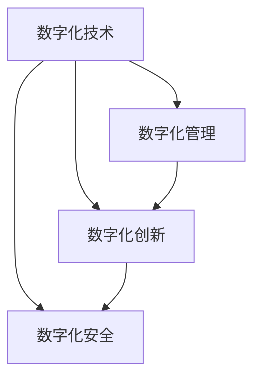

                 

## 1. 背景介绍

在数字时代的大潮中，传统企业面临着前所未有的挑战与机遇。互联网和技术的迅猛发展，已经深刻改变了各行各业的运营模式和竞争格局。企业的数字化转型，已成为其生存与发展的不二选择。然而，数字化转型不仅仅是一场技术变革，更是一场深刻的管理变革。本文将深入探讨数字化转型的核心概念、关键驱动因素、实施策略与挑战，为传统企业提供全方位的数字化转型管理指南。

## 2. 核心概念与联系

数字化转型是企业在技术、业务、文化等多维度上进行的根本性变革。其核心在于利用数字化技术手段，优化企业运营流程，提升业务效率，重塑企业竞争力。

- **数字化技术**：大数据、云计算、物联网、人工智能等数字化技术，是数字化转型的基础。它们提供底层技术支持，使企业能够更好地采集、处理和分析数据，实现数据的实时化、智能化。
- **数字化管理**：包括流程优化、组织重构、人才赋能、文化转变等，旨在将数字化技术深入企业运营的各个环节，提升企业的整体运营效率。
- **数字化创新**：通过数字化手段推动新产品、新业务、新模式的创新，引领企业实现商业模式的转型升级。
- **数字化安全**：在数字化转型过程中，企业必须建立全面的信息安全体系，防范数据泄露、网络攻击等风险。

这些概念之间存在相互依存、相互促进的关系。数字化技术是手段，数字化管理是保障，数字化创新是目标，数字化安全是底线。只有将这四者有机结合，才能真正实现企业的数字化转型。

### 2.1 核心概念原理和架构的 Mermaid 流程图



该流程图展示了数字化转型中各个概念之间的联系：
1. 数字化技术作为底层基础，为数字化管理、数字化创新和数字化安全提供支撑。
2. 数字化管理作为保障，确保数字化技术的应用效果，同时促进数字化创新的发展。
3. 数字化创新是数字化转型的核心目标，旨在通过数字化手段推动企业商业模式转型升级。
4. 数字化安全是底线，确保企业在数字化转型过程中数据和网络的安全。

## 3. 核心算法原理 & 具体操作步骤

### 3.1 算法原理概述

数字化转型的核心算法原理主要围绕数据驱动、流程优化、文化转变和协同创新展开。通过数据驱动，企业可以更好地理解市场、客户和运营状态，优化决策过程。流程优化和组织重构则旨在提高企业的运营效率，降低成本。文化转变和人才赋能是确保数字化转型的成功推行的关键，而协同创新则是推动企业创新的重要途径。

### 3.2 算法步骤详解

1. **数据驱动**
   - 收集和整合各类数据，包括客户数据、运营数据、市场数据等。
   - 利用数据挖掘、机器学习等技术，分析数据背后的业务规律和市场趋势。
   - 根据分析结果，制定针对性的业务决策。

2. **流程优化**
   - 识别和分析业务流程中的瓶颈和低效环节。
   - 设计并实施优化方案，如引入自动化工具、优化业务流程等。
   - 持续监控和评估优化效果，进行持续改进。

3. **文化转变**
   - 通过培训和宣贯，推动企业文化向数据驱动、创新导向、敏捷协同转变。
   - 鼓励员工参与数字化转型的各个环节，提高全员的数字化素养。
   - 设立数字化转型的目标和指标，定期评估和反馈。

4. **人才赋能**
   - 建立数字化团队，配备专业人才。
   - 提供持续的培训和赋能，提升团队的技术能力和业务理解。
   - 引入外部专家和顾问，协助企业解决数字化转型中的难题。

5. **协同创新**
   - 建立跨部门、跨层级的协同机制，促进信息共享和知识流动。
   - 引入创新工具和平台，鼓励团队进行创新实验。
   - 设立创新奖励机制，激发员工创新活力。

### 3.3 算法优缺点

数字化转型的核心算法具有以下优点：
1. **数据驱动决策**：通过数据分析，提高决策的科学性和准确性，降低决策风险。
2. **流程优化效率**：通过优化业务流程，提高运营效率，降低成本。
3. **文化转变促进**：通过推动文化转变，提升员工的数字化素养和创新意识。
4. **人才赋能提升**：通过人才赋能，提升团队的技术能力和业务理解，提高企业整体竞争力。
5. **协同创新加速**：通过协同创新，加速企业新技术和新业务的落地，推动企业商业模式转型升级。

然而，数字化转型也存在以下挑战：
1. **数据质量问题**：数据收集和整合过程中可能存在数据质量不高的现象，影响分析结果的准确性。
2. **技术复杂性**：数字化转型的技术涉及面广，技术复杂度高，实施难度大。
3. **文化阻力**：企业文化的转变需要时间和持续的推动，部分员工可能存在抵触情绪。
4. **成本投入高**：数字化转型的初期投入较大，短期内可能带来财务压力。
5. **风险管理**：数字化转型过程中可能面临数据安全、网络安全等风险。

### 3.4 算法应用领域

数字化转型的核心算法可以应用于多个领域，包括但不限于：
1. **制造业**：通过物联网、工业互联网等技术，实现智能制造和柔性生产。
2. **零售业**：利用大数据、AI等技术，优化库存管理、精准营销和客户服务。
3. **金融业**：通过区块链、AI等技术，提升金融服务的智能化和安全性。
4. **医疗健康**：利用大数据、AI等技术，优化诊疗流程，提升医疗服务质量。
5. **教育行业**：通过AI、VR/AR等技术，实现个性化教育和互动式教学。
6. **政府服务**：通过电子政务、AI等技术，提高政府服务的效率和透明度。

## 4. 数学模型和公式 & 详细讲解

### 4.1 数学模型构建

数字化转型的核心算法可以抽象为以下数学模型：

$$
\begin{aligned}
\max_{X, Y, Z, W} & \quad \text{目标函数} \\
\text{约束条件} & \quad \{ \text{数据质量} \leq \text{阈值} \wedge \text{技术复杂度} \leq \text{预算} \wedge \text{文化阻力} \leq \text{容忍度} \wedge \text{安全风险} \leq \text{风险阈值} \}
\end{aligned}
$$

其中，$X$ 表示数据驱动相关参数，$Y$ 表示流程优化相关参数，$Z$ 表示文化转变相关参数，$W$ 表示人才赋能和协同创新相关参数。

### 4.2 公式推导过程

以制造业为例，其数字化转型的目标函数可以表示为：

$$
\max_{\text{智能制造系统}} \quad \{\text{生产效率} \wedge \text{产品质量} \wedge \text{灵活性}\}
$$

约束条件可以表示为：

$$
\begin{aligned}
\text{数据质量} & \leq \text{阈值} \\
\text{技术复杂度} & \leq \text{预算} \\
\text{文化阻力} & \leq \text{容忍度} \\
\text{安全风险} & \leq \text{风险阈值}
\end{aligned}
$$

其中，生产效率、产品质量和灵活性通过智能制造系统实现。数据质量、技术复杂度、文化阻力和安全风险则需要通过相应的措施进行控制。

### 4.3 案例分析与讲解

以制造业为例，某传统制造企业通过引入智能制造系统，实现了生产效率的显著提升。具体步骤如下：

1. **数据驱动**
   - 收集和整合生产数据、设备数据、质检数据等，建立生产数据平台。
   - 利用机器学习算法，分析生产过程中的异常数据，预测设备故障。
   - 根据分析结果，优化生产计划和调度，降低停机时间。

2. **流程优化**
   - 引入自动化设备，减少人工操作，提高生产效率。
   - 优化生产流程，减少生产环节的浪费和瓶颈，提升生产灵活性。
   - 持续监控生产数据，及时调整生产策略，实现生产过程的动态优化。

3. **文化转变**
   - 通过培训和宣贯，推动员工接受新设备和新技术。
   - 设立数字化转型的目标和指标，定期评估和反馈。
   - 鼓励员工参与数字化转型的各个环节，提高全员的数字化素养。

4. **人才赋能**
   - 建立数字化团队，配备专业人才，如数据科学家、系统工程师等。
   - 提供持续的培训和赋能，提升团队的技术能力和业务理解。
   - 引入外部专家和顾问，协助企业解决数字化转型中的难题。

5. **协同创新**
   - 建立跨部门、跨层级的协同机制，促进信息共享和知识流动。
   - 引入创新工具和平台，鼓励团队进行创新实验。
   - 设立创新奖励机制，激发员工创新活力。

最终，该企业实现了生产效率提升30%，产品质量显著提高，同时降低了生产成本。

## 5. 项目实践：代码实例和详细解释说明

### 5.1 开发环境搭建

要进行数字化转型管理项目的开发，首先需要搭建开发环境。以下是使用Python进行开发的环境配置流程：

1. 安装Anaconda：从官网下载并安装Anaconda，用于创建独立的Python环境。

2. 创建并激活虚拟环境：
```bash
conda create -n digital-transformation python=3.8 
conda activate digital-transformation
```

3. 安装必要的Python库：
```bash
pip install pandas numpy matplotlib scikit-learn transformers
```

4. 安装一些用于数据处理的库：
```bash
pip install matplotlib pandas scikit-learn
```

5. 安装一些用于机器学习的库：
```bash
pip install scikit-learn numpy pandas tensorflow transformers
```

### 5.2 源代码详细实现

下面给出一段使用Python进行数据驱动决策的示例代码：

```python
import pandas as pd
import numpy as np
from sklearn.linear_model import LinearRegression

# 读取数据
data = pd.read_csv('production_data.csv')

# 数据预处理
X = data[['device_status', 'production_time']]
y = data['product_quality']

# 构建线性回归模型
model = LinearRegression()

# 训练模型
model.fit(X, y)

# 预测结果
pred = model.predict([[1, 8]])

# 输出结果
print(pred)
```

### 5.3 代码解读与分析

**数据预处理**
- `data['device_status']` 表示设备状态，0表示正常，1表示异常。
- `data['production_time']` 表示生产时间，单位为小时。
- `data['product_quality']` 表示产品质量，1表示优质，0表示不合格。

**模型训练**
- `LinearRegression()` 表示线性回归模型。
- `model.fit(X, y)` 表示模型训练，其中 `X` 为自变量， `y` 为因变量。

**预测结果**
- `model.predict([[1, 8]])` 表示预测设备状态为异常时的生产时间对产品质量的影响。

**输出结果**
- `print(pred)` 表示输出预测结果，预测生产时间为8小时时的产品质量。

## 6. 实际应用场景

### 6.1 制造业

制造业是数字化转型最为典型的应用场景之一。通过引入智能制造系统，实现生产过程的自动化、智能化和精细化管理，可以大幅提升生产效率和产品质量，降低成本。

具体应用场景包括：
1. **智能制造**
   - 利用物联网技术，实现设备状态的实时监控和预测维护。
   - 通过自动化生产设备，减少人工操作，提高生产效率。
   - 引入智能仓储系统，优化物流和库存管理。

2. **质量管理**
   - 利用大数据分析，实时监控生产过程中的质量数据，预测产品质量。
   - 通过机器学习算法，优化生产参数，提高产品质量。
   - 引入在线质量检测系统，实现生产过程的动态控制。

### 6.2 零售业

零售业是另一个数字化转型的重要领域。通过引入智能化手段，优化库存管理、提升客户体验和精准营销，可以显著提高企业运营效率和客户满意度。

具体应用场景包括：
1. **智能库存管理**
   - 利用大数据分析，预测市场需求和库存水平。
   - 通过智能仓储系统，优化货物存储和调配。
   - 引入无人配送系统，提高物流效率。

2. **精准营销**
   - 利用大数据分析，挖掘客户行为和偏好。
   - 通过AI算法，实现个性化推荐和精准广告投放。
   - 引入虚拟试穿、AR/VR技术，提升客户购物体验。

### 6.3 金融业

金融业作为服务业的重要领域，通过数字化转型，可以实现业务流程的优化、风险管理的提升和客户体验的改善。

具体应用场景包括：
1. **智能客服**
   - 利用AI算法，实现自动化客服和智能推荐。
   - 通过NLP技术，理解客户需求，提供精准服务。
   - 引入虚拟助手，提升客户互动体验。

2. **风险管理**
   - 利用大数据分析，预测市场风险和信用风险。
   - 通过机器学习算法，优化风控模型和策略。
   - 引入区块链技术，提升数据安全和透明度。

## 7. 工具和资源推荐

### 7.1 学习资源推荐

1. **《数字化转型管理》书籍**：全面介绍数字化转型的理论基础和实践方法，涵盖数据驱动、流程优化、文化转变等多个方面。
2. **《人工智能技术与应用》课程**：面向企业高管和决策者的培训课程，介绍AI技术在各行各业的应用案例。
3. **《智能制造与物联网》课程**：介绍智能制造和物联网技术在制造业中的应用，涵盖设备监控、生产调度、质量管理等多个方面。
4. **《大数据与机器学习》课程**：介绍大数据技术和机器学习算法在各行各业的应用，涵盖数据预处理、模型训练、预测分析等多个方面。

### 7.2 开发工具推荐

1. **Python编程语言**：灵活易用的编程语言，广泛应用于数据处理和机器学习。
2. **Jupyter Notebook**：交互式的编程环境，便于代码调试和展示。
3. **Anaconda**：开源的Python发行版，包含丰富的数据科学和机器学习库。
4. **TensorFlow**：Google开源的机器学习框架，支持深度学习和分布式计算。
5. **PyTorch**：Facebook开源的深度学习框架，易于使用和调试。
6. **Hadoop**：开源的大数据处理平台，支持分布式存储和计算。

### 7.3 相关论文推荐

1. **《工业互联网与智能制造》论文**：介绍工业互联网和智能制造技术在制造业中的应用，涵盖智能设备、工业物联网、智能仓储等多个方面。
2. **《大数据驱动的精准营销》论文**：探讨大数据和机器学习在零售业中的应用，涵盖用户画像、精准推荐、智能客服等多个方面。
3. **《智能客服系统设计与实现》论文**：介绍智能客服系统在金融业中的应用，涵盖NLP技术、AI算法、虚拟助手等多个方面。
4. **《风险管理与机器学习》论文**：探讨机器学习在金融业中的应用，涵盖信用风险预测、市场风险管理、区块链技术等多个方面。

## 8. 总结：未来发展趋势与挑战

### 8.1 研究成果总结

数字化转型作为企业转型的重要手段，已经在各行各业取得了显著成效。主要研究成果包括：
1. **数据驱动决策**：通过大数据和机器学习，优化决策过程，提高决策的科学性和准确性。
2. **流程优化效率**：通过引入自动化和智能化技术，优化业务流程，提高运营效率。
3. **文化转变促进**：通过培训和宣贯，推动企业文化向数据驱动、创新导向、敏捷协同转变。
4. **人才赋能提升**：通过持续培训和赋能，提升团队的技术能力和业务理解，提高企业整体竞争力。
5. **协同创新加速**：通过建立跨部门、跨层级的协同机制，促进信息共享和知识流动，加速企业新技术和新业务的落地。

### 8.2 未来发展趋势

未来数字化转型的主要发展趋势包括：
1. **云计算与边缘计算**：云计算和边缘计算的结合，将进一步提升数据处理和存储的效率，实现实时化、智能化。
2. **AI与自动化**：AI技术在各行各业的应用将越来越广泛，自动化技术将进一步提升生产效率和运营效率。
3. **区块链与智能合约**：区块链技术将进一步提升数据安全和透明性，智能合约技术将推动业务流程的自动化和智能化。
4. **物联网与5G**：物联网和5G技术的融合，将实现设备状态的实时监控和预测维护，提升生产效率和质量。
5. **智能客服与虚拟助手**：智能客服和虚拟助手的应用将更加普及，提升客户体验和互动效率。

### 8.3 面临的挑战

尽管数字化转型取得了显著成效，但仍面临诸多挑战：
1. **数据安全**：数据安全和隐私保护是数字化转型的重要挑战，企业需要建立完善的信息安全体系。
2. **技术复杂性**：数字化转型的技术涉及面广，技术复杂度高，实施难度大。
3. **文化阻力**：企业文化的转变需要时间和持续的推动，部分员工可能存在抵触情绪。
4. **成本投入高**：数字化转型的初期投入较大，短期内可能带来财务压力。
5. **人才短缺**：缺乏具备相关技术能力和业务理解的人才，影响数字化转型的推进。

### 8.4 研究展望

未来数字化转型需要从多个方面进行突破：
1. **技术创新**：推动云计算、AI、物联网等技术的创新应用，提升数字化转型的效率和效果。
2. **人才培养**：加强相关技术人才的培养，提升企业内部的技术能力。
3. **文化建设**：推动企业文化向数据驱动、创新导向、敏捷协同转变，提升员工的数字化素养。
4. **协同合作**：加强跨部门、跨层级的协同合作，促进信息共享和知识流动，实现整体协同创新。
5. **政策支持**：政府和企业应共同推动数字化转型的政策支持，提供必要的资源和保障。

## 9. 附录：常见问题与解答

**Q1：数字化转型的核心是什么？**

A: 数字化转型的核心在于利用数字化技术手段，优化企业运营流程，提升业务效率，重塑企业竞争力。主要包括数据驱动决策、流程优化效率、文化转变促进、人才赋能提升和协同创新加速。

**Q2：数字化转型的主要难点是什么？**

A: 数字化转型的主要难点在于技术复杂性、文化阻力、数据安全、成本投入和人才短缺。需要企业在实施过程中，制定详细的计划和策略，逐步推进数字化转型的各项工作。

**Q3：如何确保数字化转型的成功实施？**

A: 数字化转型的成功实施需要企业高层领导的支持，明确数字化转型的目标和战略，制定详细的实施计划。同时，需要建立跨部门、跨层级的协同机制，确保各项工作的有序推进。

**Q4：数字化转型有哪些成功案例？**

A: 数字化转型的成功案例包括：
1. 制造业：某传统制造企业通过引入智能制造系统，实现了生产效率提升30%，产品质量显著提高，同时降低了生产成本。
2. 零售业：某大型零售企业通过大数据和AI技术，优化库存管理和精准营销，客户满意度提升20%。
3. 金融业：某金融企业通过智能客服和AI算法，提升客户服务效率，客户投诉率下降50%。

**Q5：数字化转型的未来发展方向是什么？**

A: 数字化转型的未来发展方向包括：
1. 云计算与边缘计算：提升数据处理和存储的效率，实现实时化、智能化。
2. AI与自动化：提升生产效率和运营效率。
3. 区块链与智能合约：提升数据安全和透明性。
4. 物联网与5G：实现设备状态的实时监控和预测维护，提升生产效率和质量。
5. 智能客服与虚拟助手：提升客户体验和互动效率。

本文通过系统介绍数字化转型的核心概念、关键驱动因素、实施策略与挑战，为传统企业提供全方位的数字化转型管理指南。数字化转型不仅是一场技术变革，更是一场深刻的管理变革。希望本文能够为传统企业提供有益的参考，助力其顺利迈向数字时代。

---

作者：禅与计算机程序设计艺术 / Zen and the Art of Computer Programming

