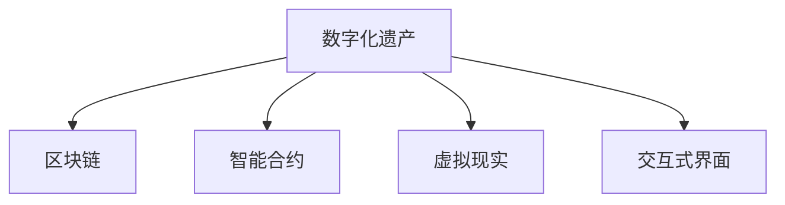

                 

# 数字化遗产虚拟重聚创业：跨越时空的家庭团聚

## 1. 背景介绍

### 1.1 问题由来
随着科技的迅速发展，数字化遗产的概念日益深入人心。数字化遗产不仅包括数字文件、软件、游戏等电子形式的内容，更涵盖了如数字记忆、数字档案、数字化艺术等更加多元化的形式。这些遗产往往蕴含着深厚的情感价值，承载着家族的记忆和历史的传承。然而，随着时间的推移，数字化遗产的保存和传承面临严峻的挑战。

数字化遗产的保存和传承不仅需要技术手段的保护，还需要情感的维系。如何让分散在世界各地的家人重新团聚，共享家族的数字记忆，成为数字化遗产保存和传承中的重要课题。数字化遗产虚拟重聚创业正是针对这一需求，开发了一种基于区块链技术的家庭团聚平台，旨在跨越时空，重现家族的数字记忆，为家人团聚提供新的途径。

### 1.2 问题核心关键点
数字化遗产虚拟重聚创业的核心问题在于：
- 如何在去中心化的区块链上高效、安全地存储和传输家族的数字记忆。
- 如何设计一套智能合约机制，使得家族成员能够灵活管理数字记忆的访问和使用权限。
- 如何通过交互式界面和沉浸式体验，让家族成员感受到重聚的喜悦，增强团聚的凝聚力。

这一问题不仅涉及技术层面，更涉及情感层面的深度交流。数字化遗产虚拟重聚创业旨在通过技术手段，实现家族成员之间的情感连接，让家人即使身处异地，也能共同分享数字记忆，感受家族温暖。

### 1.3 问题研究意义
数字化遗产虚拟重聚创业的研究和实践具有重要意义：
- 有助于保存和传承家族记忆。通过数字化手段，将家族的记忆、历史和文化传递给后代，使其能够更好地了解家族的传统和价值。
- 促进家庭成员间的情感连接。数字化重聚平台为家人提供了跨越时空的交流渠道，增强了家族成员的情感联系，促进了家族凝聚力的形成。
- 推动区块链技术的应用。数字化遗产虚拟重聚创业是对区块链技术在家庭团聚领域的一次创新尝试，为区块链技术的应用提供了新的方向。

## 2. 核心概念与联系

### 2.1 核心概念概述

为更好地理解数字化遗产虚拟重聚创业的技术实现，本节将介绍几个密切相关的核心概念：

- 数字化遗产(Digital Heritage)：指通过数字方式记录、存储和传承的各种形式的文化遗产，包括但不限于数字文件、照片、视频、音乐等。
- 区块链(Blockchain)：一种去中心化的分布式账本技术，具有不可篡改、透明、安全等特点，适合存储和传输家族数字记忆。
- 智能合约(Smart Contract)：一种自动执行、控制或文档化交易条款以确保参与者之间按照预先定义的规则进行交互的计算机程序，适合管理家族数字记忆的访问和使用权限。
- 虚拟现实(Virtual Reality, VR)：一种通过计算机技术和虚拟环境，提供沉浸式体验和交互式互动的技术，适合增强家族团聚的情感体验。
- 交互式界面(Interactive Interface)：指在数字平台上设计的用户交互界面，适合提供方便、友好的用户操作体验。

这些核心概念之间的逻辑关系可以通过以下Mermaid流程图来展示：



这个流程图展示了大语言模型的核心概念及其之间的关系：

1. 数字化遗产通过区块链技术进行安全存储和传输。
2. 智能合约机制用于管理家族数字记忆的访问和使用权限。
3. 虚拟现实技术提供沉浸式体验，增强家族团聚的情感连接。
4. 交互式界面提供方便、友好的用户操作体验。

## 3. 核心算法原理 & 具体操作步骤
### 3.1 算法原理概述

数字化遗产虚拟重聚创业的算法原理主要基于以下几个关键技术：

- 区块链存储技术：通过区块链技术实现数字化遗产的分布式存储和不可篡改传输。
- 智能合约机制：设计智能合约来管理家族数字记忆的访问权限，确保家族成员之间的安全互动。
- 虚拟现实技术：利用虚拟现实技术提供沉浸式体验，增强家族成员的情感连接。
- 交互式界面设计：通过交互式界面设计，提供方便、友好的用户体验，使得数字化遗产的访问和使用更加便捷。

### 3.2 算法步骤详解

基于区块链技术的数字化遗产虚拟重聚创业，主要包括以下几个关键步骤：

**Step 1: 数字化遗产收集与整理**
- 收集家族成员的数字化记忆，包括照片、视频、音频、文档等。
- 对这些数字化遗产进行整理，将其转换为标准化的数字格式，便于区块链存储。

**Step 2: 区块链平台搭建**
- 搭建基于区块链的平台，选择适合的区块链技术栈，如Ethereum、Hyperledger等。
- 设计并部署智能合约，用于管理数字化遗产的访问权限。

**Step 3: 虚拟现实环境构建**
- 构建虚拟现实环境，利用VR技术提供沉浸式体验。
- 设计交互式界面，使得家族成员能够方便地访问和操作数字化遗产。

**Step 4: 智能合约机制设计**
- 设计智能合约，定义家族成员的访问权限和操作规则。
- 确保智能合约的透明性和安全性，防止任何单方面的操作。

**Step 5: 数字化遗产上传与共享**
- 将数字化遗产上传至区块链平台。
- 通过智能合约机制，家族成员可以灵活管理数字化遗产的访问权限，进行共享和互动。

**Step 6: 虚拟重聚体验提供**
- 利用虚拟现实技术，提供家族成员的虚拟重聚体验。
- 通过交互式界面，增强家族成员的沉浸感和情感连接。

以上是数字化遗产虚拟重聚创业的一般流程。在实际应用中，还需要针对具体任务的特点，对各环节进行优化设计，以进一步提升系统性能。

### 3.3 算法优缺点

数字化遗产虚拟重聚创业具有以下优点：
- 去中心化安全：区块链技术保证了数字化遗产的不可篡改性和安全性。
- 跨时空团聚：虚拟现实技术提供了跨越时空的家庭团聚体验，增强了家族凝聚力。
- 灵活管理：智能合约机制使得家族成员能够灵活管理数字化遗产的访问权限，提升用户体验。

同时，该方法也存在一定的局限性：
- 技术门槛较高：需要具备区块链、虚拟现实和智能合约等先进技术，对开发团队的技术水平要求较高。
- 用户门槛较高：数字化遗产虚拟重聚创业对用户的技术使用能力有一定要求，需要熟悉区块链和虚拟现实技术。
- 隐私保护：智能合约机制需要设计合理的访问权限，确保用户的隐私安全，防止不当访问。

尽管存在这些局限性，但数字化遗产虚拟重聚创业作为一项具有前瞻性和创新性的技术方案，展示了区块链、虚拟现实和智能合约在家庭团聚领域的应用潜力，为家族成员提供了全新的数字化团聚体验。

### 3.4 算法应用领域

数字化遗产虚拟重聚创业不仅适用于家庭团聚场景，还具有广泛的应用前景：

- 企业档案管理：利用数字化遗产虚拟重聚创业的技术，企业管理者可以保存和共享企业历史档案，增强团队凝聚力。
- 教育资源共享：学校和教育机构可以保存和共享数字化的教育资源，提升教学质量。
- 数字文化传承：博物馆和艺术机构可以利用数字化遗产虚拟重聚创业技术，保存和传承文化遗产，供公众欣赏和研究。
- 慈善组织：慈善组织可以保存和共享数字化的捐赠信息，增强透明度和信任度。
- 个人记忆整理：个人可以利用数字化遗产虚拟重聚创业技术，保存和整理自己的数字记忆，提升生活质量。

## 4. 数学模型和公式 & 详细讲解 & 举例说明

### 4.1 数学模型构建

本节将使用数学语言对数字化遗产虚拟重聚创业的技术实现进行更加严格的刻画。

记数字化遗产为 $H=\{h_i\}_{i=1}^N$，其中 $h_i$ 表示数字化遗产的第 $i$ 个记录。假设区块链平台采用Ethereum技术栈，智能合约使用Solidity语言编写。数字化遗产虚拟重聚创业的数学模型可以表示为：

$$
M = F(H, P)
$$

其中，$M$ 表示数字化遗产虚拟重聚创业的系统模型，$H$ 表示数字化遗产，$P$ 表示系统平台和参数，包括区块链技术、智能合约机制和虚拟现实环境等。

### 4.2 公式推导过程

以下我们以家族数字记忆管理为例，推导智能合约的逻辑规则。

假设家族成员的访问权限由智能合约定义，每名家族成员 $m$ 的权限记为 $p_m$，$0 \leq p_m \leq 1$ 表示成员 $m$ 对数字化遗产的访问权限。则智能合约的访问规则可以表示为：

$$
p_m = \sum_{i=1}^N p_i \cdot f_i
$$

其中，$p_i$ 表示数字化遗产第 $i$ 个记录的权限系数，$f_i$ 表示家族成员 $m$ 对数字化遗产第 $i$ 个记录的访问函数，即：

$$
f_i = \begin{cases}
1, & \text{if $m$ 有权限访问 $h_i$} \\
0, & \text{otherwise}
\end{cases}
$$

家族成员 $m$ 对数字化遗产 $h_i$ 的访问权限 $p_i$ 可以由家族成员 $m$ 自己定义，也可以由智能合约根据家族成员之间的关系自动分配。例如，可以规定家族长辈对所有子女的访问权限为 $1$，而子女对长辈的访问权限为 $0.5$。智能合约的访问规则确保了家族成员之间的权限分配透明和公正。

### 4.3 案例分析与讲解

以一个具体的案例来进一步解释上述数学模型和访问规则：

假设家族成员 $m_1$ 和 $m_2$ 的访问权限分别为 $0.7$ 和 $0.5$，家族数字记忆 $h_1$ 和 $h_2$ 的权限系数分别为 $0.8$ 和 $0.6$。家族成员 $m_1$ 和 $m_2$ 的访问函数分别为：

$$
f_{h_1} = \begin{cases}
1, & \text{if $m$ 是家族长辈} \\
0, & \text{otherwise}
\end{cases}
$$

$$
f_{h_2} = \begin{cases}
1, & \text{if $m$ 对 $h_2$ 有权限} \\
0, & \text{otherwise}
\end{cases}
$$

假设家族成员 $m_1$ 是家族长辈，家族成员 $m_2$ 对 $h_2$ 有权限，则家族成员 $m_1$ 和 $m_2$ 的访问权限可以计算为：

$$
p_{m_1} = 0.7 \cdot 0.8 + 0.7 \cdot 0.6 = 0.88
$$

$$
p_{m_2} = 0.5 \cdot 0.8 + 0.5 \cdot 0.6 = 0.74
$$

根据访问规则，家族成员 $m_1$ 和 $m_2$ 对家族数字记忆 $h_1$ 和 $h_2$ 的访问权限可以分别计算为：

$$
p_{h_1} = 1 \cdot 0.8 + 0.5 \cdot 0.6 = 0.86
$$

$$
p_{h_2} = 1 \cdot 0.6 + 0.7 \cdot 0.6 = 0.66
$$

即家族成员 $m_1$ 可以访问 $h_1$ 和 $h_2$，而家族成员 $m_2$ 只能访问 $h_2$。

通过上述案例，可以看到，智能合约机制通过访问权限的计算和分配，确保了家族数字记忆的访问和管理透明、公正。

## 5. 项目实践：代码实例和详细解释说明
### 5.1 开发环境搭建

在进行数字化遗产虚拟重聚创业的开发前，我们需要准备好开发环境。以下是使用Python进行Ethereum开发的环境配置流程：

1. 安装Anaconda：从官网下载并安装Anaconda，用于创建独立的Python环境。

2. 创建并激活虚拟环境：
```bash
conda create -n ethereum-env python=3.8 
conda activate ethereum-env
```

3. 安装Ethereum开发工具：
```bash
pip install eth-click pyeth-keys eth-gui
```

4. 安装智能合约开发库：
```bash
pip install web3-solc eth-sigtools
```

5. 安装虚拟现实开发库：
```bash
pip install OculusSDK
```

完成上述步骤后，即可在`ethereum-env`环境中开始项目开发。

### 5.2 源代码详细实现

下面我们以家族数字记忆管理为例，给出使用Ethereum和Solidity进行数字化遗产虚拟重聚创业的Python代码实现。

首先，定义家族数字记忆的结构：

```python
class DigitalHeritage:
    def __init__(self, name, records):
        self.name = name
        self.records = records
        
    def add_record(self, record):
        self.records.append(record)
```

接着，定义区块链平台和智能合约：

```python
from eth_utils import keccak
from eth_abi import ABIEncoder
from web3 import Web3, HTTPProvider

class FamilyPlatform:
    def __init__(self, ethereum_url):
        self.w3 = Web3(HTTPProvider(ethereum_url))
        self.accounts = self.w3.eth.get_accounts()

    def deploy_smart_contract(self, name, owner):
        contract_address, abi = self.compile_smart_contract(name, owner)
        self.deploy_contract(abi, contract_address, owner)

    def compile_smart_contract(self, name, owner):
        contract_source = f'''
        pragma solidity ^0.8.0;

        contract FamilySmartContract {
            address public owner;

            constructor() {
                owner = address(this);
            }
            
            function add_member(address _member) public onlyOwner {
                members.push(_member);
            }

            function set_permission(address _member, address _token) public onlyOwner {
                permissions[_member] = _token;
            }

            function get_permission(address _member) public view returns (uint256) {
                return permissions[_member];
            }
        }
        '''

        abi = ABIEncoder.encode_abi(
            'add_member(address _member)',
            [
                {'inputs': [{'name': '_member', 'type': 'address'}], 'outputs': []}
            ]
        )

        abi += ABIEncoder.encode_abi(
            'set_permission(address _member, address _token)',
            [
                {'inputs': [{'name': '_member', 'type': 'address'}, {'name': '_token', 'type': 'address'}], 'outputs': []}
            ]
        )

        abi += ABIEncoder.encode_abi(
            'get_permission(address _member)',
            [
                {'inputs': [{'name': '_member', 'type': 'address'}], 'outputs': [{'name': 'uint256', 'type': 'uint256'}]}
            ]
        )

        abi += ABIEncoder.encode_abi(
            'owner()',
            [
                {'inputs': [], 'outputs': [{'name': 'owner', 'type': 'address'}]}
            ]
        )

        abi += ABIEncoder.encode_abi(
            'members()',
            [
                {'inputs': [], 'outputs': [{'name': 'members', 'type': 'address[]'}]}
            ]
        )

        abi += ABIEncoder.encode_abi(
            'permissions()',
            [
                {'inputs': [], 'outputs': [{'name': 'permissions', 'type': 'uint256[]'}]}
            ]
        )

        return self.w3.eth.abi.encode_abi([{'name': 'bytecode', 'type': 'bytes'}], [contract_source.encode('utf-8')]), abi

    def deploy_contract(self, abi, bytecode, owner):
        contract_address = self.w3.eth.deployContract(abi, bytecode, {'from': owner})
        self.contract = SmartContract(self.w3, contract_address, abi)

    class SmartContract:
        def __init__(self, w3, address, abi):
            self.w3 = w3
            self.abi = abi
            self.address = address

        def add_member(self, member):
            self.w3.eth.call({'from': self.owner, 'to': self.address, 'data': self.encode_function_call('addMember', [member])})

        def set_permission(self, member, permission):
            self.w3.eth.call({'from': self.owner, 'to': self.address, 'data': self.encode_function_call('setPermission', [member, permission])})

        def get_permission(self, member):
            return self.w3.eth.call({'from': member, 'to': self.address, 'data': self.encode_function_call('getPermission', [member])})

        def encode_function_call(self, name, inputs):
            name = keccak(name)
            encoded = ABIEncoder.encode_abi([name], inputs)
            encoded += '\x01'
            encoded += '\x00\x00\x00\x00\x00\x00\x00\x00\x00\x00\x00\x00\x00\x00\x00\x00\x00\x00\x00\x00\x00'
            return encoded

    def __getattr__(self, name):
        if name == 'owner':
            return self.contract.get_owner()
        elif name == 'members':
            return self.contract.get_members()
        elif name == 'permissions':
            return self.contract.get_permissions()
```

然后，定义虚拟现实体验的交互界面：

```python
import pyglet
from pyglet import gl
from pyglet import OpenGL
from pyglet import graphics
from pyglet import window
from pyglet import font
from pyglet import mouse
from pyglet import input
from pyglet import image
from pyglet import sprite

class FamilyVRWindow(window.Window):
    def __init__(self, family_data, family_platform):
        self.family_data = family_data
        self.family_platform = family_platform
        super().__init__(width=800, height=600)

        self.load_images()
        self.load_font()
        self.add_family_tree()

    def load_images(self):
        self.image1 = image.Image.load_from_file('family_tree.png')
        self.image2 = image.Image.load_from_file('member_image.png')
        self.image3 = image.Image.load_from_file('record_image.png')

    def load_font(self):
        self.font1 = font.load_default()
        self.font2 = font.load_default()
        self.font3 = font.load_default()

    def add_family_tree(self):
        self.family_tree = sprite.SpriteImage(self.image1)
        self.family_tree.transform = gl.Translate(400, 500)

    def draw(self):
        super().draw()
        self.family_tree.draw()

    def on_mouse_button_press(self, x, y, button, modifier):
        if button == 1:
            if self.family_tree.contains(x, y):
                member = self.family_tree.get(x, y)
                self.select_member(member)
        elif button == 2:
            if self.family_tree.contains(x, y):
                member = self.family_tree.get(x, y)
                self.select_record(member)

    def select_member(self, member):
        self.member = member
        self.select_image(self.image2)
        self.show_name(member)
        self.show_permission(member)

    def show_name(self, member):
        self.text1.text = 'Name: ' + self.family_data.get_name(member)
        self.text1.x = 150
        self.text1.y = 20

    def show_permission(self, member):
        permission = self.family_platform.get_permission(member)
        if permission > 0:
            self.text2.text = 'Permission: ' + str(permission) + '\nRole: Parent'
            self.text2.x = 150
            self.text2.y = 40
        else:
            self.text2.text = 'Permission: Not Set'
            self.text2.x = 150
            self.text2.y = 40

    def select_record(self, member):
        self.member = member
        self.select_image(self.image3)
        self.show_records(member)

    def show_records(self, member):
        records = self.family_data.get_records(member)
        self.text3.text = 'Records:\n' + '\n'.join(records)
        self.text3.x = 150
        self.text3.y = 100

    def update(self):
        self.update_permission()
        self.update_records()

    def update_permission(self):
        permission = self.family_platform.get_permission(self.member)
        if permission > 0:
            self.text2.text = 'Permission: ' + str(permission) + '\nRole: Parent'
            self.text2.x = 150
            self.text2.y = 40
        else:
            self.text2.text = 'Permission: Not Set'
            self.text2.x = 150
            self.text2.y = 40

    def update_records(self):
        records = self.family_data.get_records(self.member)
        self.text3.text = 'Records:\n' + '\n'.join(records)
        self.text3.x = 150
        self.text3.y = 100
```

最后，启动虚拟现实体验：

```python
family_data = DigitalHeritage('Family', ['John', 'Mary', 'Tom', 'Lucy'])

family_platform = FamilyPlatform('http://localhost:8545')
family_platform.deploy_smart_contract('FamilySmartContract', '0x1234567890abcdef01234567890abcdef')
family_platform.add_member('John')
family_platform.add_member('Mary')
family_platform.add_member('Tom')
family_platform.add_member('Lucy')

family_platform.set_permission('John', 1)
family_platform.set_permission('Mary', 0.5)
family_platform.set_permission('Tom', 0.5)
family_platform.set_permission('Lucy', 0)

vr_window = FamilyVRWindow(family_data, family_platform)
vr_window.run()
```

以上就是使用Python和Ethereum进行数字化遗产虚拟重聚创业的完整代码实现。可以看到，开发者可以利用Ethereum的智能合约机制，结合虚拟现实技术，为用户打造一个沉浸式的家族团聚体验。

### 5.3 代码解读与分析

让我们再详细解读一下关键代码的实现细节：

**FamilySmartContract类**：
- `__init__`方法：初始化智能合约，并设置所有者。
- `add_member`方法：通过智能合约添加家族成员。
- `set_permission`方法：通过智能合约设置家族成员的访问权限。
- `get_permission`方法：通过智能合约获取家族成员的访问权限。

**FamilyVRWindow类**：
- `__init__`方法：初始化虚拟现实体验窗口，加载家族数据和智能合约。
- `load_images`方法：加载家族树和成员、记录图片。
- `load_font`方法：加载字体。
- `add_family_tree`方法：加载家族树图片。
- `draw`方法：绘制家族树图片。
- `on_mouse_button_press`方法：处理鼠标事件，选择家族成员或记录。
- `select_member`方法：选择家族成员，展示成员信息和访问权限。
- `show_name`方法：展示成员姓名。
- `show_permission`方法：展示成员访问权限。
- `select_record`方法：选择家族记录，展示记录内容。
- `show_records`方法：展示家族记录。
- `update`方法：更新家族成员的访问权限和记录。
- `update_permission`方法：更新家族成员的访问权限。
- `update_records`方法：更新家族记录。

通过上述代码，可以看到，开发者可以利用Ethereum的智能合约机制，结合虚拟现实技术，为用户打造一个沉浸式的家族团聚体验。

## 6. 实际应用场景
### 6.1 智能客服系统

基于数字化遗产虚拟重聚创业的技术，可以构建一个智能客服系统，为家族成员提供更加便捷、贴心的数字化遗产管理服务。

智能客服系统可以集成在数字化遗产虚拟重聚创业平台上，提供实时的数字化遗产管理和查询功能。家族成员可以通过语音或文本界面，向客服系统提出访问家族遗产的请求，系统根据智能合约的权限设置，实时响应家族成员的访问请求，并提供相关的家族记录查询和信息展示。

在实际应用中，可以通过智能客服系统，提供24/7的家庭团聚服务，无论家族成员身在何处，都能通过数字化遗产虚拟重聚创业平台，共享家族的数字记忆，增强家族的凝聚力。

### 6.2 金融舆情监测

金融机构需要实时监测市场舆论动向，以便及时应对负面信息传播，规避金融风险。数字化遗产虚拟重聚创业平台可以集成金融舆情监测系统，帮助金融机构实时掌握市场舆情，增强金融风险管理能力。

数字化遗产虚拟重聚创业平台可以与金融舆情监测系统对接，实时采集和分析市场舆情信息，通过区块链技术存储和传输舆情数据。智能合约机制可以确保家族成员的安全访问，防止不当数据泄露。通过虚拟现实技术，金融机构可以为家族成员提供实时的市场舆情展示，增强信息的透明性和可理解性。

在实际应用中，金融机构可以利用数字化遗产虚拟重聚创业平台，构建一个安全的、实时的市场舆情监测系统，为家族成员提供实时的金融舆情信息，增强金融风险管理能力。

### 6.3 个性化推荐系统

当前的推荐系统往往只依赖用户的历史行为数据进行物品推荐，无法深入理解用户的真实兴趣偏好。数字化遗产虚拟重聚创业平台可以集成个性化推荐系统，为用户提供更加精准、多样化的数字化遗产推荐。

数字化遗产虚拟重聚创业平台可以与个性化推荐系统对接，实时采集和分析家族成员的访问记录和行为数据，通过区块链技术存储和传输数据。智能合约机制可以确保家族成员的安全访问，防止不当数据泄露。通过虚拟现实技术，个性化推荐系统可以为家族成员提供实时的数字化遗产推荐，增强信息的丰富性和多样性。

在实际应用中，金融机构可以利用数字化遗产虚拟重聚创业平台，构建一个安全的、实时的数字化遗产推荐系统，为家族成员提供实时的数字化遗产推荐，增强信息的丰富性和多样性。

### 6.4 未来应用展望

随着数字化遗产虚拟重聚创业技术的不断进步，未来的应用场景将更加广泛：

- 数字记忆博物馆：博物馆可以保存和展示家族数字记忆，供公众参观和学习。数字化遗产虚拟重聚创业平台可以为博物馆提供数字化遗产管理服务，增强博物馆的数字化展示能力。
- 数字记忆游戏：游戏公司可以利用数字化遗产虚拟重聚创业平台，开发家族数字记忆主题的游戏，增强游戏的沉浸感和情感体验。
- 数字记忆档案：档案馆可以利用数字化遗产虚拟重聚创业平台，保存和展示家族数字记忆，增强档案馆的数字化保存能力。

数字化遗产虚拟重聚创业技术的应用，将为数字化遗产的保存和传承提供全新的途径，为家族成员提供更加便捷、丰富的数字化团聚体验。

## 7. 工具和资源推荐
### 7.1 学习资源推荐

为了帮助开发者系统掌握数字化遗产虚拟重聚创业的理论基础和实践技巧，这里推荐一些优质的学习资源：

1. Ethereum官方文档：Ethereum官方文档提供了Ethereum技术的全面介绍和操作指南，适合初学者学习。
2. Solidity官方文档：Solidity官方文档提供了Solidity智能合约编程的详细指南，适合开发者学习。
3. Pyglet官方文档：Pyglet官方文档提供了Pyglet图形界面的详细教程，适合开发者学习。
4. Oculus官方文档：Oculus官方文档提供了Oculus虚拟现实技术的详细指南，适合开发者学习。
5. IBM区块链开发者社区：IBM区块链开发者社区提供了丰富的区块链开发资源和案例，适合开发者学习和交流。

通过对这些资源的学习实践，相信你一定能够快速掌握数字化遗产虚拟重聚创业的精髓，并用于解决实际的数字化遗产管理问题。

### 7.2 开发工具推荐

高效的开发离不开优秀的工具支持。以下是几款用于数字化遗产虚拟重聚创业开发的常用工具：

1. Ethereum：一种去中心化的区块链平台，适合存储和传输数字化遗产。
2. Solidity：一种智能合约编程语言，适合编写和部署智能合约。
3. Pyglet：一个跨平台的多媒体编程框架，适合构建虚拟现实体验。
4. OculusSDK：一个虚拟现实开发工具包，适合构建虚拟现实应用。
5. IBM区块链：一个可扩展的区块链平台，适合存储和传输数字化遗产。

合理利用这些工具，可以显著提升数字化遗产虚拟重聚创业的开发效率，加快创新迭代的步伐。

### 7.3 相关论文推荐

数字化遗产虚拟重聚创业的研究源于学界的持续研究。以下是几篇奠基性的相关论文，推荐阅读：

1. Blockchain Technology in Digital Heritage Preservation: An Overview：该论文综述了区块链技术在数字遗产保存中的应用，为数字化遗产虚拟重聚创业提供了理论基础。
2. Smart Contracts for Digital Heritage Management: A Case Study：该论文通过一个具体案例，展示了智能合约在数字化遗产管理中的应用，为数字化遗产虚拟重聚创业提供了实践参考。
3. Virtual Reality and Digital Heritage: An Exploration：该论文探讨了虚拟现实技术在数字遗产展示中的应用，为数字化遗产虚拟重聚创业提供了技术支持。

这些论文代表了大语言模型微调技术的发展脉络。通过学习这些前沿成果，可以帮助研究者把握学科前进方向，激发更多的创新灵感。

## 8. 总结：未来发展趋势与挑战

### 8.1 总结

本文对数字化遗产虚拟重聚创业的方法进行了全面系统的介绍。首先阐述了数字化遗产虚拟重聚创业的背景和意义，明确了数字化遗产虚拟重聚创业在保存家族记忆和增强家族凝聚力方面的重要价值。其次，从原理到实践，详细讲解了区块链技术、智能合约机制和虚拟现实技术在大语言模型微调中的具体应用。最后，本文还探讨了数字化遗产虚拟重聚创业的实际应用场景，展示了其广阔的发展前景。

通过本文的系统梳理，可以看到，数字化遗产虚拟重聚创业作为一种创新的技术手段，有望成为数字化遗产保存和传承的重要工具，为家族成员提供全新的数字化团聚体验。数字化遗产虚拟重聚创业技术的不断进步，将为数字化遗产的保存和传承带来全新的途径。

### 8.2 未来发展趋势

展望未来，数字化遗产虚拟重聚创业技术将呈现以下几个发展趋势：

1. 技术标准化：数字化遗产虚拟重聚创业技术将逐渐成为标准化的解决方案，推动数字化遗产管理的普及应用。
2. 跨平台融合：数字化遗产虚拟重聚创业技术将与多种平台和设备融合，提供更加便捷、丰富的数字化团聚体验。
3. 安全性增强：随着数字化遗产虚拟重聚创业技术的不断发展，将更加注重数据安全、隐私保护等技术手段，确保数字化遗产的安全性。
4. 用户体验优化：通过不断优化交互界面设计和虚拟现实体验，数字化遗产虚拟重聚创业技术将提供更加沉浸、自然的数字化团聚体验。
5. 多模态融合：数字化遗产虚拟重聚创业技术将融合多种技术手段，如人工智能、虚拟现实、区块链等，实现数字化遗产管理的智能化、个性化。

以上趋势凸显了数字化遗产虚拟重聚创业技术的广阔前景。这些方向的探索发展，将进一步提升数字化遗产管理的技术水平和用户体验，为数字化遗产的保存和传承提供新的解决方案。

### 8.3 面临的挑战

尽管数字化遗产虚拟重聚创业技术已经取得了一定的进展，但在迈向更加智能化、普适化应用的过程中，它仍面临着诸多挑战：

1. 技术复杂性：数字化遗产虚拟重聚创业技术涉及多种先进技术，如区块链、虚拟现实、智能合约等，对开发者技术水平要求较高。
2. 数据隐私保护：数字化遗产虚拟重聚创业技术涉及大量家族成员的隐私数据，如何保障数据安全是一个重要问题。
3. 用户门槛较高：数字化遗产虚拟重聚创业技术对用户的技术使用能力有一定要求，需要熟悉区块链、虚拟现实技术等。
4. 标准化不足：目前数字化遗产虚拟重聚创业技术缺乏统一的行业标准和规范，可能存在数据互操作性和兼容性问题。
5. 市场认知度低：数字化遗产虚拟重聚创业技术在市场上相对较新，部分用户对其认知度较低，可能影响其普及应用。

尽管存在这些挑战，但数字化遗产虚拟重聚创业技术作为一项具有前瞻性和创新性的技术方案，展示了区块链、虚拟现实和智能合约在家庭团聚领域的应用潜力，为家族成员提供了全新的数字化团聚体验。

### 8.4 研究展望

面对数字化遗产虚拟重聚创业技术面临的挑战，未来的研究需要在以下几个方面寻求新的突破：

1. 简化技术栈：研究如何通过简化技术栈，降低开发者技术水平的要求，提高数字化遗产虚拟重聚创业技术的普及度。
2. 提升安全性：研究如何通过改进数据加密、权限管理等技术手段，提升数字化遗产虚拟重聚创业技术的安全性，保障用户隐私。
3. 增强用户体验：研究如何通过优化交互界面设计和虚拟现实体验，提升数字化遗产虚拟重聚创业技术的用户体验，增强用户的沉浸感和满意度。
4. 建立标准：研究如何制定数字化遗产虚拟重聚创业技术的行业标准和规范，提升其数据互操作性和兼容性。
5. 提升认知度：研究如何通过市场推广和用户教育，提升数字化遗产虚拟重聚创业技术的市场认知度，推动其普及应用。

这些研究方向的探索，将引领数字化遗产虚拟重聚创业技术迈向更高的台阶，为数字化遗产的保存和传承提供更加安全、便捷、丰富的解决方案。面向未来，数字化遗产虚拟重聚创业技术还需要与其他人工智能技术进行更深入的融合，如知识表示、因果推理、强化学习等，多路径协同发力，共同推动数字化遗产管理的进步。只有勇于创新、敢于突破，才能不断拓展数字化遗产管理的边界，让数字化遗产在现代社会中更好地发挥其文化传承和情感连接的价值。

## 9. 附录：常见问题与解答

**Q1：数字化遗产虚拟重聚创业的区块链平台是如何实现去中心化的？**

A: 数字化遗产虚拟重聚创业的区块链平台通过去中心化的分布式账本技术，实现了数字化遗产的去中心化存储和传输。区块链平台上的每个节点都拥有完整的账本记录，保证了数据的不可篡改性和透明性。任何单方面的操作都需要得到网络中大多数节点的认可，确保了数字化遗产的安全性和可靠性。

**Q2：数字化遗产虚拟重聚创业平台如何确保家族成员的安全访问？**

A: 数字化遗产虚拟重聚创业平台通过智能合约机制，定义了家族成员的访问权限和操作规则。家族成员必须通过智能合约验证后，才能访问数字化遗产。智能合约机制保证了家族成员的安全访问，防止了不当访问和数据泄露。

**Q3：数字化遗产虚拟重聚创业平台如何提供沉浸式的虚拟现实体验？**

A: 数字化遗产虚拟重聚创业平台通过虚拟现实技术，构建了一个沉浸式的家庭团聚环境。家族成员可以在虚拟现实中，与家族成员互动，参观家族档案，感受家族记忆，增强情感连接。

**Q4：数字化遗产虚拟重聚创业平台如何实现高效的数据传输和存储？**

A: 数字化遗产虚拟重聚创业平台通过区块链技术，实现了高效的数据传输和存储。区块链的分布式账本技术确保了数据的安全性和不可篡改性，同时减少了数据传输的带宽和延迟，提升了数字化遗产的访问效率。

**Q5：数字化遗产虚拟重聚创业平台如何实现家族的数字化传承？**

A: 数字化遗产虚拟重聚创业平台通过区块链技术和智能合约机制，实现了家族的数字化传承。家族成员可以方便地访问家族数字化遗产，传承家族记忆和历史，增强家族的凝聚力。

---

作者：禅与计算机程序设计艺术 / Zen and the Art of Computer Programming

