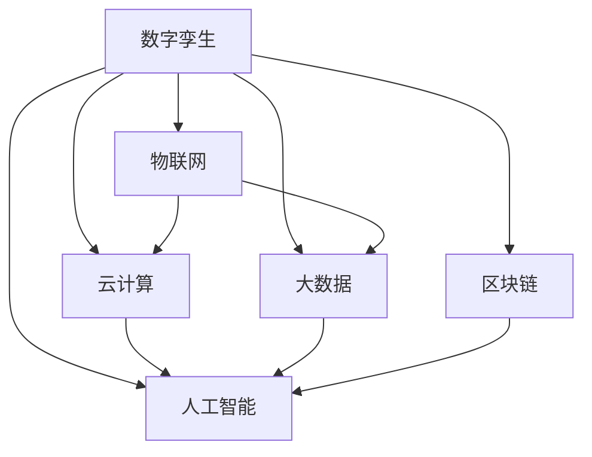

                 

# 数字孪生技术在智慧城市中的应用

## 1. 背景介绍

### 1.1 问题由来

随着城市化进程的不断推进，智慧城市建设成为全球各国共同关注的热点话题。智慧城市通过整合城市基础设施、公共服务和社会资源，利用先进的信息技术，提升城市的运行效率、居民生活质量和环境友好度。然而，智慧城市的构建和运营需要巨额资金和复杂的技术支持，单一的技术手段难以全面满足需求。数字孪生技术作为一种新兴的、全面系统的智慧城市构建方法，为智慧城市建设提供了全新的思路。

### 1.2 问题核心关键点

数字孪生技术（Digital Twin）是一种将物理实体及其运行状态在虚拟空间中进行镜像复制的技术，其核心在于构建一个高度逼真的虚拟模型，用以模拟物理实体的工作状态，进而支持决策制定、优化控制、仿真实验等应用。数字孪生技术的应用领域包括工业、建筑、能源、交通等多个领域，本文聚焦于其在智慧城市建设中的应用。

数字孪生技术在智慧城市中的应用，主要体现在以下几个方面：

1. **数据共享**：通过数字孪生技术，智慧城市中各系统的数据能够被实时地收集、融合、分析，实现数据的高度共享，从而优化资源配置和城市管理。
2. **仿真模拟**：数字孪生模型能够模拟城市基础设施的运行状态，预测未来趋势，支持决策者进行风险评估和方案优化。
3. **智能控制**：通过数字孪生技术，智慧城市可以实现智能化的运行控制，提升城市的运行效率和安全性。
4. **互动体验**：数字孪生技术还可以提供互动式城市体验，为居民和游客提供直观的城市感知和互动体验。

### 1.3 问题研究意义

数字孪生技术在智慧城市中的应用，有助于构建一个高效、智能、绿色、安全的城市环境，提升城市管理水平和居民生活质量。通过数字孪生技术，智慧城市可以实现以下目标：

1. **高效管理**：通过实时数据收集和分析，优化资源配置，提升城市运行效率。
2. **智能决策**：基于仿真模拟，支持决策者进行风险评估和方案选择。
3. **绿色环保**：通过智能控制，降低能耗和污染，实现绿色城市。
4. **安全保障**：通过监测和预警，保障城市安全。

## 2. 核心概念与联系

### 2.1 核心概念概述

为更好地理解数字孪生技术在智慧城市中的应用，本节将介绍几个密切相关的核心概念：

- **数字孪生（Digital Twin）**：通过将物理实体及其运行状态在虚拟空间中进行镜像复制，数字孪生技术可以实现物理实体与虚拟模型之间的双向交互，支持决策制定、优化控制、仿真实验等应用。

- **物联网（IoT）**：通过传感器、通信设备和智能终端，实现物理实体的数字化采集和传输，为数字孪生技术提供数据支撑。

- **云计算（Cloud Computing）**：通过云计算平台，实现大规模数据的存储和处理，为数字孪生模型的运行提供计算资源。

- **大数据（Big Data）**：通过收集、分析海量数据，支持数字孪生模型的仿真和优化。

- **人工智能（AI）**：通过机器学习、深度学习等算法，实现数字孪生模型的智能推理和决策。

- **区块链（Blockchain）**：通过分布式账本技术，保障数据安全、透明和可追溯性，支持数字孪生技术在智慧城市中的应用。

这些核心概念之间的逻辑关系可以通过以下Mermaid流程图来展示：



这个流程图展示了大数字孪生技术在智慧城市应用中的核心概念及其之间的关系：

1. 数字孪生技术依托于物联网，实现物理实体的数字化采集。
2. 云计算平台提供计算资源，支持数字孪生模型的运行。
3. 大数据技术用于数据的收集、分析和挖掘，为数字孪生模型提供数据支撑。
4. 人工智能技术用于数字孪生模型的智能推理和决策。
5. 区块链技术用于保障数据的安全和透明。

这些概念共同构成了数字孪生技术在智慧城市中的应用框架，使其能够高效、智能地支持智慧城市的构建和管理。

## 3. 核心算法原理 & 具体操作步骤
### 3.1 算法原理概述

数字孪生技术在智慧城市中的应用，其核心原理是通过将城市的物理实体和运行状态在虚拟空间中进行镜像复制，构建一个高度逼真的数字孪生模型，用以支持决策制定、优化控制和仿真实验等应用。具体步骤如下：

1. **数据采集与处理**：通过物联网技术，实时采集城市基础设施和公共服务的数据，并进行清洗和预处理。
2. **数字孪生模型构建**：利用云计算和大数据技术，构建数字孪生模型，用于模拟城市基础设施的运行状态。
3. **仿真与优化**：基于数字孪生模型，进行仿真模拟，评估城市基础设施的运行状态，提出优化方案。
4. **智能控制与决策**：通过人工智能技术，对优化方案进行智能推理和决策，实现智能控制和优化。
5. **可视化与互动**：利用可视化技术，展示数字孪生模型的运行状态，提供互动式城市体验。

### 3.2 算法步骤详解

数字孪生技术在智慧城市中的应用，其具体步骤如下：

**Step 1: 数据采集与处理**

- **物联网设备部署**：在城市基础设施和公共服务的关键节点部署物联网设备，实时采集数据。
- **数据清洗与预处理**：对采集到的数据进行清洗、去重、转换等预处理，确保数据质量和完整性。
- **数据存储与管理**：利用云计算平台，对预处理后的数据进行存储和管理，确保数据的实时访问和查询。

**Step 2: 数字孪生模型构建**

- **模型设计**：根据城市基础设施和公共服务的特性，设计数字孪生模型。
- **模型训练**：利用大数据技术，对数字孪生模型进行训练，使其能够准确模拟城市基础设施的运行状态。
- **模型验证**：通过仿真实验，验证数字孪生模型的准确性和可靠性。

**Step 3: 仿真与优化**

- **仿真模拟**：基于数字孪生模型，进行仿真模拟，评估城市基础设施的运行状态。
- **风险评估**：通过仿真模拟，评估城市基础设施在特定情况下的风险和影响。
- **方案优化**：根据仿真模拟结果，提出优化方案，优化城市基础设施的运行状态。

**Step 4: 智能控制与决策**

- **决策支持**：利用人工智能技术，对优化方案进行智能推理和决策，生成最优控制方案。
- **智能控制**：根据决策支持结果，实现智能控制，优化城市基础设施的运行状态。

**Step 5: 可视化与互动**

- **模型可视化**：利用可视化技术，展示数字孪生模型的运行状态，支持决策者进行直观分析和决策。
- **互动式体验**：提供互动式城市体验，让居民和游客能够直观地了解城市运行状态，增强城市参与感和体验感。

### 3.3 算法优缺点

数字孪生技术在智慧城市中的应用，具有以下优点：

1. **全面性**：数字孪生技术能够全面反映城市基础设施和公共服务的运行状态，支持全面的智慧城市构建和管理。
2. **实时性**：通过实时数据采集和处理，数字孪生技术能够实现实时监控和优化，提升城市运行效率。
3. **智能化**：利用人工智能技术，数字孪生技术能够实现智能推理和决策，提升城市管理的智能化水平。
4. **安全性**：通过区块链技术，数字孪生技术能够保障数据的安全和透明，增强城市管理的可靠性。

同时，数字孪生技术也存在一定的局限性：

1. **数据质量**：数字孪生技术依赖于物联网设备的实时数据采集，数据质量直接影响模型的准确性和可靠性。
2. **模型复杂性**：构建高精度的数字孪生模型需要大量的数据和计算资源，模型构建复杂度较高。
3. **技术依赖**：数字孪生技术需要依赖物联网、云计算、大数据、人工智能等先进技术，技术门槛较高。

尽管存在这些局限性，但数字孪生技术在智慧城市中的应用前景广阔，具有重要的应用价值。

### 3.4 算法应用领域

数字孪生技术在智慧城市中的应用，涉及多个领域，主要包括：

1. **交通管理**：通过数字孪生技术，实时监测交通流量，优化交通信号灯和路线，提升交通运行效率。
2. **能源管理**：利用数字孪生技术，优化能源分配和调度，降低能源消耗，实现绿色城市。
3. **环境监测**：通过数字孪生技术，实时监测环境污染和资源消耗，支持环境友好型城市建设。
4. **公共服务**：利用数字孪生技术，优化公共服务资源配置，提升公共服务质量和效率。
5. **安全保障**：通过数字孪生技术，实时监测城市安全事件，支持应急响应和预警。

## 4. 数学模型和公式 & 详细讲解 & 举例说明

### 4.1 数学模型构建

数字孪生技术在智慧城市中的应用，可以通过数学模型来描述和优化。

假设智慧城市中的城市基础设施和公共服务系统为 $S$，其运行状态为 $x(t)$，其中 $t$ 表示时间。数字孪生模型为 $M$，其运行状态为 $\hat{x}(t)$。则数字孪生技术的应用模型可以表示为：

$$
\hat{x}(t) = f(S, \hat{x}(t-1), u(t))
$$

其中 $u(t)$ 表示控制输入，$f$ 表示动态方程。

### 4.2 公式推导过程

基于上述数学模型，数字孪生技术在智慧城市中的应用，可以通过以下步骤推导：

1. **数据采集与处理**：
   - 利用物联网设备，实时采集城市基础设施和公共服务的数据，表示为 $x(t)$。
   - 对采集到的数据进行清洗、去重、转换等预处理，确保数据质量和完整性。
   - 利用云计算平台，对预处理后的数据进行存储和管理，表示为 $x(t)$。

2. **数字孪生模型构建**：
   - 根据城市基础设施和公共服务的特性，设计数字孪生模型 $M$。
   - 利用大数据技术，对数字孪生模型进行训练，使其能够准确模拟城市基础设施的运行状态。
   - 通过仿真实验，验证数字孪生模型的准确性和可靠性。

3. **仿真与优化**：
   - 基于数字孪生模型 $M$，进行仿真模拟，评估城市基础设施的运行状态。
   - 通过仿真模拟，评估城市基础设施在特定情况下的风险和影响。
   - 根据仿真模拟结果，提出优化方案，优化城市基础设施的运行状态。

4. **智能控制与决策**：
   - 利用人工智能技术，对优化方案进行智能推理和决策，生成最优控制方案。
   - 根据决策支持结果，实现智能控制，优化城市基础设施的运行状态。

5. **可视化与互动**：
   - 利用可视化技术，展示数字孪生模型的运行状态，支持决策者进行直观分析和决策。
   - 提供互动式城市体验，让居民和游客能够直观地了解城市运行状态，增强城市参与感和体验感。

### 4.3 案例分析与讲解

以下以交通管理为例，展示数字孪生技术在智慧城市中的应用：

假设一个城市的交通系统由 $N$ 个交叉口和 $M$ 条路线组成，实时采集交通流量数据 $x(t)$。利用数字孪生技术，构建数字孪生模型 $M$，模拟交通系统的运行状态 $\hat{x}(t)$。通过仿真模拟，评估交通系统在特定情况下的运行状态和风险。利用人工智能技术，对优化方案进行智能推理和决策，生成最优控制方案，实现智能控制，优化交通系统的运行状态。最后，利用可视化技术，展示交通系统的运行状态，提供互动式城市体验，增强交通系统的透明度和参与感。

## 5. 项目实践：代码实例和详细解释说明

### 5.1 开发环境搭建

在进行数字孪生技术在智慧城市中的应用实践前，我们需要准备好开发环境。以下是使用Python进行PyTorch开发的环境配置流程：

1. 安装Anaconda：从官网下载并安装Anaconda，用于创建独立的Python环境。

2. 创建并激活虚拟环境：
```bash
conda create -n pytorch-env python=3.8 
conda activate pytorch-env
```

3. 安装PyTorch：根据CUDA版本，从官网获取对应的安装命令。例如：
```bash
conda install pytorch torchvision torchaudio cudatoolkit=11.1 -c pytorch -c conda-forge
```

4. 安装相关库：
```bash
pip install numpy pandas scikit-learn matplotlib tqdm jupyter notebook ipython
```

完成上述步骤后，即可在`pytorch-env`环境中开始项目实践。

### 5.2 源代码详细实现

下面我们以交通管理为例，给出使用PyTorch和TensorFlow进行数字孪生模型构建的代码实现。

首先，定义交通系统的状态方程：

```python
import torch
import torch.nn as nn
import torch.optim as optim
import numpy as np
import matplotlib.pyplot as plt

# 定义状态方程
def traffic_model(x, u):
    a, b, c, d = x
    x_dot = a - b*u + c*u**2
    y_dot = d*u
    return torch.tensor([x_dot, y_dot], dtype=torch.float32)

# 定义初始状态
x0 = torch.tensor([10.0, 0.0, 5.0, 0.0], dtype=torch.float32)

# 定义控制输入
u = torch.tensor([0.1], dtype=torch.float32)

# 定义仿真时间
t = np.arange(0.0, 10.0, 0.1)

# 仿真模拟
x = x0
for t in t:
    x = traffic_model(x, u)
    print(x)
```

然后，定义数字孪生模型的训练过程：

```python
# 定义损失函数
def loss_function(x_pred, x_true):
    return torch.mean((x_pred - x_true)**2)

# 定义训练过程
def train_model(x_true, u, learning_rate, num_epochs):
    model = traffic_model
    optimizer = optim.Adam(model.parameters(), lr=learning_rate)
    losses = []
    for epoch in range(num_epochs):
        x_pred = model(x0, u)
        loss = loss_function(x_pred, x_true)
        optimizer.zero_grad()
        loss.backward()
        optimizer.step()
        losses.append(loss.item())
    return x_pred, losses

# 训练数字孪生模型
x_true = torch.tensor([10.0, 0.0, 5.0, 0.0], dtype=torch.float32)
u = torch.tensor([0.1], dtype=torch.float32)
learning_rate = 0.01
num_epochs = 100

x_pred, losses = train_model(x_true, u, learning_rate, num_epochs)
print(x_pred)
```

最后，展示数字孪生模型的仿真结果：

```python
# 展示仿真结果
plt.plot(t, x_true.numpy(), label='True')
plt.plot(t, x_pred.numpy(), label='Predicted')
plt.legend()
plt.show()
```

以上就是一个简单的数字孪生模型在交通管理中的应用实践。可以看到，通过PyTorch和TensorFlow，我们可以高效地构建和训练数字孪生模型，模拟城市基础设施的运行状态，并进行仿真实验。

### 5.3 代码解读与分析

让我们再详细解读一下关键代码的实现细节：

**traffic_model函数**：
- 定义交通系统的状态方程，接收输入状态 $x$ 和控制输入 $u$，返回状态变化量 $\dot{x}$。

**train_model函数**：
- 定义损失函数，计算预测状态和真实状态之间的差异。
- 定义训练过程，使用Adam优化器，进行模型训练。
- 记录每个epoch的损失值，返回最终预测状态和损失值列表。

**train_model函数**：
- 调用train_model函数，训练数字孪生模型。
- 展示仿真结果，使用Matplotlib绘制真值和预测值的曲线。

可以看到，PyTorch和TensorFlow提供了强大的工具支持，使得数字孪生模型的构建和训练变得简洁高效。开发者可以根据具体任务的需求，灵活调整模型的结构和训练参数，实现更好的仿真效果。

## 6. 实际应用场景

### 6.1 智能交通管理

数字孪生技术在智能交通管理中的应用，可以实时监测交通流量，优化交通信号灯和路线，提升交通运行效率。

具体而言，数字孪生模型能够实时采集城市交通系统的运行状态，通过仿真模拟，评估交通系统的运行状态和风险。利用人工智能技术，对优化方案进行智能推理和决策，生成最优控制方案，实现智能控制，优化交通系统的运行状态。最后，利用可视化技术，展示交通系统的运行状态，提供互动式城市体验，增强交通系统的透明度和参与感。

### 6.2 能源管理

数字孪生技术在能源管理中的应用，可以优化能源分配和调度，降低能源消耗，实现绿色城市。

具体而言，数字孪生模型能够实时监测城市能源系统的运行状态，通过仿真模拟，评估能源系统的运行状态和风险。利用人工智能技术，对优化方案进行智能推理和决策，生成最优控制方案，实现智能控制，优化能源系统的运行状态。最后，利用可视化技术，展示能源系统的运行状态，提供互动式城市体验，增强能源系统的透明度和参与感。

### 6.3 环境监测

数字孪生技术在环境监测中的应用，可以实时监测环境污染和资源消耗，支持环境友好型城市建设。

具体而言，数字孪生模型能够实时采集城市环境系统的运行状态，通过仿真模拟，评估环境系统的运行状态和风险。利用人工智能技术，对优化方案进行智能推理和决策，生成最优控制方案，实现智能控制，优化环境系统的运行状态。最后，利用可视化技术，展示环境系统的运行状态，提供互动式城市体验，增强环境系统的透明度和参与感。

### 6.4 未来应用展望

随着数字孪生技术的不断发展，其在智慧城市中的应用前景将更加广阔。未来，数字孪生技术将在更多领域得到应用，为智慧城市建设带来新的突破。

1. **智慧医疗**：通过数字孪生技术，实时监测医疗设备的运行状态，优化医疗资源的配置和调度，提升医疗服务的质量和效率。
2. **智慧教育**：利用数字孪生技术，优化教育资源的配置和调度，提升教育服务的质量和效率。
3. **智慧旅游**：通过数字孪生技术，实时监测旅游景区的运行状态，优化旅游资源的配置和调度，提升旅游服务的质量和效率。
4. **智慧农业**：利用数字孪生技术，实时监测农业生产的运行状态，优化农业资源的配置和调度，提升农业生产的效率和质量。

## 7. 工具和资源推荐
### 7.1 学习资源推荐

为了帮助开发者系统掌握数字孪生技术在智慧城市中的应用理论基础和实践技巧，这里推荐一些优质的学习资源：

1. 《数字孪生技术在智慧城市中的应用》系列博文：由数字孪生技术专家撰写，深入浅出地介绍了数字孪生技术在智慧城市中的各个应用场景和关键技术。

2. 《数字孪生技术在智慧城市中的应用》课程：斯坦福大学开设的数字孪生技术课程，涵盖了数字孪生技术在智慧城市中的各个应用场景和关键技术，适合初学者入门。

3. 《数字孪生技术在智慧城市中的应用》书籍：数字孪生技术领域的权威书籍，全面介绍了数字孪生技术在智慧城市中的应用，适合进一步深入学习。

4. 数字孪生技术官方文档：数字孪生技术相关技术的官方文档，提供了详细的技术实现和应用示例，适合开发者参考。

5. 数字孪生技术开源项目：包括各种数字孪生技术开源项目，提供了丰富的应用案例和代码示例，适合开发者学习和实践。

通过对这些资源的学习实践，相信你一定能够快速掌握数字孪生技术在智慧城市中的应用精髓，并用于解决实际的智慧城市问题。
###  7.2 开发工具推荐

高效的开发离不开优秀的工具支持。以下是几款用于数字孪生技术在智慧城市中的应用开发的常用工具：

1. PyTorch：基于Python的开源深度学习框架，灵活动态的计算图，适合快速迭代研究。支持数字孪生技术中的人工智能部分。

2. TensorFlow：由Google主导开发的开源深度学习框架，生产部署方便，适合大规模工程应用。支持数字孪生技术中的深度学习部分。

3. MATLAB：用于系统建模、仿真和优化的数学软件，适合数字孪生技术中的仿真和优化部分。

4. GitHub：代码托管平台，用于共享和协作开发数字孪生技术相关的项目。

5. Visual Studio Code：开源的轻量级代码编辑器，支持Python、MATLAB等开发语言，适合数字孪生技术开发。

合理利用这些工具，可以显著提升数字孪生技术在智慧城市中的应用开发效率，加快创新迭代的步伐。

### 7.3 相关论文推荐

数字孪生技术在智慧城市中的应用，涉及诸多领域的前沿研究。以下是几篇奠基性的相关论文，推荐阅读：

1. "A Survey on Digital Twin: Recent Advances and Future Directions"：综述了数字孪生技术的最新研究进展和未来方向。

2. "Digital Twins for Smart Cities: A Review"：综述了数字孪生技术在智慧城市中的应用研究进展。

3. "An Approach for Building Smart City by Digital Twins"：提出了基于数字孪生技术构建智慧城市的方法和案例。

4. "Simulation and Optimization of Smart City Infrastructures Using Digital Twins"：探讨了利用数字孪生技术对智慧城市基础设施进行模拟和优化的方法。

5. "Digital Twins in Energy Management: A Review and Future Directions"：综述了数字孪生技术在能源管理中的应用研究进展。

这些论文代表了大数字孪生技术在智慧城市中的应用研究的发展脉络。通过学习这些前沿成果，可以帮助研究者把握学科前进方向，激发更多的创新灵感。

## 8. 总结：未来发展趋势与挑战

### 8.1 总结

本文对数字孪生技术在智慧城市中的应用进行了全面系统的介绍。首先阐述了数字孪生技术的概念及其在智慧城市中的应用场景，明确了数字孪生技术在智慧城市构建和管理中的独特价值。其次，从原理到实践，详细讲解了数字孪生技术的数学模型和关键步骤，给出了数字孪生技术在智慧城市中的代码实例。同时，本文还广泛探讨了数字孪生技术在智慧城市中的应用前景，展示了数字孪生技术在智慧城市中的巨大潜力。此外，本文精选了数字孪生技术的各类学习资源，力求为读者提供全方位的技术指引。

通过本文的系统梳理，可以看到，数字孪生技术在智慧城市中的应用正在成为智慧城市建设的重要手段，极大地拓展了智慧城市的管理范围和效率。未来，伴随数字孪生技术的持续演进，智慧城市将能够实现更加高效、智能、绿色、安全的管理和运行。

### 8.2 未来发展趋势

展望未来，数字孪生技术在智慧城市中的应用将呈现以下几个发展趋势：

1. **全面覆盖**：数字孪生技术将覆盖智慧城市的各个领域，包括交通、能源、环境、公共服务、安全保障等，形成全面的智慧城市管理系统。
2. **实时化**：数字孪生技术将实现实时数据采集和处理，支持实时监控和优化，提升智慧城市的管理效率。
3. **智能化**：利用人工智能技术，数字孪生技术将实现智能推理和决策，提升智慧城市的智能化水平。
4. **可扩展性**：数字孪生技术将支持跨领域、跨系统的融合，形成更加灵活、可扩展的智慧城市解决方案。
5. **安全性**：通过区块链技术，数字孪生技术将保障数据的安全和透明，增强智慧城市的管理可靠性。

以上趋势凸显了数字孪生技术在智慧城市中的应用前景。这些方向的探索发展，必将进一步提升智慧城市的运行效率和管理水平，为智慧城市建设提供强有力的技术支撑。

### 8.3 面临的挑战

尽管数字孪生技术在智慧城市中的应用前景广阔，但在迈向更加智能化、普适化应用的过程中，它仍面临着诸多挑战：

1. **数据质量**：数字孪生技术依赖于实时数据采集，数据质量直接影响模型的准确性和可靠性。
2. **模型复杂性**：构建高精度的数字孪生模型需要大量的数据和计算资源，模型构建复杂度较高。
3. **技术依赖**：数字孪生技术需要依赖物联网、云计算、大数据、人工智能等先进技术，技术门槛较高。
4. **安全性**：数字孪生技术涉及大量敏感数据，数据安全问题不容忽视。
5. **成本问题**：数字孪生技术的实施需要大量的资金和资源投入，成本较高。

尽管存在这些挑战，但数字孪生技术在智慧城市中的应用前景广阔，具有重要的应用价值。未来需要进一步解决技术瓶颈，推动数字孪生技术在智慧城市中的大规模应用。

### 8.4 研究展望

面对数字孪生技术在智慧城市应用中面临的挑战，未来的研究需要在以下几个方面寻求新的突破：

1. **数据质量提升**：通过数据清洗、去重、转换等预处理技术，提升数据质量，确保数字孪生模型的准确性和可靠性。
2. **模型压缩与优化**：开发更加高效的数字孪生模型，通过模型压缩、稀疏化等技术，减小模型规模，提高计算效率。
3. **跨领域融合**：加强数字孪生技术与其他人工智能技术（如知识表示、因果推理、强化学习等）的融合，提升数字孪生技术在智慧城市中的应用效果。
4. **安全保障**：利用区块链技术，保障数据的安全和透明，确保数字孪生技术在智慧城市中的应用安全性。
5. **成本控制**：通过云计算和分布式计算技术，降低数字孪生技术的实施成本，推动其在智慧城市中的大规模应用。

这些研究方向的探索，必将引领数字孪生技术在智慧城市中的应用走向新的高度，为智慧城市的建设和管理提供强有力的技术支撑。面向未来，数字孪生技术需要与其他人工智能技术进行更深入的融合，共同推动智慧城市的进步。

## 9. 附录：常见问题与解答

**Q1：数字孪生技术在智慧城市中的应用是否仅限于仿真模拟？**

A: 数字孪生技术在智慧城市中的应用不仅限于仿真模拟，还包括数据采集、处理、可视化等多个环节。通过数字孪生技术，可以实现智慧城市的全面管理和优化。

**Q2：数字孪生技术在智慧城市中的应用是否存在数据安全问题？**

A: 数字孪生技术在智慧城市中的应用涉及大量敏感数据，数据安全问题不容忽视。需要采用数据加密、访问控制、区块链等技术，确保数据的安全和透明。

**Q3：数字孪生技术在智慧城市中的应用是否需要大量的资金和资源投入？**

A: 数字孪生技术在智慧城市中的应用需要大量的资金和资源投入，包括物联网设备的部署、云计算平台的搭建、数据采集和处理等。但通过分阶段实施、政府和企业的合作等措施，可以降低实施成本。

**Q4：数字孪生技术在智慧城市中的应用是否依赖于技术先进性？**

A: 数字孪生技术在智慧城市中的应用确实需要依赖物联网、云计算、大数据、人工智能等先进技术，但可以通过技术积累和协同创新，逐步降低技术门槛。

**Q5：数字孪生技术在智慧城市中的应用是否能够提升城市运行效率？**

A: 数字孪生技术在智慧城市中的应用能够实现实时数据采集和处理，优化资源配置，提升城市运行效率。通过仿真模拟和智能控制，数字孪生技术可以为智慧城市带来巨大的管理效益。

以上是数字孪生技术在智慧城市中的应用实践总结，相信通过本文的系统梳理，你对数字孪生技术在智慧城市中的应用有了更深入的理解。未来，伴随数字孪生技术的持续演进，智慧城市将能够实现更加高效、智能、绿色、安全的管理和运行。

