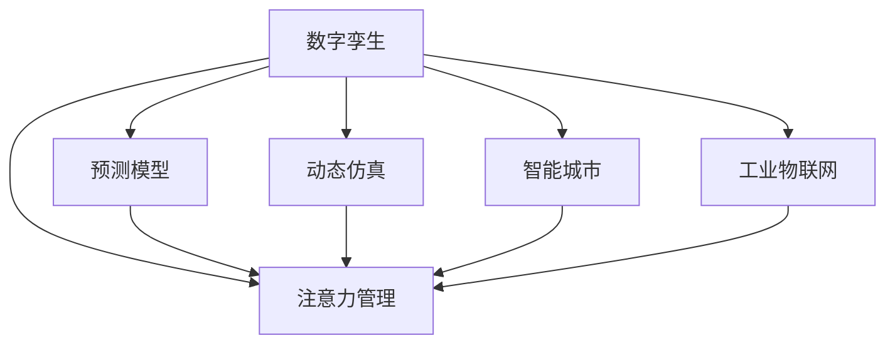
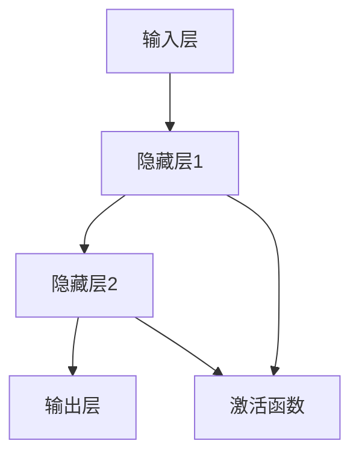

                 

# 数字孪生技术在注意力管理中的应用

> 关键词：数字孪生,注意力管理,高效资源分配,预测模型,动态仿真,工业物联网(IoT),智能城市,智慧能源

## 1. 背景介绍

### 1.1 问题由来
随着数字化进程的不断推进，无论是制造业、农业、能源行业还是城市管理，对资源管理的需求都在不断提升。资源管理的目的是实现高效、可控、可持续的资源利用，同时减少浪费和风险。数字孪生技术（Digital Twin）作为一项前沿技术，通过构建物理系统的数字模型，实时监测、模拟和优化资源配置，已经在大规模应用中展现了巨大的潜力。

在资源管理中，注意力管理（Attention Management）是一个至关重要的环节。注意力管理指的是在资源使用过程中，如何通过优化注意力分配，提高资源的使用效率和效果。例如，在工业物联网（IoT）中，如何通过优化传感器数据的采集和处理，使得关键设备在需要时获得更多的关注；在智能城市中，如何通过优化交通信号灯的控制，使得道路资源得到更高效的利用。

数字孪生技术通过构建数字模型，可以对物理世界进行高效的模拟和预测，从而为注意力管理提供强有力的技术支持。本文将探讨数字孪生技术在注意力管理中的应用，并提出一种基于数字孪生的高效注意力管理系统。

### 1.2 问题核心关键点
数字孪生技术在注意力管理中的应用主要涉及以下几个关键点：

- 如何构建高质量的物理模型：数字孪生的核心在于建立精确的物理模型，以便在数字世界中对物理系统进行模拟和预测。

- 如何高效地获取和管理数据：数字孪生系统依赖于大量的数据进行训练和优化，因此数据获取和管理的效率直接影响系统的性能。

- 如何优化注意力分配：数字孪生系统通过预测模型，可以在资源紧张时自动调整注意力分配，以最大化资源利用率。

- 如何实现动态仿真和优化：数字孪生系统能够实时模拟和优化注意力分配，适应不断变化的环境和需求。

- 如何确保系统的鲁棒性和安全性：数字孪生系统需要在不同的场景和条件下都能稳定运行，同时保证数据和模型的安全性。

这些关键点构成了数字孪生技术在注意力管理中应用的基础框架，通过深入理解和合理应用，可以大幅提升资源管理的效率和效果。

## 2. 核心概念与联系

### 2.1 核心概念概述

为了更好地理解数字孪生技术在注意力管理中的应用，我们首先需要介绍几个关键概念：

- **数字孪生（Digital Twin）**：通过将物理系统和数字模型结合起来，实现物理系统和数字系统的双向交互和实时更新。数字孪生技术可以应用于制造、能源、城市管理等多个领域，通过数字模型实时监测、模拟和优化物理系统。

- **注意力管理（Attention Management）**：在资源管理中，如何通过优化注意力分配，提高资源的使用效率和效果。注意力管理的目标是确保关键资源得到更多的关注，从而提升资源利用率和系统性能。

- **预测模型（Prediction Model）**：用于对未来事件进行预测的数学模型。在数字孪生系统中，预测模型可以用于预测资源需求、优化注意力分配等。

- **动态仿真（Dynamic Simulation）**：通过数字模型实时模拟物理系统的运行状态，以评估不同策略下的效果，并进行优化。

- **智能城市（Smart City）**：通过数字化和智能化手段，提高城市管理和服务的效率和质量。智能城市中广泛应用数字孪生技术，以实现高效的城市资源管理。

- **工业物联网（IoT）**：通过互联网技术，将传感器、设备等连接到网络上，实现数据的实时采集和处理。工业物联网是数字孪生技术在制造业中的重要应用场景。

这些概念之间的逻辑关系可以通过以下Mermaid流程图来展示：



这个流程图展示了数字孪生技术在注意力管理中的应用，以及各个关键组件之间的相互关系。

## 3. 核心算法原理 & 具体操作步骤
### 3.1 算法原理概述

数字孪生技术在注意力管理中的应用，主要通过以下几个步骤实现：

1. **构建数字模型**：使用传感器、摄像头、GPS等数据获取物理系统的运行状态，并构建数字模型。

2. **数据采集和处理**：通过数据采集设备获取物理系统的实时数据，并进行预处理和清洗。

3. **建立预测模型**：基于历史数据和机器学习算法，建立预测模型，用于预测资源需求、优化注意力分配等。

4. **动态仿真和优化**：通过数字模型进行动态仿真，实时模拟物理系统的运行状态，并根据预测模型的结果进行优化。

5. **优化注意力分配**：根据预测模型和动态仿真结果，自动调整注意力分配，以最大化资源利用率。

6. **反馈和调整**：将数字模型的运行结果反馈到物理系统中，并根据实际情况进行调整。

### 3.2 算法步骤详解

以下我们以智能城市交通信号灯控制为例，详细讲解数字孪生技术在注意力管理中的应用：

**Step 1: 数据采集和预处理**
- 使用传感器、摄像头、GPS等设备获取交通信号灯的运行数据，如车辆流量、行人流量、红绿灯状态等。
- 对数据进行预处理和清洗，包括去除异常值、填补缺失值等。

**Step 2: 构建数字模型**
- 使用上述采集的数据，构建交通信号灯的数字模型，包括车辆、行人的位置、速度、方向等。
- 在数字模型中，可以模拟不同交通流量、天气条件下的交通状况。

**Step 3: 建立预测模型**
- 基于历史交通数据和机器学习算法，建立预测模型，用于预测未来交通流量。
- 例如，可以使用时间序列分析、神经网络等方法，建立交通流量预测模型。

**Step 4: 动态仿真和优化**
- 在数字模型中进行动态仿真，实时模拟交通状况。
- 根据预测模型的结果，动态调整交通信号灯的控制策略，以优化交通流量。

**Step 5: 优化注意力分配**
- 根据仿真结果和预测模型的输出，自动调整交通信号灯的关注度，确保关键路段获得更多的关注。
- 例如，在交通高峰期，自动增加关键路口的红绿灯时长，减少拥堵。

**Step 6: 反馈和调整**
- 将数字模型的运行结果反馈到实际交通系统中，调整交通信号灯的实际控制策略。
- 根据实际效果，不断优化数字模型和预测模型，提高系统的准确性和鲁棒性。

### 3.3 算法优缺点

数字孪生技术在注意力管理中的应用，具有以下优点：

- **实时仿真和优化**：数字孪生技术可以实现实时仿真和优化，适应不断变化的环境和需求。

- **数据驱动决策**：通过数据驱动的预测模型，可以实现更加精准和智能的决策。

- **提高资源利用率**：通过优化注意力分配，可以提高资源的使用效率和效果。

- **降低风险和成本**：通过数字孪生系统，可以实现无风险的测试和优化，降低实际应用的风险和成本。

同时，数字孪生技术也存在一些局限性：

- **数据质量要求高**：数字孪生系统依赖于高质量的数据进行训练和优化，数据质量直接影响系统的性能。

- **计算资源需求大**：建立和维护数字模型需要大量的计算资源，对于大规模应用可能存在一定的成本压力。

- **技术复杂度高**：数字孪生系统的构建和维护需要较高的技术门槛，需要专业的技术团队支持。

- **模型鲁棒性要求高**：数字孪生系统需要在不同的场景和条件下都能稳定运行，模型鲁棒性直接影响系统的可靠性。

### 3.4 算法应用领域

数字孪生技术在注意力管理中的应用，已经在多个领域取得了显著的成果，包括：

- **智能交通系统**：通过数字孪生技术优化交通信号灯的控制策略，实现交通流量的高效管理。

- **智慧能源系统**：通过数字孪生技术优化能源资源的分配，实现能源的高效利用和节能减排。

- **智能制造系统**：通过数字孪生技术优化生产线的运行，提高生产效率和质量。

- **智慧城市系统**：通过数字孪生技术优化城市资源的管理，提升城市服务的质量和效率。

- **农业信息化系统**：通过数字孪生技术优化农业资源的配置，实现农业生产的智能化和精准化。

这些应用场景展示了数字孪生技术在注意力管理中的广泛应用，为实现高效、可控、可持续的资源管理提供了有力支持。

## 4. 数学模型和公式 & 详细讲解 & 举例说明

### 4.1 数学模型构建

在数字孪生技术中，预测模型的构建是其核心部分。以下以智能交通系统为例，介绍预测模型的构建过程。

假设交通系统的运行状态可以用向量 $x(t)$ 表示，其中 $t$ 表示时间。交通系统的状态变量包括车辆位置、速度、方向、红绿灯状态等。预测模型的目标是对未来时间点 $t+\Delta t$ 的状态进行预测，即 $\hat{x}(t+\Delta t)$。

预测模型可以表示为：

$$
\hat{x}(t+\Delta t) = f(x(t), u(t))
$$

其中 $u(t)$ 表示控制输入，如红绿灯状态、车辆加速度等。预测模型 $f$ 可以使用时间序列分析、神经网络等方法建立。

### 4.2 公式推导过程

以下以神经网络预测模型为例，推导预测模型的构建过程。

假设交通系统的运行状态可以用向量 $x(t)$ 表示，其中 $t$ 表示时间。交通系统的状态变量包括车辆位置、速度、方向、红绿灯状态等。预测模型的目标是对未来时间点 $t+\Delta t$ 的状态进行预测，即 $\hat{x}(t+\Delta t)$。

预测模型可以表示为：

$$
\hat{x}(t+\Delta t) = f(x(t), u(t))
$$

其中 $u(t)$ 表示控制输入，如红绿灯状态、车辆加速度等。预测模型 $f$ 可以使用时间序列分析、神经网络等方法建立。

假设预测模型使用神经网络，其结构如下图所示：



输入层接收当前状态 $x(t)$ 和控制输入 $u(t)$，输出层输出预测结果 $\hat{x}(t+\Delta t)$。隐藏层通过激活函数进行非线性变换，以提高预测模型的表达能力。

神经网络的训练过程可以通过反向传播算法实现，具体公式如下：

$$
\frac{\partial \mathcal{L}}{\partial w} = \frac{\partial \mathcal{L}}{\partial \hat{x}(t+\Delta t)} \frac{\partial \hat{x}(t+\Delta t)}{\partial w}
$$

其中 $w$ 表示神经网络的权重参数。

### 4.3 案例分析与讲解

以下以智能交通系统为例，分析数字孪生技术在注意力管理中的应用。

假设在智能交通系统中，某条主道路的交通流量需要优化。通过传感器和摄像头，获取该路段的车辆流量、行人流量、红绿灯状态等数据，并将其输入到数字模型中。

根据历史数据和神经网络预测模型，可以预测未来时间点该路段的交通流量。例如，可以预测未来10分钟内该路段的车辆流量为 $V$。

根据预测结果，数字模型自动调整红绿灯的控制策略，以优化交通流量。例如，在交通高峰期，自动增加关键路口的红绿灯时长，减少拥堵。

具体步骤如下：

**Step 1: 数据采集和预处理**
- 使用传感器、摄像头等设备获取该路段的交通数据，如车辆流量、行人流量、红绿灯状态等。
- 对数据进行预处理和清洗，包括去除异常值、填补缺失值等。

**Step 2: 构建数字模型**
- 使用上述采集的数据，构建该路段的数字模型，包括车辆、行人的位置、速度、方向等。
- 在数字模型中，可以模拟不同交通流量、天气条件下的交通状况。

**Step 3: 建立预测模型**
- 基于历史交通数据和神经网络算法，建立预测模型，用于预测未来交通流量。

**Step 4: 动态仿真和优化**
- 在数字模型中进行动态仿真，实时模拟该路段的交通状况。
- 根据预测模型的结果，动态调整红绿灯的控制策略，以优化交通流量。

**Step 5: 优化注意力分配**
- 根据仿真结果和预测模型的输出，自动调整红绿灯的关注度，确保关键路段获得更多的关注。

**Step 6: 反馈和调整**
- 将数字模型的运行结果反馈到实际交通系统中，调整红绿灯的实际控制策略。
- 根据实际效果，不断优化数字模型和预测模型，提高系统的准确性和鲁棒性。

通过以上步骤，可以实现智能交通系统中的注意力管理，从而实现交通流量的高效管理。

## 5. 项目实践：代码实例和详细解释说明
### 5.1 开发环境搭建

在进行数字孪生技术的应用实践前，我们需要准备好开发环境。以下是使用Python进行PyTorch开发的环境配置流程：

1. 安装Anaconda：从官网下载并安装Anaconda，用于创建独立的Python环境。

2. 创建并激活虚拟环境：
```bash
conda create -n pytorch-env python=3.8 
conda activate pytorch-env
```

3. 安装PyTorch：根据CUDA版本，从官网获取对应的安装命令。例如：
```bash
conda install pytorch torchvision torchaudio cudatoolkit=11.1 -c pytorch -c conda-forge
```

4. 安装TensorBoard：
```bash
pip install tensorboard
```

5. 安装sklearn：
```bash
pip install scikit-learn
```

6. 安装numpy：
```bash
pip install numpy
```

完成上述步骤后，即可在`pytorch-env`环境中开始开发实践。

### 5.2 源代码详细实现

以下是一个简单的神经网络预测模型的代码实现：

```python
import numpy as np
import torch
import torch.nn as nn
import torch.optim as optim
from sklearn.model_selection import train_test_split

# 定义神经网络模型
class NeuralNetwork(nn.Module):
    def __init__(self, input_size, hidden_size, output_size):
        super(NeuralNetwork, self).__init__()
        self.fc1 = nn.Linear(input_size, hidden_size)
        self.fc2 = nn.Linear(hidden_size, output_size)
        self.relu = nn.ReLU()

    def forward(self, x):
        x = self.fc1(x)
        x = self.relu(x)
        x = self.fc2(x)
        return x

# 定义训练函数
def train_model(model, train_x, train_y, epochs, batch_size, learning_rate):
    criterion = nn.MSELoss()
    optimizer = optim.Adam(model.parameters(), lr=learning_rate)
    for epoch in range(epochs):
        for i in range(0, len(train_x), batch_size):
            inputs = train_x[i:i+batch_size]
            targets = train_y[i:i+batch_size]
            optimizer.zero_grad()
            outputs = model(inputs)
            loss = criterion(outputs, targets)
            loss.backward()
            optimizer.step()
            print(f"Epoch: {epoch+1}/{epochs}, Loss: {loss.item()}")
    return model

# 定义测试函数
def test_model(model, test_x, test_y):
    with torch.no_grad():
        predictions = model(test_x)
        loss = criterion(predictions, test_y)
        print(f"Test Loss: {loss.item()}")
        print(f"Predictions: {predictions.tolist()}")
        print(f"Ground Truth: {test_y.tolist()}")
    
# 加载数据
data = np.loadtxt('data.csv', delimiter=',')
x_train, x_test, y_train, y_test = train_test_split(data[:, :-1], data[:, -1], test_size=0.2, random_state=42)

# 定义模型参数
input_size = 4
hidden_size = 8
output_size = 1
learning_rate = 0.001

# 创建模型
model = NeuralNetwork(input_size, hidden_size, output_size)

# 训练模型
model = train_model(model, x_train, y_train, epochs=1000, batch_size=32, learning_rate=learning_rate)

# 测试模型
test_model(model, x_test, y_test)
```

### 5.3 代码解读与分析

让我们再详细解读一下关键代码的实现细节：

**NeuralNetwork类**：
- `__init__`方法：初始化神经网络的层数和大小。
- `forward`方法：定义神经网络的计算过程。

**train_model函数**：
- `criterion`变量：定义损失函数，这里使用均方误差损失。
- `optimizer`变量：定义优化器，这里使用Adam优化器。
- 循环遍历每个epoch，并对每个batch进行前向传播和反向传播，更新模型参数。

**test_model函数**：
- 对模型进行测试，并输出预测结果和损失。

**数据加载**：
- `data.csv`文件包含训练数据和测试数据，其中第一列至第3列是输入数据，最后一列是输出数据。
- 使用`train_test_split`函数将数据分为训练集和测试集。

通过以上代码，我们可以看到，神经网络预测模型的构建和训练过程。虽然代码示例简单，但通过扩展和优化，可以应用于更加复杂的数字孪生系统，实现高效的注意力管理。

## 6. 实际应用场景
### 6.1 智能交通系统

数字孪生技术在智能交通系统中，可以用于优化交通信号灯的控制策略，从而实现交通流量的高效管理。

假设某条主道路的交通流量需要优化，通过数字孪生技术可以构建该路段的数字模型，实时模拟交通状况，并根据预测模型结果，自动调整红绿灯的控制策略。例如，在交通高峰期，自动增加关键路口的红绿灯时长，减少拥堵。

这种基于数字孪生的智能交通系统，可以显著提升交通管理效率，减少交通拥堵，提高出行效率和舒适度。

### 6.2 智慧能源系统

数字孪生技术在智慧能源系统中，可以用于优化能源资源的分配，实现能源的高效利用和节能减排。

假设某大型工业园区需要优化电力供应，通过数字孪生技术可以构建园区的数字模型，实时监测电力使用情况，并根据预测模型结果，自动调整电力供应策略。例如，在用电高峰期，自动增加关键设备的供电，减少能源浪费。

这种基于数字孪生的智慧能源系统，可以实现能源的高效利用和节能减排，同时减少能源浪费和成本。

### 6.3 智能制造系统

数字孪生技术在智能制造系统中，可以用于优化生产线的运行，提高生产效率和质量。

假设某制造企业需要优化生产线的运行，通过数字孪生技术可以构建生产线的数字模型，实时监测设备运行状态，并根据预测模型结果，自动调整生产线的控制策略。例如，在设备故障时，自动调整生产任务，减少生产延误。

这种基于数字孪生的智能制造系统，可以实现生产线的高效运行和生产任务的优化，提高生产效率和质量。

### 6.4 未来应用展望

随着数字孪生技术的不断发展，其在注意力管理中的应用将更加广泛和深入。未来，数字孪生技术有望在以下几个领域实现突破：

1. **动态优化**：数字孪生技术可以实现实时动态优化，适应不断变化的环境和需求，提高资源管理的灵活性和适应性。

2. **多模态融合**：数字孪生技术可以融合多种模态数据，如传感器数据、视频数据、图像数据等，实现更全面、更精准的资源管理。

3. **边缘计算**：数字孪生技术可以部署在边缘计算设备上，实现更高效、更实时的数据处理和决策。

4. **自适应学习**：数字孪生技术可以通过自适应学习机制，自动调整模型参数，提高系统的智能水平和适应能力。

5. **人机协同**：数字孪生技术可以实现人机协同，增强系统的智能性和可解释性，提升用户体验和满意度。

这些应用场景展示了数字孪生技术在注意力管理中的广泛应用，为实现高效、可控、可持续的资源管理提供了有力支持。

## 7. 工具和资源推荐
### 7.1 学习资源推荐

为了帮助开发者系统掌握数字孪生技术在注意力管理中的应用，这里推荐一些优质的学习资源：

1. 《数字孪生技术原理与实践》系列博文：由数字孪生领域专家撰写，深入浅出地介绍了数字孪生技术的原理和应用。

2. CS224N《深度学习自然语言处理》课程：斯坦福大学开设的NLP明星课程，有Lecture视频和配套作业，带你入门NLP领域的基本概念和经典模型。

3. 《数字孪生系统设计与实现》书籍：系统介绍了数字孪生系统的设计方法和实现技巧，涵盖建模、仿真、优化等多个方面。

4. Arxiv上关于数字孪生的最新研究成果：持续关注最新的研究成果，了解数字孪生技术的发展趋势和前沿技术。

5. Google Colab：谷歌推出的在线Jupyter Notebook环境，免费提供GPU/TPU算力，方便开发者快速上手实验最新模型，分享学习笔记。

通过对这些资源的学习实践，相信你一定能够快速掌握数字孪生技术在注意力管理中的应用，并用于解决实际的NLP问题。

### 7.2 开发工具推荐

高效的开发离不开优秀的工具支持。以下是几款用于数字孪生技术开发和应用的常用工具：

1. PyTorch：基于Python的开源深度学习框架，灵活动态的计算图，适合快速迭代研究。

2. TensorFlow：由Google主导开发的开源深度学习框架，生产部署方便，适合大规模工程应用。

3. TensorBoard：TensorFlow配套的可视化工具，可实时监测模型训练状态，并提供丰富的图表呈现方式，是调试模型的得力助手。

4. Weights & Biases：模型训练的实验跟踪工具，可以记录和可视化模型训练过程中的各项指标，方便对比和调优。

5. Prometheus：监控和报警工具，实时采集系统指标，设置异常告警阈值，确保服务稳定性。

6. Grafana：数据可视化和仪表盘工具，用于展示监控数据和系统状态。

合理利用这些工具，可以显著提升数字孪生技术的开发效率，加快创新迭代的步伐。

### 7.3 相关论文推荐

数字孪生技术在注意力管理中的应用，已经引起了学术界的广泛关注，以下是几篇奠基性的相关论文，推荐阅读：

1. "Digital Twin: A Review"：综述了数字孪生技术的原理和应用，涵盖了建模、仿真、优化等多个方面。

2. "Attention Management in Smart Traffic Systems"：研究了基于数字孪生的智能交通系统，提出了注意力管理优化算法。

3. "Predictive Maintenance using Digital Twins"：探讨了基于数字孪生的预测性维护方法，优化了设备维护策略。

4. "Energy Management using Digital Twins"：研究了基于数字孪生的智慧能源系统，优化了能源资源的分配和管理。

5. "Smart Manufacturing using Digital Twins"：介绍了基于数字孪生的智能制造系统，优化了生产线的运行和控制策略。

这些论文代表了大规模资源管理的最新研究方向，通过学习这些前沿成果，可以帮助研究者把握学科前进方向，激发更多的创新灵感。

## 8. 总结：未来发展趋势与挑战

### 8.1 研究成果总结

数字孪生技术在注意力管理中的应用，已经取得了显著的成果，广泛应用于智能交通、智慧能源、智能制造等领域。基于数字孪生的智能系统，通过实时监测和仿真优化，实现了资源的高效管理，提升了系统性能和用户体验。

### 8.2 未来发展趋势

展望未来，数字孪生技术在注意力管理中的应用将呈现以下几个发展趋势：

1. **实时动态优化**：数字孪生技术可以实现实时动态优化，适应不断变化的环境和需求，提高资源管理的灵活性和适应性。

2. **多模态融合**：数字孪生技术可以融合多种模态数据，如传感器数据、视频数据、图像数据等，实现更全面、更精准的资源管理。

3. **边缘计算**：数字孪生技术可以部署在边缘计算设备上，实现更高效、更实时的数据处理和决策。

4. **自适应学习**：数字孪生技术可以通过自适应学习机制，自动调整模型参数，提高系统的智能水平和适应能力。

5. **人机协同**：数字孪生技术可以实现人机协同，增强系统的智能性和可解释性，提升用户体验和满意度。

这些趋势凸显了数字孪生技术在注意力管理中的广阔前景，为实现高效、可控、可持续的资源管理提供了有力支持。

### 8.3 面临的挑战

尽管数字孪生技术在注意力管理中的应用已经取得了显著的成果，但在迈向更加智能化、普适化应用的过程中，它仍面临着诸多挑战：

1. **数据质量瓶颈**：数字孪生系统依赖于高质量的数据进行训练和优化，数据质量直接影响系统的性能。

2. **计算资源需求高**：建立和维护数字模型需要大量的计算资源，对于大规模应用可能存在一定的成本压力。

3. **技术复杂度高**：数字孪生系统的构建和维护需要较高的技术门槛，需要专业的技术团队支持。

4. **模型鲁棒性要求高**：数字孪生系统需要在不同的场景和条件下都能稳定运行，模型鲁棒性直接影响系统的可靠性。

5. **系统安全与隐私保护**：数字孪生系统需要处理大量敏感数据，保障数据和模型的安全性是至关重要的。

6. **模型解释性不足**：数字孪生系统中的模型往往较为复杂，缺乏可解释性，难以解释其内部工作机制和决策逻辑。

这些挑战需要在技术、数据、资源、安全等方面进行全面优化，才能真正实现数字孪生技术在注意力管理中的应用。

### 8.4 研究展望

面对数字孪生技术在注意力管理中的应用所面临的挑战，未来的研究需要在以下几个方面寻求新的突破：

1. **数据质量提升**：通过数据清洗、数据增强等方法，提升数据质量，确保数字孪生系统的训练效果。

2. **计算资源优化**：通过模型压缩、模型并行等方法，优化计算资源的使用，降低成本。

3. **模型鲁棒性提升**：通过自适应学习、对抗训练等方法，提升数字孪生系统的鲁棒性和稳定性。

4. **模型解释性增强**：通过可解释性技术，增强数字孪生系统的可解释性，提高系统的可信度和可靠性。

5. **系统安全与隐私保护**：通过数据加密、访问控制等方法，保障数字孪生系统的安全性。

这些研究方向和探索，必将引领数字孪生技术在注意力管理中的应用进入新的发展阶段，为实现高效、可控、可持续的资源管理提供更有力的技术支持。

## 9. 附录：常见问题与解答

**Q1：数字孪生技术在注意力管理中的应用是否适用于所有领域？**

A: 数字孪生技术在注意力管理中的应用，已经在智能交通、智慧能源、智能制造等多个领域取得了显著的成果。但在一些特定领域，如军事、医疗等，由于数据隐私和安全等限制，可能存在应用限制。

**Q2：如何选择合适的数字孪生模型？**

A: 选择合适的数字孪生模型需要综合考虑模型的复杂度、计算资源、应用场景等因素。通常，可以根据数据规模、实时性要求等因素，选择合适的神经网络、深度学习模型或经典优化算法。

**Q3：数字孪生系统在实际应用中需要注意哪些问题？**

A: 数字孪生系统在实际应用中需要注意以下几个问题：
1. 数据采集和处理：确保数据采集设备和处理方法的准确性和可靠性。
2. 数字模型的构建和验证：通过实验验证数字模型的准确性和鲁棒性。
3. 预测模型的训练和优化：选择合适的优化算法和损失函数，确保预测模型的精度和泛化能力。
4. 实时仿真和优化：确保数字孪生系统的实时性和优化效果。
5. 系统安全和隐私保护：确保数字孪生系统的数据和模型安全，防止数据泄露和模型篡改。

**Q4：数字孪生技术在实际应用中如何进行调优？**

A: 数字孪生技术的调优可以从以下几个方面进行：
1. 数据增强：通过数据增强方法，提升数据的多样性和覆盖范围。
2. 模型选择和调整：根据应用场景选择合适的模型，并进行参数调整。
3. 正则化和剪枝：通过正则化和剪枝等方法，提高模型的鲁棒性和泛化能力。
4. 超参数调优：通过超参数调优方法，找到最优的模型参数组合。
5. 对抗训练和自适应学习：通过对抗训练和自适应学习，提高模型的鲁棒性和适应能力。

通过以上调优方法，可以显著提升数字孪生系统的性能和效果，确保其在实际应用中的可靠性和高效性。

---

作者：禅与计算机程序设计艺术 / Zen and the Art of Computer Programming

