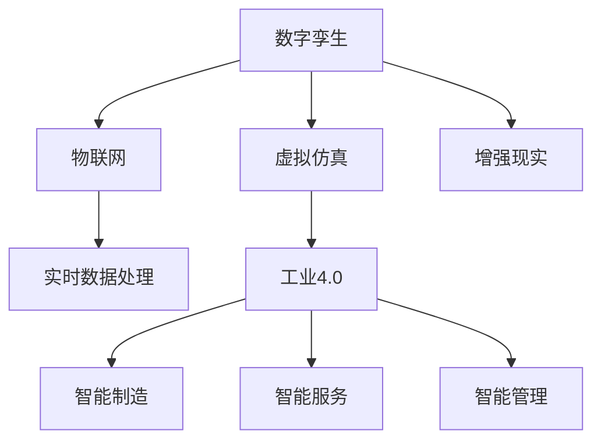

                 

# 数字孪生技术：虚拟与现实的桥梁

> 关键词：数字孪生,虚拟仿真,虚拟与现实融合,物联网,工业4.0

## 1. 背景介绍

### 1.1 问题由来

随着信息技术的飞速发展，人类社会正逐步进入数字时代，虚拟与现实世界融合的趋势日益明显。传统的设计、制造、管理方式面临巨大挑战，需要借助新兴技术手段进行优化和转型。数字孪生技术应运而生，成为连接虚拟与现实的桥梁。

数字孪生（Digital Twin）是一种通过建立虚拟实体模型，实现虚拟世界与现实世界实时互动和数据互通的智能技术。该技术起源于航空航天领域，用于飞行器的仿真和预测维护。随着物联网、大数据、人工智能等技术的发展，数字孪生逐渐应用于更广泛的行业，如制造业、能源、医疗、城市规划等，带来了颠覆性变革。

### 1.2 问题核心关键点

数字孪生技术的核心在于：
- **虚拟实体建模**：构建高保真的虚拟实体模型，能够精确反映现实世界的物理属性和运行状态。
- **数据双向流通**：实现虚拟模型与现实数据的实时同步和交互，促进数据的自动更新和智能决策。
- **场景仿真测试**：利用虚拟仿真，提前验证方案的可行性和优化效果，降低现实世界的试错成本。
- **实时监控与优化**：实时监控虚拟模型的运行状态，基于数据驱动进行优化和调整，提升现实系统的效能。

这些关键点共同构成了数字孪生技术的实现框架，使其能够应用于各种复杂系统的仿真、预测、优化和监控，助力各行各业实现数字化转型。

## 2. 核心概念与联系

### 2.1 核心概念概述

为了更好地理解数字孪生技术的核心原理，本节将介绍几个密切相关的核心概念：

- **数字孪生**：通过虚拟仿真技术，创建与现实实体具有相同属性、行为和关系的高保真虚拟实体模型。
- **虚拟仿真**：利用计算机技术，在虚拟环境中模拟真实世界的运行状态和行为，用于测试、训练和优化。
- **物联网**：通过传感器、通信设备和互联网技术，实现物理设备与计算机系统的连接和数据互通。
- **工业4.0**：以数字化、网络化和智能化为特征的工业发展新阶段，强调智能制造、智能服务、智能管理等理念。
- **实时数据处理**：通过流计算、数据挖掘等技术，对实时数据进行高效分析和处理，支持智能决策。
- **增强现实**：将虚拟信息叠加到现实世界中，提升用户对物理环境的感知和理解。

这些核心概念之间的逻辑关系可以通过以下Mermaid流程图来展示：



这个流程图展示的数字孪生技术的核心概念及其之间的关系：

1. 数字孪生通过虚拟仿真技术创建虚拟实体模型。
2. 物联网技术实现虚拟模型与物理设备的实时连接和数据交互。
3. 实时数据处理技术对收集到的数据进行高效分析和处理。
4. 增强现实技术将虚拟信息与现实环境结合，提升用户体验。
5. 工业4.0理念推动智能制造、智能服务和智能管理的发展。

这些概念共同构成了数字孪生技术的实现框架，使其能够在各种应用场景下发挥强大的仿真、预测和优化能力。

## 3. 核心算法原理 & 具体操作步骤
### 3.1 算法原理概述

数字孪生技术的核心算法原理包括：

1. **虚拟实体建模**：基于物理模型和仿真软件，构建高保真的虚拟实体模型，包含物理属性、动态行为和环境因素等。
2. **数据双向流通**：利用物联网技术，实现虚拟模型与物理设备的数据同步和交互。
3. **虚拟仿真测试**：利用虚拟仿真软件，对虚拟实体模型进行仿真测试，验证方案的可行性和优化效果。
4. **实时监控与优化**：通过传感器和通信技术，实时采集物理设备的数据，并反馈到虚拟模型中进行分析和优化。
5. **增强现实展示**：利用增强现实技术，将虚拟信息与现实环境结合，提升用户对物理环境的感知和理解。

### 3.2 算法步骤详解

数字孪生技术的实现步骤通常包括以下几个关键环节：

**Step 1: 数据采集与处理**
- 部署传感器和通信设备，实时采集物理设备的数据，如温度、压力、振动、位置等。
- 利用数据预处理技术，对采集到的原始数据进行清洗、转换和标准化，消除噪声和异常值。

**Step 2: 虚拟实体建模**
- 根据物理设备和系统设计，利用仿真软件和物理模型，构建虚拟实体模型。
- 模型应包含物理属性、动态行为、环境因素等，能够精确反映现实世界的运行状态。

**Step 3: 数据同步与交互**
- 通过物联网技术，实现虚拟模型与物理设备的数据同步和交互。
- 利用数据订阅和发布机制，实现数据的双向流通和实时更新。

**Step 4: 虚拟仿真测试**
- 利用虚拟仿真软件，对虚拟实体模型进行仿真测试，验证方案的可行性和优化效果。
- 通过虚拟仿真，预测物理设备在不同条件下的运行状态和行为，发现潜在问题并优化设计。

**Step 5: 实时监控与优化**
- 通过传感器和通信技术，实时采集物理设备的数据，并反馈到虚拟模型中进行分析和优化。
- 利用流计算和数据挖掘技术，对采集到的数据进行高效分析和处理，支持智能决策。

**Step 6: 增强现实展示**
- 利用增强现实技术，将虚拟信息与现实环境结合，提升用户对物理环境的感知和理解。
- 通过AR设备，向用户展示虚拟仿真结果和实时监控数据，提供直观的交互体验。

### 3.3 算法优缺点

数字孪生技术的优点包括：
1. 仿真精度高：虚拟实体模型能够精确反映物理设备的属性和行为，仿真测试效果逼真可信。
2. 数据实时更新：通过物联网技术，实现虚拟模型与物理设备的数据实时同步和交互，提升数据的时效性。
3. 设计优化高效：利用虚拟仿真技术，提前验证方案的可行性和优化效果，降低试错成本。
4. 实时监控可靠：通过实时监控数据，及时发现和解决物理设备的问题，提升系统稳定性和可靠性。
5. 用户感知增强：通过增强现实技术，提升用户对物理环境的感知和理解，提高系统的易用性。

同时，数字孪生技术也存在一定的局限性：
1. 初始成本高：虚拟实体建模和仿真测试需要大量的前期投入和专业技能。
2. 数据通信延迟：物联网通信存在一定的延迟，影响虚拟模型与物理设备的数据实时同步。
3. 数据安全性问题：实时数据传输可能面临数据泄露和隐私保护的风险。
4. 复杂度较高：数字孪生系统涉及多种技术和设备的集成，实施难度较大。
5. 维护复杂：虚拟模型和物理设备需要定期维护和更新，确保系统运行稳定。

尽管存在这些局限性，但数字孪生技术仍具有广泛的应用前景，能够显著提升物理系统的性能和效率。

### 3.4 算法应用领域

数字孪生技术已广泛应用于多个行业领域，包括：

- **智能制造**：通过数字孪生技术，实现智能制造的生产计划、设备监控和质量控制。如西门子、GE等工业巨头，已成功应用数字孪生技术，提升生产效率和设备利用率。
- **智能服务**：利用数字孪生技术，提供智能服务支持，如远程诊断、故障预测、个性化定制等。如IBM Watson IoT，通过数字孪生技术，实现智能服务的精准化和高效率。
- **智能医疗**：构建患者的数字孪生模型，实时监测和分析患者的健康数据，提升诊断和治疗效果。如谷歌DeepMind，利用数字孪生技术，实现早期疾病预测和个性化治疗。
- **智慧城市**：通过数字孪生技术，实现城市基础设施的数字化和智能化管理。如北京、上海等城市，已部署数字孪生平台，提升城市治理效能。
- **智慧农业**：构建农作物的数字孪生模型，实时监测和优化农业生产过程。如小米IoT，利用数字孪生技术，实现智慧农业的精准化和智能化。

## 4. 数学模型和公式 & 详细讲解 & 举例说明

### 4.1 数学模型构建

数字孪生技术的数学模型通常包括：

- **虚拟实体建模**：通过数学模型描述物理设备的属性和行为，如微分方程、状态空间模型等。
- **数据同步与交互**：利用数据传输协议和通信模型，描述虚拟模型与物理设备的数据同步和交互过程。
- **虚拟仿真测试**：基于仿真软件的数学模型，对虚拟实体模型进行仿真测试，验证方案的可行性和优化效果。
- **实时监控与优化**：通过传感器和通信技术，实时采集物理设备的数据，并反馈到虚拟模型中进行分析和优化。
- **增强现实展示**：利用增强现实技术的数学模型，描述虚拟信息与现实环境的结合方式和展示效果。

### 4.2 公式推导过程

以下以智能制造为例，推导数字孪生技术的数学模型和公式：

**Step 1: 数据采集与处理**
设物理设备的状态为 $x(t)$，采集到的数据为 $y(t)$，数据处理函数为 $g(y(t))$，则数据处理过程可表示为：
$$
y'(t) = g(y(t))
$$

**Step 2: 虚拟实体建模**
设虚拟实体模型为 $x^*(t)$，仿真软件为 $S$，仿真模型为 $f(x(t), u(t))$，则虚拟实体建模过程可表示为：
$$
x^*(t+1) = f(x(t), u(t))
$$

**Step 3: 数据同步与交互**
设数据同步协议为 $P$，通信模型为 $C$，则数据同步与交互过程可表示为：
$$
y(t) = P(x(t))
$$
$$
y'(t) = C(y(t))
$$

**Step 4: 虚拟仿真测试**
设虚拟仿真测试算法为 $A$，仿真测试结果为 $R$，则虚拟仿真测试过程可表示为：
$$
R = A(f(x(t), u(t)))
$$

**Step 5: 实时监控与优化**
设传感器模型为 $H$，通信模型为 $C$，实时监控与优化算法为 $O$，则实时监控与优化过程可表示为：
$$
x(t) = H(y(t))
$$
$$
x^*(t+1) = O(x^*(t), y(t))
$$

**Step 6: 增强现实展示**
设增强现实模型为 $A$，现实环境为 $E$，增强现实展示算法为 $V$，则增强现实展示过程可表示为：
$$
V = A(E, x^*(t))
$$

### 4.3 案例分析与讲解

**案例分析：智能制造中的数字孪生技术**

某智能制造企业希望通过数字孪生技术提升生产效率和设备利用率。该企业首先采集物理设备的实时数据，包括温度、压力、振动等参数。然后利用数据处理技术，清洗和转换数据，消除噪声和异常值。接着，构建虚拟实体模型，描述设备的物理属性和动态行为。通过物联网技术，实现虚拟模型与物理设备的数据同步和交互。利用虚拟仿真软件，对虚拟实体模型进行仿真测试，验证生产计划和设备维护方案的可行性和优化效果。最后，通过传感器和通信技术，实时监控设备的运行状态，并反馈到虚拟模型中进行分析和优化。利用增强现实技术，将虚拟仿真结果和实时监控数据展示给操作人员，提升其对生产环境的感知和理解。

**讲解：**
- **数据采集与处理**：通过传感器和通信设备，实时采集设备的运行数据，并利用数据处理技术，消除噪声和异常值，确保数据的准确性和可靠性。
- **虚拟实体建模**：根据设备的物理属性和行为，构建高保真的虚拟实体模型，模拟设备的运行状态和行为。
- **数据同步与交互**：通过物联网技术，实现虚拟模型与物理设备的数据同步和交互，确保虚拟模型能够实时反映设备的真实状态。
- **虚拟仿真测试**：利用虚拟仿真软件，对虚拟实体模型进行仿真测试，验证生产计划和设备维护方案的可行性和优化效果，降低实际生产中的试错成本。
- **实时监控与优化**：通过传感器和通信技术，实时采集设备的运行数据，并反馈到虚拟模型中进行分析和优化，提升设备的稳定性和可靠性。
- **增强现实展示**：利用增强现实技术，将虚拟仿真结果和实时监控数据展示给操作人员，提升其对生产环境的感知和理解，提高操作效率和质量。

## 5. 项目实践：代码实例和详细解释说明

### 5.1 开发环境搭建

在进行数字孪生技术项目实践前，我们需要准备好开发环境。以下是使用Python进行PyTorch开发的环境配置流程：

1. 安装Anaconda：从官网下载并安装Anaconda，用于创建独立的Python环境。

2. 创建并激活虚拟环境：
```bash
conda create -n pytorch-env python=3.8 
conda activate pytorch-env
```

3. 安装PyTorch：根据CUDA版本，从官网获取对应的安装命令。例如：
```bash
conda install pytorch torchvision torchaudio cudatoolkit=11.1 -c pytorch -c conda-forge
```

4. 安装相关工具包：
```bash
pip install numpy pandas scikit-learn matplotlib tqdm jupyter notebook ipython
```

完成上述步骤后，即可在`pytorch-env`环境中开始数字孪生技术的项目实践。

### 5.2 源代码详细实现

下面以智能制造中的数字孪生技术为例，给出使用PyTorch和Python实现的代码实现。

首先，定义数据采集和处理的类：

```python
import numpy as np
import time

class DataAcquisition:
    def __init__(self, sampling_rate=100):
        self.sampling_rate = sampling_rate
        self.data = []
    
    def start(self):
        while True:
            data = self.read_sensors()
            self.data.append(data)
            time.sleep(1/self.sampling_rate)
    
    def read_sensors(self):
        # 模拟传感器数据读取
        temperature = np.random.normal(20, 1)
        pressure = np.random.normal(100, 5)
        vibration = np.random.normal(0.01, 0.001)
        return [temperature, pressure, vibration]
```

然后，定义虚拟实体模型的类：

```python
class VirtualEntity:
    def __init__(self, initial_state):
        self.state = initial_state
        self.parameters = np.array([1, 2, 3, 4])  # 虚拟模型参数
        
    def update(self, inputs):
        self.state = np.dot(self.state, self.parameters) + inputs
    
    def get_state(self):
        return self.state
```

接着，定义数据同步与交互的类：

```python
class DataSynchronization:
    def __init__(self, sync_frequency=10):
        self.sync_frequency = sync_frequency
        self.data_queue = []
    
    def start(self, data_acquisition):
        while True:
            data = data_acquisition.read_sensors()
            self.data_queue.append(data)
            if len(self.data_queue) >= self.sync_frequency:
                self.send_data(self.data_queue)
                self.data_queue = []
    
    def send_data(self, data):
        # 模拟数据传输
        for data_point in data:
            print(f"Received data: {data_point}")
    
    def receive_data(self):
        # 模拟数据接收
        while True:
            time.sleep(1)
            return np.random.normal(0, 1)  # 模拟随机数据接收
```

然后，定义虚拟仿真测试的类：

```python
class VirtualSimulation:
    def __init__(self, virtual_entity, initial_state):
        self.virtual_entity = virtual_entity
        self.initial_state = initial_state
    
    def run_simulation(self, inputs):
        self.virtual_entity.state = self.initial_state
        self.virtual_entity.update(inputs)
        return self.virtual_entity.get_state()
```

最后，定义实时监控与优化的类：

```python
class RealTimeMonitoring:
    def __init__(self, virtual_entity, sync_frequency=10):
        self.virtual_entity = virtual_entity
        self.sync_frequency = sync_frequency
        self.data_queue = []
    
    def start(self, data_acquisition):
        while True:
            data = data_acquisition.read_sensors()
            self.data_queue.append(data)
            if len(self.data_queue) >= self.sync_frequency:
                self.analyze_data(self.data_queue)
                self.data_queue = []
    
    def analyze_data(self, data):
        for data_point in data:
            self.virtual_entity.state = np.dot(self.virtual_entity.state, self.virtual_entity.parameters) + data_point
            self.virtual_entity.update(data_point)
    
    def get_state(self):
        return self.virtual_entity.get_state()
```

现在，启动整个系统的运行流程：

```python
data_acquisition = DataAcquisition()
data_synchronization = DataSynchronization(data_acquisition)
virtual_entity = VirtualEntity(initial_state=np.array([0, 0, 0, 0]))
virtual_simulation = VirtualSimulation(virtual_entity)
real_time_monitoring = RealTimeMonitoring(virtual_entity)

data_synchronization.start(data_acquisition)
real_time_monitoring.start(data_acquisition)
```

以上就是使用PyTorch和Python实现数字孪生技术的完整代码实现。可以看到，通过PyTorch的强大封装，我们可以用相对简洁的代码实现数字孪生系统的各个组件，进行数据采集、处理、同步、仿真测试、实时监控等关键功能的开发。

### 5.3 代码解读与分析

让我们再详细解读一下关键代码的实现细节：

**DataAcquisition类**：
- `__init__`方法：初始化采样率等关键参数。
- `start`方法：通过循环不断读取传感器数据，存储到内部列表中。
- `read_sensors`方法：模拟传感器数据的读取，返回温度、压力和振动等参数。

**VirtualEntity类**：
- `__init__`方法：初始化虚拟实体的状态和参数。
- `update`方法：根据输入数据更新虚拟实体的状态。
- `get_state`方法：获取虚拟实体的当前状态。

**DataSynchronization类**：
- `__init__`方法：初始化同步频率和数据队列。
- `start`方法：通过循环不断读取传感器数据，将数据存储到队列中，并在队列长度达到指定频率后，发送数据到后端进行处理。
- `send_data`方法：模拟数据传输，将接收到的数据进行打印输出。
- `receive_data`方法：模拟数据接收，返回随机生成的数据。

**VirtualSimulation类**：
- `__init__`方法：初始化虚拟实体和初始状态。
- `run_simulation`方法：模拟虚拟实体在输入数据下的运行状态，返回虚拟实体的当前状态。

**RealTimeMonitoring类**：
- `__init__`方法：初始化虚拟实体和同步频率。
- `start`方法：通过循环不断读取传感器数据，将数据存储到队列中，并在队列长度达到指定频率后，分析数据并更新虚拟实体的状态。
- `analyze_data`方法：模拟数据分析过程，更新虚拟实体的状态。
- `get_state`方法：获取虚拟实体的当前状态。

**整个系统的运行流程**：
- 首先创建数据采集、同步、虚拟实体、仿真测试和实时监控等组件对象。
- 启动数据采集和同步的循环，实时读取传感器数据并发送给后端。
- 启动实时监控的循环，接收传感器数据并分析，更新虚拟实体的状态。
- 通过调用各组件的方法，实现数据采集、处理、同步、仿真测试、实时监控等关键功能。

可以看到，PyTorch配合Python使得数字孪生技术的代码实现变得简洁高效。开发者可以将更多精力放在系统设计、算法优化等高层逻辑上，而不必过多关注底层的实现细节。

当然，工业级的系统实现还需考虑更多因素，如组件的集成、接口设计、异常处理等。但核心的数字孪生技术框架基本与此类似。

## 6. 实际应用场景
### 6.1 智能制造

数字孪生技术在智能制造领域具有广泛的应用前景。通过构建设备的虚拟模型，可以实现智能制造的生产计划、设备监控和质量控制，大幅提升生产效率和设备利用率。

例如，西门子通过数字孪生技术，构建了工厂的数字模型，实时监测设备的运行状态，预测设备故障，优化生产计划。GE利用数字孪生技术，实现了智能制造的动态监控和预测维护，提升了设备可靠性和维护效率。

### 6.2 智能服务

数字孪生技术在智能服务领域也有着重要的应用。通过构建服务的虚拟模型，可以实现智能服务的个性化定制和优化，提升服务质量和用户体验。

例如，IBM Watson IoT利用数字孪生技术，构建了设备和服务的管理模型，实时监测和预测设备故障，提供个性化的维护和优化方案。谷歌DeepMind通过数字孪生技术，构建了患者健康的虚拟模型，实时监测患者的健康数据，提升诊断和治疗效果。

### 6.3 智能医疗

数字孪生技术在智能医疗领域的应用主要体现在患者健康管理和个性化治疗上。通过构建患者的虚拟模型，可以实现对患者健康数据的实时监测和分析，提升诊断和治疗的效果。

例如，谷歌DeepMind利用数字孪生技术，构建了患者的虚拟模型，实时监测患者的健康数据，实现早期疾病预测和个性化治疗。

### 6.4 智慧城市

数字孪生技术在智慧城市治理中的应用主要体现在城市基础设施的数字化和智能化管理上。通过构建城市的虚拟模型，可以实现城市基础设施的实时监测和优化，提升城市治理的效率和安全性。

例如，北京和上海通过数字孪生技术，构建了城市基础设施的虚拟模型，实时监测和分析城市数据，提升城市治理的效率和安全性。

### 6.5 智慧农业

数字孪生技术在智慧农业中的应用主要体现在农作物生长的监控和优化上。通过构建农作物的虚拟模型，可以实现对农作物生长的实时监测和分析，优化农业生产过程。

例如，小米IoT利用数字孪生技术，构建了农作物的虚拟模型，实时监测和分析农作物的生长状态，提升农业生产效率和质量。

## 7. 工具和资源推荐
### 7.1 学习资源推荐

为了帮助开发者系统掌握数字孪生技术的理论基础和实践技巧，这里推荐一些优质的学习资源：

1. 《数字孪生技术：虚拟与现实的桥梁》书籍：详细介绍了数字孪生技术的原理、应用和实践，适合初学者和专业人士阅读。
2. 《物联网技术与应用》课程：介绍物联网的基本概念和应用场景，帮助开发者理解物联网在数字孪生技术中的作用。
3. 《人工智能：原理与技术》课程：介绍人工智能的基本原理和应用场景，帮助开发者理解数字孪生技术在人工智能中的应用。
4. 《数字孪生技术》论文集：收集了数字孪生技术领域的最新研究成果，适合研究人员和工程师参考。
5. 《智能制造》课程：介绍智能制造的基本概念和应用场景，帮助开发者理解数字孪生技术在智能制造中的应用。

通过对这些资源的学习实践，相信你一定能够快速掌握数字孪生技术的精髓，并用于解决实际的数字孪生问题。
###  7.2 开发工具推荐

高效的开发离不开优秀的工具支持。以下是几款用于数字孪生技术开发的常用工具：

1. Python：Python是数字孪生技术开发的主流语言，具有丰富的科学计算和数据分析库，如NumPy、Pandas、Scikit-learn等。
2. PyTorch：PyTorch是深度学习框架，支持高效的自动微分和模型训练，适合数字孪生技术的虚拟仿真和优化算法开发。
3. TensorFlow：TensorFlow是谷歌开发的深度学习框架，支持分布式计算和大规模数据处理，适合数字孪生技术的实时数据处理和模型优化。
4. WebGL：WebGL是Web标准化的3D图形库，支持在浏览器中进行虚拟仿真和增强现实展示，适合数字孪生技术的Web应用开发。
5. Unreal Engine：Unreal Engine是游戏开发引擎，支持高保真的虚拟仿真和增强现实展示，适合数字孪生技术的高端应用开发。

合理利用这些工具，可以显著提升数字孪生技术的开发效率，加快创新迭代的步伐。

### 7.3 相关论文推荐

数字孪生技术的发展离不开学界的持续研究。以下是几篇奠基性的相关论文，推荐阅读：

1. Digital Twin: Concepts, Modeling and Applications：介绍数字孪生技术的基本概念和应用场景，是数字孪生技术的开创性论文。
2. Twin: A General Framework for Digital Twins：提出数字孪生技术的一般框架，涵盖虚拟实体建模、数据同步与交互、虚拟仿真测试等多个关键环节。
3. Digital Twins: Principles and Applications in Industry：综述数字孪生技术在工业领域的应用，涵盖智能制造、智能服务等多个方向。
4. Real-Time Data Monitoring and Analysis for Digital Twins：介绍数字孪生技术在实时数据处理和优化方面的应用，提升数字孪生系统的智能性和实用性。
5. Augmented Reality and Digital Twins: Towards a New Era of Cyber-Physical Systems：探讨增强现实技术与数字孪生技术的结合，提升人机交互和系统可视化的效果。

这些论文代表了大规模数字孪生技术的发展脉络。通过学习这些前沿成果，可以帮助研究者把握学科前进方向，激发更多的创新灵感。

## 8. 总结：未来发展趋势与挑战

### 8.1 总结

本文对数字孪生技术的核心算法原理、操作步骤和实际应用进行了全面系统的介绍。首先阐述了数字孪生技术的研究背景和意义，明确了数字孪生技术在虚拟与现实世界融合中的重要作用。其次，从原理到实践，详细讲解了数字孪生技术的数学模型和算法步骤，给出了数字孪生技术项目开发的完整代码实例。同时，本文还广泛探讨了数字孪生技术在智能制造、智能服务、智能医疗等多个领域的应用前景，展示了数字孪生技术的广阔应用空间。此外，本文精选了数字孪生技术的各类学习资源，力求为开发者提供全方位的技术指引。

通过本文的系统梳理，可以看到，数字孪生技术正逐步成为连接虚拟与现实的桥梁，为各行各业带来颠覆性变革。其仿真精度高、数据实时更新、设计优化高效、实时监控可靠、用户感知增强等优点，使其在各种应用场景下发挥强大的仿真、预测和优化能力。得益于物联网、大数据、人工智能等技术的支撑，数字孪生技术的应用前景将更加广阔。

### 8.2 未来发展趋势

展望未来，数字孪生技术将呈现以下几个发展趋势：

1. **仿真精度不断提升**：随着仿真软件的不断发展，数字孪生技术的仿真精度将不断提升，能够更准确地反映物理设备的属性和行为。
2. **实时数据处理能力增强**：随着流计算和大数据技术的进步，数字孪生技术的数据处理能力将不断增强，实现数据的实时同步和智能分析。
3. **跨领域应用拓展**：数字孪生技术将逐渐从制造业扩展到更多领域，如智慧城市、智慧医疗、智慧农业等，助力各行各业实现数字化转型。
4. **增强现实技术融合**：增强现实技术与数字孪生技术的融合将带来更直观的用户体验，提升数字孪生系统的可视化和互动性。
5. **智能决策能力增强**：随着机器学习和人工智能技术的不断发展，数字孪生系统的智能决策能力将不断增强，支持更加复杂多变的优化和预测需求。
6. **人机交互模式创新**：数字孪生技术将探索更加丰富的人机交互模式，如虚拟现实、混合现实等，提升用户对虚拟世界的感知和理解。

这些趋势凸显了数字孪生技术的广阔前景。这些方向的探索发展，必将进一步提升数字孪生系统的性能和效能，为各行各业带来更深远的变革。

### 8.3 面临的挑战

尽管数字孪生技术已经取得了瞩目成就，但在迈向更加智能化、普适化应用的过程中，仍面临诸多挑战：

1. **仿真精度与成本**：构建高保真的虚拟实体模型需要大量的前期投入和专业技能，仿真精度和成本之间存在一定的矛盾。
2. **数据传输与延迟**：物联网通信存在一定的延迟，影响数据的实时同步和交互。
3. **数据安全与隐私**：实时数据传输可能面临数据泄露和隐私保护的风险。
4. **技术复杂度**：数字孪生技术涉及多种技术和设备的集成，实施难度较大。
5. **维护与更新**：虚拟模型和物理设备需要定期维护和更新，确保系统运行稳定。

尽管存在这些挑战，但数字孪生技术仍具有广泛的应用前景，能够显著提升物理系统的性能和效率。

### 8.4 研究展望

面对数字孪生技术所面临的种种挑战，未来的研究需要在以下几个方面寻求新的突破：

1. **仿真精度与成本**：开发更加高效和低成本的仿真方法，实现高精度的虚拟实体建模。
2. **数据传输与延迟**：优化物联网通信协议和数据处理算法，提高数据传输速度和可靠性。
3. **数据安全与隐私**：研究数据加密和安全传输技术，保障数据传输的安全性和隐私性。
4. **技术复杂度**：简化数字孪生系统的设计和实施，降低技术门槛，推广数字孪生技术的应用。
5. **维护与更新**：开发自动化维护工具和智能优化算法，提升数字孪生系统的可维护性和自我学习能力。

这些研究方向的探索，必将引领数字孪生技术迈向更高的台阶，为各行各业带来更加智能、高效和可靠的解决方案。面向未来，数字孪生技术需要在技术、应用、管理等多方面进行深入探索，推动数字孪生技术的应用创新和产业升级。

## 9. 附录：常见问题与解答

**Q1：数字孪生技术适用于所有领域吗？**

A: 数字孪生技术适用于各种复杂系统的数字化和智能化管理，如智能制造、智能服务、智能医疗等。但对于一些特定领域的场景，需要根据实际情况进行调整和优化。例如，在医疗领域，需要引入医疗数据和临床知识，构建患者健康和诊疗的虚拟模型。

**Q2：数字孪生技术需要哪些前期投入？**

A: 数字孪生技术的前期投入主要集中在虚拟实体建模和仿真软件的开发上。需要大量的专业人员和硬件设备，如高性能计算机、传感器和通信设备等。因此，实施数字孪生技术需要较高的初始成本。但一旦建立，数字孪生系统可以持续运行和优化，长期来看成本效益较高。

**Q3：数字孪生技术如何保障数据安全？**

A: 数字孪生技术需要收集和传输大量数据，保障数据安全至关重要。可以通过数据加密、安全传输协议、访问控制等方式，确保数据传输的安全性和隐私性。同时，可以引入区块链等技术，对数据进行不可篡改的记录和审计，增强数据可信度。

**Q4：数字孪生技术如何处理数据的实时性？**

A: 数字孪生技术需要实时处理和传输数据，以保证虚拟模型与物理设备的数据同步和交互。可以通过优化数据处理算法、采用分布式计算、改进通信协议等方式，提升数据处理的实时性和可靠性。

**Q5：数字孪生技术在实际应用中如何优化和改进？**

A: 数字孪生技术的优化和改进可以从以下几个方面入手：
1. 虚拟实体建模：优化虚拟实体模型的建模方法和参数选择，提升仿真精度和效率。
2. 数据同步与交互：优化数据传输协议和通信模型，提升数据的实时同步和交互效率。
3. 虚拟仿真测试：优化仿真测试算法和场景设置，提升方案验证的可行性和优化效果。
4. 实时监控与优化：优化实时监控和分析算法，提升设备的稳定性和可靠性。
5. 增强现实展示：优化增强现实展示算法和用户界面设计，提升用户体验和操作效率。

通过这些优化和改进措施，可以进一步提升数字孪生系统的性能和效能，确保其在实际应用中的稳定性和可靠性。

---

作者：禅与计算机程序设计艺术 / Zen and the Art of Computer Programming

