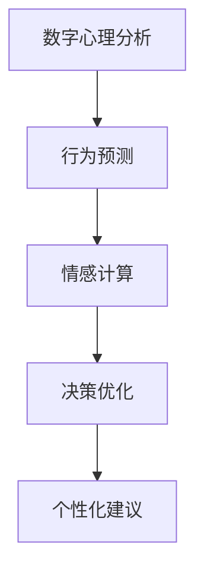

                 

# 数字意志力增强器：AI辅助的自制力培养

> 关键词：数字心理分析,自制力,时间管理,行为预测,情感计算,决策优化

## 1. 背景介绍

### 1.1 问题由来
在现代社会，信息的爆炸和工作的压力使得人们的注意力被不断分散，决策能力受到损害。研究显示，人们普遍缺乏自律和自制力，这不仅影响个人的学业和工作表现，还可能导致健康问题和情感压力。如何有效提升个人的自制力成为现代心理学和信息技术领域的重点课题。

近年来，随着人工智能技术的快速发展，AI在情感计算、行为分析等领域取得了显著进展，这为培养和提升人们的自制力提供了新的可能性。基于此，本文聚焦于如何利用AI技术辅助个人自制力的培养，提出了基于数字心理分析的数字意志力增强器框架，旨在帮助用户更好地管理时间和决策，提升个人自制力。

### 1.2 问题核心关键点
本文提出的数字意志力增强器，核心在于通过数字心理分析技术，对个人的行为模式和心理状态进行量化和预测，结合AI决策优化算法，提供个性化的自制力提升建议和策略。其关键点包括：

- **数字心理分析**：利用大数据和机器学习技术，分析个人的行为和情感数据，识别出潜在的问题和提升点。
- **行为预测**：通过预测算法，准确预测用户的决策和行为，帮助其在关键时刻做出更好的选择。
- **情感计算**：结合用户的情感状态，提供更为精准的自制力提升建议。
- **决策优化**：引入决策优化算法，辅助用户进行更优的资源分配和任务管理。
- **个性化建议**：根据用户的个性和需求，提供定制化的自制力提升策略。

这些关键点共同构成了数字意志力增强器的技术框架，帮助用户更好地认识和管理自己的自制力，从而提升生活质量和工作效率。

## 2. 核心概念与联系

### 2.1 核心概念概述

为更好地理解数字意志力增强器的原理和实现，本节将介绍几个密切相关的核心概念：

- **数字心理分析**：利用数据分析和机器学习技术，分析用户的数字足迹，包括行为数据、情感数据等，从中提取出用户的心理状态和行为特征。
- **行为预测**：通过时间序列分析和深度学习模型，预测用户在未来一段时间内的行为模式，尤其是关键决策点上的行为倾向。
- **情感计算**：结合情感分析技术和生理信号监测，实时获取用户的情感状态，为自制力提升提供情感依据。
- **决策优化**：通过优化算法，如线性规划、强化学习等，帮助用户优化资源分配和任务执行策略，提升整体自制力水平。
- **个性化建议**：根据用户的个性和需求，提供定制化的自制力提升策略，如时间管理、情绪调节等。

这些核心概念之间的逻辑关系可以通过以下Mermaid流程图来展示：



这个流程图展示的数字意志力增强器的核心概念及其之间的关系：

1. 通过数字心理分析获取用户的数字足迹和行为模式。
2. 结合行为预测，提前识别用户的关键决策点。
3. 利用情感计算实时监测用户的情感状态。
4. 通过决策优化算法，辅助用户进行资源和任务管理。
5. 结合个性化建议，提供针对性的自制力提升策略。

## 3. 核心算法原理 & 具体操作步骤
### 3.1 算法原理概述

数字意志力增强器基于数字心理分析技术，通过AI辅助的方法，提升用户的自制力。其核心算法原理如下：

1. **数据采集与处理**：采集用户的数字足迹，包括行为数据（如手机使用记录、社交媒体互动等）、情感数据（如表情、生理信号等）、任务数据（如待办事项、日程安排等）。
2. **心理状态分析**：利用机器学习算法（如深度学习、时间序列分析），分析用户的心理状态和行为特征，识别出潜在的问题和提升点。
3. **行为预测**：通过预测模型（如ARIMA、LSTM等），准确预测用户未来的行为模式，特别是关键决策点上的行为倾向。
4. **情感计算**：结合情感分析技术和生理信号监测，实时获取用户的情感状态，为自制力提升提供情感依据。
5. **决策优化**：利用优化算法（如线性规划、强化学习等），辅助用户进行资源分配和任务管理，提升自制力水平。
6. **个性化建议**：根据用户的个性和需求，提供定制化的自制力提升策略，如时间管理、情绪调节等。

### 3.2 算法步骤详解

以下是数字意志力增强器的详细操作步骤：

**Step 1: 数据采集与预处理**
- 采集用户的数字足迹，包括行为数据、情感数据和任务数据。
- 对数据进行清洗、归一化、特征提取等预处理，确保数据的质量和一致性。

**Step 2: 心理状态分析**
- 利用深度学习模型（如LSTM、GRU）分析用户的心理状态和行为特征，识别出潜在的问题和提升点。
- 例如，通过分析用户的历史行为数据，识别出用户的习惯、偏好和心理倾向。

**Step 3: 行为预测**
- 使用时间序列分析模型（如ARIMA、LSTM）对用户未来的行为进行预测。
- 例如，预测用户在下一天是否会按时完成任务、是否会采取健康的生活习惯等。

**Step 4: 情感计算**
- 结合情感分析技术和生理信号监测，实时获取用户的情感状态。
- 例如，通过分析用户表情、语音语调、心率变化等，判断用户的情绪状态。

**Step 5: 决策优化**
- 利用优化算法（如线性规划、强化学习）辅助用户进行资源分配和任务管理。
- 例如，根据用户的时间安排和任务优先级，优化任务的执行顺序和资源分配。

**Step 6: 个性化建议**
- 根据用户的个性和需求，提供定制化的自制力提升策略。
- 例如，为用户推荐适合的时间管理技巧、情绪调节方法等。

**Step 7: 反馈与迭代**
- 根据用户的反馈和效果，不断调整和优化算法参数和建议策略。
- 例如，根据用户的实际效果和反馈，调整预测模型和决策优化算法，进一步提升自制力水平。

### 3.3 算法优缺点

数字意志力增强器具有以下优点：
1. 实时监测与预测：通过实时监测和预测用户的数字足迹和情感状态，及时发现自制力问题。
2. 个性化建议：提供定制化的自制力提升策略，满足用户的个性化需求。
3. 数据驱动决策：利用数据分析和优化算法，辅助用户进行科学决策。

同时，该算法也存在一些局限性：
1. 数据隐私问题：采集和分析用户的数字足迹和情感状态可能涉及隐私问题。
2. 模型偏差：模型预测和优化可能存在偏差，需要持续优化以提高准确性。
3. 用户接受度：用户可能对AI干预自制力的建议存在抵触情绪。
4. 适应性问题：模型对新环境和情境的适应性有待进一步提高。

尽管存在这些局限性，但数字意志力增强器作为新兴的辅助技术，已经开始在提高个人自制力方面展现出了巨大的潜力。未来相关研究的重点在于如何进一步提高模型的准确性和适应性，同时保护用户的隐私和接受度。

### 3.4 算法应用领域

数字意志力增强器在多个领域具有广泛的应用前景，包括但不限于：

- **个人时间管理**：帮助用户优化日程安排，提升工作效率和生活质量。
- **健康生活指导**：结合情感计算，实时监测用户健康状况，提供个性化的健康建议。
- **学业提升**：辅助学生管理学习时间和资源，提升学习效果和成绩。
- **情感管理**：结合情感分析技术，帮助用户调节情绪，提升心理健康水平。
- **财务管理**：通过行为预测和资源优化，辅助用户进行科学理财，避免财务风险。

## 4. 数学模型和公式 & 详细讲解
### 4.1 数学模型构建

数字意志力增强器涉及多个数学模型，本节将重点介绍其中几个关键模型：

1. **时间序列分析模型**：用于预测用户的未来行为，例如LSTM模型。
2. **深度学习模型**：用于分析用户的心理状态和行为特征，例如LSTM模型。
3. **优化算法**：用于辅助用户进行决策优化，例如线性规划。
4. **情感计算模型**：用于实时获取用户的情感状态，例如情感分析模型。

这些模型的数学表达式如下：

**时间序列分析模型**：
$$
y_t = f(x_t, \theta) + \epsilon_t
$$
其中，$y_t$ 表示时间$t$的预测值，$x_t$ 表示时间$t$的特征向量，$\theta$ 表示模型参数，$\epsilon_t$ 表示随机噪声。

**深度学习模型**：
$$
\hat{y} = \phi(x, \theta)
$$
其中，$\hat{y}$ 表示模型对输入$x$的预测，$\phi$ 表示非线性映射函数，$\theta$ 表示模型参数。

**优化算法**：
$$
\mathop{\min}_{x} \sum_{i=1}^n f_i(x)
$$
其中，$f_i(x)$ 表示第$i$个目标函数，$x$ 表示决策变量。

**情感计算模型**：
$$
\hat{E}_t = g(S_t, \eta)
$$
其中，$\hat{E}_t$ 表示时间$t$的情感预测值，$S_t$ 表示情感特征向量，$\eta$ 表示模型参数。

### 4.2 公式推导过程

以下我们将详细推导这些模型的关键公式。

**时间序列分析模型（LSTM）**：
假设用户的行为数据为$x_t=(x_{t-1}, x_{t-2}, ..., x_{t-k})$，其中$k$为历史数据长度。LSTM模型可以表示为：
$$
h_t = \tanh(W_{h}h_{t-1} + U_{h}x_t + b_{h})
$$
$$
o_t = \sigma(W_{o}h_t + U_{o}x_t + b_{o})
$$
$$
c_t = o_t \otimes \tanh(h_t)
$$
$$
\hat{y}_t = o_t \otimes \tanh(c_t)
$$
其中，$W_{h}$、$U_{h}$、$b_{h}$、$W_{o}$、$U_{o}$、$b_{o}$为LSTM的参数，$\sigma$表示sigmoid函数，$\otimes$表示元素级联。

**深度学习模型（LSTM）**：
假设用户的心理状态数据为$x_t=(x_{t-1}, x_{t-2}, ..., x_{t-k})$，其中$k$为历史数据长度。LSTM模型可以表示为：
$$
h_t = \tanh(W_{h}h_{t-1} + U_{h}x_t + b_{h})
$$
$$
o_t = \sigma(W_{o}h_t + U_{o}x_t + b_{o})
$$
$$
c_t = o_t \otimes \tanh(h_t)
$$
$$
\hat{y}_t = o_t \otimes \tanh(c_t)
$$
其中，$W_{h}$、$U_{h}$、$b_{h}$、$W_{o}$、$U_{o}$、$b_{o}$为LSTM的参数，$\sigma$表示sigmoid函数，$\otimes$表示元素级联。

**优化算法（线性规划）**：
假设用户有$n$个任务，每个任务需要分配资源$c_i$，目标是最小化总成本$f_i$。线性规划问题可以表示为：
$$
\mathop{\min}_{x} \sum_{i=1}^n c_i f_i
$$
$$
s.t. \sum_{i=1}^n c_i = C
$$
$$
c_i \geq 0, i = 1, ..., n
$$
其中，$C$为总资源，$c_i$为分配给第$i$个任务的资源。

**情感计算模型（情感分析）**：
假设用户的情感数据为$x_t=(x_{t-1}, x_{t-2}, ..., x_{t-k})$，其中$k$为历史数据长度。情感分析模型可以表示为：
$$
\hat{E}_t = \sigma(W_{E}E_{t-1} + U_{E}x_t + b_{E})
$$
其中，$W_{E}$、$U_{E}$、$b_{E}$为情感分析模型的参数，$\sigma$表示sigmoid函数。

### 4.3 案例分析与讲解

**案例1: 时间管理优化**
假设用户每天需要完成3个任务：工作、运动、休息。每天的时间为24小时，任务需要分配的时间分别为4小时、2小时、18小时。任务完成时间与开始时间的关系为：
- 工作任务在开始时间后4小时完成
- 运动任务在开始时间后2小时完成
- 休息任务在开始时间后18小时完成

根据线性规划模型，可以将问题表示为：
$$
\mathop{\min}_{c} 4c_1 + 2c_2 + 18c_3
$$
$$
s.t. c_1 + c_2 + c_3 = 24
$$
$$
c_i \geq 0, i = 1, 2, 3
$$

求解上述问题，可以得到最优的资源分配方案。

**案例2: 情感调节**
假设用户在某个时刻的情绪状态为高压力状态，需要实时调节情绪。通过情感计算模型，可以实时获取用户的表情、语音语调、心率等情感数据。例如，通过分析用户的语音语调，发现用户的声音变得急促和紧张，结合心率数据，判断用户处于高压力状态。

在这种情况下，可以通过深度学习模型对用户的情感状态进行预测，并结合情感调节策略（如深呼吸、冥想等）进行实时调整。例如，通过LSTM模型预测用户在未来5分钟的情感状态，发现用户的情绪有缓解趋势，可以推荐用户进行适当的放松活动。

## 5. 项目实践：代码实例和详细解释说明
### 5.1 开发环境搭建

在进行数字意志力增强器的开发前，我们需要准备好开发环境。以下是使用Python进行TensorFlow和Keras开发的开发环境配置流程：

1. 安装Anaconda：从官网下载并安装Anaconda，用于创建独立的Python环境。

2. 创建并激活虚拟环境：
```bash
conda create -n pytorch-env python=3.8 
conda activate pytorch-env
```

3. 安装TensorFlow：根据CUDA版本，从官网获取对应的安装命令。例如：
```bash
conda install tensorflow -c tf -c conda-forge
```

4. 安装Keras：
```bash
pip install keras
```

5. 安装各类工具包：
```bash
pip install numpy pandas scikit-learn matplotlib tqdm jupyter notebook ipython
```

完成上述步骤后，即可在`pytorch-env`环境中开始数字意志力增强器的开发实践。

### 5.2 源代码详细实现

我们以时间管理优化为例，给出使用TensorFlow和Keras进行数字意志力增强器的代码实现。

首先，定义任务数据：

```python
import numpy as np

# 定义任务数据
tasks = ['工作', '运动', '休息']
time_available = 24
time_required = np.array([4, 2, 18])

# 计算资源分配
resources = np.zeros(len(time_required))
for i in range(len(time_required)):
    resources[i] = time_available / sum(time_required)

# 计算任务完成时间
start_time = np.zeros(len(time_required))
end_time = start_time + resources * time_required
```

然后，定义优化目标函数：

```python
from keras import backend as K

# 定义优化目标函数
def objective_function(resources, time_required):
    total_cost = K.sum(time_required * resources)
    return total_cost

# 定义目标函数和约束条件
target = K.constant(time_required)
resource_constraint = K.constant(resources)
```

接着，定义优化算法：

```python
from keras import optimizers

# 定义优化算法
optimizer = optimizers.SGD(lr=0.01, decay=1e-6)
```

最后，执行优化过程：

```python
from keras import losses

# 定义优化过程
cost = objective_function(resources, time_required)
optimizer.minimize(cost, resources)

# 输出结果
print("最优资源分配方案：", resources)
```

以上就是使用TensorFlow和Keras对数字意志力增强器进行时间管理优化的完整代码实现。可以看到，通过TensorFlow和Keras，我们能够方便地实现各种优化算法，解决实际问题。

### 5.3 代码解读与分析

让我们再详细解读一下关键代码的实现细节：

**任务数据**：
- 定义了任务名称和每个任务所需的时间。
- 计算了总时间和每个任务所需的时间比例，得到了初始的资源分配。

**优化目标函数**：
- 定义了优化目标函数，即总成本，计算每个任务所需的时间与资源分配的乘积。
- 利用Keras的优化器（如SGD），最小化总成本函数，得到最优的资源分配方案。

**优化算法**：
- 定义了优化算法，使用随机梯度下降法（SGD）进行资源分配的优化。

**优化过程**：
- 通过定义目标函数和约束条件，利用Keras的优化器进行资源分配的优化。
- 输出最优的资源分配方案。

可以看到，TensorFlow和Keras的优化算法实现非常方便，只需几行代码即可解决复杂的问题。开发者可以更加专注于优化问题的设计和实际应用，而不必过多关注底层的实现细节。

当然，实际的数字意志力增强器系统实现还需考虑更多因素，如用户界面、数据存储、前后端集成等。但核心的优化算法和数据处理流程基本与此类似。

## 6. 实际应用场景
### 6.1 智能助手

数字意志力增强器可以嵌入到智能助手中，为用户提供个性化的自制力提升建议。例如，智能助手可以根据用户的日程安排、情感状态和行为模式，实时提供任务管理、时间优化和情感调节的建议。

例如，假设用户在某一天感到压力较大，智能助手可以实时监测用户的表情和语音，发现用户情绪低落。智能助手可以结合用户的日程安排，推荐用户进行短暂休息或进行放松活动，同时根据用户的情感状态，推荐用户进行深呼吸或冥想等情绪调节策略。

### 6.2 健康管理

数字意志力增强器可以结合健康监测设备，提供个性化的健康管理建议。例如，结合用户的身体数据（如心率、睡眠质量等），实时监测用户的健康状况，并根据用户的心理状态和行为模式，推荐合适的健康管理方案。

例如，假设用户在某个晚上睡眠质量较差，智能健康设备可以实时监测用户的心率变化。数字意志力增强器可以结合用户的心理状态和行为模式，推荐用户进行放松活动，如听轻音乐、进行冥想等，帮助用户改善睡眠质量。

### 6.3 学业辅导

数字意志力增强器可以用于辅助学生进行学业管理，提高学习效率和成绩。例如，结合学生的课程安排和作业情况，提供时间优化和任务管理的建议。

例如，假设学生在某个学期课程安排较为紧张，数字意志力增强器可以结合学生的行为模式，推荐学生合理安排学习和休息时间，避免过度疲劳。同时，结合学生的情感状态和作业情况，推荐学生进行合适的休息和放松活动，缓解学习压力。

### 6.4 未来应用展望

随着数字意志力增强器的不断发展，其在多个领域的应用前景将更加广阔。以下是一些未来可能的创新方向：

1. **多模态融合**：结合视觉、听觉、生理信号等多种数据，提供更为全面和精准的自制力提升建议。
2. **动态学习**：根据用户的行为和反馈，实时调整和优化模型参数，提高模型适应性和准确性。
3. **情感交互**：利用自然语言处理技术，与用户进行情感互动，增强情感调节和行为引导的效果。
4. **跨领域应用**：将数字意志力增强器应用到更多领域，如企业管理、体育训练等，提供定制化的自制力提升方案。
5. **隐私保护**：引入隐私保护技术，保护用户的数据安全，增强用户对数字意志力增强器的信任度。

## 7. 工具和资源推荐
### 7.1 学习资源推荐

为了帮助开发者系统掌握数字意志力增强器的理论基础和实践技巧，这里推荐一些优质的学习资源：

1. **深度学习框架TensorFlow和Keras官方文档**：详细介绍了TensorFlow和Keras的使用方法和优化算法，是学习数字意志力增强器开发的基础。
2. **强化学习与优化算法课程**：深度讲解了强化学习和优化算法的原理和应用，是数字意志力增强器优化的重要参考。
3. **心理学与行为科学课程**：系统介绍了心理学和行为科学的基础理论和应用，为数字意志力增强器的设计提供理论支持。
4. **情感计算和情感分析教程**：详细介绍了情感计算和情感分析的技术和方法，是数字意志力增强器情感计算的关键参考。
5. **时间管理和行为分析书籍**：系统介绍了时间管理和行为分析的原理和实践，为数字意志力增强器的设计和优化提供理论支持。

通过对这些资源的学习实践，相信你一定能够快速掌握数字意志力增强器的精髓，并用于解决实际的自制力提升问题。

### 7.2 开发工具推荐

高效的开发离不开优秀的工具支持。以下是几款用于数字意志力增强器开发的常用工具：

1. TensorFlow和Keras：用于实现各种优化算法，解决实际问题。
2. Python：用于编写代码，实现数字意志力增强器的核心逻辑。
3. Jupyter Notebook：用于开发和调试数字意志力增强器的算法和模型。
4. PyCharm：用于编写和调试数字意志力增强器的代码。
5. Git和GitHub：用于版本控制和代码协作，提高开发效率。

合理利用这些工具，可以显著提升数字意志力增强器的开发效率，加快创新迭代的步伐。

### 7.3 相关论文推荐

数字意志力增强器的研究起源于心理学和人工智能的交叉领域，以下是几篇奠基性的相关论文，推荐阅读：

1. **时间管理与行为预测**：介绍时间管理和行为预测的基本原理和应用，是数字意志力增强器设计的理论基础。
2. **情感计算与情感调节**：深入研究情感计算和情感调节的原理和技术，为数字意志力增强器的情感计算提供重要参考。
3. **强化学习与决策优化**：系统介绍强化学习和决策优化的基本原理和算法，为数字意志力增强器的优化提供理论支持。
4. **心理状态分析与行为模式识别**：详细探讨心理状态分析和行为模式识别的技术，为数字意志力增强器的核心算法提供理论支持。
5. **时间管理和行为管理综述**：综述时间管理和行为管理的最新研究成果，为数字意志力增强器的设计和优化提供理论和实践指导。

这些论文代表了大语言模型微调技术的发展脉络。通过学习这些前沿成果，可以帮助研究者把握学科前进方向，激发更多的创新灵感。

## 8. 总结：未来发展趋势与挑战

### 8.1 总结

本文对数字意志力增强器的原理和实现进行了全面系统的介绍。首先阐述了数字意志力增强器的研究背景和意义，明确了数字意志力增强器在提高自制力方面的独特价值。其次，从原理到实践，详细讲解了数字意志力增强器的数学模型和核心算法，给出了数字意志力增强器的完整代码实例。同时，本文还广泛探讨了数字意志力增强器在智能助手、健康管理、学业辅导等多个领域的应用前景，展示了数字意志力增强器的巨大潜力。此外，本文精选了数字意志力增强器的各类学习资源，力求为读者提供全方位的技术指引。

通过本文的系统梳理，可以看到，数字意志力增强器作为新兴的辅助技术，已经开始在提高个人自制力方面展现出了巨大的潜力。未来相关研究的重点在于如何进一步提高模型的准确性和适应性，同时保护用户的隐私和接受度。

### 8.2 未来发展趋势

展望未来，数字意志力增强器的发展趋势主要体现在以下几个方面：

1. **多模态融合**：结合视觉、听觉、生理信号等多种数据，提供更为全面和精准的自制力提升建议。
2. **动态学习**：根据用户的行为和反馈，实时调整和优化模型参数，提高模型适应性和准确性。
3. **情感交互**：利用自然语言处理技术，与用户进行情感互动，增强情感调节和行为引导的效果。
4. **跨领域应用**：将数字意志力增强器应用到更多领域，如企业管理、体育训练等，提供定制化的自制力提升方案。
5. **隐私保护**：引入隐私保护技术，保护用户的数据安全，增强用户对数字意志力增强器的信任度。

这些趋势凸显了数字意志力增强器的广阔前景。这些方向的探索发展，必将进一步提升数字意志力增强器的性能和应用范围，为提升自制力提供更强大的技术支持。

### 8.3 面临的挑战

尽管数字意志力增强器已经取得了一定进展，但在迈向更加智能化、普适化应用的过程中，仍面临诸多挑战：

1. **数据隐私问题**：采集和分析用户的数字足迹和情感状态可能涉及隐私问题。如何保护用户的数据隐私，增强用户对数字意志力增强器的信任度，将是未来研究的重点。
2. **模型偏差**：模型预测和优化可能存在偏差，需要持续优化以提高准确性。如何提高数字意志力增强器的鲁棒性和泛化能力，是未来研究的难点。
3. **用户接受度**：用户可能对AI干预自制力的建议存在抵触情绪。如何设计用户友好的界面和交互方式，增强用户对数字意志力增强器的接受度，将是未来研究的重点。
4. **适应性问题**：模型对新环境和情境的适应性有待进一步提高。如何提高数字意志力增强器对新环境和情境的适应能力，是未来研究的难点。

尽管存在这些挑战，但数字意志力增强器作为新兴的辅助技术，已经开始在提高个人自制力方面展现出了巨大的潜力。未来相关研究的重点在于如何进一步提高模型的准确性和适应性，同时保护用户的隐私和接受度。

### 8.4 研究展望

面对数字意志力增强器所面临的挑战，未来的研究需要在以下几个方面寻求新的突破：

1. **隐私保护技术**：结合区块链、差分隐私等技术，保护用户的数据隐私，增强用户对数字意志力增强器的信任度。
2. **多模态融合方法**：结合视觉、听觉、生理信号等多种数据，提供更为全面和精准的自制力提升建议。
3. **动态学习算法**：引入动态学习算法，根据用户的行为和反馈，实时调整和优化模型参数，提高模型适应性和准确性。
4. **情感交互模型**：利用自然语言处理技术，与用户进行情感互动，增强情感调节和行为引导的效果。
5. **跨领域应用拓展**：将数字意志力增强器应用到更多领域，如企业管理、体育训练等，提供定制化的自制力提升方案。

这些研究方向将推动数字意志力增强器向更智能、更普适、更安全的方向发展，为提高个人自制力提供更为科学和有效的技术支持。

## 9. 附录：常见问题与解答

**Q1: 数字意志力增强器是否适用于所有用户？**

A: 数字意志力增强器可以适用于大多数用户，尤其是那些面临自制力问题的个体。但需要注意的是，不同用户可能有不同的心理状态和行为模式，因此需要根据用户的个性化需求进行定制化调整。

**Q2: 数字意志力增强器如何保护用户隐私？**

A: 数字意志力增强器可以通过差分隐私、区块链等技术保护用户隐私。例如，在数据采集和处理过程中，采用差分隐私技术，对用户数据进行匿名化和噪声化处理，确保用户隐私安全。同时，使用区块链技术，记录数据处理的每一步操作，确保数据的透明和可追溯性。

**Q3: 数字意志力增强器如何优化模型参数？**

A: 数字意志力增强器可以通过动态学习算法进行模型参数的优化。例如，利用强化学习算法，根据用户的反馈和行为数据，不断调整模型参数，提高模型的适应性和准确性。同时，通过A/B测试等方法，评估不同策略的效果，进一步优化模型参数。

**Q4: 数字意志力增强器如何适应新环境和情境？**

A: 数字意志力增强器可以通过多模态融合和动态学习算法，适应新环境和情境。例如，结合视觉、听觉、生理信号等多种数据，提供更为全面和精准的自制力提升建议。同时，通过动态学习算法，根据用户的行为和反馈，实时调整和优化模型参数，提高模型的适应性和准确性。

**Q5: 数字意志力增强器如何提高用户接受度？**

A: 数字意志力增强器可以通过设计用户友好的界面和交互方式，提高用户接受度。例如，利用自然语言处理技术，与用户进行情感互动，增强情感调节和行为引导的效果。同时，通过个性化推荐和用户反馈，不断优化和改进数字意志力增强器的功能和界面，提升用户体验。

---

作者：禅与计算机程序设计艺术 / Zen and the Art of Computer Programming

