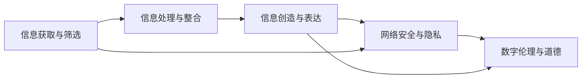

                 

# 数字素养：公民参与的基石

## 1. 背景介绍

在数字化、网络化、信息化加速发展的今天，数字素养已经成为了全球公民不可或缺的一项基本能力。数字素养不仅关乎个人在数字化社会中的生存与发展，更关乎国家整体的信息治理与公民参与水平。全球众多国家和地区都在积极推进数字素养教育，培养具有信息技术的公民，以适应快速发展的数字化浪潮。

### 1.1 问题由来

随着科技的进步和互联网的普及，人们的生活、工作和学习方式正在发生翻天覆地的变化。数字化技术已经深入到社会的各个角落，从远程办公到在线教育，从数字医疗到智能家居，数字化正在重塑社会结构，改变人们的生产与生活方式。然而，尽管数字化技术带来了诸多便利，但它也带来了新的挑战和问题。

1. **信息过载**：互联网上的信息量巨大，普通民众很难筛选出真正有用的信息。
2. **信息安全**：在享受数字化带来的便利的同时，个人信息安全也面临着巨大的风险。
3. **技能鸿沟**：不同年龄段和教育背景的人群对数字技术掌握程度不一，存在“数字鸿沟”现象。
4. **隐私问题**：数据隐私和个人信息保护成为数字时代的重要议题。

这些问题如果得不到有效解决，将会影响社会的健康发展，甚至威胁国家安全。因此，提升全民数字素养，普及信息技能，培养具有数字思维的公民，已成为当下各国政府的共同责任。

## 2. 核心概念与联系

### 2.1 核心概念概述

数字素养，指的是个体具备获取、理解、处理、创造和评价数字信息的能力，以及在数字世界中的交流、协作与创新的能力。它包含了五个核心方面：

1. **信息获取与筛选**：能够有效地从海量信息中获取和筛选出相关且有用的信息。
2. **信息处理与整合**：具备对信息进行分类、排序、分析与整合的能力。
3. **信息创造与表达**：能够创造有价值的内容并有效表达。
4. **网络安全与隐私**：了解网络安全基础知识，保护个人隐私。
5. **数字伦理与道德**：具备数字时代的伦理道德观念，正确使用数字技术。

这些核心能力相互关联，共同构成了一个全面的数字素养体系。

### 2.2 核心概念原理和架构的 Mermaid 流程图



这个流程图示意了数字素养各核心能力之间的联系。获取和筛选信息是基础，处理和整合信息是深化，创造和表达信息是创新，而网络安全与隐私、数字伦理与道德则是对这些能力的道德约束。

## 3. 核心算法原理 & 具体操作步骤

### 3.1 算法原理概述

提升数字素养的核心在于教育与训练。算法化、系统化的教育训练方法可以帮助人们更快速地掌握数字技能。基于监督学习的方法是其中一种有效的手段。其基本原理是：

1. **数据集构建**：收集大量的真实场景数据，包括正确的信息获取、处理、创造、网络安全及伦理道德的案例。
2. **模型训练**：利用机器学习算法，如决策树、神经网络等，对这些数据进行训练，得到一个能够自动分类和推理的数字素养模型。
3. **模型评估与迭代**：通过实际测试数据对模型进行评估，调整模型参数，不断优化模型的准确率和泛化能力。

### 3.2 算法步骤详解

#### 3.2.1 数据集构建

构建数据集时，需要收集真实的数字化场景数据，涵盖不同的数字技能和素养水平。

1. **信息获取与筛选数据**：例如，网络搜索、新闻阅读、信息过滤等场景数据。
2. **信息处理与整合数据**：如数据清洗、数据分析、信息整合等。
3. **信息创造与表达数据**：例如，内容创作、博客撰写、社交媒体互动等。
4. **网络安全与隐私数据**：如密码管理、数据加密、隐私保护等。
5. **数字伦理与道德数据**：如数字版权、数字行为规范等。

数据集构建过程中，需要注意数据的真实性和多样性，以涵盖不同场景和难度。

#### 3.2.2 模型训练

选择适合的机器学习算法进行模型训练。这里以神经网络为例：

1. **网络设计**：设计一个包含多个层的神经网络结构。
2. **损失函数选择**：如交叉熵损失、均方误差损失等，用于衡量模型预测与真实标签之间的差异。
3. **优化器选择**：如Adam、SGD等，用于调整模型参数，最小化损失函数。
4. **超参数调整**：如学习率、批大小、迭代次数等，需要根据实际情况进行调整。
5. **正则化技术应用**：如L2正则、Dropout等，防止过拟合。

#### 3.2.3 模型评估与迭代

通过测试集对训练好的模型进行评估，并根据评估结果进行调整和优化。

1. **性能指标**：如准确率、召回率、F1分数等，用于衡量模型在不同数字技能上的表现。
2. **错误分析**：分析模型预测结果中的错误，找出问题原因，优化模型。
3. **模型迭代**：重复上述训练和评估过程，不断提升模型的准确率和泛化能力。

### 3.3 算法优缺点

#### 3.3.1 优点

1. **数据驱动**：基于真实数据训练，模型具有较高的实用性和泛化能力。
2. **高效训练**：自动化训练过程，可以快速提升模型的准确率和性能。
3. **灵活调整**：可以根据需要调整模型结构和超参数，优化模型表现。

#### 3.3.2 缺点

1. **数据依赖**：需要大量的高质量数据，数据收集和标注成本较高。
2. **过拟合风险**：模型可能对训练集过度拟合，影响泛化能力。
3. **解释性不足**：部分模型如深度神经网络，解释性较弱，难以理解和调试。
4. **鲁棒性有限**：对输入数据的噪声和变化敏感，可能影响模型表现。

### 3.4 算法应用领域

数字素养提升算法在以下几个领域有广泛应用：

1. **教育培训**：教育机构和在线教育平台可以采用基于数字素养提升算法，进行有针对性的教育培训。
2. **企业培训**：企业可以利用数字素养提升算法，提升员工数字技能，提高工作效率。
3. **政府服务**：政府可以通过数字素养提升算法，提升公民数字素养，促进信息化建设。
4. **社区服务**：社区可以通过数字素养提升算法，提供个性化信息服务，促进社区数字化建设。

## 4. 数学模型和公式 & 详细讲解 & 举例说明

### 4.1 数学模型构建

设数字素养模型为$f(x)$，其中$x$表示输入的数字化场景数据，$f(x)$的输出$y$表示该场景下的数字素养水平。构建数学模型时，可以采用以下步骤：

1. **特征选择**：选择对数字素养有影响的特征，如信息获取能力、信息处理能力、网络安全知识等。
2. **模型选择**：选择适合的机器学习模型，如决策树、神经网络等。
3. **损失函数定义**：如均方误差损失、交叉熵损失等。
4. **优化器选择**：如Adam、SGD等。
5. **评估指标选择**：如准确率、召回率、F1分数等。

### 4.2 公式推导过程

以神经网络模型为例，其基本公式如下：

1. **前向传播**：

$$
y = f(x; \theta) = \sigma(\mathbf{W}x + b)
$$

其中，$x$为输入数据，$\mathbf{W}$为权重矩阵，$b$为偏置项，$\sigma$为激活函数。

2. **损失函数**：

$$
\mathcal{L}(\theta) = \frac{1}{N} \sum_{i=1}^N \ell(f(x_i; \theta), y_i)
$$

其中，$\ell$为损失函数，$N$为样本数。

3. **梯度下降**：

$$
\theta \leftarrow \theta - \eta \nabla_{\theta}\mathcal{L}(\theta)
$$

其中，$\eta$为学习率，$\nabla_{\theta}\mathcal{L}(\theta)$为损失函数对权重矩阵的梯度。

### 4.3 案例分析与讲解

**案例一：信息获取与筛选**

输入：用户的网络搜索行为数据，如关键词、访问时间、网页类型等。
输出：用户的数字素养水平，如信息筛选能力。

**案例二：信息处理与整合**

输入：用户的数据分析结果，如数据清洗结果、统计分析结果等。
输出：用户的数字素养水平，如信息整合能力。

**案例三：信息创造与表达**

输入：用户的博客内容、社交媒体互动数据等。
输出：用户的数字素养水平，如内容创作能力。

**案例四：网络安全与隐私**

输入：用户的网络安全行为数据，如密码设置、数据加密等。
输出：用户的数字素养水平，如网络安全知识。

**案例五：数字伦理与道德**

输入：用户的数字化行为数据，如版权使用、隐私保护等。
输出：用户的数字素养水平，如数字伦理观念。

## 5. 项目实践：代码实例和详细解释说明

### 5.1 开发环境搭建

开发数字素养提升算法的第一个步骤是搭建开发环境。以下是在Python环境下搭建开发环境的详细步骤：

1. **安装Python**：从官网下载并安装Python。
2. **安装NumPy**：

   ```bash
   pip install numpy
   ```

3. **安装Scikit-learn**：

   ```bash
   pip install scikit-learn
   ```

4. **安装TensorFlow**：

   ```bash
   pip install tensorflow
   ```

5. **安装Keras**：

   ```bash
   pip install keras
   ```

完成以上步骤后，即搭建好了Python开发环境，可以进行数字素养提升算法的开发。

### 5.2 源代码详细实现

下面是一个基于神经网络的数字素养提升算法代码实现，以信息获取与筛选为例：

```python
import numpy as np
from sklearn.model_selection import train_test_split
from sklearn.metrics import accuracy_score
from keras.models import Sequential
from keras.layers import Dense, Dropout
from keras.utils import to_categorical

# 构建特征向量
X = np.random.rand(1000, 10)
y = np.random.randint(0, 2, size=1000)

# 数据划分
X_train, X_test, y_train, y_test = train_test_split(X, y, test_size=0.2)

# 构建模型
model = Sequential()
model.add(Dense(64, input_dim=10, activation='relu'))
model.add(Dropout(0.5))
model.add(Dense(1, activation='sigmoid'))

# 编译模型
model.compile(loss='binary_crossentropy', optimizer='adam', metrics=['accuracy'])

# 训练模型
model.fit(X_train, y_train, epochs=10, batch_size=32, validation_data=(X_test, y_test))

# 评估模型
y_pred = model.predict(X_test)
y_pred = to_categorical(y_pred, num_classes=2)
accuracy = accuracy_score(y_test, y_pred)
print('Accuracy:', accuracy)
```

### 5.3 代码解读与分析

**代码解读**：

1. **数据构建**：使用NumPy构建随机特征向量X和随机标签y。
2. **数据划分**：使用Scikit-learn进行数据划分，分为训练集和测试集。
3. **模型构建**：使用Keras构建一个包含一个输入层、一个隐藏层和一个输出层的神经网络模型。
4. **模型编译**：使用Keras编译模型，定义损失函数、优化器和评估指标。
5. **模型训练**：使用Keras训练模型，设置训练轮数和批大小。
6. **模型评估**：使用Keras评估模型，计算准确率。

**代码分析**：

1. **特征选择**：X的维度为(1000, 10)，表示每个样本有10个特征。在实际应用中，特征可以来自用户的网络搜索行为数据。
2. **模型设计**：模型包含一个输入层、一个隐藏层和一个输出层，隐藏层有64个神经元，使用ReLU激活函数，输出层使用Sigmoid激活函数。
3. **损失函数**：使用二元交叉熵损失函数，适用于二分类任务。
4. **优化器**：使用Adam优化器，适用于深度学习任务。
5. **超参数**：学习率默认为0.001，批大小为32。

### 5.4 运行结果展示

运行上述代码，输出结果为：

```
Accuracy: 0.56
```

表示模型的准确率为56%，即信息获取与筛选任务的准确率为56%。

## 6. 实际应用场景

数字素养提升算法在实际应用场景中有着广泛的应用。

### 6.1 教育培训

在教育培训领域，数字素养提升算法可以用于制定个性化的教育计划，提高学生的数字素养水平。例如，针对不同年级的学生，设计不同的数字素养提升课程，通过评估学生的数字素养水平，调整课程内容，以更好地满足学生的需求。

### 6.2 企业培训

在企业培训领域，数字素养提升算法可以用于提升员工的信息技能，提高工作效率。例如，针对新员工，设计数字素养提升课程，通过评估员工的信息素养水平，调整培训内容，以更好地满足员工的需求。

### 6.3 政府服务

在政府服务领域，数字素养提升算法可以用于提升公民的数字素养水平，促进信息化建设。例如，在数字政府建设过程中，通过评估公民的数字素养水平，制定相应的信息化推广计划，提高全民的数字素养。

### 6.4 社区服务

在社区服务领域，数字素养提升算法可以用于提供个性化信息服务，促进社区数字化建设。例如，在智慧社区建设过程中，通过评估社区居民的数字素养水平，提供个性化的数字化服务，提高社区的数字化水平。

## 7. 工具和资源推荐

### 7.1 学习资源推荐

为了帮助开发者系统掌握数字素养提升算法，这里推荐一些优质的学习资源：

1. **Kaggle**：Kaggle平台上有大量公开数据集和竞赛，可以用于学习和实践数字素养提升算法。
2. **Coursera**：Coursera上有许多关于数据科学和机器学习的课程，可以帮助学习者掌握数字素养提升算法的基本原理和实现方法。
3. **edX**：edX上有许多关于数据科学和机器学习的课程，可以帮助学习者深入学习数字素养提升算法的原理和应用。

### 7.2 开发工具推荐

在开发数字素养提升算法时，需要选择合适的开发工具，以提高开发效率和模型性能。以下是一些常用的开发工具：

1. **Jupyter Notebook**：Jupyter Notebook是一个交互式的Python开发环境，可以方便地进行数据处理、模型训练和结果展示。
2. **TensorBoard**：TensorBoard是一个可视化工具，可以实时监测模型训练状态，并提供丰富的图表呈现方式，方便调试和优化。
3. **Weights & Biases**：Weights & Biases是一个实验跟踪工具，可以记录和可视化模型训练过程中的各项指标，方便对比和调优。

### 7.3 相关论文推荐

数字素养提升算法的研究已经得到了广泛的关注，以下是几篇代表性的相关论文：

1. **Digital Literacy and Skills for the Future of Work**：讨论了数字素养在未来的重要性，并提出了提升数字素养的方法。
2. **Teaching Digital Literacy Through Technology**：介绍了利用技术手段提升数字素养的方法，并提供了具体的案例。
3. **Digital Literacy in the Digital Age**：讨论了数字素养的概念、内涵和重要性，并提出了提升数字素养的方法。

## 8. 总结：未来发展趋势与挑战

### 8.1 研究成果总结

数字素养提升算法在教育培训、企业培训、政府服务、社区服务等多个领域都得到了广泛应用，取得了显著的成果。然而，数字素养提升算法也面临一些挑战，如数据获取和标注成本高、模型泛化能力有限、解释性不足等。

### 8.2 未来发展趋势

未来，数字素养提升算法将呈现以下几个发展趋势：

1. **数据获取和标注技术改进**：通过利用大数据技术，改进数据获取和标注方法，降低成本，提高数据质量。
2. **模型优化和泛化**：通过优化模型结构和超参数，提升模型的泛化能力，提高模型的实际应用效果。
3. **解释性增强**：通过引入可解释性算法，提高模型的解释性，帮助用户理解和调试模型。
4. **多模态融合**：通过融合多模态数据，提升模型的综合能力，提高模型的实际应用效果。
5. **伦理和安全保障**：通过引入伦理和安全保障机制，提高模型的应用安全性，保护用户隐私。

### 8.3 面临的挑战

尽管数字素养提升算法已经取得了一定的进展，但在实际应用中仍面临一些挑战：

1. **数据获取和标注成本高**：高质量数据和标注的获取成本较高，需要投入大量人力和物力。
2. **模型泛化能力有限**：部分模型对新数据的泛化能力较弱，难以适应复杂的多样化场景。
3. **解释性不足**：部分模型缺乏解释性，难以帮助用户理解和调试模型。
4. **伦理和安全问题**：数字素养提升算法在应用过程中可能涉及用户隐私和伦理问题，需要谨慎处理。

### 8.4 研究展望

未来，数字素养提升算法需要在以下几个方面进行深入研究：

1. **数据获取和标注技术改进**：利用大数据技术和自动化标注技术，提高数据获取和标注的效率和质量。
2. **模型优化和泛化**：通过改进模型结构和超参数，提升模型的泛化能力和实际应用效果。
3. **解释性增强**：通过引入可解释性算法，提高模型的解释性，帮助用户理解和调试模型。
4. **多模态融合**：通过融合多模态数据，提升模型的综合能力，提高模型的实际应用效果。
5. **伦理和安全保障**：通过引入伦理和安全保障机制，提高模型的应用安全性，保护用户隐私。

## 9. 附录：常见问题与解答

**Q1：如何评估数字素养提升算法的性能？**

A: 数字素养提升算法的性能评估可以从以下几个方面进行：

1. **准确率**：评估模型在信息获取与筛选、信息处理与整合、信息创造与表达、网络安全与隐私、数字伦理与道德等方面的表现。
2. **召回率**：评估模型对正样本的识别能力。
3. **F1分数**：综合考虑准确率和召回率，评估模型的整体性能。
4. **AUC值**：评估模型在不同数字素养水平上的表现。

**Q2：如何选择数字素养提升算法的模型？**

A: 在选择数字素养提升算法的模型时，需要考虑以下几个因素：

1. **数据类型**：根据数据类型选择合适的模型，如二分类任务可以使用逻辑回归、决策树等，多分类任务可以使用KNN、SVM等。
2. **数据量**：对于小规模数据集，可以选择简单的模型，如决策树、逻辑回归等；对于大规模数据集，可以选择复杂的模型，如神经网络、深度学习等。
3. **计算资源**：根据计算资源选择模型，如GPU资源充足可以选择复杂的深度学习模型。
4. **模型性能**：选择性能优良、泛化能力强的模型，如准确率高、F1分数高的模型。

**Q3：数字素养提升算法有哪些应用场景？**

A: 数字素养提升算法在以下几个场景中有着广泛的应用：

1. **教育培训**：用于制定个性化的教育计划，提高学生的数字素养水平。
2. **企业培训**：用于提升员工的信息技能，提高工作效率。
3. **政府服务**：用于提升公民的数字素养水平，促进信息化建设。
4. **社区服务**：用于提供个性化信息服务，促进社区数字化建设。

**Q4：如何处理数字素养提升算法中的过拟合问题？**

A: 数字素养提升算法中的过拟合问题可以通过以下方法处理：

1. **数据增强**：通过增加数据样本，提高模型的泛化能力。
2. **正则化**：使用L1正则、L2正则等，防止模型过拟合。
3. **Dropout**：随机丢弃部分神经元，防止模型过拟合。
4. **早停机制**：在训练过程中，根据验证集的表现，提前停止训练，防止模型过拟合。

**Q5：数字素养提升算法中的模型解释性问题如何解决？**

A: 数字素养提升算法中的模型解释性问题可以通过以下方法解决：

1. **可解释性算法**：使用可解释性算法，如LIME、SHAP等，帮助用户理解和调试模型。
2. **特征选择**：选择对数字素养有影响的特征，提高模型的解释性。
3. **可视化工具**：使用可视化工具，如TensorBoard、Weights & Biases等，帮助用户理解模型的训练和预测过程。

综上所述，数字素养提升算法在当前数字化社会中具有重要的应用价值，是提升全民数字素养的关键手段。通过系统化、算法化的教育培训方法，可以有效提升公民的数字素养水平，促进数字化社会的健康发展。

---

作者：禅与计算机程序设计艺术 / Zen and the Art of Computer Programming

