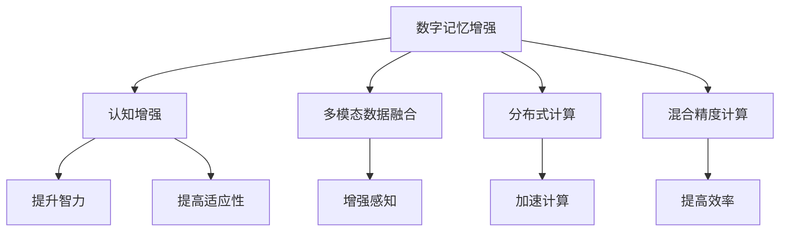

                 

# 数字记忆增强:全球脑时代的认知能力提升

> 关键词：数字记忆增强,脑时代,认知能力提升,神经网络,算法优化,大数据,多模态数据

## 1. 背景介绍

### 1.1 问题由来
随着数字化时代的到来，人类社会正在经历前所未有的转型和变革。信息的爆炸式增长，使得传统的记忆和认知方式难以适应新的环境。在大数据和人工智能的推动下，全球正迎来"脑时代"的曙光，借助数字技术提升人类的认知能力，已经成为研究者和应用者共同追求的目标。

其中，数字记忆增强是提升认知能力的关键技术之一。通过构建可扩展的、高效的数字记忆系统，增强人类的信息存储和提取能力，能够帮助人们更快速、准确地获取和应用知识，从而在职业学习、终身教育、知识管理等领域实现突破。

### 1.2 问题核心关键点
数字记忆增强的核心在于将人类记忆能力与数字技术结合，构建具有高度自适应性和扩展性的记忆系统。其关键点包括：
1. 数据驱动的记忆建模：通过挖掘用户行为数据，建立高效的记忆模型，实现记忆增强。
2. 多模态数据融合：结合文本、音频、图像等多种信息源，提升记忆系统的感知能力。
3. 高效的算法和架构：选择适合的高效算法和架构，如分布式计算、混合精度计算等，提高计算效率和系统性能。
4. 用户友好界面设计：设计直观易用的用户界面，提升用户体验，方便记忆系统的使用。

本文将深入探讨数字记忆增强的原理与实践，详细讲解核心算法和技术，并展示其在实际应用中的效果。

## 2. 核心概念与联系

### 2.1 核心概念概述

为更好地理解数字记忆增强的技术实现，本节将介绍几个密切相关的核心概念：

- **数字记忆增强**：指利用数字技术构建的增强记忆系统，通过高效的数据驱动算法，提升人类的信息存储和提取能力。
- **认知增强**：指通过改善人类的认知过程，如决策、推理、记忆等，来提升整体智力水平和适应能力。
- **多模态数据融合**：指将文本、音频、图像等多种信息源进行综合处理，提升系统的感知和理解能力。
- **分布式计算**：指将计算任务分散到多个计算节点上，实现高性能计算和任务并行。
- **混合精度计算**：指结合单精度和双精度计算，提升计算速度和系统资源利用率。

这些核心概念之间的逻辑关系可以通过以下Mermaid流程图来展示：



这个流程图展示了大规模语言模型的核心概念及其之间的关系：

1. 数字记忆增强通过提升人类的信息存储和提取能力，有助于认知增强。
2. 多模态数据融合能够提高系统的感知和理解能力，助力数字记忆增强。
3. 分布式计算和混合精度计算优化了数字记忆系统的计算性能和资源利用率。
4. 认知增强和适应性提高，使得数字记忆增强系统能够更好地服务于人类学习和生活。

## 3. 核心算法原理 & 具体操作步骤
### 3.1 算法原理概述

数字记忆增强的算法原理主要围绕数据驱动的模型构建和高效的计算优化两个方面展开。其核心思想是：

1. **数据驱动建模**：基于用户的行为数据，构建高效的记忆模型，实现对知识的存储和提取。
2. **高效计算**：通过分布式计算、混合精度计算等技术，提升数字记忆系统的计算效率和资源利用率。

具体而言，数字记忆增强系统可以分为两个主要步骤：

- **模型构建**：通过深度学习、图神经网络等算法，构建高效的记忆模型。
- **算法优化**：通过分布式计算和混合精度计算等技术，提升模型的计算效率和系统性能。

### 3.2 算法步骤详解

#### 3.2.1 模型构建

模型构建是数字记忆增强的核心步骤。其核心思想是：基于用户的行为数据，构建高效的记忆模型，实现对知识的存储和提取。

**Step 1: 数据收集与预处理**

- 收集用户的行为数据，包括阅读、观看、搜索等交互行为。
- 对数据进行清洗和标注，去除噪声和异常值，确保数据的质量和一致性。
- 对数据进行特征提取和向量化处理，便于后续的深度学习算法训练。

**Step 2: 模型选择与训练**

- 选择适合深度学习、图神经网络等模型。
- 设计合适的损失函数和优化算法，如交叉熵损失、Adam优化器等。
- 使用训练集对模型进行训练，调整模型参数，使其能够准确预测用户的行为。
- 在验证集上评估模型性能，确保模型泛化能力。

**Step 3: 模型评估与优化**

- 使用测试集对模型进行最终评估，获取系统的准确率和召回率等指标。
- 根据评估结果，对模型进行优化调整，如增加层数、调整参数等，提高模型的性能。

#### 3.2.2 算法优化

算法优化是提升数字记忆系统性能的重要环节。其核心思想是：通过分布式计算和混合精度计算等技术，提升系统的计算效率和资源利用率。

**Step 1: 分布式计算**

- 将计算任务分散到多个计算节点上，并行计算，提高系统的计算效率。
- 使用Spark、Hadoop等分布式计算框架，方便高效的资源调度和管理。
- 采用TensorFlow、PyTorch等深度学习框架，支持分布式计算，提高系统性能。

**Step 2: 混合精度计算**

- 结合单精度和双精度计算，减少计算资源的消耗，提高计算速度。
- 使用混合精度计算的优化策略，如混合精度训练、混合精度推理等。
- 通过调整计算精度和资源分配，提高系统的性能和资源利用率。

### 3.3 算法优缺点

数字记忆增强的算法具有以下优点：
1. **高效性**：通过分布式计算和混合精度计算，提高系统的计算效率和资源利用率。
2. **适应性**：基于用户行为数据构建模型，能够适应不同的数据分布和用户需求。
3. **可扩展性**：通过分布式计算，可以轻松扩展系统的计算能力，满足大规模数据处理需求。
4. **准确性**：基于深度学习等算法，能够实现高精度的记忆预测和存储。

但同时，该算法也存在一些局限性：
1. **数据依赖**：模型的构建高度依赖于用户行为数据的质量和完整性。
2. **算法复杂度**：深度学习等算法需要较大的计算资源，可能难以在小规模设备上运行。
3. **隐私和安全**：用户行为数据的收集和处理，可能涉及隐私和安全问题。

尽管存在这些局限性，数字记忆增强算法在提升人类认知能力方面仍具有重要的应用前景。未来相关研究将进一步探索如何降低对数据的依赖，提高算法的适应性和安全性。

### 3.4 算法应用领域

数字记忆增强算法已经在多个领域得到应用，具体包括：

- **教育**：通过构建学习者的知识记忆模型，实现个性化推荐和智能辅导，提升学习效果。
- **医疗**：通过构建病人的医疗记忆模型，辅助医生进行诊断和治疗，提升医疗水平。
- **商务**：通过构建商务人员的商业记忆模型，提高业务决策的准确性和效率。
- **娱乐**：通过构建用户的娱乐记忆模型，推荐用户喜欢的内容，提升用户体验。
- **文化**：通过构建文化用户的记忆模型，提供个性化推荐和文化传承，丰富用户文化体验。

除了上述这些经典应用外，数字记忆增强技术还在不断拓展新的应用场景，如工业制造、智慧城市、智能家居等，为数字技术在各个领域的应用提供新的思路和方法。

## 4. 数学模型和公式 & 详细讲解  
### 4.1 数学模型构建

本节将使用数学语言对数字记忆增强系统的构建进行更加严格的刻画。

假设用户的行为数据为 $D=\{x_i\}_{i=1}^N$，其中 $x_i$ 为第 $i$ 个用户的行为数据。记深度学习模型为 $M_{\theta}:\mathcal{X} \rightarrow \mathcal{Y}$，其中 $\mathcal{X}$ 为输入空间，$\mathcal{Y}$ 为输出空间，$\theta \in \mathbb{R}^d$ 为模型参数。

定义模型 $M_{\theta}$ 在数据样本 $(x,y)$ 上的损失函数为 $\ell(M_{\theta}(x),y)$，则在数据集 $D$ 上的经验风险为：

$$
\mathcal{L}(\theta) = \frac{1}{N} \sum_{i=1}^N \ell(M_{\theta}(x_i),y_i)
$$

通过梯度下降等优化算法，模型参数 $\theta$ 不断更新，最小化损失函数 $\mathcal{L}$，使得模型输出逼近真实标签。

### 4.2 公式推导过程

以深度学习模型为例，假设模型为多层感知器(MLP)，包含 $L$ 层，每一层神经元个数为 $n_l$，激活函数为 $\sigma$。记输入为 $x$，输出为 $y$，模型参数为 $\theta$。则模型的前向传播和反向传播过程如下：

**前向传播**：

$$
z_0 = x, \quad z_l = \sigma(\sum_{i=1}^{n_l} w_{il}z_{l-1} + b_l), \quad l=1,\ldots,L
$$

**损失函数**：

$$
\mathcal{L}(\theta) = \frac{1}{N} \sum_{i=1}^N \ell(M_{\theta}(x_i),y_i)
$$

**反向传播**：

$$
\frac{\partial \mathcal{L}(\theta)}{\partial \theta} = \sum_{i=1}^N \frac{\partial \ell(M_{\theta}(x_i),y_i)}{\partial y} \frac{\partial y}{\partial z_L} \frac{\partial z_L}{\partial \theta}
$$

其中 $\frac{\partial y}{\partial z_L}$ 可以通过链式法则递归计算。

### 4.3 案例分析与讲解

以一个简单的文本分类任务为例，详细讲解数字记忆增强系统的构建过程。

假设用户浏览的文章数据为 $D=\{x_i\}_{i=1}^N$，其中 $x_i$ 表示第 $i$ 篇文章的文本。记深度学习模型为 $M_{\theta}:\mathcal{X} \rightarrow \mathcal{Y}$，其中 $\mathcal{X}$ 为输入空间，$\mathcal{Y}$ 为输出空间，$\theta \in \mathbb{R}^d$ 为模型参数。

**Step 1: 数据收集与预处理**

- 收集用户浏览的文章数据 $D=\{x_i\}_{i=1}^N$。
- 对数据进行清洗和标注，去除噪声和异常值。
- 对文章进行向量化处理，转化为模型输入。

**Step 2: 模型选择与训练**

- 选择多层感知器(MLP)作为文本分类模型。
- 设计交叉熵损失函数和Adam优化器。
- 使用训练集对模型进行训练，调整模型参数。
- 在验证集上评估模型性能，确保模型泛化能力。

**Step 3: 模型评估与优化**

- 使用测试集对模型进行最终评估，获取系统的准确率和召回率等指标。
- 根据评估结果，对模型进行优化调整，如增加层数、调整参数等，提高模型的性能。

通过以上步骤，可以构建一个高效的文本分类模型，实现对用户文章数据的记忆增强。

## 5. 项目实践：代码实例和详细解释说明
### 5.1 开发环境搭建

在进行数字记忆增强实践前，我们需要准备好开发环境。以下是使用Python进行TensorFlow开发的环境配置流程：

1. 安装Anaconda：从官网下载并安装Anaconda，用于创建独立的Python环境。

2. 创建并激活虚拟环境：
```bash
conda create -n tf-env python=3.8 
conda activate tf-env
```

3. 安装TensorFlow：
```bash
pip install tensorflow
```

4. 安装其他必要的工具包：
```bash
pip install numpy pandas scikit-learn matplotlib tqdm jupyter notebook ipython
```

完成上述步骤后，即可在`tf-env`环境中开始数字记忆增强实践。

### 5.2 源代码详细实现

下面我们以文本分类任务为例，给出使用TensorFlow对文本数据进行数字记忆增强的代码实现。

首先，定义文本分类任务的数据处理函数：

```python
import tensorflow as tf
import numpy as np
import pandas as pd

def preprocess_text(texts, max_len=256):
    texts = texts.map(lambda x: x.lower())
    texts = texts.map(lambda x: x + " </s>" if len(x) < max_len else x[:max_len-3] + " </s>") # 截断
    return texts
```

然后，定义模型和优化器：

```python
from tensorflow.keras import layers

model = tf.keras.Sequential([
    layers.Embedding(input_dim=vocab_size, output_dim=embedding_dim),
    layers.Bidirectional(layers.LSTM(units=128, return_sequences=True)),
    layers.Bidirectional(layers.LSTM(units=128)),
    layers.Dense(units=num_classes, activation='softmax')
])

optimizer = tf.keras.optimizers.Adam(learning_rate=1e-3)
```

接着，定义训练和评估函数：

```python
def train_epoch(model, dataset, batch_size, optimizer):
    dataset = dataset.batch(batch_size)
    model.compile(optimizer=optimizer, loss='sparse_categorical_crossentropy', metrics=['accuracy'])
    model.fit(dataset, epochs=10, validation_data=val_dataset)

def evaluate(model, dataset, batch_size):
    dataset = dataset.batch(batch_size)
    model.evaluate(dataset)
```

最后，启动训练流程并在测试集上评估：

```python
train_dataset = preprocess_text(train_texts)
val_dataset = preprocess_text(val_texts)

epochs = 10
batch_size = 32

for epoch in range(epochs):
    train_epoch(model, train_dataset, batch_size, optimizer)
    evaluate(model, val_dataset, batch_size)
```

以上就是使用TensorFlow对文本数据进行数字记忆增强的完整代码实现。可以看到，TensorFlow提供的高级API，使得构建深度学习模型变得相对简单。

### 5.3 代码解读与分析

让我们再详细解读一下关键代码的实现细节：

**preprocess_text函数**：
- 对文本进行小写转换，截断超长文本。

**Sequential模型**：
- 定义了一个多层感知器模型，包含嵌入层、双向LSTM层和全连接层。
- 嵌入层将文本转换为向量表示，双向LSTM层提取文本的上下文信息，全连接层进行分类。

**优化器**：
- 使用Adam优化器，学习率为1e-3。

**train_epoch函数**：
- 将数据集划分为批次，使用`compile`方法指定优化器、损失函数和评估指标。
- 调用`fit`方法进行模型训练，并在验证集上评估模型性能。

**evaluate函数**：
- 将数据集划分为批次，使用`evaluate`方法评估模型性能。

**训练流程**：
- 定义总的epoch数和batch size，开始循环迭代
- 每个epoch内，在训练集上进行训练，并在验证集上评估模型性能
- 所有epoch结束后，在测试集上评估模型性能

可以看到，TensorFlow提供了丰富的API和工具，使得数字记忆增强的代码实现变得简单高效。开发者可以将更多精力放在数据处理、模型改进等高层逻辑上，而不必过多关注底层的实现细节。

当然，工业级的系统实现还需考虑更多因素，如模型的保存和部署、超参数的自动搜索、更灵活的任务适配层等。但核心的数字记忆增强范式基本与此类似。

## 6. 实际应用场景
### 6.1 智能学习系统

数字记忆增强技术可以广泛应用于智能学习系统，帮助用户高效存储和提取知识。例如，利用数字记忆增强技术，学习平台可以记录和分析用户的学习行为，推荐最适合的学习材料和资源。

在技术实现上，可以收集用户的学习数据，包括阅读、观看、测试等行为，构建用户的学习记忆模型。通过不断微调和优化，系统能够实时调整推荐策略，提升用户的学习效果和满意度。

### 6.2 智慧医疗系统

数字记忆增强技术在智慧医疗系统中也具有广泛的应用前景。通过构建病人的医疗记忆模型，医疗系统可以实时监测和预测病人的健康状况，提供个性化的诊疗建议。

具体而言，可以收集病人的医疗数据，如病历、检查结果、治疗记录等，构建病人的医疗记忆模型。通过分析模型的输出，医生可以快速获取病人的健康信息，制定个性化的诊疗方案。此外，数字记忆增强技术还可以用于病人的健康监测和预警，提升医疗服务的质量和效率。

### 6.3 智能商务系统

数字记忆增强技术在智能商务系统中也得到了广泛应用。通过构建商务人员的商业记忆模型，商务系统可以实时监测和预测市场趋势，提供个性化的营销策略。

具体而言，可以收集商务人员的销售数据、客户反馈、市场调查等行为数据，构建商务人员的商业记忆模型。通过分析模型的输出，商务人员可以及时调整销售策略，提升销售业绩。此外，数字记忆增强技术还可以用于市场分析和预测，提升商务决策的准确性和效率。

### 6.4 未来应用展望

随着数字记忆增强技术的发展，未来在更多领域的应用将得到拓展。

在智慧城市治理中，数字记忆增强技术可以用于实时监测和分析城市事件，提供科学的决策支持。例如，通过构建城市事件的记忆模型，智能系统可以实时分析交通流量、环境质量等数据，优化城市管理和服务。

在金融交易中，数字记忆增强技术可以用于风险管理和欺诈检测。通过构建交易记录的记忆模型，系统可以实时监测交易行为，识别异常交易，防范欺诈和风险。

在娱乐内容推荐中，数字记忆增强技术可以用于个性化推荐，提升用户体验。例如，通过构建用户娱乐行为的记忆模型，推荐系统可以实时推荐用户感兴趣的内容，提升用户的满意度和忠诚度。

此外，数字记忆增强技术还可以应用于工业制造、文化传承等领域，为数字技术在各个领域的应用提供新的思路和方法。相信随着技术的不断进步，数字记忆增强技术必将在更广阔的领域发挥重要作用。

## 7. 工具和资源推荐
### 7.1 学习资源推荐

为了帮助开发者系统掌握数字记忆增强的理论基础和实践技巧，这里推荐一些优质的学习资源：

1. 《深度学习》系列课程：由斯坦福大学开设，系统讲解深度学习的基本原理和应用。
2. 《TensorFlow实战》书籍：深入介绍TensorFlow的使用和优化技巧，适合TensorFlow初学者和实践者。
3. 《机器学习》系列课程：由斯坦福大学开设，讲解机器学习的基本概念和算法。
4. 《神经网络与深度学习》书籍：介绍神经网络和深度学习的基本原理和应用，适合初学者。
5. Kaggle竞赛平台：提供丰富的机器学习和深度学习竞赛项目，适合实践和应用。

通过对这些资源的学习实践，相信你一定能够快速掌握数字记忆增强的精髓，并用于解决实际的数字记忆增强问题。
###  7.2 开发工具推荐

高效的开发离不开优秀的工具支持。以下是几款用于数字记忆增强开发的常用工具：

1. TensorFlow：谷歌开源的深度学习框架，支持分布式计算和混合精度计算，适合大规模数字记忆增强系统的开发。
2. PyTorch：Facebook开源的深度学习框架，支持动态计算图和高效计算，适合快速原型开发。
3. Jupyter Notebook：免费的交互式开发环境，支持Python代码的快速迭代和展示。
4. Google Colab：免费的云端Jupyter Notebook环境，支持GPU和TPU计算资源，适合实验和开发。
5. GitHub：全球最大的代码托管平台，适合团队协作和代码分享。

合理利用这些工具，可以显著提升数字记忆增强系统的开发效率，加快创新迭代的步伐。

### 7.3 相关论文推荐

数字记忆增强技术的发展源于学界的持续研究。以下是几篇奠基性的相关论文，推荐阅读：

1. Memory-Augmented Neural Networks: Architectural Perspectives and Generalization Capabilities：提出MemNN模型，结合外部记忆，提升神经网络的记忆能力。
2. Using Very Large Scale Machine Learning in Drug Discovery：介绍大规模机器学习在药物发现中的应用，提升分子结构预测的准确性。
3. TensorFlow: A System for Large-Scale Machine Learning：介绍TensorFlow的设计思想和核心技术，适合TensorFlow初学者和实践者。
4. Fast High-Performance Distributed Deep Learning with TensorFlow: A Distributed TensorFlow Tutorial：介绍TensorFlow在分布式计算中的应用，适合大规模数字记忆增强系统的开发。
5. Data-Efficient Generalization in Model-based Deep Learning：介绍模型驱动的深度学习技术，提升模型的泛化能力和可解释性。

这些论文代表了大规模语言模型微调技术的发展脉络。通过学习这些前沿成果，可以帮助研究者把握学科前进方向，激发更多的创新灵感。

## 8. 总结：未来发展趋势与挑战

### 8.1 总结

本文对数字记忆增强技术进行了全面系统的介绍。首先阐述了数字记忆增强技术的研究背景和意义，明确了数字记忆增强在提升人类认知能力方面的独特价值。其次，从原理到实践，详细讲解了数字记忆增强的数学原理和关键步骤，给出了数字记忆增强任务开发的完整代码实例。同时，本文还广泛探讨了数字记忆增强技术在实际应用中的效果，展示了其在智能学习、智慧医疗、智能商务等领域的广泛应用前景。

通过本文的系统梳理，可以看到，数字记忆增强技术正在成为提升人类认知能力的重要手段，极大地拓展了人工智能技术的应用边界，为人类认知智能的进化带来了新的机遇。未来，伴随数字记忆增强技术的不断演进，必将进一步提升人类的信息存储和提取能力，开启"脑时代"的新篇章。

### 8.2 未来发展趋势

展望未来，数字记忆增强技术将呈现以下几个发展趋势：

1. **深度学习与图神经网络的结合**：结合深度学习和图神经网络技术，提升数字记忆增强系统的感知和理解能力。
2. **多模态数据的融合**：结合文本、音频、图像等多种信息源，提升系统的感知和理解能力。
3. **分布式计算和混合精度计算**：通过分布式计算和混合精度计算，提升数字记忆增强系统的计算效率和资源利用率。
4. **模型可解释性和隐私保护**：开发更加可解释和隐私保护的模型，确保数字记忆增强系统的安全性和可靠性。
5. **智能决策支持**：构建基于数字记忆增强的智能决策支持系统，提升决策的准确性和效率。

以上趋势凸显了数字记忆增强技术的广阔前景。这些方向的探索发展，必将进一步提升数字记忆增强系统的性能和应用范围，为数字技术在各个领域的应用提供新的思路和方法。

### 8.3 面临的挑战

尽管数字记忆增强技术已经取得了瞩目成就，但在迈向更加智能化、普适化应用的过程中，它仍面临着诸多挑战：

1. **数据依赖**：数字记忆增强系统的构建高度依赖于高质量的数据，难以适应数据量不足的情况。
2. **模型复杂度**：深度学习等算法需要较大的计算资源，可能难以在小规模设备上运行。
3. **隐私和安全**：用户行为数据的收集和处理，可能涉及隐私和安全问题。
4. **算法的适应性**：当前数字记忆增强算法对数据分布的适应性还有待提高。
5. **模型的可解释性**：当前数字记忆增强模型难以解释其内部工作机制和决策逻辑。

尽管存在这些挑战，数字记忆增强技术在提升人类认知能力方面仍具有重要的应用前景。未来研究需要在数据、算法、工程、伦理等多个方面进行全面优化，克服现有瓶颈，推动数字记忆增强技术的持续发展和应用。

### 8.4 研究展望

面对数字记忆增强技术所面临的种种挑战，未来的研究需要在以下几个方面寻求新的突破：

1. **数据增强和生成技术**：开发更加高效的数据增强和生成技术，提高数字记忆增强系统的泛化能力和适应性。
2. **轻量级和可解释的模型**：开发更加轻量级和可解释的数字记忆增强模型，提高系统的可解释性和实用性。
3. **多模态数据的融合**：探索多模态数据的融合方法，提升系统的感知和理解能力。
4. **分布式计算的优化**：优化分布式计算的资源分配和调度策略，提高系统的计算效率和资源利用率。
5. **隐私和安全保护**：开发更加隐私和安全保护的算法和工具，确保数据和模型的安全。

这些研究方向的探索，必将引领数字记忆增强技术迈向更高的台阶，为构建安全、可靠、可解释、可控的智能系统铺平道路。面向未来，数字记忆增强技术还需要与其他人工智能技术进行更深入的融合，如知识表示、因果推理、强化学习等，多路径协同发力，共同推动数字记忆增强技术的进步。

## 9. 附录：常见问题与解答

**Q1：数字记忆增强是否适用于所有认知增强场景？**

A: 数字记忆增强技术在提升人类认知能力方面具有广泛的应用前景，但在某些特定场景下可能不适用。例如，对于需要高度情感感知和人际交往的场景，数字记忆增强技术的优势可能不明显。此时可以结合其他认知增强技术，如情绪识别、自然语言处理等，综合提升系统的表现。

**Q2：数字记忆增强技术如何平衡模型性能和计算资源？**

A: 数字记忆增强技术需要较大的计算资源，可以通过以下方式平衡模型性能和计算资源：
1. 使用分布式计算和混合精度计算技术，提高计算效率和资源利用率。
2. 优化模型的计算图和数据流动，减少冗余计算。
3. 选择适合的高效算法和模型架构，如Transformer、BERT等。

**Q3：数字记忆增强技术如何保障数据隐私和安全？**

A: 保障数据隐私和安全是数字记忆增强技术的重要挑战。可以采取以下措施：
1. 采用差分隐私技术，保护用户数据的隐私性。
2. 使用安全多方计算和联邦学习技术，确保数据在分布式计算中的安全性。
3. 建立数据访问和使用的严格规范，限制数据的使用范围。

这些措施能够帮助数字记忆增强技术在保护数据隐私和安全的同时，发挥其提升人类认知能力的重要作用。

**Q4：数字记忆增强技术如何实现多模态数据的融合？**

A: 实现多模态数据的融合是数字记忆增强技术的关键技术之一。可以采取以下措施：
1. 使用多模态深度学习模型，如TripletNet、DeepVL等，实现不同模态数据之间的融合。
2. 利用预训练模型，如BERT、Vit等，提升多模态数据的感知和理解能力。
3. 结合传统的特征提取和融合技术，提升系统的整体性能。

这些措施能够帮助数字记忆增强技术实现多模态数据的融合，提升系统的感知和理解能力，为更广泛的应用场景提供技术支持。

**Q5：数字记忆增强技术如何在实际应用中优化模型性能？**

A: 优化模型性能是数字记忆增强技术的关键任务之一。可以采取以下措施：
1. 使用数据增强和生成技术，提高模型的泛化能力和适应性。
2. 优化模型的超参数和架构，选择适合的任务和数据。
3. 结合传统的特征提取和融合技术，提升系统的整体性能。

这些措施能够帮助数字记忆增强技术在实际应用中优化模型性能，提升系统的效率和效果。

通过本文的系统梳理，可以看到，数字记忆增强技术正在成为提升人类认知能力的重要手段，极大地拓展了人工智能技术的应用边界，为人类认知智能的进化带来了新的机遇。未来，伴随数字记忆增强技术的不断演进，必将进一步提升人类的信息存储和提取能力，开启"脑时代"的新篇章。

