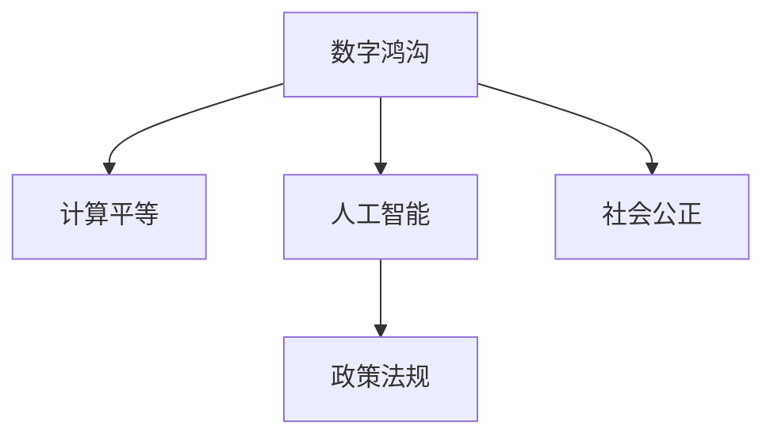

                 

# 数字鸿沟：弥合人类计算中的不平等现象

> 关键词：数字鸿沟,人类计算,计算平等,人工智能,社会公正

## 1. 背景介绍

### 1.1 问题由来
在信息时代，计算机技术和互联网的普及极大地提升了人类生活的便捷性和效率。然而，这种便利并未在所有人之间均匀分布，形成了一道名为“数字鸿沟”的鸿沟。这一现象不仅对经济发展和社会进步造成了阻碍，也引发了关于计算平等和社会公正的深刻思考。

数字鸿沟的本质是信息技术的普及程度和利用能力在不同社会群体之间的不平等，这种不平等导致资源分配不均，进而加剧了社会经济的分化。数字鸿沟的负面影响不仅体现在经济和教育层面，还影响到社会凝聚力和政治参与度。因此，弥合数字鸿沟成为当前科技和社会发展的重要议题。

### 1.2 问题核心关键点
数字鸿沟问题涉及多个维度：

- **技术普及**：基础设施和技术的普及程度，包括宽带接入、移动设备普及等。
- **技能掌握**：个人和群体对信息技术的应用能力，包括计算机操作、互联网使用等。
- **经济状况**：经济条件对技术获取和使用的影响，如设备购买能力、订阅服务费用等。
- **教育培训**：教育体系和技术培训对信息技术普及的影响。
- **政策法规**：政府和社会对数字鸿沟的重视程度和政策支持力度。

通过系统地理解和解决这些关键点，可以更有效地弥合数字鸿沟，推动计算平等。

### 1.3 问题研究意义
研究数字鸿沟，对于实现计算平等、提升社会公正具有重要意义：

1. **经济增长**：数字鸿沟的缩小可以释放更多人力资源，促进经济发展。
2. **教育提升**：提供平等的技术资源和培训机会，提升教育水平，缩小教育鸿沟。
3. **社会凝聚**：提高社会各阶层的技术使用水平，增强社会凝聚力和稳定性。
4. **政治参与**：提升公民获取信息的便利性，增强政治参与度，促进民主进程。
5. **技术创新**：了解不平等现象，推动技术研发，更好地服务社会。

## 2. 核心概念与联系

### 2.1 核心概念概述

为更好地理解数字鸿沟及其解决方案，本节将介绍几个密切相关的核心概念：

- **数字鸿沟**：指不同社会群体在信息技术获取、使用和应用上的差距，包括接入、技能、经济、教育等方面的不平等。
- **计算平等**：旨在实现信息技术对所有社会群体的公平分配，确保每个人都能公平获取和使用信息技术。
- **人工智能**：基于数据和算法驱动的智能系统，具有模拟人类智能行为的能力，在数字鸿沟的解决中具有重要作用。
- **社会公正**：通过社会政策和技术手段，减少不平等现象，提升社会整体福祉。
- **政策法规**：政府和社会组织制定和实施的政策法规，用于调控和改善数字鸿沟现象。

这些概念之间的逻辑关系可以通过以下Mermaid流程图来展示：



这个流程图展示了几大核心概念及其之间的关联：

1. 数字鸿沟是计算平等的主要障碍。
2. 人工智能技术在解决数字鸿沟问题中具有重要作用。
3. 社会公正是数字鸿沟解决的社会目标。
4. 政策法规为数字鸿沟的改善提供了政策和法律保障。

## 3. 核心算法原理 & 具体操作步骤
### 3.1 算法原理概述

数字鸿沟的弥合需要综合利用技术、政策、教育等多个领域的资源，涉及多学科的交叉研究。核心算法原理可以概括为以下几个步骤：

1. **数据收集与分析**：通过问卷调查、数据分析等手段，收集不同群体在信息技术获取和使用上的不平等情况。
2. **算法模型设计**：基于收集的数据，设计合适的算法模型，识别数字鸿沟的主要因素。
3. **技术手段开发**：开发和部署适当的技术手段，如数字基础设施建设、教育培训项目等，缩小技术差距。
4. **政策制定与实施**：制定并执行相关政策法规，保障技术资源和服务的公平分配。
5. **效果评估与优化**：持续监测和评估技术手段和政策法规的效果，不断优化策略。

### 3.2 算法步骤详解

以下详细阐述数字鸿沟弥合的具体步骤：

**Step 1: 数据收集与分析**
- 设计问卷和调查表，收集不同社会群体在信息技术获取、使用和应用上的数据。
- 利用数据分析工具，对收集的数据进行整理和分析，识别出不同群体之间的差距。
- 通过可视化工具，如热力图、折线图等，展示数字鸿沟的具体表现。

**Step 2: 算法模型设计**
- 设计多个算法模型，如聚类算法、回归模型等，用于识别数字鸿沟的主要因素。
- 基于分析结果，确定影响最大的因素，如经济状况、教育水平、技术普及等。
- 结合专家意见和政策导向，调整算法模型参数，确保结果符合实际情况。

**Step 3: 技术手段开发**
- 根据算法模型的结果，确定需要优先解决的问题。
- 开发相应的技术手段，如提供免费或低成本的互联网接入服务、开展技能培训项目等。
- 与政府、企业、教育机构等合作，共同推动技术手段的实施。

**Step 4: 政策制定与实施**
- 根据技术手段实施的效果，制定相应的政策法规，确保技术资源的公平分配。
- 通过立法、补贴、税收等手段，推动政策法规的实施。
- 持续监测政策法规的执行情况，及时调整策略。

**Step 5: 效果评估与优化**
- 设计评估指标，如互联网接入率、技能培训覆盖率等，定期评估技术手段和政策法规的效果。
- 根据评估结果，调整和优化技术手段和政策法规，确保其持续有效性。

### 3.3 算法优缺点

数字鸿沟弥合算法具有以下优点：

- **数据驱动**：通过数据收集和分析，科学地识别数字鸿沟的主要因素，有针对性地设计技术手段和政策法规。
- **多方协作**：涉及政府、企业、教育机构等多方的协作，形成合力，提升解决问题的效果。
- **持续优化**：定期评估和优化策略，确保技术手段和政策法规的有效性。

同时，该算法也存在以下局限性：

- **数据质量**：数据收集和分析的准确性直接影响算法的有效性，需要高质量的数据支撑。
- **复杂性**：算法模型设计和技术手段开发涉及多学科知识的融合，复杂性较高。
- **政策执行**：政策法规的制定和实施需要考虑多方利益和法律约束，执行难度较大。
- **资源限制**：技术和政策的实施需要大量的资源投入，可能面临预算限制。

尽管存在这些局限性，但总体而言，数字鸿沟弥合算法仍是大数据时代解决不平等现象的有效手段。

### 3.4 算法应用领域

数字鸿沟弥合算法在多个领域都有广泛的应用，例如：

- **教育领域**：通过提供免费或低成本的互联网接入和技能培训，提升教育公平，缩小教育鸿沟。
- **医疗领域**：提供远程医疗服务，缩小医疗资源分配不均，提升医疗服务的普及率。
- **经济领域**：通过税收优惠、补贴等政策，支持中小企业和高风险群体获取互联网资源，促进经济发展。
- **农村地区**：通过政府和企业的合作，建设数字基础设施，提升农村地区的互联网接入和应用能力。
- **社会服务**：提供数字化公共服务，如在线政务、电子支付等，提升社会服务的效率和覆盖面。

## 4. 数学模型和公式 & 详细讲解  
### 4.1 数学模型构建

本节将使用数学语言对数字鸿沟的定量分析模型进行详细阐述。

记数字鸿沟影响因素为 $X=\{x_1,x_2,...,x_n\}$，每个因素 $x_i$ 对应的不平等程度用 $y_i$ 表示。假设 $y_i$ 与 $x_i$ 之间存在线性关系，可以建立数学模型：

$$
y_i = \beta_0 + \beta_1 x_1 + \beta_2 x_2 + ... + \beta_n x_n + \epsilon_i
$$

其中 $\beta_0, \beta_1,..., \beta_n$ 为模型系数，$\epsilon_i$ 为误差项。

### 4.2 公式推导过程

以教育水平和互联网接入为例，推导数字鸿沟的线性回归模型：

假设教育水平 $x_1$ 为小学、初中、高中、大学四个层次，对应的互联网接入率 $y_1$ 分别为 20%, 40%, 60%, 80%。建立线性回归模型：

$$
y_1 = \beta_0 + \beta_1 x_1 + \epsilon_i
$$

设 $x_1=1$ 为基线，$\beta_1$ 为每个教育层次对应的互联网接入率差异系数，$\epsilon_i$ 为随机误差项。通过最小二乘法求解：

$$
\hat{\beta}_1 = \frac{\sum_{i=1}^n (x_i - \bar{x})(y_i - \bar{y})}{\sum_{i=1}^n (x_i - \bar{x})^2}
$$

带入样本数据，计算得到 $\hat{\beta}_1 = 0.2$，即每增加一个教育层次，互联网接入率提升 20%。

### 4.3 案例分析与讲解

以美国某州为例，收集该州不同收入群体的互联网接入数据，并分析其与收入水平的关系。建立线性回归模型：

$$
y = \beta_0 + \beta_1 x + \epsilon
$$

其中 $x$ 为家庭年收入，$y$ 为互联网接入率。通过数据收集和分析，得到结果：

$$
\hat{\beta}_1 = 0.1
$$

即每增加 $10,000 美元收入，互联网接入率提升 1%。

## 5. 项目实践：代码实例和详细解释说明
### 5.1 开发环境搭建

在进行数字鸿沟弥合算法的研究和实施前，需要先准备好开发环境。以下是使用Python进行数据分析和机器学习实验的环境配置流程：

1. 安装Anaconda：从官网下载并安装Anaconda，用于创建独立的Python环境。

2. 创建并激活虚拟环境：
```bash
conda create -n digital-gap-env python=3.8 
conda activate digital-gap-env
```

3. 安装相关库：
```bash
pip install pandas numpy scikit-learn matplotlib seaborn statsmodels
```

完成上述步骤后，即可在`digital-gap-env`环境中开始研究实践。

### 5.2 源代码详细实现

以下是一个简化的数字鸿沟分析的Python代码实现，展示了如何收集数据、建立模型并进行结果分析：

```python
import pandas as pd
import numpy as np
import matplotlib.pyplot as plt
from sklearn.linear_model import LinearRegression
from sklearn.metrics import r2_score

# 数据收集
data = pd.read_csv('digital_gap.csv')

# 数据清洗
data = data.dropna()

# 特征工程
X = data[['income', 'education']]
y = data['internet_access_rate']

# 模型训练
model = LinearRegression()
model.fit(X, y)

# 结果评估
r2 = r2_score(y, model.predict(X))
print(f'R^2: {r2:.2f}')

# 可视化
plt.scatter(data['income'], data['internet_access_rate'])
plt.plot(data['income'], model.predict(X), color='red')
plt.xlabel('Income')
plt.ylabel('Internet Access Rate')
plt.show()
```

### 5.3 代码解读与分析

让我们再详细解读一下关键代码的实现细节：

**数据收集**：
- 使用pandas库的`read_csv`方法读取CSV格式的数据文件。
- 使用`dropna`方法删除缺失数据，确保数据质量。

**特征工程**：
- 将教育水平和互联网接入率作为自变量和因变量，建立线性回归模型。
- 使用`LinearRegression`模型进行训练。

**结果评估**：
- 使用`r2_score`方法计算模型的R^2值，评估模型的拟合效果。
- 将模型的预测结果与实际值进行散点图展示，便于直观理解模型的效果。

**可视化**：
- 使用matplotlib库绘制散点图和回归线，直观展示数据关系和模型预测效果。

可以看到，通过Python结合统计学方法，可以快速完成数字鸿沟的分析，并得出有意义的结论。这种基于数据驱动的方法，为数字鸿沟的研究提供了强有力的技术支撑。

## 6. 实际应用场景
### 6.1 教育领域

在教育领域，数字鸿沟的弥合主要体现在提供平等的技术资源和培训机会。

**项目实践**：
- **项目名称**：在线教育平台
- **项目目标**：通过提供在线课程和技能培训，缩小城乡和区域间的教育差距。
- **实施策略**：
  - 与学校和教育机构合作，提供免费的在线课程和培训资源。
  - 利用数据分析模型，识别出最需要帮助的群体，制定个性化的培训计划。
  - 通过在线测验和反馈，评估培训效果，持续优化课程内容。

**效果评估**：
- 通过问卷调查和测验，评估学生对在线课程的满意度和学习效果。
- 定期更新课程内容和资源，确保教育内容的及时性和适用性。

### 6.2 医疗领域

在医疗领域，数字鸿沟的弥合主要体现在提供远程医疗服务和医疗资源的公平分配。

**项目实践**：
- **项目名称**：远程医疗服务
- **项目目标**：通过提供远程诊疗和健康监测服务，缩小城乡和地区间的医疗资源差距。
- **实施策略**：
  - 与医院和医疗机构合作，搭建远程医疗平台。
  - 提供免费或低成本的远程诊疗服务，满足偏远地区居民的医疗需求。
  - 利用数据分析模型，优化诊疗流程和资源配置，提高服务效率。

**效果评估**：
- 通过满意度调查和患者反馈，评估远程医疗服务的质量和效果。
- 定期监测服务使用情况，调整和优化服务策略。

### 6.3 经济领域

在经济领域，数字鸿沟的弥合主要体现在支持中小企业和高风险群体的互联网资源获取。

**项目实践**：
- **项目名称**：数字经济扶持计划
- **项目目标**：通过提供互联网接入和技能培训，支持中小企业和高风险群体的数字经济发展。
- **实施策略**：
  - 提供免费或低成本的互联网接入服务，降低企业运营成本。
  - 开展技能培训项目，提升企业员工的技术应用能力。
  - 通过数据分析模型，识别出最具潜力的企业和高风险群体，提供针对性的支持。

**效果评估**：
- 通过企业效益评估和员工培训效果反馈，评估项目的经济和社会效益。
- 定期监测企业发展情况，调整和优化支持策略。

### 6.4 未来应用展望

随着技术的不断进步和政策的持续推动，数字鸿沟弥合将取得更大的进展，具体展望如下：

1. **全面普及**：未来数字鸿沟的弥合将实现全面普及，所有群体都能公平获取和使用信息技术。
2. **个性化服务**：通过数据分析和人工智能技术，提供个性化的技术资源和服务，满足不同群体的需求。
3. **持续优化**：数字鸿沟的弥合将持续进行，不断优化技术和政策，确保其有效性和公平性。
4. **多模态融合**：结合多种技术手段，如互联网、移动设备、社交媒体等，实现多模态的信息获取和应用。
5. **社会共治**：形成政府、企业、社会组织等多方共治的格局，共同推动数字鸿沟的解决。

## 7. 工具和资源推荐
### 7.1 学习资源推荐

为了帮助开发者系统掌握数字鸿沟的研究方法和实践技巧，这里推荐一些优质的学习资源：

1. **《数字鸿沟：信息时代的社会不平等》**：详细介绍了数字鸿沟的定义、成因和解决方法，提供系统性的理论知识和实践指南。
2. **《人工智能伦理与治理》**：探讨了人工智能技术在社会中的伦理问题，提供相关的政策建议和规范。
3. **Coursera的《数字鸿沟与社会公正》课程**：斯坦福大学开设的课程，涵盖数字鸿沟的多个维度，包括技术、经济、教育等。
4. **Kaggle的“数字鸿沟”数据集**：提供丰富的数据资源，用于数据分析和机器学习实践。
5. **IEEE的《数字鸿沟研究论文》**：收录了多项数字鸿沟相关的前沿研究，提供深入的理论探讨和案例分析。

通过对这些资源的学习实践，相信你一定能够快速掌握数字鸿沟的研究方法和实践技巧，为构建计算平等的社会贡献力量。

### 7.2 开发工具推荐

高效的开发离不开优秀的工具支持。以下是几款用于数字鸿沟研究开发的常用工具：

1. **Jupyter Notebook**：数据科学和机器学习领域的标准开发工具，支持代码和文档的混合编写，便于协作和分享。
2. **TensorFlow**：由Google主导开发的开源深度学习框架，生产部署方便，适合大规模工程应用。
3. **Pandas**：数据处理和分析的Python库，提供强大的数据处理功能，适用于大规模数据分析。
4. **Matplotlib**：数据可视化的Python库，支持丰富的图表展示，便于直观理解数据关系。
5. **Scikit-learn**：机器学习和数据挖掘的Python库，提供多种算法模型，适用于各类数据分析任务。

合理利用这些工具，可以显著提升数字鸿沟研究开发的效率，加快创新迭代的步伐。

### 7.3 相关论文推荐

数字鸿沟弥合的研究涉及多个领域，以下是几篇奠基性的相关论文，推荐阅读：

1. **《弥合数字鸿沟：数据驱动的解决方案》**：通过数据分析模型，识别数字鸿沟的主要因素，提出基于数据驱动的解决方案。
2. **《人工智能与数字鸿沟》**：探讨了人工智能技术在数字鸿沟弥合中的作用和影响，提供系统的理论框架。
3. **《社会公正与数字鸿沟》**：讨论了数字鸿沟对社会公正的影响，提供相关的政策建议和治理策略。
4. **《数字鸿沟的测量与评估》**：提出多种数字鸿沟测量方法，评估不同群体之间的技术差距。
5. **《计算平等与社会公正确立》**：提出计算平等的定义和目标，探讨实现计算平等的方法和策略。

这些论文代表了大规模鸿沟弥合技术的发展脉络。通过学习这些前沿成果，可以帮助研究者把握学科前进方向，激发更多的创新灵感。

## 8. 总结：未来发展趋势与挑战
### 8.1 总结

本文对数字鸿沟及其解决方案进行了全面系统的介绍。首先阐述了数字鸿沟的定义和背景，明确了弥合数字鸿沟在实现计算平等、提升社会公正方面的重要意义。其次，从原理到实践，详细讲解了数字鸿沟的数学模型和关键步骤，给出了数字鸿沟分析的完整代码实例。同时，本文还广泛探讨了数字鸿沟在教育、医疗、经济等领域的实际应用，展示了数字鸿沟弥合的广阔前景。此外，本文精选了数字鸿沟研究的相关学习资源，力求为读者提供全方位的技术指引。

通过本文的系统梳理，可以看到，数字鸿沟的研究涉及多学科的交叉，涵盖技术、政策、教育等多个方面。通过多角度、多维度的综合治理，才能有效地弥合数字鸿沟，推动计算平等和社会公正。

### 8.2 未来发展趋势

展望未来，数字鸿沟弥合技术将呈现以下几个发展趋势：

1. **数据驱动**：基于大数据和机器学习模型，实现数字鸿沟的精准识别和动态调整。
2. **多学科融合**：结合信息科学、社会学、经济学等学科，提供更全面的解决方案。
3. **跨地域合作**：不同国家和地区之间的合作，分享技术和政策经验，提升全球数字鸿沟的弥合效果。
4. **可持续发展**：通过循环经济和绿色技术，实现数字鸿沟的可持续发展和资源优化。
5. **公众参与**：提升公众对数字鸿沟的意识，推动社会各界共同参与数字鸿沟的解决。

以上趋势凸显了数字鸿沟弥合技术的广阔前景。这些方向的探索发展，必将进一步提升信息技术的应用公平性，为构建更加公平、公正、包容的社会奠定坚实基础。

### 8.3 面临的挑战

尽管数字鸿沟弥合技术已经取得了显著进展，但在迈向更加智能化、普适化应用的过程中，仍面临诸多挑战：

1. **数据隐私和安全**：在数据收集和分析过程中，如何保护个人隐私和数据安全，防止数据滥用。
2. **算法公平性**：机器学习模型的公平性问题，避免算法偏见对特定群体的歧视。
3. **技术标准**：不同技术手段之间的兼容性问题，需要统一的技术标准和接口。
4. **资金投入**：数字鸿沟弥合需要大量的资金投入，如何确保持续性和可持续性。
5. **政策执行**：数字鸿沟弥合需要政府、企业、社会组织的共同努力，政策执行力度和效果如何。

尽管存在这些挑战，但总体而言，数字鸿沟弥合技术仍是大数据时代解决不平等现象的有效手段。相信随着学界和产业界的共同努力，这些挑战终将一一被克服，数字鸿沟弥合必将在构建计算平等和社会公平方面发挥更大的作用。

### 8.4 研究展望

面对数字鸿沟弥合所面临的挑战，未来的研究需要在以下几个方面寻求新的突破：

1. **数据隐私保护**：开发高效的数据隐私保护算法，保护个人隐私和数据安全。
2. **算法公平性**：研究机器学习模型的公平性评估和优化方法，确保算法的无偏见性。
3. **跨平台兼容性**：提升不同技术手段之间的兼容性，实现跨平台无缝整合。
4. **资金筹措**：探索多元化资金筹措渠道，确保数字鸿沟弥合的持续性和可持续性。
5. **政策协同**：建立政府、企业、社会组织之间的协同机制，共同推动数字鸿沟的解决。

这些研究方向的发展，必将推动数字鸿沟弥合技术向更高的台阶迈进，为构建计算平等和社会公正确立坚实的技术基础。总之，数字鸿沟的弥合需要全社会的共同努力，只有在数据、技术、政策等多个层面进行全面优化，才能真正实现计算平等，构建更加公平、公正、包容的社会。

## 9. 附录：常见问题与解答

**Q1：数字鸿沟的成因是什么？**

A: 数字鸿沟的成因复杂多样，主要包括：

1. **经济状况**：低收入群体由于经济条件限制，难以负担高成本的互联网设备和服务。
2. **教育水平**：教育水平较低的群体，缺乏数字技能，难以有效使用信息技术。
3. **基础设施**：偏远和贫困地区的数字基础设施建设滞后，难以提供稳定的互联网服务。
4. **政策法规**：政策法规对数字鸿沟的关注和支持力度不足，未能有效解决数字不平等现象。
5. **社会文化**：社会文化对信息技术的接受程度和应用意愿不同，影响数字鸿沟的弥合效果。

**Q2：如何评估数字鸿沟弥合的效果？**

A: 数字鸿沟的评估可以从多个维度进行，具体方法包括：

1. **技术普及率**：通过调查和统计，评估不同群体的互联网接入率和设备普及率。
2. **技能掌握度**：通过问卷和技能测试，评估用户对信息技术的掌握程度和应用能力。
3. **经济影响**：通过收入增长和就业情况，评估数字鸿沟弥合对经济发展的促进作用。
4. **社会公平**：通过社会调查和问卷，评估不同群体的社会公平感和满意度。
5. **政策效果**：通过政策执行和反馈，评估政府和社会组织的支持力度和效果。

**Q3：数字鸿沟的长期影响有哪些？**

A: 数字鸿沟的长期影响包括：

1. **经济分化**：数字鸿沟加剧了经济上的不平等，导致财富和机会的进一步集中。
2. **教育不公**：教育鸿沟的扩大，使得低收入群体的子女难以接受良好的教育，影响其未来发展。
3. **社会不和谐**：数字鸿沟导致社会各阶层之间的信息不对称，可能引发社会不和谐和不满情绪。
4. **技术依赖**：对信息技术的依赖加深，使低收入群体在失去技术支持时难以适应社会变化。
5. **政策挑战**：政府需要制定更有效的政策，才能实现数字鸿沟的持续弥合和社会公正。

**Q4：数字鸿沟的解决方案有哪些？**

A: 数字鸿沟的解决方案主要包括：

1. **政策支持**：制定和实施相关政策法规，保障数字资源和服务的公平分配。
2. **技术手段**：提供免费或低成本的互联网接入和技能培训，缩小技术差距。
3. **教育培训**：开展数字技能培训项目，提升用户的技术应用能力。
4. **基础设施建设**：投资数字基础设施，提升偏远和贫困地区的互联网服务水平。
5. **国际合作**：不同国家和地区之间的合作，分享技术和政策经验，提升全球数字鸿沟的弥合效果。

这些解决方案需要多方协作，共同推动，才能实现数字鸿沟的全面弥合。

**Q5：数字鸿沟的长期解决方案有哪些？**

A: 数字鸿沟的长期解决方案需要系统化的设计和执行，具体包括：

1. **可持续资金**：通过多元化资金筹措渠道，确保数字鸿沟弥合的持续性和可持续性。
2. **跨平台兼容性**：提升不同技术手段之间的兼容性，实现跨平台无缝整合。
3. **数据隐私保护**：开发高效的数据隐私保护算法，保护个人隐私和数据安全。
4. **算法公平性**：研究机器学习模型的公平性评估和优化方法，确保算法的无偏见性。
5. **公众参与**：提升公众对数字鸿沟的意识，推动社会各界共同参与数字鸿沟的解决。

这些长期解决方案需要全社会的共同努力，只有在数据、技术、政策等多个层面进行全面优化，才能真正实现计算平等，构建更加公平、公正、包容的社会。

---

作者：禅与计算机程序设计艺术 / Zen and the Art of Computer Programming

