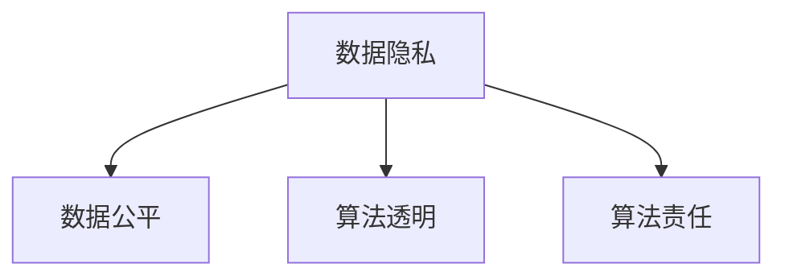

                 

# 数据伦理：算法治理与规范

> 关键词：数据伦理,算法治理,算法规范,数据隐私,数据公平,算法透明,人工智能伦理

## 1. 背景介绍

### 1.1 问题由来
在当今数字化时代，数据驱动的算法已经渗透到社会的各个角落，从日常生活的推荐系统到金融领域的信用评估，再到医疗领域的诊断和治疗，数据算法无处不在。然而，数据算法的广泛应用也带来了诸多挑战，特别是数据伦理和算法治理问题。如何确保数据使用的合规性、公正性和透明性，已经成为了全社会关注的焦点。

随着AI技术的迅猛发展，算法已经逐渐从辅助决策工具变成了关键的决策者。因此，对算法进行伦理治理，不仅是技术问题，更是一个涉及社会伦理、法律规范的重大课题。在数据驱动的时代，算法治理与数据伦理已经成为保障社会公平正义、保护个人隐私、确保技术安全的基石。

### 1.2 问题核心关键点
数据伦理和算法治理的核心在于如何在技术开发和应用中，兼顾经济效益和社会价值，确保算法的使用符合伦理标准，不会对社会造成负面影响。主要关键点包括：

1. **数据隐私**：如何保护个人数据不被滥用，防止数据泄露。
2. **数据公平**：如何确保算法不歧视某些群体，实现公正的决策。
3. **算法透明**：如何提高算法的透明度，让用户理解和信任算法。
4. **算法责任**：如何明确算法的责任归属，确保算法决策的责任可追溯。

本文将从以上四个方面深入探讨数据伦理和算法治理的问题，提出具体的规范和建议。

## 2. 核心概念与联系

### 2.1 核心概念概述

为了更好地理解数据伦理和算法治理，本节将介绍几个密切相关的核心概念：

- **数据隐私**：指个人信息在采集、存储、使用、传输等环节的保护。
- **数据公平**：指算法在处理数据时不偏向任何群体，保证所有用户的平等权利。
- **算法透明**：指算法的工作原理和决策逻辑应清晰明确，让用户可以理解和监督。
- **算法责任**：指算法决策的责任应明确，包括算法开发者、部署者和使用者的责任。

这些概念之间的逻辑关系可以通过以下Mermaid流程图来展示：



这个流程图展示了数据伦理和算法治理的关键概念及其之间的关系：

1. 数据隐私是基础，保障了个人信息的安全。
2. 数据公平建立在数据隐私的基础上，确保算法决策的公正性。
3. 算法透明可以提升数据公平和算法责任的透明度。
4. 算法责任确保了算法的可追溯性和问责性。

这些核心概念共同构成了数据伦理和算法治理的框架，确保算法的开发和使用符合伦理标准，最大程度地保护社会公正和个体权益。

## 3. 核心算法原理 & 具体操作步骤
### 3.1 算法原理概述

数据伦理和算法治理的核心在于如何在算法开发和应用中，确保数据使用的合规性、公正性和透明性。其核心思想是：

- **合规性**：确保算法处理数据的过程符合法律法规和行业标准。
- **公正性**：确保算法决策对所有用户公平，不产生歧视性结果。
- **透明性**：提高算法的透明度，让用户理解和信任算法。
- **责任性**：明确算法的责任归属，确保算法决策的责任可追溯。

这些原则的实现，需要结合具体的算法原理和技术手段。

### 3.2 算法步骤详解

实现数据伦理和算法治理的目标，通常包括以下几个关键步骤：

**Step 1: 合规性审查**
- 进行法律和伦理审查，确保算法处理数据的过程符合相关的法律法规和行业标准。
- 审查数据采集、存储、处理和传输的每一个环节，确保不侵犯个人隐私，不违反公平原则。

**Step 2: 数据预处理**
- 对数据进行清洗和处理，去除噪声和偏见。
- 对敏感数据进行脱敏处理，确保数据使用的合规性。

**Step 3: 算法设计**
- 在算法设计阶段，引入公平性指标，如误差率、召回率、F1值等，确保算法决策的公正性。
- 引入透明度机制，如可解释模型、特征重要性分析等，提高算法的透明度。

**Step 4: 算法评估与监测**
- 对算法进行评估，确保其性能满足要求。
- 引入实时监测机制，跟踪算法的运行状态和结果，及时发现和纠正偏差。

**Step 5: 用户反馈与改进**
- 收集用户反馈，了解算法的使用效果和存在的问题。
- 根据用户反馈，持续改进算法，确保其持续符合伦理标准。

### 3.3 算法优缺点

数据伦理和算法治理具有以下优点：
1. 提升了算法的合规性和可信度，确保了数据使用的公平性和透明性。
2. 有利于构建用户信任，提升算法在社会中的接受度和应用效果。
3. 有利于算法的持续改进和优化，确保其长期符合伦理标准。

同时，也存在一些局限性：
1. 增加了算法开发的复杂度和成本，特别是合规性审查和隐私保护。
2. 对算法的透明度和可解释性要求较高，对于一些复杂模型可能难以实现。
3. 需要持续的监测和改进，增加了算法维护的复杂性。

尽管存在这些局限性，但就目前而言，数据伦理和算法治理仍然是大数据和人工智能技术应用的重要保障。

### 3.4 算法应用领域

数据伦理和算法治理已经在众多领域得到了广泛的应用，例如：

- 金融领域：信用评估、贷款审批等金融决策需要确保数据公平和算法透明，避免歧视性结果。
- 医疗领域：疾病诊断和治疗方案推荐需要确保数据隐私，避免对患者隐私的侵害。
- 教育领域：学生评估和个性化推荐需要确保数据公平，避免对某些群体的歧视。
- 招聘领域：候选人评估和招聘决策需要确保数据公平和算法透明，避免对特定群体的歧视。
- 司法领域：案件判决和法律建议需要确保算法公正，避免对弱势群体的歧视。

除了上述这些领域，数据伦理和算法治理还在政府治理、社会服务、公共安全等诸多领域得到应用，为社会公平和正义提供了重要的技术保障。

## 4. 数学模型和公式 & 详细讲解 & 举例说明

### 4.1 数学模型构建

本节将使用数学语言对数据伦理和算法治理的基本模型进行严格的刻画。

假设我们有一个机器学习模型 $M$，其输入为 $x$，输出为 $y$。模型 $M$ 的决策函数为 $M(x)$，其输出 $y$ 表示模型的预测结果。数据 $D$ 由 $n$ 个样本组成，每个样本 $(x_i, y_i)$，其中 $x_i$ 为输入，$y_i$ 为标签。

定义模型 $M$ 在数据集 $D$ 上的误差函数为 $L(M, D)$，表示模型预测结果与真实标签之间的差异。常见的误差函数包括均方误差、交叉熵等。

假设我们希望通过优化误差函数 $L(M, D)$ 来提高模型的性能，同时确保其符合伦理标准。优化目标可以表示为：

$$
\min_{M} L(M, D)
$$

其中 $M$ 表示模型的参数。

### 4.2 公式推导过程

以二分类问题为例，我们希望构建一个公平的分类器 $M(x)$，使其在所有类别上误差相等。假设我们有两个类别 $A$ 和 $B$，模型在 $A$ 和 $B$ 类别上的误差分别为 $e_A$ 和 $e_B$，我们可以使用以下公平性约束：

$$
e_A = e_B
$$

将这个公平性约束转化为优化目标，可以得到：

$$
\min_{M} L(M, D) + \lambda(e_A - e_B)
$$

其中 $\lambda$ 为公平性惩罚系数，用于权衡误差和公平性。

为了确保模型的透明度，我们可以引入可解释模型，如决策树、线性回归等，使得模型的决策过程清晰透明。对于复杂的非线性模型，可以采用特征重要性分析等方法，提高模型的可解释性。

### 4.3 案例分析与讲解

以金融领域的信用评分为例，信用评分模型需要确保数据公平和算法透明。假设我们有一个包含性别、年龄、收入、信用历史等特征的数据集 $D$，模型 $M$ 的输出为信用评分 $y$。

**公平性约束**：模型不应基于性别、年龄、种族等特征对不同群体产生歧视性影响。我们可以使用等误率约束 $e_A = e_B$ 来确保公平性，其中 $A$ 和 $B$ 表示不同的特征群体。

**可解释性要求**：模型的决策过程应清晰透明，让用户可以理解和信任模型。我们可以使用决策树、线性回归等可解释模型，提高模型的透明度。

**透明度和可解释性**：模型 $M$ 的输出 $y$ 可以表示为：

$$
y = \sum_{i=1}^{n} w_i x_i
$$

其中 $w_i$ 表示特征 $x_i$ 的权重。通过分析这些权重，可以理解模型对不同特征的依赖关系，提升模型的透明度和可解释性。

## 5. 项目实践：代码实例和详细解释说明

### 5.1 开发环境搭建

在进行数据伦理和算法治理的开发实践前，我们需要准备好开发环境。以下是使用Python进行Scikit-learn开发的环境配置流程：

1. 安装Anaconda：从官网下载并安装Anaconda，用于创建独立的Python环境。

2. 创建并激活虚拟环境：
```bash
conda create -n ethics-env python=3.8 
conda activate ethics-env
```

3. 安装Scikit-learn：
```bash
pip install scikit-learn
```

4. 安装各类工具包：
```bash
pip install numpy pandas scikit-learn matplotlib tqdm jupyter notebook ipython
```

完成上述步骤后，即可在`ethics-env`环境中开始开发实践。

### 5.2 源代码详细实现

这里以一个简单的信用评分模型为例，展示如何实现公平性约束和可解释性要求。

首先，定义一个公平性约束的信用评分模型：

```python
from sklearn.linear_model import LogisticRegression
from sklearn.metrics import classification_report
from sklearn.model_selection import train_test_split

# 加载数据
X_train, X_test, y_train, y_test = train_test_split(X, y, test_size=0.2, random_state=42)

# 训练公平的逻辑回归模型
clf = LogisticRegression(solver='lbfgs')
clf.fit(X_train, y_train)

# 评估模型性能
y_pred = clf.predict(X_test)
print(classification_report(y_test, y_pred))
```

然后，通过特征重要性分析来提高模型的透明度：

```python
import pandas as pd
import matplotlib.pyplot as plt
import numpy as np

# 获取特征重要性
importances = clf.coef_[0]
feature_names = X_train.columns

# 可视化特征重要性
fig, ax = plt.subplots(figsize=(10, 6))
ax.barh(feature_names, importances)
ax.set_title('Feature Importances')
ax.set_xlabel('Importance')
ax.set_ylabel('Feature')
plt.show()
```

### 5.3 代码解读与分析

让我们再详细解读一下关键代码的实现细节：

**信用评分模型**：
- 使用Scikit-learn库中的LogisticRegression模型，训练一个公平的信用评分模型。
- 通过公平性约束，确保模型在所有特征群体上的误差相等。

**特征重要性分析**：
- 使用模型系数（即权重）来衡量各个特征的重要性。
- 可视化特征重要性，展示哪些特征对模型的预测结果影响最大。

通过这些代码，我们可以看到，通过公平性约束和特征重要性分析，可以有效地提升信用评分模型的伦理性和透明度。

## 6. 实际应用场景

### 6.1 金融领域

在金融领域，信用评分、贷款审批等金融决策需要确保数据公平和算法透明，避免歧视性结果。

以信用评分模型为例，在训练过程中引入公平性约束，确保模型在所有性别、年龄、种族等特征群体上的误差相等。同时，引入特征重要性分析，提高模型的透明度，让用户理解和信任模型。

在金融决策中，还需要定期监测模型的运行状态和结果，及时发现和纠正偏差。根据用户反馈，持续改进模型，确保其长期符合伦理标准。

### 6.2 医疗领域

在医疗领域，疾病诊断和治疗方案推荐需要确保数据隐私，避免对患者隐私的侵害。

以疾病诊断模型为例，在模型设计阶段引入隐私保护机制，如数据脱敏、匿名化处理等，确保患者数据的安全性。同时，引入公平性约束，确保模型对所有患者的诊断结果公正，不产生歧视性结果。

在医疗决策中，还需要对模型的决策过程进行透明度分析，确保其可解释性和可信度。定期监测模型的运行状态和结果，确保其符合伦理标准。

### 6.3 教育领域

在教育领域，学生评估和个性化推荐需要确保数据公平，避免对某些群体的歧视。

以学生评估模型为例，在模型设计阶段引入公平性约束，确保模型对所有学生的评估结果公正，不产生歧视性结果。同时，引入特征重要性分析，提高模型的透明度，让用户理解和信任模型。

在教育决策中，还需要定期监测模型的运行状态和结果，及时发现和纠正偏差。根据用户反馈，持续改进模型，确保其长期符合伦理标准。

### 6.4 未来应用展望

随着数据伦理和算法治理技术的不断发展，未来将会在更多领域得到应用，为社会公平和正义提供重要的技术保障。

在智慧城市治理中，数据分析和决策需要确保数据公平和算法透明，避免对弱势群体的歧视。在智能交通系统中，交通流量分析和预测需要确保数据隐私和算法公正，提升交通安全和效率。在环境保护领域，数据监测和决策需要确保数据公平和算法透明，提升环境保护效果。

## 7. 工具和资源推荐

### 7.1 学习资源推荐

为了帮助开发者系统掌握数据伦理和算法治理的理论基础和实践技巧，这里推荐一些优质的学习资源：

1. 《数据科学伦理》系列博文：由数据伦理专家撰写，深入浅出地介绍了数据伦理的基本概念和前沿问题。

2. 《算法透明性与公平性》课程：由斯坦福大学开设的在线课程，介绍了算法透明性和公平性的基本原理和实现方法。

3. 《数据隐私保护》书籍：详细介绍了数据隐私保护的技术和法规，是数据伦理治理的重要参考。

4. 《算法治理：数据伦理与技术规范》文章：介绍了算法治理的基本框架和实践方法，提供了详细的案例分析。

通过对这些资源的学习实践，相信你一定能够快速掌握数据伦理和算法治理的精髓，并用于解决实际的数据应用问题。

### 7.2 开发工具推荐

高效的开发离不开优秀的工具支持。以下是几款用于数据伦理和算法治理开发的常用工具：

1. Scikit-learn：开源机器学习库，提供了丰富的模型和工具，支持公平性约束和特征重要性分析。

2. TensorFlow：由Google主导开发的开源深度学习框架，提供了丰富的模型和工具，支持模型解释和可解释性分析。

3. Weights & Biases：模型训练的实验跟踪工具，可以记录和可视化模型训练过程中的各项指标，方便对比和调优。

4. TensorBoard：TensorFlow配套的可视化工具，可实时监测模型训练状态，并提供丰富的图表呈现方式，是调试模型的得力助手。

5. Jupyter Notebook：交互式编程环境，支持代码和文档的混合编辑和展示，方便数据伦理和算法治理的实验和交流。

合理利用这些工具，可以显著提升数据伦理和算法治理任务的开发效率，加快创新迭代的步伐。

### 7.3 相关论文推荐

数据伦理和算法治理的发展源于学界的持续研究。以下是几篇奠基性的相关论文，推荐阅读：

1. Fairness in Machine Learning（公平性在机器学习中）：详细介绍了如何设计和评估公平的机器学习模型。

2. A Survey of Data Privacy Technologies（数据隐私技术的综述）：全面回顾了数据隐私保护的各种技术和方法。

3. Explainable AI：Machine Learning in Practice（可解释AI：在实践中应用机器学习）：介绍了可解释AI的基本原理和实现方法。

4. Ethical Algorithms（道德算法）：探讨了如何在算法设计和应用中引入伦理标准，确保算法的公正性和透明性。

这些论文代表了大数据和人工智能技术在伦理治理方面的发展脉络。通过学习这些前沿成果，可以帮助研究者把握学科前进方向，激发更多的创新灵感。

## 8. 总结：未来发展趋势与挑战

### 8.1 总结

本文对数据伦理和算法治理进行了全面系统的介绍。首先阐述了数据伦理和算法治理的研究背景和意义，明确了其在大数据和人工智能技术应用中的重要地位。其次，从原理到实践，详细讲解了数据伦理和算法治理的数学模型和操作步骤，给出了具体的应用实例。同时，本文还探讨了数据伦理和算法治理在金融、医疗、教育等诸多领域的应用前景，展示了其广阔的发展空间。

通过本文的系统梳理，可以看到，数据伦理和算法治理已经成为了大数据和人工智能技术应用的重要保障。这些技术的不断完善和应用，必将在确保数据公平、保护个人隐私、提升技术可信度等方面发挥重要作用。

### 8.2 未来发展趋势

展望未来，数据伦理和算法治理将呈现以下几个发展趋势：

1. 法律法规的完善。随着数据伦理和算法治理技术的不断发展，相关法律法规将更加完善，为技术应用提供明确的法律指导。

2. 技术的不断创新。新的数据隐私保护技术、公平性评估方法、可解释性工具将不断涌现，推动技术应用不断进步。

3. 伦理标准的普及。数据伦理和算法治理的概念将更加普及，成为社会共识，引导更多企业和社会机构采用这些技术。

4. 国际合作加强。各国在数据伦理和算法治理方面的合作将不断加强，形成全球范围内的规范和标准。

这些趋势将为数据伦理和算法治理技术的进一步发展提供坚实基础，推动其在全球范围内广泛应用。

### 8.3 面临的挑战

尽管数据伦理和算法治理技术已经取得了显著进展，但在迈向更加智能化、普适化应用的过程中，仍面临诸多挑战：

1. 法律法规的滞后。当前法律法规的更新速度难以跟上技术的快速发展，部分技术应用在法律上存在空白。

2. 技术的复杂性。数据伦理和算法治理涉及的技术复杂，需要综合考虑隐私保护、公平性、可解释性等多个方面。

3. 伦理标准的差异。不同地区和文化背景下的伦理标准存在差异，难以形成统一的规范。

4. 技术应用成本高。实现数据伦理和算法治理需要投入大量人力和资源，增加了技术应用成本。

5. 用户信任度低。部分用户对算法决策的公正性和透明性存在疑虑，难以建立信任。

6. 模型鲁棒性不足。模型在面对未知数据时，可能产生偏差或错误，影响决策的公正性和公平性。

7. 隐私保护的技术难度高。隐私保护技术需要综合考虑数据的敏感性和使用场景，实现效果和效率的平衡。

8. 数据公平的挑战。在处理多样性数据时，如何消除偏见，实现真正的公平性，是一个复杂且长期的问题。

这些挑战需要我们共同面对和解决，通过学术研究和工业实践，不断完善数据伦理和算法治理的技术体系，推动技术的健康发展。

### 8.4 研究展望

面对数据伦理和算法治理所面临的种种挑战，未来的研究需要在以下几个方面寻求新的突破：

1. 探索无监督和半监督数据伦理和算法治理方法。摆脱对大量标注数据的依赖，利用自监督学习、主动学习等无监督和半监督范式，最大限度利用非结构化数据，实现更加灵活高效的技术应用。

2. 研究参数高效和计算高效的算法治理方法。开发更加参数高效的算法治理方法，在固定大部分预训练参数的同时，只更新极少量的任务相关参数。同时优化治理算法的计算图，减少前向传播和反向传播的资源消耗，实现更加轻量级、实时性的部署。

3. 融合因果和对比学习范式。通过引入因果推断和对比学习思想，增强算法治理模型建立稳定因果关系的能力，学习更加普适、鲁棒的语言表征，从而提升模型的泛化性和抗干扰能力。

4. 引入更多先验知识。将符号化的先验知识，如知识图谱、逻辑规则等，与神经网络模型进行巧妙融合，引导算法治理过程学习更准确、合理的语言模型。同时加强不同模态数据的整合，实现视觉、语音等多模态信息与文本信息的协同建模。

5. 结合因果分析和博弈论工具。将因果分析方法引入算法治理模型，识别出模型决策的关键特征，增强输出解释的因果性和逻辑性。借助博弈论工具刻画人机交互过程，主动探索并规避模型的脆弱点，提高系统稳定性。

6. 纳入伦理道德约束。在算法治理目标中引入伦理导向的评估指标，过滤和惩罚有偏见、有害的输出倾向。同时加强人工干预和审核，建立模型行为的监管机制，确保输出符合人类价值观和伦理道德。

这些研究方向的探索，必将引领数据伦理和算法治理技术迈向更高的台阶，为构建安全、可靠、可解释、可控的智能系统铺平道路。面向未来，数据伦理和算法治理技术还需要与其他人工智能技术进行更深入的融合，如知识表示、因果推理、强化学习等，多路径协同发力，共同推动自然语言理解和智能交互系统的进步。只有勇于创新、敢于突破，才能不断拓展数据伦理和算法治理的边界，让智能技术更好地造福人类社会。

## 9. 附录：常见问题与解答

**Q1：数据伦理和算法治理是否适用于所有NLP任务？**

A: 数据伦理和算法治理在大多数NLP任务上都能取得不错的效果，特别是对于数据量较小的任务。但对于一些特定领域的任务，如医学、法律等，仅仅依靠通用语料预训练的模型可能难以很好地适应。此时需要在特定领域语料上进一步预训练，再进行治理，才能获得理想效果。

**Q2：如何确保数据使用的合规性？**

A: 数据使用的合规性可以通过法律法规和技术手段共同保障。在数据采集、存储、处理和传输的每一个环节，都需要符合相关的法律法规和行业标准。同时，可以通过数据脱敏、匿名化处理等技术手段，确保数据的隐私和安全。

**Q3：如何在算法设计阶段引入公平性约束？**

A: 在算法设计阶段，可以通过公平性指标（如误差率、召回率、F1值等）来确保算法决策的公正性。同时，引入可解释模型，如决策树、线性回归等，提高模型的透明度，让用户理解和信任算法。

**Q4：如何提高算法的透明度？**

A: 算法的透明度可以通过特征重要性分析、可解释模型等手段实现。特征重要性分析可以展示各个特征对模型的影响程度，可解释模型可以展示模型的决策过程，从而提高算法的透明度。

**Q5：如何确保算法的责任可追溯？**

A: 算法的责任可追溯性可以通过模型日志、决策记录等手段实现。在算法决策过程中，需要记录关键参数和数据，确保算法的可解释性和可追溯性。

---

作者：禅与计算机程序设计艺术 / Zen and the Art of Computer Programming

