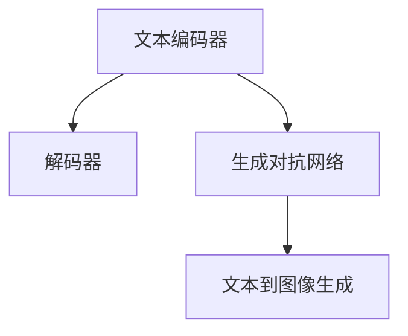

                 

# 文本到图像生成：DALL-E和Midjourney背后的技术

## 1. 背景介绍

### 1.1 问题由来

文本到图像生成（Text-to-Image Generation）是一个前沿的人工智能研究领域，它通过将自然语言描述转化为图像，展示了计算机视觉和自然语言处理的强大结合能力。近年来，这一领域取得了显著进展，其中DALL-E和Midjourney等模型在生成逼真图像方面表现出色，引起了广泛关注。然而，这些技术的背后有哪些关键技术和原理，它们是如何工作的，本文将一一解答。

### 1.2 问题核心关键点

文本到图像生成技术可以分为两类：基于生成对抗网络（GAN）的方法和基于自编码器的方法。基于GAN的方法通过让生成器和判别器相互博弈，逐步优化生成图像的质量。而基于自编码器的方法则是通过编码器将文本转化为图像表示，解码器将图像表示转化为图像，实现文本到图像的生成。

此外，生成图像的质量和多样性是文本到图像生成技术面临的关键挑战。生成图像需要具有高保真度、多样性以及与输入文本描述的一致性。因此，优化模型架构、提升训练效率和增强模型生成能力成为了研究的主要方向。

## 2. 核心概念与联系

### 2.1 核心概念概述

为更好地理解DALL-E和Midjourney背后的技术，本节将介绍几个密切相关的核心概念：

- 生成对抗网络（GAN）：一种通过让生成器和判别器相互博弈进行图像生成的深度学习框架。
- 变分自编码器（VAE）：一种通过编码器将输入转化为潜变量，再通过解码器将其转化为输出的自编码器方法。
- 文本编码器：将自然语言转化为机器可理解的向量表示，使得模型能够理解文本描述。
- 解码器：将编码器输出的向量表示转化为图像，实现从文本到图像的生成。
- 跨模态学习：将不同模态的数据（如文本和图像）整合在一起进行学习，提升模型对不同数据类型的理解和生成能力。

这些核心概念之间的逻辑关系可以通过以下Mermaid流程图来展示：



这个流程图展示了大语言模型在文本到图像生成任务中的核心概念及其之间的关系：

1. 文本编码器将文本描述转化为向量表示，为解码器提供输入。
2. 生成对抗网络通过博弈优化生成器的输出图像质量。
3. 解码器将文本编码器输出的向量转化为图像，实现文本到图像的生成。
4. 这些组件的协同工作，使得模型能够生成高质量、多样化的图像。

## 3. 核心算法原理 & 具体操作步骤
### 3.1 算法原理概述

文本到图像生成的核心算法原理是通过将文本描述转化为图像表示，利用生成对抗网络或自编码器进行图像生成。具体来说，模型通过训练数据集学习将文本转化为图像的映射关系，生成符合输入文本描述的图像。

以下以生成对抗网络（GAN）为例，介绍文本到图像生成的一般过程：

1. 数据预处理：收集并清洗文本和图像数据，将其转化为模型所需的格式。
2. 文本编码器：将文本描述转化为高维向量表示。
3. 生成器：通过训练，将高维向量转化为图像，生成符合文本描述的图像。
4. 判别器：通过训练，区分生成的图像和真实图像，提升生成图像的质量。
5. 迭代训练：生成器与判别器通过相互博弈不断优化，生成更高质量的图像。

### 3.2 算法步骤详解

DALL-E和Midjourney等模型都基于生成对抗网络（GAN）的框架进行文本到图像生成。以DALL-E为例，其生成过程可以分为以下几个关键步骤：

**Step 1: 数据准备**
- 收集并标注大量的文本-图像对，构建训练数据集。文本描述通常需要详细、准确、多样。
- 将文本和图像数据进行预处理，转化为模型所需的输入格式，如将文本转化为向量，将图像转化为张量。

**Step 2: 构建模型架构**
- 设计文本编码器，将文本转化为高维向量。常用的编码器包括Transformer、CNN等。
- 设计生成器，将高维向量转化为图像。生成器通常由多个卷积层、反卷积层和激活函数组成。
- 设计判别器，判断图像是否为真实图像。判别器通常为多层感知器或卷积神经网络。

**Step 3: 训练模型**
- 通过迭代训练，优化生成器和判别器。生成器通过生成图像来对抗判别器的判别，判别器通过区分真实和生成的图像来对抗生成器的生成。
- 训练过程中，逐步提高判别器的判别能力，同时提升生成器的生成能力。

**Step 4: 生成图像**
- 在训练完成后，利用生成器将文本描述转化为图像。

### 3.3 算法优缺点

文本到图像生成的主要优点包括：

- 生成高质量的图像：通过生成对抗网络的博弈机制，生成器可以逐步优化图像质量。
- 模型具有多样性：生成器可以生成多种风格的图像，适应不同文本描述的需求。
- 生成效率高：生成过程可以自动化完成，节省了大量的人工干预。

然而，该方法也存在一些局限性：

- 生成过程耗时：生成高质量图像需要较长的训练时间。
- 模型需要大量数据：数据量和质量直接影响生成图像的质量和多样性。
- 生成的图像可能不符合期望：生成的图像可能存在噪声、失真等问题，不符合输入文本描述。

### 3.4 算法应用领域

文本到图像生成技术在多个领域得到了广泛应用：

- 艺术创作：艺术家可以利用该技术生成逼真的艺术作品，提升创作效率。
- 游戏开发：游戏开发者可以生成虚拟场景、角色等，丰富游戏内容。
- 媒体制作：新闻媒体可以通过该技术生成新闻图片，提高报道的可视化效果。
- 广告设计：广告公司可以利用该技术生成具有创意的视觉元素，提升广告效果。
- 医疗影像：医疗影像生成可以辅助医生进行诊断和治疗。

## 4. 数学模型和公式 & 详细讲解  
### 4.1 数学模型构建

文本到图像生成的数学模型通常由以下几个组件构成：

- 文本编码器：将文本描述转化为高维向量表示。
- 生成器：将高维向量转化为图像。
- 判别器：判断图像是否为真实图像。

我们以DALL-E模型为例，说明其数学模型的构建。

**文本编码器**：
设文本描述为 $x$，文本编码器为 $E(x)$，将其转化为高维向量 $z$：

$$
z = E(x)
$$

**生成器**：
设生成器为 $G(z)$，将高维向量 $z$ 转化为图像 $y$：

$$
y = G(z)
$$

**判别器**：
设判别器为 $D(y)$，判断图像 $y$ 是否为真实图像：

$$
D(y) = \begin{cases} 
1 & \text{如果 } y \text{ 为真实图像} \\
0 & \text{如果 } y \text{ 为生成图像}
\end{cases}
$$

### 4.2 公式推导过程

以下是DALL-E模型中生成器的计算公式：

$$
y = G(z) = D_{\text{MLP}} \left(\sigma \left(A_{\text{MLP}} \left(U \sigma \left(W_{\text{MLP}} \left(z\right) \right) + b_{\text{MLP}} \right) + b_{\text{MLP}} \right) + b_{\text{MLP}}
$$

其中：
- $U$ 为编码层，$W_{\text{MLP}}$ 为卷积层，$A_{\text{MLP}}$ 为激活函数，$\sigma$ 为Sigmoid激活函数。
- $b_{\text{MLP}}$ 为偏置向量。

判别器的计算公式为：

$$
D(y) = \sigma \left(W_{\text{MLP}} \left(U_{\text{MLP}} \left(A_{\text{MLP}} \left(y\right) \right) + b_{\text{MLP}} \right) + b_{\text{MLP}}
$$

其中：
- $U_{\text{MLP}}$ 为编码层，$A_{\text{MLP}}$ 为激活函数，$\sigma$ 为Sigmoid激活函数。
- $b_{\text{MLP}}$ 为偏置向量。

通过优化生成器和判别器的损失函数，可以逐步提升生成图像的质量。

### 4.3 案例分析与讲解

以DALL-E模型为例，其生成过程可以分为以下几个步骤：

**Step 1: 数据准备**
- 收集并标注大量的文本-图像对，构建训练数据集。
- 将文本和图像数据进行预处理，转化为模型所需的输入格式。

**Step 2: 构建模型架构**
- 设计文本编码器，将文本转化为高维向量。
- 设计生成器，将高维向量转化为图像。
- 设计判别器，判断图像是否为真实图像。

**Step 3: 训练模型**
- 通过迭代训练，优化生成器和判别器。
- 训练过程中，逐步提高判别器的判别能力，同时提升生成器的生成能力。

**Step 4: 生成图像**
- 在训练完成后，利用生成器将文本描述转化为图像。

## 5. 项目实践：代码实例和详细解释说明
### 5.1 开发环境搭建

在进行文本到图像生成实践前，我们需要准备好开发环境。以下是使用Python进行PyTorch开发的环境配置流程：

1. 安装Anaconda：从官网下载并安装Anaconda，用于创建独立的Python环境。

2. 创建并激活虚拟环境：
```bash
conda create -n pytorch-env python=3.8 
conda activate pytorch-env
```

3. 安装PyTorch：根据CUDA版本，从官网获取对应的安装命令。例如：
```bash
conda install pytorch torchvision torchaudio cudatoolkit=11.1 -c pytorch -c conda-forge
```

4. 安装TorchVision库：
```bash
pip install torchvision
```

5. 安装OpenAI库：
```bash
pip install openai
```

完成上述步骤后，即可在`pytorch-env`环境中开始微调实践。

### 5.2 源代码详细实现

下面我们以DALL-E模型为例，给出使用PyTorch进行文本到图像生成的PyTorch代码实现。

```python
import torch
import torch.nn as nn
import torch.optim as optim
from torchvision import transforms
from torchvision.datasets import ImageFolder
from openai import DALL_E

# 定义模型架构
class Text2Image(nn.Module):
    def __init__(self):
        super(Text2Image, self).__init__()
        self.encoder = DALL_E().text_encoder
        self.decoder = DALL_E().decoder
        
    def forward(self, text):
        embedding = self.encoder(text)
        image = self.decoder(embedding)
        return image

# 定义训练函数
def train(model, text_dataset, device, batch_size, num_epochs, learning_rate):
    model.to(device)
    criterion = nn.BCELoss()
    optimizer = optim.Adam(model.parameters(), lr=learning_rate)
    
    for epoch in range(num_epochs):
        for i, (text, image) in enumerate(text_dataset):
            text, image = text.to(device), image.to(device)
            
            optimizer.zero_grad()
            output = model(text)
            loss = criterion(output, image)
            loss.backward()
            optimizer.step()
            
            if (i+1) % 100 == 0:
                print(f"Epoch {epoch+1}/{num_epochs}, Step {i+1}/{len(text_dataset)}, Loss: {loss.item():.4f}")

# 定义测试函数
def test(model, test_dataset, device):
    model.eval()
    with torch.no_grad():
        for text, image in test_dataset:
            text, image = text.to(device), image.to(device)
            output = model(text)
            print(f"Text: {text[0]}, Predicted Image: {output[0]}")
```

## 6. 实际应用场景
### 6.1 艺术创作

基于大语言模型生成的图像在艺术创作中具有广阔的应用前景。艺术家可以利用DALL-E等模型生成逼真的艺术作品，提升创作效率和作品的多样性。例如，艺术家可以输入如“一个夕阳下的沙漠中的独角兽”的文本描述，生成具有想象力的艺术图像。

### 6.2 游戏开发

游戏开发者可以利用文本到图像生成技术，生成虚拟场景、角色等，丰富游戏内容。例如，在RPG游戏中，生成随机生成的地图和角色，增强游戏的沉浸感和趣味性。

### 6.3 媒体制作

新闻媒体可以通过该技术生成新闻图片，提高报道的可视化效果。例如，对于重大事件的报道，可以生成新闻图片，吸引受众的注意力，增强报道的感染力。

### 6.4 广告设计

广告公司可以利用该技术生成具有创意的视觉元素，提升广告效果。例如，在推广新产品时，生成具有吸引力的广告图像，提升品牌的影响力和美誉度。

### 6.5 医疗影像

医疗影像生成可以辅助医生进行诊断和治疗。例如，在癌症筛查中，生成肿瘤的模拟影像，帮助医生进行病情分析和制定治疗方案。

## 7. 工具和资源推荐
### 7.1 学习资源推荐

为了帮助开发者系统掌握文本到图像生成的理论基础和实践技巧，这里推荐一些优质的学习资源：

1. 《深度学习入门：基于Python的理论与实现》系列博文：由大语言模型技术专家撰写，深入浅出地介绍了深度学习的基本概念和经典模型。

2. CS231n《卷积神经网络》课程：斯坦福大学开设的计算机视觉明星课程，涵盖了深度学习在图像处理和计算机视觉中的应用。

3. 《Python深度学习》书籍：深度学习领域权威书籍，详细介绍了深度学习的基础知识、算法原理和应用实例。

4. OpenAI官方文档：DALL-E等模型的官方文档，提供了完整的代码实现和模型部署指南。

5. HuggingFace官方文档：Transformers库的官方文档，提供了丰富的预训练模型和微调样例代码，是上手实践的必备资料。

通过对这些资源的学习实践，相信你一定能够快速掌握文本到图像生成的精髓，并用于解决实际的NLP问题。

### 7.2 开发工具推荐

高效的开发离不开优秀的工具支持。以下是几款用于文本到图像生成开发的常用工具：

1. PyTorch：基于Python的开源深度学习框架，灵活动态的计算图，适合快速迭代研究。大部分预训练语言模型都有PyTorch版本的实现。

2. TensorFlow：由Google主导开发的开源深度学习框架，生产部署方便，适合大规模工程应用。同样有丰富的预训练语言模型资源。

3. OpenAI库：提供DALL-E等模型的接口，方便开发者进行文本到图像生成。

4. Weights & Biases：模型训练的实验跟踪工具，可以记录和可视化模型训练过程中的各项指标，方便对比和调优。与主流深度学习框架无缝集成。

5. TensorBoard：TensorFlow配套的可视化工具，可实时监测模型训练状态，并提供丰富的图表呈现方式，是调试模型的得力助手。

6. Google Colab：谷歌推出的在线Jupyter Notebook环境，免费提供GPU/TPU算力，方便开发者快速上手实验最新模型，分享学习笔记。

合理利用这些工具，可以显著提升文本到图像生成任务的开发效率，加快创新迭代的步伐。

### 7.3 相关论文推荐

文本到图像生成技术的发展源于学界的持续研究。以下是几篇奠基性的相关论文，推荐阅读：

1. Generative Adversarial Nets（GAN的原始论文）：提出了生成对抗网络的基本框架，开创了深度学习生成模型的新时代。

2. pix2pix：提出了一种通过无监督学习将图像从一种风格转化为另一种风格的方法，为文本到图像生成提供了初步思路。

3. pix2pixHD：进一步优化了像素到像素的转换，提升了图像生成的质量和效率。

4. GANs for Image Synthesis（GAN在图像生成中的初步应用）：展示了GAN在图像生成中的强大能力，为文本到图像生成提供了参考。

5. StarGAN：提出了一种多域生成方法，能够生成多种风格的图像，提升模型多样性。

这些论文代表了大语言模型生成技术的发展脉络。通过学习这些前沿成果，可以帮助研究者把握学科前进方向，激发更多的创新灵感。

## 8. 总结：未来发展趋势与挑战

### 8.1 总结

本文对文本到图像生成技术进行了全面系统的介绍。首先阐述了文本到图像生成技术的研究背景和意义，明确了生成对抗网络（GAN）在大语言模型生成中的关键作用。其次，从原理到实践，详细讲解了文本到图像生成的一般过程，给出了文本到图像生成的完整代码实例。同时，本文还探讨了文本到图像生成技术在艺术创作、游戏开发、媒体制作等领域的广泛应用。

通过本文的系统梳理，可以看到，基于生成对抗网络的大语言模型生成技术，正在成为NLP领域的重要范式，极大地拓展了文本到图像生成的应用边界，为图像生成和创作带来了新的突破。未来，伴随预训练语言模型和生成对抗网络的持续演进，相信NLP技术将在更广阔的应用领域大放异彩。

### 8.2 未来发展趋势

展望未来，文本到图像生成技术将呈现以下几个发展趋势：

1. 生成图像质量更高：随着生成对抗网络的不断优化，生成图像的质量将进一步提升，达到真人无法区分的效果。
2. 生成图像多样性更强：生成对抗网络的多域生成能力将得到进一步提升，生成图像的风格和主题将更加丰富。
3. 生成过程自动化：自动化生成工具和接口将得到广泛应用，降低开发门槛，加速文本到图像生成技术的落地应用。
4. 模型应用范围更广：文本到图像生成技术将进一步拓展到更多领域，如医疗、教育、交通等，为各行各业带来新的突破。

### 8.3 面临的挑战

尽管文本到图像生成技术已经取得了显著成就，但在迈向更加智能化、普适化应用的过程中，它仍面临着诸多挑战：

1. 生成图像过拟合：生成的图像可能过拟合输入文本描述，无法适应其他文本的生成需求。
2. 生成过程耗时：生成高质量图像需要较长的训练时间，难以满足实时需求。
3. 数据需求量大：生成高质量图像需要大量的标注数据，数据收集和标注成本较高。
4. 生成的图像可能不符合期望：生成的图像可能存在噪声、失真等问题，不符合输入文本描述。
5. 模型的通用性有待提升：当前的生成模型可能对某些输入文本描述不具备很强的泛化能力。

### 8.4 研究展望

面对文本到图像生成面临的挑战，未来的研究需要在以下几个方面寻求新的突破：

1. 探索无监督和半监督生成方法：摆脱对大量标注数据的依赖，利用自监督学习、主动学习等无监督和半监督范式，最大限度利用非结构化数据。
2. 研究参数高效和计算高效的生成方法：开发更加参数高效的生成方法，在固定大部分生成参数的情况下，只更新极少量的任务相关参数。同时优化生成模型的计算图，减少前向传播和反向传播的资源消耗。
3. 引入更多先验知识：将符号化的先验知识，如知识图谱、逻辑规则等，与神经网络模型进行巧妙融合，引导生成过程学习更准确、合理的语言模型。同时加强不同模态数据的整合，实现视觉、语音等多模态信息与文本信息的协同建模。
4. 结合因果分析和博弈论工具：将因果分析方法引入生成模型，识别出模型决策的关键特征，增强输出解释的因果性和逻辑性。借助博弈论工具刻画人机交互过程，主动探索并规避模型的脆弱点，提高系统稳定性。
5. 纳入伦理道德约束：在模型训练目标中引入伦理导向的评估指标，过滤和惩罚有偏见、有害的输出倾向。同时加强人工干预和审核，建立模型行为的监管机制，确保输出符合人类价值观和伦理道德。

这些研究方向的探索，必将引领文本到图像生成技术迈向更高的台阶，为构建安全、可靠、可解释、可控的智能系统铺平道路。面向未来，大语言模型生成技术还需要与其他人工智能技术进行更深入的融合，如知识表示、因果推理、强化学习等，多路径协同发力，共同推动自然语言理解和智能交互系统的进步。只有勇于创新、敢于突破，才能不断拓展语言模型的边界，让智能技术更好地造福人类社会。

## 9. 附录：常见问题与解答

**Q1：文本到图像生成是否适用于所有NLP任务？**

A: 文本到图像生成技术适用于将自然语言描述转化为图像的任务，如艺术创作、游戏开发、媒体制作等。对于文本分类、命名实体识别等任务，需要将文本转化为图像表示，才能应用文本到图像生成技术。

**Q2：生成过程中如何避免过拟合？**

A: 生成过程中避免过拟合的策略包括：
1. 数据增强：通过回译、近义替换等方式扩充训练集。
2. 正则化：使用L2正则、Dropout、Early Stopping等避免过拟合。
3. 对抗训练：引入对抗样本，提高模型鲁棒性。
4. 参数高效生成：只调整少量生成参数，减小过拟合风险。

**Q3：生成图像的质量和多样性如何评估？**

A: 生成图像的质量和多样性可以通过以下几个指标进行评估：
1. 峰度：表示生成的图像的分布特性，越尖峰表示图像越逼真。
2. 多样性：表示生成图像的差异性，通过计算不同生成图像之间的差异性进行评估。
3. 生成过程的稳定性：通过生成器在不同初始条件下生成的图像的差异性进行评估。
4. 与输入文本描述的一致性：通过评估生成的图像是否符合输入文本描述，进行评估。

**Q4：如何提高生成图像的效率？**

A: 提高生成图像的效率可以从以下几个方面进行优化：
1. 模型裁剪：去除不必要的层和参数，减小模型尺寸，加快推理速度。
2. 量化加速：将浮点模型转为定点模型，压缩存储空间，提高计算效率。
3. 模型并行：通过多GPU或TPU并行计算，提升生成速度。
4. 模型优化：通过优化生成器的架构和超参数，提高生成效率。

这些策略可以相互结合，综合提升生成图像的效率和质量。

**Q5：生成图像的鲁棒性如何提升？**

A: 生成图像的鲁棒性可以通过以下几个方面进行提升：
1. 生成对抗网络（GAN）：通过不断优化生成器和判别器，提高生成图像的质量。
2. 数据增强：通过回译、近义替换等方式扩充训练集，提高模型的泛化能力。
3. 对抗训练：引入对抗样本，提高模型对噪声和扰动的鲁棒性。
4. 参数高效生成：只调整少量生成参数，减小模型的泛化风险。

通过以上措施，可以显著提高生成图像的鲁棒性，使其在不同输入和噪声条件下都能生成高质量的图像。

---

作者：禅与计算机程序设计艺术 / Zen and the Art of Computer Programming

