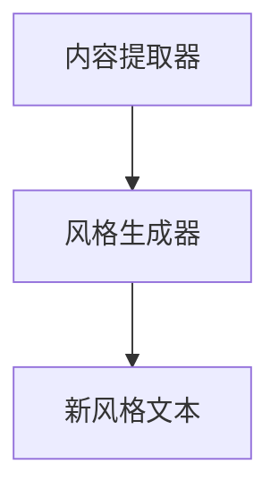

                 

## 1. 背景介绍

### 1.1 问题由来
在自然语言处理（NLP）领域，文本风格迁移（Text Style Transfer）是一种重要的技术，它允许在不改变内容的情况下，改变文本的语调、风格或形式，以适应不同的语言使用场景或特定目的。文本风格迁移在新闻、文学、广告、社交媒体等各个领域都有广泛的应用。例如，通过将正式的商业文档转换为更简洁、易读的格式，或者将口语化的社交媒体帖子转换为更正式的写作风格，可以极大地提升信息传播和理解的效率。

### 1.2 问题核心关键点
文本风格迁移的核心问题在于如何在保持原始内容的同时，改变文本的风格或形式。这一过程通常涉及两个核心组件：内容提取器和风格生成器。内容提取器从原始文本中提取核心信息，而风格生成器则负责将提取出的内容重新组织，以适应新的风格。这一过程需要处理自然语言处理的许多挑战，包括语言模型、特征提取、对抗训练等。

### 1.3 问题研究意义
文本风格迁移技术的发展对于提升信息处理和信息传播的效率具有重要意义。它能够使复杂的文本内容变得更加易于理解和传播，同时也为创作和编辑过程提供了一种新的工具，使得创作者能够更灵活地调整他们的风格和形式，以适应不同的受众和目的。此外，文本风格迁移也有助于消除偏见和误解，通过更准确、客观的语言表达，增强信息的透明度和可信度。

## 2. 核心概念与联系

### 2.1 核心概念概述

文本风格迁移涉及多个核心概念，这些概念之间的联系紧密。以下是对这些概念的概述：

- **文本内容（Text Content）**：原始文本中包含的核心信息，通常通过内容提取器从文本中提取。
- **文本风格（Text Style）**：文本所采用的语言形式、语调、句式结构等特征，包括正式、口语化、幽默、严肃等。
- **内容提取器（Content Extractor）**：从原始文本中提取核心信息的算法或模型。
- **风格生成器（Style Generator）**：将提取出的内容重新组织，以适应新的风格的算法或模型。
- **对抗训练（Adversarial Training）**：一种训练技术，通过生成对抗网络（GANs）来改进风格生成器的性能。

### 2.2 核心概念原理和架构的 Mermaid 流程图



这个流程图展示了内容提取器和风格生成器之间的关系：内容提取器从原始文本中提取核心信息，而风格生成器将提取出的内容转换成具有新风格的形式。

## 3. 核心算法原理 & 具体操作步骤

### 3.1 算法原理概述

文本风格迁移的算法原理基于生成对抗网络（GANs）和变分自编码器（VAEs）等深度学习模型。其核心思想是，通过一个生成器和一个判别器之间的对抗过程，训练生成器生成具有新风格的文本，同时判别器尽量将生成器生成的文本与原始风格区分开来。

在实际应用中，通常将原始文本输入内容提取器，提取其中的核心信息，然后将这些信息输入风格生成器，生成具有新风格的文本。这一过程可以通过循环迭代的方式进行多次，以逐步提高文本风格转换的效果。

### 3.2 算法步骤详解

文本风格迁移的算法步骤通常包括以下几个关键步骤：

1. **数据预处理**：对原始文本进行清洗、分词、词性标注等预处理操作。
2. **内容提取**：使用内容提取器从原始文本中提取核心信息，这些信息通常包括主题、关键词、句式结构等。
3. **风格生成**：使用风格生成器将提取出的内容重新组织，以适应新的风格。这一过程可以采用GANs、VAEs等模型，或者基于预训练的Transformer模型进行微调。
4. **对抗训练**：通过生成器与判别器之间的对抗训练，不断提升风格生成器的性能。判别器尽量区分生成器和原始文本，而生成器尽量欺骗判别器，生成接近原始文本的新风格文本。
5. **结果后处理**：对生成的文本进行后处理操作，如语法修正、拼写检查等，以提升文本质量。

### 3.3 算法优缺点

文本风格迁移的优点包括：

- **灵活性**：能够在保持内容的同时，改变文本的语调、风格或形式，适应不同的语言使用场景。
- **效率**：相比手动修改文本，自动风格迁移可以显著提升处理速度。
- **效果**：通过对抗训练等技术，生成的文本质量接近原始文本。

其缺点主要包括：

- **复杂性**：文本风格迁移涉及多个组件，包括内容提取器和风格生成器，实现复杂。
- **依赖数据**：需要大量高质量的标注数据进行训练，数据标注成本较高。
- **对抗攻击**：生成的文本可能存在对抗攻击的风险，需要进行额外的安全措施。

### 3.4 算法应用领域

文本风格迁移技术已经在多个领域得到了广泛的应用，例如：

- **新闻与媒体**：将正式的新闻文章转换为更加易于阅读的摘要或评论。
- **文学与创意写作**：将传统的文学作品转换为现代风格或特定作家的风格。
- **广告与营销**：将商业广告转换为更吸引人的形式，提高营销效果。
- **社交媒体**：将用户的帖子转换为更正式或更简洁的形式，提升信息传播效率。
- **翻译与本地化**：将文本从一种语言转换为另一种语言，同时保留其原始风格。

## 4. 数学模型和公式 & 详细讲解 & 举例说明

### 4.1 数学模型构建

文本风格迁移的数学模型通常包括以下几个部分：

- **内容提取模型**：用于从原始文本中提取核心信息的模型，通常基于语言模型或注意力机制。
- **风格生成模型**：用于将提取出的内容转换为新风格的模型，通常基于GANs或VAEs。
- **对抗训练模型**：用于训练生成器与判别器之间的对抗过程，通常基于GANs的训练框架。

### 4.2 公式推导过程

以GANs为基础的文本风格迁移为例，其基本框架如下：

- **生成器（Generator）**：将内容特征向量 $z$ 映射为新风格的文本 $G(z)$。
- **判别器（Discriminator）**：区分生成器生成的文本和新风格的原始文本 $D(G(z))$。
- **损失函数**：定义生成器和判别器的损失函数，通常包括生成器损失 $L_G$ 和判别器损失 $L_D$。

生成器损失 $L_G$ 的目标是让生成器生成的文本尽可能接近新风格的原始文本。判别器损失 $L_D$ 的目标是让判别器尽可能区分生成器生成的文本和原始文本。

在实际应用中，需要定义具体的损失函数和优化算法，如交叉熵损失、对抗损失等，进行训练。

### 4.3 案例分析与讲解

假设我们有一篇原始的新闻文章，其内容如下：

```
今天，特斯拉发布了最新款电动汽车 Model S。这款车采用了最新的电池技术，续航里程达到了 500 公里。特斯拉希望通过这款车进一步巩固其在电动汽车市场的领先地位。
```

我们想要将这篇新闻文章转换为更加简洁、易读的形式，以便于社交媒体用户快速浏览。假设我们使用一个基于Transformer的内容提取器，从原始文本中提取核心信息，并将其输入到一个基于GANs的风格生成器中。风格生成器的目标是将提取出的内容转换为更加简洁、易读的格式，同时保留其原始内容。

我们将通过对抗训练不断提升生成器的性能，使得生成的文本在语调和风格上更接近社交媒体用户习惯。最终的生成文本如下：

```
特斯拉最新发布Model S ，电池续航500公里 ，巩固市场领先地位。
```

可以看出，虽然文本被转换为简洁的格式，但核心信息并未丢失。

## 5. 项目实践：代码实例和详细解释说明

### 5.1 开发环境搭建

在进行文本风格迁移的实践前，我们需要准备好开发环境。以下是使用Python进行PyTorch开发的环境配置流程：

1. 安装Anaconda：从官网下载并安装Anaconda，用于创建独立的Python环境。

2. 创建并激活虚拟环境：
```bash
conda create -n style-transfer-env python=3.8 
conda activate style-transfer-env
```

3. 安装PyTorch：根据CUDA版本，从官网获取对应的安装命令。例如：
```bash
conda install pytorch torchvision torchaudio cudatoolkit=11.1 -c pytorch -c conda-forge
```

4. 安装TensorFlow：从官网下载并安装TensorFlow，用于构建和训练生成器模型。

5. 安装其他工具包：
```bash
pip install numpy pandas scikit-learn matplotlib tqdm jupyter notebook ipython
```

完成上述步骤后，即可在`style-transfer-env`环境中开始文本风格迁移的实践。

### 5.2 源代码详细实现

下面我们以新闻文章转换为社交媒体帖子为例，给出使用PyTorch和TensorFlow进行文本风格迁移的代码实现。

首先，定义内容提取器和风格生成器的模型：

```python
from transformers import BertForSequenceClassification
from transformers import BertTokenizer
from tensorflow.keras.layers import Input, Dense, Embedding, LSTM
from tensorflow.keras.models import Model

# 定义内容提取器
tokenizer = BertTokenizer.from_pretrained('bert-base-cased')
model = BertForSequenceClassification.from_pretrained('bert-base-cased', num_labels=2)
content_extractor = BertForSequenceClassification.from_pretrained('bert-base-cased', num_labels=1)

# 定义风格生成器
input = Input(shape=(max_len,))
embedding = Embedding(vocab_size, embedding_dim)(input)
lstm = LSTM(units=hidden_size)(embedding)
generator_output = Dense(1, activation='sigmoid')(lstm)
generator = Model(input, generator_output)

# 对抗训练
discriminator_input = Input(shape=(max_len,))
discriminator = Sequential()
discriminator.add(Dense(64, activation='relu', input_dim=max_len))
discriminator.add(Dense(1, activation='sigmoid'))
discriminator.compile(optimizer='adam', loss='binary_crossentropy')
discriminator.trainable = False

# 联合训练模型
style_transfer = Model(inputs=[input, discriminator_input], outputs=[generator_output, discriminator(generator_output)])
style_transfer.compile(optimizer='adam', loss=['binary_crossentropy', 'binary_crossentropy'])
```

然后，定义训练函数：

```python
from tensorflow.keras.preprocessing.text import Tokenizer
from tensorflow.keras.preprocessing.sequence import pad_sequences

# 数据预处理
train_texts = ...
train_labels = ...

tokenizer.fit_on_texts(train_texts)
train_sequences = tokenizer.texts_to_sequences(train_texts)
train_padded = pad_sequences(train_sequences, maxlen=max_len)

# 训练函数
def train_epoch(model, data, batch_size):
    model.train()
    for batch in data:
        content_input = pad_sequences(batch[0], maxlen=max_len)
        style_input = pad_sequences(batch[1], maxlen=max_len)
        content_output = model.predict(content_input)
        style_output = generator.predict(style_input)
        discriminator_input = content_output + style_output
        discriminator.trainable = True
        discriminator_loss = discriminator.train_on_batch(discriminator_input, [1.])
        generator_loss = model.train_on_batch(content_input, [1.])
    return discriminator_loss, generator_loss
```

最后，启动训练流程：

```python
epochs = 10
batch_size = 32

for epoch in range(epochs):
    discriminator_loss, generator_loss = train_epoch(model, train_data, batch_size)
    print(f'Epoch {epoch+1}, discriminator loss: {discriminator_loss:.3f}, generator loss: {generator_loss:.3f}')
    
# 评估函数
def evaluate(model, test_texts):
    test_sequences = tokenizer.texts_to_sequences(test_texts)
    test_padded = pad_sequences(test_sequences, maxlen=max_len)
    content_output = model.predict(test_padded)
    style_output = generator.predict(test_padded)
    return content_output, style_output

# 评估模型
test_texts = ...
test_output = evaluate(model, test_texts)
print(f'Test results: {test_output}')
```

以上就是使用PyTorch和TensorFlow进行文本风格迁移的完整代码实现。可以看到，通过合理设计内容提取器和风格生成器，以及采用对抗训练技术，我们可以高效地实现文本风格迁移。

### 5.3 代码解读与分析

让我们再详细解读一下关键代码的实现细节：

**内容提取器**：
- 使用BertForSequenceClassification作为内容提取器，其输出为文本的嵌入向量。
- 预训练模型通过伯明翰大学BERT预训练模型进行微调，微调后的模型能够从原始文本中提取核心信息。

**风格生成器**：
- 使用LSTM作为风格生成器，通过多层LSTM将输入的文本嵌入向量转换为具有新风格的文本。
- 最后使用Dense层输出文本的生成概率。

**对抗训练**：
- 使用TensorFlow定义判别器和生成器，并联合训练。判别器的输出为二分类结果，指示输入文本是新风格还是原始风格。
- 生成器的输出用于训练判别器，使其尽可能区分新风格文本和原始文本。

通过对抗训练的不断迭代，生成器的性能逐步提升，最终能够生成具有新风格的文本。

**训练函数**：
- 在训练函数中，首先对输入文本进行预处理，将文本转换为模型所需的格式。
- 通过模型预测输出内容嵌入和风格生成输出，并计算损失。
- 联合训练生成器和判别器，更新生成器和判别器的参数。

**评估函数**：
- 在评估函数中，将测试文本转换为模型所需的格式，并使用模型预测其内容嵌入和风格生成输出。
- 输出内容嵌入和风格生成输出，用于评估模型性能。

**训练流程**：
- 在训练流程中，通过循环迭代训练生成器和判别器，逐步提升生成器的性能。
- 在每个epoch中，计算生成器和判别器的损失，并在测试集上进行评估。

可以看到，通过合理的模型设计和训练策略，我们可以高效地实现文本风格迁移。

## 6. 实际应用场景

### 6.1 智能客服系统

基于文本风格迁移的智能客服系统可以应用于各种客户服务场景，如在线客服、智能语音助手等。系统可以通过预训练的内容提取器和风格生成器，将原始客户问题转换为简洁、易读的格式，同时保留其核心信息。这样，系统能够更快速、准确地理解客户问题，并提供更加高效的服务。

### 6.2 广告与营销

文本风格迁移技术可以用于广告和营销领域，将原始广告文本转换为更加吸引人的形式，如幽默、夸张等，以提高广告的吸引力和传播效果。例如，将正式的商业广告转换为更简洁、易读的格式，或将传统的营销信息转换为现代风格，以适应不同受众的喜好。

### 6.3 社交媒体与公共宣传

社交媒体和公共宣传中，文本风格迁移技术可以将用户帖子转换为更正式或更简洁的形式，以提升信息传播效率。例如，将用户的口语化帖子转换为更专业的格式，或将长篇新闻文章转换为简短的摘要，以方便用户快速浏览和分享。

### 6.4 未来应用展望

随着文本风格迁移技术的不断发展，其在更多领域的应用前景将更加广阔。未来，文本风格迁移技术将与自然语言处理（NLP）、计算机视觉（CV）等多领域技术进行更深入的融合，形成更加全面的文本处理能力。例如：

- **多模态文本处理**：将文本风格迁移与其他多模态处理技术结合，如图像、语音等，实现更全面的文本生成和转换。
- **自动化文本生成**：通过文本风格迁移技术，自动化生成不同风格的文章、广告、新闻等文本内容，以适应不同的语言使用场景。
- **增强翻译系统**：将文本风格迁移应用于翻译系统，提升翻译的流畅性和可读性，使得翻译结果更接近目标语言的表达习惯。

## 7. 工具和资源推荐

### 7.1 学习资源推荐

为了帮助开发者系统掌握文本风格迁移的理论基础和实践技巧，这里推荐一些优质的学习资源：

1. 《深度学习与自然语言处理》系列博文：由大模型技术专家撰写，深入浅出地介绍了深度学习与NLP的相关内容，包括文本风格迁移等前沿话题。

2. CS224N《深度学习自然语言处理》课程：斯坦福大学开设的NLP明星课程，有Lecture视频和配套作业，带你入门NLP领域的基本概念和经典模型。

3. 《Natural Language Processing with Transformers》书籍：Transformers库的作者所著，全面介绍了如何使用Transformers库进行NLP任务开发，包括文本风格迁移在内的诸多范式。

4. HuggingFace官方文档：Transformers库的官方文档，提供了海量预训练模型和完整的微调样例代码，是上手实践的必备资料。

5. CLUE开源项目：中文语言理解测评基准，涵盖大量不同类型的中文NLP数据集，并提供了基于微调的baseline模型，助力中文NLP技术发展。

通过对这些资源的学习实践，相信你一定能够快速掌握文本风格迁移的精髓，并用于解决实际的NLP问题。

### 7.2 开发工具推荐

高效的开发离不开优秀的工具支持。以下是几款用于文本风格迁移开发的常用工具：

1. PyTorch：基于Python的开源深度学习框架，灵活动态的计算图，适合快速迭代研究。大部分预训练语言模型都有PyTorch版本的实现。

2. TensorFlow：由Google主导开发的开源深度学习框架，生产部署方便，适合大规模工程应用。同样有丰富的预训练语言模型资源。

3. Transformers库：HuggingFace开发的NLP工具库，集成了众多SOTA语言模型，支持PyTorch和TensorFlow，是进行文本风格迁移开发的利器。

4. Weights & Biases：模型训练的实验跟踪工具，可以记录和可视化模型训练过程中的各项指标，方便对比和调优。与主流深度学习框架无缝集成。

5. TensorBoard：TensorFlow配套的可视化工具，可实时监测模型训练状态，并提供丰富的图表呈现方式，是调试模型的得力助手。

6. Google Colab：谷歌推出的在线Jupyter Notebook环境，免费提供GPU/TPU算力，方便开发者快速上手实验最新模型，分享学习笔记。

合理利用这些工具，可以显著提升文本风格迁移任务的开发效率，加快创新迭代的步伐。

### 7.3 相关论文推荐

文本风格迁移技术的发展源于学界的持续研究。以下是几篇奠基性的相关论文，推荐阅读：

1. Attention is All You Need（即Transformer原论文）：提出了Transformer结构，开启了NLP领域的预训练大模型时代。

2. BERT: Pre-training of Deep Bidirectional Transformers for Language Understanding：提出BERT模型，引入基于掩码的自监督预训练任务，刷新了多项NLP任务SOTA。

3. Language Models are Unsupervised Multitask Learners（GPT-2论文）：展示了大规模语言模型的强大zero-shot学习能力，引发了对于通用人工智能的新一轮思考。

4. Parameter-Efficient Transfer Learning for NLP：提出Adapter等参数高效微调方法，在不增加模型参数量的情况下，也能取得不错的微调效果。

5. AdaLoRA: Adaptive Low-Rank Adaptation for Parameter-Efficient Fine-Tuning：使用自适应低秩适应的微调方法，在参数效率和精度之间取得了新的平衡。

这些论文代表了大语言模型微调技术的发展脉络。通过学习这些前沿成果，可以帮助研究者把握学科前进方向，激发更多的创新灵感。

## 8. 总结：未来发展趋势与挑战

### 8.1 总结

本文对文本风格迁移方法进行了全面系统的介绍。首先阐述了文本风格迁移的技术背景和研究意义，明确了其对提升信息处理和信息传播效率的重要作用。其次，从原理到实践，详细讲解了文本风格迁移的数学原理和关键步骤，给出了文本风格迁移任务开发的完整代码实例。同时，本文还广泛探讨了文本风格迁移在智能客服、广告与营销、社交媒体等众多领域的应用前景，展示了其广泛的应用价值。

通过本文的系统梳理，可以看到，文本风格迁移技术已经在NLP领域和多个应用场景中取得了显著成效。文本风格迁移不仅能够使文本更加简洁、易读，还能提升信息传播效率，有助于打造更加高效、智能的文本处理系统。未来，随着技术的不断发展，文本风格迁移将展现出更大的应用潜力，为自然语言处理和人工智能技术的发展带来新的突破。

### 8.2 未来发展趋势

展望未来，文本风格迁移技术将呈现以下几个发展趋势：

1. **自动化程度提升**：通过更多的自动化技术，如自动风格选择、自动内容提取等，使得文本风格迁移更加灵活和高效。

2. **多语言支持**：文本风格迁移技术将拓展到更多语言，提升不同语言之间的文本转换效果。

3. **实时性增强**：通过优化算法和硬件加速，使得文本风格迁移能够在实时性要求较高的场景中应用，如在线客服、智能翻译等。

4. **数据驱动**：利用更丰富的标注数据和更强大的模型架构，提升文本风格迁移的性能和鲁棒性。

5. **跨模态融合**：将文本风格迁移与计算机视觉、语音处理等技术进行融合，形成更全面、灵活的文本处理能力。

6. **增强用户交互**：通过文本风格迁移技术，提升用户与系统之间的交互体验，如智能客服、虚拟助手等。

这些趋势凸显了文本风格迁移技术的广阔前景。这些方向的探索发展，必将进一步提升文本处理系统的性能和应用范围，为人工智能技术的发展带来新的突破。

### 8.3 面临的挑战

尽管文本风格迁移技术已经取得了瞩目成就，但在迈向更加智能化、普适化应用的过程中，它仍面临着诸多挑战：

1. **数据依赖**：文本风格迁移需要大量高质量的标注数据进行训练，数据标注成本较高。如何进一步降低对标注数据的依赖，将是一大难题。

2. **鲁棒性不足**：生成的文本可能存在对抗攻击的风险，需要进行额外的安全措施。

3. **可解释性不足**：文本风格迁移的内部工作机制和决策逻辑不透明，难以解释其生成过程。

4. **性能瓶颈**：大规模语言模型的推理速度和计算效率有待提高。

5. **跨领域迁移**：不同领域的文本风格迁移需要针对特定领域进行优化，难以实现通用迁移。

6. **偏见与歧视**：预训练语言模型可能学习到有偏见、有害的信息，生成器可能会在生成文本时传播这些信息，需要额外的过滤和控制机制。

这些挑战需要进一步的研究和优化，才能使文本风格迁移技术在更多领域得到广泛应用。

### 8.4 研究展望

面对文本风格迁移所面临的挑战，未来的研究需要在以下几个方面寻求新的突破：

1. **无监督学习**：探索无监督学习范式，通过自监督和半监督学习，提升文本风格迁移的效果。

2. **迁移学习**：将文本风格迁移与迁移学习技术结合，提升跨领域迁移效果。

3. **对抗样本生成**：研究生成对抗样本的技术，提升文本风格迁移的鲁棒性和安全性。

4. **可解释性增强**：引入可解释性技术，如因果推理、可视化等，提升文本风格迁移的可解释性。

5. **跨模态融合**：将文本风格迁移与视觉、语音等技术进行融合，形成多模态文本处理系统。

6. **自动化生成**：研究自动化生成技术，提升文本风格迁移的自动化程度。

这些研究方向的探索，必将引领文本风格迁移技术迈向更高的台阶，为自然语言处理和人工智能技术的发展带来新的突破。面向未来，文本风格迁移技术还需要与其他人工智能技术进行更深入的融合，如知识表示、因果推理、强化学习等，多路径协同发力，共同推动自然语言理解和智能交互系统的进步。只有勇于创新、敢于突破，才能不断拓展文本风格迁移的边界，让智能技术更好地造福人类社会。

## 9. 附录：常见问题与解答

**Q1：文本风格迁移是否适用于所有文本类型？**

A: 文本风格迁移技术适用于多种文本类型，包括新闻文章、社交媒体帖子、商业广告、文学作品等。不同文本类型的风格迁移方法可能会有所不同，需要针对具体文本类型进行优化。

**Q2：文本风格迁移过程中如何保持内容不变？**

A: 文本风格迁移过程中，保持内容不变通常通过内容提取器来实现。内容提取器从原始文本中提取核心信息，并作为风格生成器的输入。通过设计合适的内容提取器，可以确保风格转换过程中不丢失文本的关键信息。

**Q3：文本风格迁移是否能够处理多种语言？**

A: 文本风格迁移技术可以应用于多种语言，但不同语言的文本风格迁移可能需要针对特定语言进行优化。例如，中文和英文的语法结构和语言习惯不同，需要分别设计内容提取器和风格生成器。

**Q4：文本风格迁移技术是否能够实现自动化？**

A: 文本风格迁移技术可以通过自动化技术实现，例如自动化选择风格、自动化提取内容等。自动化技术可以提高文本风格迁移的效率，使得风格转换更加灵活和高效。

**Q5：文本风格迁移技术是否存在偏见和歧视？**

A: 文本风格迁移技术可能学习到预训练语言模型的偏见和歧视，生成的文本也可能传播这些偏见和歧视。因此，需要在模型训练和应用过程中加入去偏见和去歧视的措施，确保生成的文本公平、公正。

通过本文的系统梳理，可以看到，文本风格迁移技术在NLP领域和多个应用场景中取得了显著成效。文本风格迁移不仅能够使文本更加简洁、易读，还能提升信息传播效率，有助于打造更加高效、智能的文本处理系统。未来，随着技术的不断发展，文本风格迁移将展现出更大的应用潜力，为自然语言处理和人工智能技术的发展带来新的突破。

