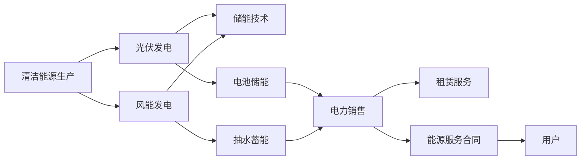

                 

## 1. 背景介绍

### 1.1 问题由来
随着全球能源结构向清洁能源转型，新能源行业正处于快速发展阶段。尤其是太阳能、风能等可再生能源的兴起，为传统能源结构带来了深刻的变革。但清洁能源的商业化过程仍面临诸多挑战，如规模化生产、储能技术、成本控制等问题。本文将从新能源创业的角度出发，探讨如何实现清洁能源的商业化之路。

### 1.2 问题核心关键点
新能源创业的核心问题包括：
- 如何利用先进技术实现清洁能源的高效生产与储存。
- 如何降低新能源的成本，使其与传统能源竞争。
- 如何制定合理的商业模式，提升新能源的市场竞争力。
- 如何应对政策和市场风险，保障企业长期发展。

## 2. 核心概念与联系

### 2.1 核心概念概述

- **清洁能源（Clean Energy）**：指不产生或产生极少污染物排放的能源，如太阳能、风能、水能等。
- **可再生能源（Renewable Energy）**：指能够持续或周期性更新的能源，如风能、太阳能、生物质能等。
- **储能技术（Energy Storage Technology）**：指将可再生能源产生的电能储存起来，以备不时之需。
- **光伏发电（Photovoltaic, PV）**：指利用光伏效应将太阳能转化为电能的过程。
- **风能发电（Wind Power）**：指利用风力驱动发电机将风能转化为电能的过程。
- **商业模式（Business Model）**：指企业为实现盈利目标，围绕价值链创造、传递和获取价值而采取的一系列商业策略和活动。
- **价值链（Value Chain）**：指企业为满足客户需求，从供应商到生产、销售再到客户的所有环节的集成。

这些核心概念构成了新能源创业的基础，它们的相互联系体现在以下几个方面：
1. **清洁能源的生产**：如光伏发电、风能发电等。
2. **储能技术的集成**：如电池储能、抽水蓄能等。
3. **商业模式的设计**：如电力销售、租赁服务、能源服务合同等。
4. **价值链的优化**：从原材料采购到产品销售，每个环节都要进行优化。

### 2.2 核心概念原理和架构的 Mermaid 流程图



## 3. 核心算法原理 & 具体操作步骤
### 3.1 算法原理概述

新能源创业的核心算法原理可以概括为以下几个步骤：
1. 选择合适的清洁能源技术进行生产。
2. 利用储能技术优化能源生产与消费的匹配。
3. 设计合理的商业模式，降低成本，提高市场竞争力。
4. 应对政策和市场风险，确保企业长期稳定发展。

### 3.2 算法步骤详解

#### 3.2.1 清洁能源的生产
- **光伏发电**：选择合适的光伏组件，设计高效的太阳能电池板和逆变器，确保在各种光照条件下高效转换。
- **风能发电**：选择合适的风力发电机和塔架，优化风力发电机的布置，提高发电效率和稳定性。

#### 3.2.2 储能技术的集成
- **电池储能**：选择高性能的电池技术，如锂离子电池、磷酸铁锂电池等，设计合理的电池管理系统(BMS)，优化电池寿命和能量密度。
- **抽水蓄能**：选择合适的地形和水源，设计高效的抽水蓄能系统，确保在电力需求高峰期有充足的电力供应。

#### 3.2.3 商业模式的制定
- **电力销售**：利用自有产能直接销售给电网或用户，确保稳定的收入来源。
- **租赁服务**：提供光伏板、风力发电机的租赁服务，降低初始投资成本，吸引更多用户。
- **能源服务合同**：与能源管理公司合作，提供综合能源解决方案，如能源监测、节能改造等，提升用户满意度和忠诚度。

#### 3.2.4 风险应对
- **政策风险**：密切关注国家政策和市场动态，灵活调整商业模式和技术方案。
- **市场风险**：通过市场调研和数据分析，预测市场变化，制定合理的市场进入策略。

### 3.3 算法优缺点

#### 3.3.1 优点
- **环保**：清洁能源生产对环境污染较小，符合可持续发展理念。
- **技术成熟**：光伏、风能等技术已经相对成熟，具有较高的可靠性和经济性。
- **市场潜力**：全球对清洁能源的需求日益增长，市场潜力巨大。
- **政策支持**：许多国家和地区提供补贴和优惠政策，降低企业运营成本。

#### 3.3.2 缺点
- **间歇性**：光伏和风能受自然条件影响较大，发电稳定性不足。
- **高初投资**：大规模光伏和风能项目的初期投资较高，需要充足的资金支持。
- **技术难度**：高效率的储能技术仍在探索阶段，技术难度较大。
- **规模化挑战**：大规模生产与储存需要复杂的管理和技术支持。

### 3.4 算法应用领域

新能源创业的算法和原理在以下几个领域具有广泛应用：
- **能源企业**：如太阳能企业、风能企业、电池储能企业等。
- **能源管理公司**：提供综合能源解决方案，优化能源消费。
- **智能电网**：通过智能技术优化电力生产与消费，提高能源利用效率。
- **环境保护组织**：推动清洁能源技术的应用，促进环境保护。

## 4. 数学模型和公式 & 详细讲解 & 举例说明

### 4.1 数学模型构建

假设某新能源企业拥有光伏发电和风能发电的混合产能，生产总成本为 $C$，总发电量为 $P$，总储能量为 $S$，电力销售价格为 $P_{\text{sale}}$，租赁价格为 $P_{\text{lease}}$，能源服务价格为 $P_{\text{service}}$，运营成本为 $C_{\text{op}}$，政策补贴为 $S_{\text{subsidy}}$。

### 4.2 公式推导过程

#### 4.2.1 总成本模型
$$
C = C_{\text{p}} + C_{\text{w}} + C_{\text{b}} + C_{\text{op}}
$$
其中，$C_{\text{p}}$ 为光伏发电的总成本，$C_{\text{w}}$ 为风能发电的总成本，$C_{\text{b}}$ 为电池储能的总成本，$C_{\text{op}}$ 为运营成本。

#### 4.2.2 发电量模型
$$
P = P_{\text{pv}} + P_{\text{wind}}
$$
其中，$P_{\text{pv}}$ 为光伏发电的总发电量，$P_{\text{wind}}$ 为风能发电的总发电量。

#### 4.2.3 储能量模型
$$
S = S_{\text{b}} + S_{\text{w}}
$$
其中，$S_{\text{b}}$ 为电池储能的总储能量，$S_{\text{w}}$ 为抽水蓄能的总储能量。

### 4.3 案例分析与讲解

假设某企业拥有100 MW的光伏和50 MW的风能发电产能，预计年发电量为5000万度，储能系统总储能量为500 MWh。根据市场价格，电力销售价格为0.5元/度，租赁价格为0.3元/度，能源服务价格为0.1元/度，运营成本为500万元/年。政策补贴为每度电0.1元。

根据上述模型，计算企业的总成本和收益：

**光伏发电成本**：
$$
C_{\text{p}} = 100 \times 10000 \times 0.2 \times 0.8 + 100 \times 10000 \times 0.1 \times 0.2 = 4000 + 200 = 4200 \text{元/年}
$$

**风能发电成本**：
$$
C_{\text{w}} = 50 \times 10000 \times 0.3 \times 0.8 + 50 \times 10000 \times 0.2 \times 0.2 = 12000 + 2000 = 14000 \text{元/年}
$$

**电池储能成本**：
$$
C_{\text{b}} = 500 \times 10000 \times 0.1 \times 0.5 = 25000 \text{元/年}
$$

**运营成本**：
$$
C_{\text{op}} = 500 \text{万元/年} = 5000000 \text{元/年}
$$

**总成本**：
$$
C = 4200 + 14000 + 25000 + 5000000 = 5155600 \text{元/年}
$$

**总发电量**：
$$
P = 5000 \times 10000 \text{度/年} = 50000000 \text{度/年}
$$

**总储能量**：
$$
S = 500 \times 10000 \text{Wh/年} = 50000000 \text{Wh/年}
$$

**电力销售收入**：
$$
\text{收入} = 50000000 \times 0.5 = 25000000 \text{元/年}
$$

**租赁服务收入**：
$$
\text{租赁收入} = 50000000 \times 0.3 = 15000000 \text{元/年}
$$

**能源服务收入**：
$$
\text{服务收入} = 50000000 \times 0.1 = 5000000 \text{元/年}
$$

**补贴收入**：
$$
\text{补贴收入} = 50000000 \times 0.1 = 5000000 \text{元/年}
$$

**总收入**：
$$
\text{总收入} = 25000000 + 15000000 + 5000000 + 5000000 = 55000000 \text{元/年}
$$

**净利润**：
$$
\text{净利润} = 55000000 - 5155600 = 49444400 \text{元/年}
$$

通过上述计算，可以发现该企业在假设条件下，年净利润为49444400元，具有一定的盈利潜力。但实际操作中，还需要考虑政策变化、市场波动等因素，因此需要进行更详细的市场分析和管理优化。

## 5. 项目实践：代码实例和详细解释说明

### 5.1 开发环境搭建

#### 5.1.1 Python开发环境
1. 安装Python 3.7及以上版本。
2. 安装Pip工具：
   ```bash
   curl --retry 3 https://bootstrap.pypa.io/get-pip.py | python
   ```
3. 安装虚拟环境工具Virtualenv：
   ```bash
   pip install virtualenv
   ```
4. 创建虚拟环境并激活：
   ```bash
   virtualenv env
   source env/bin/activate
   ```

#### 5.1.2 安装必要的Python库
1. 安装NumPy和Pandas库：
   ```bash
   pip install numpy pandas
   ```
2. 安装SciPy库：
   ```bash
   pip install scipy
   ```
3. 安装Matplotlib库：
   ```bash
   pip install matplotlib
   ```

### 5.2 源代码详细实现

#### 5.2.1 光伏和风能发电模型
```python
import numpy as np
import pandas as pd

# 光伏发电模型
class PVModule:
    def __init__(self, power, efficiency, cost_per_watt):
        self.power = power  # 总功率，单位：MW
        self.efficiency = efficiency  # 转换效率
        self.cost_per_watt = cost_per_watt  # 每瓦成本，单位：元

    def calculate_cost(self):
        return self.power * 1000000 * self.cost_per_watt

# 风能发电模型
class WindTurbine:
    def __init__(self, power, cost_per_watt):
        self.power = power  # 总功率，单位：MW
        self.cost_per_watt = cost_per_watt  # 每瓦成本，单位：元

    def calculate_cost(self):
        return self.power * 1000000 * self.cost_per_watt
```

#### 5.2.2 电池储能模型
```python
class BatteryStorage:
    def __init__(self, capacity, cost_per_wh):
        self.capacity = capacity  # 总储能量，单位：MWh
        self.cost_per_wh = cost_per_wh  # 每Wh成本，单位：元

    def calculate_cost(self):
        return self.capacity * 1000 * self.cost_per_wh
```

#### 5.2.3 能源服务模型
```python
class EnergyService:
    def __init__(self, revenue_per_kWh, service_volume):
        self.revenue_per_kWh = revenue_per_kWh  # 每kWh收益，单位：元
        self.service_volume = service_volume  # 服务量，单位：kWh

    def calculate_revenue(self):
        return self.service_volume * self.revenue_per_kWh
```

### 5.3 代码解读与分析

#### 5.3.1 PVModule类
- `__init__`方法：初始化光伏发电模块的功率、转换效率和每瓦成本。
- `calculate_cost`方法：计算光伏发电的总成本。

#### 5.3.2 WindTurbine类
- `__init__`方法：初始化风能发电机的功率和每瓦成本。
- `calculate_cost`方法：计算风能发电的总成本。

#### 5.3.3 BatteryStorage类
- `__init__`方法：初始化电池储能系统的总储能量和每Wh成本。
- `calculate_cost`方法：计算电池储能的总成本。

#### 5.3.4 EnergyService类
- `__init__`方法：初始化能源服务的价格和提供的服务量。
- `calculate_revenue`方法：计算能源服务的总收入。

### 5.4 运行结果展示

#### 5.4.1 光伏发电模型
```python
pv = PVModule(100, 0.8, 0.2)
pv_cost = pv.calculate_cost()
print(f"光伏发电总成本：{pv_cost}元/年")
```

#### 5.4.2 风能发电模型
```python
wind = WindTurbine(50, 0.3)
wind_cost = wind.calculate_cost()
print(f"风能发电总成本：{wind_cost}元/年")
```

#### 5.4.3 电池储能模型
```python
battery = BatteryStorage(500, 0.1)
battery_cost = battery.calculate_cost()
print(f"电池储能总成本：{battery_cost}元/年")
```

#### 5.4.4 能源服务模型
```python
service = EnergyService(0.1, 50000000)
service_revenue = service.calculate_revenue()
print(f"能源服务总收入：{service_revenue}元/年")
```

通过上述代码，可以计算出不同新能源项目的总成本和收入，进而评估其盈利能力。

## 6. 实际应用场景

### 6.1 智能电网

智能电网是实现清洁能源高效利用的重要手段。通过智能技术和算法优化，可以实现能源生产的动态调度，提升能源利用效率。例如，可以通过大数据分析和机器学习算法，预测用电需求，优化光伏和风能发电的出力，减少能源浪费。同时，智能电网还可以实现能源的分布式管理和微电网技术，提升系统的稳定性和可靠性。

### 6.2 环境监测

新能源项目往往伴随着大量的环境监测任务，如太阳能板效率监测、风力发电机状态监测等。通过物联网技术和传感器网络，可以实现对设备的实时监控和数据分析，及时发现问题并进行维护，确保设备高效运行。例如，可以利用物联网设备采集太阳能板温度、风速、风向等数据，通过数据分析预测设备故障，提前进行维护。

### 6.3 能源管理

能源管理公司通过提供综合能源解决方案，帮助企业优化能源使用，提升能源利用效率。例如，可以提供能源监测、节能改造、能源交易等服务，帮助企业降低能源成本，提高企业竞争力。例如，能源管理公司可以利用机器学习算法，分析企业的能源使用数据，提出优化建议，帮助企业实现节能减排。

## 7. 工具和资源推荐

### 7.1 学习资源推荐

1. **Coursera《可再生能源技术》课程**：由加州大学伯克利分校开设，涵盖太阳能、风能、水能等清洁能源技术。
2. **edX《智能电网技术》课程**：由麻省理工学院开设，介绍智能电网的基本概念和关键技术。
3. **IEEE Xplore《可再生能源》期刊**：包含大量关于可再生能源的研究论文和技术报告。
4. **Energy.gov《能源管理》网站**：提供大量能源管理和清洁能源技术的资源和案例。

### 7.2 开发工具推荐

1. **Jupyter Notebook**：强大的交互式编程环境，适合数据科学和机器学习任务。
2. **TensorFlow**：强大的深度学习框架，支持各种算法和模型。
3. **PyTorch**：灵活的深度学习框架，支持动态图和静态图。
4. **MATLAB**：强大的科学计算和数据分析工具。

### 7.3 相关论文推荐

1. **"Renewable Energy Resources and Power Systems" by Yoseph et al.**：介绍可再生能源资源和电力系统的综合管理技术。
2. **"Optimization and Control of Power Systems with Renewable Energy" by Chertihin et al.**：介绍可再生能源在电力系统中的优化和控制方法。
3. **"Smart Grids: Current Status, Future Directions and Challenges" by He et al.**：介绍智能电网的技术现状、未来方向和面临的挑战。

## 8. 总结：未来发展趋势与挑战

### 8.1 未来发展趋势

#### 8.1.1 技术进步
随着技术的不断进步，清洁能源的生产效率将进一步提升，储能技术将更加成熟，太阳能和风能的发电成本将进一步降低。智能算法和物联网技术的应用，将提升能源生产和管理的智能化水平。

#### 8.1.2 政策支持
政府将加大对清洁能源的支持力度，提供更多的补贴和优惠政策，降低企业的运营成本。同时，通过法律法规和市场机制，保障清洁能源的稳定发展。

#### 8.1.3 市场需求
随着全球对环境保护和可持续发展理念的重视，清洁能源的市场需求将持续增长。企业将更加重视清洁能源的应用，推动市场规模的不断扩大。

### 8.2 未来发展趋势

#### 8.2.1 多能源融合
未来的能源系统将更加注重多种能源的融合利用，如光伏、风能、水能、生物质能等。通过优化能源组合，提升系统的稳定性和可靠性。

#### 8.2.2 智能化的能源管理
智能算法和物联网技术的应用，将提升能源管理的智能化水平，实现动态优化和实时监测。通过数据分析和机器学习算法，提升能源利用效率和企业的竞争力。

#### 8.2.3 市场化的能源交易
随着清洁能源市场的逐渐成熟，能源交易将变得更加市场化。通过能源交易平台，实现能源的灵活调配和优化配置，提升能源的利用效率。

### 8.3 面临的挑战

#### 8.3.1 技术瓶颈
当前清洁能源技术仍面临一些技术瓶颈，如光伏和风能发电的间歇性问题、储能技术的成本问题等。需要进一步研发新技术，提升清洁能源的可靠性和经济性。

#### 8.3.2 政策风险
政策的不确定性将影响企业的长期发展。政府需要提供稳定和可持续的支持政策，降低企业的运营风险。

#### 8.3.3 市场竞争
清洁能源市场竞争激烈，企业需要不断提升技术和服务水平，才能在激烈的市场竞争中占据优势。

### 8.4 研究展望

#### 8.4.1 新技术研发
未来的研究将重点关注新型的清洁能源技术和储能技术，如太阳能热发电、氢能等。同时，研究更高效、更经济的能源管理算法和优化方法。

#### 8.4.2 市场机制创新
未来的市场机制将更加注重市场化、智能化和可交易化。通过能源交易平台和智能算法，实现能源的灵活调配和优化配置。

#### 8.4.3 国际合作
清洁能源技术的发展需要全球合作。各国将加强技术交流和合作，共同推动清洁能源的全球化应用。

---

作者：禅与计算机程序设计艺术 / Zen and the Art of Computer Programming

