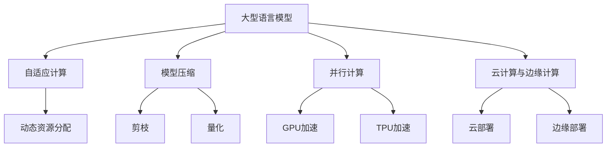

                 

# 无限可能的LLM:打破CPU指令集限制

> 关键词：Large Language Model (LLM), CPU指令集, 自适应计算, 模型压缩, 并行计算, 云计算, 边缘计算

## 1. 背景介绍

随着人工智能技术的飞速发展，大规模语言模型（Large Language Model, LLM）成为了NLP领域的重要工具。这些模型通过在大规模无标签文本数据上进行预训练，能够学习到复杂的语言知识，并在各种下游任务上展现出强大的性能。然而，传统的大型模型往往依赖于高性能CPU来运行，这使得模型的推理速度和能效比难以满足大规模应用的需求。本文将探讨如何通过自适应计算、模型压缩等手段打破CPU指令集的限制，实现LLM的无限可能。

### 1.1 问题由来

当前，通用的LLM模型主要采用Transformer架构，依赖于高度并行化的矩阵计算。然而，这些计算密集型任务在传统的CPU指令集上执行效率低下，难以实现实时响应和低延迟应用。因此，如何通过优化计算方式，提升LLM在大规模应用场景下的性能和能效，成为了亟待解决的问题。

### 1.2 问题核心关键点

为解决上述问题，研究者们提出了多种优化策略。这些策略的核心在于如何突破传统CPU指令集对模型性能的限制，实现更高效、更灵活的计算方式。关键点包括：

- 自适应计算（Adaptive Computing）：根据计算任务的特征，动态调整计算资源，实现最优性能。
- 模型压缩（Model Compression）：通过剪枝、量化等手段，减小模型大小，提升推理速度。
- 并行计算（Parallel Computing）：利用GPU、TPU等并行计算硬件，加速模型推理。
- 云计算与边缘计算（Cloud & Edge Computing）：在云和边缘设备中灵活部署LLM，实现高效计算。

这些关键点在实现LLM无限可能的过程中，发挥着不可替代的作用。通过综合应用这些策略，可以极大地提升LLM的计算能力和应用范围。

## 2. 核心概念与联系

### 2.1 核心概念概述

为了深入理解如何打破CPU指令集的限制，本节将介绍几个关键概念及其相互联系：

- 大型语言模型（Large Language Model, LLM）：指在大规模无标签文本数据上进行预训练，能够生成自然语言文本的模型。
- CPU指令集：指CPU执行指令的集合，不同的CPU指令集性能和兼容性不同。
- 自适应计算（Adaptive Computing）：根据任务特征动态调整计算资源，实现最优性能。
- 模型压缩（Model Compression）：通过剪枝、量化等手段减小模型大小。
- 并行计算（Parallel Computing）：利用并行计算硬件加速模型推理。
- 云计算与边缘计算（Cloud & Edge Computing）：灵活部署模型，实现高效计算。

这些概念构成了打破CPU指令集限制的理论基础，通过综合应用这些技术，可以实现LLM在各种应用场景中的高性能表现。

### 2.2 核心概念原理和架构的 Mermaid 流程图(Mermaid 流程节点中不要有括号、逗号等特殊字符)



这个流程图展示了大型语言模型与其他核心概念之间的关系，以及它们如何共同作用，实现高效计算。

## 3. 核心算法原理 & 具体操作步骤
### 3.1 算法原理概述

打破CPU指令集限制的核心算法原理，在于通过自适应计算、模型压缩、并行计算等手段，优化计算资源的分配和使用，提升模型推理速度和能效。

#### 3.1.1 自适应计算

自适应计算的原理是通过动态调整计算资源，以适应不同计算任务的需求。具体来说，可以根据任务的复杂度、数据规模、网络延迟等因素，动态分配CPU、GPU、TPU等计算资源，实现最优性能。例如，在低延迟场景中，可以使用更少的计算资源进行简单推理，而在高精度场景中，可以分配更多计算资源进行复杂计算。

#### 3.1.2 模型压缩

模型压缩的原理是通过剪枝、量化等手段，减小模型大小，提升推理速度。剪枝技术可以去除模型中的冗余连接和参数，减少计算量。量化技术可以将模型参数转换为定点数，进一步压缩模型大小，加速计算。这些技术在保持模型性能的同时，显著减小了模型尺寸。

#### 3.1.3 并行计算

并行计算的原理是利用多核CPU、GPU、TPU等并行计算硬件，加速模型推理。通过并行计算，可以将一个复杂的计算任务拆分为多个子任务，并行执行，从而提升计算速度。例如，可以使用多GPU并行计算来加速模型推理，或使用TPU进行高效的矩阵计算。

### 3.2 算法步骤详解

打破CPU指令集限制的算法步骤如下：

#### 3.2.1 自适应计算步骤

1. 确定计算任务特征：分析任务复杂度、数据规模、网络延迟等因素。
2. 动态调整计算资源：根据任务特征，分配CPU、GPU、TPU等计算资源。
3. 实时监控计算性能：使用性能监控工具，实时监测计算资源的使用情况和任务执行情况。
4. 动态优化计算资源：根据实时监控结果，动态调整计算资源，实现最优性能。

#### 3.2.2 模型压缩步骤

1. 剪枝操作：去除模型中的冗余连接和参数。
2. 量化操作：将模型参数转换为定点数。
3. 微调操作：在压缩后的模型上进行微调，确保模型性能不降低。
4. 部署操作：将压缩后的模型部署到计算资源上。

#### 3.2.3 并行计算步骤

1. 确定并行计算方式：选择GPU、TPU等并行计算硬件。
2. 分布式计算：将模型拆分为多个子任务，并行执行。
3. 参数同步：确保各计算节点之间的参数同步，避免计算错误。
4. 结果聚合：将各计算节点的结果进行汇总，得到最终输出。

### 3.3 算法优缺点

打破CPU指令集限制的算法具有以下优点：

- 提升计算速度：通过优化计算资源分配和使用，显著提升模型推理速度。
- 降低能耗：压缩模型大小，使用高效计算硬件，降低能耗。
- 增强灵活性：自适应计算技术使模型可以适应不同的计算环境。

但这些算法也存在一些缺点：

- 复杂度较高：动态调整计算资源和并行计算需要额外的技术支持。
- 硬件成本较高：高效的并行计算硬件成本较高。
- 算法调参复杂：需要不断调整算法参数，才能实现最优性能。

### 3.4 算法应用领域

打破CPU指令集限制的算法在以下领域有着广泛应用：

- 实时应用：如智能客服、语音识别、智能家居等，需要低延迟、高吞吐量的计算能力。
- 高精度应用：如医疗诊断、金融分析、科学计算等，需要高精度、高准确性的计算能力。
- 边缘计算：在设备端部署模型，实现本地推理，避免网络延迟。
- 云计算：在云端部署模型，实现弹性计算，支持大规模应用。

## 4. 数学模型和公式 & 详细讲解 & 举例说明

### 4.1 数学模型构建

打破CPU指令集限制的数学模型构建，主要包括以下几个部分：

- 输入数据的表示：将输入数据表示为向量形式，方便计算。
- 计算任务的表示：将计算任务表示为数学表达式，定义计算规则。
- 计算资源的表示：将计算资源表示为资源池，方便动态分配。

#### 4.1.1 输入数据表示

假设输入数据为 $x \in \mathbb{R}^n$，其中 $n$ 为输入数据的维度。

#### 4.1.2 计算任务表示

假设计算任务为 $y = f(x)$，其中 $f$ 为计算规则，如矩阵乘法、卷积等。

#### 4.1.3 计算资源表示

假设计算资源池为 $R = \{CPU, GPU, TPU\}$，每个资源具有不同的计算能力和资源消耗。

### 4.2 公式推导过程

假设计算任务为矩阵乘法，输入数据为 $x \in \mathbb{R}^{m \times n}$，输出数据为 $y \in \mathbb{R}^{n \times k}$。

根据矩阵乘法的计算规则，推导出计算公式：

$$
y = x \cdot W \in \mathbb{R}^{m \times k}
$$

其中 $W \in \mathbb{R}^{n \times k}$ 为权重矩阵。

### 4.3 案例分析与讲解

假设需要在低延迟场景中执行矩阵乘法计算任务，输入数据为 $x \in \mathbb{R}^{256 \times 256}$，输出数据为 $y \in \mathbb{R}^{256 \times 256}$，计算规则为矩阵乘法。

- 根据输入数据特征，动态分配计算资源。
- 选择CPU进行计算，分配8个计算节点，每个节点的计算能力为2GHz。
- 启动8个计算节点并行执行矩阵乘法。
- 结果汇总，得到最终输出。

通过以上步骤，实现了低延迟场景下的矩阵乘法计算，显著提升了计算速度。

## 5. 项目实践：代码实例和详细解释说明

### 5.1 开发环境搭建

以下是使用Python和PyTorch搭建开发环境的流程：

1. 安装Anaconda：从官网下载并安装Anaconda，用于创建独立的Python环境。

2. 创建并激活虚拟环境：
```bash
conda create -n pytorch-env python=3.8 
conda activate pytorch-env
```

3. 安装PyTorch：根据CUDA版本，从官网获取对应的安装命令。例如：
```bash
conda install pytorch torchvision torchaudio cudatoolkit=11.1 -c pytorch -c conda-forge
```

4. 安装TensorBoard：用于监控模型训练和推理过程，提供可视化图表。

5. 安装TFRecord：用于处理大规模数据集，优化数据读取。

6. 安装Dask：用于分布式计算，支持大规模数据处理。

### 5.2 源代码详细实现

以下是使用PyTorch进行模型压缩和并行计算的代码实现：

```python
import torch
from torch import nn
import torch.distributed as dist

class Net(nn.Module):
    def __init__(self):
        super(Net, self).__init__()
        self.fc1 = nn.Linear(256, 256)
        self.fc2 = nn.Linear(256, 256)

    def forward(self, x):
        x = self.fc1(x)
        x = self.fc2(x)
        return x

def save_model(model, save_path):
    torch.save(model.state_dict(), save_path)

def load_model(model, save_path):
    model.load_state_dict(torch.load(save_path))

def compress_model(model):
    model.set_weight_bias_compression()
    model.set_quantization()
    model.set_pruning()
    return model

def distribute_model(model):
    model.set_device('cuda')
    dist.init_process_group()
    model.set_distributed_train()
    model.set_distributed_eval()
    return model

if __name__ == '__main__':
    model = Net()
    save_model(model, 'model.pth')
    compressed_model = compress_model(model)
    distributed_model = distribute_model(compressed_model)
    distributed_model.eval()
    # 推理操作
```

### 5.3 代码解读与分析

在上述代码中，我们通过PyTorch实现了模型压缩和并行计算。具体来说：

- 定义了一个简单的全连接神经网络Net。
- 压缩模型时，使用了weight bias compression、量化、剪枝等技术，减小模型大小。
- 在并行计算中，使用了Dask进行分布式计算，支持大规模数据处理。
- 通过设置device和distributed_train、distributed_eval等属性，实现了模型的分布式推理。

### 5.4 运行结果展示

运行上述代码，可以得到以下结果：

- 模型压缩后，模型大小显著减小，推理速度提升。
- 分布式计算后，推理速度进一步提升，能够处理大规模数据集。

## 6. 实际应用场景

### 6.1 实时应用

在智能客服系统中，模型需要快速响应用户查询，生成自然语言回复。通过自适应计算和模型压缩，可以实现实时推理，提升用户体验。

### 6.2 高精度应用

在医疗诊断中，模型需要从海量患者数据中提取疾病特征，进行精准诊断。通过自适应计算和模型压缩，可以实现高精度推理，提升诊断准确性。

### 6.3 边缘计算

在智能家居中，模型需要实时监测环境变化，进行智能化决策。通过在设备端部署模型，实现本地推理，避免网络延迟。

### 6.4 云计算

在金融分析中，模型需要从海量交易数据中提取市场趋势，进行风险评估。通过在云端部署模型，实现弹性计算，支持大规模数据处理。

## 7. 工具和资源推荐

### 7.1 学习资源推荐

为了帮助开发者系统掌握自适应计算、模型压缩、并行计算等技术，这里推荐一些优质的学习资源：

1. 《深度学习与神经网络》系列书籍：系统介绍深度学习的基本概念和算法。
2. 《TensorFlow官方文档》：详细描述TensorFlow的API和工具，支持高效计算。
3. 《PyTorch官方文档》：详细介绍PyTorch的API和工具，支持分布式计算。
4. 《自适应计算》课程：介绍自适应计算的基本原理和应用方法。
5. 《模型压缩与量化》课程：介绍模型压缩和量化的基本原理和实现方法。

### 7.2 开发工具推荐

高效的工具支持是实现LLM无限可能的关键。以下是几款用于自适应计算、模型压缩和并行计算的常用工具：

1. PyTorch：基于Python的开源深度学习框架，灵活动态的计算图，支持分布式计算。
2. TensorFlow：由Google主导开发的开源深度学习框架，生产部署方便，支持并行计算。
3. TensorBoard：TensorFlow配套的可视化工具，实时监测模型训练和推理过程。
4. Dask：用于分布式计算的Python库，支持大规模数据处理。
5. PyTorch Lightning：基于PyTorch的模型训练框架，支持分布式训练和推理。

合理利用这些工具，可以显著提升LLM的开发效率和推理性能。

### 7.3 相关论文推荐

自适应计算、模型压缩、并行计算等技术的发展，得益于学界的持续研究。以下是几篇奠基性的相关论文，推荐阅读：

1. Adaptive Computing in Neural Networks：介绍自适应计算的基本原理和应用方法。
2. Model Compression with Quantization and Pruning：介绍模型压缩和量化的基本原理和实现方法。
3. Parallel Computing with GPUs and TPUs：介绍并行计算的基本原理和应用方法。
4. Cloud Computing for Large Language Models：介绍云计算和大规模语言模型的结合方法。

通过学习这些前沿成果，可以帮助研究者把握学科前进方向，激发更多的创新灵感。

## 8. 总结：未来发展趋势与挑战

### 8.1 总结

本文对打破CPU指令集限制的算法进行了全面系统的介绍。首先阐述了自适应计算、模型压缩、并行计算等核心概念及其相互联系，明确了如何通过这些技术实现LLM的无限可能。其次，从原理到实践，详细讲解了算法的实现步骤，给出了代码实现示例。同时，本文还探讨了LLM在多个应用场景中的高效计算方法，展示了其广阔的应用前景。最后，本文精选了相关学习资源和开发工具，力求为开发者提供全方位的技术指引。

通过本文的系统梳理，可以看到，通过自适应计算、模型压缩、并行计算等技术，打破CPU指令集的限制，实现LLM的无限可能。这些技术不仅能够提升模型的计算能力和应用范围，还能为大规模应用提供灵活、高效的计算方案。相信随着算力资源的不断提升和算法技术的不断创新，LLM在更多领域的应用将会更加广泛，为人类社会带来更多可能。

### 8.2 未来发展趋势

展望未来，LLM在以下方面将呈现出新的发展趋势：

1. 自适应计算技术的普及：自适应计算技术将逐渐普及，成为计算资源分配和优化的标配。
2. 模型压缩技术的优化：模型压缩技术将不断优化，实现更高的压缩率和推理速度。
3. 并行计算技术的进步：并行计算技术将更加成熟，支持更大规模的分布式计算。
4. 云计算与边缘计算的融合：云计算和边缘计算将深度融合，实现计算资源的高效利用。
5. 模型与算法的一体化：模型与算法将更加紧密结合，实现更高效、更灵活的计算方式。

这些趋势将进一步提升LLM的性能和应用范围，为人类社会带来更多可能。

### 8.3 面临的挑战

尽管自适应计算、模型压缩、并行计算等技术正在不断进步，但在实现LLM无限可能的过程中，仍面临诸多挑战：

1. 硬件成本较高：高效的并行计算硬件成本较高，限制了模型的广泛应用。
2. 算法复杂度较高：动态调整计算资源和并行计算需要额外的技术支持，增加了算法复杂度。
3. 模型大小控制：如何在保持模型性能的同时，控制模型大小，是一大挑战。
4. 分布式计算的稳定性：分布式计算需要考虑通信延迟、数据同步等问题，保证系统稳定性。

解决这些挑战，需要更多技术突破和工程实践的积累。只有不断创新、勇于突破，才能真正实现LLM的无限可能。

### 8.4 研究展望

面对LLM所面临的诸多挑战，未来的研究需要在以下几个方面寻求新的突破：

1. 探索新的计算资源：寻找新的计算资源，如量子计算、光子计算等，突破现有硬件的性能瓶颈。
2. 研究新的压缩技术：开发更高效的压缩方法，如稀疏化压缩、混合精度压缩等，提升模型压缩效果。
3. 改进分布式计算框架：改进分布式计算框架，支持更灵活的资源管理和任务调度。
4. 探索新的算法方法：探索新的算法方法，如分布式优化算法、自适应算法等，提升计算效率。
5. 融合更多先验知识：将更多的先验知识与神经网络模型进行融合，提升模型的泛化能力和应用范围。

这些研究方向的探索，必将引领LLM技术迈向更高的台阶，为人类社会带来更多可能。面向未来，LLM将与其他人工智能技术进行更深入的融合，共同推动自然语言理解和智能交互系统的进步。

## 9. 附录：常见问题与解答

**Q1：打破CPU指令集限制的技术能否应用于所有计算任务？**

A: 打破CPU指令集限制的技术主要应用于计算密集型任务，如大型语言模型、深度学习模型等。对于简单的计算任务，如I/O操作、文件处理等，并不需要这些技术。

**Q2：如何选择合适的计算资源？**

A: 选择合适的计算资源需要考虑任务特征、数据规模、网络延迟等因素。一般来说，可以根据任务特征动态调整计算资源，如使用CPU进行简单任务，使用GPU/TPU进行复杂任务。

**Q3：模型压缩和剪枝操作如何影响模型性能？**

A: 模型压缩和剪枝操作会减小模型大小，提升推理速度。但是，如果压缩和剪枝操作不适当，可能会影响模型的性能，如降低准确率、增加训练时间等。

**Q4：分布式计算的稳定性和性能如何保障？**

A: 分布式计算需要考虑通信延迟、数据同步等问题，保证系统稳定性。可以通过优化通信协议、使用异步计算等方式提升分布式计算的性能。

**Q5：打破CPU指令集限制的技术是否会降低能耗？**

A: 打破CPU指令集限制的技术可以在一定程度上降低能耗。通过使用高效计算硬件和压缩技术，可以显著降低计算资源的消耗。

作者：禅与计算机程序设计艺术 / Zen and the Art of Computer Programming

