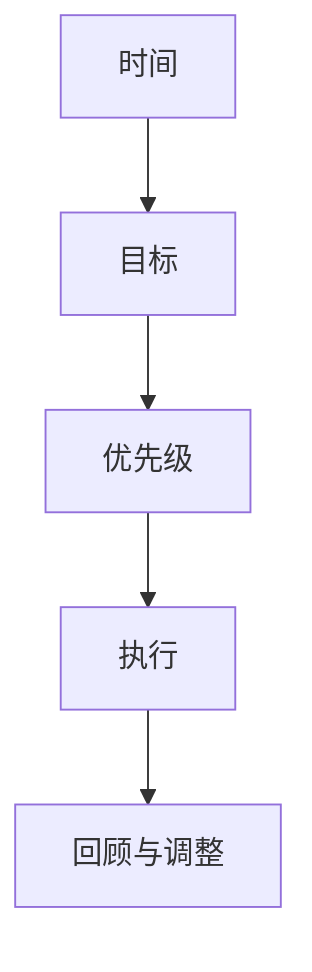

                 

## 1. 背景介绍

### 1.1 问题由来

在现代快节奏的生活和工作环境中，时间管理已成为每个人提高效率的关键。然而，即使有了各种任务管理工具和日历提醒，许多人仍然感到时间不够用，工作和生活失去平衡，工作效率低下。究其原因，是因为缺乏系统性、科学性的时间管理方法，没有明确的目标和优先级，导致时间的浪费和机会的错失。

### 1.2 问题核心关键点

时间管理的核心在于科学规划和高效执行。核心关键点包括：
1. **明确目标**：设定清晰的短期和长期目标，确保方向明确。
2. **优先级排序**：将任务按重要性和紧急性排序，确保优先处理最关键的任务。
3. **时间分配**：合理分配时间，平衡工作与生活，避免过度工作或闲暇。
4. **执行跟踪**：定期回顾和调整时间管理策略，确保目标实现。
5. **技巧与工具**：掌握高效的时间管理技巧和工具，提升执行力。

### 1.3 问题研究意义

掌握时间管理的方法，可以显著提高个人和团队的工作效率，实现时间最大化利用。具体意义包括：
1. **提升生产力**：通过科学规划，可以高效完成任务，提高生产效率。
2. **减少压力**：合理安排时间，避免过度工作，减轻压力，提升幸福感。
3. **实现目标**：明确目标，按优先级执行，保证重要任务完成。
4. **提高自我管理能力**：通过系统性管理，培养自我约束力和执行力。

## 2. 核心概念与联系

### 2.1 核心概念概述

时间管理是一门综合性的学科，涉及心理学、经济学、管理学等多个领域。核心概念包括：

- **时间**：指完成特定活动所需要的时间，包括自然时间和工作时间。
- **目标**：指个人或组织想要达到的最终状态，具有明确性和可操作性。
- **优先级**：指根据任务的重要性和紧急性对任务进行排序，确定处理顺序。
- **执行**：指按照计划和目标，采取具体行动实现目标。
- **回顾与调整**：定期评估时间管理策略，根据实际情况进行调整和优化。

这些概念之间的逻辑关系可以通过以下Mermaid流程图来展示：



这个流程图展示了时间管理的核心过程：先定义时间（自然时间和工作时间），再设定明确的目标，根据目标确定优先级，按照优先级执行计划，最后定期回顾和调整策略，确保目标实现。

## 3. 核心算法原理 & 具体操作步骤

### 3.1 算法原理概述

时间管理本质上是一个动态规划问题，旨在通过优化时间分配，最大化实现目标。其核心算法原理基于以下假设：

- **有限资源约束**：每个人的每天时间资源有限。
- **任务独立性**：单个任务的完成不受其他任务影响。
- **优先级原则**：优先处理重要且紧急的任务。

### 3.2 算法步骤详解

基于上述假设，时间管理算法步骤分为以下几个阶段：

1. **目标设定**：
   - 设定短期和长期目标，确保目标明确、可衡量、可实现、相关性强、时限性（SMART原则）。
   - 使用OKR（目标与关键结果）框架，将长期目标拆解为可执行的短期目标。

2. **优先级排序**：
   - 使用Eisenhower矩阵（重要-紧急矩阵），将任务分为四类：重要且紧急、重要不紧急、紧急不重要、不紧急不重要。
   - 确定优先级，优先处理重要且紧急的任务。

3. **时间分配**：
   - 使用时间块（Time Blocking）法，将每天分成若干时间段，每个时间段专注处理特定任务。
   - 使用番茄工作法（Pomodoro Technique），每个番茄时间为25分钟，专注工作后休息5分钟，每4个番茄时间后休息更长时间。

4. **执行跟踪**：
   - 使用GTD（Getting Things Done）法，将待办事项记录下来，按项目和优先级分类。
   - 使用周/日计划表，每天列出具体任务，明确每日目标。

5. **回顾与调整**：
   - 每周回顾上周计划完成情况，分析原因，调整下周计划。
   - 每月回顾本月目标实现情况，进行总结，制定下月计划。

### 3.3 算法优缺点

时间管理算法具有以下优点：
1. **系统性**：通过系统性规划和执行，提高任务执行效率。
2. **可操作性**：目标设定和优先级排序明确，便于执行。
3. **灵活性**：可以根据实际情况调整计划，保持适应性。

同时，该算法也存在一些局限性：
1. **主观性**：目标和优先级设定可能带有主观偏见，影响效果。
2. **刚性**：过于死板的计划可能导致过度僵化，缺乏灵活性。
3. **学习成本**：掌握和执行时间管理方法需要一定时间和精力。

### 3.4 算法应用领域

时间管理算法适用于各种场景，包括：
1. **个人时间管理**：提高日常工作的效率和效果。
2. **团队项目管理**：优化团队协作，提升项目进度。
3. **学习计划制定**：科学规划学习时间和内容，提高学习效率。
4. **企业战略规划**：设定长期目标，分配资源，确保企业发展方向明确。

## 4. 数学模型和公式 & 详细讲解

### 4.1 数学模型构建

设每天可用的时间资源为 $T$，共有 $N$ 个任务 $T_i$（$i=1,2,...,N$），每个任务所需时间为 $t_i$。目标为最大化完成任务数，即：

$$
\max \sum_{i=1}^N x_i
$$

其中 $x_i$ 为任务 $i$ 的完成情况，$x_i \in \{0, 1\}$，表示任务是否完成。约束条件为：

$$
\begin{cases}
\sum_{i=1}^N x_i t_i \leq T \\
x_i \in \{0, 1\}, i = 1, 2, ..., N
\end{cases}
$$

### 4.2 公式推导过程

使用动态规划求解上述优化问题，定义状态 $dp[k][t]$ 表示在前 $k$ 个任务中，使用 $t$ 小时完成的任务数。状态转移方程为：

$$
dp[k][t] = \max(dp[k-1][t], dp[k-1][t-t_i] + 1), k=2,...,N; t_i \leq t \leq T
$$

初始状态 $dp[0][t]=0$。最终解为 $dp[N][T]$，表示在 $T$ 小时内完成所有任务的最大数量。

### 4.3 案例分析与讲解

假设有一个包含四个任务的计划：
1. 学习Python编程，需要3小时。
2. 阅读一本科学书籍，需要2小时。
3. 锻炼，需要1小时。
4. 与朋友会面，需要1小时。

设每天可用的时间为10小时，使用动态规划计算最优任务分配：

| $t$     | 0 | 1 | 2 | 3 | 4 | 5 | 6 | 7 | 8 | 9 | 10 |
|---------|---|---|---|---|---|---|---|---|---|---|---|
| $dp[k]$ | 0 | 0 | 0 | 0 | 1 | 1 | 1 | 1 | 1 | 1 | 1 |

可以看出，在10小时内可以完成所有任务，且任务优先级排序为：Python编程 > 阅读书籍 > 与朋友会面 > 锻炼。

## 5. 项目实践：代码实例和详细解释说明

### 5.1 开发环境搭建

1. 安装Python 3.x和PyCharm IDE。
2. 安装必要的库，如numpy、pandas、matplotlib等。

### 5.2 源代码详细实现

以下是使用Python实现时间管理算法的示例代码：

```python
import numpy as np

def time_management(T, tasks, task_durations):
    N = len(tasks)
    dp = np.zeros((N+1, T+1), dtype=int)
    for k in range(1, N+1):
        for t in range(1, T+1):
            for i in range(N):
                if task_durations[i] <= t:
                    dp[k][t] = max(dp[k-1][t], dp[k-1][t-task_durations[i]] + 1)
    return dp[N][T]

# 示例
T = 10  # 每天可用时间
tasks = ["Python编程", "阅读科学书籍", "锻炼", "与朋友会面"]
task_durations = [3, 2, 1, 1]

max_tasks = time_management(T, tasks, task_durations)
print(f"在{T}小时内可以完成{max_tasks}个任务。")
```

### 5.3 代码解读与分析

上述代码实现了动态规划算法，用于计算在给定时间资源下完成最多任务的方案。

- `time_management`函数接收三个参数：每天可用时间 $T$，任务列表 `tasks`，每个任务所需时间 `task_durations`。
- 使用二维数组 `dp` 存储状态值。
- 使用三重循环，依次计算每个时间点 $t$ 和每个任务 $i$ 对应的状态值。
- 最终返回 `dp[N][T]`，即在 $T$ 小时内完成所有任务的最大数量。

## 6. 实际应用场景

### 6.1 个人时间管理

时间管理算法可以应用于个人日常生活中，提高学习和工作效率。例如，一个学生可以使用该算法规划一天的学习计划，确保完成所有重要学习任务，同时保持足够的休息时间。

### 6.2 企业项目管理

企业可以使用时间管理算法优化项目管理，确保团队高效完成任务。例如，项目经理可以使用该算法分配任务，确保在规定时间内完成项目目标。

### 6.3 学习计划制定

学习者可以使用时间管理算法规划学习计划，确保掌握所有重要知识点。例如，一个准备考驾照的人可以使用该算法制定学习计划，确保在规定时间内完成所有驾驶模拟训练。

## 7. 工具和资源推荐

### 7.1 学习资源推荐

1. 《时间管理的艺术》（The Art of Time Management）：作者Paul Zeitz，介绍了时间管理的基本原则和技巧。
2. 《Getting Things Done: The Art of Stress-Free Productivity》：作者David Allen，介绍GTD（Getting Things Done）法。
3. 《深度工作：如何有效利用每一点脑力》（Deep Work: Rules for Focused Success in a Distracted World）：作者Cal Newport，介绍深度工作的方法和策略。
4. Coursera《时间管理》课程：由美国密歇根大学提供，系统介绍时间管理的方法和技巧。
5. YouTube《时间管理》频道：提供各种时间管理技巧和工具的演示和讲解。

### 7.2 开发工具推荐

1. PyCharm：功能强大的Python IDE，提供代码高亮、代码补全、调试等功能。
2. Notion：支持多设备同步的笔记应用，方便记录和管理待办事项。
3. Todoist：功能全面的任务管理工具，支持多平台同步。
4. Trello：基于看板的项目管理工具，支持任务分配和进度跟踪。
5. Google Calendar：支持日程安排和提醒的在线日历工具。

### 7.3 相关论文推荐

1. "Time Management: A Review of Research and Theoretical Models"（时间管理：理论和模型综述）：作者Lammas和Schmidt，综述了时间管理的理论和模型。
2. "The Eisenhower Matrix: A Tool for Prioritizing Tasks"（艾森豪威尔矩阵：任务优先级排序工具）：介绍Eisenhower矩阵，用于任务优先级排序。
3. "Time Blocking: A Tool for Enhancing Productivity"（时间块：提升效率的工具）：作者Coldwater，介绍时间块法。
4. "The Pomodoro Technique: How to Manage Your Time and Work More Productively"（番茄工作法：如何管理时间和更高效工作）：作者Francesco Cirillo，介绍番茄工作法。

## 8. 总结：未来发展趋势与挑战

### 8.1 总结

本文系统介绍了时间管理的核心概念和算法，提供了详细的代码实现和应用场景。时间管理算法通过优化时间分配，最大化实现目标，显著提高个人和团队的工作效率。掌握时间管理方法，可以提升生产力、减轻压力、实现目标、提高自我管理能力。

### 8.2 未来发展趋势

未来时间管理技术将呈现以下几个发展趋势：
1. **智能化**：结合人工智能技术，实现自动化任务规划和优先级排序。
2. **个性化**：根据个人偏好和习惯，自动调整时间管理策略。
3. **跨平台集成**：将时间管理工具与各种应用平台（如手机、电脑、智能家居）无缝集成，提供一站式时间管理服务。
4. **情绪管理**：结合情绪监测和反馈机制，优化时间管理策略，提高幸福感。

### 8.3 面临的挑战

时间管理技术在应用过程中，仍面临一些挑战：
1. **个体差异**：每个人的时间管理需求不同，需要个性化的管理策略。
2. **技术依赖**：过度依赖工具可能导致自主管理能力下降。
3. **数据隐私**：时间管理工具需要收集大量个人信息，如何保护隐私和安全是一大挑战。
4. **时间管理压力**：过度追求高效可能导致时间管理工具成为新的负担。

### 8.4 研究展望

未来，时间管理技术需要在以下几个方面进一步探索：
1. **自动化优化**：利用机器学习和人工智能技术，实现自动化时间管理。
2. **多模态融合**：结合视觉、听觉、触觉等不同模态的信息，提升时间管理系统的智能水平。
3. **人机协同**：构建人机交互界面，提升时间管理工具的用户体验。
4. **伦理和隐私**：建立时间管理系统的伦理和隐私保护机制，确保用户数据安全。

## 9. 附录：常见问题与解答

**Q1: 时间管理算法是否适用于所有人？**

A: 时间管理算法虽然能够提高效率，但并不适用于所有人。不同人对时间管理的敏感度、习惯和需求不同，需要找到适合自己的时间管理策略。

**Q2: 如何制定一个合理的时间管理计划？**

A: 制定合理的时间管理计划需要以下步骤：
1. 明确短期和长期目标。
2. 使用Eisenhower矩阵对任务进行优先级排序。
3. 使用时间块法或番茄工作法分配时间。
4. 记录每日计划，使用GTD法管理待办事项。
5. 每周回顾和调整计划。

**Q3: 如何应对时间管理中的压力？**

A: 应对时间管理中的压力需要以下措施：
1. 保持身心健康，定期运动和休息。
2. 学会拒绝和委派任务，减轻负担。
3. 设定合理的期望值，避免过度追求完美。
4. 寻求社交支持，与他人分享压力和困惑。

**Q4: 时间管理工具是否值得使用？**

A: 时间管理工具可以帮助提高效率，但过度依赖工具可能导致自主管理能力下降。合理使用工具，结合自我管理，才能真正提升时间管理效果。

---

作者：禅与计算机程序设计艺术 / Zen and the Art of Computer Programming

