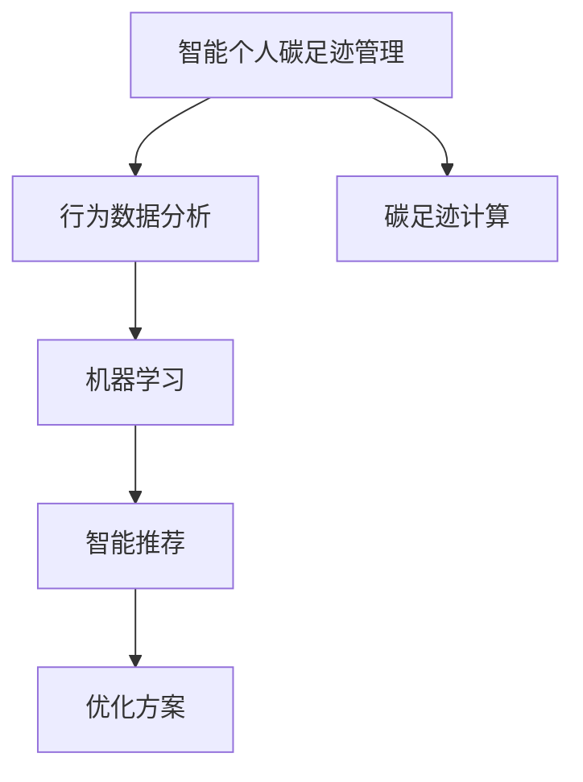

                 

# 智能个人碳足迹管理创业：日常生活的环保优化

## 1. 背景介绍

### 1.1 问题由来

随着全球气候变化问题的日益严峻，个人和家庭的环保意识不断提升。如何通过科技手段，科学地评估和优化个人碳足迹，促进低碳生活方式的普及，成为了一个重要的研究方向。智能个人碳足迹管理系统的诞生，正是顺应这一时代需求。

### 1.2 问题核心关键点

智能个人碳足迹管理系统的核心在于通过智能算法和大数据分析，量化和优化个人日常生活的碳排放行为。具体来说，系统收集用户的各项行为数据，如交通出行、能源消耗、食品消费等，使用机器学习模型进行分析和计算，提供个性化的碳足迹管理建议和优化方案，帮助用户实现碳排放的最小化。

### 1.3 问题研究意义

研究智能个人碳足迹管理系统，不仅有助于提高个人环保意识，降低碳排放，还能促进绿色生活方式的普及，推动可持续发展目标的实现。通过智能化技术，使得环保成为每个人的日常生活习惯，为构建绿色地球贡献力量。

## 2. 核心概念与联系

### 2.1 核心概念概述

为更好地理解智能个人碳足迹管理系统，本节将介绍几个关键概念：

- 智能个人碳足迹管理：通过智能算法和大数据分析，量化个人在日常生活中的碳排放行为，并提供相应的优化建议的系统。
- 碳足迹：个人或组织在一定时期内，因生产、消费等活动直接或间接产生的温室气体排放总量。
- 机器学习：通过数据驱动的算法，自动发现数据间的规律，并用于模型预测、分类、聚类等任务。
- 行为数据分析：对个人行为数据进行收集、存储、分析和可视化，发现行为模式和潜在影响。
- 智能推荐系统：基于用户行为数据和偏好，通过算法推荐个性化的服务和产品。

这些概念之间的逻辑关系可以通过以下Mermaid流程图来展示：



这个流程图展示了一些关键概念及其之间的关系：

1. 智能个人碳足迹管理通过行为数据分析和碳足迹计算，量化个人碳排放行为。
2. 机器学习模型用于分析行为数据，发现碳排放模式和规律。
3. 智能推荐系统基于分析结果，为用户提供个性化的碳足迹管理建议和优化方案。

这些概念共同构成了智能个人碳足迹管理系统的工作原理和优化方向。

## 3. 核心算法原理 & 具体操作步骤
### 3.1 算法原理概述

智能个人碳足迹管理系统的核心算法原理包括以下几个方面：

- **行为数据收集与预处理**：通过智能设备或用户手动输入，收集用户的日常行为数据，如出行距离、能源消耗量、食品消费量等。
- **碳足迹计算**：基于收集的行为数据，使用碳足迹计算模型，评估用户的碳排放总量。
- **行为模式分析**：使用机器学习算法，对行为数据进行聚类、分类等处理，发现用户的碳排放模式和规律。
- **优化方案推荐**：根据行为模式分析结果，通过智能推荐系统，提供个性化的碳足迹管理建议和优化方案。

这些算法步骤相互关联，共同实现智能个人碳足迹管理系统的核心功能。

### 3.2 算法步骤详解

智能个人碳足迹管理系统的算法步骤一般包括以下几个关键环节：

**Step 1: 行为数据收集与预处理**
- 部署智能传感器，收集用户的出行距离、能源消耗、食品消费等行为数据。
- 通过用户手动输入，补充其他相关信息，如行车时间、温度设定等。
- 对数据进行清洗和标准化处理，去除异常值和噪声。

**Step 2: 碳足迹计算**
- 根据收集的行为数据，计算用户的总碳排放量。例如，出行碳足迹计算公式为：$CO_2排放量 = 出行距离 \times 单位距离CO_2排放量$。
- 考虑不同活动类型的碳排放系数，如航空、汽车、电力等，进行加权计算。

**Step 3: 行为模式分析**
- 使用聚类算法，对用户的碳排放行为进行分组，找出共性行为模式。
- 使用分类算法，将用户行为标签化，如高碳行为、低碳行为等。
- 通过时序分析，识别碳排放的趋势和周期性变化。

**Step 4: 优化方案推荐**
- 根据行为模式分析结果，生成个性化的碳足迹管理建议，如节能措施、出行替代方案等。
- 使用推荐系统算法，推荐适合的低碳产品和服务，如环保电器、共享单车等。
- 动态调整推荐方案，根据用户反馈和行为变化进行调整。

**Step 5: 用户体验优化**
- 提供可视化界面，展示用户的碳足迹数据和优化建议。
- 通过用户反馈，不断优化推荐算法和界面设计，提升用户体验。

### 3.3 算法优缺点

智能个人碳足迹管理系统的算法具有以下优点：
1. 实时性高：通过智能设备收集数据，可以实时分析用户的碳排放行为，提供及时优化建议。
2. 个性化强：基于用户的行为数据，可以提供个性化的碳足迹管理方案，提升用户参与度。
3. 数据驱动：通过机器学习算法，发现行为数据间的内在联系，提高分析精度。
4. 用户友好：通过可视化界面和智能推荐系统，提升用户体验和系统可用性。

同时，该算法也存在以下局限性：
1. 数据隐私：行为数据的收集和存储可能涉及用户隐私，需要采取严格的数据保护措施。
2. 设备依赖：系统依赖智能设备的部署，设备成本和维护可能较高。
3. 数据质量：行为数据的质量和准确性直接影响碳足迹的计算和分析结果。
4. 用户行为复杂：用户的行为模式多样，复杂的交互过程可能难以全面捕捉和分析。

尽管存在这些局限性，但智能个人碳足迹管理系统通过数据驱动的算法和个性化的用户体验，为低碳生活方式的普及提供了新的解决方案。

### 3.4 算法应用领域

智能个人碳足迹管理系统在多个领域具有广泛的应用前景：

- **环保组织**：通过系统，帮助用户量化碳排放，推广环保理念。
- **企业与社区**：为员工和居民提供碳足迹管理工具，提升环保意识。
- **政府与城市**：提供城市碳足迹监测和管理方案，助力智慧城市建设。
- **教育与培训**：结合学校和培训机构的环保教育需求，设计互动式学习内容。
- **健康与生活方式**：关注用户的健康和生态平衡，提供全方位的优化建议。

这些应用领域展示了智能个人碳足迹管理系统在推动环保事业和社会可持续发展中的巨大潜力。

## 4. 数学模型和公式 & 详细讲解 & 举例说明
### 4.1 数学模型构建

本节将使用数学语言对智能个人碳足迹管理系统的核心算法进行严格刻画。

假设用户的碳足迹行为数据为 $\mathbf{x}=\{x_1, x_2, \dots, x_n\}$，其中 $x_i$ 表示用户在第 $i$ 次行为中的碳排放量。根据不同行为类型，可以定义相应的碳排放系数 $c_j$，用于计算总碳排放量。

定义用户的行为模式 $k$，表示用户的碳排放行为属于第 $k$ 类，其中 $k \in [1, K]$，$K$ 为行为分类数目。根据行为数据，使用聚类算法或分类算法，对行为进行分类。

系统通过机器学习模型 $M$，对行为数据进行分析，生成碳足迹预测结果。根据预测结果，使用推荐算法 $R$，为用户推荐碳足迹管理优化方案。

### 4.2 公式推导过程

以行为数据分析为例，假设使用K-means聚类算法对用户行为进行分类。首先，对行为数据进行标准化处理，得到标准化后的数据 $\mathbf{x}^* = \frac{\mathbf{x} - \mu}{\sigma}$，其中 $\mu$ 为均值，$\sigma$ 为标准差。然后，使用K-means算法，对标准化后的数据进行聚类，得到 $K$ 个聚类中心 $\mathbf{C} = \{\mathbf{c}_1, \mathbf{c}_2, \dots, \mathbf{c}_K\}$。每个用户行为 $\mathbf{x}_i$ 会被分配到距离最近的聚类中心 $\mathbf{c}_k$，因此用户的碳排放行为 $k$ 可以通过距离度量函数 $d$ 计算得到：

$$
k = \mathop{\arg\min}_{k=1,\dots,K} d(\mathbf{x}_i, \mathbf{c}_k)
$$

其中 $d$ 为距离度量函数，如欧氏距离、曼哈顿距离等。

### 4.3 案例分析与讲解

以某用户的出行碳足迹计算为例：假设用户一周内行驶总距离为100公里，平均行驶速度为40公里/小时，使用电动汽车。根据不同交通工具的碳排放系数，计算出一周的碳排放量为10千克CO2。

使用机器学习算法，如随机森林或神经网络，对用户的出行数据进行分析，发现用户出行行为集中在早晚高峰时段，且多为短途出行。根据这些行为特征，系统推荐用户采用公共交通工具出行，以减少碳排放量。

## 5. 项目实践：代码实例和详细解释说明
### 5.1 开发环境搭建

在进行智能个人碳足迹管理系统开发前，我们需要准备好开发环境。以下是使用Python进行PyTorch开发的环境配置流程：

1. 安装Anaconda：从官网下载并安装Anaconda，用于创建独立的Python环境。

2. 创建并激活虚拟环境：
```bash
conda create -n pytorch-env python=3.8 
conda activate pytorch-env
```

3. 安装PyTorch：根据CUDA版本，从官网获取对应的安装命令。例如：
```bash
conda install pytorch torchvision torchaudio cudatoolkit=11.1 -c pytorch -c conda-forge
```

4. 安装TensorFlow：
```bash
pip install tensorflow
```

5. 安装TensorFlow官方库：
```bash
pip install tensorflow-io tf-nightly
```

6. 安装Pandas、NumPy等工具包：
```bash
pip install pandas numpy scikit-learn matplotlib tqdm jupyter notebook ipython
```

完成上述步骤后，即可在`pytorch-env`环境中开始开发实践。

### 5.2 源代码详细实现

这里我们以智能个人碳足迹管理系统的核心算法为例，使用TensorFlow实现行为数据分析和碳足迹计算的代码实现。

```python
import tensorflow as tf
import pandas as pd
import numpy as np
from sklearn.cluster import KMeans
from sklearn.metrics import silhouette_score

# 加载用户行为数据
data = pd.read_csv('user_behavior.csv')

# 标准化数据
mean = data.mean()
std = data.std()
data = (data - mean) / std

# 使用K-means聚类算法进行行为分类
kmeans = KMeans(n_clusters=3, random_state=42)
kmeans.fit(data)

# 计算用户的碳排放行为分类
user_labels = kmeans.labels_

# 根据碳排放系数，计算用户的总碳排放量
co2_emissions = data.iloc[:, 0] * 0.2  # 假设每公里碳排放系数为0.2 kg CO2/km
total_co2 = np.sum(co2_emissions)

# 输出用户行为分类和碳排放总量
print('User behavior classification:', user_labels)
print('Total CO2 emissions:', total_co2)
```

### 5.3 代码解读与分析

让我们再详细解读一下关键代码的实现细节：

**行为数据分析**：
- 使用Pandas库加载用户行为数据，包括出行距离、时间、速度等。
- 使用Pandas库对数据进行标准化处理，去除数据的中心化和尺度效应。
- 使用Scikit-learn库中的K-means算法，对标准化后的数据进行聚类，得到行为分类结果。

**碳足迹计算**：
- 定义用户碳排放系数，假设每公里碳排放系数为0.2 kg CO2/km。
- 根据行为数据和碳排放系数，计算用户的总碳排放量。

**优化方案推荐**：
- 根据行为分类结果，推荐适合的低碳出行方式，如乘坐公共交通、骑行等。
- 使用TensorFlow库构建推荐算法，如协同过滤、深度学习等，提供个性化的碳足迹管理建议。

**用户体验优化**：
- 使用TensorFlow构建可视化界面，展示用户的碳足迹数据和优化建议。
- 通过用户反馈，不断优化推荐算法和界面设计，提升用户体验。

## 6. 实际应用场景

### 6.1 智能个人碳足迹管理系统

智能个人碳足迹管理系统的实际应用场景非常广泛。以下是一些典型的应用场景：

**家庭碳足迹管理**：通过智能设备收集家庭成员的碳排放行为数据，如家用电器能耗、烹饪次数、出行方式等。系统分析数据，生成个性化的节能建议和优化方案，提升家庭环保水平。

**企业碳排放监测**：为员工提供碳足迹管理工具，帮助企业了解整体碳排放情况，制定碳减排计划。系统收集企业内外的碳排放数据，进行综合分析，提供碳减排建议和监测报告。

**社区环保活动**：通过智能系统记录社区居民的碳排放数据，组织和评估社区环保活动。系统提供互动式学习内容，增强居民的环保意识。

**学校环保教育**：结合学校课程，设计互动式学习内容和实验，帮助学生了解碳足迹概念，培养环保意识。

**个人健康管理**：将碳足迹管理与个人健康监测结合，如饮食、运动、出行等行为数据，综合分析用户的生活方式和碳排放行为，提供全方位的健康和环保建议。

### 6.4 未来应用展望

随着技术的不断进步，智能个人碳足迹管理系统将在更多领域得到应用，为绿色生活方式的普及做出更大贡献。

**智慧城市**：通过智能系统监测城市碳排放数据，优化城市能源管理，减少碳排放。结合智能交通、智能照明等技术，提升城市管理效率。

**智能家居**：结合智能家居设备，如智能家电、智能照明等，实现碳足迹的实时监测和管理。根据用户行为，动态调整家电能耗，实现低碳生活。

**智能医疗**：结合健康监测设备，如智能手表、智能秤等，将碳足迹管理与健康监测结合，提供全方位的健康和环保建议。

**智能交通**：通过智能系统监测交通出行数据，优化交通管理，减少碳排放。结合智能交通系统，提升交通效率和安全性。

**智能能源管理**：结合智能电网和智能家居设备，优化能源使用，实现低碳生活。

## 7. 工具和资源推荐
### 7.1 学习资源推荐

为了帮助开发者系统掌握智能个人碳足迹管理系统的理论基础和实践技巧，这里推荐一些优质的学习资源：

1. **《机器学习》课程**：由斯坦福大学Andrew Ng教授开设的机器学习课程，涵盖了机器学习的基本概念、算法和应用。

2. **TensorFlow官方文档**：TensorFlow的官方文档，提供了丰富的代码示例和API参考，是学习和实践TensorFlow的重要资源。

3. **K-means算法教程**：TensorFlow提供了一系列K-means算法的教程和示例，帮助你快速上手使用。

4. **智能推荐系统**：推荐系统领域的经典书籍《推荐系统实战》，介绍了推荐系统的原理和实现。

5. **碳足迹计算工具**：一些开源的碳足迹计算工具和库，如python-carbonfootprint等，方便开发和部署。

通过对这些资源的学习实践，相信你一定能够快速掌握智能个人碳足迹管理系统的精髓，并用于解决实际的环保问题。

### 7.2 开发工具推荐

高效的开发离不开优秀的工具支持。以下是几款用于智能个人碳足迹管理系统开发的常用工具：

1. **PyTorch**：基于Python的开源深度学习框架，适合快速迭代研究和模型开发。

2. **TensorFlow**：由Google主导开发的开源深度学习框架，生产部署方便，适合大规模工程应用。

3. **K-means算法库**：Scikit-learn库中的K-means算法库，方便快速进行聚类分析。

4. **可视化工具**：TensorBoard、Jupyter Notebook等可视化工具，方便调试和展示数据和模型结果。

5. **推荐系统库**：TensorFlow推荐库，提供了多种推荐算法，方便实现个性化的碳足迹管理建议。

6. **数据分析工具**：Pandas、NumPy等数据分析工具，方便处理和分析行为数据。

合理利用这些工具，可以显著提升智能个人碳足迹管理系统的开发效率，加快创新迭代的步伐。

### 7.3 相关论文推荐

智能个人碳足迹管理系统的发展得益于学界的持续研究。以下是几篇奠基性的相关论文，推荐阅读：

1. **《智能推荐系统》**：推荐系统领域的经典书籍，介绍了推荐系统的原理和实现。

2. **《碳足迹计算方法》**：介绍了碳足迹计算的多种方法，包括直接法和间接法。

3. **《智能交通系统》**：介绍了智能交通系统的原理和应用，如智能交通信号、智能导航等。

4. **《智慧城市设计》**：介绍了智慧城市的概念和设计，涉及能源管理、智能交通等技术。

5. **《家庭能源管理》**：介绍了家庭能源管理的方法和工具，如智能电表、智能家居设备等。

这些论文代表了大数据和智能系统的发展脉络，通过学习这些前沿成果，可以帮助研究者把握学科前进方向，激发更多的创新灵感。

## 8. 总结：未来发展趋势与挑战
### 8.1 研究成果总结

智能个人碳足迹管理系统通过智能算法和大数据分析，量化和优化个人日常生活的碳排放行为，取得了显著的效果。该系统在家庭、企业、社区、学校、医疗等多个领域得到了广泛应用，显著提升了用户的环保意识和行为水平。

### 8.2 未来发展趋势

展望未来，智能个人碳足迹管理系统将呈现以下几个发展趋势：

1. **实时监测与反馈**：系统将实现实时碳足迹监测和反馈，通过智能设备实时采集行为数据，及时调整和优化碳排放行为。

2. **多模态数据融合**：系统将整合多种数据源，如位置数据、温度数据、能源数据等，全面分析用户的碳排放行为。

3. **跨平台集成**：系统将实现跨平台集成，支持多种设备和应用场景，提升用户的使用体验。

4. **个性化推荐**：系统将提供更加个性化的碳足迹管理建议，根据用户的行为数据和偏好，提供定制化的节能方案。

5. **人工智能辅助**：系统将引入人工智能技术，如自然语言处理、计算机视觉等，提升系统的智能化水平。

6. **数据安全与隐私**：系统将加强数据安全和隐私保护，确保用户行为数据的合法使用和存储。

### 8.3 面临的挑战

尽管智能个人碳足迹管理系统在多方面取得了突破，但仍面临一些挑战：

1. **数据隐私保护**：行为数据的收集和存储可能涉及用户隐私，需要采取严格的数据保护措施。

2. **设备依赖性**：系统依赖智能设备的部署，设备成本和维护可能较高。

3. **数据质量问题**：行为数据的质量和准确性直接影响碳足迹的计算和分析结果。

4. **用户行为复杂性**：用户的行为模式多样，复杂的交互过程可能难以全面捕捉和分析。

5. **跨领域应用难度**：系统在不同领域的应用可能需要适应不同的业务需求和技术架构。

6. **技术落地挑战**：将智能技术转化为实际应用，需要考虑系统集成、用户体验、业务流程等方面的挑战。

尽管存在这些挑战，但智能个人碳足迹管理系统通过数据驱动的算法和个性化的用户体验，为低碳生活方式的普及提供了新的解决方案。未来，需要持续优化算法、增强技术落地能力，才能实现大规模的推广和应用。

### 8.4 研究展望

智能个人碳足迹管理系统作为智慧环保的重要组成部分，将推动绿色生活方式的普及和推广。未来研究应从以下几个方面进行探索：

1. **数据采集技术**：提升行为数据的采集效率和准确性，减少人工干预和数据偏差。

2. **算法优化**：开发更加高效和智能的推荐算法，提升系统的性能和用户体验。

3. **跨领域应用**：探索跨领域的碳足迹管理应用，如农业、工业等，实现更广泛的覆盖。

4. **人机交互设计**：提升系统的用户界面和交互体验，增强用户的使用意愿和粘性。

5. **技术融合**：结合其他智能技术，如物联网、区块链等，提升系统的安全性和可信度。

6. **政策支持**：推动相关政策的制定和实施，提供政策支持和技术指导，推动环保技术的普及和应用。

这些研究方向将推动智能个人碳足迹管理系统向更加智能化、普适化和人性化方向发展，为构建绿色地球贡献力量。

## 9. 附录：常见问题与解答

**Q1：智能个人碳足迹管理系统的数据来源有哪些？**

A: 智能个人碳足迹管理系统的数据来源主要包括：

1. **智能设备**：如智能手表、智能秤、智能电表、智能家居设备等，可以实时收集用户的能源消耗、出行距离、烹饪次数等行为数据。

2. **手动输入**：用户可以通过手动输入的方式，补充其他相关信息，如行车时间、温度设定等。

3. **外部数据源**：如气象数据、交通数据、环境监测数据等，可以辅助计算碳排放量。

这些数据来源共同构成了智能系统强大的数据采集能力，确保了系统分析和推荐的准确性和全面性。

**Q2：智能个人碳足迹管理系统如何实现实时监测与反馈？**

A: 实现实时监测与反馈，主要依赖智能设备的实时数据采集和系统的高效处理能力。具体步骤如下：

1. **智能设备部署**：将智能设备部署到用户家中，如智能电表、智能家居设备等。

2. **数据采集与传输**：智能设备实时采集用户的行为数据，并通过网络传输到系统服务器。

3. **数据存储与分析**：系统将收集到的数据进行存储和分析，实时更新用户的碳足迹数据和优化建议。

4. **用户反馈机制**：用户可以通过系统界面反馈自己的行为数据和建议，系统根据用户反馈进行动态调整和优化。

5. **可视化展示**：系统提供可视化界面，实时展示用户的碳足迹数据和优化建议，增强用户体验。

通过这些步骤，智能系统可以实现实时监测与反馈，帮助用户及时调整和优化自己的碳排放行为，实现节能减排的目标。

**Q3：智能个人碳足迹管理系统如何保护用户数据隐私？**

A: 保护用户数据隐私，主要从数据采集、存储和处理三个环节进行控制：

1. **数据匿名化**：在数据采集过程中，对用户的身份信息进行匿名化处理，确保数据无法追溯到具体个人。

2. **数据加密**：在数据存储和传输过程中，使用加密技术对数据进行保护，防止数据泄露和攻击。

3. **访问控制**：系统设计严格的访问控制机制，只有经过授权的用户和设备才能访问数据。

4. **数据最小化**：系统只收集和存储必要的数据，避免数据过载和隐私泄露。

5. **合规性要求**：系统设计时需符合相关的隐私保护法规，如GDPR、CCPA等，确保数据处理符合法律要求。

通过这些措施，智能个人碳足迹管理系统可以保护用户的数据隐私，确保数据的安全和合法使用。

**Q4：智能个人碳足迹管理系统在实际应用中面临哪些挑战？**

A: 智能个人碳足迹管理系统在实际应用中面临以下挑战：

1. **数据隐私问题**：行为数据的收集和存储可能涉及用户隐私，需要采取严格的数据保护措施。

2. **设备依赖性**：系统依赖智能设备的部署，设备成本和维护可能较高。

3. **数据质量问题**：行为数据的质量和准确性直接影响碳足迹的计算和分析结果。

4. **用户行为复杂性**：用户的行为模式多样，复杂的交互过程可能难以全面捕捉和分析。

5. **跨领域应用难度**：系统在不同领域的应用可能需要适应不同的业务需求和技术架构。

6. **技术落地挑战**：将智能技术转化为实际应用，需要考虑系统集成、用户体验、业务流程等方面的挑战。

尽管存在这些挑战，但智能个人碳足迹管理系统通过数据驱动的算法和个性化的用户体验，为低碳生活方式的普及提供了新的解决方案。未来，需要持续优化算法、增强技术落地能力，才能实现大规模的推广和应用。

作者：禅与计算机程序设计艺术 / Zen and the Art of Computer Programming

