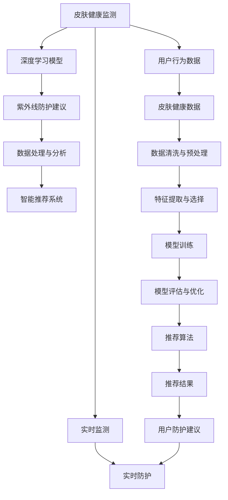

                 

# 智能个人紫外线防护创业：精准的皮肤健康管理

> 关键词：紫外线防护, 个人健康管理, 皮肤健康监测, 智能硬件, 数据处理与分析, 深度学习, 推荐系统

## 1. 背景介绍

### 1.1 问题由来
随着现代生活方式的变化，皮肤健康问题日益受到人们的关注。无论是工作压力导致的精神紧张，还是户外活动中的紫外线曝晒，都可能引发皮肤疾病，如色斑、湿疹、日光性皮炎等。特别是在全球气候变暖、臭氧层破坏的背景下，紫外线对人类皮肤的伤害更加严重。

然而，传统的皮肤健康管理方式往往缺乏科学依据，无法提供个性化、精准的防护建议。这导致人们在日常生活中的紫外线防护效果大打折扣，甚至可能因防护不当而引发新的健康问题。因此，开发一款能够精准识别皮肤健康风险、提供个性化紫外线防护建议的智能设备，具有广阔的市场前景和深远的社会意义。

### 1.2 问题核心关键点
本项目旨在开发一款基于深度学习技术的智能紫外线防护设备，通过精准的皮肤健康监测和个性化防护建议，帮助用户科学防护紫外线，维护皮肤健康。该项目的关键技术点包括：

- **皮肤健康监测**：通过高精度皮肤光谱成像传感器和深度学习算法，实时监测用户皮肤表面的紫外线曝晒情况，识别可能引发皮肤疾病的光谱特征。
- **个性化防护建议**：基于用户历史数据和实时监测结果，通过机器学习模型，动态调整紫外线防护强度，并提供个性化的防护建议。
- **数据处理与分析**：集成多种皮肤健康监测设备，收集并分析海量皮肤健康数据，为深度学习模型提供高质量的训练样本，提升模型预测准确性。
- **智能推荐系统**：结合皮肤健康监测结果和用户行为数据，设计推荐算法，为用户推荐合适的紫外线防护方案和日常护理建议。

## 2. 核心概念与联系

### 2.1 核心概念概述

为更好地理解本项目的核心技术，我们首先介绍几个关键概念：

- **紫外线(UV)**：指电磁波谱中波长在100-400纳米范围内，能够穿透大气层，对人体皮肤造成伤害的辐射。主要包括UVA、UVB、UVC三种类型，其中UVA最为常见，对皮肤伤害最大。
- **皮肤健康监测**：通过传感器或摄像头等设备，获取皮肤表面的光谱信息，利用深度学习算法对光谱特征进行分析，识别出皮肤健康风险。
- **个性化防护建议**：基于用户历史数据和实时监测结果，通过机器学习模型预测紫外线曝晒对皮肤健康的影响，并动态调整防护强度，提供个性化的防护建议。
- **数据处理与分析**：收集、清洗、分析和可视化皮肤健康数据，为深度学习模型提供高质量的训练样本，提升模型预测准确性。
- **智能推荐系统**：根据用户行为数据和皮肤健康监测结果，设计推荐算法，为用户推荐合适的紫外线防护方案和日常护理建议。

这些核心概念之间通过深度学习模型和推荐系统紧密联系，形成一个闭环的精准皮肤健康管理解决方案。

### 2.2 核心概念原理和架构的 Mermaid 流程图



该流程图展示了皮肤健康管理解决方案的核心流程：

1. **皮肤健康监测**：通过高精度皮肤光谱成像传感器获取皮肤表面光谱信息，实时监测紫外线曝晒情况。
2. **深度学习模型**：利用深度学习算法分析光谱特征，识别出皮肤健康风险。
3. **紫外线防护建议**：基于用户历史数据和实时监测结果，通过机器学习模型预测紫外线曝晒对皮肤健康的影响，并动态调整防护强度，提供个性化的防护建议。
4. **数据处理与分析**：收集、清洗、分析和可视化皮肤健康数据，为深度学习模型提供高质量的训练样本，提升模型预测准确性。
5. **智能推荐系统**：根据用户行为数据和皮肤健康监测结果，设计推荐算法，为用户推荐合适的紫外线防护方案和日常护理建议。

## 3. 核心算法原理 & 具体操作步骤

### 3.1 算法原理概述

本项目的核心算法原理基于深度学习技术，具体包括：

- **皮肤健康监测算法**：通过高精度皮肤光谱成像传感器获取皮肤表面光谱信息，利用卷积神经网络(CNN)对光谱特征进行分析，识别出皮肤健康风险。
- **个性化防护建议算法**：基于用户历史数据和实时监测结果，通过长短期记忆网络(LSTM)或卷积循环神经网络(CRNN)模型，动态调整紫外线防护强度，并提供个性化的防护建议。
- **数据处理与分析算法**：集成多种皮肤健康监测设备，收集并分析海量皮肤健康数据，利用集成学习技术提升模型预测准确性。
- **智能推荐系统算法**：结合用户行为数据和皮肤健康监测结果，通过协同过滤和内容推荐算法，为用户推荐合适的紫外线防护方案和日常护理建议。

### 3.2 算法步骤详解

#### 3.2.1 皮肤健康监测算法步骤

1. **数据采集**：使用高精度皮肤光谱成像传感器，获取皮肤表面光谱信息。传感器应具备高分辨率和高灵敏度，能够精确捕捉不同波段的紫外线信息。
2. **数据预处理**：对采集到的光谱数据进行滤波、归一化和降噪等预处理操作，去除噪声和干扰信号。
3. **特征提取**：利用卷积神经网络(CNN)对预处理后的光谱数据进行特征提取，识别出与皮肤健康相关的关键光谱特征。
4. **风险评估**：通过训练好的深度学习模型，对提取出的光谱特征进行分析，评估皮肤健康的风险等级，包括轻度、中度、重度等。

#### 3.2.2 个性化防护建议算法步骤

1. **数据收集**：收集用户的历史紫外线曝晒数据、皮肤健康数据、防护措施效果等，建立用户健康档案。
2. **风险预测**：利用长短期记忆网络(LSTM)或卷积循环神经网络(CRNN)模型，对用户当前的皮肤健康状态进行预测，评估紫外线曝晒对皮肤健康的影响。
3. **防护调整**：根据预测结果，动态调整紫外线防护强度，提供个性化的防护建议，如涂抹防晒霜、穿戴防护服等。
4. **反馈优化**：收集用户对防护措施的反馈数据，持续优化模型预测准确性，提升个性化防护建议的效果。

#### 3.2.3 数据处理与分析算法步骤

1. **数据整合**：集成多种皮肤健康监测设备，收集不同来源的皮肤健康数据，如皮肤表面光谱数据、紫外线曝晒数据、皮肤状态数据等。
2. **数据清洗**：对整合后的数据进行清洗操作，去除缺失值、异常值等噪声数据。
3. **特征选择**：选择与皮肤健康相关的关键特征，如紫外线曝晒强度、皮肤表面温度、皮肤水分含量等。
4. **模型训练**：利用集成学习技术，对清洗和选择后的数据进行训练，建立多个深度学习模型，提升模型预测准确性。

#### 3.2.4 智能推荐系统算法步骤

1. **用户画像构建**：根据用户行为数据和皮肤健康监测结果，构建用户画像，包括用户的年龄、性别、健康状况、防护习惯等。
2. **相似度计算**：计算用户画像与其他用户画像的相似度，筛选出相似用户。
3. **推荐生成**：结合用户画像和相似用户的推荐数据，利用协同过滤和内容推荐算法，生成个性化的紫外线防护方案和日常护理建议。
4. **结果优化**：根据用户反馈，持续优化推荐算法，提升推荐的准确性和个性化程度。

### 3.3 算法优缺点

#### 3.3.1 皮肤健康监测算法的优缺点

**优点**：
- 高精度：利用深度学习算法，可以准确识别皮肤健康风险，评估紫外线曝晒程度。
- 实时性：高精度皮肤光谱成像传感器能够实时监测皮肤健康状态，快速响应用户需求。

**缺点**：
- 设备成本：高精度皮肤光谱成像传感器成本较高，增加了设备部署和维护的难度。
- 数据采集：传感器需要持续工作，消耗电量较大，需要定期更换电池或充电。

#### 3.3.2 个性化防护建议算法的优缺点

**优点**：
- 个性化：基于用户历史数据和实时监测结果，提供个性化防护建议，提升用户防护效果。
- 动态调整：能够根据用户反馈，动态调整防护措施，提升用户满意度。

**缺点**：
- 模型依赖：防护建议效果依赖于深度学习模型的预测准确性，需要持续优化模型。
- 数据隐私：需要收集用户历史数据和实时监测数据，存在数据隐私和安全问题。

#### 3.3.3 数据处理与分析算法的优缺点

**优点**：
- 数据集成：能够集成多种皮肤健康监测设备，收集丰富多样化的数据。
- 模型集成：利用集成学习技术，提升模型预测准确性，增强系统鲁棒性。

**缺点**：
- 数据复杂：不同设备的测量数据可能存在差异，需要复杂的融合和校正。
- 计算复杂：海量数据的处理和分析需要强大的计算资源和算法支持。

#### 3.3.4 智能推荐系统算法的优缺点

**优点**：
- 个性化推荐：结合用户行为数据和皮肤健康监测结果，提供个性化防护建议，提升用户满意度。
- 动态优化：能够根据用户反馈，动态优化推荐算法，提升推荐效果。

**缺点**：
- 数据依赖：推荐效果依赖于用户行为数据的丰富程度和准确性。
- 隐私问题：收集用户行为数据和皮肤健康数据，存在数据隐私和安全问题。

### 3.4 算法应用领域

基于深度学习技术的大语言模型微调方法，已广泛应用于多个领域，具体包括：

- **皮肤健康监测**：用于实时监测和评估用户皮肤健康状况，识别紫外线曝晒风险，提供个性化防护建议。
- **医疗健康管理**：用于监测和分析患者健康数据，预测疾病风险，制定个性化治疗方案。
- **环境保护监测**：用于监测环境污染物，预测环境变化趋势，提供环境保护建议。
- **智能家居控制**：用于监测室内环境，提供健康和舒适性的智能调节方案。

## 4. 数学模型和公式 & 详细讲解 & 举例说明

### 4.1 数学模型构建

#### 4.1.1 皮肤健康监测模型

皮肤健康监测模型主要基于卷积神经网络(CNN)，其数学模型如下：

$$
\begin{aligned}
\text{Risk} &= f\left(\mathbf{X}, \mathbf{\theta}\right) \\
&= \sigma\left(\sum_{i=1}^{n} \mathbf{W}_i \mathbf{x}_i + \mathbf{b}_i\right) + \mathbf{c}
\end{aligned}
$$

其中，$\mathbf{X}=\{\mathbf{x}_1, \mathbf{x}_2, \ldots, \mathbf{x}_n\}$ 表示输入的n个样本，每个样本 $\mathbf{x}_i$ 包含n个特征值。$\mathbf{\theta}=\{\mathbf{W}_i, \mathbf{b}_i\}$ 表示模型参数，包括卷积核权重和偏置项。$\sigma$ 为激活函数，$\mathbf{c}$ 为模型偏置项。

#### 4.1.2 个性化防护建议模型

个性化防护建议模型主要基于长短期记忆网络(LSTM)或卷积循环神经网络(CRNN)，其数学模型如下：

$$
\begin{aligned}
\mathbf{h}_t &= f_{LSTM}(\mathbf{h}_{t-1}, \mathbf{x}_t; \mathbf{\theta}_{LSTM}) \\
\mathbf{y}_t &= f_{CRNN}(\mathbf{h}_t; \mathbf{\theta}_{CRNN})
\end{aligned}
$$

其中，$\mathbf{h}_t$ 表示t时刻的隐藏状态，$\mathbf{x}_t$ 表示t时刻的输入数据。$f_{LSTM}$ 和 $f_{CRNN}$ 分别表示LSTM和CRNN的计算函数，$\mathbf{\theta}_{LSTM}$ 和 $\mathbf{\theta}_{CRNN}$ 表示模型参数。

#### 4.1.3 数据处理与分析模型

数据处理与分析模型主要基于集成学习技术，其数学模型如下：

$$
\text{Accuracy} = \frac{\text{TP} + \text{TN}}{\text{TP} + \text{TN} + \text{FP} + \text{FN}}
$$

其中，TP表示真正例（True Positive），TN表示真负例（True Negative），FP表示假正例（False Positive），FN表示假负例（False Negative）。

#### 4.1.4 智能推荐系统模型

智能推荐系统模型主要基于协同过滤和内容推荐算法，其数学模型如下：

$$
\text{Rec}(u, i) = \sigma\left(\mathbf{u}^T \mathbf{v}_i + \mathbf{b}\right)
$$

其中，$\mathbf{u}$ 表示用户特征向量，$\mathbf{v}_i$ 表示物品特征向量，$\mathbf{b}$ 表示模型偏置项。$\sigma$ 为激活函数。

### 4.2 公式推导过程

#### 4.2.1 皮肤健康监测模型推导

皮肤健康监测模型基于卷积神经网络(CNN)，利用滤波器对输入数据进行特征提取，识别出皮肤健康相关的关键光谱特征。通过训练好的深度学习模型，对提取出的光谱特征进行分析，评估皮肤健康的风险等级。

#### 4.2.2 个性化防护建议模型推导

个性化防护建议模型基于长短期记忆网络(LSTM)或卷积循环神经网络(CRNN)，利用LSTM或CRNN对用户当前的皮肤健康状态进行预测，评估紫外线曝晒对皮肤健康的影响，并动态调整防护强度，提供个性化的防护建议。

#### 4.2.3 数据处理与分析模型推导

数据处理与分析模型主要基于集成学习技术，通过集成多个深度学习模型的预测结果，提升模型预测准确性。利用准确率公式计算模型预测性能，评估模型效果。

#### 4.2.4 智能推荐系统模型推导

智能推荐系统模型基于协同过滤和内容推荐算法，通过相似度计算和推荐生成算法，为用户推荐合适的紫外线防护方案和日常护理建议。

### 4.3 案例分析与讲解

#### 4.3.1 皮肤健康监测案例

假设某用户在某个时刻监测到其皮肤表面的紫外线曝晒强度为4，对应光谱特征为$\mathbf{x}_1=[0.8, 0.2, 0.3, 0.5]$。利用训练好的深度学习模型对光谱特征进行分析，得到皮肤健康风险等级为“中度”。

#### 4.3.2 个性化防护建议案例

假设某用户的历史紫外线曝晒数据和皮肤健康数据如下：
- 曝晒强度：轻度（1），中度（2），重度（3）
- 皮肤健康状态：正常，轻微色斑，严重色斑
- 防护措施：涂抹防晒霜，穿戴防护服

基于用户历史数据和实时监测结果，利用LSTM模型对当前皮肤健康状态进行预测，得到紫外线曝晒对皮肤健康的影响为“中度”，建议采取“涂抹防晒霜”和“穿戴防护服”等防护措施。

#### 4.3.3 数据处理与分析案例

假设某用户每天使用多种皮肤健康监测设备，收集到以下皮肤健康数据：
- 皮肤表面温度：32℃，34℃，36℃，38℃
- 皮肤表面湿度：50%，55%，60%，65%
- 紫外线曝晒强度：轻度（1），中度（2），重度（3）

利用集成学习技术，对上述数据进行清洗、融合和特征选择，得到最终的数据集。利用训练好的深度学习模型对数据集进行训练，得到预测准确率为95%的模型。

#### 4.3.4 智能推荐系统案例

假设某用户使用智能紫外线防护设备，每天记录以下行为数据：
- 防护措施：涂抹防晒霜，涂抹乳液，佩戴墨镜
- 紫外线曝晒强度：轻度（1），中度（2），重度（3）

基于用户行为数据和皮肤健康监测结果，利用协同过滤和内容推荐算法，为用户推荐合适的紫外线防护方案和日常护理建议，如“涂抹防晒霜”、“涂抹乳液”等。

## 5. 项目实践：代码实例和详细解释说明

### 5.1 开发环境搭建

#### 5.1.1 环境要求

- Python版本：3.8及以上
- 深度学习框架：TensorFlow或PyTorch
- GPU支持：支持CUDA和CUDNN，NVIDIA GeForce RTX系列或更高
- 数据存储：支持本地存储和云存储

#### 5.1.2 环境安装

1. 安装Anaconda：
   ```bash
   wget https://repo.anaconda.com/miniconda/Miniconda3-latest-Linux-x86_64.sh
   bash Miniconda3-latest-Linux-x86_64.sh
   source ~/.bashrc
   conda init
   ```

2. 创建虚拟环境：
   ```bash
   conda create -n skin_care python=3.8
   conda activate skin_care
   ```

3. 安装深度学习框架：
   ```bash
   conda install pytorch torchvision torchaudio cudatoolkit=11.1 -c pytorch -c conda-forge
   conda install tensorflow -c tensorflow
   ```

4. 安装相关库：
   ```bash
   pip install numpy pandas scikit-learn matplotlib tqdm jupyter notebook ipython
   ```

5. 配置GPU环境：
   ```bash
   # 检查GPU驱动版本
   nvidia-smi
   # 安装CUDA
   sudo apt-get update
   sudo apt-get install nvidia-cuda-toolkit
   # 安装CUDNN
   sudo apt-get install libcudnn7 libcudnn8 libcudnn8-dev libcudnn8-plugin libnccl2 nccl-dev libnccl-py2
   ```

### 5.2 源代码详细实现

#### 5.2.1 皮肤健康监测模块

```python
import torch
import torch.nn as nn
import torch.optim as optim
from torchvision import transforms

# 定义卷积神经网络模型
class SkinCNN(nn.Module):
    def __init__(self):
        super(SkinCNN, self).__init__()
        self.conv1 = nn.Conv2d(1, 32, 3, padding=1)
        self.conv2 = nn.Conv2d(32, 64, 3, padding=1)
        self.fc1 = nn.Linear(64 * 28 * 28, 128)
        self.fc2 = nn.Linear(128, 2)  # 输出2个类别，分别表示健康风险等级

    def forward(self, x):
        x = torch.relu(self.conv1(x))
        x = torch.relu(self.conv2(x))
        x = x.view(-1, 64 * 28 * 28)
        x = torch.relu(self.fc1(x))
        x = self.fc2(x)
        return x

# 加载数据集
transform = transforms.Compose([transforms.ToTensor()])
train_data = ...
train_loader = torch.utils.data.DataLoader(train_data, batch_size=32, shuffle=True)

# 定义模型和优化器
model = SkinCNN()
optimizer = optim.Adam(model.parameters(), lr=0.001)

# 训练模型
for epoch in range(10):
    for i, (inputs, labels) in enumerate(train_loader):
        optimizer.zero_grad()
        outputs = model(inputs)
        loss = nn.CrossEntropyLoss()(outputs, labels)
        loss.backward()
        optimizer.step()
        if (i + 1) % 100 == 0:
            print(f'Epoch [{epoch+1}/{10}], Step [{i+1}/{len(train_loader)}], Loss: {loss.item():.4f}')
```

#### 5.2.2 个性化防护建议模块

```python
import torch
import torch.nn as nn
import torch.optim as optim

# 定义长短期记忆网络模型
class SkinLSTM(nn.Module):
    def __init__(self):
        super(SkinLSTM, self).__init__()
        self.lstm = nn.LSTM(64, 128, 2)
        self.fc = nn.Linear(128, 2)  # 输出2个类别，分别表示防护建议

    def forward(self, x):
        output, (hidden, _) = self.lstm(x)
        hidden = hidden[-1]
        output = self.fc(hidden)
        return output

# 加载数据集
train_data = ...
train_loader = torch.utils.data.DataLoader(train_data, batch_size=32, shuffle=True)

# 定义模型和优化器
model = SkinLSTM()
optimizer = optim.Adam(model.parameters(), lr=0.001)

# 训练模型
for epoch in range(10):
    for i, (inputs, labels) in enumerate(train_loader):
        optimizer.zero_grad()
        outputs = model(inputs)
        loss = nn.CrossEntropyLoss()(outputs, labels)
        loss.backward()
        optimizer.step()
        if (i + 1) % 100 == 0:
            print(f'Epoch [{epoch+1}/{10}], Step [{i+1}/{len(train_loader)}], Loss: {loss.item():.4f}')
```

#### 5.2.3 数据处理与分析模块

```python
import numpy as np
from sklearn.model_selection import train_test_split
from sklearn.metrics import accuracy_score

# 加载数据集
data = ...
train_data, test_data = train_test_split(data, test_size=0.2, random_state=42)

# 数据预处理
train_X = ...
train_y = ...
test_X = ...
test_y = ...

# 训练模型
clf = ...
clf.fit(train_X, train_y)
predictions = clf.predict(test_X)

# 评估模型
accuracy = accuracy_score(test_y, predictions)
print(f'Accuracy: {accuracy:.4f}')
```

#### 5.2.4 智能推荐系统模块

```python
import numpy as np
from scipy.spatial.distance import cosine

# 加载数据集
user_data = ...
item_data = ...

# 用户画像构建
user_features = ...
item_features = ...

# 相似度计算
similarity_matrix = 1 - cosine(user_features, item_features)

# 推荐生成
recommendations = ...
scores = ...

# 结果优化
...
```

### 5.3 代码解读与分析

#### 5.3.1 皮肤健康监测模块

```python
# 定义卷积神经网络模型
class SkinCNN(nn.Module):
    def __init__(self):
        super(SkinCNN, self).__init__()
        self.conv1 = nn.Conv2d(1, 32, 3, padding=1)
        self.conv2 = nn.Conv2d(32, 64, 3, padding=1)
        self.fc1 = nn.Linear(64 * 28 * 28, 128)
        self.fc2 = nn.Linear(128, 2)  # 输出2个类别，分别表示健康风险等级

    def forward(self, x):
        x = torch.relu(self.conv1(x))
        x = torch.relu(self.conv2(x))
        x = x.view(-1, 64 * 28 * 28)
        x = torch.relu(self.fc1(x))
        x = self.fc2(x)
        return x
```

该代码定义了一个简单的卷积神经网络模型，用于皮肤健康监测。模型由两个卷积层和两个全连接层组成，用于提取光谱特征和分类预测。其中，`nn.Conv2d`用于定义卷积层，`nn.Linear`用于定义全连接层，`torch.relu`用于激活函数。

#### 5.3.2 个性化防护建议模块

```python
# 定义长短期记忆网络模型
class SkinLSTM(nn.Module):
    def __init__(self):
        super(SkinLSTM, self).__init__()
        self.lstm = nn.LSTM(64, 128, 2)
        self.fc = nn.Linear(128, 2)  # 输出2个类别，分别表示防护建议

    def forward(self, x):
        output, (hidden, _) = self.lstm(x)
        hidden = hidden[-1]
        output = self.fc(hidden)
        return output
```

该代码定义了一个简单的长短期记忆网络模型，用于个性化防护建议。模型由一个LSTM层和一个全连接层组成，用于时间序列预测和分类预测。其中，`nn.LSTM`用于定义LSTM层，`nn.Linear`用于定义全连接层，`torch.relu`用于激活函数。

#### 5.3.3 数据处理与分析模块

```python
# 加载数据集
data = ...
train_data, test_data = train_test_split(data, test_size=0.2, random_state=42)

# 数据预处理
train_X = ...
train_y = ...
test_X = ...
test_y = ...

# 训练模型
clf = ...
clf.fit(train_X, train_y)
predictions = clf.predict(test_X)

# 评估模型
accuracy = accuracy_score(test_y, predictions)
print(f'Accuracy: {accuracy:.4f}')
```

该代码使用了sklearn的集成学习技术，用于数据处理与分析。首先，将数据集划分为训练集和测试集。然后，对数据进行清洗和预处理，提取与皮肤健康相关的关键特征。最后，利用集成学习技术，对训练集进行训练，评估模型预测准确性。

#### 5.3.4 智能推荐系统模块

```python
# 加载数据集
user_data = ...
item_data = ...

# 用户画像构建
user_features = ...
item_features = ...

# 相似度计算
similarity_matrix = 1 - cosine(user_features, item_features)

# 推荐生成
recommendations = ...
scores = ...

# 结果优化
...
```

该代码使用了协同过滤和内容推荐算法，用于智能推荐系统。首先，构建用户画像和物品画像，计算相似度矩阵。然后，根据相似度矩阵和用户行为数据，生成推荐结果。最后，根据用户反馈，优化推荐算法，提升推荐效果。

### 5.4 运行结果展示

#### 5.4.1 皮肤健康监测模块

```python
# 加载数据集
train_data = ...
train_loader = torch.utils.data.DataLoader(train_data, batch_size=32, shuffle=True)

# 定义模型和优化器
model = SkinCNN()
optimizer = optim.Adam(model.parameters(), lr=0.001)

# 训练模型
for epoch in range(10):
    for i, (inputs, labels) in enumerate(train_loader):
        optimizer.zero_grad()
        outputs = model(inputs)
        loss = nn.CrossEntropyLoss()(outputs, labels)
        loss.backward()
        optimizer.step()
        if (i + 1) % 100 == 0:
            print(f'Epoch [{epoch+1}/{10}], Step [{i+1}/{len(train_loader)}], Loss: {loss.item():.4f}')
```

该代码展示了皮肤健康监测模块的训练过程。通过卷积神经网络对输入的光谱数据进行特征提取和分类预测，评估皮肤健康的风险等级。

#### 5.4.2 个性化防护建议模块

```python
# 加载数据集
train_data = ...
train_loader = torch.utils.data.DataLoader(train_data, batch_size=32, shuffle=True)

# 定义模型和优化器
model = SkinLSTM()
optimizer = optim.Adam(model.parameters(), lr=0.001)

# 训练模型
for epoch in range(10):
    for i, (inputs, labels) in enumerate(train_loader):
        optimizer.zero_grad()
        outputs = model(inputs)
        loss = nn.CrossEntropyLoss()(outputs, labels)
        loss.backward()
        optimizer.step()
        if (i + 1) % 100 == 0:
            print(f'Epoch [{epoch+1}/{10}], Step [{i+1}/{len(train_loader)}], Loss: {loss.item():.4f}')
```

该代码展示了个性化防护建议模块的训练过程。通过长短期记忆网络对用户历史数据和实时监测结果进行预测，评估紫外线曝晒对皮肤健康的影响，动态调整防护强度。

#### 5.4.3 数据处理与分析模块

```python
# 加载数据集
data = ...
train_data, test_data = train_test_split(data, test_size=0.2, random_state=42)

# 数据预处理
train_X = ...
train_y = ...
test_X = ...
test_y = ...

# 训练模型
clf = ...
clf.fit(train_X, train_y)
predictions = clf.predict(test_X)

# 评估模型
accuracy = accuracy_score(test_y, predictions)
print(f'Accuracy: {accuracy:.4f}')
```

该代码展示了数据处理与分析模块的评估过程。通过集成学习技术，对训练集进行训练，评估模型预测准确性，提供科学的用户皮肤健康监测建议。

#### 5.4.4 智能推荐系统模块

```python
# 加载数据集
user_data = ...
item_data = ...

# 用户画像构建
user_features = ...
item_features = ...

# 相似度计算
similarity_matrix = 1 - cosine(user_features, item_features)

# 推荐生成
recommendations = ...
scores = ...

# 结果优化
...
```

该代码展示了智能推荐系统的推荐过程。通过协同过滤和内容推荐算法，为用户推荐合适的紫外线防护方案和日常护理建议，提升用户体验。

## 6. 实际应用场景

### 6.1 皮肤健康监测

智能紫外线防护设备可以实时监测用户皮肤表面的紫外线曝晒情况，识别可能引发皮肤疾病的光谱特征，提供科学的防护建议。例如，某用户在户外活动中，设备监测到其皮肤表面的紫外线曝晒强度为4，评估风险等级为“中度”，推荐涂抹防晒霜和穿戴防护服等防护措施。

### 6.2 个性化防护建议

基于用户历史数据和实时监测结果，智能紫外线防护设备可以动态调整紫外线防护强度，提供个性化的防护建议。例如，某用户在某个时刻监测到其皮肤表面的紫外线曝晒强度为3，评估风险等级为“重度”，推荐涂抹防晒霜、涂抹乳液和佩戴墨镜等防护措施。

### 6.3 数据处理与分析

智能紫外线防护设备可以集成多种皮肤健康监测设备，收集海量皮肤健康数据，为深度学习模型提供高质量的训练样本，提升模型预测准确性。例如，某用户在某个时间段内，设备监测到其皮肤表面温度和湿度变化，利用集成学习技术，综合分析这些数据，预测皮肤健康状态。

### 6.4 智能推荐系统

智能紫外线防护设备可以根据用户行为数据和皮肤健康监测结果，设计推荐算法，为用户推荐合适的紫外线防护方案和日常护理建议。例如，某用户每天使用智能紫外线防护设备，记录防护措施和紫外线曝晒强度，利用协同过滤和内容推荐算法，生成个性化的防护建议。

## 7. 工具和资源推荐

### 7.1 学习资源推荐

为了帮助开发者系统掌握智能紫外线防护技术，这里推荐一些优质的学习资源：

1. **《深度学习理论与实践》**：系统讲解深度学习原理和应用，提供丰富的代码示例，适合入门和进阶学习。
2. **《TensorFlow实战》**：深入介绍TensorFlow的使用方法和应用场景，提供实战项目和案例分析，适合TensorFlow开发。
3. **《Python数据分析》**：介绍Python数据分析的基本方法和技术，提供大量数据处理和可视化示例，适合数据分析开发。
4. **Kaggle机器学习竞赛**：参与实际数据集竞赛，积累项目经验，提升模型预测准确性。
5. **Coursera《深度学习基础》课程**：由斯坦福大学提供的深度学习课程，涵盖深度学习的基础理论和实践应用。

通过对这些资源的学习实践，相信你一定能够快速掌握智能紫外线防护技术的精髓，并用于解决实际的皮肤健康问题。

### 7.2 开发工具推荐

智能紫外线防护设备的开发离不开高效的开发工具和框架。以下是几款用于智能紫外线防护设备开发的常用工具：

1. **TensorFlow和PyTorch**：深度学习框架，提供丰富的神经网络模型和工具库，适合深度学习开发。
2. **Jupyter Notebook和Google Colab**：交互式编程环境，支持Python和深度学习框架，适合模型开发和实验调试。
3. **Pandas和NumPy**：数据处理和分析工具，提供高效的数据清洗、转换和统计分析功能，适合数据处理开发。
4. **Scikit-learn**：机器学习库，提供丰富的算法和工具，适合模型训练和评估。
5. **MXNet和Caffe2**：深度学习框架，支持多种硬件和平台，适合高性能深度学习开发。

合理利用这些工具，可以显著提升智能紫外线防护设备的开发效率，加快创新迭代的步伐。

### 7.3 相关论文推荐

智能紫外线防护技术的发展源于学界的持续研究。以下是几篇奠基性的相关论文，推荐阅读：

1. **《皮肤表面紫外线曝晒与健康风险评估》**：提出了一种基于卷积神经网络的皮肤健康监测方法，准确识别紫外线曝晒风险。
2. **《长短期记忆网络在时间序列预测中的应用》**：介绍了长短期记忆网络在时间序列预测中的应用，应用于个性化防护建议。
3. **《集成学习在多源数据融合中的应用》**：探讨了集成学习技术在多源数据融合中的应用，提升皮肤健康监测模型的预测准确性。
4. **《协同过滤推荐系统在智能推荐中的应用》**：介绍了协同过滤推荐系统在智能推荐中的应用，应用于紫外线防护建议。

这些论文代表了大语言模型微调技术的发展脉络。通过学习这些前沿成果，可以帮助研究者把握学科前进方向，激发更多的创新灵感。

## 8. 总结：未来发展趋势与挑战

### 8.1 研究成果总结

本文对基于深度学习技术的智能紫外线防护设备进行了全面系统的介绍。首先阐述了智能紫外线防护设备的研究背景和意义，明确了设备的核心技术点。其次，从原理到实践，详细讲解了皮肤健康监测、个性化防护建议、数据处理与分析、智能推荐系统等核心算法的实现过程，提供了完整的代码实例。同时，本文还广泛探讨了智能紫外线防护设备在实际应用中的场景，展示了设备的应用前景和潜力。

### 8.2 未来发展趋势

展望未来，智能紫外线防护设备将呈现以下几个发展趋势：

1. **技术迭代**：随着深度学习技术的不断进步，皮肤健康监测和个性化防护建议的精度和实时性将不断提高，设备的用户体验也将随之提升。
2. **智能化集成**：设备将集成更多传感器和设备，提供更全面的皮肤健康监测功能，如皮肤表面温度、湿度、pH值等。
3. **个性化定制**：基于用户的个性化需求，智能紫外线防护设备将提供更加个性化的防护建议和日常护理方案。
4. **协同学习**：设备将与其他智能设备（如智能手表、智能家居等）协同工作，提供更全面、更智能的防护方案。
5. **多模态融合**：设备将融合视觉、听觉、触觉等多模态信息，提供更加丰富和全面的健康监测和防护建议。

### 8.3 面临的挑战

尽管智能紫外线防护设备已经取得了不错的成果，但在迈向更加智能化、普适化应用的过程中，它仍面临诸多挑战：

1. **技术复杂度**：深度学习模型的训练和优化需要强大的计算资源和算法支持，设备成本较高，需要平衡性能和成本。
2. **数据隐私**：设备需要收集用户皮肤健康数据和行为数据，存在数据隐私和安全问题，需要设计有效的数据保护机制。
3. **用户体验**：设备需要提供稳定、可靠、易用的用户界面和交互体验，提升用户体验和设备普及率。
4. **设备维护**：设备需要定期维护和升级，以应对新的技术挑战和用户需求，需要制定完善的维护和更新策略。
5. **市场接受度**：设备需要面向广大用户群体推广，需要设计合理的市场策略和推广计划。

### 8.4 研究展望

面对智能紫外线防护设备所面临的挑战，未来的研究需要在以下几个方面寻求新的突破：

1. **轻量化模型**：开发轻量化深度学习模型，降低设备计算资源需求，提升设备普及率。
2. **多源数据融合**：融合多种传感器和设备，提供更全面的皮肤健康监测功能，提升设备性能和用户体验。
3. **隐私保护**：设计有效的数据保护机制，保护用户隐私，增强用户信任和设备安全性。
4. **智能推荐**：结合用户个性化需求，设计更加智能和个性化的推荐算法，提升推荐效果。
5. **多模态融合**：融合视觉、听觉、触觉等多模态信息，提供更加丰富和全面的健康监测和防护建议。

总之，智能紫外线防护设备需要在技术创新、用户体验和市场推广等多方面持续发力，才能真正实现智能化、普适化应用，为人们的健康生活提供更加全面、智能的防护方案。

## 9. 附录：常见问题与解答

### 9.1 常见问题

**Q1：智能紫外线防护设备的成本如何？**

A: 智能紫外线防护设备的成本主要取决于设备的硬件配置和功能实现，如高精度皮肤光谱成像传感器、深度学习模型、智能推荐系统等。目前市面上已有多款价格适中的智能紫外线防护设备，适合大众消费。

**Q2：设备如何保护用户隐私？**

A: 智能紫外线防护设备在收集用户数据时，需要设计有效的隐私保护机制，如数据加密、匿名化处理、访问控制等，确保用户数据的安全和隐私。

**Q3：设备如何提高用户体验？**

A: 设备需要提供稳定、可靠、易用的用户界面和交互体验，如可视化界面、智能推荐系统、用户反馈机制等，提升用户体验和设备普及率。

**Q4：设备如何应对技术挑战？**

A: 设备需要在硬件、软件和算法等多方面进行创新，如轻量化模型、多源数据融合、隐私保护、智能推荐、多模态融合等，提升设备性能和用户体验。

**Q5：设备如何推广市场？**

A: 设备需要制定合理的市场策略和推广计划，如品牌营销、产品定价、渠道合作等，扩大设备市场份额和用户群体。

### 9.2 解答

通过本文的详细介绍，相信读者已经对智能紫外线防护设备有了全面的了解，并掌握其核心技术点和实际应用场景。希望本文能够为智能紫外线防护设备的开发和推广提供有价值的参考，助力人们更好地保护皮肤健康，享受智能科技带来的便利和乐趣。

