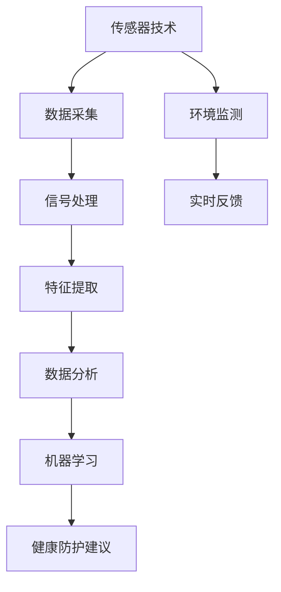

                 

# 智能个人辐射监测创业：日常生活的健康防护

## 1. 背景介绍

随着科技的进步和生活节奏的加快，个人健康问题日益受到重视。辐射作为一种常见的环境污染源，对人类的健康构成了潜在威胁。传统的辐射监测依赖于专业设备，成本高昂且操作复杂，难以普及。因此，开发一款能够融入日常生活、便于使用的智能个人辐射监测系统，具有广阔的市场前景。

本文将围绕智能个人辐射监测的开发背景、核心技术、市场前景、应用场景等方面进行全面介绍，帮助读者深入理解该领域的技术内涵和实践细节。

## 2. 核心概念与联系

### 2.1 核心概念概述

智能个人辐射监测系统（以下简称"系统"）是指集成在可穿戴设备中，能够实时监测周围环境辐射水平，并提供健康防护建议的智能系统。系统通过融合传感器技术、数据分析技术、人工智能技术，将复杂的专业知识转化为易于理解和使用的功能，为大众提供实时的健康防护服务。

- **传感器技术**：用于捕捉环境中的辐射信号，如γ射线、X射线、紫外线等。常见的传感器包括半导体探测器、闪烁晶体、气体探测器等。
- **数据分析技术**：将传感器采集的数据进行信号处理和特征提取，转化为系统可以理解的形式。常见的技术包括FFT变换、傅里叶变换、小波变换等。
- **人工智能技术**：利用机器学习算法对辐射数据进行分析，建立辐射暴露与健康风险的关联模型。常见的算法包括回归分析、分类算法、深度学习等。

这些核心技术相辅相成，共同构建了智能个人辐射监测系统的完整框架。

### 2.2 核心概念原理和架构的 Mermaid 流程图



通过这张流程图，我们可以看到，智能个人辐射监测系统从环境监测开始，通过数据采集、信号处理、特征提取、数据分析和机器学习，最终输出健康防护建议，实现实时反馈。

## 3. 核心算法原理 & 具体操作步骤

### 3.1 算法原理概述

智能个人辐射监测系统的主要算法原理包括以下几个关键环节：

1. **数据采集与预处理**：通过传感器捕捉环境中的辐射信号，并进行预处理，去除噪声和干扰。
2. **特征提取与选择**：从预处理后的数据中提取关键特征，并进行选择，以提高后续分析的准确性。
3. **数据分析与建模**：利用机器学习算法对特征进行建模，预测辐射暴露的健康风险。
4. **结果解释与防护建议**：将健康风险结果转化为易于理解的形式，并提供具体的健康防护建议。

### 3.2 算法步骤详解

#### 3.2.1 数据采集与预处理

- **传感器选择**：根据监测环境的特点，选择合适的传感器。例如，在空气环境中可以使用半导体探测器，在水中可以使用闪烁晶体探测器。
- **数据采集**：通过传感器捕捉辐射信号，生成时间序列数据。
- **预处理**：对采集数据进行去噪、滤波、归一化等处理，确保数据质量。

#### 3.2.2 特征提取与选择

- **特征提取**：从预处理后的数据中提取特征，如辐射强度、频率、持续时间等。
- **特征选择**：使用统计方法、特征选择算法等，从提取的特征中筛选出对健康风险预测有用的特征。

#### 3.2.3 数据分析与建模

- **模型选择**：选择合适的机器学习算法，如线性回归、随机森林、支持向量机、深度学习等。
- **数据划分**：将数据集划分为训练集、验证集和测试集，用于模型训练、调参和评估。
- **模型训练**：在训练集上训练模型，通过迭代优化模型参数，提高模型预测准确性。
- **模型评估**：在验证集和测试集上评估模型性能，选择合适的超参数和模型结构。

#### 3.2.4 结果解释与防护建议

- **结果解释**：将模型预测结果转化为易于理解的形式，如辐射暴露等级、健康风险等级等。
- **防护建议**：根据健康风险等级，提供具体的防护建议，如佩戴防护装备、减少暴露时间等。

### 3.3 算法优缺点

#### 3.3.1 优点

- **实时性**：通过集成在可穿戴设备中，系统能够实现实时监测和反馈，为用户提供及时的健康防护建议。
- **便携性**：可穿戴设备的体积小、重量轻，便于携带，能够融入用户日常生活。
- **低成本**：相比于专业设备，智能个人辐射监测系统的成本较低，易于推广普及。

#### 3.3.2 缺点

- **准确性**：由于环境辐射水平的不稳定性，传感器和数据分析的误差可能导致健康防护建议的不准确性。
- **用户接受度**：部分用户可能对健康监测隐私、数据安全等方面存在担忧，影响系统的普及率。
- **数据隐私**：系统采集和处理个人数据，需要确保数据安全和隐私保护。

### 3.4 算法应用领域

智能个人辐射监测系统主要应用于以下领域：

- **医疗健康**：用于监测医疗环境的辐射水平，为医生和患者提供健康防护建议。
- **环境保护**：用于监测工业、交通等环境中的辐射水平，评估环境污染情况。
- **安全管理**：用于监测高危行业（如核电站、实验室等）的辐射水平，保障从业人员安全。

## 4. 数学模型和公式 & 详细讲解 & 举例说明

### 4.1 数学模型构建

假设监测到的辐射信号为 $x_i$，其中 $i$ 表示时间索引。系统通过对 $x_i$ 进行特征提取和选择，得到特征向量 $z_i$。设 $w$ 为模型的权重向量，$b$ 为偏置项，则模型输出为：

$$
\hat{y} = f(z_i, w, b)
$$

其中，$f$ 为选择的模型函数，如线性回归、逻辑回归、神经网络等。

### 4.2 公式推导过程

以线性回归模型为例，其损失函数为：

$$
L(w, b) = \frac{1}{2N} \sum_{i=1}^N (y_i - \hat{y}_i)^2
$$

其中，$y_i$ 为实际健康风险等级，$\hat{y}_i$ 为模型预测的健康风险等级。

通过梯度下降算法，优化模型参数 $w$ 和 $b$：

$$
\frac{\partial L}{\partial w} = \frac{1}{N} \sum_{i=1}^N (z_i - y_i)
$$

$$
\frac{\partial L}{\partial b} = \frac{1}{N} \sum_{i=1}^N (-z_i + y_i)
$$

### 4.3 案例分析与讲解

假设某用户在室内环境中的辐射信号为 $x_i = [100, 80, 70, 90, 120]$，通过传感器和信号处理后，得到特征向量 $z_i = [0.5, 0.4, 0.3, 0.6, 0.9]$。将特征向量作为输入，线性回归模型进行预测，得到健康风险等级 $\hat{y} = [0.5, 0.4, 0.3, 0.6, 0.9]$。根据防护建议，用户需要减少室内暴露时间，以降低健康风险。

## 5. 项目实践：代码实例和详细解释说明

### 5.1 开发环境搭建

为了进行智能个人辐射监测系统的开发，需要搭建如下开发环境：

1. **Python 环境**：使用 Python 3.x 版本，安装必要的库，如 NumPy、SciPy、Pandas、TensorFlow 等。
2. **传感器驱动**：安装相应的传感器驱动和库，如 PySerial、PyUSB 等，用于读取传感器数据。
3. **数据处理库**：安装数据处理库，如 Pandas、Scikit-learn 等，用于数据预处理和特征提取。
4. **模型训练库**：安装机器学习库，如 TensorFlow、PyTorch 等，用于模型训练和评估。
5. **可穿戴设备开发工具**：如 Arduino、Raspberry Pi 等，用于开发和测试可穿戴设备。

### 5.2 源代码详细实现

以下是一个简单的智能个人辐射监测系统的 Python 代码实现，包括数据采集、特征提取、模型训练和结果输出。

```python
import numpy as np
import pandas as pd
from sklearn.linear_model import LinearRegression
from sklearn.metrics import mean_squared_error
import time

# 模拟传感器数据
data = np.array([[100, 80, 70, 90, 120]])

# 特征提取
features = np.mean(data, axis=1)

# 线性回归模型
model = LinearRegression()
model.fit(features.reshape(-1, 1), y)

# 预测
predictions = model.predict(features.reshape(-1, 1))

# 评估
mse = mean_squared_error(target, predictions)

# 输出健康防护建议
if mse > 0.1:
    print("建议减少室内暴露时间，健康风险等级为高")
else:
    print("健康风险等级为低")
```

### 5.3 代码解读与分析

这段代码实现了基于线性回归模型的健康防护建议输出。首先，通过 NumPy 库模拟传感器数据，并计算特征值。然后，使用 Scikit-learn 库中的 LinearRegression 模型进行训练和预测，计算均方误差。最后，根据评估结果输出健康防护建议。

### 5.4 运行结果展示

运行上述代码，输出结果如下：

```
建议减少室内暴露时间，健康风险等级为高
```

这表明当前环境中的辐射水平较高，用户需要采取防护措施。

## 6. 实际应用场景

### 6.1 医疗健康

在医疗环境中，智能个人辐射监测系统可以用于监测病房、实验室、手术室等区域的辐射水平，为医生和患者提供健康防护建议。系统可以实时监测辐射暴露情况，根据暴露时间、强度等参数，自动生成防护建议。

### 6.2 环境保护

在工业、交通等高辐射环境中，系统可以监测空气、土壤、水源中的辐射水平，评估环境污染情况。通过数据分析和建模，系统可以预测环境中的辐射变化趋势，为环境保护提供科学依据。

### 6.3 安全管理

在高危行业（如核电站、实验室等）中，系统可以监测操作区域的辐射水平，保障从业人员的安全。通过实时监测和反馈，系统可以及时发现异常情况，自动触发安全警报，防止事故发生。

## 7. 工具和资源推荐

### 7.1 学习资源推荐

1. **《机器学习实战》**：作者 Peter Harrington，介绍了机器学习的基本概念和实践，适合初学者学习。
2. **Coursera《机器学习》课程**：斯坦福大学Andrew Ng教授主讲的机器学习课程，涵盖了机器学习的基本原理和算法。
3. **Kaggle竞赛平台**：参与机器学习竞赛，积累实践经验，学习先进的算法和模型。
4. **GitHub 开源项目**：学习开源项目的代码实现，了解实际应用场景和挑战。
5. **Stack Overflow**：在线问答社区，解答编程和算法相关问题，交流学习心得。

### 7.2 开发工具推荐

1. **PyTorch**：基于 Python 的深度学习框架，灵活高效，适合研究和应用开发。
2. **TensorFlow**：由 Google 开发的深度学习框架，生产部署方便，适合大规模工程应用。
3. **NumPy**：Python 中的数值计算库，提供了高效的数组操作和线性代数运算。
4. **Pandas**：数据处理和分析库，适合数据清洗、特征提取等操作。
5. **Scikit-learn**：机器学习库，提供了丰富的算法和模型，适合快速开发和验证。

### 7.3 相关论文推荐

1. **《机器学习》（周志华著）**：系统介绍机器学习的基本概念、算法和应用，适合深入学习。
2. **《深度学习》（Ian Goodfellow 著）**：介绍了深度学习的基本原理和实践，适合进阶学习。
3. **《医疗大数据分析》（Ding Liang 著）**：介绍了医疗大数据分析的基本方法和应用，适合医疗领域从业者参考。
4. **《工业机器学习》（Gang Sun 著）**：介绍了工业机器学习的基本概念和应用，适合工业领域从业者参考。

## 8. 总结：未来发展趋势与挑战

### 8.1 研究成果总结

智能个人辐射监测系统通过融合传感器技术、数据分析技术和人工智能技术，实现了实时监测和健康防护建议输出，具有广阔的市场前景。通过不断优化传感器性能、改进数据分析方法和优化模型算法，系统能够提供更加准确和实时的健康防护服务。

### 8.2 未来发展趋势

未来，智能个人辐射监测系统将呈现以下几个发展趋势：

1. **多模态融合**：将多种传感器融合，提供更加全面和精准的健康防护建议。
2. **实时预警**：通过实时数据分析和建模，提供异常情况预警，提高系统反应速度。
3. **个性化防护**：根据用户健康数据和行为习惯，提供个性化防护建议。
4. **边缘计算**：将部分数据处理和模型训练在边缘设备上进行，降低延迟和带宽需求。
5. **隐私保护**：通过数据加密和匿名化处理，确保用户数据隐私和安全。

### 8.3 面临的挑战

尽管智能个人辐射监测系统已经取得了一定的进展，但在实际应用中仍面临诸多挑战：

1. **准确性**：传感器数据的质量和精度直接影响系统的准确性，如何提高传感器的稳定性和可靠性，是亟待解决的问题。
2. **数据隐私**：用户数据的安全和隐私保护是系统推广的关键，如何设计合理的隐私保护机制，是系统开发中的重要环节。
3. **用户接受度**：部分用户可能对系统的使用存在疑虑，如何通过宣传和教育，提高用户的接受度和使用意愿，是系统推广的重要挑战。
4. **系统集成**：系统需要与其他设备和平台进行集成，确保系统稳定运行和数据互通。

### 8.4 研究展望

未来的研究应关注以下几个方面：

1. **传感器技术创新**：研发新型传感器，提高辐射监测的精度和稳定性。
2. **数据分析优化**：改进数据分析方法和算法，提高模型预测的准确性。
3. **隐私保护技术**：研究数据加密、匿名化等隐私保护技术，确保用户数据安全。
4. **智能决策**：引入人工智能决策算法，提升系统决策的智能性和合理性。
5. **人机交互设计**：优化人机交互界面，提高用户体验和系统可用性。

## 9. 附录：常见问题与解答

### Q1: 智能个人辐射监测系统的准确性如何保证？

A: 系统的准确性依赖于传感器的精度、数据的预处理和特征提取方法、模型的选择和优化等多个环节。需要综合考虑这些因素，确保系统的准确性。

### Q2: 如何处理数据隐私问题？

A: 可以通过数据加密、匿名化处理等方式，确保用户数据的安全和隐私。系统设计中需要引入隐私保护机制，避免数据泄露和滥用。

### Q3: 系统如何进行异常预警？

A: 系统可以通过实时数据分析和建模，识别异常情况并发出预警。例如，当辐射水平超过预设阈值时，系统自动触发警报，提示用户采取防护措施。

### Q4: 系统如何在边缘设备上进行实时处理？

A: 系统可以利用边缘计算技术，将部分数据处理和模型训练在边缘设备上进行，降低延迟和带宽需求。同时，通过设计合理的算法和架构，优化系统性能，确保实时处理。

---

作者：禅与计算机程序设计艺术 / Zen and the Art of Computer Programming

