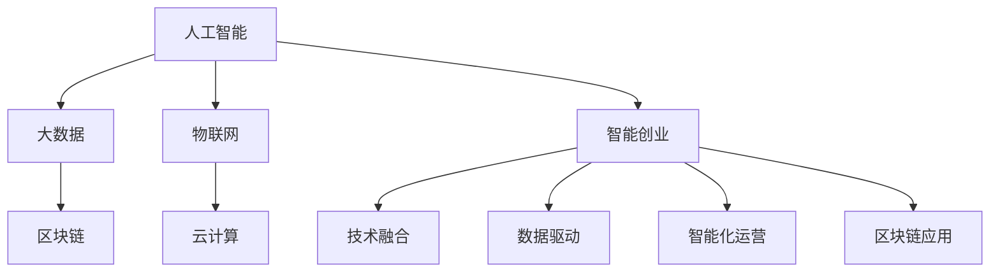

                 

# 智能创业：如何利用新技术颠覆传统行业

> 关键词：智能创业,新技术,颠覆传统行业,人工智能,大数据,区块链,物联网,云计算

## 1. 背景介绍

### 1.1 问题由来
随着科技的快速发展和互联网的普及，各行各业都在经历一场深刻的数字化转型。传统的商业模式、生产方式和管理模式正在被新技术所颠覆，新的商业机会和商业模式不断涌现。如何利用新技术，实现传统行业的智能化升级，已成为众多企业关心的核心议题。

在这一背景下，智能创业应运而生。智能创业是指利用人工智能、大数据、区块链、物联网、云计算等新兴技术，构建智能化、自动化、个性化、高效化的商业模式和运营模式，实现传统行业的数字化转型升级。智能创业的核心在于整合各类前沿技术，创造新的商业价值，提升企业的市场竞争力。

### 1.2 问题核心关键点
智能创业的关键点在于以下四个方面：
1. **技术融合**：如何融合多种新兴技术，构建创新的业务模型。
2. **数据驱动**：如何利用大数据分析技术，洞察市场趋势和用户需求。
3. **智能化运营**：如何通过AI算法和机器学习，优化业务流程，提升运营效率。
4. **区块链应用**：如何利用区块链技术，构建安全、透明、可信的商业环境。

### 1.3 问题研究意义
智能创业的研究意义在于，它不仅能够推动传统行业数字化转型，提升企业的创新能力和市场竞争力，还能够催生新的产业形态和经济增长点，为社会创造更大的价值。通过智能创业，企业可以更高效地应对市场变化，提供更优质的产品和服务，满足用户的个性化需求。

## 2. 核心概念与联系

### 2.1 核心概念概述

为更好地理解智能创业，本节将介绍几个密切相关的核心概念：

- **人工智能（AI）**：一种模拟人类智能过程的技术，包括机器学习、深度学习、自然语言处理、计算机视觉等方向。
- **大数据（Big Data）**：指从各种来源收集的海量数据，通过分析挖掘，可以揭示出深层次的商业价值和规律。
- **区块链（Blockchain）**：一种去中心化的分布式账本技术，能够确保数据的安全性、透明性和不可篡改性。
- **物联网（IoT）**：通过各种传感器和设备，实现物与物之间的互联互通，提升生产效率和运营管理。
- **云计算（Cloud Computing）**：通过互联网提供计算资源和数据存储服务，实现按需计算和资源共享。

这些核心概念之间的逻辑关系可以通过以下Mermaid流程图来展示：



这个流程图展示智能创业的核心概念及其之间的关系：

1. 人工智能通过大数据分析技术，优化决策过程，提升运营效率。
2. 物联网通过各种传感器设备，实现实时监测和控制，提升生产效率。
3. 区块链通过去中心化的分布式账本，确保数据的安全性和透明性。
4. 云计算通过互联网提供计算资源，支持大规模数据处理和实时计算。
5. 智能创业通过融合多种技术，实现传统行业的数字化转型。

这些核心概念共同构成了智能创业的技术基础，为其成功实施提供了强有力的支持。

## 3. 核心算法原理 & 具体操作步骤
### 3.1 算法原理概述

智能创业的技术实现主要依赖于机器学习和深度学习算法。这些算法通过大量数据训练，学习出复杂的模式和规律，并用于解决实际问题。

以智能推荐系统为例，其核心算法包括协同过滤、内容推荐、基于深度学习的推荐模型等。协同过滤算法通过分析用户行为数据，推荐相似用户喜欢的商品；内容推荐算法通过分析商品特征，推荐用户可能感兴趣的商品；基于深度学习的推荐模型则通过神经网络学习用户行为和商品特征，实现更高精度的推荐。

### 3.2 算法步骤详解

以下是智能推荐系统的具体算法步骤：

**Step 1: 数据准备**
- 收集用户行为数据，如浏览、购买、评分等。
- 收集商品特征数据，如分类、标签、属性等。
- 将数据进行预处理，如归一化、缺失值填充等。

**Step 2: 特征工程**
- 提取用户和商品的特征，如兴趣标签、时间戳、地理位置等。
- 构建特征向量，将用户行为和商品特征转化为模型可接受的形式。
- 进行特征选择，保留对推荐效果有显著影响的特征。

**Step 3: 模型训练**
- 选择推荐算法，如协同过滤、内容推荐、基于深度学习的模型等。
- 将数据分为训练集、验证集和测试集。
- 使用训练集对模型进行训练，优化模型参数。
- 在验证集上评估模型性能，调整参数，避免过拟合。

**Step 4: 模型评估与优化**
- 使用测试集对模型进行最终评估，计算推荐准确率、召回率、F1分数等指标。
- 根据评估结果，调整模型参数，优化推荐效果。
- 应用模型对新数据进行实时推荐，提供个性化服务。

### 3.3 算法优缺点

智能推荐系统的优点包括：
1. **个性化推荐**：通过分析用户行为和商品特征，提供个性化的推荐服务，提升用户体验。
2. **高效性**：通过机器学习算法，快速处理和分析大量数据，实现实时推荐。
3. **可扩展性**：可以应用于各种电子商务平台、社交媒体等场景，灵活性强。

缺点包括：
1. **数据依赖**：推荐效果高度依赖于数据的完整性和质量。
2. **冷启动问题**：对于新用户和商品，推荐效果可能较差。
3. **隐私问题**：收集和处理用户数据，可能带来隐私风险。
4. **公平性问题**：算法可能存在偏见，导致不公平的推荐结果。

### 3.4 算法应用领域

智能推荐系统已经在电子商务、社交媒体、视频平台等多个领域得到了广泛应用，提升了用户体验和运营效率。

- **电子商务**：根据用户浏览和购买记录，推荐相似商品，提高转化率。
- **社交媒体**：根据用户点赞、评论、分享等行为，推荐相关内容，增加用户粘性。
- **视频平台**：根据用户观看历史，推荐相似视频，提高用户观看时长。
- **金融领域**：根据用户交易记录，推荐相关理财产品，增加用户投资收益。

除了推荐系统，智能创业还涵盖了许多其他技术应用领域，如智能客服、智能物流、智能制造等，推动了传统行业的数字化转型。

## 4. 数学模型和公式 & 详细讲解 & 举例说明

### 4.1 数学模型构建

本节将使用数学语言对智能推荐系统进行更加严格的刻画。

设推荐系统的训练数据集为 $D=\{(x_i,y_i)\}_{i=1}^N$，其中 $x_i$ 为特征向量，$y_i$ 为推荐标签。定义模型 $M_{\theta}(x)$ 在特征向量 $x$ 上的预测结果为 $\hat{y}=M_{\theta}(x)$，其中 $\theta$ 为模型参数。

定义模型 $M_{\theta}$ 在数据样本 $(x,y)$ 上的损失函数为 $\ell(M_{\theta}(x),y)$，则在数据集 $D$ 上的经验风险为：

$$
\mathcal{L}(\theta) = \frac{1}{N} \sum_{i=1}^N \ell(M_{\theta}(x_i),y_i)
$$

其中 $\ell$ 为损失函数，如交叉熵损失、均方误差损失等。

### 4.2 公式推导过程

以下我们以交叉熵损失函数为例，推导模型训练的优化目标。

假设模型 $M_{\theta}$ 在特征向量 $x$ 上的预测结果为 $\hat{y}=M_{\theta}(x)$，其中 $\hat{y}$ 为概率分布向量。真实标签 $y \in \{0,1\}$。则交叉熵损失函数定义为：

$$
\ell(M_{\theta}(x),y) = -[y\log \hat{y} + (1-y)\log (1-\hat{y})]
$$

将其代入经验风险公式，得：

$$
\mathcal{L}(\theta) = -\frac{1}{N}\sum_{i=1}^N [y_i\log M_{\theta}(x_i)+(1-y_i)\log(1-M_{\theta}(x_i))]
$$

根据链式法则，损失函数对参数 $\theta_k$ 的梯度为：

$$
\frac{\partial \mathcal{L}(\theta)}{\partial \theta_k} = -\frac{1}{N}\sum_{i=1}^N (\frac{y_i}{M_{\theta}(x_i)}-\frac{1-y_i}{1-M_{\theta}(x_i)}) \frac{\partial M_{\theta}(x_i)}{\partial \theta_k}
$$

其中 $\frac{\partial M_{\theta}(x_i)}{\partial \theta_k}$ 可进一步递归展开，利用自动微分技术完成计算。

在得到损失函数的梯度后，即可带入参数更新公式，完成模型的迭代优化。重复上述过程直至收敛，最终得到适应推荐任务的最优模型参数 $\theta^*$。

## 5. 项目实践：代码实例和详细解释说明
### 5.1 开发环境搭建

在进行智能推荐系统开发前，我们需要准备好开发环境。以下是使用Python进行PyTorch开发的环境配置流程：

1. 安装Anaconda：从官网下载并安装Anaconda，用于创建独立的Python环境。

2. 创建并激活虚拟环境：
```bash
conda create -n pytorch-env python=3.8 
conda activate pytorch-env
```

3. 安装PyTorch：根据CUDA版本，从官网获取对应的安装命令。例如：
```bash
conda install pytorch torchvision torchaudio cudatoolkit=11.1 -c pytorch -c conda-forge
```

4. 安装TensorFlow：
```bash
pip install tensorflow==2.3
```

5. 安装Flask：
```bash
pip install flask
```

6. 安装PyTorch的推荐系统库：
```bash
pip install PyTorchRecommender
```

完成上述步骤后，即可在`pytorch-env`环境中开始推荐系统开发。

### 5.2 源代码详细实现

下面我们以协同过滤推荐系统为例，给出使用PyTorch进行智能推荐开发的PyTorch代码实现。

```python
import torch
import torch.nn as nn
import torch.optim as optim
from torch.utils.data import DataLoader
from PyTorchRecommender import RecommendationDataset, CollaborativeFilteringModel

# 准备数据集
dataset = RecommendationDataset(train_data, test_data)

# 定义模型
model = CollaborativeFilteringModel(hidden_size=64, dropout=0.1)

# 定义优化器
optimizer = optim.Adam(model.parameters(), lr=0.001)

# 定义训练函数
def train_epoch(model, dataset, optimizer):
    model.train()
    total_loss = 0
    for batch in DataLoader(dataset, batch_size=128):
        x = batch[0].to(device)
        y = batch[1].to(device)
        optimizer.zero_grad()
        output = model(x)
        loss = nn.BCEWithLogitsLoss()(output, y)
        loss.backward()
        optimizer.step()
        total_loss += loss.item()
    return total_loss / len(dataset)

# 定义评估函数
def evaluate(model, dataset):
    model.eval()
    total_hit = 0
    for batch in DataLoader(dataset, batch_size=128):
        x = batch[0].to(device)
        y = batch[1].to(device)
        output = model(x)
        pred = torch.sigmoid(output)
        total_hit += ((pred > 0.5) * (y == 1)).sum().item()
    return total_hit / len(dataset)

# 定义训练流程
device = torch.device('cuda') if torch.cuda.is_available() else torch.device('cpu')
for epoch in range(10):
    loss = train_epoch(model, dataset, optimizer)
    print(f"Epoch {epoch+1}, train loss: {loss:.4f}")
    
    hit_rate = evaluate(model, dataset)
    print(f"Epoch {epoch+1}, test hit rate: {hit_rate:.4f}")
    
print("Final hit rate:", hit_rate)
```

以上就是使用PyTorch对协同过滤推荐系统进行开发的完整代码实现。可以看到，PyTorchRecommender库大大简化了推荐系统的实现过程，开发者只需关注模型设计和优化目标即可。

### 5.3 代码解读与分析

让我们再详细解读一下关键代码的实现细节：

**RecommendationDataset类**：
- `__init__`方法：初始化训练集和测试集数据。
- `__getitem__`方法：对单个样本进行处理，将用户特征和物品特征编码为模型输入。

**模型定义**：
- 使用PyTorch定义协同过滤模型，包含两个全连接层，用于对用户特征和物品特征进行编码，并计算相似度矩阵。
- 使用ReLU激活函数，避免梯度消失问题。

**优化器定义**：
- 使用Adam优化器，学习率为0.001，更新模型参数。

**训练函数**：
- 在训练集上进行模型训练，计算交叉熵损失。
- 在测试集上评估模型性能，计算准确率。

**训练流程**：
- 循环迭代10个epoch，每个epoch计算一次训练集损失和测试集准确率。
- 使用GPU加速训练过程，如果无GPU则使用CPU。

可以看到，PyTorchRecommender库大大降低了推荐系统的实现难度，使得开发者能够更加专注于模型设计和性能优化。

## 6. 实际应用场景
### 6.1 电子商务

智能推荐系统在电子商务领域具有重要应用价值。电商平台通过智能推荐，能够提高用户购物体验，增加商品曝光率，提高转化率和销售额。

具体而言，电商平台可以收集用户浏览、购买、评分等数据，构建推荐模型，对新用户进行商品推荐。推荐系统可以根据用户行为和商品属性，推荐用户可能感兴趣的商品，帮助用户快速找到所需商品。

### 6.2 视频平台

视频平台通过智能推荐，能够提高用户观看时长，增加用户粘性，提高平台流量。

视频平台可以收集用户观看历史和视频特征，构建推荐模型，对新用户进行视频推荐。推荐系统可以根据用户观看历史和视频属性，推荐用户可能感兴趣的视频，提升用户观看时长。

### 6.3 金融服务

金融服务通过智能推荐，能够提高用户投资收益，增加用户粘性，降低风险。

金融机构可以收集用户交易记录和投资偏好，构建推荐模型，对新用户进行理财产品推荐。推荐系统可以根据用户交易记录和投资偏好，推荐适合的理财产品，增加用户投资收益。

### 6.4 未来应用展望

随着智能推荐技术的不断发展，其在各行业的应用前景将更加广阔。

在智慧医疗领域，智能推荐系统可以用于推荐诊疗方案、药物、健康知识等，帮助医生提高诊疗效率，改善患者体验。

在智能教育领域，智能推荐系统可以用于推荐学习资源、在线课程、学习伙伴等，帮助学生个性化学习，提高学习效果。

在智慧城市治理中，智能推荐系统可以用于推荐公共服务、社会活动、城市信息等，提高城市治理效率，改善市民生活。

此外，在企业生产、社会治理、文娱传媒等众多领域，智能推荐系统也将不断涌现，为各行各业带来新的发展机遇。

## 7. 工具和资源推荐
### 7.1 学习资源推荐

为了帮助开发者系统掌握智能推荐系统的理论基础和实践技巧，这里推荐一些优质的学习资源：

1. 《推荐系统原理与实践》书籍：全面介绍了推荐系统的基本原理和应用场景，适合入门学习。
2. 《Deep Learning for Recommendation Systems》书籍：介绍了深度学习在推荐系统中的应用，适合进阶学习。
3. 《TensorFlow for Recommendation Systems》课程：由Google提供的推荐系统实战课程，涵盖推荐系统的经典算法和实现技巧。
4. Kaggle竞赛：参与Kaggle推荐系统竞赛，实践推荐算法，积累项目经验。
5. UCI推荐系统数据集：收集和处理推荐系统数据集，实践推荐算法，提高数据处理能力。

通过对这些资源的学习实践，相信你一定能够快速掌握智能推荐系统的精髓，并用于解决实际的推荐问题。

### 7.2 开发工具推荐

高效的开发离不开优秀的工具支持。以下是几款用于智能推荐系统开发的常用工具：

1. PyTorch：基于Python的开源深度学习框架，灵活动态的计算图，适合快速迭代研究。

2. TensorFlow：由Google主导开发的开源深度学习框架，生产部署方便，适合大规模工程应用。

3. Flask：Python Web应用框架，适合快速搭建推荐系统服务接口。

4. Scikit-learn：Python机器学习库，提供丰富的模型算法和数据处理工具。

5. TensorBoard：TensorFlow配套的可视化工具，可实时监测模型训练状态，并提供丰富的图表呈现方式。

6. Jupyter Notebook：交互式编程环境，适合进行算法实验和模型调试。

合理利用这些工具，可以显著提升智能推荐系统的开发效率，加快创新迭代的步伐。

### 7.3 相关论文推荐

智能推荐系统的研究起源于学界的持续研究。以下是几篇奠基性的相关论文，推荐阅读：

1. "Collaborative Filtering for Implicit Feedback Datasets"：介绍了协同过滤推荐算法的经典模型。

2. "Contextual Bandits in Recommendation Systems"：介绍了上下文强化学习在推荐系统中的应用。

3. "The Matrix Factorization Technique for Recommender Systems"：介绍了矩阵分解推荐算法的原理和实现。

4. "Deep Neural Networks for YouTube Recommendations"：介绍了深度学习在推荐系统中的应用。

5. "Neural Collaborative Filtering"：介绍了神经网络在协同过滤推荐算法中的应用。

这些论文代表智能推荐系统的研究进展，通过学习这些前沿成果，可以帮助研究者把握学科前进方向，激发更多的创新灵感。

## 8. 总结：未来发展趋势与挑战
### 8.1 研究成果总结

智能推荐系统的研究已经取得了显著成果，广泛应用于电子商务、视频平台、金融服务等多个领域。其核心在于通过机器学习算法，分析用户行为和商品特征，提供个性化的推荐服务，提升用户体验和运营效率。

### 8.2 未来发展趋势

未来，智能推荐系统的发展趋势包括：

1. **多模态融合**：将文本、图像、视频等多模态数据进行融合，提升推荐系统的综合性能。

2. **实时推荐**：通过流计算技术，实现实时推荐，提高用户体验。

3. **个性化推荐**：通过用户行为、社会关系等数据，进行深度学习，实现更加个性化的推荐。

4. **冷启动问题解决**：通过迁移学习、主动学习等方法，解决新用户和新物品的推荐问题。

5. **隐私保护**：通过差分隐私、联邦学习等技术，保护用户隐私，提升数据安全。

6. **模型公平性**：通过公平性约束，避免推荐系统中的偏见和歧视。

### 8.3 面临的挑战

尽管智能推荐系统已经取得了显著进展，但在应用过程中仍面临诸多挑战：

1. **数据质量问题**：推荐系统的性能高度依赖于数据质量，不完整、不准确的数据会影响推荐效果。

2. **模型复杂性**：推荐系统中的深度学习模型较为复杂，训练和部署难度较大。

3. **计算资源消耗**：推荐系统的计算需求较大，需要高效的计算资源和优化算法。

4. **用户隐私保护**：推荐系统需要收集和处理大量用户数据，可能带来隐私风险。

5. **推荐公平性**：推荐系统可能存在偏见，导致不公平的推荐结果。

### 8.4 研究展望

为了解决这些挑战，未来的研究需要在以下几个方面寻求新的突破：

1. **数据质量提升**：通过数据清洗、数据增强等技术，提升数据质量，保证推荐系统性能。

2. **模型简化**：通过模型压缩、模型剪枝等技术，简化模型结构，提高计算效率。

3. **计算资源优化**：通过分布式计算、异构计算等技术，优化计算资源，提升推荐系统效率。

4. **隐私保护技术**：通过差分隐私、联邦学习等技术，保护用户隐私，提升数据安全。

5. **公平性约束**：通过公平性约束，避免推荐系统中的偏见和歧视。

这些研究方向的探索，必将引领智能推荐系统迈向更高的台阶，为构建高效、公平、安全的推荐系统提供强有力的支持。

## 9. 附录：常见问题与解答

**Q1：智能推荐系统是否适用于所有电子商务平台？**

A: 智能推荐系统在绝大多数电子商务平台都能取得不错的效果，尤其是针对个性化需求较高的平台。但需要注意的是，不同平台的推荐需求和用户行为差异较大，需要针对性地调整推荐策略。

**Q2：智能推荐系统在处理长尾数据时表现如何？**

A: 智能推荐系统在处理长尾数据时表现较差，因为长尾数据中的用户行为数据较少，推荐系统难以对其进行准确推荐。此时可以采用基于内容的推荐算法，或引入外部信息（如用户画像、社交网络等），提高推荐效果。

**Q3：智能推荐系统如何避免推荐中的冷启动问题？**

A: 智能推荐系统可以通过以下方法避免冷启动问题：
1. 引入用户画像数据，对新用户进行初步推荐。
2. 采用基于内容的推荐算法，推荐新用户可能感兴趣的商品。
3. 采用上下文感知推荐算法，结合用户行为和上下文信息进行推荐。

**Q4：智能推荐系统在处理多样性数据时有哪些挑战？**

A: 智能推荐系统在处理多样性数据时面临以下挑战：
1. 数据分布不均：不同用户和商品的数据量差异较大，难以进行公平推荐。
2. 数据稀疏性：用户行为数据稀疏，难以捕捉用户真实需求。
3. 数据噪声：推荐系统容易受到噪声数据的影响，导致推荐效果下降。

**Q5：智能推荐系统如何实现个性化推荐？**

A: 智能推荐系统可以通过以下方法实现个性化推荐：
1. 利用用户行为数据，构建用户兴趣模型，进行推荐。
2. 引入上下文信息，如时间、地点、设备等，进行个性化推荐。
3. 结合用户画像和社交网络，进行个性化推荐。

这些方法通过深入分析用户行为和数据特征，实现更加精准和个性化的推荐，提高用户体验。

---

作者：禅与计算机程序设计艺术 / Zen and the Art of Computer Programming

