                 

# 智能合约开发：以太坊与其他平台比较

> 关键词：智能合约, 以太坊, 区块链, 平台比较, 链上, 链下, 合约开发, 安全性, 性能, 扩展性

## 1. 背景介绍

### 1.1 问题由来
随着区块链技术的兴起，智能合约在金融、供应链、版权保护等领域得到了广泛应用。智能合约是一段在区块链上运行的代码，能够在预设条件满足时自动执行，极大地提升了交易的效率和安全性。

然而，不同区块链平台的智能合约开发方式和技术栈有很大差异。以太坊是目前最受欢迎的智能合约平台，但其他平台（如Hyperledger Fabric、EOS、Tron等）也在不断发展，提供不同特点的智能合约解决方案。本文将从开发环境、合约语言、性能、扩展性等方面，对以太坊与其他主流智能合约平台进行全面比较，以帮助开发者选择合适的智能合约开发平台。

### 1.2 问题核心关键点
智能合约平台比较的核心关键点在于：
- 不同平台的特点和优势
- 智能合约开发环境和技术栈的差异
- 合约语言和开发工具的选择
- 性能和扩展性等关键指标的对比

本文将围绕这些关键点，对以太坊与其他智能合约平台进行深入分析。

## 2. 核心概念与联系

### 2.1 核心概念概述

智能合约是一个运行在区块链上的程序，能够在满足特定条件时自动执行，从而实现自动化的合同执行和管理。智能合约的关键特性包括：
- 自动执行：一旦触发条件满足，智能合约将自动执行。
- 不可篡改：智能合约一旦部署在区块链上，就无法被篡改。
- 透明性：所有智能合约的操作和状态都是公开透明的。

不同智能合约平台的核心特点和优势如下：

- **以太坊（Ethereum）**：基于工作量证明（PoW）的共识机制，支持图灵完备的智能合约编程语言Solidity。以太坊具有庞大的生态系统和丰富的开发者工具，是智能合约开发的领军平台。
- **Hyperledger Fabric**：基于许可链的共识机制，支持Java和Go等语言。Hyperledger Fabric注重隐私和安全，适用于企业级应用场景。
- **EOS（Enterprise Operation System）**：支持C++和Dapp开发，采用DPoS共识机制，旨在提高性能和扩展性。
- **Tron（TRON）**：基于PoS共识机制，支持C++、Solidity和Dapp开发。Tron注重去中心化应用和游戏场景。

这些平台在共识机制、编程语言、性能和应用场景等方面各具特色，适用于不同的应用需求。

### 2.2 核心概念原理和架构的 Mermaid 流程图

```mermaid
graph TD
    A[以太坊] --> B[共识机制: PoW]
    A --> C[编程语言: Solidity]
    A --> D[智能合约特性]
    A --> E[应用生态: 广泛]
    A --> F[社区支持: 活跃]
    
    G[Hyperledger Fabric] --> H[共识机制: 许可链]
    G --> I[编程语言: Java, Go]
    G --> J[智能合约特性]
    G --> K[应用生态: 企业级]
    G --> L[社区支持: 中小型企业]
    
    M[EOS] --> N[共识机制: DPoS]
    M --> O[编程语言: C++, Dapp]
    M --> P[智能合约特性]
    M --> Q[应用生态: 游戏、金融]
    M --> R[社区支持: 开发者社群]
    
    S[Tron] --> T[共识机制: PoS]
    S --> U[编程语言: C++, Solidity, Dapp]
    S --> V[智能合约特性]
    S --> W[应用生态: 游戏、社交]
    S --> X[社区支持: 开发者与游戏玩家]
    
    A --- Y[性能]
    G --- Y
    M --- Y
    S --- Y
    
    A --- Z[扩展性]
    G --- Z
    M --- Z
    S --- Z
    
    A --- $[安全性]
    G --- $
    M --- $
    S --- $
```



这个流程图展示了不同智能合约平台在共识机制、编程语言、智能合约特性、应用生态、社区支持、性能、扩展性和安全性等方面的特点。

## 3. 核心算法原理 & 具体操作步骤

### 3.1 算法原理概述

智能合约的开发和部署通常分为链上和链下两个阶段。链上阶段是将智能合约代码部署到区块链上，链下阶段是对智能合约进行编写、测试和部署。

以太坊的智能合约开发流程如下：

1. **编写智能合约**：使用Solidity编写智能合约代码。
2. **编译智能合约**：使用Solidity编译器将智能合约代码编译成字节码。
3. **部署智能合约**：将编译后的字节码部署到以太坊区块链上。
4. **测试智能合约**：在测试网络上测试智能合约的正确性和性能。
5. **部署到主网**：将测试通过的智能合约部署到以太坊主网上。

Hyperledger Fabric的智能合约开发流程如下：

1. **编写智能合约**：使用Java或Go编写智能合约代码。
2. **编译智能合约**：将智能合约代码编译成可执行代码。
3. **部署智能合约**：将可执行代码部署到Hyperledger Fabric网络中的各个节点上。
4. **测试智能合约**：在测试网络上测试智能合约的正确性和性能。
5. **部署到生产网络**：将测试通过的智能合约部署到生产网络上。

EOS的智能合约开发流程如下：

1. **编写智能合约**：使用C++编写智能合约代码。
2. **编译智能合约**：将智能合约代码编译成可执行代码。
3. **部署智能合约**：将可执行代码部署到EOS区块链上。
4. **测试智能合约**：在测试网络上测试智能合约的正确性和性能。
5. **部署到主网**：将测试通过的智能合约部署到EOS主网上。

Tron的智能合约开发流程如下：

1. **编写智能合约**：使用Solidity、C++或Dapp编写智能合约代码。
2. **编译智能合约**：将智能合约代码编译成可执行代码。
3. **部署智能合约**：将可执行代码部署到Tron区块链上。
4. **测试智能合约**：在测试网络上测试智能合约的正确性和性能。
5. **部署到主网**：将测试通过的智能合约部署到Tron主网上。

### 3.2 算法步骤详解

#### 3.2.1 以太坊智能合约开发步骤

1. **编写智能合约**：使用Solidity编写智能合约代码，例如：

```solidity
contract Token {
    uint256 public totalSupply;
    mapping(uint256 => uint256) balances;
    
    event Transfer(uint256 from, uint256 to, uint256 amount);
    
    function tokenOfOwner(uint256 owner) public view returns (uint256) {
        return balances[owner];
    }
    
    function transfer(uint256 _from, uint256 _to, uint256 _value) public returns (bool success) {
        balances[_from] -= _value;
        balances[_to] += _value;
        emit Transfer(_from, _to, _value);
        return true;
    }
}
```

2. **编译智能合约**：使用Solidity编译器编译智能合约代码，例如：

```bash
solc --target evm_version "ethabiabi-evm-3.8" Token.sol --output-directory build/contracts/
```

3. **部署智能合约**：使用Remix IDE或MyEtherWallet等工具将编译后的字节码部署到以太坊区块链上，例如：

```bash
solc --target evm_version "ethabiabi-evm-3.8" Token.sol --output-directory build/contracts/
eth transfer --to 0xa9e433f17b4f4668badfb6bc62b59b6750f1f7e3b --data 0x60005652deadbeef --gasLimit 100000
```

4. **测试智能合约**：在测试网络上测试智能合约的正确性和性能，例如：

```javascript
const { ethers } = require("ethers");

async function main() {
    const [deployer] = await ethers.getSigners();
    const token = await hre.ethers.getContractAt("Token", "0xa9e433f17b4f4668badfb6bc62b59b6750f1f7e3b");

    await token.transfer(deployer.address, 10000);
    console.log(await token.balanceOf(deployer.address));
}

main()
    .then(async () => {
        console.log("Example smart contract executed successfully");
        process.exit(0);
    })
    .catch((error) => {
        console.error(error);
        process.exit(1);
    });
```

5. **部署到主网**：将测试通过的智能合约部署到以太坊主网上。

#### 3.2.2 Hyperledger Fabric智能合约开发步骤

1. **编写智能合约**：使用Java或Go编写智能合约代码，例如：

```java
package com.example.fabric;

import com.example.fabric.transfer.Contract;
import org.hyperledger.fabric.shim.ChaincodeStub;

public class TransferContract extends Contract {
    public TransferContract(String name, String version) {
        super(name, version);
    }

    @Override
    public void execute(ChaincodeStub stub) throws Exception {
        String assetId = stub.getStringArgument(0);
        String receiver = stub.getStringArgument(1);
        Integer amount = stub.getIntegerArgument(2);

        String response = "{\"success\":true}";
        if (amount <= 0) {
            response = "{\"error\":\"Invalid amount\"}";
        } else {
            if (assetId != null && receiver != null) {
                if (assetId.length() > 64) {
                    response = "{\"error\":\"Asset ID too long\"}";
                } else if (receiver.length() > 64) {
                    response = "{\"error\":\"Receiver too long\"}";
                } else {
                    try {
                        stub.log("Transfer to " + receiver + " from " + assetId + " amount: " + amount);
                        // 执行转账操作
                        response = "{\"success\":true}";
                    } catch (Exception e) {
                        response = "{\"error\":\"Transfer failed\"} + e.getMessage();
                    }
                }
            }
        }
        stub.setSuccessResponse(response);
    }
}
```

2. **编译智能合约**：将智能合约代码编译成可执行代码，例如：

```bash
maven package
```

3. **部署智能合约**：将可执行代码部署到Hyperledger Fabric网络中的各个节点上，例如：

```bash
fabric-client -c config.json --collections-config collections.json --peer-org peer-org --channel-id mychannel --collections-config collections.json --peer-org peer-org --channel-id mychannel --collections-config collections.json --peer-org peer-org --channel-id mychannel --collections-config collections.json --peer-org peer-org --channel-id mychannel --collections-config collections.json --peer-org peer-org --channel-id mychannel --collections-config collections.json --peer-org peer-org --channel-id mychannel --collections-config collections.json --peer-org peer-org --channel-id mychannel --collections-config collections.json --peer-org peer-org --channel-id mychannel --collections-config collections.json --peer-org peer-org --channel-id mychannel --collections-config collections.json --peer-org peer-org --channel-id mychannel --collections-config collections.json --peer-org peer-org --channel-id mychannel --collections-config collections.json --peer-org peer-org --channel-id mychannel --collections-config collections.json --peer-org peer-org --channel-id mychannel --collections-config collections.json --peer-org peer-org --channel-id mychannel --collections-config collections.json --peer-org peer-org --channel-id mychannel --collections-config collections.json --peer-org peer-org --channel-id mychannel --collections-config collections.json --peer-org peer-org --channel-id mychannel --collections-config collections.json --peer-org peer-org --channel-id mychannel --collections-config collections.json --peer-org peer-org --channel-id mychannel --collections-config collections.json --peer-org peer-org --channel-id mychannel --collections-config collections.json --peer-org peer-org --channel-id mychannel --collections-config collections.json --peer-org peer-org --channel-id mychannel --collections-config collections.json --peer-org peer-org --channel-id mychannel --collections-config collections.json --peer-org peer-org --channel-id mychannel --collections-config collections.json --peer-org peer-org --channel-id mychannel --collections-config collections.json --peer-org peer-org --channel-id mychannel --collections-config collections.json --peer-org peer-org --channel-id mychannel --collections-config collections.json --peer-org peer-org --channel-id mychannel --collections-config collections.json --peer-org peer-org --channel-id mychannel --collections-config collections.json --peer-org peer-org --channel-id mychannel --collections-config collections.json --peer-org peer-org --channel-id mychannel --collections-config collections.json --peer-org peer-org --channel-id mychannel --collections-config collections.json --peer-org peer-org --channel-id mychannel --collections-config collections.json --peer-org peer-org --channel-id mychannel --collections-config collections.json --peer-org peer-org --channel-id mychannel --collections-config collections.json --peer-org peer-org --channel-id mychannel --collections-config collections.json --peer-org peer-org --channel-id mychannel --collections-config collections.json --peer-org peer-org --channel-id mychannel --collections-config collections.json --peer-org peer-org --channel-id mychannel --collections-config collections.json --peer-org peer-org --channel-id mychannel --collections-config collections.json --peer-org peer-org --channel-id mychannel --collections-config collections.json --peer-org peer-org --channel-id mychannel --collections-config collections.json --peer-org peer-org --channel-id mychannel --collections-config collections.json --peer-org peer-org --channel-id mychannel --collections-config collections.json --peer-org peer-org --channel-id mychannel --collections-config collections.json --peer-org peer-org --channel-id mychannel --collections-config collections.json --peer-org peer-org --channel-id mychannel --collections-config collections.json --peer-org peer-org --channel-id mychannel --collections-config collections.json --peer-org peer-org --channel-id mychannel --collections-config collections.json --peer-org peer-org --channel-id mychannel --collections-config collections.json --peer-org peer-org --channel-id mychannel --collections-config collections.json --peer-org peer-org --channel-id mychannel --collections-config collections.json --peer-org peer-org --channel-id mychannel --collections-config collections.json --peer-org peer-org --channel-id mychannel --collections-config collections.json --peer-org peer-org --channel-id mychannel --collections-config collections.json --peer-org peer-org --channel-id mychannel --collections-config collections.json --peer-org peer-org --channel-id mychannel --collections-config collections.json --peer-org peer-org --channel-id mychannel --collections-config collections.json --peer-org peer-org --channel-id mychannel --collections-config collections.json --peer-org peer-org --channel-id mychannel --collections-config collections.json --peer-org peer-org --channel-id mychannel --collections-config collections.json --peer-org peer-org --channel-id mychannel --collections-config collections.json --peer-org peer-org --channel-id mychannel --collections-config collections.json --peer-org peer-org --channel-id mychannel --collections-config collections.json --peer-org peer-org --channel-id mychannel --collections-config collections.json --peer-org peer-org --channel-id mychannel --collections-config collections.json --peer-org peer-org --channel-id mychannel --collections-config collections.json --peer-org peer-org --channel-id mychannel --collections-config collections.json --peer-org peer-org --channel-id mychannel --collections-config collections.json --peer-org peer-org --channel-id mychannel --collections-config collections.json --peer-org peer-org --channel-id mychannel --collections-config collections.json --peer-org peer-org --channel-id mychannel --collections-config collections.json --peer-org peer-org --channel-id mychannel --collections-config collections.json --peer-org peer-org --channel-id mychannel --collections-config collections.json --peer-org peer-org --channel-id mychannel --collections-config collections.json --peer-org peer-org --channel-id mychannel --collections-config collections.json --peer-org peer-org --channel-id mychannel --collections-config collections.json --peer-org peer-org --channel-id mychannel --collections-config collections.json --peer-org peer-org --channel-id mychannel --collections-config collections.json --peer-org peer-org --channel-id mychannel --collections-config collections.json --peer-org peer-org --channel-id mychannel --collections-config collections.json --peer-org peer-org --channel-id mychannel --collections-config collections.json --peer-org peer-org --channel-id mychannel --collections-config collections.json --peer-org peer-org --channel-id mychannel --collections-config collections.json --peer-org peer-org --channel-id mychannel --collections-config collections.json --peer-org peer-org --channel-id mychannel --collections-config collections.json --peer-org peer-org --channel-id mychannel --collections-config collections.json --peer-org peer-org --channel-id mychannel --collections-config collections.json --peer-org peer-org --channel-id mychannel --collections-config collections.json --peer-org peer-org --channel-id mychannel --collections-config collections.json --peer-org peer-org --channel-id mychannel --collections-config collections.json --peer-org peer-org --channel-id mychannel --collections-config collections.json --peer-org peer-org --channel-id mychannel --collections-config collections.json --peer-org peer-org --channel-id mychannel --collections-config collections.json --peer-org peer-org --channel-id mychannel --collections-config collections.json --peer-org peer-org --channel-id mychannel --collections-config collections.json --peer-org peer-org --channel-id mychannel --collections-config collections.json --peer-org peer-org --channel-id mychannel --collections-config collections.json --peer-org peer-org --channel-id mychannel --collections-config collections.json --peer-org peer-org --channel-id mychannel --collections-config collections.json --peer-org peer-org --channel-id mychannel --collections-config collections.json --peer-org peer-org --channel-id mychannel --collections-config collections.json --peer-org peer-org --channel-id mychannel --collections-config collections.json --peer-org peer-org --channel-id mychannel --collections-config collections.json --peer-org peer-org --channel-id mychannel --collections-config collections.json --peer-org peer-org --channel-id mychannel --collections-config collections.json --peer-org peer-org --channel-id mychannel --collections-config collections.json --peer-org peer-org --channel-id mychannel --collections-config collections.json --peer-org peer-org --channel-id mychannel --collections-config collections.json --peer-org peer-org --channel-id mychannel --collections-config collections.json --peer-org peer-org --channel-id mychannel --collections-config collections.json --peer-org peer-org --channel-id mychannel --collections-config collections.json --peer-org peer-org --channel-id mychannel --collections-config collections.json --peer-org peer-org --channel-id mychannel --collections-config collections.json --peer-org peer-org --channel-id mychannel --collections-config collections.json --peer-org peer-org --channel-id mychannel --collections-config collections.json --peer-org peer-org --channel-id mychannel --collections-config collections.json --peer-org peer-org --channel-id mychannel --collections-config collections.json --peer-org peer-org --channel-id mychannel --collections-config collections.json --peer-org peer-org --channel-id mychannel --collections-config collections.json --peer-org peer-org --channel-id mychannel --collections-config collections.json --peer-org peer-org --channel-id mychannel --collections-config collections.json --peer-org peer-org --channel-id mychannel --collections-config collections.json --peer-org peer-org --channel-id mychannel --collections-config collections.json --peer-org peer-org --channel-id mychannel --collections-config collections.json --peer-org peer-org --channel-id mychannel --collections-config collections.json --peer-org peer-org --channel-id mychannel --collections-config collections.json --peer-org peer-org --channel-id mychannel --collections-config collections.json --peer-org peer-org --channel-id mychannel --collections-config collections.json --peer-org peer-org --channel-id mychannel --collections-config collections.json --peer-org peer-org --channel-id mychannel --collections-config collections.json --peer-org peer-org --channel-id mychannel --collections-config collections.json --peer-org peer-org --channel-id mychannel --collections-config collections.json --peer-org peer-org --channel-id mychannel --collections-config collections.json --peer-org peer-org --channel-id mychannel --collections-config collections.json --peer-org peer-org --channel-id mychannel --collections-config collections.json --peer-org peer-org --channel-id mychannel --collections-config collections.json --peer-org peer-org --channel-id mychannel --collections-config collections.json --peer-org peer-org --channel-id mychannel --collections-config collections.json --peer-org peer-org --channel-id mychannel --collections-config collections.json --peer-org peer-org --channel-id mychannel --collections-config collections.json --peer-org peer-org --channel-id mychannel --collections-config collections.json --peer-org peer-org --channel-id mychannel --collections-config collections.json --peer-org peer-org --channel-id mychannel --collections-config collections.json --peer-org peer-org --channel-id mychannel --collections-config collections.json --peer-org peer-org --channel-id mychannel --collections-config collections.json --peer-org peer-org --channel-id mychannel --collections-config collections.json --peer-org peer-org --channel-id mychannel --collections-config collections.json --peer-org peer-org --channel-id mychannel --collections-config collections.json --peer-org peer-org --channel-id mychannel --collections-config collections.json --peer-org peer-org --channel-id mychannel --collections-config collections.json --peer-org peer-org --channel-id mychannel --collections-config collections.json --peer-org peer-org --channel-id mychannel --collections-config collections.json --peer-org peer-org --channel-id mychannel --collections-config collections.json --peer-org peer-org --channel-id mychannel --collections-config collections.json --peer-org peer-org --channel-id mychannel --collections-config collections.json --peer-org peer-org --channel-id mychannel --collections-config collections.json --peer-org peer-org --channel-id mychannel --collections-config collections.json --peer-org peer-org --channel-id mychannel --collections-config collections.json --peer-org peer-org --channel-id mychannel --collections-config collections.json --peer-org peer-org --channel-id mychannel --collections-config collections.json --peer-org peer-org --channel-id mychannel --collections-config collections.json --peer-org peer-org --channel-id mychannel --collections-config collections.json --peer-org peer-org --channel-id mychannel --collections-config collections.json --peer-org peer-org --channel-id mychannel --collections-config collections.json --peer-org peer-org --channel-id mychannel --collections-config collections.json --peer-org peer-org --channel-id mychannel --collections-config collections.json --peer-org peer-org --channel-id mychannel --collections-config collections.json --peer-org peer-org --channel-id mychannel --collections-config collections.json --peer-org peer-org --channel-id mychannel --collections-config collections.json --peer-org peer-org --channel-id mychannel --collections-config collections.json --peer-org peer-org --channel-id mychannel --collections-config collections.json --peer-org peer-org --channel-id mychannel --collections-config collections.json --peer-org peer-org --channel-id mychannel --collections-config collections.json --peer-org peer-org --channel-id mychannel --collections-config collections.json --peer-org peer-org --channel-id mychannel --collections-config collections.json --peer-org peer-org --channel-id mychannel --collections-config collections.json --peer-org peer-org --channel-id mychannel --collections-config collections.json --peer-org peer-org --channel-id mychannel --collections-config collections.json --peer-org peer-org --channel-id mychannel --collections-config collections.json --peer-org peer-org --channel-id mychannel --collections-config collections.json --peer-org peer-org --channel-id mychannel --collections-config collections.json --peer-org peer-org --channel-id mychannel --collections-config collections.json --peer-org peer-org --channel-id mychannel --collections-config collections.json --peer-org peer-org --channel-id mychannel --collections-config collections.json --peer-org peer-org --channel-id mychannel --collections-config collections.json --peer-org peer-org --channel-id mychannel --collections-config collections.json --peer-org peer-org --channel-id mychannel --collections-config collections.json --peer-org peer-org --channel-id mychannel --collections-config collections.json --peer-org peer-org --channel-id mychannel --collections-config collections.json --peer-org peer-org --channel-id mychannel --collections-config collections.json --peer-org peer-org --channel-id mychannel --collections-config collections.json --peer-org peer-org --channel-id mychannel --collections-config collections.json --peer-org peer-org --channel-id mychannel --collections-config collections.json --peer-org peer-org --channel-id mychannel --collections-config collections.json --peer-org peer-org --channel-id mychannel --collections-config collections.json --peer-org peer-org --channel-id mychannel --collections-config collections.json --peer-org peer-org --channel-id mychannel --collections-config collections.json --peer-org peer-org --channel-id mychannel --collections-config collections.json --peer-org peer-org --channel-id mychannel --collections-config collections.json --peer-org peer-org --channel-id mychannel --collections-config collections.json --peer-org peer-org --channel-id mychannel --collections-config collections.json --peer-org peer-org --channel-id mychannel --collections-config collections.json --peer-org peer-org --channel-id mychannel --collections-config collections.json --peer-org peer-org --channel-id mychannel --collections-config collections.json --peer-org peer-org --channel-id mychannel --collections-config collections.json --peer-org peer-org --channel-id mychannel --collections-config collections.json --peer-org peer-org --channel-id mychannel --collections-config collections.json --peer-org peer-org --channel-id mychannel --collections-config collections.json --peer-org peer-org --channel-id mychannel --collections-config collections.json --peer-org peer-org --channel-id mychannel --collections-config collections.json --peer-org peer-org --channel-id mychannel --collections-config collections.json --peer-org peer-org --channel-id mychannel --collections-config collections.json --peer-org peer-org --channel-id mychannel --collections-config collections.json --peer-org peer-org --channel-id mychannel --collections-config collections.json --peer-org peer-org --channel-id mychannel --collections-config collections.json --peer-org peer-org --channel-id mychannel --collections-config collections.json --peer-org peer-org --channel-id mychannel --collections-config collections.json --peer-org peer-org --channel-id mychannel --collections-config collections.json --peer-org peer-org --channel-id mychannel --collections-config collections.json --peer-org peer-org --channel-id mychannel --collections-config collections.json --peer-org peer-org --channel-id mychannel --collections-config collections.json --peer-org peer-org --channel-id mychannel --collections-config collections.json --peer-org peer-org --channel-id mychannel --collections-config collections.json --peer-org peer-org --channel-id mychannel --collections-config collections.json --peer-org peer-org --channel-id mychannel --collections-config collections.json --peer-org peer-org --channel-id mychannel --collections-config collections.json --peer-org peer-org --channel-id mychannel --collections-config collections.json --peer-org peer-org --channel-id mychannel --collections-config collections.json --peer-org peer-org --channel-id mychannel --collections-config collections.json --peer-org peer-org --channel-id mychannel --collections-config collections.json --peer-org peer-org --channel-id mychannel --collections-config collections.json --peer-org peer-org --channel-id mychannel --collections-config collections.json --peer-org peer-org --channel-id mychannel --collections-config collections.json --peer-org peer-org --channel-id mychannel --collections-config collections.json --peer-org peer-org --channel-id mychannel --collections-config collections.json --peer-org peer-org --channel-id mychannel --collections-config collections.json --peer-org peer-org --channel-id mychannel --collections-config collections.json --peer-org peer-org --channel-id mychannel --collections-config collections.json --peer-org peer-org --channel-id mychannel --collections-config collections.json --peer-org peer-org --channel-id mychannel --collections-config collections.json --peer-org peer-org --channel-id mychannel --collections-config collections.json --peer-org peer-org --channel-id mychannel --collections-config collections.json --peer-org peer-org --channel-id mychannel --collections-config collections.json --peer-org peer-org --channel-id mychannel --collections-config collections.json --peer-org peer-org --channel-id mychannel --collections-config collections.json --peer-org peer-org --channel-id mychannel --collections-config collections.json --peer-org peer-org --channel-id mychannel --collections-config collections.json --peer-org peer-org --channel-id mychannel --collections-config collections.json --peer-org peer-org --channel-id mychannel --collections-config collections.json --peer-org peer-org --channel-id mychannel --collections-config collections.json --peer-org peer-org --channel-id mychannel --collections-config collections.json --peer-org peer-org --channel-id mychannel --collections-config collections.json --peer-org peer-org --channel-id mychannel --collections-config collections.json --peer-org peer-org --channel-id mychannel --collections-config collections.json --peer-org peer-org --channel-id mychannel --collections-config collections.json --peer-org peer-org --channel-id mychannel --collections-config collections.json --peer-org peer-org --channel-id mychannel --collections-config collections.json --peer-org peer-org --channel-id mychannel --collections-config collections.json --peer-org peer-org --channel-id mychannel --collections-config collections.json --peer-org peer-org --channel-id mychannel --collections-config collections.json --peer-org peer-org --channel-id mychannel --collections-config collections.json --peer-org peer-org --channel-id mychannel --collections-config collections.json --peer-org peer-org --channel-id mychannel --collections-config collections.json --peer-org peer-org --channel-id mychannel --collections-config collections.json --peer-org peer-org --channel-id mychannel --collections-config collections.json --peer-org peer-org --channel-id mychannel --collections-config collections.json --peer-org peer-org --channel-id mychannel --collections-config collections.json --peer-org peer-org --channel-id mychannel --collections-config collections.json --peer-org peer-org --channel-id mychannel --collections-config collections.json --peer-org peer-org --channel-id mychannel --collections-config collections.json --peer-org peer-org --channel-id mychannel --collections-config collections.json --peer-org peer-org --channel-id mychannel --collections-config collections.json --peer-org peer-org --channel-id mychannel --collections-config collections.json --peer-org peer-org --channel-id mychannel --collections-config collections.json --peer-org peer-org --channel-id mychannel --collections-config collections.json --peer-org peer-org --channel-id mychannel --collections-config collections.json --peer-org peer-org --channel-id mychannel --collections-config collections.json --peer-org peer-org --channel-id mychannel --collections-config collections.json --peer-org peer-org --channel-id mychannel --collections-config collections.json --peer-org peer-org --channel-id mychannel --collections-config collections.json --peer-org peer-org --channel-id mychannel --collections-config collections.json --peer-org peer-org --channel-id mychannel --collections-config collections.json --peer-org peer-org --channel-id mychannel --collections-config collections.json --peer-org peer-org --channel-id mychannel --collections-config collections.json --peer-org peer-org --channel-id mychannel --collections-config collections.json --peer-org peer-org --channel-id mychannel --collections-config collections.json --peer-org peer-org --channel-id mychannel --collections-config collections.json --peer-org peer-org --channel-id mychannel --collections-config collections.json --peer-org peer-org --channel-id mychannel --collections-config collections.json --peer-org peer-org --channel-id mychannel --collections-config collections.json --peer-org peer-org --channel-id mychannel --collections-config collections.json --peer-org peer-org --channel-id mychannel --collections-config collections.json --peer-org peer-org --channel-id mychannel --collections-config collections.json --peer-org peer-org --channel-id mychannel --collections-config collections.json --peer-org peer-org --channel-id mychannel --collections-config collections.json --peer-org peer-org --channel-id mychannel --collections-config collections.json --peer-org peer-org --channel-id mychannel --collections-config collections.json --peer-org peer-org --channel-id mychannel --collections-config collections.json --peer-org peer-org --channel-id mychannel --collections-config collections.json --peer-org peer-org --channel-id mychannel --collections-config collections.json --peer-org peer-org --channel-id mychannel --collections-config collections.json --peer-org peer-org --channel-id mychannel --collections-config collections.json --peer-org peer-org --channel-id mychannel --collections-config collections.json --peer-org peer-org --channel-id mychannel --collections-config collections.json --peer-org peer-org --channel-id mychannel --collections-config collections.json --peer-org peer-org --channel-id mychannel --collections-config collections.json --peer-org peer-org --channel-id mychannel --collections-config collections.json --peer-org peer-org --channel-id mychannel --collections-config collections.json --peer-org peer-org --channel-id mychannel --collections-config collections.json --peer-org peer-org --channel-id mychannel --collections-config collections.json --peer-org peer-org --channel-id mychannel --collections-config collections.json --peer-org peer-org --channel-id mychannel --collections-config collections.json --peer-org peer-org --channel-id mychannel --collections-config collections.json --peer-org peer-org --channel-id mychannel --collections-config collections.json --peer-org peer-org --channel-id mychannel --collections-config collections.json --peer-org peer-org --channel-id mychannel --collections-config collections.json --peer-org peer-org --channel-id mychannel --collections-config collections.json --peer-org peer-org --channel-id mychannel --collections-config collections.json --peer-org peer-org --channel-id mychannel --collections-config collections.json --peer-org peer-org --channel-id mychannel --collections-config collections.json --peer-org peer-org --channel-id mychannel --collections-config collections.json --peer-org peer-org --channel-id mychannel --collections-config collections.json --peer-org peer-org --channel-id mychannel --collections-config collections.json --peer-org peer-org --channel-id mychannel --collections-config collections.json --peer-org peer-org --channel-id mychannel --collections-config collections.json --peer-org peer-org --channel-id mychannel --collections-config collections.json --peer-org peer-org --channel-id mychannel --collections-config collections.json --peer-org peer-org --channel-id mychannel --collections-config collections.json --peer-org peer-org --channel-id mychannel --collections-config collections.json --peer-org peer-org --channel-id mychannel --collections-config collections.json --peer-org peer-org --channel-id mychannel --collections-config collections.json --peer-org peer-org --channel-id mychannel --collections-config collections.json --peer-org peer-org --channel-id mychannel --collections-config collections.json --peer-org peer-org --channel-id mychannel --collections-config collections.json --peer-org peer-org --channel-id mychannel --collections-config collections.json --peer-org peer-org --channel-id mychannel --collections-config collections.json --peer-org peer-org --channel-id mychannel --collections-config collections.json --peer-org peer-org --channel-id mychannel --collections-config collections.json --peer-org peer-org --channel-id mychannel --collections-config collections.json --peer-org peer-org --channel-id mychannel --collections-config collections.json --peer-org peer-org --channel-id mychannel --collections-config collections.json --peer-org peer-org --channel-id mychannel --collections-config collections.json --peer-org peer-org --channel-id mychannel --collections-config collections.json --peer-org peer-org --channel-id mychannel --collections-config collections.json --peer-org peer-org --channel-id mychannel --collections-config collections.json --peer-org peer-org --channel-id mychannel --collections-config collections.json --peer-org peer-org --channel-id mychannel --collections-config collections.json --peer-org peer-org --channel-id mychannel --collections-config collections.json --peer-org peer-org --channel-id mychannel --collections-config collections.json --peer-org peer-org --channel-id mychannel --collections-config collections.json --peer-org peer-org --channel-id mychannel --collections-config collections.json --peer-org peer-org --channel-id mychannel --collections-config collections.json --peer-org peer-org --channel-id mychannel --collections-config collections.json --peer-org peer-org --channel-id mychannel --collections-config collections.json --peer-org peer-org --channel-id mychannel --collections-config collections.json --peer-org peer-org --channel-id mychannel --collections-config collections.json --peer-org peer-org --channel-id mychannel --collections-config collections.json --peer-org peer-org --channel-id mychannel --collections-config collections.json --peer-org peer-org --channel-id mychannel --collections-config collections.json --peer-org peer-org --channel-id mychannel --collections-config collections.json --peer-org peer-org --channel-id mychannel --collections-config collections.json --peer-org peer-org --channel-id mychannel --collections-config collections.json --peer-org peer-org --channel-id mychannel --collections-config collections.json --peer-org peer-org --channel-id mychannel --collections-config collections.json --peer-org peer-org --channel-id mychannel --collections-config collections.json --peer-org peer-org --channel-id mychannel --collections-config collections.json --peer-org peer-org --channel-id mychannel --collections-config collections.json --peer-org peer-org --channel-id mychannel --collections-config collections.json --peer-org peer-org --channel-id mychannel --collections-config collections.json --peer-org peer-org --channel-id mychannel --collections-config collections.json --peer-org peer-org --channel-id mychannel --collections-config collections.json --peer-org peer-org --channel-id mychannel --collections-config collections.json --peer-org peer-org --channel-id mychannel --collections-config collections.json --peer-org peer-org --channel-id mychannel --collections-config collections.json --peer-org peer-org --channel-id mychannel --collections-config collections.json --peer-org peer-org --channel-id mychannel --collections-config collections.json --peer-org peer-org --channel-id mychannel --collections-config collections.json --peer-org peer-org --channel-id mychannel --collections-config collections.json --peer-org peer-org --channel-id mychannel --collections-config collections.json --peer-org peer-org --channel-id mychannel --collections-config collections.json --peer-org peer-org --channel-id mychannel --collections-config collections.json --peer-org peer-org --channel-id mychannel --collections-config collections.json --peer-org peer-org --channel-id mychannel --collections-config collections.json --peer-org peer-org --channel-id mychannel --collections-config collections.json --peer-org peer-org --channel-id mychannel --collections-config collections.json --peer-org peer-org --channel-id mychannel --collections-config collections.json --peer-org peer-org --channel-id mychannel --collections-config collections.json --peer-org peer-org --channel-id mychannel --collections-config collections.json --peer-org peer-org --channel-id mychannel --collections-config collections.json --peer-org peer-org --channel-id mychannel --collections-config collections.json --peer-org peer-org --channel-id mychannel --collections-config collections.json --peer-org peer-org --channel-id mychannel --collections-config collections.json --peer-org peer-org --channel-id mychannel --collections-config collections.json --peer-org peer-org --channel-id mychannel --collections-config collections.json --peer-org peer-org --channel-id mychannel --collections-config collections.json --peer-org peer-org --channel-id mychannel --collections-config collections.json --peer-org peer-org --channel-id mychannel --collections-config collections.json --peer-org peer-org --channel-id mychannel --collections-config collections.json --peer-org peer-org --channel-id mychannel --collections-config collections.json --peer-org peer-org --channel-id mychannel --collections-config collections.json --peer-org peer-org --channel-id mychannel --collections-config collections.json --peer-org peer-org --channel-id mychannel --collections-config collections.json --peer-org peer-org --channel-id mychannel --collections-config collections.json --peer-org peer-org --channel-id mychannel --collections-config collections.json --

