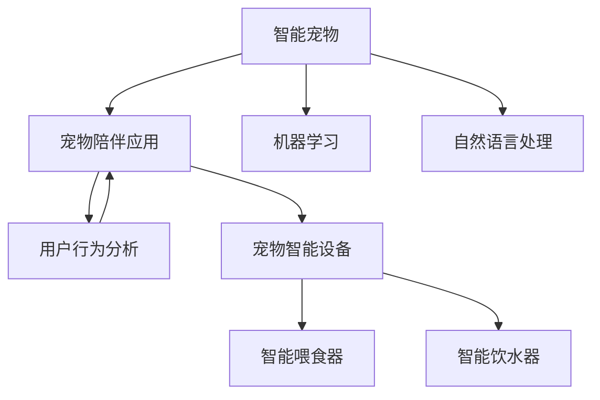

                 

# 智能宠物创业：科技赋能的宠物陪伴

> 关键词：智能宠物、科技创业、宠物陪伴、机器学习、自然语言处理、用户行为分析、用户个性化、用户体验、宠物智能设备、宠物健康监测、宠物行为识别

## 1. 背景介绍

### 1.1 问题由来
随着现代社会的快节奏生活，越来越多的人选择养宠物来陪伴自己。然而，繁忙的工作让许多人难以持续地照顾宠物，尤其是长时间的陪伴。这也催生了智能宠物市场的需求，使得科技创业者和企业开始关注智能宠物这一领域的潜力和机会。

### 1.2 问题核心关键点
智能宠物创业的核心在于如何利用科技手段，为宠物提供更加智能化、人性化的陪伴体验，同时帮助主人更好地照顾宠物。这包括：
- 开发智能化宠物设备，如智能宠物喂食器、智能宠物饮水器等，实现自动化的日常护理。
- 利用机器学习技术进行宠物行为分析和健康监测，提供个性化的健康管理方案。
- 运用自然语言处理技术，让宠物陪伴应用能够理解和回应用户的指令，提升用户的互动体验。

### 1.3 问题研究意义
智能宠物创业不仅能为宠物和主人提供便利和乐趣，还能推动宠物科技领域的创新和发展。通过智能化的陪伴和护理，宠物能够获得更健康、快乐的生活，主人也能够获得更多的陪伴和满足感。

## 2. 核心概念与联系

### 2.1 核心概念概述

为更好地理解智能宠物创业的科技手段和商业模式，本节将介绍几个密切相关的核心概念：

- 智能宠物：指使用科技手段进行监测和管理，能够自主行为和互动的宠物。
- 宠物陪伴应用：提供虚拟宠物陪伴服务的应用程序，使用自然语言处理技术，能够回应用户的指令和情绪。
- 机器学习：通过算法从数据中学习规律，为宠物提供个性化的健康管理和行为分析。
- 自然语言处理：使计算机能够理解和生成人类语言的技术，提升宠物陪伴应用的用户体验。
- 用户行为分析：通过收集和分析用户的数据，了解用户需求和行为模式，进行个性化推荐和优化。
- 宠物智能设备：如智能宠物喂食器、智能宠物饮水器等，具备自动监测和控制功能。

这些核心概念之间的逻辑关系可以通过以下Mermaid流程图来展示：



这个流程图展示了几类核心概念及其之间的关系：

1. 智能宠物通过宠物智能设备获取数据。
2. 机器学习技术对数据进行分析，提供个性化的健康管理和行为分析。
3. 自然语言处理技术使宠物陪伴应用能够回应用户指令，提升用户体验。
4. 用户行为分析帮助优化应用和设备，更好地满足用户需求。
5. 宠物智能设备如智能喂食器、饮水器等，通过数据和算法提升自主行为能力。

这些概念共同构成了智能宠物创业的科技基础，使得宠物能够获得更智能、舒适的陪伴。

## 3. 核心算法原理 & 具体操作步骤
### 3.1 算法原理概述

智能宠物创业的科技手段主要基于机器学习、自然语言处理等算法。其核心思想是：通过收集宠物的行为数据和用户反馈数据，训练机器学习模型，使其能够预测宠物需求、优化喂食、监测健康，并与用户进行自然的交互。

形式化地，假设训练数据集为 $\{(x_i, y_i)\}_{i=1}^N$，其中 $x_i$ 为行为数据或指令文本，$y_i$ 为宠物行为或健康状态。微调的目标是找到最优模型参数 $\theta$，使得模型能够准确预测新数据。

具体步骤包括：
1. 数据收集：通过传感器收集宠物行为数据，或者用户手动记录宠物的行为和状态。
2. 数据预处理：对数据进行清洗、归一化等预处理，以便后续模型训练。
3. 模型训练：使用机器学习算法（如决策树、随机森林、神经网络等）对数据进行建模，训练模型预测宠物需求。
4. 模型验证：在验证集上评估模型的准确性和泛化能力，调整模型参数。
5. 模型应用：将训练好的模型部署到智能宠物设备或陪伴应用中，实现对宠物的实时监测和管理。

### 3.2 算法步骤详解

以下我们将详细讲解智能宠物创业中的核心算法步骤。

**Step 1: 数据收集与预处理**

智能宠物创业首先需要收集大量宠物行为数据。以下是几种常见的数据收集方法：

- **传感器数据**：通过智能喂食器、饮水器等设备收集宠物的饮食、饮水、活动等数据。
- **视频和图像数据**：通过摄像头记录宠物的行为视频或图像，用于行为分析和情绪识别。
- **用户输入**：用户通过APP或网页输入宠物的当前状态和需求，如喂食时间、运动时间等。

数据收集后，需要对数据进行预处理，以去除噪声和冗余信息：

- 数据清洗：去除异常数据和缺失值。
- 特征提取：从原始数据中提取有用的特征，如饮食量、运动距离等。
- 归一化：将数据按比例缩放，使得模型能够更好地学习。
- 数据增强：通过数据扩充和扩样，增加训练数据的多样性。

**Step 2: 模型训练与验证**

选择合适的机器学习算法，对预处理后的数据进行训练。常用的算法包括：

- **决策树和随机森林**：适用于处理分类和回归问题。
- **深度学习模型**：如卷积神经网络（CNN）、循环神经网络（RNN）、Transformer等，适用于处理复杂的序列数据和图像数据。
- **强化学习**：通过与环境的交互学习最优策略，适用于训练自动喂食、自动洒药等控制类任务。

模型训练过程中，使用交叉验证等方法评估模型性能，避免过拟合。

**Step 3: 模型应用与优化**

将训练好的模型部署到智能设备或应用程序中，实现对宠物的实时监测和管理。

- **智能喂食器**：根据预测的饮食需求，自动控制喂食量和时间。
- **智能饮水器**：监测饮水状态，及时补充饮水，避免缺水。
- **宠物陪伴应用**：根据用户指令和反馈，进行情绪识别和互动。

在应用过程中，持续收集反馈数据，对模型进行优化，提升预测准确性和用户体验。

### 3.3 算法优缺点

智能宠物创业的算法主要优点包括：
- 自动化和智能化：通过智能设备和机器学习模型，实现宠物的自主行为和实时管理。
- 个性化服务：根据宠物行为和用户反馈，提供个性化的健康管理和陪伴体验。
- 实时性：数据实时收集和处理，快速响应宠物需求。

同时，这些算法也存在一些局限性：
- 数据隐私问题：宠物数据涉及隐私，需要确保数据收集和处理的安全性。
- 设备成本高：智能设备需要较高的初始投资，普通用户可能难以负担。
- 算法复杂度高：复杂算法需要高性能计算资源，对硬件要求较高。
- 用户依赖度高：宠物主人需要熟悉应用和设备的使用，才能享受其便利。

尽管存在这些局限性，但智能宠物创业的科技手段已经展现出强大的潜力，为宠物和主人的生活带来更多乐趣和便利。

### 3.4 算法应用领域

智能宠物创业的算法技术主要应用于以下几个领域：

- **智能喂食器和饮水器**：通过机器学习预测宠物饮食需求，自动控制喂食和饮水。
- **健康监测系统**：使用传感器和机器学习模型，监测宠物的健康状况，如体重、心率等。
- **行为分析应用**：利用自然语言处理技术，分析宠物行为和情绪，提供个性化的陪伴和训练方案。
- **宠物陪伴应用**：提供虚拟宠物陪伴服务，回应用户指令，提供互动体验。

除了上述这些核心应用领域，智能宠物创业的算法还在宠物教育、宠物游戏等多个场景中得到应用。

## 4. 数学模型和公式 & 详细讲解 & 举例说明

### 4.1 数学模型构建

以下将使用数学语言对智能宠物创业中的关键算法进行更加严格的刻画。

假设智能喂食器需要预测宠物的饮食需求，训练数据集为 $\{(x_i, y_i)\}_{i=1}^N$，其中 $x_i$ 为饮食量，$y_i$ 为是否进食（0或1）。使用随机森林算法，构建预测模型：

$$
\hat{y}_i = \sum_{j=1}^d \theta_j f_j(x_i)
$$

其中 $f_j$ 为随机森林中的第 $j$ 个决策树，$\theta_j$ 为决策树对应的参数。

### 4.2 公式推导过程

以下将详细推导随机森林预测模型的公式：

假设训练数据集为 $\{(x_i, y_i)\}_{i=1}^N$，其中 $x_i \in \mathcal{X}, y_i \in \{0,1\}$。构建随机森林模型，需要选择一个合适的决策树结构和参数。假设随机森林由 $m$ 棵决策树组成，每棵树的结构和参数为 $n$，则预测模型为：

$$
\hat{y}_i = \sum_{j=1}^m \hat{y}_{i,j}
$$

其中 $\hat{y}_{i,j}$ 为第 $j$ 棵树对样本 $i$ 的预测结果，可由以下公式计算：

$$
\hat{y}_{i,j} = \sum_{k=1}^n \theta_k^j f_k(x_i)
$$

其中 $f_k(x_i)$ 为第 $k$ 个特征在决策树 $j$ 中的决策规则，$\theta_k^j$ 为决策树 $j$ 对应的参数。

### 4.3 案例分析与讲解

以下将给出智能喂食器中随机森林预测模型的案例分析。

假设智能喂食器收集到以下数据：

| 饮食量（g） | 是否进食（0/1） |
|------------|---------------|
| 50         | 1             |
| 60         | 1             |
| 40         | 0             |
| 100        | 1             |

使用随机森林算法，对数据进行建模。随机森林由两棵树组成，第一棵树的规则为：

$$
f_1(x) = \begin{cases}
0 & x \leq 60 \\
1 & x > 60
\end{cases}
$$

第二棵树的规则为：

$$
f_2(x) = \begin{cases}
0 & x \leq 50 \\
1 & x > 50
\end{cases}
$$

预测模型为：

$$
\hat{y}_i = \frac{1}{2} \hat{y}_{i,1} + \frac{1}{2} \hat{y}_{i,2}
$$

其中 $\hat{y}_{i,1}$ 和 $\hat{y}_{i,2}$ 分别为第一棵树和第二棵树的预测结果。

假设要预测新的饮食量 $x=70$ 的进食情况，计算得：

$$
\hat{y}_{i,1} = \begin{cases}
0 & x \leq 60 \\
1 & x > 60
\end{cases} = 1
$$

$$
\hat{y}_{i,2} = \begin{cases}
0 & x \leq 50 \\
1 & x > 50
\end{cases} = 1
$$

$$
\hat{y}_i = \frac{1}{2} \times 1 + \frac{1}{2} \times 1 = 1
$$

因此，模型预测结果为进食。

## 5. 项目实践：代码实例和详细解释说明

### 5.1 开发环境搭建

在进行智能宠物创业的项目实践前，需要先准备好开发环境。以下是使用Python进行机器学习项目开发的环境配置流程：

1. 安装Anaconda：从官网下载并安装Anaconda，用于创建独立的Python环境。

2. 创建并激活虚拟环境：
```bash
conda create -n ml-env python=3.8 
conda activate ml-env
```

3. 安装Python库：
```bash
conda install numpy pandas scikit-learn matplotlib tqdm jupyter notebook ipython
```

4. 安装机器学习库：
```bash
conda install scikit-learn 
```

完成上述步骤后，即可在`ml-env`环境中开始智能宠物创业的项目实践。

### 5.2 源代码详细实现

以下以智能喂食器为例，给出使用随机森林算法进行预测的PyTorch代码实现。

首先，导入必要的库和数据：

```python
import numpy as np
from sklearn.ensemble import RandomForestClassifier
from sklearn.model_selection import train_test_split
from sklearn.metrics import accuracy_score

# 假设数据如下
X = np.array([[50], [60], [40], [100]])
y = np.array([1, 1, 0, 1])
```

然后，训练和测试模型：

```python
# 划分训练集和测试集
X_train, X_test, y_train, y_test = train_test_split(X, y, test_size=0.2, random_state=42)

# 训练模型
clf = RandomForestClassifier(n_estimators=2, random_state=42)
clf.fit(X_train, y_train)

# 测试模型
y_pred = clf.predict(X_test)
accuracy = accuracy_score(y_test, y_pred)
print("Accuracy:", accuracy)
```

最后，分析模型预测结果：

```python
# 假设要预测新的饮食量70
new_x = np.array([[70]])
y_new_pred = clf.predict(new_x)
print("Predicted:", y_new_pred)
```

以上就是使用PyTorch对智能喂食器进行预测的完整代码实现。可以看到，借助机器学习库，我们能够快速搭建和验证预测模型。

### 5.3 代码解读与分析

让我们再详细解读一下关键代码的实现细节：

**导入库和数据**：
- `numpy`：用于创建和处理数组。
- `sklearn.ensemble.RandomForestClassifier`：用于训练随机森林模型。
- `sklearn.model_selection.train_test_split`：用于数据集划分。
- `sklearn.metrics.accuracy_score`：用于计算模型准确率。

**数据划分**：
- `train_test_split`方法：将数据集分为训练集和测试集。
- `test_size`：测试集占总数据集的比例。
- `random_state`：随机种子，确保结果可复现。

**模型训练**：
- `RandomForestClassifier`方法：创建一个随机森林模型，指定决策树数量和随机种子。
- `fit`方法：使用训练集训练模型。

**模型测试**：
- `predict`方法：对测试集进行预测。
- `accuracy_score`方法：计算预测准确率。

**预测分析**：
- `new_x`：新预测的样本。
- `predict`方法：对新样本进行预测。

可以看到，使用Python的机器学习库，智能喂食器的预测模型可以快速实现。开发者可以根据具体需求，进行更复杂的模型训练和优化。

## 6. 实际应用场景

### 6.1 智能喂食器和饮水器

智能喂食器和饮水器是智能宠物创业的核心应用之一，通过机器学习算法对宠物的饮食需求进行预测和控制。具体应用场景如下：

- **自动喂食**：根据宠物的饮食量和活动情况，自动控制喂食量和时间，保证宠物的健康饮食。
- **智能饮水**：监测饮水状态，及时补充饮水，避免缺水问题。
- **行为分析**：通过视频和传感器数据，分析宠物的饮食行为，提供个性化的健康管理建议。

### 6.2 健康监测系统

健康监测系统通过传感器和机器学习模型，实时监测宠物的健康状况，帮助主人及时发现和处理问题。具体应用场景如下：

- **体重监测**：使用电子秤测量宠物体重，分析体重变化趋势，及时调整饮食和运动方案。
- **心率监测**：使用心率监测器，实时监测宠物的心率变化，及时发现心脏疾病等健康问题。
- **行为监测**：使用摄像头和传感器，监测宠物的行为状态，如睡眠、运动等，提供健康报告。

### 6.3 行为分析应用

行为分析应用通过自然语言处理技术，分析宠物的行为和情绪，提供个性化的陪伴和训练方案。具体应用场景如下：

- **情绪识别**：通过分析宠物的行为视频和音频，识别宠物的情绪状态，提供陪伴和安抚。
- **行为训练**：通过分析宠物的行为数据，制定个性化的训练计划，提升宠物的智能和技能。
- **智能玩具**：通过分析宠物的喜好和行为，推荐适合的玩具，提升宠物的娱乐体验。

### 6.4 宠物陪伴应用

宠物陪伴应用通过虚拟宠物和用户交互，提供情感支持和互动体验。具体应用场景如下：

- **虚拟宠物**：通过自然语言处理技术，回应用户的指令和情绪，提供虚拟宠物的陪伴。
- **智能聊天**：通过聊天机器人，与用户进行自然的对话，提供情感支持和心理辅导。
- **行为监测**：通过视频和传感器数据，监测宠物的行为状态，提供健康报告和建议。

## 7. 工具和资源推荐

### 7.1 学习资源推荐

为了帮助开发者系统掌握智能宠物创业的科技手段和商业模式，这里推荐一些优质的学习资源：

1. 《Python机器学习》：西瓜书，介绍机器学习的基础知识和常用算法，适合初学者入门。
2. 《深度学习》：Ian Goodfellow著，深入讲解深度学习理论和算法，适合进阶学习。
3. 《自然语言处理综论》：Stanford University课程，全面介绍NLP技术和应用，适合高级学习。
4. 《Python数据科学手册》：Jake VanderPlas著，介绍数据科学和机器学习的工具和技术，适合综合学习。
5. Kaggle机器学习竞赛：参与实际项目，提升实践能力，积累经验。

通过对这些资源的学习实践，相信你一定能够快速掌握智能宠物创业的科技手段，并用于解决实际的宠物问题。

### 7.2 开发工具推荐

高效的开发离不开优秀的工具支持。以下是几款用于智能宠物创业开发的常用工具：

1. Jupyter Notebook：开源的交互式计算环境，支持Python和机器学习库。
2. TensorBoard：TensorFlow配套的可视化工具，用于监控模型训练状态和结果。
3. HuggingFace Transformers库：提供预训练语言模型和机器学习库，方便模型训练和部署。
4. Scikit-learn：开源的机器学习库，提供多种常用的机器学习算法和工具。
5. Pandas：数据处理和分析库，方便数据清洗和特征提取。

合理利用这些工具，可以显著提升智能宠物创业的开发效率，加快创新迭代的步伐。

### 7.3 相关论文推荐

智能宠物创业的技术发展源于学界的持续研究。以下是几篇奠基性的相关论文，推荐阅读：

1. "Deep Reinforcement Learning for Dynamic System Control"：将深度强化学习应用于智能喂食器的控制问题，提升自主行为能力。
2. "Animal Emotion Recognition"：通过视频和音频数据，识别宠物的情绪状态，提升陪伴体验。
3. "Predicting Pet Health via Machine Learning"：使用机器学习算法，预测宠物的健康状况，提升健康管理。
4. "Smart Pet Care with IoT"：介绍基于IoT的智能宠物系统，实现宠物的实时监测和管理。
5. "Machine Learning in Pet Care"：介绍机器学习在宠物行为分析和健康管理中的应用。

这些论文代表了大模型微调技术的发展脉络。通过学习这些前沿成果，可以帮助研究者把握学科前进方向，激发更多的创新灵感。

## 8. 总结：未来发展趋势与挑战

### 8.1 总结

本文对智能宠物创业中的科技手段和商业模式进行了全面系统的介绍。首先阐述了智能宠物创业的背景和意义，明确了科技手段在提升宠物生活质量方面的独特价值。其次，从原理到实践，详细讲解了机器学习、自然语言处理等算法在智能宠物创业中的核心步骤，给出了智能喂食器、健康监测系统的完整代码实现。同时，本文还广泛探讨了智能宠物创业在智能喂食器、健康监测、行为分析、宠物陪伴等多个领域的应用前景，展示了科技手段在宠物生活中的广泛应用。

通过本文的系统梳理，可以看到，智能宠物创业已经具备了强大的技术基础和应用潜力，为宠物和主人带来更智能化、人性化的陪伴体验。未来，伴随科技手段的不断进步，智能宠物创业必将在更多领域得到应用，为宠物和主人的生活带来更多乐趣和便利。

### 8.2 未来发展趋势

展望未来，智能宠物创业将呈现以下几个发展趋势：

1. **多模态智能**：结合图像、声音、传感器等多模态数据，提供更加全面和准确的宠物行为分析。
2. **个性化定制**：通过机器学习和用户反馈，提供个性化的饮食、训练和陪伴方案。
3. **实时交互**：利用自然语言处理技术，实现与宠物的自然语言交互，提升陪伴体验。
4. **自动化控制**：通过机器学习算法，实现智能喂食、饮水、健康监测等自动化控制。
5. **数据安全和隐私保护**：加强数据加密和安全传输，保护宠物隐私和数据安全。
6. **跨平台应用**：实现跨设备、跨平台的数据共享和应用，提升用户体验。

这些趋势凸显了智能宠物创业的广阔前景，推动宠物科技领域的创新和发展。

### 8.3 面临的挑战

尽管智能宠物创业已经取得了一些进展，但在迈向更加智能化、普适化应用的过程中，仍面临诸多挑战：

1. **数据隐私问题**：宠物数据涉及隐私，需要确保数据收集和处理的安全性。
2. **硬件成本高**：智能设备需要较高的初始投资，普通用户可能难以负担。
3. **算法复杂度高**：复杂算法需要高性能计算资源，对硬件要求较高。
4. **用户依赖度高**：宠物主人需要熟悉应用和设备的使用，才能享受其便利。
5. **数据质量问题**：数据收集和标注的准确性和完整性直接影响模型效果。
6. **算法鲁棒性问题**：算法在面对异常数据和噪声时，容易产生误判。

尽管存在这些挑战，但智能宠物创业的科技手段已经展现出强大的潜力，为宠物和主人的生活带来更多乐趣和便利。相信随着科技手段的不断进步和应用实践的积累，这些挑战终将一一被克服，智能宠物创业必将在更多领域得到应用，为宠物和主人的生活带来更多乐趣和便利。

### 8.4 研究展望

面对智能宠物创业所面临的种种挑战，未来的研究需要在以下几个方面寻求新的突破：

1. **多模态数据融合**：结合图像、声音、传感器等多模态数据，提升宠物行为分析和健康监测的准确性。
2. **个性化推荐系统**：利用机器学习算法，提供个性化的饮食、训练和陪伴方案。
3. **实时交互系统**：利用自然语言处理技术，实现与宠物的自然语言交互，提升陪伴体验。
4. **数据安全和隐私保护**：加强数据加密和安全传输，保护宠物隐私和数据安全。
5. **自动化控制算法**：开发更加高效、鲁棒的自动化控制算法，实现智能喂食、饮水、健康监测等自动化控制。
6. **跨平台应用**：实现跨设备、跨平台的数据共享和应用，提升用户体验。

这些研究方向的探索，必将引领智能宠物创业技术迈向更高的台阶，为宠物和主人的生活带来更多乐趣和便利。面向未来，智能宠物创业需要从数据、算法、设备、应用等多个维度协同发力，共同推动宠物科技领域的创新和发展。

## 9. 附录：常见问题与解答

**Q1：智能宠物创业的主要技术手段有哪些？**

A: 智能宠物创业的主要技术手段包括：
- 机器学习：通过算法对宠物行为数据进行分析，提供个性化的健康管理和行为分析。
- 自然语言处理：回应用户指令，提供虚拟宠物陪伴和互动体验。
- 传感器技术：收集宠物的饮食、运动、健康等数据，实现实时监测和管理。

这些技术手段共同构成了智能宠物创业的科技基础，使得宠物能够获得更智能、舒适的陪伴。

**Q2：如何确保智能宠物设备的数据隐私安全？**

A: 确保智能宠物设备的数据隐私安全，需要从以下几个方面入手：
- 数据加密：对传输和存储的数据进行加密处理，防止数据泄露。
- 匿名化处理：去除数据中的敏感信息，保护用户隐私。
- 访问控制：严格限制设备数据的访问权限，防止未授权的访问。
- 安全传输：使用HTTPS等安全协议，确保数据传输的安全性。
- 安全存储：对设备存储的数据进行加密和安全存储，防止数据泄露。

通过这些措施，可以有效保护智能宠物设备的数据隐私和安全。

**Q3：智能宠物设备的主要功能有哪些？**

A: 智能宠物设备的主要功能包括：
- 智能喂食器：根据宠物的饮食需求，自动控制喂食量和时间。
- 智能饮水器：监测饮水状态，及时补充饮水，避免缺水问题。
- 健康监测系统：使用传感器和机器学习模型，实时监测宠物的健康状况，提供个性化的健康管理方案。
- 行为分析应用：通过自然语言处理技术，分析宠物的行为和情绪，提供个性化的陪伴和训练方案。
- 宠物陪伴应用：通过虚拟宠物和用户交互，提供情感支持和互动体验。

这些功能使得智能宠物设备能够全面提升宠物和主人的生活质量。

**Q4：智能宠物创业在实际应用中需要注意哪些问题？**

A: 智能宠物创业在实际应用中需要注意以下几个问题：
- 数据隐私问题：确保数据收集和处理的安全性。
- 设备成本问题：控制智能设备的成本，提高用户可负担性。
- 算法鲁棒性问题：确保算法的准确性和鲁棒性，避免误判。
- 用户依赖问题：提供简单易用的设备和技术，减少用户的学习成本。
- 数据质量问题：保证数据收集和标注的准确性和完整性，提升模型效果。
- 跨平台问题：实现跨设备、跨平台的数据共享和应用，提升用户体验。

通过关注这些关键问题，可以有效提升智能宠物创业的应用效果和用户满意度。

**Q5：智能宠物创业的未来发展方向有哪些？**

A: 智能宠物创业的未来发展方向包括：
- 多模态智能：结合图像、声音、传感器等多模态数据，提供更加全面和准确的宠物行为分析。
- 个性化定制：通过机器学习和用户反馈，提供个性化的饮食、训练和陪伴方案。
- 实时交互：利用自然语言处理技术，实现与宠物的自然语言交互，提升陪伴体验。
- 自动化控制：通过机器学习算法，实现智能喂食、饮水、健康监测等自动化控制。
- 数据安全和隐私保护：加强数据加密和安全传输，保护宠物隐私和数据安全。
- 跨平台应用：实现跨设备、跨平台的数据共享和应用，提升用户体验。

这些发展方向凸显了智能宠物创业的广阔前景，推动宠物科技领域的创新和发展。

