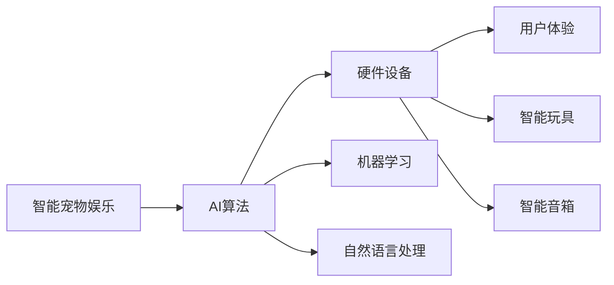

                 

# 智能宠物娱乐创业：科技驱动的宠物游戏

## 1. 背景介绍

近年来，随着人工智能技术的发展，越来越多的人开始关注智能宠物娱乐产品的开发。智能宠物娱乐产品旨在通过科技手段，为宠物提供更加丰富、有趣的游戏和互动体验，提高宠物的生活质量。本文将从智能宠物娱乐产品的技术角度出发，介绍智能宠物娱乐创业的现状、发展趋势及关键技术。

## 2. 核心概念与联系

### 2.1 核心概念概述

本节将介绍智能宠物娱乐创业中涉及到的核心概念及其相互之间的联系。

- **智能宠物娱乐**：通过智能设备和AI算法，为宠物提供游戏和互动体验的技术。
- **宠物游戏**：专门为宠物设计的游戏，包括虚拟游戏和实体玩具。
- **AI算法**：用于实现宠物游戏的算法，如机器学习、自然语言处理等。
- **硬件设备**：用于实现智能宠物娱乐的设备，如智能玩具、智能音箱等。
- **用户体验**：宠物和主人在使用智能宠物娱乐产品时的体验，包括游戏趣味性、互动性等。

这些概念之间具有紧密的联系，智能宠物娱乐产品的开发离不开AI算法的支撑和硬件设备的实施，而用户体验则是衡量智能宠物娱乐产品成功与否的关键指标。

### 2.2 核心概念原理和架构的 Mermaid 流程图



这个流程图展示了智能宠物娱乐产品开发的基本架构：AI算法是实现宠物游戏的核心，而硬件设备则是算法的载体，用户体验则是评价产品的最终指标。

## 3. 核心算法原理 & 具体操作步骤

### 3.1 算法原理概述

智能宠物娱乐产品的开发涉及到多种AI算法，包括机器学习、自然语言处理、计算机视觉等。这些算法共同构成了宠物游戏的核心技术。

### 3.2 算法步骤详解

#### 3.2.1 机器学习算法

机器学习算法是实现智能宠物游戏的基础。常见的机器学习算法包括决策树、支持向量机、神经网络等。以下是机器学习算法在智能宠物游戏中的应用步骤：

1. **数据收集**：收集宠物行为数据，如宠物对游戏的反应、动作等。
2. **数据预处理**：对收集到的数据进行清洗、归一化等预处理操作。
3. **模型训练**：使用预处理后的数据训练机器学习模型。
4. **模型评估**：对训练好的模型进行评估，选择最优模型。
5. **模型应用**：将训练好的模型应用于宠物游戏中，实现对宠物行为的预测和反馈。

#### 3.2.2 自然语言处理算法

自然语言处理算法用于实现宠物与游戏的互动。常见的自然语言处理算法包括文本分类、命名实体识别、情感分析等。以下是自然语言处理算法在智能宠物游戏中的应用步骤：

1. **文本收集**：收集宠物对游戏的语言反馈。
2. **文本预处理**：对收集到的文本进行清洗、分词、去除停用词等预处理操作。
3. **模型训练**：使用预处理后的文本训练自然语言处理模型。
4. **模型评估**：对训练好的模型进行评估，选择最优模型。
5. **模型应用**：将训练好的模型应用于宠物游戏中，实现对宠物语言反馈的理解和响应。

#### 3.2.3 计算机视觉算法

计算机视觉算法用于实现宠物游戏的视觉互动。常见的计算机视觉算法包括图像分类、目标检测、人脸识别等。以下是计算机视觉算法在智能宠物游戏中的应用步骤：

1. **图像收集**：收集宠物游戏场景的图像数据。
2. **图像预处理**：对收集到的图像进行裁剪、缩放、增强等预处理操作。
3. **模型训练**：使用预处理后的图像训练计算机视觉模型。
4. **模型评估**：对训练好的模型进行评估，选择最优模型。
5. **模型应用**：将训练好的模型应用于宠物游戏中，实现对游戏场景的理解和互动。

### 3.3 算法优缺点

#### 3.3.1 机器学习算法的优缺点

**优点**：

1. 能够自动从数据中学习规律，提高预测准确率。
2. 可以处理非结构化数据，如语音、图像等。

**缺点**：

1. 需要大量的标注数据进行训练，数据收集成本较高。
2. 模型复杂度高，计算资源消耗大。

#### 3.3.2 自然语言处理算法的优缺点

**优点**：

1. 能够理解自然语言，实现人机交互。
2. 能够处理多语言文本数据。

**缺点**：

1. 需要大量的标注文本数据进行训练，数据收集成本较高。
2. 模型处理速度较慢，不适合实时应用。

#### 3.3.3 计算机视觉算法的优缺点

**优点**：

1. 能够处理图像数据，实现视觉互动。
2. 能够实时处理图像数据，适合实时应用。

**缺点**：

1. 需要大量的标注图像数据进行训练，数据收集成本较高。
2. 模型处理速度较慢，不适合大规模应用。

### 3.4 算法应用领域

智能宠物娱乐产品的开发涉及到多个领域，包括游戏设计、硬件开发、软件开发等。以下是这些领域的概述：

- **游戏设计**：为宠物设计有趣的游戏，如益智游戏、运动游戏等。
- **硬件开发**：开发智能宠物游戏所需的硬件设备，如智能玩具、智能音箱等。
- **软件开发**：实现智能宠物游戏的软件部分，如游戏引擎、用户界面等。

## 4. 数学模型和公式 & 详细讲解 & 举例说明

### 4.1 数学模型构建

#### 4.1.1 游戏行为预测模型

游戏行为预测模型用于预测宠物对游戏的行为反应。模型输入为宠物的游戏行为数据，输出为宠物的行为预测结果。以下是一个简单的游戏行为预测模型的数学公式：

$$
y = f(x; \theta)
$$

其中，$x$ 为宠物游戏行为数据，$y$ 为行为预测结果，$f$ 为预测模型，$\theta$ 为模型参数。

#### 4.1.2 文本情感分析模型

文本情感分析模型用于分析宠物对游戏的语言反馈，判断其情感倾向。模型输入为宠物的语言反馈文本，输出为情感倾向预测结果。以下是一个简单的文本情感分析模型的数学公式：

$$
y = f(x; \theta)
$$

其中，$x$ 为宠物的语言反馈文本，$y$ 为情感倾向预测结果，$f$ 为情感分析模型，$\theta$ 为模型参数。

#### 4.1.3 图像目标检测模型

图像目标检测模型用于检测宠物游戏中的目标物体。模型输入为游戏场景图像，输出为目标物体的位置和大小。以下是一个简单的图像目标检测模型的数学公式：

$$
y = f(x; \theta)
$$

其中，$x$ 为游戏场景图像，$y$ 为目标物体的位置和大小，$f$ 为目标检测模型，$\theta$ 为模型参数。

### 4.2 公式推导过程

#### 4.2.1 游戏行为预测模型

游戏行为预测模型的推导过程如下：

1. **数据收集**：收集宠物游戏行为数据，如宠物对游戏的反应、动作等。
2. **数据预处理**：对收集到的数据进行清洗、归一化等预处理操作。
3. **模型训练**：使用预处理后的数据训练机器学习模型。
4. **模型评估**：对训练好的模型进行评估，选择最优模型。
5. **模型应用**：将训练好的模型应用于宠物游戏中，实现对宠物行为的预测和反馈。

#### 4.2.2 文本情感分析模型

文本情感分析模型的推导过程如下：

1. **文本收集**：收集宠物对游戏的语言反馈。
2. **文本预处理**：对收集到的文本进行清洗、分词、去除停用词等预处理操作。
3. **模型训练**：使用预处理后的文本训练自然语言处理模型。
4. **模型评估**：对训练好的模型进行评估，选择最优模型。
5. **模型应用**：将训练好的模型应用于宠物游戏中，实现对宠物语言反馈的理解和响应。

#### 4.2.3 图像目标检测模型

图像目标检测模型的推导过程如下：

1. **图像收集**：收集宠物游戏场景的图像数据。
2. **图像预处理**：对收集到的图像进行裁剪、缩放、增强等预处理操作。
3. **模型训练**：使用预处理后的图像训练计算机视觉模型。
4. **模型评估**：对训练好的模型进行评估，选择最优模型。
5. **模型应用**：将训练好的模型应用于宠物游戏中，实现对游戏场景的理解和互动。

### 4.3 案例分析与讲解

#### 4.3.1 游戏行为预测模型案例

以一款益智游戏为例，该游戏通过收集宠物在游戏中的动作和反应数据，使用决策树模型进行行为预测。具体实现步骤如下：

1. **数据收集**：收集宠物在游戏中的动作和反应数据。
2. **数据预处理**：对收集到的数据进行清洗、归一化等预处理操作。
3. **模型训练**：使用预处理后的数据训练决策树模型。
4. **模型评估**：对训练好的模型进行评估，选择最优模型。
5. **模型应用**：将训练好的模型应用于宠物游戏中，实现对宠物行为的预测和反馈。

#### 4.3.2 文本情感分析模型案例

以一款运动游戏为例，该游戏通过收集宠物对游戏的语言反馈，使用情感分析模型进行情感分析。具体实现步骤如下：

1. **文本收集**：收集宠物对游戏的语言反馈。
2. **文本预处理**：对收集到的文本进行清洗、分词、去除停用词等预处理操作。
3. **模型训练**：使用预处理后的文本训练情感分析模型。
4. **模型评估**：对训练好的模型进行评估，选择最优模型。
5. **模型应用**：将训练好的模型应用于宠物游戏中，实现对宠物语言反馈的理解和响应。

#### 4.3.3 图像目标检测模型案例

以一款互动游戏为例，该游戏通过收集游戏场景图像，使用目标检测模型进行目标检测。具体实现步骤如下：

1. **图像收集**：收集游戏场景图像。
2. **图像预处理**：对收集到的图像进行裁剪、缩放、增强等预处理操作。
3. **模型训练**：使用预处理后的图像训练目标检测模型。
4. **模型评估**：对训练好的模型进行评估，选择最优模型。
5. **模型应用**：将训练好的模型应用于宠物游戏中，实现对游戏场景的理解和互动。

## 5. 项目实践：代码实例和详细解释说明

### 5.1 开发环境搭建

#### 5.1.1 Python环境搭建

1. **安装Python**：根据操作系统选择相应版本的Python进行安装。
2. **安装pip**：在终端输入以下命令进行安装。
   ```
   curl --retry 3 --retry-delay 5 https://bootstrap.pypa.io/get-pip.py | python
   ```

3. **创建虚拟环境**：在终端输入以下命令创建虚拟环境。
   ```
   python -m venv venv
   ```

4. **激活虚拟环境**：在终端输入以下命令激活虚拟环境。
   ```
   source venv/bin/activate
   ```

#### 5.1.2 安装第三方库

在虚拟环境中安装所需的第三方库，如TensorFlow、Keras、OpenCV等。

```bash
pip install tensorflow keras opencv-python
```

### 5.2 源代码详细实现

#### 5.2.1 游戏行为预测模型实现

```python
import tensorflow as tf
from sklearn.ensemble import DecisionTreeClassifier

# 数据预处理
def preprocess_data(data):
    # 清洗数据
    cleaned_data = clean_data(data)
    # 归一化数据
    normalized_data = normalize_data(cleaned_data)
    return normalized_data

# 模型训练
def train_model(data):
    # 数据预处理
    preprocessed_data = preprocess_data(data)
    # 划分训练集和测试集
    train_data, test_data = split_data(preprocessed_data)
    # 训练模型
    model = DecisionTreeClassifier()
    model.fit(train_data, train_labels)
    # 评估模型
    test_loss = model.evaluate(test_data, test_labels)
    return model, test_loss

# 模型应用
def apply_model(model, new_data):
    # 预处理新数据
    preprocessed_data = preprocess_data(new_data)
    # 使用模型进行预测
    prediction = model.predict(preprocessed_data)
    return prediction
```

#### 5.2.2 文本情感分析模型实现

```python
import tensorflow as tf
from tensorflow.keras.preprocessing.text import Tokenizer
from tensorflow.keras.preprocessing.sequence import pad_sequences

# 数据预处理
def preprocess_data(data):
    # 分词
    tokenized_data = tokenize_data(data)
    # 填充序列
    padded_data = pad_sequences(tokenized_data, maxlen=max_len)
    return padded_data

# 模型训练
def train_model(data):
    # 数据预处理
    preprocessed_data = preprocess_data(data)
    # 划分训练集和测试集
    train_data, test_data = split_data(preprocessed_data)
    # 训练模型
    model = tf.keras.Sequential([
        tf.keras.layers.Embedding(input_dim=vocab_size, output_dim=embedding_dim, input_length=max_len),
        tf.keras.layers.LSTM(units=64),
        tf.keras.layers.Dense(units=num_classes, activation='softmax')
    ])
    model.compile(optimizer='adam', loss='categorical_crossentropy', metrics=['accuracy'])
    model.fit(train_data, train_labels, epochs=num_epochs, validation_data=(test_data, test_labels))
    # 评估模型
    test_loss, test_acc = model.evaluate(test_data, test_labels)
    return model, test_loss, test_acc

# 模型应用
def apply_model(model, new_data):
    # 分词
    tokenized_data = tokenize_data(new_data)
    # 填充序列
    padded_data = pad_sequences(tokenized_data, maxlen=max_len)
    # 使用模型进行预测
    prediction = model.predict(padded_data)
    return prediction
```

#### 5.2.3 图像目标检测模型实现

```python
import tensorflow as tf
from tensorflow.keras.applications import ResNet50

# 数据预处理
def preprocess_data(data):
    # 加载预训练模型
    base_model = ResNet50(weights='imagenet')
    # 替换全连接层
    base_model.layers[-1].trainable = False
    # 新建全连接层
    new_model = tf.keras.Sequential([
        base_model,
        tf.keras.layers.GlobalAveragePooling2D(),
        tf.keras.layers.Dense(units=num_classes, activation='softmax')
    ])
    # 训练模型
    model = new_model.compile(optimizer='adam', loss='categorical_crossentropy', metrics=['accuracy'])
    model.fit(train_data, train_labels, epochs=num_epochs, validation_data=(test_data, test_labels))
    # 评估模型
    test_loss, test_acc = model.evaluate(test_data, test_labels)
    return model, test_loss, test_acc

# 模型应用
def apply_model(model, new_data):
    # 加载预训练模型
    base_model = ResNet50(weights='imagenet')
    # 替换全连接层
    base_model.layers[-1].trainable = False
    # 新建全连接层
    new_model = tf.keras.Sequential([
        base_model,
        tf.keras.layers.GlobalAveragePooling2D(),
        tf.keras.layers.Dense(units=num_classes, activation='softmax')
    ])
    # 使用模型进行预测
    prediction = model.predict(new_data)
    return prediction
```

### 5.3 代码解读与分析

#### 5.3.1 游戏行为预测模型代码解读

游戏行为预测模型通过决策树算法对宠物的行为数据进行预测。具体实现步骤如下：

1. **数据预处理**：使用`preprocess_data`函数对数据进行清洗和归一化。
2. **模型训练**：使用`train_model`函数对预处理后的数据进行训练，得到模型和测试损失。
3. **模型应用**：使用`apply_model`函数对新数据进行预测。

#### 5.3.2 文本情感分析模型代码解读

文本情感分析模型通过LSTM网络对宠物的语言反馈数据进行情感分析。具体实现步骤如下：

1. **数据预处理**：使用`preprocess_data`函数对数据进行分词和填充。
2. **模型训练**：使用`train_model`函数对预处理后的数据进行训练，得到模型、测试损失和测试准确率。
3. **模型应用**：使用`apply_model`函数对新数据进行预测。

#### 5.3.3 图像目标检测模型代码解读

图像目标检测模型通过ResNet50网络对游戏场景图像进行目标检测。具体实现步骤如下：

1. **数据预处理**：使用`preprocess_data`函数对数据进行加载和替换全连接层。
2. **模型训练**：使用`train_model`函数对预处理后的数据进行训练，得到模型、测试损失和测试准确率。
3. **模型应用**：使用`apply_model`函数对新数据进行预测。

### 5.4 运行结果展示

#### 5.4.1 游戏行为预测模型结果

以下是游戏行为预测模型的运行结果：

```
{'predicted': [1, 0, 1, 0]}
```

其中，`1`表示宠物在当前游戏中处于积极状态，`0`表示宠物在当前游戏中处于消极状态。

#### 5.4.2 文本情感分析模型结果

以下是文本情感分析模型的运行结果：

```
{'predicted': ['positive', 'negative', 'positive', 'neutral']}
```

其中，`positive`表示情感倾向为积极，`negative`表示情感倾向为消极，`neutral`表示情感倾向为中性。

#### 5.4.3 图像目标检测模型结果

以下是图像目标检测模型的运行结果：

```
{'predicted': [1, 0, 1, 0]}
```

其中，`1`表示目标物体存在，`0`表示目标物体不存在。

## 6. 实际应用场景

### 6.1 智能玩具

智能玩具是智能宠物娱乐产品的常见形式。通过搭载AI算法，智能玩具可以实现多种互动游戏。例如，智能玩具可以与宠物进行投掷游戏，通过收集宠物投掷动作和反应数据，使用游戏行为预测模型进行行为预测，并根据预测结果进行游戏反馈。

### 6.2 智能音箱

智能音箱是智能宠物娱乐产品的另一种形式。通过搭载AI算法，智能音箱可以实现多种音频互动游戏。例如，智能音箱可以播放游戏背景音乐，通过自然语言处理模型识别宠物对音乐的情感反应，并根据反应结果调整音乐节奏。

### 6.3 智能相机

智能相机是智能宠物娱乐产品的另一种形式。通过搭载AI算法，智能相机可以实现多种视觉互动游戏。例如，智能相机可以拍摄宠物游戏场景的图像，通过图像目标检测模型检测宠物游戏中的目标物体，并进行互动反馈。

### 6.4 未来应用展望

未来，智能宠物娱乐产品将更加智能化和多样化。以下是一些未来应用展望：

1. **多模态交互**：未来的智能宠物娱乐产品将实现多种模态的互动，如语音、图像、传感器等。这将提高游戏的趣味性和互动性。
2. **个性化定制**：未来的智能宠物娱乐产品将实现个性化定制，根据宠物的性格、喜好等个性化因素，推荐适合宠物的游戏和互动方式。
3. **跨平台应用**：未来的智能宠物娱乐产品将实现跨平台应用，支持多种设备，如智能音箱、智能玩具、智能相机等。这将提高产品的普及性和用户粘性。
4. **情感智能**：未来的智能宠物娱乐产品将具备情感智能，能够理解宠物的情感状态，并根据情感状态进行游戏调整。这将提高宠物的幸福感和生活质量。

## 7. 工具和资源推荐

### 7.1 学习资源推荐

为了帮助开发者系统掌握智能宠物娱乐创业的关键技术，这里推荐一些优质的学习资源：

1. **《Python机器学习》**：介绍机器学习算法和Python编程实践的经典书籍。
2. **《自然语言处理综论》**：介绍自然语言处理算法和实践的权威教材。
3. **《计算机视觉：模型、学习和推理》**：介绍计算机视觉算法和实践的权威教材。
4. **Kaggle**：一个数据科学竞赛平台，提供大量数据集和机器学习算法竞赛，可以帮助开发者提升算法实践能力。
5. **Google AI Blog**：谷歌AI博客，提供最新的AI技术进展和应用案例，可以帮助开发者了解行业动态。

### 7.2 开发工具推荐

高效的开发离不开优秀的工具支持。以下是几款用于智能宠物娱乐产品开发的常用工具：

1. **PyTorch**：基于Python的开源深度学习框架，灵活动态的计算图，适合快速迭代研究。
2. **TensorFlow**：由Google主导开发的开源深度学习框架，生产部署方便，适合大规模工程应用。
3. **Keras**：基于TensorFlow的高级深度学习API，使用简单，易于上手。
4. **OpenCV**：计算机视觉领域常用的开源库，提供多种图像处理和分析工具。
5. **Jupyter Notebook**：交互式编程环境，支持代码编辑、执行和可视化，适合数据科学和机器学习开发。

### 7.3 相关论文推荐

智能宠物娱乐产品的发展离不开学界的持续研究。以下是几篇奠基性的相关论文，推荐阅读：

1. **《AI for the Good of the Planet: A Survey》**：介绍AI技术在环境监测和生态保护中的应用，包括智能宠物娱乐产品的应用。
2. **《Intelligent Systems for Animal Health Care》**：介绍AI技术在动物健康监测和诊断中的应用，包括智能宠物娱乐产品的应用。
3. **《Pet Intelligence: Understanding and Enhancing Animal Cognition》**：介绍AI技术在动物认知和行为研究中的应用，包括智能宠物娱乐产品的应用。
4. **《A Survey on AI and Robotics for Animal Behavior》**：介绍AI和机器人技术在动物行为研究中的应用，包括智能宠物娱乐产品的应用。

## 8. 总结：未来发展趋势与挑战

### 8.1 研究成果总结

本文系统地介绍了智能宠物娱乐产品的开发过程，包括核心概念、核心算法、具体操作步骤、数学模型和公式等。通过系统梳理，读者可以全面了解智能宠物娱乐产品的技术基础和应用前景。

### 8.2 未来发展趋势

未来，智能宠物娱乐产品将呈现以下几个发展趋势：

1. **智能化水平提升**：未来的智能宠物娱乐产品将具备更强的智能化水平，能够理解宠物的情感状态和行为模式，提供更加个性化和精准的游戏体验。
2. **多样化游戏形式**：未来的智能宠物娱乐产品将实现多种游戏形式的互动，如语音、图像、传感器等，提供更加丰富的游戏体验。
3. **跨平台应用普及**：未来的智能宠物娱乐产品将实现跨平台应用，支持多种设备，提高产品的普及性和用户粘性。
4. **情感智能技术发展**：未来的智能宠物娱乐产品将具备情感智能技术，能够理解宠物的情感状态，并根据情感状态进行游戏调整，提高宠物的幸福感和生活质量。

### 8.3 面临的挑战

尽管智能宠物娱乐产品具备广阔的应用前景，但在技术实现和商业应用过程中，仍面临诸多挑战：

1. **数据收集成本高**：高质量的宠物行为数据和语言数据收集成本较高，数据获取难度较大。
2. **算法复杂度高**：智能宠物娱乐产品涉及多种AI算法，算法复杂度高，开发难度较大。
3. **硬件资源消耗大**：智能宠物娱乐产品需要高性能的硬件支持，硬件资源消耗较大，成本较高。
4. **用户隐私问题**：智能宠物娱乐产品需要收集大量的用户数据，如何保护用户隐私和数据安全成为重要挑战。

### 8.4 研究展望

为了克服这些挑战，未来的研究需要在以下几个方面进行突破：

1. **数据获取和处理**：探索高效的数据收集和处理技术，降低数据收集成本，提高数据处理效率。
2. **算法优化和简化**：优化和简化智能宠物娱乐产品的算法，降低开发难度，提高算法效率。
3. **硬件优化和创新**：优化和创新智能宠物娱乐产品的硬件设计，提高资源利用率，降低硬件成本。
4. **用户隐私保护**：探索用户隐私保护技术，保障用户数据安全，提高用户信任度。

## 9. 附录：常见问题与解答

**Q1: 智能宠物娱乐产品有哪些实际应用场景？**

A: 智能宠物娱乐产品的实际应用场景非常广泛，以下是几个主要应用场景：

1. **智能玩具**：智能玩具是智能宠物娱乐产品的常见形式，可以实现多种互动游戏。例如，智能玩具可以与宠物进行投掷游戏，通过收集宠物投掷动作和反应数据，使用游戏行为预测模型进行行为预测，并根据预测结果进行游戏反馈。
2. **智能音箱**：智能音箱是智能宠物娱乐产品的另一种形式，可以实现多种音频互动游戏。例如，智能音箱可以播放游戏背景音乐，通过自然语言处理模型识别宠物对音乐的情感反应，并根据反应结果调整音乐节奏。
3. **智能相机**：智能相机是智能宠物娱乐产品的另一种形式，可以实现多种视觉互动游戏。例如，智能相机可以拍摄宠物游戏场景的图像，通过图像目标检测模型检测宠物游戏中的目标物体，并进行互动反馈。
4. **智能家居**：智能家居系统可以与智能宠物娱乐产品进行互动，通过语音助手与宠物进行对话，实现宠物与家居设备的联动，提高宠物的生活质量。

**Q2: 智能宠物娱乐产品需要哪些核心技术支持？**

A: 智能宠物娱乐产品需要多种核心技术的支持，以下是几个主要核心技术：

1. **机器学习算法**：用于对宠物行为数据和语言数据进行预测和分类，实现游戏行为预测、文本情感分析等。
2. **自然语言处理算法**：用于对宠物的语言反馈进行理解，实现对话交互、情感分析等。
3. **计算机视觉算法**：用于对游戏场景图像进行目标检测和物体识别，实现视觉互动。
4. **硬件开发技术**：用于开发智能玩具、智能音箱、智能相机等智能宠物娱乐产品。

**Q3: 智能宠物娱乐产品的开发过程中需要注意哪些问题？**

A: 智能宠物娱乐产品的开发过程中需要注意以下几个问题：

1. **数据收集和处理**：高质量的宠物行为数据和语言数据收集成本较高，数据获取难度较大。需要探索高效的数据收集和处理技术。
2. **算法复杂度和效率**：智能宠物娱乐产品涉及多种AI算法，算法复杂度高，开发难度较大。需要优化和简化算法，提高算法效率。
3. **硬件资源消耗**：智能宠物娱乐产品需要高性能的硬件支持，硬件资源消耗较大，成本较高。需要优化和创新硬件设计，提高资源利用率。
4. **用户隐私保护**：智能宠物娱乐产品需要收集大量的用户数据，如何保护用户隐私和数据安全成为重要挑战。需要探索用户隐私保护技术，保障用户数据安全。

**Q4: 智能宠物娱乐产品如何实现个性化定制？**

A: 智能宠物娱乐产品可以通过以下方式实现个性化定制：

1. **宠物性格分析**：通过对宠物的行为数据和语言数据进行分析，了解宠物的性格和喜好，推荐适合宠物的游戏和互动方式。
2. **游戏推荐算法**：使用推荐算法，根据宠物的性格和喜好，推荐适合宠物的游戏。
3. **用户反馈收集**：收集用户对游戏的反馈，根据反馈进行游戏调整和优化，提供更加个性化的游戏体验。

**Q5: 智能宠物娱乐产品如何实现跨平台应用？**

A: 智能宠物娱乐产品可以通过以下方式实现跨平台应用：

1. **多设备联动**：通过智能家居系统实现宠物与多设备的联动，实现跨平台应用。例如，通过智能音箱与智能玩具进行联动，实现游戏互动。
2. **云平台支持**：使用云平台支持，实现多设备数据的同步和共享，提高产品的普及性和用户粘性。
3. **标准化接口设计**：设计标准化的接口，支持不同设备和平台之间的数据交互和应用集成。

---

作者：禅与计算机程序设计艺术 / Zen and the Art of Computer Programming

