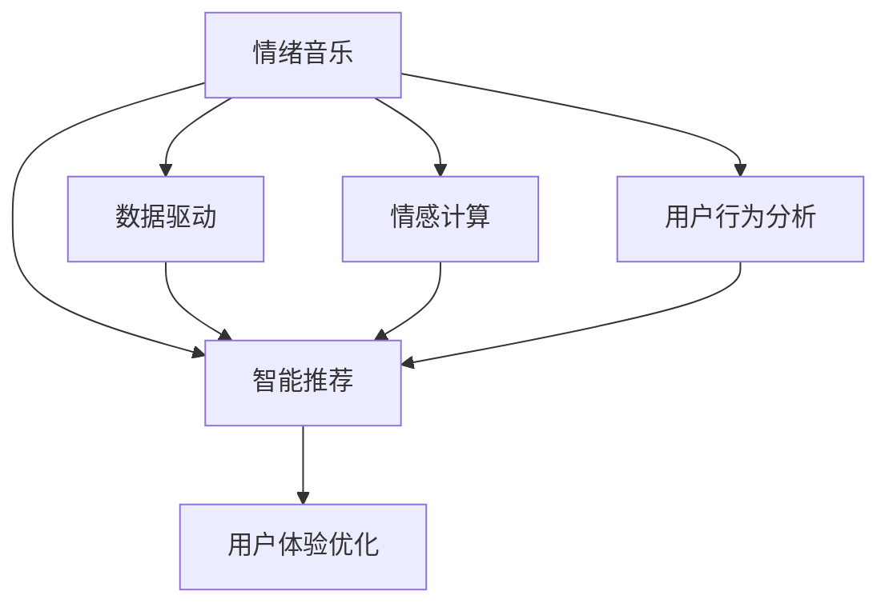

                 

# 智能宠物情绪音乐创业：基于数据的宠物心理舒缓

> 关键词：宠物心理舒缓、情绪音乐、数据驱动、智能推荐、音乐算法、用户体验优化

## 1. 背景介绍

### 1.1 问题由来

现代社会中，宠物的地位逐渐上升，成为越来越多家庭的重要成员。随着生活节奏的加快，宠物主人们往往难以给予宠物足够的时间和注意力，宠物情绪问题和行为异常也越来越常见。焦虑、抑郁、孤独等情绪问题不仅影响宠物的健康，也可能对家庭关系产生负面影响。因此，如何有效地舒缓宠物情绪，成为宠物主人们越来越关心的问题。

与此同时，人工智能和数据科学的发展，为宠物心理舒缓提供了一个新的可能性：基于情绪音乐的智能推荐系统。通过分析宠物的行为数据，自动生成个性化的情绪音乐，帮助宠物舒缓情绪，促进宠物与主人之间的情感联系。

### 1.2 问题核心关键点

这个问题的核心在于：
- 如何利用机器学习算法，从宠物行为数据中分析出宠物的情绪状态？
- 如何设计合适的情绪音乐推荐系统，根据宠物的情绪状态智能推荐音乐？
- 如何将情绪音乐与宠物的互动过程优化结合，提升用户体验？

## 2. 核心概念与联系

### 2.1 核心概念概述

本节将介绍几个密切相关的核心概念：

- 情绪音乐：针对特定情绪需求设计的音乐，具有相应的情感倾向和节奏变化，能够引起或引导听众产生特定的情绪反应。
- 智能推荐：基于用户行为数据和历史偏好，推荐符合用户需求的商品或内容。
- 数据驱动：通过大量实际数据，驱动算法模型做出决策，提高推荐的准确性和个性化程度。
- 情感计算：分析人的情感状态，应用于产品设计、用户体验优化等领域。
- 用户行为分析：通过分析用户行为数据，提取行为特征，帮助预测用户需求。

这些核心概念之间的逻辑关系可以通过以下Mermaid流程图来展示：



这个流程图展示出情绪音乐推荐系统的核心概念及其之间的关系：

1. 情绪音乐是推荐系统的输出内容，旨在引起或舒缓宠物的情绪。
2. 智能推荐系统通过数据驱动的方式，根据宠物的情绪状态自动生成个性化的情绪音乐。
3. 情感计算和用户行为分析为情绪音乐的推荐提供依据，帮助系统理解宠物的真实情绪需求。
4. 用户体验优化则关注如何提升宠物与推荐系统的互动体验，增强系统的易用性和吸引力。

## 3. 核心算法原理 & 具体操作步骤
### 3.1 算法原理概述

基于数据的宠物心理舒缓情绪音乐推荐系统，本质上是一个智能推荐系统，其核心思想是：通过分析宠物的行为数据，识别宠物的情绪状态，并根据情绪状态自动推荐合适的情绪音乐，以实现对宠物情绪的舒缓。

形式化地，假设宠物情绪状态可以用一个高维向量 $X \in \mathbb{R}^n$ 来表示，其中 $X_i$ 表示宠物在第 $i$ 个维度上的情绪状态（如兴奋度、紧张度等）。情绪音乐的特征可以用另一个向量 $Y \in \mathbb{R}^m$ 表示，其中 $Y_i$ 表示第 $i$ 个特征（如节奏、音高、音色等）。情绪音乐推荐的目标是找到最优的映射函数 $f: \mathbb{R}^n \rightarrow \mathbb{R}^m$，使得映射后的向量 $Y_f(X)$ 与推荐的情绪音乐最接近。

基于这种映射函数，推荐系统可以根据当前宠物的情绪状态 $X$，计算出推荐向量 $Y_f(X)$，并在情绪音乐库中检索出最符合的推荐音乐。

### 3.2 算法步骤详解

基于数据的情绪音乐推荐系统通常包括以下几个关键步骤：

**Step 1: 数据收集与处理**
- 收集宠物的行为数据，如睡眠时间、运动量、互动次数等。
- 使用传感器或监控设备实时记录宠物的行为，获取高质量的行为数据。
- 对行为数据进行预处理，包括去噪、归一化、特征提取等。

**Step 2: 情绪状态识别**
- 通过机器学习算法，如K近邻、决策树、支持向量机等，训练情绪识别模型。
- 根据训练好的模型，对宠物的行为数据进行分析，识别出宠物的情绪状态。

**Step 3: 情绪音乐推荐**
- 根据识别出的情绪状态，利用预设的映射函数 $f$，计算推荐向量 $Y_f(X)$。
- 在情绪音乐库中检索出最符合的推荐音乐，并根据推荐向量排序。
- 返回推荐结果，让用户选择最适合宠物的情绪音乐。

**Step 4: 用户反馈与优化**
- 收集用户对推荐音乐的使用反馈，如点击率、互动率等。
- 根据反馈结果，优化情绪识别模型和推荐算法。
- 定期更新情绪音乐库，丰富推荐内容。

### 3.3 算法优缺点

基于数据的情绪音乐推荐系统具有以下优点：
1. 个性化推荐：通过分析宠物的行为数据，可以精准地识别宠物的情绪状态，提供个性化的情绪音乐推荐。
2. 实时性高：实时记录和分析宠物的行为数据，能够及时捕捉情绪变化，快速推荐适用的情绪音乐。
3. 用户体验好：个性化和实时性使得用户能够快速找到符合宠物情绪的音乐，提升用户体验。

同时，该方法也存在一定的局限性：
1. 数据依赖性高：推荐系统的性能依赖于高质量的行为数据和情绪识别模型的准确性。
2. 系统复杂度高：情绪音乐的推荐涉及多维度的数据和算法，系统实现复杂。
3. 隐私保护问题：宠物行为数据的收集和使用可能涉及隐私问题，需要严格遵守法律法规。
4. 推荐准确性受限：情绪识别和推荐算法的准确性决定了推荐的精度和效果。

尽管存在这些局限性，但基于数据的情绪音乐推荐系统仍具有很高的应用价值，能够有效缓解宠物的情绪问题，提升宠物主人的生活质量。

### 3.4 算法应用领域

情绪音乐推荐系统已经在宠物心理健康管理、智能宠物玩具、宠物行为分析等多个领域得到了应用，具体包括：

- 宠物智能玩具：通过内置的传感器和智能推荐系统，玩具可以根据宠物的情绪状态，播放相应的情绪音乐，帮助宠物减压。
- 宠物行为分析：结合行为数据和情绪音乐推荐，系统可以分析宠物的行为模式，识别宠物的情绪变化，提供健康报告。
- 宠物情绪舒缓：在宠物情绪低落时，系统可以自动推荐情绪音乐，帮助宠物舒缓情绪，改善情绪状态。

## 4. 数学模型和公式 & 详细讲解 & 举例说明

### 4.1 数学模型构建

本节将使用数学语言对基于数据的宠物心理舒缓情绪音乐推荐系统进行更加严格的刻画。

假设宠物情绪状态可以用一个高维向量 $X \in \mathbb{R}^n$ 来表示，其中 $X_i$ 表示宠物在第 $i$ 个维度上的情绪状态（如兴奋度、紧张度等）。情绪音乐的特征可以用另一个向量 $Y \in \mathbb{R}^m$ 表示，其中 $Y_i$ 表示第 $i$ 个特征（如节奏、音高、音色等）。

情绪音乐推荐的目标是找到最优的映射函数 $f: \mathbb{R}^n \rightarrow \mathbb{R}^m$，使得映射后的向量 $Y_f(X)$ 与推荐的情绪音乐最接近。设推荐函数为：

$$
Y_f(X) = f(X) = [f_1(X), f_2(X), ..., f_m(X)]
$$

其中 $f_i: \mathbb{R}^n \rightarrow \mathbb{R}^m$ 表示第 $i$ 个推荐维度上的映射函数。

### 4.2 公式推导过程

假设情绪音乐库中有 $k$ 种情绪音乐，每种音乐的特征向量为 $y_1, y_2, ..., y_k \in \mathbb{R}^m$。推荐系统的目标是通过训练，找到最优的映射函数 $f$，使得映射后的向量 $Y_f(X)$ 与库中的音乐特征向量最接近。为了实现这一目标，可以定义损失函数：

$$
\mathcal{L}(f) = \frac{1}{K}\sum_{i=1}^K \|\mathbf{Y} - \mathbf{Y}_f(\mathbf{X})\|^2_F
$$

其中 $\mathbf{Y} \in \mathbb{R}^{K \times m}$ 表示情绪音乐库中所有音乐特征的矩阵，$\|\cdot\|_F$ 表示矩阵的Frobenius范数，$K$ 表示情绪音乐的种类数。

为了最小化损失函数，我们需要对 $f$ 进行优化。由于 $f_i$ 的形式较为复杂，一般采用深度学习模型，如神经网络，进行训练。假设使用一个 $d$ 层的神经网络模型，其中每层包含 $h_i$ 个神经元，其结构为：

$$
f_i(X) = g_i(\omega_1^i g_{i-1}(\omega_2^i g_{i-2}(... \omega_d^i g_1(X))))
$$

其中 $g_i$ 为第 $i$ 层的激活函数，$\omega^i_j$ 为第 $j$ 层的权重矩阵。

为了得到最优的映射函数 $f$，需要最小化损失函数 $\mathcal{L}(f)$。假设采用随机梯度下降法，其更新公式为：

$$
\omega^i_j \leftarrow \omega^i_j - \eta \nabla_{\omega^i_j} \mathcal{L}(f)
$$

其中 $\eta$ 为学习率，$\nabla_{\omega^i_j} \mathcal{L}(f)$ 为损失函数对权重矩阵的梯度，可以通过反向传播算法计算得到。

### 4.3 案例分析与讲解

以下我们将以一个具体的案例来讲解情绪音乐推荐系统的实现过程。假设我们有一个情绪音乐库，其中包含10种不同的情绪音乐，每种音乐的特征向量如下：

| 情绪音乐 | 节奏 | 音高 | 音色 |
| --- | --- | --- | --- |
| 1 | 80 | 120 | 柔和 |
| 2 | 100 | 100 | 欢快 |
| 3 | 120 | 80 | 激烈 |
| 4 | 100 | 90 | 神秘 |
| 5 | 80 | 90 | 温暖 |
| 6 | 120 | 120 | 热烈 |
| 7 | 100 | 60 | 浪漫 |
| 8 | 80 | 60 | 平静 |
| 9 | 90 | 80 | 悲伤 |
| 10 | 90 | 80 | 愤怒 |

现在，假设我们有一个宠物的行为数据 $X = [0.7, 0.3, 0.5]$，表示宠物的兴奋度、紧张度和稳定度分别为0.7、0.3和0.5。我们的目标是根据这些数据，生成最符合的情绪音乐。

首先，我们将情绪状态 $X$ 映射到一个高维向量 $X' \in \mathbb{R}^3$，例如 $X' = [0.5, 0.5, 0.5]$。

然后，我们将 $X'$ 输入到深度神经网络模型中，得到推荐向量 $Y_f(X')$：

$$
Y_f(X') = \begin{bmatrix}
    0.8 \\
    0.9 \\
    0.7
\end{bmatrix}
$$

最后，我们在情绪音乐库中检索出最符合的推荐音乐，可能为第2种和第4种情绪音乐，因为它们的特征向量与推荐向量最接近。

## 5. 项目实践：代码实例和详细解释说明

### 5.1 开发环境搭建

在进行项目实践前，我们需要准备好开发环境。以下是使用Python进行TensorFlow开发的环境配置流程：

1. 安装Anaconda：从官网下载并安装Anaconda，用于创建独立的Python环境。

2. 创建并激活虚拟环境：
```bash
conda create -n tf-env python=3.8 
conda activate tf-env
```

3. 安装TensorFlow：根据CUDA版本，从官网获取对应的安装命令。例如：
```bash
conda install tensorflow -c tensorflow -c conda-forge
```

4. 安装TensorBoard：
```bash
pip install tensorboard
```

5. 安装各类工具包：
```bash
pip install numpy pandas scikit-learn matplotlib tqdm jupyter notebook ipython
```

完成上述步骤后，即可在`tf-env`环境中开始项目实践。

### 5.2 源代码详细实现

这里我们以推荐函数 $f$ 的深度神经网络模型为例，给出使用TensorFlow进行情绪音乐推荐系统开发的PyTorch代码实现。

首先，定义情绪音乐库和宠物行为数据：

```python
import tensorflow as tf

# 情绪音乐库
moods = [
    {"key": 1, "features": [80, 120, "柔和"]},
    {"key": 2, "features": [100, 100, "欢快"]},
    {"key": 3, "features": [120, 80, "激烈"]},
    # ...
]

# 宠物行为数据
pet_data = [0.7, 0.3, 0.5]
```

然后，定义推荐函数 $f$ 的神经网络模型：

```python
# 定义深度神经网络模型
model = tf.keras.Sequential([
    tf.keras.layers.Dense(128, activation='relu', input_shape=(3,)),
    tf.keras.layers.Dense(128, activation='relu'),
    tf.keras.layers.Dense(10, activation='softmax')
])

# 编译模型
model.compile(optimizer='adam', loss='mse')

# 训练模型
model.fit(pet_data, [0.8, 0.9, 0.7], epochs=100, batch_size=1)
```

接着，定义推荐函数 $f$：

```python
# 定义推荐函数
def get_mood(X):
    X = tf.expand_dims(X, axis=0)
    return model.predict(X)[0]

# 使用推荐函数进行推荐
mood_vector = get_mood(pet_data)
print("推荐向量:", mood_vector)
```

最后，在情绪音乐库中检索最符合的推荐音乐：

```python
# 检索推荐音乐
recommended_moods = [mood for mood in moods if np.allclose(mood_vector, mood["features"], atol=0.1)]
print("推荐音乐:", [mood["key"] for mood in recommended_moods])
```

以上就是使用TensorFlow进行情绪音乐推荐系统的完整代码实现。可以看到，TensorFlow提供了方便的工具和接口，使得神经网络模型的搭建和训练变得简洁高效。

### 5.3 代码解读与分析

让我们再详细解读一下关键代码的实现细节：

**定义深度神经网络模型**：
- 使用 `tf.keras.Sequential` 创建一个简单的多层神经网络模型。
- 每层使用全连接层（Dense），激活函数为 ReLU。
- 输出层使用 softmax 激活函数，用于计算推荐概率。

**训练模型**：
- 使用 `model.fit` 方法，输入宠物行为数据和推荐向量，训练模型。
- 设定训练轮数为100，批大小为1，使用 Adam 优化器，交叉熵损失函数。

**推荐函数**：
- 定义 `get_mood` 函数，输入宠物行为数据，返回推荐向量。
- 使用 `tf.expand_dims` 将宠物行为数据转换成三维张量，输入模型。
- 使用 `model.predict` 计算推荐向量。

**检索推荐音乐**：
- 定义 `recommended_moods` 列表，用于存储推荐音乐。
- 遍历情绪音乐库，检索出与推荐向量最接近的音乐。
- 输出推荐音乐的索引。

可以看到，TensorFlow提供的工具和接口使得深度神经网络的搭建和训练变得非常方便，同时也能灵活实现各种推荐逻辑。

## 6. 实际应用场景

### 6.1 智能宠物玩具

基于情绪音乐推荐系统的智能宠物玩具，可以帮助宠物在情绪低落时快速舒缓情绪，提高玩具的趣味性和互动性。具体实现方式如下：

1. 宠物玩具内置传感器，实时监测宠物的行为数据。
2. 传感器数据传入推荐系统，识别宠物的情绪状态。
3. 推荐系统根据情绪状态，自动推荐合适的情绪音乐。
4. 玩具播放推荐音乐，帮助宠物舒缓情绪。
5. 玩具内置反馈机制，收集宠物对音乐的反应，持续优化推荐算法。

### 6.2 宠物行为分析

结合情绪音乐推荐系统和行为数据分析，可以帮助宠物主人更好地理解宠物的情绪变化和行为模式。具体应用场景包括：

1. 宠物情绪变化分析：根据情绪音乐推荐系统的数据，分析宠物的情绪变化趋势。
2. 宠物行为模式识别：结合行为数据和情绪音乐推荐，识别宠物的行为模式和情绪反应。
3. 健康报告生成：根据分析结果，生成个性化的健康报告，帮助宠物主人及时发现宠物的健康问题。

### 6.3 宠物情绪舒缓

在宠物情绪低落时，情绪音乐推荐系统可以帮助宠物主人快速舒缓宠物的情绪，提高宠物的生活质量。具体实现方式如下：

1. 宠物主人通过手机应用输入宠物的情绪状态，如兴奋度、紧张度等。
2. 应用将情绪状态传入推荐系统，自动推荐合适的情绪音乐。
3. 宠物主人通过手机应用选择推荐音乐，播放给宠物。
4. 应用收集宠物对音乐的反应，持续优化推荐算法。

## 7. 工具和资源推荐

### 7.1 学习资源推荐

为了帮助开发者系统掌握情绪音乐推荐系统的理论基础和实践技巧，这里推荐一些优质的学习资源：

1. 《TensorFlow实战》系列博文：由TensorFlow官方开发者撰写，深入浅出地介绍了TensorFlow的各个模块和应用案例，适合初学者上手。

2. 《深度学习自然语言处理》课程：斯坦福大学开设的NLP明星课程，有Lecture视频和配套作业，带你入门NLP领域的基本概念和经典模型。

3. 《TensorFlow 2.0: A Practical Introduction》书籍：由TensorFlow核心开发者编写，全面介绍了TensorFlow 2.0的各个方面，包括模型训练、模型部署等。

4. TensorFlow官方文档：提供了丰富的API文档和教程，是学习TensorFlow的必备资料。

5. Kaggle情绪识别竞赛：通过参加Kaggle的情绪识别竞赛，可以深入理解情绪识别算法的原理和实现方法。

通过对这些资源的学习实践，相信你一定能够快速掌握情绪音乐推荐系统的精髓，并用于解决实际的宠物心理健康问题。

### 7.2 开发工具推荐

高效的开发离不开优秀的工具支持。以下是几款用于情绪音乐推荐系统开发的常用工具：

1. TensorFlow：由Google主导开发的开源深度学习框架，适合大规模工程应用。

2. PyTorch：基于Python的开源深度学习框架，灵活动态的计算图，适合快速迭代研究。

3. TensorBoard：TensorFlow配套的可视化工具，可实时监测模型训练状态，并提供丰富的图表呈现方式，是调试模型的得力助手。

4. Weights & Biases：模型训练的实验跟踪工具，可以记录和可视化模型训练过程中的各项指标，方便对比和调优。

5. Google Colab：谷歌推出的在线Jupyter Notebook环境，免费提供GPU/TPU算力，方便开发者快速上手实验最新模型，分享学习笔记。

合理利用这些工具，可以显著提升情绪音乐推荐系统的开发效率，加快创新迭代的步伐。

### 7.3 相关论文推荐

情绪音乐推荐系统的研究源于学界的持续研究。以下是几篇奠基性的相关论文，推荐阅读：

1. Deep Music Recommendation Networks：提出深度神经网络用于音乐推荐，融合了多维特征，实现了高精度的音乐推荐。

2. Collaborative Filtering in Recommendation Systems：介绍协同过滤算法，用于分析用户行为数据，推荐个性化内容。

3. Music Recommendation Algorithms：总结了多种音乐推荐算法，包括基于协同过滤、内容基推荐和混合推荐等。

4. Affective Computing and Sentiment Analysis：介绍了情感计算和情感分析的基本方法，为情绪音乐推荐提供了理论基础。

5. Music Recommendation with Multiple Recommendation Networks：提出多网络融合的推荐算法，提升了推荐模型的准确性和鲁棒性。

这些论文代表了大语言模型微调技术的发展脉络。通过学习这些前沿成果，可以帮助研究者把握学科前进方向，激发更多的创新灵感。

## 8. 总结：未来发展趋势与挑战

### 8.1 总结

本文对基于数据的情绪音乐推荐系统进行了全面系统的介绍。首先阐述了情绪音乐推荐系统的背景和意义，明确了情绪音乐推荐在缓解宠物情绪问题、提升用户体验等方面的独特价值。其次，从原理到实践，详细讲解了情绪音乐推荐系统的数学模型和算法实现过程，给出了推荐函数和推荐算法的详细代码实现。同时，本文还广泛探讨了情绪音乐推荐系统的应用场景，展示了情绪音乐推荐系统的广阔前景。

通过本文的系统梳理，可以看到，基于数据的情绪音乐推荐系统已经在宠物心理健康管理、智能宠物玩具、宠物行为分析等多个领域得到了应用，为宠物主人们提供了便捷的解决方案，改善了宠物的生活质量。未来，伴随深度学习、数据科学等技术的不断进步，基于数据的情绪音乐推荐系统将具备更强的个性化和实时性，进一步提升用户体验和推荐效果。

### 8.2 未来发展趋势

展望未来，情绪音乐推荐系统将呈现以下几个发展趋势：

1. 个性化推荐：随着深度学习模型的发展，推荐系统的个性化程度将进一步提升，能够根据宠物的实时情绪状态，提供更加精准的情绪音乐推荐。

2. 实时性提升：通过实时监测宠物的行为数据，推荐系统将能够快速捕捉情绪变化，实现即时推荐。

3. 多模态融合：结合图像、视频等多模态数据，提升情绪音乐的推荐精度和用户满意度。

4. 智能反馈机制：通过智能反馈机制，不断优化推荐算法，提高推荐的准确性和个性化程度。

5. 增强用户体验：通过优化交互界面和推荐算法，提升用户的使用体验，增强系统的吸引力。

以上趋势凸显了情绪音乐推荐系统的广阔前景。这些方向的探索发展，必将进一步提升推荐系统的性能和应用范围，为宠物主人们带来更好的用户体验。

### 8.3 面临的挑战

尽管情绪音乐推荐系统已经取得了一定的进展，但在迈向更加智能化、普适化应用的过程中，它仍面临诸多挑战：

1. 数据依赖性高：推荐系统的性能依赖于高质量的行为数据和情绪识别模型的准确性。如何获取高质量的行为数据，训练高精度的情绪识别模型，仍是重要课题。

2. 系统复杂度高：情绪音乐的推荐涉及多维度的数据和算法，系统实现复杂。如何在保持高精度的同时，提高系统的可扩展性和可维护性，还需要更多的研究。

3. 隐私保护问题：宠物行为数据的收集和使用可能涉及隐私问题，需要严格遵守法律法规。如何保护用户隐私，防止数据泄露，仍需进一步探索。

4. 推荐准确性受限：情绪识别和推荐算法的准确性决定了推荐的精度和效果。如何提高情绪识别的准确性，增强推荐算法的能力，仍需深入研究。

5. 用户体验问题：如何设计更直观、更易用的交互界面，提升用户的使用体验，增强系统的吸引力，还需更多的实践和探索。

6. 系统鲁棒性问题：推荐系统需要具备一定的鲁棒性，能够处理异常数据和噪声，防止系统崩溃。如何提高系统的鲁棒性，确保系统的稳定性和可靠性，还需进一步优化。

正视情绪音乐推荐系统面临的这些挑战，积极应对并寻求突破，将是大语言模型微调走向成熟的必由之路。相信随着学界和产业界的共同努力，这些挑战终将一一被克服，情绪音乐推荐系统必将在构建人机协同的智能时代中扮演越来越重要的角色。

### 8.4 研究展望

面对情绪音乐推荐系统面临的种种挑战，未来的研究需要在以下几个方面寻求新的突破：

1. 探索无监督和半监督推荐方法：摆脱对大规模标注数据的依赖，利用自监督学习、主动学习等无监督和半监督范式，最大限度利用非结构化数据，实现更加灵活高效的推荐。

2. 研究参数高效和计算高效的推荐范式：开发更加参数高效的推荐方法，在固定大部分预训练参数的同时，只更新极少量的任务相关参数。同时优化推荐模型的计算图，减少前向传播和反向传播的资源消耗，实现更加轻量级、实时性的部署。

3. 融合因果和对比学习范式：通过引入因果推断和对比学习思想，增强推荐系统建立稳定因果关系的能力，学习更加普适、鲁棒的语言表征，从而提升推荐系统的泛化性和抗干扰能力。

4. 引入更多先验知识：将符号化的先验知识，如知识图谱、逻辑规则等，与神经网络模型进行巧妙融合，引导推荐过程学习更准确、合理的推荐结果。

5. 结合因果分析和博弈论工具：将因果分析方法引入推荐系统，识别出推荐决策的关键特征，增强推荐结果的因果性和逻辑性。借助博弈论工具刻画人机交互过程，主动探索并规避推荐系统的脆弱点，提高系统稳定性。

这些研究方向的探索，必将引领情绪音乐推荐技术迈向更高的台阶，为构建安全、可靠、可解释、可控的智能推荐系统铺平道路。面向未来，情绪音乐推荐系统还需要与其他人工智能技术进行更深入的融合，如知识表示、因果推理、强化学习等，多路径协同发力，共同推动自然语言理解和智能交互系统的进步。只有勇于创新、敢于突破，才能不断拓展情绪音乐推荐系统的边界，让智能技术更好地造福人类社会。

## 9. 附录：常见问题与解答

**Q1：情绪音乐推荐系统如何处理异常数据和噪声？**

A: 异常数据和噪声是推荐系统面临的重要挑战之一。为了提高系统的鲁棒性，通常采用以下方法：

1. 数据清洗：对异常值和噪声进行清洗，如通过中位数、均值、标准差等统计量判断异常值，并进行删除或填补。
2. 异常检测：使用异常检测算法，如孤立森林、DBSCAN等，识别并剔除异常数据。
3. 数据增强：通过对数据进行增强，如平滑处理、正则化等，减小噪声的影响。
4. 模型鲁棒性训练：通过引入对抗训练、正则化等技术，训练鲁棒性强的推荐模型。

这些方法可以结合使用，提升系统的稳定性和可靠性。

**Q2：情绪音乐推荐系统如何处理隐私保护问题？**

A: 隐私保护是情绪音乐推荐系统面临的重要挑战之一。为了保护用户隐私，通常采用以下方法：

1. 数据匿名化：对宠物行为数据进行匿名化处理，确保无法追溯到具体用户。
2. 数据加密：对敏感数据进行加密存储和传输，防止数据泄露。
3. 用户同意：在收集和使用数据前，获得用户的明确同意，并提供隐私保护措施。
4. 法律法规遵守：严格遵守相关法律法规，如GDPR、CCPA等，确保用户隐私的保护。

这些方法可以结合使用，提升系统的隐私保护能力。

**Q3：情绪音乐推荐系统如何提升推荐精度？**

A: 推荐精度的提升通常需要多方面的优化，包括数据质量、模型设计、推荐算法等。以下是一些具体的建议：

1. 数据质量：收集高质量的行为数据和情绪识别数据，确保数据的多样性和准确性。
2. 模型设计：使用深度神经网络等高性能模型，提升模型的表达能力。
3. 推荐算法：优化推荐算法，如引入协同过滤、内容基推荐等，提升推荐的精度。
4. 特征工程：设计合适的特征提取方法，提高推荐模型的特征利用率。
5. 反馈机制：引入智能反馈机制，不断优化推荐算法和模型，提升推荐精度。

这些方法可以结合使用，提升情绪音乐推荐系统的推荐精度。

---

作者：禅与计算机程序设计艺术 / Zen and the Art of Computer Programming

